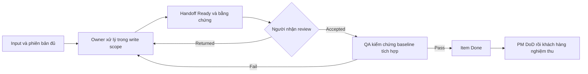

# Phối hợp AI agent và developer con người

## 1. Điều phối và quyền ghi

BA/Architect/Developer/QA/PM là trách nhiệm, không bắt buộc năm tiến trình. Điều phối giữ quyền tích hợp; nếu không có subagent thì làm tuần tự và ghi Self-reviewed đúng thực tế.

| Owner | Nguồn quản lý | Reviewer/consumer |
| :--- | :--- | :--- |
| BA | RAW/ANL/BENCH/CONF | Khách hàng duyệt scope; Architect nhận |
| Architect | SOL/DES/quyết định/Entity Registry | Developer và QA |
| Developer | Code, item được giao | Reviewer kỹ thuật, QA |
| QA | Plan/report/evidence/bug | Developer sửa; PM nhận kết luận |
| PM/điều phối | Index/cấp ID/plan/task board/log/changelog/closure | Owners cung cấp thay đổi; khách hàng nghiệm thu |

Một file một writer tại một thời điểm. Shared components/enums, migration, API spec và index có owner cụ thể. Quyền ghi khai báo đường dẫn; agent khác gửi đề xuất. Với worktree riêng, review diff/tích hợp dependency theo thứ tự, QA bản tích hợp; test nhánh con không tự chứng minh toàn bộ bản tích hợp Pass.

Ownership áp dụng trên toàn checkout/sprint, kể cả các phiên chat khác. Trước khi sửa, đọc git status và item/handoff đang In Progress; ghi claim owner/session, file và thời điểm trong item, điều phối xác nhận phân công không xung đột. Nếu chưa rõ ai sở hữu file đang thay đổi, tránh ghi file đó, làm phần độc lập và chuyển đề xuất cho điều phối/người dùng. Không coi worktree riêng là quyền tự tích hợp; không commit, reset hoặc ghi đè thay đổi ngoài write scope.

## 2. Gói phân công tối thiểu

Ghi trong item hoặc [handoff](../../docs/system/templates/HANDOFF_TEMPLATE.md):

1. Mục tiêu, AC, phạm vi/giới hạn.
2. Input link + ID/phiên bản; baseline commit hoặc working tree + file thay đổi.
3. Owner/agent cụ thể, reviewer, file được ghi, depends_on/blocks.
4. Output: file/contract/artifact/kết quả.
5. Cách kiểm chứng, môi trường cần, điều kiện hoàn thành.

Người nhận kiểm tra input đủ trước sửa. Thiếu input quan trọng ghi blocker, làm phần độc lập; không bịa approval/thiết kế/tool/kết quả.

## 3. Handoff và phản hồi

Chat dùng điều phối. Trước giao việc, lưu kết quả trong Sprint-Pack, link item→artifact→nguồn. Gói nhỏ ghi mục bàn giao trong item; nhiều artifact/consumer dùng HANDOFF riêng, không chép lại nội dung.

Người giao ghi Ready, baseline, file đổi, kiểm tra đã/chưa chạy, rủi ro, người nhận. Người nhận ghi Accepted hoặc Returned + lý do/thời điểm/hành động. Accepted chỉ là nhận đủ input, không thay QA Pass/sign-off. Re-test thất bại trả item về In Progress; QA ghi lần chạy mới, giữ kết quả cũ.

Không gọi self-review là review độc lập. Nếu thiếu reviewer riêng, ghi Self-reviewed và giữ gate cần reviewer/khách hàng Pending; trình kết quả cụ thể để review.

## 4. Dependency và đổi contract

- Chạy song song việc đủ input, không xung đột file/contract. Shared UI/models trước Web/Mobile; schema/contract trước consumer.
- Architect chốt baseline contract DB/API/enums/slots/version/consumer; Developer báo sai lệch trước tích hợp. Entity mới đăng ký registry, có migration/backup.
- Đổi scope/AC: BA xử lý; thiết kế: Architect; test matrix: QA; index: PM. Routine fix scope đã duyệt không xin lại toàn bộ confirmation.
- Ghi xung đột và nguồn, giải quyết phần được ủy quyền; hỏi khách hàng nếu đổi cam kết. Kết luận agent khác không cho phép gửi tin ra hệ thống ngoài.

## 5. Truy vết và giữ ngữ cảnh

Chuỗi `RAW → ANL/BR/US → CONF/AC → SOL/DES → FEAT/TASK/BUG → TC → report/ảnh/log → REV`. Mỗi AC có thiết kế/item/test hoặc lý do chưa triển khai. [TRACEABILITY_TEMPLATE](../../docs/system/templates/TRACEABILITY_TEMPLATE.md) giúp lập matrix, không thêm bước SDLC.

Khi dừng/đổi agent ghi trạng thái, baseline, file đổi, lệnh/kết quả, blocker, việc tiếp. Đọc item/source hiện tại khi tiếp tục, không làm lại việc xong vì thiếu chat.

Đọc tài liệu không cần bật infra. QA chỉ bật profile cần dùng, lưu baseline/môi trường, tách dữ liệu test và không đưa bí mật vào docs/ảnh.
