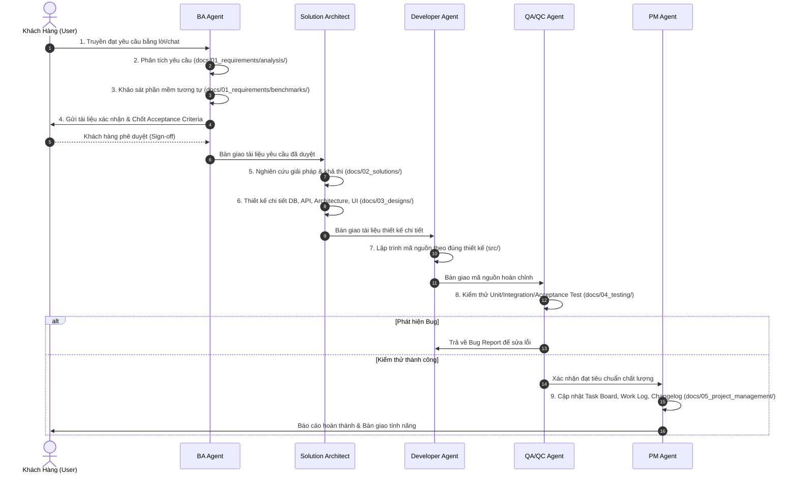

# SDLC Multi-Agent Playbook & Quy Trình Thực Thi

Playbook này hướng dẫn cách thực thi quy trình phát triển phần mềm chuẩn hóa 9 bước cho dự án `open-erp`. Mọi bước đều có đầu vào/đầu ra rõ ràng và được lưu trữ trong thư mục `docs/`.

---

## 1. Bản Đồ Quy Trình & Luồng Bàn Giao



---

## 2. Chi Tiết Từng Bước & Hành Động Cụ Thể Của Agent

### Bước 1: Tiếp Nhận Yêu Cầu Truyền Miệng (Oral Requirement Capture)
- **Role**: **BA Agent**
- **Mục tiêu**: Thu thập trung thực mọi thông tin, mong muốn từ khách hàng, không bỏ sót chi tiết dù là nhỏ nhất.
- **Hành động**:
  1. Khởi tạo thư mục Sprint Pack: `docs/sprints/sprint_XX_<tên_nghiệp_vụ>/`.
  2. Khởi tạo file điều hướng `00_READING_GUIDE.md` liệt kê lộ trình đọc tuần tự.
  3. Ghi lại nội dung trao đổi vào `01_raw_notes/RAW-XX_<tên_yêu_cầu>.md`.
  4. Ghi chú nguồn gốc, người yêu cầu, thời gian, và các từ khóa nghiệp vụ quan trọng.

### Bước 2: Phân Tích Yêu Cầu (Requirement Analysis)
- **Role**: **BA Agent**
- **Mục tiêu**: Làm rõ nghiệp vụ, xác định đối tượng sử dụng (Actors), mục tiêu nghiệp vụ (Business Goals).
- **Hành động**:
  1. Phân rã thành các User Stories theo chuẩn: `As a <role>, I want <action> so that <benefit>`.
  2. Xác định phạm vi: **In-Scope** (làm) và **Out-of-Scope** (chưa làm trong giai đoạn này).
  3. Lập danh sách quy tắc nghiệp vụ (Business Rules).
  4. Lưu tài liệu vào: `02_analysis/ANL-XX_<tên_nghiệp_vụ>.md`.

### Bước 3: Tham Khảo Các Phần Mềm Tương Tự (Benchmarking & Market Research)
- **Role**: **BA Agent**
- **Mục tiêu**: Học hỏi các best practices từ các hệ thống ERP hàng đầu (Odoo, ERPNext, SAP, NetSuite...) để thiết kế trải nghiệm tối ưu, tránh "phát minh lại bánh xe".
- **Hành động**:
  1. Nghiên cứu cách các hệ thống khác xử lý tính năng tương tự (luồng thao tác, màn hình, cấu trúc dữ liệu).
  2. Liệt kê ưu điểm và nhược điểm của từng hệ thống.
  3. Rút ra bài học áp dụng vào dự án `open-erp`.
  4. Lưu tài liệu vào: `03_benchmarks/BENCH-XX_<tên_nghiệp_vụ>.md`.

### Bước 4: Xác Nhận Lại Với Khách Hàng (Customer Alignment & Confirmation)
- **Role**: **BA Agent**
- **Mục tiêu**: Đảm bảo hai bên 100% hiểu giống nhau trước khi tốn nguồn lực kỹ thuật.
- **Hành động**:
  1. Tổng hợp thành bản tóm tắt dễ hiểu cho người làm nghiệp vụ: Luồng người dùng, các màn hình sơ bộ, tiêu chí nghiệm thu (Acceptance Criteria dạng Given-When-Then).
  2. Lưu tài liệu vào: `04_confirmation/CONF-XX_<tên_sprint>_scope.md`.
  3. Cập nhật bảng kiểm tra xác nhận trong `00_READING_GUIDE.md`.
  4. Gửi link `00_READING_GUIDE.md` cho khách hàng và xin phê duyệt trực tiếp. **CHỈ ĐI TIẾP KHI KHÁCH HÀNG ĐÃ CONFIRM**.

### Bước 5: Nghiên Cứu Giải Pháp (Solution Research & Feasibility Study)
- **Role**: **Solution Architect Agent**
- **Mục tiêu**: Lựa chọn công nghệ, thuật toán, thư viện tối ưu nhất.
- **Hành động**:
  1. Phân tích các phương án kiến trúc (Phương án A vs Phương án B).
  2. Đánh giá Trade-offs: Độ phức tạp, hiệu năng, bảo mật, khả năng mở rộng (Scalability), chi phí bảo trì.
  3. Đưa ra đề xuất phương án tối ưu và lý do lựa chọn.
  4. Lưu tài liệu vào: `05_solutions/SOL-XX_<tên_giải_pháp>.md`.

### Bước 6: Thiết Kế Giải Pháp Chi Tiết (Detailed Technical Design)
- **Role**: **Solution Architect Agent**
- **Mục tiêu**: Bản thiết kế chi tiết 100% để Developer đọc là có thể code ngay.
- **Hành động**:
  1. **Kiến trúc tổng thể**: Sơ đồ module, Sequence Diagram luồng xử lý (`docs/03_designs/architecture/`).
  2. **Thiết kế CSDL**: ERD, tên bảng, kiểu dữ liệu, ràng buộc (Foreign Key, Indexes, Enums) (`docs/03_designs/database/`).
  3. **Đặc tả API**: Phương thức, URL, Headers, Request Body, Response (200, 400, 401, 500) (`docs/03_designs/api/`).
  4. **Giao diện & Thành phần UI**: Cấu trúc Component, State, Luồng sự kiện giao diện (`docs/03_designs/ui_ux/`).

### Bước 7: Lập Trình (Implementation / Coding)
- **Role**: **Developer Agent**
- **Mục tiêu**: Viết mã nguồn chất lượng cao, chuẩn mực, bám sát bản thiết kế.
- **Hành động**:
  1. Đọc kỹ tài liệu trong `docs/03_designs/`.
  2. Viết mã nguồn trong thư mục dự án (`src/`...).
  3. Đảm bảo tuân thủ nguyên tắc Clean Code, SOLID, xử lý lỗi đầy đủ, không hard-code.
  4. **Chính sách Unit Test**:
     - **Backend (Quarkus Java)**: Bắt buộc viết Unit Test (JUnit 5 + RestAssured) bao phủ 100% logic nghiệp vụ và phân quyền dữ liệu.
     - **Frontend (Angular/Ionic)**: **TUYỆT ĐỐI KHÔNG viết Unit Test** (tiết kiệm tài nguyên và thời gian bảo trì giòn gãy khi code bằng AI).
  5. Nếu cần điều chỉnh kiến trúc hoặc DB schema, PHẢI yêu cầu Architect cập nhật tài liệu trước.

### Bước 8: Kiểm Thử (QA / QC & Verification)
- **Role**: **QA/QC Agent**
- **Mục tiêu**: Đảm bảo không có lỗi phát sinh và tính năng đáp ứng hoàn hảo tiêu chí nghiệm thu.
- **Hành động**:
  1. Lập Test Plan & Test Matrix (`docs/04_testing/test_plans/`).
  2. Viết các kịch bản kiểm thử chi tiết (Happy path, Negative path, Edge cases) (`docs/04_testing/test_cases/`).
  3. **Kiểm thử Frontend thực tế bằng Trình duyệt (Browser Manual Testing)**:
     - QA/QC bắt buộc kiểm thử trực tiếp trên Web Browser đối với Web và thiết bị/mô phỏng đối với Ionic.
     - Kiểm tra trực quan: Layout nhỏ gọn (dense/compact), viền vuông vắn sắc nét, luồng Drawer trượt mượt mà, tính đáp ứng (responsive) và không có console error.
  4. **Kiểm thử Backend**: Chạy bộ Automated Tests (JUnit 5 / RestAssured) của Quarkus Java.
  5. Tổng hợp báo cáo kiểm thử và log lỗi nếu có (`docs/04_testing/test_reports/`).
  6. Đánh dấu Pass/Fail cho tính năng.

### Bước 9: Cập Nhật Công Việc & Đóng Gói (Task Tracking & Changelog)
- **Role**: **PM Agent**
- **Mục tiêu**: Minh bạch hóa tiến độ và ghi nhận lịch sử phát triển.
- **Hành động**:
  1. Cập nhật trạng thái task trong `docs/05_project_management/task_board.md` sang **Done**.
  2. Ghi nhận nhật ký công việc vào `docs/05_project_management/work_log.md`.
  3. Cập nhật phiên bản và lịch sử thay đổi vào `docs/05_project_management/changelog.md`.
  4. Báo cáo hoàn thành cho khách hàng cùng link tài liệu và kết quả nghiệm thu.

---

## 3. Quy Trình Agile Sprint & Quản Lý Issue/Task Dạng File

### 3.1. Cấu Trúc Gói Tài Liệu Sprint Tuần Tự (Sprint-Pack)
Mỗi Sprint được tổ chức trọn gói trong thư mục riêng với thứ tự tuần tự 00 đến 09:
```
docs/sprints/sprint_XX_<tên_nghiệp_vụ>/
├── 00_READING_GUIDE.md      # BẢN ĐỒ ĐIỀU HƯỚNG BẮT ĐẦU: Lộ trình đọc tuần tự & Checklist Confirm
├── 01_raw_notes/            # Bước 1: Tiếp nhận yêu cầu thô
│   └── RAW-XX_...md
├── 02_analysis/             # Bước 2: Phân tích nghiệp vụ & User Stories
│   └── ANL-XX_...md
├── 03_benchmarks/           # Bước 3: Khảo sát đối chuẩn phần mềm tương tự
│   └── BENCH-XX_...md
├── 04_confirmation/         # Bước 4: BIÊN BẢN CHỐT XÁC NHẬN VỚI KHÁCH HÀNG (GATE PHÊ DUYỆT)
│   └── CONF-XX_...md
├── 05_solutions/            # Bước 5: Nghiên cứu giải pháp kỹ thuật
│   └── SOL-XX_...md
├── 06_designs/              # Bước 6: Thiết kế chi tiết (database, api, ui_ux)
│   ├── database/
│   ├── api/
│   └── ui_ux/
├── 07_items/                # Bước 7: Phân rã nhiệm vụ dạng file
│   ├── FEAT-01_xxx.md
│   ├── TASK-01_xxx.md
│   └── BUG-01_xxx.md
├── 08_testing/              # Bước 8: Test Plan & Báo cáo QA
│   └── test_plan.md
└── 09_review/               # Bước 9: Nghiệm thu & đóng Sprint
    └── sprint_review.md
```

### 3.2. Tiêu Chuẩn Phân Loại Mức Độ Ưu Tiên (Priority / Severity)
Mọi Agent khi phát hiện công việc/lỗi phải gán đúng mức độ:
- **`Critical`** (Khẩn cấp): Lỗi làm tê liệt hệ thống, rò rỉ bảo mật nghiêm trọng, mất dữ liệu, hoặc tính năng cốt lõi bị chặn đứng hoàn toàn.
- **`High`** (Cao): Tính năng quan trọng bị sai nghiệp vụ, không có cách khắc phục tạm thời (workaround).
- **`Medium`** (Trung bình): Lỗi ảnh hưởng một phần luồng nghiệp vụ nhưng có giải pháp thay thế tạm thời; hoặc task cải tiến thông thường.
- **`Low`** (Thấp): Lỗi giao diện nhỏ (UI glitch), lỗi chính tả (typo), tinh chỉnh nhỏ không ảnh hưởng logic.

### 3.3. Vòng Đời Trạng Thái Của Mỗi File Item
1. `To Do`: Công việc vừa được tạo, đang chờ thực hiện.
2. `In Progress`: Agent đang trực tiếp xử lý (Code, Phân tích, Sửa lỗi).
3. `In Review / Testing`: Đã xử lý xong, đang chờ QA kiểm thử hoặc Architect review.
4. `Done`: Đã hoàn thành và được QA xác nhận đạt chuẩn kiểm thử.
5. `Deferred`: Tạm hoãn sang Sprint sau (**Chỉ áp dụng cho mức Medium và Low**).

### 3.4. Checklist Đóng Sprint (Sprint DoD Gate)
Trước khi đóng bất kỳ Sprint nào, PM Agent bắt buộc phải thực hiện kiểm tra:
- [ ] Không còn bất kỳ item nào có mức độ `Critical` ở trạng thái chưa hoàn thành.
- [ ] Không còn bất kỳ item nào có mức độ `High` ở trạng thái chưa hoàn thành.
- [ ] Các item `Medium` và `Low` chưa làm (nếu có) đã được chuyển sang `sprints/sprint_XX+1/` hoặc `backlog/` kèm lý do.
- [ ] Lập file `sprint_review.md` xác nhận hoàn thành mục tiêu Sprint.

---

## 4. Playbook Kiến Trúc: Microservices, Multi-Tenant SaaS & Quản Lý Plugin

### 4.1. Nhiệm Vụ Của BA Agent
- **Xác định ranh giới Core vs Plugin**:
  - Nếu yêu cầu là đăng ký, đăng nhập, hồ sơ người dùng, phân quyền nhóm/vai trò, cấu hình dữ liệu, hoặc quản lý plugin $\rightarrow$ Xếp vào **Hệ thống Core**.
  - Nếu yêu cầu là nghiệp vụ (Kế toán, Hóa đơn, Bán hàng, Kho, CRM, Nhân sự...) $\rightarrow$ Bắt buộc phân tích thành một **Plugin riêng biệt** (hoặc tính năng bổ sung cho một Plugin đã tồn tại).
- **Phân tích bối cảnh Multi-Tenant**:
  - Làm rõ ai là người cấu hình (Tenant Admin) và ai là người sử dụng nghiệp vụ (Tenant End-User).
  - Xác định tính năng này dùng chung cho cả doanh nghiệp hay phân cấp theo Chi nhánh (Branch/Location) và Phòng ban (Department).

### 4.2. Nhiệm Vụ Của Solution Architect Agent
- **Thiết kế cách ly dữ liệu (Tenant Isolation)**:
  - Xác định cơ chế phân lập CSDL (Row-Level Security với `tenant_id` hoặc Schema-per-Tenant).
  - Đảm bảo mọi bản ghi đều gắn chặt với định danh Tenant.
- **Thiết kế Plugin Specification**:
  - Định nghĩa file `plugin.json` (ID, Name, Version, Dependencies, Required Permissions).
  - Thiết kế Extension Points (Hook giao diện, API Route Prefix `/api/v1/plugins/<plugin-id>`, Event Bus Topics).
- **Thiết kế Quản lý Phiên bản & Migration dữ liệu**:
  - Xây dựng sơ đồ phiên bản theo SemVer (`MAJOR.MINOR.PATCH`).
  - Viết đặc tả kịch bản `migrations/` gồm cả file `up.sql` (tạo/sửa bảng cho Tenant) và `down.sql` (rollback/xóa sạch khi cần).
  - Xác định cơ chế Snapshot Backup dữ liệu của Tenant trước khi thực hiện Uninstall hoặc Upgrade.

### 4.3. Nhiệm Vụ Của Developer Agent
- **Tuân thủ Plugin Contract & Microservice Boundary**:
  - Phát triển Plugin độc lập, không import trực tiếp mã nguồn riêng của Plugin khác; chỉ giao tiếp qua REST/gRPC API hoặc Event Bus.
  - Luôn trích xuất `tenant_id` từ Request Header/JWT Context trong mọi tầng (Controller, Service, Repository).
- **Kịch bản Migration chuẩn mực**:
  - Viết code migration có tính **idempotent** (chạy lại không gây lỗi nếu bảng/cột đã tồn tại).
  - Cung cấp đủ hàm `migrateUp(tenantId)` và `migrateDown(tenantId)`.

### 4.4. Nhiệm Vụ Của QA/QC Agent
- **Kiểm thử chống rò rỉ dữ liệu (Cross-Tenant Data Leakage Testing)**:
  - Bắt buộc tạo tối thiểu 2 Tenant thử nghiệm (Tenant A và Tenant B).
  - Thực hiện các request chéo để xác nhận người dùng Tenant A **tuyệt đối không thể thấy hoặc chỉnh sửa** bất kỳ dữ liệu nào của Tenant B.
- **Kiểm thử toàn diện vòng đời Plugin (Plugin Lifecycle Testing)**:
  1. *Kiểm thử Cài đặt (Install)*: Tenant Admin cài Plugin $\rightarrow$ Menu xuất hiện, bảng CSDL của Tenant được tạo, chức năng hoạt động đúng.
  2. *Kiểm thử Nâng cấp (Upgrade)*: Nâng cấp từ version $X$ lên version $Y$ $\rightarrow$ Dữ liệu cũ của Tenant vẫn nguyên vẹn, các trường mới được bổ sung, logic mới hoạt động tốt.
  3. *Kiểm thử Gỡ bỏ (Uninstall)*: Tenant Admin gỡ Plugin $\rightarrow$ Dữ liệu được backup thành công, menu và routes biến mất, hệ thống Core và các Plugin khác vẫn chạy bình thường.
  4. *Kiểm thử Rollback*: Giả lập lỗi trong quá trình migration để xác nhận hệ thống tự động rollback về trạng thái an toàn.

### 4.5. Nhiệm Vụ Của PM Agent
- Quản lý danh mục Plugin trong hệ thống (Plugin Catalog / Registry).
- Kiểm soát ma trận tương thích giữa các phiên bản Plugin với phiên bản Core.

---

## 5. Playbook Tech Stack: Quarkus (Java), Angular 22, Ionic 8, Shared UI & Multi-Database

### 5.1. Vai Trò Của BA Agent
- **Phân tách nghiệp vụ Desktop vs. Mobile**:
  - Xác định các chức năng phức tạp (báo cáo đa chiều, cấu hình sâu, nhập liệu hàng loạt, đối soát) $\rightarrow$ Đánh dấu `[Desktop Only]`.
  - Xác định các chức năng hiện trường, thao tác tức thời (duyệt đơn, xem dashboard nhanh, quét mã vạch kho, tra cứu khách hàng) $\rightarrow$ Đánh dấu `[Mobile Supported]`.
  - Ghi rõ phạm vi hỗ trợ nền tảng vào biên bản xác nhận với khách hàng (`confirmations/`).

### 5.2. Vai Trò Của Solution Architect Agent
- **Thiết kế Backend Quarkus (Java)**:
  - Thiết kế API theo chuẩn RESTful / RESTEasy Reactive bằng ngôn ngữ Java (Java 21+ LTS).
  - Lựa chọn CSDL phù hợp cho từng bảng: PostgreSQL (mặc định) hoặc MongoDB (khi cần lưu tài liệu phi cấu trúc / dynamic fields).
  - Thiết kế tích hợp Kafka: Đặt tên Topic theo chuẩn `<domain>.<plugin-id>.<event-name>` (ví dụ: `erp.sales.order-created`).
  - Thiết kế Caching với Redis: Key pattern `tenant:{tenant_id}:{entity}:{id}` kèm thời gian sống (TTL).
- **Thiết kế Kiến Trúc CSDL Mở Rộng (Multi-Database & Replicas)**:
  - Thiết kế mô hình dữ liệu linh hoạt: Shared DB (với RLS) cho Tenant thường và Dedicated Database cho Enterprise Tenant.
  - Thiết kế cơ chế tách luồng đọc/ghi (Read/Write Splitting): Cấu hình Primary Datasource cho Master và Read-Replica Datasource Pools cho các node Slave.
  - Thiết kế cấu hình Replica-Set cho MongoDB và streaming replication cho PostgreSQL.
- **Thiết kế Entity Registry**:
  - Định nghĩa Entity Metadata: Tên entity, kiểu khóa, các trường dữ liệu cho phép truy vấn công khai, các khóa ngoại mở (Foreign Key Extension Points).
- **Thiết kế Thư Viện Giao Diện Dùng Chung (Shared UI Library)**:
  - Định nghĩa Design System Tokens trên Tailwind CSS 4 (Colors, Typography, Spacing, Shadows).
  - Rà soát các component cần có; nếu màn hình yêu cầu component mới, phải lập task đưa vào `shared-ui-lib` trước.

### 5.3. Vai Trò Của Developer Agent
- **Phát triển Backend (Quarkus Java)**:
  - Sử dụng Panache Entity / Repository pattern với ngôn ngữ Java.
  - Luôn truyền và kiểm tra `tenant_id` từ Request Context.
  - Tách bạch giao dịch đọc/ghi: Đánh dấu `@Transactional(readOnly = true)` cho các truy vấn đọc để Quarkus định tuyến vào Read-Replicas, và `@Transactional` cho các tác vụ ghi vào Master.
  - Sử dụng SmallRye Reactive Messaging để gửi/nhận Kafka events.
  - Đăng ký thực thể vào `EntityRegistry` khi service/plugin khởi động.
- **Phát triển Frontend (Angular 22 + Tailwind 4 + Ionic 8)**:
  - **Chính sách kiểm thử Frontend**: **TUYỆT ĐỐI KHÔNG viết Unit Test / Component Test** (không tạo file `.spec.ts`). Tập trung 100% vào việc hiện thực hóa giao diện chuẩn mực và tương tác mượt mà.
  - **Quy chuẩn UI/UX ERP Nhỏ Gọn, Vuông Vắn & Anti-Modal**:
    - **Đậm đặc thông tin (High Density)**: Dùng font chữ nhỏ `text-xs` (12px), `text-sm` (13px); khoảng cách padding/margin cực nhỏ `p-1`, `p-2`, `gap-1`, `space-y-1.5`.
    - **Thiết kế vuông vắn (Sharp / Squared)**: Góc viền vuông `rounded-none` hoặc `rounded-sm` (tối đa 2px); viền mỏng sắc nét `border border-neutral-200 dark:border-neutral-800`.
    - **Triết lý Không Modal (Anti-Modal Pattern)**: Hạn chế tối đa pop-up Modal. Thay thế hoàn toàn bằng **Angular Router (Nested Routes)**, **Drawer (Slide-over panel trượt từ cạnh phải, hỗ trợ xếp chồng - stacked drawers)** và **Split-Screen (chia 2-3 cột hiển thị đồng thời)**.
  - **Quy tắc Component-First (Bắt buộc)**:
    1. Kiểm tra component có trong `shared-ui-lib` chưa.
    2. Nếu chưa có: Tạo mới component trong thư viện dùng chung bằng Angular 22 (Standalone Component, Signals) và style bằng Tailwind CSS 4.
    3. Import component đã hoàn thiện vào ứng dụng Web (Angular 22) hoặc Mobile (Ionic 8 + Angular).
  - **Hạn chế thư viện bên thứ 3**: Tận dụng tối đa HTML5 chuẩn, Angular CDK primitives và Tailwind CSS 4; không tùy tiện cài npm packages bên ngoài.

### 5.4. Vai Trò Của QA/QC Agent
- **Kiểm thử thủ công trên Trình duyệt (Browser Manual Testing - Bắt buộc)**:
  - Mở ứng dụng trực tiếp trên Browser thật để duyệt toàn bộ luồng người dùng (User Flows).
  - Kiểm tra tính thẩm mỹ: Độ đậm đặc thông tin, font chữ nhỏ sắc nét, không có khoảng trống thừa thãi.
  - Kiểm tra cơ chế Anti-Modal: Mở Drawer xem chi tiết, thử nghiệm tính năng xếp chồng (Stacked Drawers), kiểm tra chia màn hình (Split-View) trên các độ phân giải màn hình khác nhau.
  - Kiểm tra Console & Network: Đảm bảo không có lỗi JavaScript hay cảnh báo tài nguyên hỏng.
- **Kiểm thử đa nền tảng (Desktop & Mobile Ionic 8)**:
  - Kiểm thử độc lập giao diện và luồng thao tác trên Web Browser (Desktop/Tablet) và Mobile App (iOS/Android qua Ionic 8).
  - Xác nhận tính năng trên Mobile hoạt động mượt mà, tối giản đúng thiết kế.
- **Kiểm thử CSDL Mở Rộng & Phân Tải (Multi-DB & Replicas Testing)**:
  - Kiểm tra tính toàn vẹn dữ liệu khi ghi vào Master và đồng bộ sang Slave/Read-Replicas (Replication Lag Test).
  - Kiểm tra cô lập dữ liệu tuyệt đối trên các Enterprise Tenant sử dụng Database riêng biệt.
  - Kiểm tra tính chịu lỗi tự động (Failover Test) của MongoDB Replica-Set và PostgreSQL HA.
- **Kiểm thử Kafka & Entity Registry**:
  - Kiểm tra tính toàn vẹn của sự kiện qua Kafka (không mất message, idempotent consumers).
  - Kiểm tra các liên kết thực thể chéo plugin qua Entity Registry.

---

## 6. Playbook Vận Hành: Local Docker, Scripts Điều Phối & Bộ 3 Tài Liệu

### 6.1. Quy Trình Khởi Động Môi Trường Local Tối Giản Tài Nguyên (Minimal Baseline)
Do tài nguyên máy tính cá nhân có hạn, Developer Agent bắt buộc áp dụng quy trình khởi chạy tối giản:
1. **Khởi động hạ tầng tối thiểu (PostgreSQL Primary + Redis - ngốn chỉ ~300MB RAM)**:
   - Chạy lệnh: `make infra` (hoặc `scripts/dev/start_infra.sh` / `start_infra.bat`).
   - Mặc định chỉ khởi chạy 2 container thiết yếu: `postgres-primary` (limit 512MB) và `redis` (limit 256MB).
2. **Kích hoạt thêm dịch vụ theo nhu cầu thực tế (On-Demand Profiles)**:
   - Khi dev module gửi nhận sự kiện / Kafka: `make infra-kafka` (chỉ bật thêm Kafka & Kafka UI).
   - Khi dev module lưu trữ audit logs / schema động: `make infra-mongo` (chỉ bật thêm MongoDB).
   - Khi dev module lưu file đính kèm S3: `make infra-storage` (chỉ bật thêm MinIO).
   - Khi test gửi email đăng ký: `make infra-mail` (chỉ bật thêm Mailpit).
   - Khi máy cấu hình mạnh (>= 8GB RAM) hoặc test tích hợp toàn diện: `make infra-full`.
3. **Khởi chạy ứng dụng**:
   - `make backend`: Khởi chạy Quarkus dev mode (Java 21+, hot-reload tại port `8088`).
   - `make web`: Khởi chạy Angular 22 dev server (tại port `4200`).
   - `make mobile`: Khởi chạy Ionic 8 dev server (tại port `8100`).
4. **Giải phóng tài nguyên sau phiên làm việc**:
   - Chạy `make infra-down` để dừng và dọn dẹp các container không dùng đến.

### 6.2. Tiêu Chuẩn Bộ Ba Tài Liệu Bắt Buộc
Khi phát triển bất kỳ tính năng mới nào, các Agent bắt buộc phải phối hợp hoàn thiện 3 bộ tài liệu:
1. **`docs/06_user_guides/` (Phụ trách chính: BA & QA Agent)**:
   - Viết tài liệu hướng dẫn người dùng từng bước thao tác.
   - **Bắt buộc**: Chụp màn hình (screenshots), vẽ flow trực quan minh họa các bước bấm, nhập liệu, kết quả hiển thị.
   - Lưu trữ hình ảnh tại `docs/06_user_guides/assets/`.
2. **`docs/07_deployment_guides/` (Phụ trách chính: Solution Architect / DevOps)**:
   - Cập nhật cấu hình biến môi trường mới vào `local_setup_guide.md`.
   - Cập nhật kịch bản deploy Docker (`docker_deployment_guide.md`) và Kubernetes (`k8s_production_guide.md`).
3. **`docs/08_developer_guides/` (Phụ trách chính: Architect & Developer Agent)**:
   - Ghi chú các quyết định kiến trúc, quy chuẩn code (`coding_standards.md`).
   - Cập nhật hướng dẫn tạo Plugin mới (`create_new_plugin_guide.md`) và hướng dẫn thêm component vào `shared-ui-lib` (`shared_ui_contribution_guide.md`).


