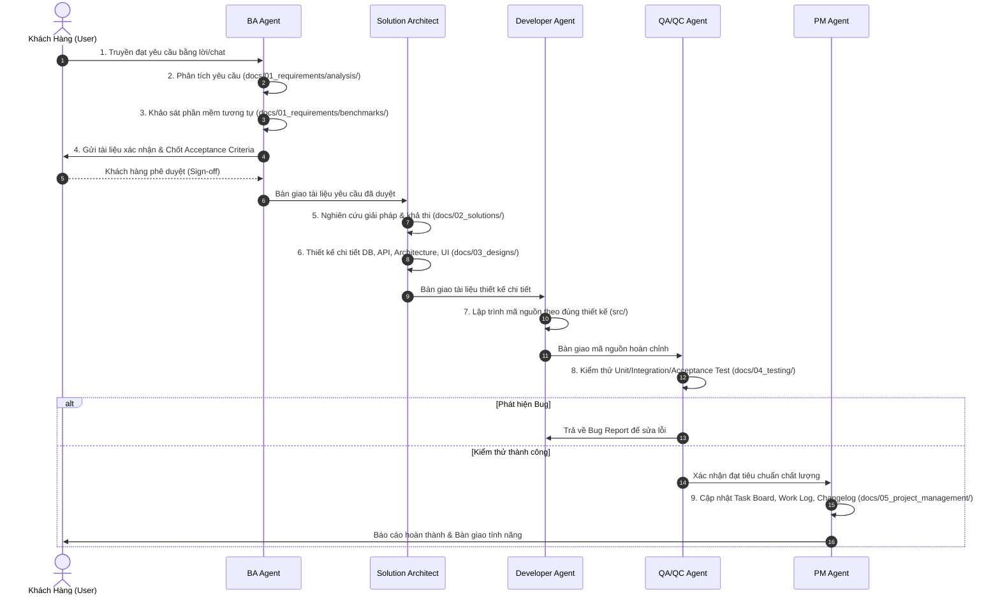

# SDLC Multi-Agent Playbook & Quy Trình Thực Thi

Playbook này hướng dẫn cách thực thi quy trình phát triển phần mềm chuẩn hóa 9 bước cho dự án `open-erp`. Mọi bước đều có đầu vào/đầu ra rõ ràng và được lưu trữ trong thư mục `docs/`.

---

## 1. Bản Đồ Quy Trình & Luồng Bàn Giao



---

## 2. Chi Tiết Từng Bước & Hành Động Cụ Thể Của Agent

### Bước 1: Tiếp Nhận Yêu Cầu Truyền Miệng (Oral Requirement Capture)
- **Role**: **BA Agent**
- **Mục tiêu**: Thu thập trung thực mọi thông tin, mong muốn từ khách hàng, không bỏ sót chi tiết dù là nhỏ nhất.
- **Hành động**:
  1. Ghi lại nội dung trao đổi vào `docs/01_requirements/raw_notes/YYYYMMDD_<feature_name>_raw.md`.
  2. Ghi chú nguồn gốc, người yêu cầu, thời gian, và các từ khóa nghiệp vụ quan trọng.

### Bước 2: Phân Tích Yêu Cầu (Requirement Analysis)
- **Role**: **BA Agent**
- **Mục tiêu**: Làm rõ nghiệp vụ, xác định đối tượng sử dụng (Actors), mục tiêu nghiệp vụ (Business Goals).
- **Hành động**:
  1. Phân rã thành các User Stories theo chuẩn: `As a <role>, I want <action> so that <benefit>`.
  2. Xác định phạm vi: **In-Scope** (làm) và **Out-of-Scope** (chưa làm trong giai đoạn này).
  3. Lập danh sách quy tắc nghiệp vụ (Business Rules).
  4. Lưu tài liệu vào: `docs/01_requirements/analysis/<feature_name>_analysis.md`.

### Bước 3: Tham Khảo Các Phần Mềm Tương Tự (Benchmarking & Market Research)
- **Role**: **BA Agent**
- **Mục tiêu**: Học hỏi các best practices từ các hệ thống ERP hàng đầu (Odoo, ERPNext, SAP, NetSuite...) để thiết kế trải nghiệm tối ưu, tránh "phát minh lại bánh xe".
- **Hành động**:
  1. Nghiên cứu cách các hệ thống khác xử lý tính năng tương tự (luồng thao tác, màn hình, cấu trúc dữ liệu).
  2. Liệt kê ưu điểm và nhược điểm của từng hệ thống.
  3. Rút ra bài học áp dụng vào dự án `open-erp`.
  4. Lưu tài liệu vào: `docs/01_requirements/benchmarks/<feature_name>_benchmark.md`.

### Bước 4: Xác Nhận Lại Với Khách Hàng (Customer Alignment & Confirmation)
- **Role**: **BA Agent**
- **Mục tiêu**: Đảm bảo hai bên 100% hiểu giống nhau trước khi tốn nguồn lực kỹ thuật.
- **Hành động**:
  1. Tổng hợp thành bản tóm tắt dễ hiểu cho người làm nghiệp vụ: Luồng người dùng, các màn hình sơ bộ, tiêu chí nghiệm thu (Acceptance Criteria dạng Given-When-Then).
  2. Lưu tài liệu vào: `docs/01_requirements/confirmations/<feature_name>_confirmation.md`.
  3. Trình bày và xin xác nhận trực tiếp từ khách hàng. Chỉ đi tiếp khi khách hàng đồng ý.

### Bước 5: Nghiên Cứu Giải Pháp (Solution Research & Feasibility Study)
- **Role**: **Solution Architect Agent**
- **Mục tiêu**: Lựa chọn công nghệ, thuật toán, thư viện tối ưu nhất.
- **Hành động**:
  1. Phân tích các phương án kiến trúc (Phương án A vs Phương án B).
  2. Đánh giá Trade-offs: Độ phức tạp, hiệu năng, bảo mật, khả năng mở rộng (Scalability), chi phí bảo trì.
  3. Đưa ra đề xuất phương án tối ưu và lý do lựa chọn.
  4. Lưu tài liệu vào: `docs/02_solutions/<feature_name>_solution.md`.

### Bước 6: Thiết Kế Giải Pháp Chi Tiết (Detailed Technical Design)
- **Role**: **Solution Architect Agent**
- **Mục tiêu**: Bản thiết kế chi tiết 100% để Developer đọc là có thể code ngay.
- **Hành động**:
  1. **Kiến trúc tổng thể**: Sơ đồ module, Sequence Diagram luồng xử lý (`docs/03_designs/architecture/`).
  2. **Thiết kế CSDL**: ERD, tên bảng, kiểu dữ liệu, ràng buộc (Foreign Key, Indexes, Enums) (`docs/03_designs/database/`).
  3. **Đặc tả API**: Phương thức, URL, Headers, Request Body, Response (200, 400, 401, 500) (`docs/03_designs/api/`).
  4. **Giao diện & Thành phần UI**: Cấu trúc Component, State, Luồng sự kiện giao diện (`docs/03_designs/ui_ux/`).

### Bước 7: Lập Trình (Implementation / Coding)
- **Role**: **Developer Agent**
- **Mục tiêu**: Viết mã nguồn chất lượng cao, chuẩn mực, bám sát bản thiết kế.
- **Hành động**:
  1. Đọc kỹ tài liệu trong `docs/03_designs/`.
  2. Viết mã nguồn trong thư mục dự án (`src/`...).
  3. Đảm bảo tuân thủ nguyên tắc Clean Code, SOLID, xử lý lỗi đầy đủ, không hard-code.
  4. Nếu cần điều chỉnh kiến trúc hoặc DB schema, PHẢI yêu cầu Architect cập nhật tài liệu trước.

### Bước 8: Kiểm Thử (QA / QC & Verification)
- **Role**: **QA/QC Agent**
- **Mục tiêu**: Đảm bảo không có lỗi phát sinh và tính năng đáp ứng hoàn hảo tiêu chí nghiệm thu.
- **Hành động**:
  1. Lập Test Plan & Test Matrix (`docs/04_testing/test_plans/`).
  2. Viết các kịch bản kiểm thử chi tiết (Happy path, Negative path, Edge cases) (`docs/04_testing/test_cases/`).
  3. Viết và chạy Automated Tests (Unit Test, Integration Test).
  4. Tổng hợp báo cáo kiểm thử và log lỗi nếu có (`docs/04_testing/test_reports/`).
  5. Đánh dấu Pass/Fail cho tính năng.

### Bước 9: Cập Nhật Công Việc & Đóng Gói (Task Tracking & Changelog)
- **Role**: **PM Agent**
- **Mục tiêu**: Minh bạch hóa tiến độ và ghi nhận lịch sử phát triển.
- **Hành động**:
  1. Cập nhật trạng thái task trong `docs/05_project_management/task_board.md` sang **Done**.
  2. Ghi nhận nhật ký công việc vào `docs/05_project_management/work_log.md`.
  3. Cập nhật phiên bản và lịch sử thay đổi vào `docs/05_project_management/changelog.md`.
  4. Báo cáo hoàn thành cho khách hàng cùng link tài liệu và kết quả nghiệm thu.

---

## 3. Quy Trình Agile Sprint & Quản Lý Issue/Task Dạng File

### 3.1. Cấu Trúc Thư Mục Một Sprint
Mỗi Sprint được tổ chức trong một thư mục riêng:
```
docs/05_project_management/sprints/sprint_XX/
├── sprint_plan.md      # Mục tiêu Sprint, danh sách cam kết, thời gian
├── sprint_review.md    # Đánh giá cuối Sprint, kiểm tra điều kiện đóng
└── items/              # Nơi lưu trữ từng file task, bug, feature, refactor
    ├── FEAT-001_xxx.md
    ├── TASK-001_xxx.md
    ├── BUG-001_xxx.md
    └── REFACTOR-001_xxx.md
```

### 3.2. Tiêu Chuẩn Phân Loại Mức Độ Ưu Tiên (Priority / Severity)
Mọi Agent khi phát hiện công việc/lỗi phải gán đúng mức độ:
- **`Critical`** (Khẩn cấp): Lỗi làm tê liệt hệ thống, rò rỉ bảo mật nghiêm trọng, mất dữ liệu, hoặc tính năng cốt lõi bị chặn đứng hoàn toàn.
- **`High`** (Cao): Tính năng quan trọng bị sai nghiệp vụ, không có cách khắc phục tạm thời (workaround).
- **`Medium`** (Trung bình): Lỗi ảnh hưởng một phần luồng nghiệp vụ nhưng có giải pháp thay thế tạm thời; hoặc task cải tiến thông thường.
- **`Low`** (Thấp): Lỗi giao diện nhỏ (UI glitch), lỗi chính tả (typo), tinh chỉnh nhỏ không ảnh hưởng logic.

### 3.3. Vòng Đời Trạng Thái Của Mỗi File Item
1. `To Do`: Công việc vừa được tạo, đang chờ thực hiện.
2. `In Progress`: Agent đang trực tiếp xử lý (Code, Phân tích, Sửa lỗi).
3. `In Review / Testing`: Đã xử lý xong, đang chờ QA kiểm thử hoặc Architect review.
4. `Done`: Đã hoàn thành và được QA xác nhận đạt chuẩn kiểm thử.
5. `Deferred`: Tạm hoãn sang Sprint sau (**Chỉ áp dụng cho mức Medium và Low**).

### 3.4. Checklist Đóng Sprint (Sprint DoD Gate)
Trước khi đóng bất kỳ Sprint nào, PM Agent bắt buộc phải thực hiện kiểm tra:
- [ ] Không còn bất kỳ item nào có mức độ `Critical` ở trạng thái chưa hoàn thành.
- [ ] Không còn bất kỳ item nào có mức độ `High` ở trạng thái chưa hoàn thành.
- [ ] Các item `Medium` và `Low` chưa làm (nếu có) đã được chuyển sang `sprints/sprint_XX+1/` hoặc `backlog/` kèm lý do.
- [ ] Lập file `sprint_review.md` xác nhận hoàn thành mục tiêu Sprint.

