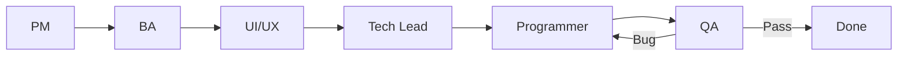

# SDLC Workflow — PM · BA · UI/UX · Tech Lead · Programmer · QA

Skill điều phối luồng phát triển phần mềm end-to-end cho dự án **open-erp**, đảm bảo chất lượng và bộ tài liệu đồng bộ.

## Khi nào dùng

- Bắt đầu tính năng / Epic / Sprint mới
- User yêu cầu viết hoặc cập nhật PRD, SRS, Mockup, Task, Bug, Testcase
- Triển khai code cần có tài liệu nguồn và tiêu chí nghiệm thu rõ ràng
- QA báo lỗi hoặc cần kịch bản kiểm thử

## Nguyên tắc chung

1. **Không bỏ qua phase** — mỗi vai trò có gate (cổng kiểm tra) trước khi chuyển phase.
2. **Tài liệu trước code** — Task spec phải tồn tại trước khi Programmer implement (trừ hotfix khẩn cấp).
3. **Traceability** — mọi Task/Bug/Testcase phải truy vết ngược PRD/SRS/Mockup.
4. **Convention dự án** — dùng cấu trúc `docs/` hiện có; tiếng Việt cho tài liệu nghiệp vụ.
5. **Minimal diff** — chỉ sửa phần liên quan; không tạo file markdown ngoài yêu cầu user.

## Sơ đồ luồng



## Vai trò & deliverable

| Phase | Vai trò | Output chính | Vị trí lưu |
|-------|---------|--------------|------------|
| 0 | **PM** | Scope, priority, sprint goal, backlog item | `docs/05_project_management/product_backlog.md`, sprint `README.md` |
| 1 | **BA** | PRD delta, URS/SRS, User Stories, AC | `docs/01_business/`, `docs/02_user_requirements/urs.md`, `docs/03_functional/` |
| 2 | **UI/UX** | Sitemap, wireframe, mockup mô tả | `docs/02_user_requirements/sitemap_and_wireframes.md` |
| 3 | **Tech Lead** | Kiến trúc, API, data model, task breakdown | `docs/04_technical/`, `docs/03_functional/api_overview.md`, task files |
| 4 | **Programmer** | Source code, unit test | `open-erp-services/`, `open-erp-web/`, `open-erp-mobile/`, `open-erp-shared/` |
| 5 | **QA** | Testcase, test report, bug report | Task § QA, `testcases/`, `bugs/`, manual test report |

Chi tiết trách nhiệm từng vai trò: [roles.md](roles.md)

## Quy trình thực thi

Copy checklist và đánh dấu tiến độ trong phản hồi:

```
SDLC Progress:
- [ ] Phase 0 — PM: Scope & sprint goal
- [ ] Phase 1 — BA: PRD / URS / SRS
- [ ] Phase 2 — UI/UX: Mockup / wireframe
- [ ] Phase 3 — Tech Lead: Task spec & kiến trúc
- [ ] Phase 4 — Programmer: Implementation
- [ ] Phase 5 — QA: Testcase & nghiệm thu
```

### Phase 0 — PM

1. Xác định **Epic/Feature**, priority (P0–P3), sprint target.
2. Cập nhật `product_backlog.md` hoặc sprint `README.md` (bảng task index).
3. **Gate PM → BA:** scope MVP rõ, out-of-scope liệt kê, stakeholder sign-off (user xác nhận).

### Phase 1 — BA

1. Cập nhật PRD nếu thay đổi vision/goals/personas.
2. Bổ sung URS: luồng nghiệp vụ, màn hình, trường dữ liệu, business rules, User Stories + AC.
3. Viết SRS (yêu cầu phần mềm kỹ thuật): API contract, validation, NFR liên quan → `docs/03_functional/` hoặc section trong Task.
4. **Gate BA → UI/UX:** User Stories có AC đo được; không mơ hồ.

### Phase 2 — UI/UX

1. Cập nhật sitemap nếu có màn hình mới.
2. Mô tả wireframe/mockup (ASCII hoặc mermaid; Figma link nếu có).
3. Tuân thủ design system: **Rose Gold `#B76E79`**, Light/Dark, Feather Icons, Transloco i18n.
4. **Gate UI/UX → Tech Lead:** mọi màn hình trong URS đã có layout; trạng thái empty/error/loading được mô tả.

### Phase 3 — Tech Lead

1. Cập nhật `data_model.md`, `api_overview.md`, `system_design.md` nếu cần.
2. Tạo Task file theo template — phân công BE / FE Web / FE Mobile / QA.
3. Ghi rõ dependencies, DoD, local dev guide.
4. **Gate Tech Lead → Programmer:** Task có API spec, schema, AC kỹ thuật; dependencies đã done.

### Phase 4 — Programmer

1. Đọc Task spec và mockup trước khi code.
2. Implement theo convention repo (NestJS, Angular, Ionic, `@open-erp/shared-ui`).
3. Viết unit test; cập nhật i18n (`vi.json`, `en.json`).
4. Cập nhật section **Kết quả thực hiện** trong Task khi xong.
5. **Gate Programmer → QA:** build pass, unit test pass, Task deliverables liệt kê file đã đổi.

### Phase 5 — QA

1. Viết testcase từ AC (happy path, edge, security cơ bản).
2. Chạy manual/E2E; ghi báo cáo nếu cần (`task_XX_manual_test_report.md`).
3. Bug → file `bugs/bug_{N}_{slug}.md`; link Task gốc.
4. **Gate QA → Done:** tất cả testcase PASS hoặc bug đã fix & regression pass.

## Quy ước đặt tên & đường dẫn

| Loại | Pattern | Ví dụ |
|------|---------|-------|
| Task | `docs/05_project_management/sprint_{N}/tasks/task_{NN}_{slug}.md` | `task_03_org_structure.md` |
| Bug | `docs/05_project_management/sprint_{N}/bugs/bug_{NN}_{slug}.md` | `bug_12_mobile_theme_issue.md` |
| Testcase | `docs/05_project_management/sprint_{N}/testcases/tc_{NN}_{slug}.md` hoặc §3.5 trong Task | |
| Manual test | `docs/05_project_management/sprint_{N}/tasks/task_{NN}_manual_test_report.md` | |

ID trong sprint README phải đồng bộ (TSK-{N}.{M}, BUG-{N}.{M}).

## Chế độ làm việc

### Full feature (mặc định)

Chạy tuần tự Phase 0 → 5. Ở mỗi gate, tóm tắt deliverable và **hỏi user xác nhận** trước khi sang phase tiếp (trừ khi user yêu cầu chạy liên tục).

### Hotfix / Bug only

Bỏ qua Phase 0–2 nếu feature đã có spec. Luồng: QA/Reporter → Bug doc → Tech Lead (impact) → Programmer → QA regression.

### Task-only (spec đã có)

Bắt đầu Phase 3 hoặc 4 tùy Task đã tồn tại hay chưa.

## Dùng subagent (Task tool)

Khi workload lớn, tách song song **sau khi BA + UI/UX đã chốt**:

| Subagent | Khi launch | Input bắt buộc |
|----------|------------|----------------|
| `explore` | Khảo sát codebase, API hiện có | Task ID, module path |
| `generalPurpose` | Implement BE hoặc FE độc lập | Task file path, acceptance criteria |
| `shell` | Chạy test, build, migration | Repo path, command |
| `bugbot` | Review diff trước merge | Branch changes |

**Không** launch Programmer subagent khi chưa có Task spec (Phase 3).

## Traceability matrix (bắt buộc trong Task)

Mỗi Task header hoặc metadata section phải có:

```markdown
| Trace | ID / Link |
|-------|-----------|
| PRD | [prd.md](../../01_business/prd.md) §... |
| URS/SRS | [urs.md](../../02_user_requirements/urs.md) US-XXX |
| Mockup | [sitemap_and_wireframes.md](../../02_user_requirements/sitemap_and_wireframes.md) §... |
| Backlog | US-XXX trong product_backlog.md |
```

## Definition of Done (DoD) — toàn dự án

- [ ] PRD/URS/SRS/Mockup cập nhật (nếu scope đổi)
- [ ] Task spec approved; README sprint cập nhật trạng thái
- [ ] Code + unit test; build & lint pass
- [ ] Testcase PASS; bug critical = 0
- [ ] i18n vi/en đầy đủ cho UI mới
- [ ] Task § Kết quả thực hiện hoàn chỉnh

## Templates

Dùng template chuẩn khi tạo tài liệu mới: [templates.md](templates.md)

## Tham chiếu dự án

- PRD mẫu: `docs/01_business/prd.md`
- URS mẫu: `docs/02_user_requirements/urs.md`
- Task mẫu: `docs/05_project_management/sprint_1/tasks/task_03_org_structure.md`
- Bug mẫu: `docs/05_project_management/sprint_1/bugs/bug_12_mobile_theme_issue.md`
- Manual test mẫu: `docs/05_project_management/sprint_2/tasks/task_10_manual_test_report.md`
