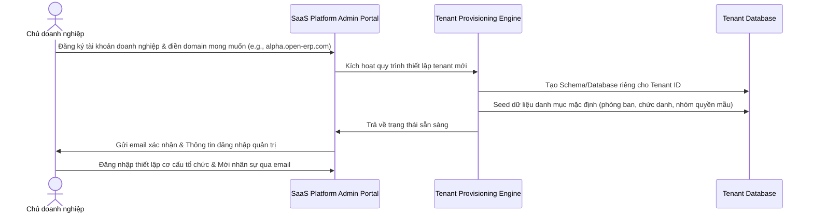

# Tài liệu yêu cầu sản phẩm (Product Requirement Document - PRD)
## Dự án: Nền tảng SaaS quản trị doanh nghiệp hợp nhất - Enterprise SaaS Platform

---

### 1. Tầm nhìn sản phẩm (Product Vision)
Trở thành hệ điều hành doanh nghiệp (Business Operating System) hàng đầu dành cho các doanh nghiệp vừa và nhỏ (SMEs) tại Đông Nam Á. Hệ thống giúp tích hợp tất cả các luồng thông tin, quy trình và dữ liệu vận hành vào một nền tảng duy nhất, giúp doanh nghiệp vận hành không giấy tờ, tự động hóa tối đa và quản trị dựa trên dữ liệu.

---

### 2. Mục tiêu (Goals) & Ngoài mục tiêu (Non-Goals)
#### 2.1 Mục tiêu (Goals)
* **Tính đồng bộ (All-in-one):** Kết nối không vết tất cả các quy trình cốt lõi (CRM -> Approval -> Procurement -> Warehouse -> Finance -> HRM).
* **Kiến trúc Multi-tenant:** Đảm bảo khả năng cô lập dữ liệu tuyệt đối giữa các tenant, tính bảo mật cao và chi phí hạ tầng tối ưu.
* **Tính sẵn sàng cao (High Availability):** Thiết kế hệ thống đạt thời gian hoạt động (uptime) tối thiểu 99.9%.
* **Trải nghiệm người dùng cao cấp (Premium UX):** Giao diện hiện đại, dễ tiếp cận, giảm thiểu thời gian đào tạo sử dụng cho nhân sự mới xuống dưới 2 ngày.
* **Đưa sản phẩm ra thị trường nhanh (Time-to-Market):** Đạt phiên bản MVP chạy tốt sau 6 Sprint (12 tuần) để thu thập phản hồi từ người dùng thực tế.

#### 2.2 Ngoài mục tiêu (Non-Goals)
* **Kế toán Thuế chuyên sâu:** Không thay thế các phần mềm khai báo thuế chuyên nghiệp ở giai đoạn đầu. Chỉ tập trung vào kế toán tài chính quản trị nội bộ.
* **Tự động hóa sản xuất (MES/IoT):** Không kết nối trực tiếp với máy móc nhà xưởng hoặc dây chuyền sản xuất trong giai đoạn 1.
* **Mạng xã hội nội bộ chuyên sâu:** Không xây dựng các tính năng chat nhóm thời gian thực quá phức tạp thay thế Slack/Zalo. Thay vào đó, tập trung vào giao tiếp trực tiếp trên thực thể nghiệp vụ (task comment, document approval discussion).

---

### 3. Hình tượng người dùng (Personas)
Chi tiết về hành vi và mục tiêu của cả 8 nhóm người dùng trong hệ thống:

| Persona | Vai trò | Mục tiêu chính | Nỗi đau hiện tại |
| :--- | :--- | :--- | :--- |
| **Anh Hoàng** (45 tuổi) | Chủ doanh nghiệp / CEO | Theo dõi sức khỏe tài chính, dòng tiền và phê duyệt nhanh các quyết định lớn. | Số liệu báo cáo chậm, sai lệch giữa các phòng ban. Phải ký duyệt giấy tờ quá nhiều. |
| **Anh Tuấn** (29 tuổi) | Tenant Admin | Cấu hình thông tin doanh nghiệp, cấp tài khoản và phân quyền cho nhân sự. | Khó quản lý phân quyền chi tiết cho nhiều phòng ban. Không có nhật ký thao tác người dùng. |
| **Anh Nam** (28 tuổi) | Sales Executive | Chăm sóc khách hàng tiềm năng, tạo báo giá, theo dõi trạng thái hợp đồng. | Quên lịch hẹn, dữ liệu khách hàng bị trùng lặp, không biết chính xác doanh số tháng này. |
| **Chị Linh** (30 tuổi) | Kế toán trưởng | Kiểm soát dòng tiền vào/ra, đối soát công nợ, quản lý quỹ tiền. | Các phòng ban đề nghị thanh toán trễ, thiếu chứng từ chứng minh dẫn đến dòng tiền bị âm. |
| **Chị Mai** (35 tuổi) | HR Manager | Quản lý hồ sơ nhân sự, tự động hóa chấm công và tính lương chính xác. | Mất nhiều thời gian đối soát bảng công Excel thủ công, quản lý hồ sơ nhân sự phân tán. |
| **Anh Hùng** (38 tuổi) | Trưởng phòng Vận hành | Giao việc cho nhân viên, theo dõi tiến độ, duyệt đề xuất hành chính của nhóm. | Khó kiểm soát việc trễ hạn qua Zalo/email. Mất nhiều thời gian làm báo cáo KPI phòng ban. |
| **Chị Vy** (24 tuổi) | Nhân viên văn phòng | Nhận việc được giao, đăng ký nghỉ phép, đề xuất thanh toán/tạm ứng hành chính. | Quy trình ký giấy phức tạp, không theo dõi được đơn đề xuất của mình đang ở bước duyệt nào. |
| **Anh Minh** (40 tuổi) | Super Admin của SaaS | Quản lý tất cả doanh nghiệp đăng ký, cấu hình gói cước, giám sát hệ thống. | Thiếu công cụ kiểm soát dung lượng lưu trữ của từng tenant. Khó tracking log hoạt động platform. |

---

### 4. Hành trình người dùng cốt lõi (Core User Journey)
#### Luồng đăng ký & Thiết lập ban đầu (Tenant Provisioning)

---

### 5. Danh sách tính năng & Độ ưu tiên (MoSCoW)
Chúng tôi phân loại tính năng theo khung MoSCoW:

#### 5.1 Must Have (Bắt buộc phải có trong MVP)
* Đăng ký doanh nghiệp, tạo tenant cô lập dữ liệu.
* Xác thực người dùng (JWT, đăng nhập, quên mật khẩu).
* Quản trị doanh nghiệp: Cấu hình phòng ban, chi nhánh, chức vụ.
* Phân quyền Role-based Access Control (RBAC) cơ bản.
* Quy trình phê duyệt cơ bản (Duyệt nghỉ phép, tạm ứng, thanh toán).
* Phân hệ Công việc (Tasks) & Dự án (Projects) dạng Kanban và Danh sách.
* CRM cơ bản: Lead, Khách hàng, Cơ hội, Pipeline bán hàng.
* HRM cơ bản: Hồ sơ nhân sự, Hợp đồng lao động, Chấm công đơn giản.
* Dashboard tổng quan và các báo cáo cơ bản của MVP.

#### 5.2 Should Have (Nên có ngay sau MVP)
* Kế toán tài chính nội bộ: Phiếu thu, Phiếu chi, Quản lý công nợ, Sổ quỹ.
* Mua hàng & Quản lý nhà cung cấp.
* Kho vật tư: Nhập, Xuất, Tồn kho, Cảnh báo tồn kho tối thiểu.
* Quản lý tài sản cố định: Bàn giao, Thu hồi, Lịch sử bảo trì.
* Quản lý văn bản đi/đến, trình ký tài liệu điện tử.

#### 5.3 Could Have (Có thể bổ sung ở các sprint cuối/sau)
* Phân hệ Chăm sóc khách hàng (Tickets, SLA, Đánh giá dịch vụ).
* Marketing: Chiến dịch, Quản lý lead từ Web form, Phân bổ lead tự động.
* Tích hợp chữ ký số và chữ ký điện tử (CA).
* Định vị GPS trong chấm công (chấm công qua mobile app).

#### 5.4 Won't Have (Chưa phát triển trong 12 Sprint đầu tiên)
* Tính năng Call Center tích hợp trực tiếp trên CRM.
* Khai báo thuế điện tử trực tiếp sang tổng cục thuế.
* Tự động hóa sản xuất (MRP).

---

### 6. Chỉ số thành công (Success Metrics)
Để đo lường sự thành công của sản phẩm sau khi ra mắt, chúng tôi theo dõi các nhóm chỉ số:
* **System Metrics (Hệ thống):**
  - Uptime của hệ thống: $\ge 99.9\%$.
  - Tốc độ tải trang trung bình: $< 1.5$ giây đối với các tác vụ thông thường.
* **Business Metrics (Kinh doanh):**
  - Tỷ lệ kích hoạt thành công tài khoản (Activation Rate): $\ge 70\%$.
  - Tỷ lệ rời bỏ nền tảng hàng tháng (Churn Rate): $< 3\%$.
  - Chỉ số hài lòng của khách hàng (CSAT): $\ge 4.2 / 5.0$.
* **User Engagement Metrics (Mức độ tương tác):**
  - Số lượng người dùng hoạt động hằng ngày/hằng tháng (DAU/MAU) đạt tỷ lệ $> 60\%$.
  - Số lượng yêu cầu phê duyệt được xử lý đúng hạn đạt tỷ lệ $> 90\%$.

---

### 7. Rủi ro, Sự phụ thuộc & Các giả định (Risks, Dependencies & Assumptions)
* **Rủi ro lớn nhất:** Dữ liệu multi-tenant bị rò rỉ chéo giữa các doanh nghiệp. 
  - *Giải pháp:* Thiết lập kiểm định bảo mật (Penetration Testing) chuyên sâu cho lớp Row-Level Security (RLS) của database trước khi beta release.
* **Sự phụ thuộc (Dependencies):** Việc gửi thông báo SMS/Zalo phụ thuộc vào API của bên thứ ba (Zalo ZNS, các Brandname provider).
  - *Giải pháp:* Xây dựng cơ chế fallback sang Email và In-app notification nếu API SMS/Zalo gặp sự cố.
* **Giả định (Assumptions):** Đội ngũ phát triển (8 người) có đầy đủ năng lực kỹ thuật và làm việc toàn thời gian theo phương pháp Scrum. Môi trường phát triển và CI/CD được thiết lập chuẩn hóa từ đầu.
