# Đặc tả Sitemap & Wireframes giao diện cốt lõi (MVP)
## Dự án: Nền tảng SaaS quản trị doanh nghiệp hợp nhất - Enterprise SaaS Platform

Tài liệu này đặc tả sơ đồ trang (Sitemap) chi tiết và phác thảo cấu trúc giao diện (Wireframes) cho 5 màn hình cốt lõi của MVP. Thiết kế tuân thủ định hướng tối giản, mật độ thông tin cao (High Density Mode), hỗ trợ Dark & Light Mode, và sử dụng tông màu Rose Gold chủ đạo.

---

### 1. Sơ đồ trang chi tiết (Sitemap Structure)

```mermaid
graph TD
    %% Định nghĩa các trang công cộng
    Public[Portal Công cộng open-erp.9ms.io.vn] --> Landing[Trang giới thiệu Landing Page]
    Public --> Register[Đăng ký Workspace mới / TSK-1.1]
    Public --> LoginSaaS[Đăng nhập Portal quản trị SaaS]
    
    %% Định nghĩa các trang trong Tenant Workspace
    Tenant[Workspace Doanh nghiệp tenant.open-erp.9ms.io.vn] --> Login[Trang đăng nhập Workspace / TSK-1.2]
    Tenant --> AppShell[Bố cục chính Global App Shell]
    
    %% Phân hệ con trong App Shell
    AppShell --> Dashboard[Dashboard điều hành tổng quan]
    
    AppShell --> Org[Phân hệ Tổ chức & Nhân sự]
    Org --> OrgChart[Sơ đồ phòng ban phân cấp / TSK-1.3]
    Org --> UserList[Danh sách nhân sự & Mời qua Email / TSK-1.4]
    Org --> Permissions[Quản lý Nhóm quyền & RBAC / TSK-1.5]
    
    AppShell --> Workspace[Phân hệ Công việc & Dự án]
    Workspace --> Kanban[Bảng Kanban công việc]
    Workspace --> TaskList[Danh sách công việc & Lịch biểu]
    
    AppShell --> CRM[Phân hệ Sales / CRM]
    CRM --> CRMLeads[Danh sách Lead kinh doanh]
    CRM --> CRMPipeline[Kanban cơ hội bán hàng & Báo giá]
    
    AppShell --> Approvals[Phân hệ Phê duyệt yêu cầu]
    Approvals --> AppList[Hộp thư phê duyệt / TSK-2.13]
    Approvals --> SelfService[Cổng tự phục vụ / TSK-2.14]
    
    AppShell --> AdminTools[Phân hệ Quản trị nâng cao - Sprint 2]
    AdminTools --> FormBuilder[Trình thiết kế Form động / TSK-2.10]
    AdminTools --> WorkflowDesigner[Trình thiết kế Workflow / TSK-2.16]
    AdminTools --> TemplateDesigner[Thiết kế mẫu văn bản OnlyOffice / TSK-2.11]
    AdminTools --> CertManager[Quản lý chứng thư số / TSK-2.12]
```



---

### 2. Phác thảo cấu trúc giao diện (Wireframe Layouts)

#### 2.1 Bố cục chính của ứng dụng (Global App Shell - Responsive Grid)
Áp dụng cơ chế Sidebar co giãn (Collapsible Sidebar), thanh Topbar tìm kiếm nhanh, bảng màu chủ đạo Rose Gold và nút chuyển đổi chế độ Light/Dark Mode nhanh ở góc trên bên phải.

```text
+-----------------------------------------------------------------------------------------+
| [RG-Logo]  [Tìm kiếm nhanh hệ thống... / Ctrl+K]               [Light/Dark] [Avatar v]  | -> Topbar (Màu Rose Gold nhẹ, 60px)
+----------+------------------------------------------------------------------------------+
| (Collap) | [Breadcrumb: Dự án / Công việc]                       [Nút Hành Động]        |
| - Dash   +------------------------------------------------------------------------------+
| - Tổ chức|                                                                              |
|   - Sơ đồ|                                                                              |
|   - User |                                                                              |
|   - Quyền|                                                                              |
| - Việc   |                                                                              |
| - CRM    |                           VÙNG CHỨA NỘI DUNG CHÍNH                           |
| - Duyệt  |                            (MAIN CONTENT WINDOW)                             |
|          |                                                                              |
|          |                                                                              |
|          |                                                                              |
|          |                                                                              |
|          |                                                                              |
+----------+------------------------------------------------------------------------------+
  ^
  Sidebar (Có thể thu nhỏ chỉ hiển thị Icon để tăng diện tích hiển thị nội dung chính)
```

#### 2.2 Màn hình Đăng ký Workspace Doanh nghiệp (SaaS Register)
Trang đăng ký được thiết kế tối giản, tập trung vào form đăng ký và tích hợp kiểm tra subdomain realtime.

```text
+-----------------------------------------------------------------------------------------+
|                                  [ Logo Open-ERP ]                                      |
|                                                                                         |
|                      ĐĂNG KÝ WORKSPACE DOANH NGHIỆP CỦA BẠN                             |
|             Trải nghiệm giải pháp quản trị doanh nghiệp All-in-one miễn phí             |
|                                                                                         |
|      +---------------------------------------------------------------------------+      |
|      |  Tên Doanh nghiệp:  [ Công ty Cổ phần công nghệ GoTech                 ]  |      |
|      |  Email liên hệ:     [ owner@gotech.com                                 ]  |      |
|      |  Subdomain riêng:   [ gotech             ] .open-erp.9ms.io.vn            |      |
|      |                     (v) Subdomain hợp lệ và có thể đăng ký!               |      |
|      |  Số điện thoại:     [ 0901234567         ]                                |      |
|      |  Mật khẩu quản trị: [ **********         ] (Độ bảo mật: Mạnh)             |      |
|      |                                                                           |      |
|      |  [ ] Tôi đồng ý với Điều khoản dịch vụ và Chính sách bảo mật của SaaS.    |      |
|      |                                                                           |      |
|      |                     [  Đăng Ký Khởi Tạo Workspace  ]                      |      | -> Nút nhấn màu Hồng Vàng (Rose Gold)
|      +---------------------------------------------------------------------------+      |
|                                                                                         |
|                      Đã có tài khoản? [ Đăng nhập tại đây ]                             |
+-----------------------------------------------------------------------------------------+
```

#### 2.3 Màn hình Sơ đồ tổ chức & Phòng ban (Department Tree - Split-Pane Layout)
Thiết kế theo mô hình High Density Mode, chia màn hình làm 2 phần (bên trái là cấu trúc cây thư mục kéo thả, bên phải là chi tiết thông tin phòng ban được chọn).

```text
+---------------------------------+-------------------------------------------------------+
| SƠ ĐỒ PHÒNG BAN (SIDE PANEL)    | CHI TIẾT PHÒNG BAN ĐƯỢC CHỌN: PHÒNG KINH DOANH        |
+---------------------------------+-------------------------------------------------------+
|  [+ Thêm Phòng Ban Mới]         | Tên Phòng: Phòng Kinh Doanh (Sales Department)        |
|                                 | Quản lý: [Avatar] Nguyễn Văn A (Trưởng phòng)         |
|  v (GoTech Corp)                | Cấp trên: Ban Giám Đốc                                |
|    ├── Ban Giám Đốc             | Chi nhánh: Trụ sở chính Hà Nội                        |
|    v Phòng Kinh Doanh           +-------------------------------------------------------+
|      ├── Nhóm Bán Hàng Hà Nội   | DANH SÁCH NHÂN VIÊN TRONG PHÒNG (12 thành viên)       |
|      └── Nhóm Bán Hàng TP.HCM   |                                                       |
|    ├── Phòng Kỹ Thuật           | [ ] Họ và Tên     | Chức vụ          | Email          |
|    ├── Phòng Kế Toán            | [x] Nguyễn Văn A  | Trưởng phòng     | a.nv@gotech.com|
|    └── Phòng Hành Chính         | [ ] Trần Thị B    | Sales Executive  | b.tt@gotech.com|
|                                 | [ ] Phạm Văn C    | Sales Executive  | c.pv@gotech.com|
| [Kéo thả để thay đổi cấp bậc]  |                                                       |
|                                 | [ Mời Nhân Viên Mới ]        [ Chuyển Phòng Ban... ]  |
+---------------------------------+-------------------------------------------------------+
```

#### 2.4 Bảng Kanban Công việc & Nhiệm vụ (Task Kanban Board)
Hỗ trợ kéo thả các thẻ công việc qua lại giữa các cột trạng thái. Hiển thị thông tin cô đọng tối đa trên thẻ bao gồm: Tên task, Độ ưu tiên (màu sắc), Người thực hiện (avatar), Hạn chót (Deadline), và Task con hoàn thành.

```text
+-----------------------------------------------------------------------------------------+
| [ Bộ Lọc: Tất cả ]   [ Thành viên: Tất cả v ]   [ Hạn chót: Tuần này v ]   [+ Tạo Task] |
+----------------------+----------------------+----------------------+--------------------+
| CHỜ THỰC HIỆN (3)    | ĐANG LÀM (2)         | CHỜ PHÊ DUYỆT (1)    | HOÀN THÀNH (14)    |
+----------------------+----------------------+----------------------+--------------------+
| +------------------+ | +------------------+ | +------------------+ | +----------------+ |
| | [P0] Thiết kế DB | | | [P1] Init code   | | | [P0] Vẽ sitemap  | | | TSK-0.1 Specs  | |
| | RLS isolation    | | | Angular app      | | | wireframes       | | | [v] 2/2 Tasks  | |
| | [v] 0/4 Tasks    | | | Hạn: 15/06 [!]   | | | [v] 3/3 Tasks    | | |                | |
| | [Avatar] [Avatar]| | | [Avatar]         | | | [Avatar]         | | | [Avatar]       | |
| +------------------+ | +------------------+ | +------------------+ | +----------------+ |
| | [P2] Soạn thảo   | | | [P2] Setup ESLint| |                      | |                  | |
| | tài liệu API     | | | Prettier hooks   | |                      | |                  | |
| | Hạn: 20/06       | | | [Avatar]         | |                      | |                  | |
| | [Avatar]         | | +------------------+ | |                      | |                  | |
| +------------------+ |                      |                      | |                  | |
+----------------------+----------------------+----------------------+--------------------+
```

#### 2.5 Bảng Pipeline Bán hàng Cơ hội CRM (CRM Pipeline Board)
Tương tự như Kanban công việc nhưng hiển thị thông tin về tiền tệ, cơ hội giao dịch, xác suất thắng và liên kết trực tiếp sang module tạo báo giá.

```text
+-----------------------------------------------------------------------------------------+
| [ Lọc: Nhóm Sales Hà Nội ]                          Tổng doanh số dự kiến: 1.250.000 USD|
+----------------------+----------------------+----------------------+--------------------+
| LEAD MỚI (5)         | TIẾP CẬN (3)         | GỬI BÁO GIÁ (2)      | THÀNH CÔNG (W)     |
| Trị giá: 120k USD    | Trị giá: 250k USD    | Trị giá: 400k USD    | Trị giá: 480k USD  |
+----------------------+----------------------+----------------------+--------------------+
| +------------------+ | +------------------+ | +------------------+ | +----------------+ |
| | GoTech - CRM ERP | | | VNG Cloud - ERP  | | | Viettel - CRM    | | | FPT - Cloud    | |
| | 50.000 USD       | | | 150.000 USD      | | | 200.000 USD      | | | 480.000 USD    | |
| | Tỷ lệ: 10%         | | | Tỷ lệ: 30%         | | | Tỷ lệ: 70%         | | | Tỷ lệ: 100%    | |
| | Owner: Nguyễn A  | | | Owner: Trần B      | | | Báo giá: #Q-1002 | | | Báo giá: #Q-998| |
| +------------------+ | +------------------+ | +------------------+ | +----------------+ |
|                      |                      | | [ Tạo Báo Giá... ] | |                  | |
|                      |                      | +------------------+ |                  | |
+----------------------+----------------------+----------------------+--------------------+
```

#### 2.6 Trình thiết kế Workflow (Workflow Designer — TSK-2.16)
Route: `/admin/workflow-designer`. Canvas vô hạn (pan/zoom), palette node trái, properties phải.

```text
+----------+-----------------------------------------------------------+----------+
| NODE     | CANVAS WORKFLOW (Infinite, Grid Snap)                     | CONFIG   |
| PALETTE  |                                                           | PANEL    |
|----------|  [Start] --> [Fork] --> [Step: Kho] ----+                 | Tên node |
| Start    |              |--> [Step: Sale] ---+    |                 | Consensus|
| Step     |              |--> [Step: CS] ----+     v                 | Assignee |
| Decision |              +---------> [Join] --> [End]               | Form bind|
| Fork     | [Auto-layout] [Zoom +/-] [Undo/Redo]                      | Deadline |
| Join     |                                                           | Actions  |
| End      |                                                           |          |
+----------+-----------------------------------------------------------+----------+
```
**Trạng thái:** Empty canvas hướng dẫn kéo node; Loading skeleton; Error toast khi lưu fail.

#### 2.7 Thiết kế mẫu văn bản OnlyOffice (Template Designer — TSK-2.11)
Route: `/admin/template-designer`. Split: OnlyOffice iframe trái (70%), mapping panel phải (30%).

```text
+-------------------------------------------+---------------------------+
| ONLYOFFICE DOCUMENT EDITOR (iframe)       | MAPPING PANEL             |
| [Toolbar OnlyOffice]                      | Placeholder: {{field}}    |
|                                           | Transform: date/currency  |
|   (DOCX template preview/edit)            | [+ Thêm mapping]          |
|                                           | [ Lưu template ]          |
+-------------------------------------------+---------------------------+
```

#### 2.8 Quản lý chứng thư số (Cert Manager — TSK-2.12)
Route: `/settings/certificates`. Card layout danh sách cert + modal cấp mới.

```text
+-------------------------------------------------------------------------+
| CHỨNG THƯ SỐ CỦA TÔI                              [ Yêu cầu cấp mới ]   |
+-------------------------------------------------------------------------+
| [Card] CN=Nguyễn Văn A | Hết hạn: 2027-06-01 | [Ký thử] [Chi tiết]   |
| [Card] (Empty) Chưa có chứng thư — bấm Yêu cầu cấp mới                  |
+-------------------------------------------------------------------------+
```

#### 2.9 Hộp thư phê duyệt thông minh (Smart Approval Inbox — TSK-2.13)
Route: `/approvals/inbox`. Master-detail: danh sách trái, chi tiết phải.

```text
+---------------+---------------------------------------------------------+
| INBOX (240px) | CHI TIẾT ĐƠN                                            |
| [Chờ duyệt]   | Form động render | OnlyOffice doc | Timeline hash-chain |
| [Đã gửi]      | [Consult] [Reject] [Approve + Ký số]  Deadline: 2 ngày  |
| - Đơn #1024   |                                                         |
| - Đơn #1023   |                                                         |
+---------------+---------------------------------------------------------+
```

#### 2.10 Cổng tự phục vụ Mobile (Self-service — TSK-2.14)
Route Ionic tabs: `/self-service`, `/approvals`. Accordion loại đơn + form full-screen.

```text
+---------------------------+
| [<-] Gửi đơn nghỉ phép    |
+---------------------------+
| (Form Renderer - mobile)  |
| Ngày bắt đầu: [____]      |
| Ngày kết thúc: [____]     |
| Lý do: [____________]     |
|                           |
| [      Gửi đơn       ]    |  <- Rose Gold primary
+---------------------------+
| INBOX: Swipe Approve/Reject cards (Ionic)                               |
+---------------------------------------------------------------------------+
```

---

### 3. Quy chuẩn Hiển thị Đa chế độ (Light/Dark Mode Rules)
* **Quy chuẩn màu sắc Dark Mode:**
  - Nền toàn cục (Background): `#0F172A` (Slate 900)
  - Nền các Card, Table, Form: `#1E293B` (Slate 800)
  - Màu chữ chính (Primary Text): `#F8FAFC` (Slate 50)
  - Đường viền chia cắt (Borders): `#334155` (Slate 700)
* **Quy chuẩn màu sắc Light Mode:**
  - Nền toàn cục (Background): `#F8FAFC` (Slate 50)
  - Nền các Card, Table, Form: `#FFFFFF` (Trắng tinh khiết)
  - Màu chữ chính (Primary Text): `#0F172A` (Slate 900)
  - Đường viền chia cắt (Borders): `#E2E8F0` (Slate 200)
* **Tương phản của màu Rose Gold (`#B76E79`):** Đảm bảo độ tương phản AAA trên cả hai nền màu Slate 900 và trắng ngọc trai ngà để người dùng không gặp khó khăn khi đọc chữ trên nút bấm.

---

### 4. Liên kết tài liệu kỹ thuật liên quan
* Đặc tả công việc giao diện (TSK-0.2): [task_02_ux_wireframes.md](./task_02_ux_wireframes.md)
* Quy chuẩn thiết kế màu sắc và font chữ: [task_04_repository_setup.md](./task_04_repository_setup.md)
* Đặc tả yêu cầu người dùng (URS): [urs.md](./urs.md)
* Đặc tả testcase Sprint 2: [tc_02_branching_workflow_api.md](../05_project_management/sprint_2/testcases/tc_02_branching_workflow_api.md), [tc_10_dynamic_form_builder_ui.md](../05_project_management/sprint_2/testcases/tc_10_dynamic_form_builder_ui.md)
* Audit code Sprint 2: [SPRINT_2_CODE_AUDIT.md](../05_project_management/sprint_2/SPRINT_2_CODE_AUDIT.md)
