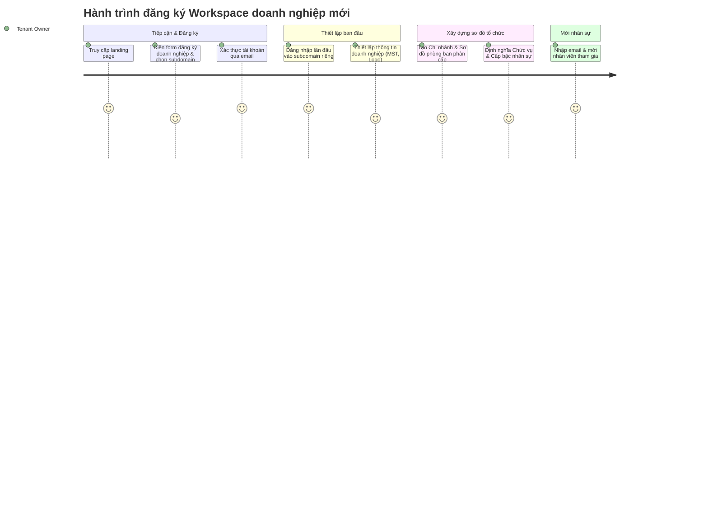
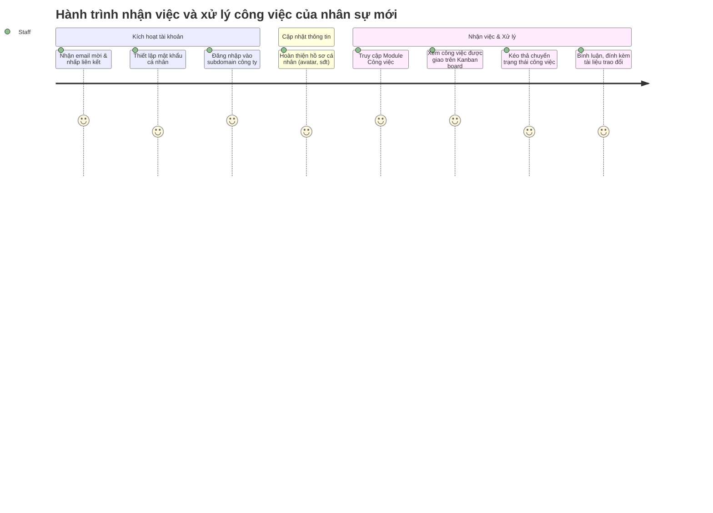

# Sơ đồ hành trình người dùng (User Journey Map)
## Dự án: Nền tảng SaaS quản trị doanh nghiệp hợp nhất - Enterprise SaaS Platform

Tài liệu này đặc tả hành trình người dùng (User Journeys) cho các đối tượng cốt lõi trong giai đoạn đầu vận hành hệ thống ERP. Bản vẽ và luồng nghiệp vụ chi tiết hỗ trợ PO, UI/UX Designers và Developers có chung cách nhìn nhận về luồng trải nghiệm khách hàng.

---

### 1. Hành trình 1: Đăng ký Workspace doanh nghiệp mới (Tenant Onboarding Journey)
* **Đối tượng (Persona):** **Chủ doanh nghiệp / Quản trị viên cấp cao (Tenant Owner)**
* **Mục tiêu:** Đăng ký thành công tài khoản doanh nghiệp, thiết lập workspace dưới dạng subdomain riêng và hoàn thành cấu hình cơ cấu tổ chức cơ bản.

#### Chi tiết các giai đoạn:

| Giai đoạn | Hành động người dùng | Hệ thống phản hồi | Cảm xúc / Pain Points | Cơ hội cải tiến |
| :--- | :--- | :--- | :--- | :--- |
| **1. Tiếp cận & Đăng ký** | - Truy cập `open-erp.9ms.io.vn`.  - Nhập tên doanh nghiệp, số điện thoại, email và subdomain mong muốn (ví dụ: `gotech`).  - Nhấp nút "Đăng ký". | - Kiểm tra trùng lặp subdomain.  - Gửi email kích hoạt có token xác thực 24h.  - Chuyển sang màn hình hướng dẫn check mail. | *Lo lắng:* Không biết email có gửi về ngay không, hoặc subdomain mong muốn đã bị trùng. | Tự động gợi ý subdomain khả dụng khi người dùng nhập text. |
| **2. Xác thực tài khoản** | - Mở hòm thư cá nhân, nhấp vào liên kết kích hoạt tài khoản.  - Nhập mật khẩu mới tại trang kích hoạt. | - Xác thực Token hợp lệ.  - Kích hoạt Tenant trạng thái "Hoạt động".  - Điều hướng người dùng về trang login subdomain: `gotech.open-erp.9ms.io.vn`. | *Khó chịu:* Nếu link hết hạn hoặc lỗi token trên thiết bị mobile. | Hỗ trợ nút "Gửi lại link xác thực" ngay trên màn hình nếu token hết hạn. |
| **3. Thiết lập thông tin** | - Đăng nhập vào workspace riêng.  - Nhập mã số thuế (MST), tải lên logo công ty, điền địa chỉ. | - Gọi API tra cứu thông tin thuế tự động để tự điền tên công ty và địa chỉ theo MST.  - Lưu thông tin vào DB với tenant_id. | *Tốn thời gian:* Phải gõ tay toàn bộ thông tin đăng ký kinh doanh. | **Tích hợp API Tổng cục Thuế** tự động điền thông tin sau khi nhập MST. |
| **4. Sơ đồ tổ chức** | - Truy cập phân hệ Tổ chức.  - Tạo mới Chi nhánh (Hà Nội, HCM).  - Vẽ sơ đồ phòng ban dạng cây trực quan (ví dụ: Ban giám đốc -> Phòng Sales -> Nhóm Sales 1). | - Hiển thị sơ đồ cây phòng ban trực quan kéo thả.  - Ràng buộc tính hợp lệ: Phòng ban con phải liên kết với phòng ban cha. | *Rắc rối:* Giao diện dạng form nhập liệu khô khan khó hình dung cấp bậc phòng ban. | Thiết kế **giao diện kéo thả trực quan (Drag & Drop Hierarchy)** để chỉnh sửa sơ đồ tổ chức. |
| **5. Mời nhân sự** | - Nhập email nhân viên mới, gán vào phòng ban "Sales" với chức danh "Sales Executive". | - Tạo bản ghi User ở trạng thái "Chờ kích hoạt".  - Gửi email mời kèm link thiết lập mật khẩu đến nhân viên. | *Khó kiểm soát:* Không biết nhân viên đã nhận được thư và kích hoạt chưa. | Thêm danh sách "Lời mời đang chờ" kèm nút "Gửi lại lời mời" cho Admin. |

---

### 2. Hành trình 2: Tiếp nhận Workspace và giao việc (Staff Onboarding & Task Journey)
* **Đối tượng (Persona):** **Nhân viên mới (Staff / Sales Executive)**
* **Mục tiêu:** Kích hoạt tài khoản cá nhân, cập nhật thông tin hồ sơ và bắt đầu nhận công việc đầu tiên trên bảng Kanban.

#### Chi tiết các giai đoạn:

| Giai đoạn | Hành động người dùng | Hệ thống phản hồi | Cảm xúc / Pain Points | Cơ hội cải tiến |
| :--- | :--- | :--- | :--- | :--- |
| **1. Kích hoạt tài khoản** | - Mở email mời nhận việc, click link kích hoạt.  - Đặt mật khẩu cá nhân và nhấp hoàn tất. | - Kích hoạt tài khoản user, chuyển trạng thái từ "Chờ kích hoạt" sang "Hoạt động".  - Chuyển hướng về trang chủ workspace của doanh nghiệp. | *Lo lắng:* Link trong email trông giống như thư rác (Spam). | Tự động tối ưu template email chuyên nghiệp, có logo và tên công ty mời. |
| **2. Hoàn thiện thông tin** | - Truy cập trang cá nhân.  - Cập nhật ảnh đại diện, số điện thoại, thông tin liên hệ khẩn cấp. | - Lưu thông tin cá nhân.  - Tự động hiển thị họ tên và avatar của nhân sự trên thanh topbar toàn hệ thống. | *Ngại nhập liệu:* Có quá nhiều trường thông tin cá nhân phải điền. | Chỉ yêu cầu điền các trường bắt buộc (Họ tên, SĐT) trong lần đăng nhập đầu tiên, các trường khác điền sau. |
| **3. Nhận việc trên Kanban** | - Nhấp chọn module Công việc trên sidebar.  - Xem danh sách nhiệm vụ được giao trên bảng Kanban ở cột "Chờ thực hiện". | - Lọc các công việc mà user là Người thực hiện (Assignee).  - Hiển thị Kanban board kéo thả tức thì (Real-time). | *Quá tải:* Giao diện rối mắt, không biết việc nào ưu tiên làm trước. | Thiết kế thẻ công việc gọn gàng, hiển thị nổi bật mức độ ưu tiên (High, Medium, Low) và Deadline. |
| **4. Xử lý & Phản hồi** | - Bắt đầu làm việc: Kéo thẻ từ "Chờ thực hiện" sang "Đang làm".  - Đăng bình luận báo cáo tiến độ và đính kèm file tài liệu. | - Cập nhật trạng thái công việc tức thời cho toàn nhóm (qua WebSocket).  - Gửi thông báo in-app đến người giao việc (Assigner). | *Mất liên lạc:* Không nhận được phản hồi từ quản lý sau khi nộp bài. | Tích hợp **Real-time Push Notifications** trên cả Web và Mobile khi có phản hồi mới. |

---

### 3. Liên kết tài liệu kỹ thuật liên quan
* Đặc tả yêu cầu chi tiết (URS): [urs.md](./urs.md)
* Thiết kế Kiến trúc và Database (RLS): [task_03_architecture_design.md](../05_project_management/sprint_0/task_03_architecture_design.md)
* Đặc tả MVP Backlog: [product_backlog.md](../05_project_management/product_backlog.md)
