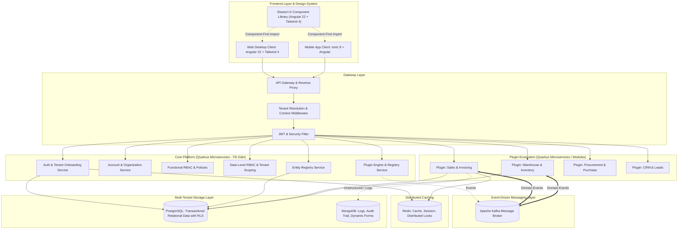
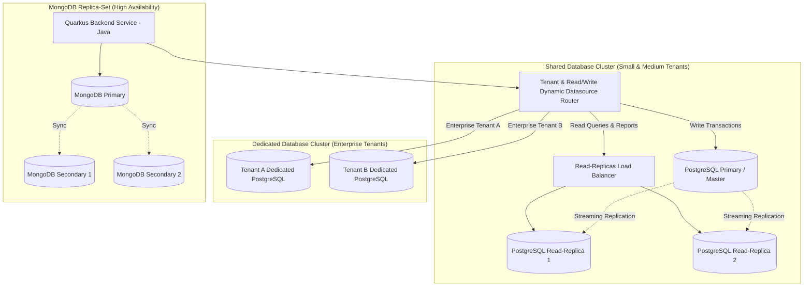

# Bản Thiết Kế Kiến Trúc Hệ Thống (System Architecture Blueprint)

- **Hệ thống**: Open-ERP SaaS Platform
- **Mô hình kiến trúc**: Microservices & Modular Plugin-based Architecture
- **Mô hình phục vụ**: B2B Multi-Tenant SaaS
- **Backend Framework**: **Quarkus** (Ngôn ngữ chuẩn: **Java**)
- **Frontend Web / Desktop**: **Angular >= 22** + **Tailwind CSS v4**
- **Frontend Mobile**: **Ionic 8 + Angular** (Tối giản tính năng)
- **Data & Messaging Stack**: **PostgreSQL** (Master-Slave/Multi-DB) + **MongoDB** (Replica-Set) + **Redis** + **Apache Kafka**
- **Tài liệu tham chiếu**: [sdlc_process.md](../../../.agents/rules/sdlc_process.md)

---

## 1. Sơ Đồ Kiến Trúc Tổng Thể (High-Level Architecture)



---

## 2. Ranh Giới Core vs. Plugins

### 2.1. Hệ Thống Core (Bắt Buộc, Không Thể Gỡ Bỏ)
Chỉ chịu trách nhiệm làm nền móng vững chắc cho nền tảng SaaS:
1. **Đăng ký & Đăng nhập (Auth & Onboarding)**:
   - Đăng ký công ty (Tenant Onboarding), cấp phát Subdomain / Tenant Slug.
   - Đăng nhập, xác thực OAuth2/JWT, quản lý phiên, xác thực 2 lớp (2FA).
2. **Quản lý Tài Khoản & Cơ Cấu Tổ Chức (Account & Organization)**:
   - Quản lý hồ sơ nhân viên trong Tenant, mời người dùng vào Tenant.
   - Sơ đồ phòng ban, chi nhánh, nhóm làm việc.
3. **Phân Quyền Chức Năng (Functional RBAC)**:
   - Quản lý vai trò (Roles) và quyền thao tác (Permissions: Create, Read, Update, Delete trên từng resource).
4. **Phân Quyền Dữ Liệu (Data-Level Scoping & Row-Level Security)**:
   - Ràng buộc phạm vi nhìn thấy dữ liệu: Toàn công ty (Tenant-wide), Chi nhánh (Branch-only), hoặc Cá nhân (Owner-only).
5. **Quản Lý Plugin (Plugin Engine & Registry)**:
   - Danh mục Plugin có sẵn (Catalog).
   - Quản lý trạng thái cài đặt của từng Tenant: `installed`, `active`, `inactive`, `uninstalled`.
   - Điều phối thực thi script migration dữ liệu khi cài đặt, cập nhật hoặc gỡ bỏ.
6. **Đăng Ký Thực Thể (Entity Registry Service)**:
   - Lưu trữ siêu dữ liệu (metadata) của tất cả thực thể CSDL được công bố bởi các module/plugin.
   - Cung cấp API nội bộ cho các plugin khám phá và liên kết dữ liệu chéo module.

### 2.2. Hệ Thống Plugin (Tùy Biến, Cài/Gỡ Độc Lập)
Tất cả các module nghiệp vụ đều là Plugin:
- Khách hàng có thể chỉ cài Plugin "Bán Hàng" và "Kho", không cần cài "Kế Toán" hay "Nhân Sự".
- Khi một Plugin được gỡ bỏ:
  - Menu và màn hình giao diện của plugin biến mất khỏi Web và Mobile của Tenant.
  - Các API routes của plugin bị vô hiệu hóa đối với Tenant đó.
  - Dữ liệu của Tenant được snapshot sao lưu an toàn hoặc lưu trữ (archive).

---

## 3. Kiến Trúc Frontend: Angular 22, Ionic & Thư Viện Dùng Chung (Shared UI Library)

### 3.1. Thư Viện Giao Diện Dùng Chung (`shared-ui-lib`)
Nhằm đảm bảo giao diện đồng nhất tuyệt đối giữa bản Web Desktop và Mobile App:
- Xây dựng dưới dạng một thư viện nội bộ (Angular Library / Monorepo Package).
- **Công nghệ nền tảng**: **Angular >= 22** kết hợp **Tailwind CSS v4**.
- **Quy tắc Component-First (Bắt buộc)**:
  1. Khi cần bất kỳ UI component mới nào $\rightarrow$ **Phải tạo trong `shared-ui-lib` trước**.
  2. Component phải được kiểm thử độc lập, hỗ trợ giao diện đáp ứng (responsive), dark/light mode và khả năng tiếp cận (Accessibility - a11y).
  3. Web App và Mobile App chỉ đóng vai trò ghép nối các component từ `shared-ui-lib`.
- **Chính sách thư viện bên thứ 3**: Hạn chế tối đa; tự xây dựng các thành phần UI (Form Controls, Modals, Tables, Drawers, Cards, Badges, Charts) để làm chủ hoàn toàn mã nguồn và tối ưu bundle size.

### 3.2. Ma Trận Phân Định Nền Tảng (Desktop vs. Mobile Matrix)
Mobile được thiết kế **tối giản chức năng**, chỉ phục vụ các tác vụ tại chỗ, thao tác nhanh:

| Nghiệp Vụ | Web / Desktop (Angular 22) | Mobile (Ionic + Angular) |
| :--- | :--- | :--- |
| **Bán hàng (Sales)** | Tạo báo giá, lập hóa đơn, quản lý chiết khấu phức tạp, xem biểu đồ doanh số đa chiều, đối soát công nợ | Xem danh sách đơn, duyệt nhanh đơn hàng, quét QR thanh toán, tạo đơn hàng nhanh |
| **Kho (Inventory)** | Kiểm kê kho định kỳ, cấu hình vị trí kho, nhập xuất chuyển kho hàng loạt, dự báo tồn kho | Quét mã vạch xuất/nhập hàng, kiểm tra số lượng tồn tại điểm bán |
| **Nhân sự (HRM)** | Cấu hình bảng lương, duyệt nghỉ phép, chấm công tổng thể, quản lý hợp đồng | Điểm danh vị trí (GPS Check-in), xin nghỉ phép, xem phiếu lương cá nhân |
| **Cấu hình hệ thống** | Đầy đủ quyền quản trị Tenant, cài đặt Plugin, phân quyền vai trò | Không hỗ trợ (chỉ xem thông tin công ty cơ bản) |

---

## 4. Quản Lý Vòng Đời Plugin & Manifest Mở Rộng

### 4.1. Cấu Trúc Plugin Manifest (`plugin.json`)
```json
{
  "id": "open-erp-sales",
  "name": "Bán Hàng & Hóa Đơn",
  "version": "1.2.0",
  "description": "Quản lý báo giá, đơn hàng, hóa đơn và doanh thu bán hàng",
  "author": "Open-ERP Core Team",
  "core_version_compatibility": ">=1.0.0",
  "dependencies": {
    "open-erp-inventory": ">=1.1.0"
  },
  "platforms": {
    "desktop": {
      "supported": true,
      "routes": { "api_prefix": "/api/v1/sales", "ui_entry": "/apps/sales" },
      "features": ["order_management", "invoice_generation", "advanced_reports", "price_rules"]
    },
    "mobile": {
      "supported": true,
      "routes": { "api_prefix": "/api/v1/sales/mobile", "ui_entry": "/mobile/sales" },
      "features": ["quick_order", "order_status_tracking", "quick_approval"]
    }
  },
  "entities": [
    {
      "name": "SaleOrder",
      "storage": "postgres",
      "table": "sales_orders",
      "public_fields": ["id", "code", "customer_id", "total_amount", "status", "created_at"],
      "relations": [
        { "name": "items", "target_entity": "SaleOrderItem", "type": "one_to_many" }
      ]
    }
  ],
  "kafka_events": {
    "publishes": ["erp.sales.order-created", "erp.sales.order-cancelled", "erp.sales.invoice-issued"],
    "subscribes": ["erp.inventory.stock-reserved"]
  },
  "permissions": [
    { "code": "sales:view", "name": "Xem đơn bán hàng" },
    { "code": "sales:create", "name": "Tạo đơn bán hàng" },
    { "code": "sales:approve", "name": "Duyệt đơn bán hàng" }
  ]
}
```

---

## 5. Cơ Chế Entity Registry & Đa Cơ Sở Dữ Liệu

### 5.1. Cơ Chế Đăng Ký Thực Thể (Entity Registry)
- Mỗi Plugin Quarkus khi khởi động sẽ tự động phát hiện các Panache Entity có chú thích `@RegisterEntity` và đăng ký với `EntityRegistryService`.
- **Cấu trúc lưu trữ Entity Registry**:
```sql
CREATE TABLE sys_entity_registry (
    id UUID PRIMARY KEY DEFAULT gen_random_uuid(),
    plugin_id VARCHAR(100) NOT NULL,
    entity_name VARCHAR(100) NOT NULL,
    storage_type VARCHAR(20) NOT NULL, -- 'postgres' | 'mongodb'
    table_or_collection VARCHAR(100) NOT NULL,
    schema_definition JSONB NOT NULL,
    exported_relations JSONB,
    registered_at TIMESTAMP WITH TIME ZONE DEFAULT CURRENT_TIMESTAMP,
    CONSTRAINT uq_plugin_entity UNIQUE (plugin_id, entity_name)
);
```

### 5.2. Phân Định Lưu Trữ: PostgreSQL vs. MongoDB vs. Redis
1. **PostgreSQL**:
   - Dữ liệu nghiệp vụ cốt lõi, bảng quan hệ cần tính toàn vẹn ACID (Đơn hàng, Khách hàng, Sản phẩm, Tồn kho, Tài khoản, Phân quyền).
   - Tích hợp Row-Level Security (RLS) gắn chặt `tenant_id`.
2. **MongoDB**:
   - Dữ liệu dạng tài liệu JSON không cố định cấu trúc: Nhật ký kiểm toán thao tác người dùng (Audit Logs), Lịch sử thay đổi tài liệu (Document History), Dynamic Form Builder Schemas, Tệp đính kèm metadata.
3. **Redis**:
   - Bộ nhớ đệm phân tán (Distributed Cache) cho kết quả truy vấn thường xuyên (Catalog danh mục, Quyền hạn người dùng).
   - Quản lý phiên đăng nhập (Session store), Token blacklist, và Distributed Locks (tránh trùng đơn hàng, tranh chấp tồn kho).
4. **Apache Kafka**:
   - Trục xương sống truyền thông sự kiện bất đồng bộ giữa các Quarkus services và Plugins.
   - Định dạng thông điệp: CloudEvents JSON hoặc Avro Schema.

### 5.3. Kiến Trúc CSDL Mở Rộng: Multi-Database, Master-Slave & Replica-Set



#### Các Đặc Tính Kỹ Thuật:
1. **Hỗ trợ Dedicated Database (Database-per-Tenant)**:
   - Các doanh nghiệp lớn có thể cấu hình database riêng biệt. Quarkus tự động tạo datasource pool và trích xuất schema độc lập khi khởi động hoặc on-demand.
2. **Tách luồng Đọc/Ghi (Master - Slave / Read-Replicas)**:
   - Toàn bộ truy vấn đọc (báo cáo, danh sách, xuất excel) được chuyển tải sang các bản sao Read-Replicas, giảm 70-80% tải trên node Master.
   - Node Master chỉ tập trung xử lý các giao dịch ghi có tính toàn vẹn cao.
3. **Mô hình Replica-Set cho MongoDB & PostgreSQL Streaming Replication**:
   - Đảm bảo cơ chế tự động bầu chọn (Automatic Election & Failover) trong vòng 2-3 giây nếu node chính gặp sự cố, đảm bảo uptime 99.99% cho dịch vụ SaaS.

