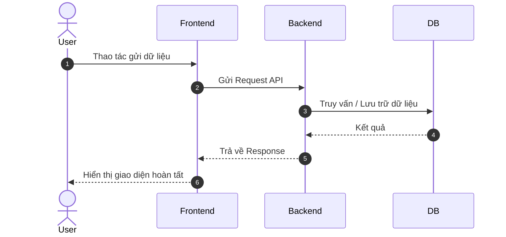

# [MÃ_TÍNH_NĂNG] Thiết Kế Kiến Trúc Hệ Thống (Architecture Design)

- **Tính năng**: [Tên tính năng]
- **Phụ trách**: Solution Architect Agent
- **Ngày lập**: YYYY-MM-DD

---

## 1. Sơ Đồ Kiến Trúc Thành Phần (Component Architecture)
```mermaid
graph TD
    Client[Web / Mobile Client] --> API Gateway
    API Gateway --> ServiceA[Module Service]
    ServiceA --> DB[(Database)]
    ServiceA --> Cache[(Redis Cache)]
```

---

## 2. Luồng Xử Lý (Sequence Diagram)


---

## 3. Quản Lý Trạng Thái & Luồng Dữ Liệu (State Machine / Data Flow)
- Liệt kê các trạng thái (States): `Draft` -> `Pending_Approval` -> `Approved` -> `Completed` / `Cancelled`.
- Điều kiện chuyển trạng thái (Transitions & Triggers).
