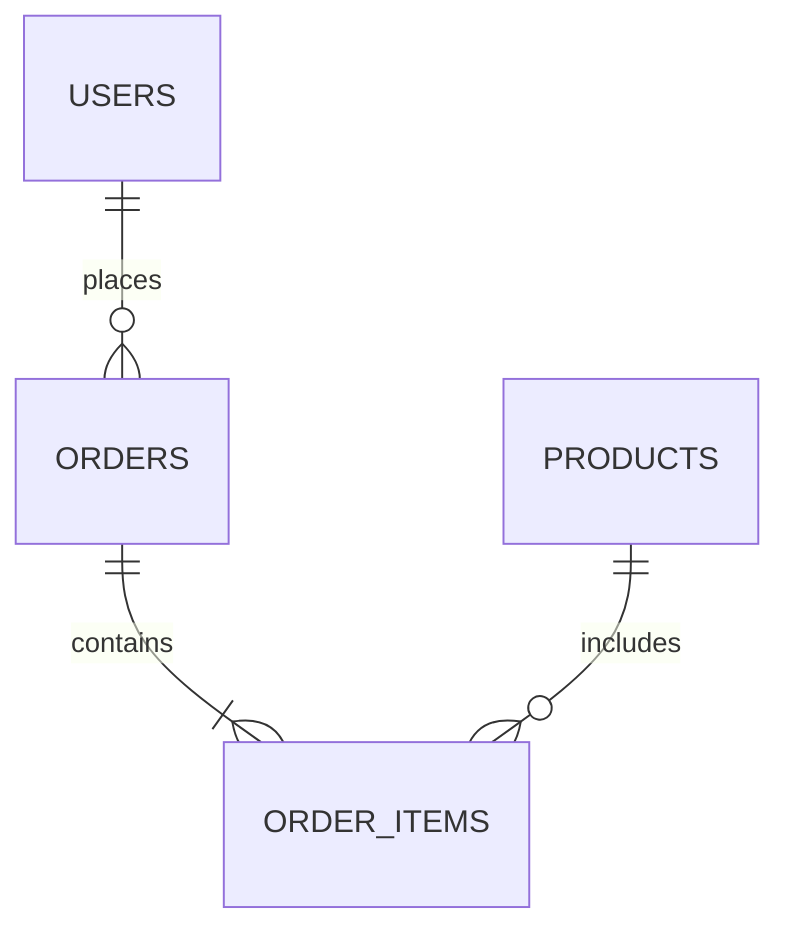

# [MÃ_TÍNH_NĂNG] Thiết Kế Cơ Sở Dữ Liệu (Database Schema / ERD)

- **Tính năng**: [Tên tính năng]
- **Phụ trách**: Solution Architect Agent
- **Hệ quản trị CSDL**: [PostgreSQL / MySQL / SQLite...]

---

## 1. Sơ Đồ Thực Thể Quan Hệ (ERD)

---

## 2. Đặc Tả Chi Tiết Các Bảng (Table Specifications)

### Bảng 1: `table_name`
| Tên Cột | Kiểu Dữ Liệu | Nullable | Khóa / Chỉ Mục | Giá Trị Mặc Định | Mô Tả Nghiệp Vụ |
| :--- | :--- | :--- | :--- | :--- | :--- |
| `id` | UUID / INT | NO | PRIMARY KEY | auto-gen | Mã định danh |
| `code` | VARCHAR(50) | NO | UNIQUE | | Mã nghiệp vụ hiển thị |
| `name` | VARCHAR(255)| NO | INDEX | | Tên |
| `status` | VARCHAR(30) | NO | | 'draft' | Trạng thái |
| `created_at`| TIMESTAMP | NO | | CURRENT_TIMESTAMP | Thời gian tạo |
| `updated_at`| TIMESTAMP | NO | | CURRENT_TIMESTAMP | Thời gian cập nhật |

---

## 3. Ràng Buộc Khóa Ngoại & Chỉ Mục (Foreign Keys & Indexes)
- `fk_table_ref`: `table_name.ref_id` references `parent_table.id` (ON DELETE RESTRICT).
- `idx_table_status_created`: Index kết hợp trên `(status, created_at DESC)`.

---

## 4. Kế Hoạch Migration Dữ Liệu
- Tạo mới bảng: `migrations/xxxx_create_table_name.sql`
- Seed dữ liệu mặc định (nếu có).
