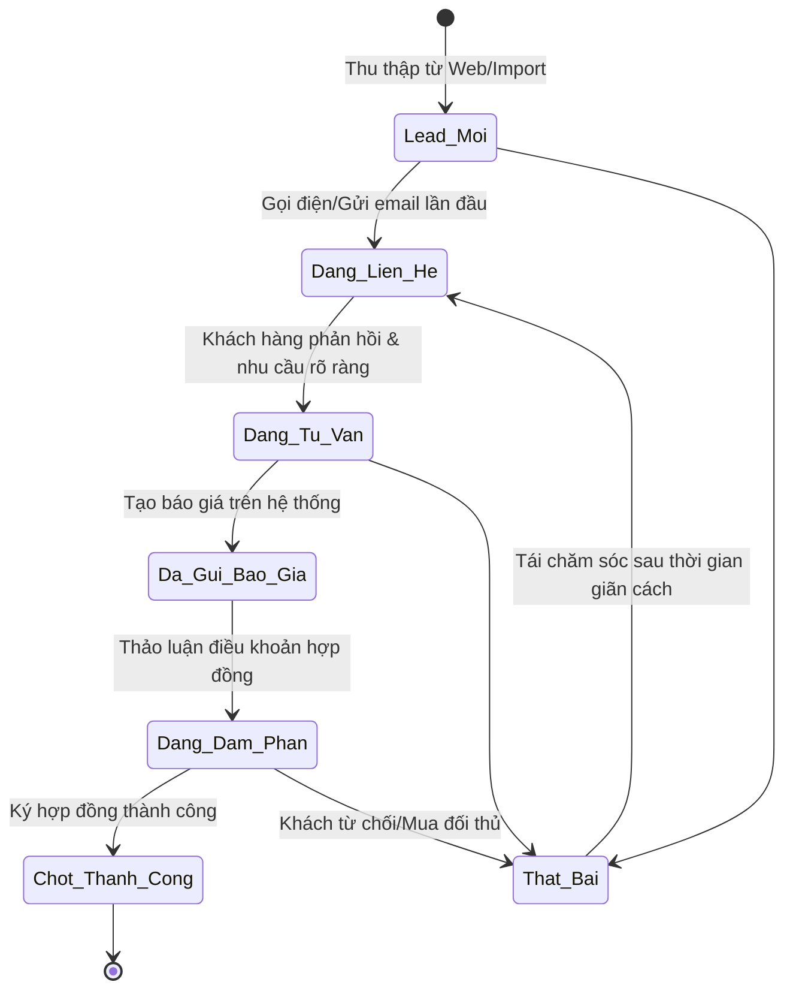
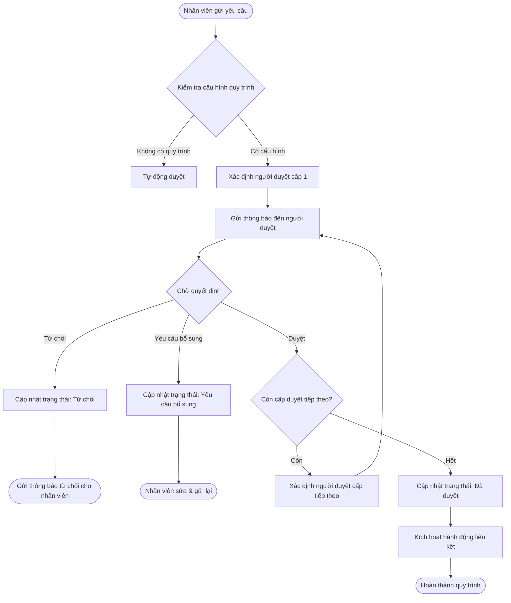

# Tài liệu đặc tả yêu cầu chức năng (Functional Requirement Specification - FRS)
## Dự án: Nền tảng SaaS quản trị doanh nghiệp hợp nhất - Enterprise SaaS Platform

---

### 1. Cơ chế xác thực & Phân quyền (Auth & RBAC)
Hệ thống sử dụng cơ chế xác thực JWT (JSON Web Tokens) kết hợp phân quyền theo vai trò (Role-Based Access Control - RBAC) và phân quyền chi tiết theo dữ liệu (Attribute-Based/Row-Level Security).

#### 1.1 Quản trị vai trò và quyền hạn
* **Input:** Tên vai trò, mô tả, danh sách quyền được chọn (Xem, Thêm, Sửa, Xóa, Xuất) trên từng Phân hệ nghiệp vụ.
* **Quy tắc xử lý:**
  - Hệ thống cung cấp sẵn các vai trò mặc định (System Roles) không thể xóa hoặc sửa quyền tối thiểu: `Owner`, `Admin`, `Employee`.
  - Admin có thể tạo thêm các vai trò tùy chỉnh (e.g., `Kế toán trưởng`, `Trưởng phòng kinh doanh`).
  - Phân quyền theo cấp độ dữ liệu (Data Scope):
    - *Cá nhân:* Chỉ xem/sửa dữ liệu do mình tạo hoặc được gán phụ trách.
    - *Phòng ban:* Xem/sửa dữ liệu của toàn bộ nhân viên thuộc phòng ban của mình.
    - *Chi nhánh:* Xem/sửa dữ liệu của toàn bộ phòng ban thuộc chi nhánh của mình.
    - *Toàn công ty:* Xem/sửa toàn bộ dữ liệu của Tenant.
* **Output:** Bản ghi vai trò mới lưu vào DB, cập nhật danh sách quyền của người dùng tức thì mà không cần đăng nhập lại (real-time policy refresh via Redis).

---

### 2. Vòng đời dữ liệu & Máy trạng thái (State Machines)

#### 2.1 Máy trạng thái Cơ hội bán hàng (Sales Opportunity States)

#### 2.2 Máy trạng thái Công việc (Task States)
* **Chưa bắt đầu (Todo):** Mới tạo, chưa có hành động thực hiện.
* **Đang thực hiện (In-progress):** Người thực hiện bấm "Bắt đầu làm việc".
* **Chờ phản hồi (Pending):** Đang chờ thông tin từ bên thứ ba hoặc khách hàng.
* **Chờ duyệt (Review):** Người thực hiện bấm "Hoàn thành", chờ người giao việc phê duyệt.
* **Hoàn thành (Done):** Người giao việc bấm "Phê duyệt".
* **Hủy (Cancelled):** Người giao hoặc Admin hủy công việc.

#### 2.3 Máy trạng thái Đề xuất phê duyệt (Approval Request States)
* **Nháp (Draft):** Nhân viên tạo đơn nhưng chưa gửi.
* **Chờ duyệt (Pending):** Đã gửi đơn, đang chờ cấp duyệt hiện tại thao tác.
* **Đang duyệt (Processing):** Đối với quy trình nhiều cấp, cấp 1 đã duyệt và đang chờ cấp 2.
* **Đã duyệt (Approved):** Cấp duyệt cuối cùng đồng ý.
* **Từ chối (Rejected):** Một trong các cấp duyệt không đồng ý.
* **Yêu cầu bổ sung (Change Requested):** Người duyệt yêu cầu chỉnh sửa lại thông tin chứng từ.

---

### 3. Quy tắc kiểm tra dữ liệu (Validation Rules)

#### 3.1 Quy tắc chung
* **Không để trống (Required Fields):** Các trường mã chứng từ, ngày chứng từ, người tạo, tenant_id luôn bắt buộc.
* **Định dạng dữ liệu (Data Formats):**
  - Email: Phải tuân theo định dạng chuẩn RFC 5322.
  - Số điện thoại: Phải bắt đầu bằng số `0` hoặc mã quốc gia `+`, độ dài từ 9-11 chữ số.
  - Giá trị tiền tệ: Không được âm, lưu trữ dưới dạng số nguyên (BigInt) để tránh sai số dấu phẩy động.

#### 3.2 Quy tắc nghiệp vụ đặc thù
* **Số chứng từ tự động (Auto-numbering):**
  - *Ví dụ:* Phiếu thu có mã `PT-{yyyy}{mm}-{seq}` (seq là số tự tăng từ `0001` và reset về `0001` vào ngày đầu tiên của tháng).
  - Trước khi ghi nhận bản ghi vào database, hệ thống sử dụng Redis distributed lock dựa trên key `tenant:seq:{format}` để đảm bảo không bị trùng lặp số chứng từ khi có nhiều giao dịch đồng thời.

---

### 4. Luồng xử lý phê duyệt đa cấp (Approval Flow Processing)

* **Hành động liên kết (Trigger Action):**
  - Khi đơn *Nghỉ phép* được duyệt: Hệ thống tự động trừ ngày phép trong bảng công HRM.
  - Khi đơn *Đề nghị thanh toán* được duyệt: Hệ thống tự động tạo bản ghi *Phiếu chi nháp* trong phân hệ Kế toán.
  - Khi đơn *Đề xuất mua sắm* được duyệt: Hệ thống tự động chuyển trạng thái để bộ phận mua hàng tạo PO.

---

### 5. Yêu cầu thông báo (Notifications System)

#### 5.1 Kênh thông báo hỗ trợ
* **In-app Notification:** Hiển thị tức thì trên giao diện Web thông qua kết nối WebSocket (Websocket Server built with Socket.io/Redis Adapter).
* **Email Notification:** Gửi email HTML tóm tắt nội dung công việc/yêu cầu phê duyệt qua dịch vụ Amazon SES hoặc SendGrid.
* **Zalo ZNS / SMS:** Gửi tin nhắn đến số điện thoại người nhận đối với các thông báo khẩn cấp hoặc cập nhật trạng thái đơn hàng/khách hàng.

#### 5.2 Ma trận sự kiện và nội dung thông báo mẫu
| Loại sự kiện | Đối tượng nhận | Kênh | Nội dung mẫu |
| :--- | :--- | :--- | :--- |
| Giao việc mới | Người thực hiện | In-app, Email | "Bạn được giao công việc [Tên việc] bởi [Người giao]. Hạn hoàn thành: [Deadline]." |
| Có đề xuất cần duyệt | Người duyệt cấp hiện tại | In-app, Email | "Bạn có một yêu cầu phê duyệt mới: [Tên đề xuất] từ nhân viên [Tên nhân viên]." |
| Yêu cầu được duyệt | Người gửi đề xuất | In-app | "Yêu cầu phê duyệt [Tên đề xuất] của bạn đã được duyệt bởi [Người duyệt]." |
| Công việc quá hạn | Người thực hiện & Người giao | In-app, Email | "CẢNH BÁO: Công việc [Tên việc] đã quá hạn hoàn thành [X] ngày." |

---

### 6. Xử lý ngoại lệ & Lỗi (Exception Handling)
* **Mất kết nối Database:** Trả về mã lỗi HTTP 503 Service Unavailable, ghi log chi tiết lỗi hệ thống vào Winston/ELK stack, hiển thị màn hình bảo trì thân thiện cho người dùng.
* **Lỗi phân quyền (403 Forbidden):** Ghi nhận vào audit log hành vi cố gắng truy cập trái phép của IP/User ID, hiển thị thông báo "Bạn không có quyền thực hiện hành động này".
* **Lỗi tranh chấp dữ liệu (Optimistic Locking):** Khi hai người cùng sửa một bản ghi (ví dụ: cùng cập nhật thông tin khách hàng), hệ thống sử dụng trường `version` (kiểu dữ liệu integer tăng dần). Người cập nhật sau sẽ nhận thông báo "Dữ liệu đã được thay đổi bởi người dùng khác. Vui lòng tải lại trang".
