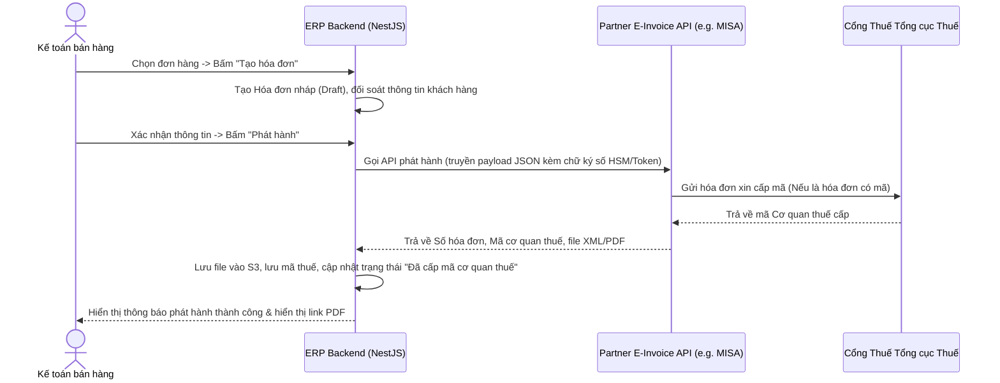

# Đặc tả nghiệp vụ Kế toán & Hóa đơn điện tử Việt Nam
## Dự án: Nền tảng SaaS quản trị doanh nghiệp hợp nhất - Enterprise SaaS Platform

---

### 1. Phân tích giải pháp & Kiến trúc thiết kế (Gemini Analysis Responses)

#### 1.1 Tự xây dựng module Hóa đơn điện tử hay Tích hợp?
* **Khuyến nghị:** Hệ thống SaaS **bắt buộc phải đi theo hướng Tích hợp** với các nhà cung cấp hóa đơn điện tử (HDDT) được Tổng cục Thuế Việt Nam cấp phép (như MISA meInvoice, VNPT, Viettel SInvoice, BKAV...).
* **Lý do:**
  - *Tính pháp lý:* Trở thành nhà cung cấp HDDT hoặc TVAN (Tổ chức truyền nhận dữ liệu thuế) đòi hỏi chứng nhận khắt khe của Bộ Tài chính, hạ tầng mạng bảo mật cao và giấy phép dịch vụ truyền nhận.
  - *Tính cập nhật:* Luật Thuế và định dạng truyền nhận hóa đơn của cơ quan Thuế thay đổi liên tục. Tích hợp giúp giảm tải bảo trì kỹ thuật cho đội ngũ phát triển SaaS.

#### 1.2 Thiết kế `E-Invoice Integration Adapter`
Hệ thống sử dụng mẫu thiết kế **Strategy Pattern** ở lớp Backend (NestJS) để tạo ra một cổng tích hợp chung (Common Interface):

```typescript
export interface IEInvoiceAdapter {
  validateConnection(config: TenantEInvoiceConfig): Promise<boolean>;
  createAndIssue(invoiceData: EInvoicePayload): Promise<EInvoiceResult>;
  cancelInvoice(invoiceId: string, reason: string): Promise<EInvoiceResult>;
  adjustInvoice(invoiceId: string, adjustmentData: EInvoiceAdjustmentPayload): Promise<EInvoiceResult>;
  replaceInvoice(invoiceId: string, replacementData: EInvoicePayload): Promise<EInvoiceResult>;
  getStatus(invoiceNumber: string): Promise<EInvoiceStatus>;
  downloadFiles(invoiceId: string): Promise<{ xml: string; pdf: string }>;
}
```
Mỗi nhà cung cấp (MISA, VNPT, Viettel...) được triển khai như một class Plugin/Adapter kế thừa interface trên. Khi Tenant cấu hình nhà cung cấp nào, Connection Factory sẽ khởi tạo Adapter tương ứng.

#### 1.3 Phân chia lưu trữ dữ liệu giữa SaaS và Nhà cung cấp HDDT
* **Dữ liệu lưu tại SaaS:**
  - Siêu dữ liệu hóa đơn (Mã khách hàng, MST, ngày lập, trước thuế, tiền thuế, tổng thanh toán, thuế suất).
  - Thông tin ký hiệu mẫu số (Mẫu số, Ký hiệu, Số hóa đơn).
  - Mã tra cứu hóa đơn và Mã cơ quan thuế cấp về.
  - Bản lưu trữ vật lý file XML và file PDF hóa đơn được tải về từ nhà cung cấp HDDT.
  - Nhật ký tích hợp (Integration logs) và bảng ánh xạ thực thể (Sales Order ID <-> Invoice ID).
* **Dữ liệu lưu tại Nhà cung cấp HDDT:**
  - Bản gốc hóa đơn điện tử có giá trị pháp lý chứa chữ ký số của người bán và người mua.
  - Lịch sử truyền nhận dữ liệu trực tiếp với Cơ quan Thuế.

#### 1.4 Cơ chế đồng bộ trạng thái hóa đơn
* **Luồng chính:** Hệ thống gửi yêu cầu phát hành sang nhà cung cấp HDDT, nhận phản hồi tức thì (Real-time API response) lưu trạng thái `Đã phát hành` hoặc `Lỗi phát hành`.
* **Luồng nhận mã Cơ quan Thuế:** Đối với hóa đơn có mã, hệ thống cấu hình **Webhook Endpoint** để nhận gói tin callback tự động từ nhà cung cấp HDDT khi cơ quan Thuế trả kết quả cấp mã.
* **Luồng đối soát dự phòng (Cronjob):** Một tác vụ quét tự động chạy mỗi 1 giờ đối với các hóa đơn có trạng thái `Chờ cấp mã` hoặc `Chờ đồng bộ` để gọi API truy vấn trạng thái từ nhà cung cấp HDDT, đảm bảo tính nhất quán dữ liệu.

#### 1.5 Xử lý lỗi phát hành hóa đơn
* **Lỗi kiểm tra nghiệp vụ (Validation Error):** Sai định dạng MST, sai thông tin hàng hóa -> Hệ thống chặn ngay tại Frontend/API Gateway, không gửi sang nhà cung cấp HDDT, hiển thị lỗi rõ ràng cho người dùng.
* **Lỗi kết nối mạng (Network Timeout):** Hệ thống đưa yêu cầu phát hành vào hàng đợi **BullMQ (Redis-backed Queue)** với cấu hình Retry 3 lần (khoảng cách 5 phút/lần). Nếu vẫn lỗi, chuyển trạng thái hóa đơn về `Đồng bộ lỗi`, gửi thông báo khẩn cấp (WebSocket) cho kế toán thực hiện gửi lại thủ công.

#### 1.6 Phương án lưu trữ file XML và PDF
* File XML (chứa dữ liệu hóa đơn gốc ký số) và file PDF (bản hiển thị trực quan) được tải về từ nhà cung cấp HDDT ngay sau khi phát hành thành công.
* Lưu trữ tại AWS S3 bucket riêng tư của Tenant: `s3://open-erp-bucket/tenants/{tenant_id}/einvoices/{year}/{month}/{invoice_uuid}.{xml|pdf}`.
* Ghi nhận mã SHA-256 hash của tệp tin vào database để đối soát chống giả mạo tệp tin.

#### 1.7 Cơ chế kiểm tra hóa đơn đầu vào
* Khi kế toán upload file XML hóa đơn đầu vào, Backend sử dụng thư viện XML Parser (như `fast-xml-parser`) trích xuất các trường thông tin: MST người bán, MST người mua (phải khớp với MST của Tenant), số tiền, thuế suất.
* Gọi API đối soát (nếu nhà cung cấp HDDT hỗ trợ dịch vụ kiểm tra hóa đơn đầu vào) hoặc tự động kiểm tra chữ ký số chứa trong file XML có hợp lệ và được ký bởi nhà cung cấp chứng thư số hợp pháp tại Việt Nam (Root CA) hay không.

#### 1.8 Xuất dữ liệu kê khai thuế
* Cho phép chọn Kỳ kê khai (Tháng/Quý).
* Kết xuất báo cáo định dạng Excel tương thích chính xác với cấu trúc bảng kê mua vào, bán ra của ứng dụng **HTKK** (Hỗ trợ kê khai của Tổng cục Thuế) để kế toán có thể copy-paste trực tiếp.

#### 1.9 Phân quyền nghiệp vụ Kế toán - Thuế
* Quản lý phân quyền chi tiết thông qua hệ thống RBAC:
  - *Kế toán viên:* Có quyền tạo hóa đơn nháp, nhập hóa đơn đầu vào.
  - *Kế toán trưởng:* Có quyền duyệt hóa đơn nháp, phát hành hóa đơn (ký số), điều chỉnh, hủy hóa đơn, và chốt kỳ kê khai.
  - *CFO/CEO:* Xem toàn bộ báo cáo, kiểm toán dữ liệu lịch sử.

#### 1.10 Đảm bảo tuân thủ pháp luật Việt Nam nhưng linh hoạt mở rộng
* Thiết kế database tách biệt: các cột chung (tax, discount, total) được giữ nguyên theo chuẩn quốc tế.
* Các trường đặc thù của Việt Nam (Mẫu số, Ký hiệu, Mã cơ quan thuế, Kê khai HTKK) được gom vào một trường JSONB mở rộng (`vietnam_tax_metadata`) hoặc thiết kế trong một bảng mở rộng liên kết 1-1 (`vn_invoice_metadata`), giúp hệ thống dễ dàng mở rộng sang các quốc gia khác bằng cách thêm các bảng metadata tương ứng.

---

### 2. Đặc tả yêu cầu chức năng chi tiết

#### 2.1 Quản lý hóa đơn bán ra (Outward Invoice Management)
* **Luồng nghiệp vụ phát hành hóa đơn:**


* **Trạng thái hóa đơn chi tiết:**
  - `Nháp` (Draft): Đang soạn thảo, có thể sửa/xóa.
  - `Chờ phát hành` (Pending_Issue): Kế toán đã bấm gửi duyệt ký số.
  - `Đã phát hành` (Issued): Đã gửi sang nhà cung cấp HDDT thành công.
  - `Đã cấp mã cơ quan thuế` (Tax_Coded): Cơ quan Thuế đã xác thực và cấp mã.
  - `Không được cấp mã` (Tax_Rejected): Từ chối cấp mã (lỗi thông tin).
  - `Đã điều chỉnh` (Adjusted): Hóa đơn điều chỉnh cho hóa đơn sai sót cũ.
  - `Đã thay thế` (Replaced): Hóa đơn mới thay thế hoàn toàn cho hóa đơn cũ.
  - `Đã hủy` (Cancelled): Hóa đơn bị hủy giao dịch.

#### 2.2 Quản lý hóa đơn đầu vào (Inward Invoice Management)
* **Đọc và Trích xuất file XML hóa đơn:**
  - Khi kế toán kéo thả file XML hóa đơn mua vào, hệ thống trích xuất tự động:
    - *Mã số thuế người bán* -> Đối soát danh mục Nhà cung cấp trong Kho.
    - *MST người mua* -> Phải trùng khớp với MST của công ty đăng ký (Tenant).
    - *Danh sách mặt hàng* -> Kế toán chọn ánh xạ (map) sang danh mục vật tư trong Kho của ERP.
* **Quy tắc đối soát trùng lặp:**
  - Hệ thống tự động kiểm tra trong database: Nếu tồn tại bản ghi hóa đơn có cùng (MST người bán + Ký hiệu + Số hóa đơn + Ngày lập) -> Cảnh báo trùng lặp tức thì trên màn hình và không cho phép lưu bản ghi mới.

#### 2.3 Quản lý kỳ kế toán và kỳ kê khai Thuế
* **Chốt kỳ kế toán (Fiscal Period Lock):**
  - Cho phép cấu hình chốt kỳ theo tháng hoặc quý.
  - Khi đã chốt kỳ, tất cả các hóa đơn đầu ra/đầu vào và phiếu thu/chi có ngày chứng từ nằm trong kỳ đó sẽ bị khóa cứng (Read-only). Không được sửa đổi, xóa hoặc tạo mới chứng từ lùi ngày vào kỳ đã chốt.
  - *Mở khóa kỳ:* Chỉ có tài khoản Kế toán trưởng có quyền mở khóa kỳ kế toán (yêu cầu nhập lý do mở khóa và ghi log audit bắt buộc).

---

### 3. Quy trình xử lý lỗi & Audit Logs nghiệp vụ Kế toán - Thuế

#### 3.1 Xử lý lỗi phát hành hóa đơn (Error Recovery Workflow)
1. **Lỗi kết nối (HTTP 502/503 từ nhà cung cấp HDDT):**
   - Chuyển trạng thái sang `Đồng bộ lỗi`.
   - Đẩy tác vụ vào hàng đợi retry.
   - Gửi in-app notification đến kế toán: *"Hóa đơn số [Số HD] gặp sự cố kết nối với MISA. Đang tự động thử lại..."*.
2. **Lỗi từ chối cấp mã từ Cơ quan Thuế (Ví dụ: khách hàng bị khóa MST):**
   - Chuyển trạng thái sang `Không được cấp mã`.
   - Hiển thị chi tiết mã lỗi và lý do của cơ quan Thuế trả về trực tiếp trên màn hình hóa đơn.
   - Cho phép kế toán lập biên bản hủy hóa đơn hoặc sửa thông tin để phát hành lại hóa đơn thay thế.

#### 3.2 Đặc tả Audit Log bắt buộc
Mọi hành động tác động đến hóa đơn và kỳ kê khai phải được ghi nhận vào bảng `audit_logs` không thể xóa:
```json
{
  "tenant_id": "9b1deb4d-3b7d-4bad-9bdd-2b0d7b3dcb6d",
  "user_id": "123e4567-e89b-12d3-a456-426614174000",
  "action": "E_INVOICE_CANCEL",
  "target_entity": "invoices",
  "target_id": "550e8400-e29b-41d4-a716-446655440000",
  "pre_state": { "status": "Tax_Coded", "total_amount": 10000000 },
  "post_state": { "status": "Cancelled", "cancel_reason": "Khách hàng hủy hợp đồng mua bán" },
  "ip_address": "113.161.45.23",
  "timestamp": "2026-06-12T17:51:00Z"
}
```
