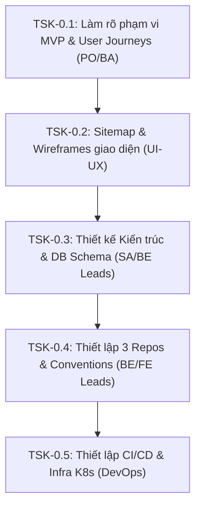

# Chỉ mục công việc Sprint 0 (Sprint 0 Task Index)
## Dự án: Nền tảng SaaS quản trị doanh nghiệp hợp nhất - Enterprise SaaS Platform

---

### 1. Thông tin chung Sprint 0
* **Mục tiêu Sprint:** Hoàn thiện giai đoạn khảo sát (Discovery), thống nhất phạm vi MVP, thiết kế kiến trúc hệ thống tổng thể, và thiết lập hạ tầng mã nguồn, môi trường CI/CD cho cả 3 dự án backend (`open-erp-services`), web (`open-erp-web`), và mobile (`open-erp-mobile`).
* **Thời gian thực hiện:** 2 tuần (Giả định).
* **Môi trường deploy:** Khởi tạo cụm Dev/Staging trên Cloud (AWS/GCP).
* **Các repository tác động:** Thiết lập và đồng bộ mã nguồn cho cả 3 repository.

---

### 2. Chỉ mục trạng thái công việc (Task Index Dashboard)

Dưới đây là danh sách các Task nền tảng cần triển khai trong Sprint 0 và trạng thái thực hiện hiện tại:

| ID | Tên công việc (Task Name) | Mô tả tóm tắt | Trạng thái (Status) | Nhân sự chính | Tài liệu chi tiết |
| :--- | :--- | :--- | :--- | :--- | :--- |
| **TSK-0.1** | Làm rõ phạm vi MVP & User Journeys | Phân tích bài toán, xác định chân dung người dùng (Personas) và vẽ các chuỗi hành trình nghiệp vụ chính của MVP. | [x] Hoàn thành | PO/BA | [task_01_discovery_scope.md](./task_01_discovery_scope.md) |
| **TSK-0.2** | Sitemap & Wireframes giao diện | Xây dựng sơ đồ trang (Sitemap) tổng thể và phác thảo các màn hình khung dây (Wireframes) cốt lõi. | [x] Hoàn thành | UI-UX | [task_02_ux_wireframes.md](./task_02_ux_wireframes.md) |
| **TSK-0.3** | Thiết kế Kiến trúc & Cơ sở dữ liệu | Thiết kế sơ đồ kiến trúc vật lý, mô hình dữ liệu (Database Schema) và thiết lập cơ chế Multi-tenant RLS. | [x] Hoàn thành | SA/BE Leads | [task_03_architecture_design.md](./task_03_architecture_design.md) |
| **TSK-0.4** | Thiết lập 3 Repositories & Convention | Init cấu hình NestJS, Angular, Ionic và đồng bộ quy chuẩn viết code (ESLint, Prettier, Git-flow). | [x] Hoàn thành | BE/FE Leads | [task_04_repository_setup.md](./task_04_repository_setup.md) |
| **TSK-0.5** | Thiết lập CI/CD & Infrastructure | Tạo hạ tầng Kubernetes Cluster, cấu hình Webhook tự động build và deploy lên môi trường Dev/Staging. | [ ] Todo | DevOps | [task_05_cicd_infrastructure.md](./task_05_cicd_infrastructure.md) |

### 3. Trật tự thực thi & Luồng phụ thuộc công việc (Execution Flow & Dependencies)

Để đảm bảo hiệu quả triển khai, các công việc trong Sprint 0 được tổ chức và thực hiện theo trật tự logic nghiêm ngặt với các mối quan hệ phụ thuộc như sau:

* **Chi tiết luồng thực hiện:**
  1. **Bước 1 (Làm rõ nghiệp vụ):** Bắt đầu bằng **TSK-0.1** để xác định chính xác MVP Scope và luồng đi của khách hàng. Đây là nền tảng đầu vào cho tất cả các khâu sau.
  2. **Bước 2 (Thiết kế trải nghiệm):** Thực hiện **TSK-0.2** dựa trên phạm vi đã chốt từ TSK-0.1 để phác thảo các màn hình khung dây và sitemap.
  3. **Bước 3 (Thiết kế kỹ thuật):** Tiến hành **TSK-0.3** để xây dựng mô hình dữ liệu (Database Schema), API overview và giải pháp RLS/real-time trên cơ sở cấu trúc màn hình và nghiệp vụ đã rõ từ TSK-0.1 và TSK-0.2.
  4. **Bước 4 (Thiết lập mã nguồn):** Thực hiện **TSK-0.4** để khởi tạo các dự án (`open-erp-services`, `open-erp-web`, `open-erp-mobile` và UI library chung `open-erp-ui`) cùng quy chuẩn code dựa trên các quyết định thiết kế kỹ thuật từ TSK-0.3.
  5. **Bước 5 (Tự động hóa & Cloud):** Kết thúc bằng **TSK-0.5** để viết Dockerfile, thiết lập cụm K8s Cloud và viết GitHub Actions Pipeline tự động build, deploy boilerplate code đã được chuẩn hóa ở TSK-0.4 lên các môi trường thử nghiệm.

---

### 4. Quy chuẩn Sprint 0
* **Hoàn thành hạ tầng trước code:** Mọi thiết lập CI/CD và môi trường chạy thử phải sẵn sàng trước khi kết thúc Sprint 0 để đảm bảo Sprint 1 có thể phát triển tính năng và kiểm thử tự động ngay lập tức.
* **Tài liệu hóa & Quy chuẩn GitHub Path Rules:** Các tài liệu thiết kế kiến trúc và sơ đồ database được lưu trữ trực tiếp trong thư mục `docs/` của dự án. Mọi tài liệu liên kết với nhau bắt buộc phải sử dụng **Đường dẫn tương đối (Relative Paths)** và **viết hoa/thường chính xác** theo quy chuẩn GitHub Path Rules đã nêu chi tiết trong [task_04_repository_setup.md](./task_04_repository_setup.md).
