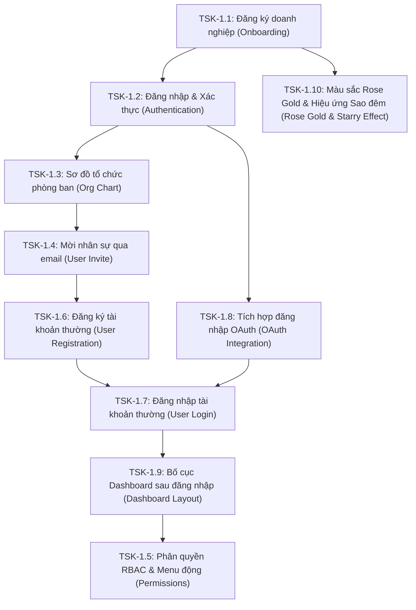

# Chỉ mục công việc Sprint 1 (Sprint 1 Task Index)
## Dự án: Nền tảng SaaS quản trị doanh nghiệp hợp nhất - Enterprise SaaS Platform

---

### 1. Thông tin chung Sprint 1
* **Mục tiêu Sprint:** Triển khai các phân hệ nền tảng cốt lõi bao gồm luồng đăng ký doanh nghiệp mới (Tenant Onboarding), hệ thống xác thực JWT/Refresh Token bảo mật, sơ đồ tổ chức chi nhánh/phòng ban, tính năng mời nhân sự bất đồng bộ qua email và phân quyền người dùng (RBAC) kết hợp hiển thị menu động theo vai trò.
* **Thời gian thực hiện:** 2 tuần (Giả định).
* **Môi trường chạy thử:** Dev Local (hạ tầng chạy bằng Docker, runtime ứng dụng debug trên VSCode) và deploy tự động lên cụm K8s Dev Cloud.

---

### 2. Chỉ mục trạng thái công việc (Task Index Dashboard)

Dưới đây là danh sách các Task cần triển khai trong Sprint 1:

| ID | Tên công việc (Task Name) | Mô tả tóm tắt | Trạng thái (Status) | Nhân sự chính | Tài liệu chi tiết |
| :--- | :--- | :--- | :--- | :--- | :--- |
| **TSK-1.1** | Đăng ký doanh nghiệp & Khởi tạo Tenant | Khách hàng đăng ký tài khoản doanh nghiệp mới, tự động khởi tạo tenant subdomain, cấp phát schema database riêng biệt phục vụ cô lập dữ liệu. | [x] Completed | BE/FE Leads | [task_01_tenant_registration.md](./tasks/task_01_tenant_registration.md) |
| **TSK-1.2** | Đăng nhập & Xác thực (Authentication) | Đăng nhập hệ thống bằng email và mật khẩu, trả về JWT Access Token và HTTP-Only Cookie Refresh Token, quản lý phiên kết nối bằng Redis. | [x] Completed | BE/FE Leads | [task_02_auth_login.md](./tasks/task_02_auth_login.md) |
| **TSK-1.3** | Sơ đồ Tổ chức & Phòng ban | Thiết lập sơ đồ chi nhánh và cấu hình phòng ban dạng cây phân cấp trực quan, quản lý trưởng bộ phận và chi tiết phòng ban. | [x] Completed | BE/FE Leads, UI-UX | [task_03_org_structure.md](./tasks/task_03_org_structure.md) |
| **TSK-1.4** | Mời nhân viên qua Email | Admin mời nhân viên mới tham gia vào phòng ban cụ thể bằng cách nhập email. Hệ thống gửi link kích hoạt tài khoản bất đồng bộ thông qua BullMQ & SES. | [ ] Todo | BE/FE Leads, DevOps | [task_04_user_management.md](./tasks/task_04_user_management.md) |
| **TSK-1.5** | Phân quyền RBAC & Menu động | Định nghĩa các nhóm quyền (Admin, Manager, Employee), phân quyền thao tác trên từng module và render menu điều hướng động theo vai trò. | [ ] Todo | BE/FE Leads, UI-UX | [task_05_basic_permissions.md](./tasks/task_05_basic_permissions.md) |
| **TSK-1.6** | Đăng ký tài khoản thường | Kích hoạt tài khoản và thiết lập mật khẩu cho nhân viên từ email mời mà không cần tạo tenant mới. | [ ] Todo | BE/FE Leads | [task_06_regular_user_registration.md](./tasks/task_06_regular_user_registration.md) |
| **TSK-1.7** | Đăng nhập tài khoản thường | Quy trình đăng nhập của tài khoản thường tại portal subdomain của tenant, đính kèm thông tin vai trò. | [ ] Todo | BE/FE Leads | [task_07_regular_user_login.md](./tasks/task_07_regular_user_login.md) |
| **TSK-1.8** | Tích hợp đăng nhập OAuth | Đăng nhập và đăng ký nhanh bằng tài khoản Google, Microsoft trên flat domain cho cả Web và Mobile. | [ ] Todo | BE/FE Leads | [task_08_oauth_integration.md](./tasks/task_08_oauth_integration.md) |
| **TSK-1.9** | Bố cục Dashboard sau đăng nhập | Xây dựng bố cục tổng thể hỗ trợ nhiều dạng di chuyển (ngang/dọc, thu gọn/đầy đủ) và phân nhóm menu động dựa trên quyền hạn/phân hệ. | [ ] Todo | FE Leads | [task_09_dashboard_layout.md](./tasks/task_09_dashboard_layout.md) |
| **TSK-1.10** | Màu sắc Rose Gold & Hiệu ứng Sao đêm | Cải tiến các nút bấm chính sang màu hồng ánh vàng Rose Gold và thêm hiệu ứng "Sao đêm" lấp lánh ánh kim vàng chân thực. | [ ] Todo | FE/UI Leads | [task_10_rose_gold_effects.md](./tasks/task_10_rose_gold_effects.md) |
| **BUG-1.1** | Lỗi kích hoạt cảnh báo validate quá sớm | Dù người dùng chưa thao tác ở ô input nhưng đã hiển thị cảnh báo validate ngay khi click vào một vị trí bất kỳ. | [x] Completed | FE Leads | [bug_01_validation_trigger.md](./bugs/bug_01_validation_trigger.md) |
| **BUG-1.2** | Thiếu hiển thị mức độ an toàn mật khẩu | Thiếu hiển thị mức độ an toàn (Password Strength Meter) khi người dùng nhập mật khẩu đăng ký. | [x] Completed | FE Leads, UI-UX | [bug_02_password_strength.md](./bugs/bug_02_password_strength.md) |
| **BUG-1.3** | Lỗi hiển thị trùng lặp và sai đường dẫn API kiểm tra Subdomain | Lỗi hiển thị 2 dòng thông báo lỗi Subdomain trùng lặp và gọi API check subdomain sai đường dẫn (relative path). | [x] Completed | FE Leads | [bug_03_subdomain_validation.md](./bugs/bug_03_subdomain_validation.md) |
| **BUG-1.4** | Lỗi API check subdomain báo thiếu thông tin | Mặc dù đã truyền tham số query `subdomain` nhưng API vẫn trả về lỗi `SUBDOMAIN_REQUIRED` do sai lệch req.path trong NestJS. | [x] Completed | BE Leads | [bug_04_subdomain_required.md](./bugs/bug_04_subdomain_required.md) |
| **BUG-1.5** | Lỗi API prefix | Xuất hiện cảnh báo Unsupported route path: "/api/v1/*" do NestJS 11 sử dụng path-to-regexp mới yêu cầu wildcard phải được đặt tên. | [x] Completed | BE Leads | [bug_05_api_prefix.md](./bugs/bug_05_api_prefix.md) |
| **BUG-1.6** | Lỗi link kích hoạt trên môi trường dev | Link kích hoạt tài khoản được sinh tĩnh trỏ về domain cloud và chứa subdomain khiến không thể active được khi chạy dev local. | [x] Completed | BE/FE Leads | [bug_06_activation_link.md](./bugs/bug_06_activation_link.md) |
| **BUG-1.7** | Lỗi validation subdomain trống | Gửi subdomain trống "" từ frontend vẫn bị báo lỗi validation.subdomain_invalid dù là trường tùy chọn. | [x] Completed | BE Leads | [bug_07_empty_subdomain_validation.md](./bugs/bug_07_empty_subdomain_validation.md) |
| **BUG-1.8** | Lỗi TENANT_NOT_FOUND sau khi kích hoạt thành công | Trang đăng nhập flat domain thiếu thông tin định danh tenant dẫn tới lỗi xác thực khi gọi API đăng nhập. | [x] Completed | BE/FE Leads | [bug_08_tenant_not_found_on_login.md](./bugs/bug_08_tenant_not_found_on_login.md) |
| **REF-1.1** | Tái cấu trúc Component & Styles | Tách biệt template .html và logic .ts, loại bỏ style cục bộ của component và sử dụng styles dùng chung. | [x] Completed | FE Leads | [refactor_01_component_structure.md](./refactors/refactor_01_component_structure.md) |
| **REF-1.2** | Chuẩn hóa Transloco Pipe | Chuyển đổi cấu trúc đa ngôn ngữ sang Transloco Pipe nhằm tối ưu hóa render và strict template checking. | [x] Completed | FE Leads | [refactor_02_transloco_pipe.md](./refactors/refactor_02_transloco_pipe.md) |
| **REF-1.3** | Quản lý Endpoint & Config | Tải động Base URL từ config.json trước khi app khởi chạy và quản lý danh mục endpoint tập trung. | [x] Completed | FE Leads | [refactor_03_api_config.md](./refactors/refactor_03_api_config.md) |
| **REF-1.4** | Phân lớp Dịch vụ nghiệp vụ | Tách biệt logic API/Data access từ components sang các Angular Service chuyên biệt để tái sử dụng. | [x] Completed | FE Leads | [refactor_04_auth_service.md](./refactors/refactor_04_auth_service.md) |
| **REF-1.5** | Config động với ConfigModule | Chuyển đổi các cấu hình cơ sở dữ liệu Postgres và cache Redis từ cứng sang động sử dụng NestJS ConfigModule. | [x] Completed | BE Leads | [refactor_05_config_module.md](./refactors/refactor_05_config_module.md) |
| **OPT-1.1** | Giới hạn cuộc gọi API đồng thời | Tối ưu hóa tải trang, giới hạn tối đa 3 cuộc gọi API chạy đồng thời trên mỗi màn hình giao diện. | [x] Completed | FE Leads | [optimize_01_api_calls.md](./optimizations/optimize_01_api_calls.md) |

---

### 3. Trật tự thực thi & Luồng phụ thuộc công việc (Execution Flow & Dependencies)

Để đảm bảo hiệu quả triển khai và tránh nghẽn tiến độ, các công việc trong Sprint 1 được sắp xếp theo trật tự logic nghiêm ngặt với các mối quan hệ phụ thuộc như sau:

* **Chi tiết luồng thực hiện:**
  1. **Bước 1 (Đăng ký Tenant):** Thực hiện **TSK-1.1** trước tiên để đảm bảo luồng khởi tạo cơ sở dữ liệu tenant, phân vùng subdomain hoạt động. Không có tenant thì không thể lưu trữ tài khoản user hay tổ chức.
  2. **Bước 2 (Xác thực):** Thực hiện **TSK-1.2** để xây dựng cơ chế đăng nhập và trích xuất `tenant_id` từ token JWT. Đây là chốt chặn bảo mật bắt buộc phải có để truy cập vào tất cả các API nghiệp vụ phía sau.
  3. **Bước 3 (Dựng cơ cấu tổ chức):** Thực hiện **TSK-1.3** để vẽ sơ đồ phòng ban và chi nhánh. Cơ cấu tổ chức này phải được hoàn thiện trước khi gán nhân viên vào vị trí cụ thể.
  4. **Bước 4 (Mời nhân sự):** Thực hiện **TSK-1.4** để admin gửi lời mời cho nhân viên mới và gán họ vào phòng ban đã dựng ở TSK-1.3.
  5. **Bước 5 (Đăng ký tài khoản thường):** Thực hiện **TSK-1.6** khi nhân viên nhận được mail từ TSK-1.4, truy cập link kích hoạt và thiết lập mật khẩu để active tài khoản thường.
  6. **Bước 6 (Đăng nhập tài khoản thường):** Thực hiện **TSK-1.7** cho phép nhân viên đăng nhập bằng mật khẩu hoặc phương thức OAuth tại flat domain.
  7. **Bước 7 (Tích hợp đăng nhập OAuth):** Thực hiện **TSK-1.8** sau khi hệ thống auth cơ bản (TSK-1.2) hoạt động để hỗ trợ đăng nhập nhanh qua Google & Microsoft, kết nối trực tiếp vào tài khoản thường và luồng chọn tenant.
  8. **Bước 8 (Thiết lập bố cục Dashboard):** Thực hiện **TSK-1.9** để xây dựng bộ khung điều hướng chính (Sidebar/Header) sau đăng nhập.
  9. **Bước 9 (Phân quyền & Menu động):** Thực hiện **TSK-1.5** để lọc và render các mục menu động trên bố cục Dashboard dựa vào phân hệ chức năng và ma trận quyền hạn (RBAC) của người dùng hiện tại.
  10. **Tác vụ song song (Cải tiến thẩm mỹ UI)**: Triển khai **TSK-1.10** để đồng bộ màu Rose Gold ánh kim vàng và hiệu ứng "Sao đêm" lấp lánh trên toàn bộ giao diện tương tác.

---

### 4. Quy chuẩn Sprint 1
* **Thư viện UI dùng chung (`open-erp-ui`):** Tất cả các component UI chuẩn (như Nút bấm, Ô nhập liệu, Bảng dữ liệu, Cây danh mục, Kanban board) phải được import từ thư viện dùng chung `@open-erp/shared-ui` để đảm bảo đồng bộ 100% theme Hồng Vàng (`rose-gold`) và giao diện Light/Dark Mode.
* **Đa ngôn ngữ (Transloco):** Các nhãn, tiêu đề, placeholder, thông báo lỗi trên client bắt buộc phải định nghĩa trong file JSON ngôn ngữ (`vi.json`, `en.json`, `zh.json`, `ja.json`) và sử dụng directive/pipe của Transloco.
* **Quy chuẩn GitHub Path Rules:** Tất cả các liên kết tài liệu trong thư mục `docs/` bắt buộc sử dụng **Đường dẫn tương đối (Relative Paths)** và viết hoa/thường chính xác theo quy chuẩn ghi tại [task_04_repository_setup.md](../sprint_0/tasks/task_04_repository_setup.md).
