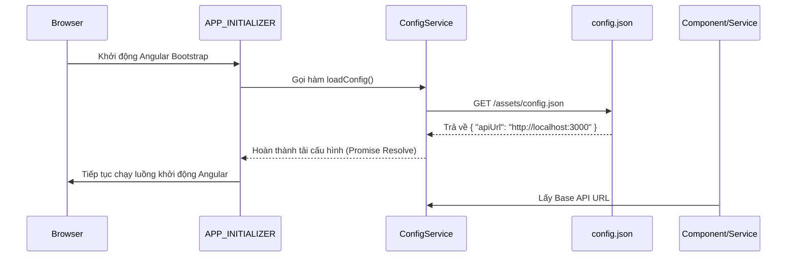

# Tài liệu hướng dẫn tái cấu trúc: REF-1.3 - Quản lý Endpoint tập trung & Tải cấu hình động trước khởi động
## Phân hệ: Web Client (`open-erp-web`) - Sprint 1

---

### 1. Mục tiêu (Goal)
Nhằm loại bỏ việc viết cứng (hardcode) địa chỉ API ở cấp độ component, hỗ trợ khả năng thay đổi cấu hình môi trường linh hoạt (Development, Staging, Production) mà không cần build lại mã nguồn:
1. **Định cấu hình động**: Đọc địa chỉ Base API URL từ tệp tin cấu hình [config.json](../../../open-erp-web/public/assets/config.json).
2. **Khởi tạo trước ứng dụng**: Đảm bảo tệp tin cấu hình được tải thành công thông qua giao thức HTTP trước khi Angular bắt đầu khởi chạy hoàn toàn các dịch vụ khác (`APP_INITIALIZER`).
3. **Quản lý Endpoint tập trung**: Tạo danh mục hằng số hoặc đối tượng quản lý tập trung toàn bộ các đường dẫn API con (Endpoints).

---

### 2. Thiết kế giải pháp (Technical Solution Design)



---

### 3. Chi tiết triển khai (Implementation Details)

#### 3.1 Tệp tin cấu hình môi trường [config.json](../../../open-erp-web/public/assets/config.json):
Tệp tin được đặt tại thư mục public assets:
```json
{
  "apiUrl": "http://localhost:3000"
}
```

#### 3.2 Dịch vụ quản lý cấu hình `ConfigService`:
Tải cấu hình trước khi ứng dụng khởi động và lưu trữ trong bộ nhớ:
```typescript
import { Injectable, inject } from '@angular/core';
import { HttpClient } from '@angular/common/http';
import { firstValueFrom } from 'rxjs';

@Injectable({
  providedIn: 'root',
})
export class ConfigService {
  private http = inject(HttpClient);
  private config: any = null;

  loadConfig(): Promise<void> {
    return firstValueFrom(
      this.http.get('/assets/config.json')
    ).then((data) => {
      this.config = data;
    }).catch((err) => {
      console.error('Không thể tải file config.json, sử dụng fallback', err);
      this.config = { apiUrl: 'http://localhost:3000' };
    });
  }

  get apiUrl(): string {
    return this.config?.apiUrl || 'http://localhost:3000';
  }
}
```

#### 3.3 Cấu hình `APP_INITIALIZER` trong [app.config.ts](../../../open-erp-web/src/app/app.config.ts):
```typescript
import { APP_INITIALIZER } from '@angular/core';
import { ConfigService } from './core/services/config.service';

export function initializeApp(configService: ConfigService) {
  return () => configService.loadConfig();
}

export const appConfig: ApplicationConfig = {
  providers: [
    // ... các providers khác
    {
      provide: APP_INITIALIZER,
      useFactory: initializeApp,
      deps: [ConfigService],
      multi: true,
    }
  ]
};
```

#### 3.4 Quản lý Endpoint tập trung tại tệp tin hằng số `api-endpoints.ts`:
```typescript
export const API_ENDPOINTS = {
  auth: {
    register: '/api/v1/auth/register',
    checkSubdomain: (subdomain: string) => `/api/v1/auth/check-subdomain?subdomain=${subdomain}`,
  }
};
```

#### 3.5 Cách sử dụng trong các Service nghiệp vụ:
```typescript
import { inject } from '@angular/core';
import { ConfigService } from './config.service';
import { API_ENDPOINTS } from './api-endpoints';

const config = inject(ConfigService);
const url = `${config.apiUrl}${API_ENDPOINTS.auth.register}`;
```

---

### 4. Tiêu chí nghiệm thu (Acceptance Criteria)

1. **Không viết cứng**: Không còn bất kỳ chuỗi ký tự chứa `http://localhost:3000` hoặc địa chỉ cứng nào nằm trong mã nguồn `.ts` của component hay service khác.
2. **Khởi tạo đúng thứ tự**: Hệ thống mạng của trình duyệt hiển thị yêu cầu `GET /assets/config.json` chạy đầu tiên trước khi gọi các API nghiệp vụ khác.
3. **Môi trường hóa**: Khi thay đổi giá trị `"apiUrl"` trong `config.json` ở thư mục dist sau khi build, ứng dụng tự động kết nối đến Server API mới mà không cần phải compile lại source code Angular.
