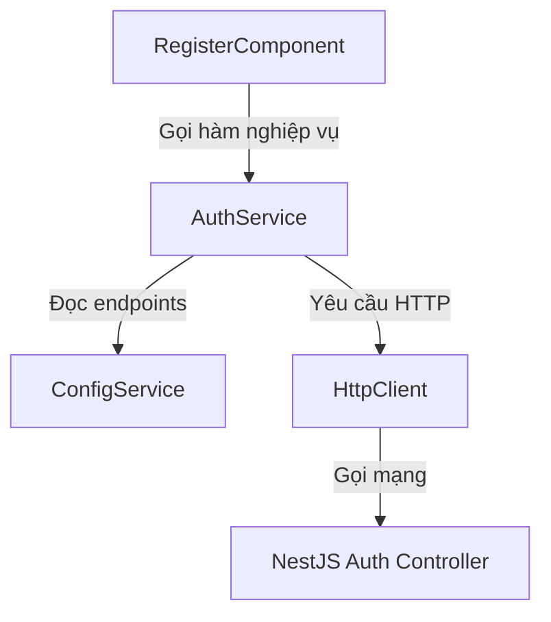

# Tài liệu hướng dẫn tái cấu trúc: REF-1.4 - Phân lớp nghiệp vụ với Angular Service
## Phân hệ: Web Client (`open-erp-web`) - Sprint 1

---

### 1. Mục tiêu (Goal)
Áp dụng mô hình kiến trúc phân lớp (Layered Architecture) nhằm tách biệt hoàn toàn phần xử lý giao diện (UI) và phần giao tiếp dữ liệu (API/Data Access):
1. **Đóng gói Logic API**: Đưa toàn bộ các lời gọi `HttpClient` (`get`, `post`) và logic xử lý kết quả/lỗi từ component vào các **Service** chuyên biệt.
2. **Component mỏng (Thin Components)**: Giữ cho component chỉ tập trung vào nhiệm vụ hiển thị trạng thái giao diện, tương tác người dùng, hiển thị thông báo lỗi và quản lý Reactive Forms.
3. **Tái sử dụng (Reusability)**: Đảm bảo các logic nghiệp vụ nền tảng (ví dụ: đăng ký, kiểm tra tên miền phụ) có thể dễ dàng tái sử dụng ở các component hoặc module khác.

---

### 2. Thiết kế tầng Dịch vụ (Service Layer Design)



---

### 3. Chi tiết triển khai mẫu (Implementation Sample)

#### 3.1 Khai báo Interface Dữ liệu (Models):
Định nghĩa cấu trúc dữ liệu gửi và nhận tại `src/app/core/models/auth.model.ts`:
```typescript
export interface RegisterPayload {
  companyName: string;
  email: string;
  password?: string;
  subdomain: string;
  phone?: string;
}

export interface RegisterResponse {
  success: boolean;
  messageKey?: string;
  error?: {
    messageKey?: string;
  };
}
```

#### 3.2 Xây dựng `AuthService` (`src/app/core/services/auth.service.ts`):
```typescript
import { Injectable, inject } from '@angular/core';
import { HttpClient } from '@angular/common/http';
import { Observable } from 'rxjs';
import { map } from 'rxjs/operators';
import { ConfigService } from './config.service';
import { API_ENDPOINTS } from './api-endpoints';
import { RegisterPayload, RegisterResponse } from '../models/auth.model';

@Injectable({
  providedIn: 'root',
})
export class AuthService {
  private http = inject(HttpClient);
  private config = inject(ConfigService);

  checkSubdomain(subdomain: string): Observable<boolean> {
    const url = `${this.config.apiUrl}${API_ENDPOINTS.auth.checkSubdomain(subdomain)}`;
    return this.http.get<{ success: boolean; data: { available: boolean } }>(url).pipe(
      map(res => res.success && res.data.available)
    );
  }

  register(payload: RegisterPayload): Observable<RegisterResponse> {
    const url = `${this.config.apiUrl}${API_ENDPOINTS.auth.register}`;
    return this.http.post<RegisterResponse>(url, payload);
  }
}
```

#### 3.3 Cách sử dụng trong [RegisterComponent](../../../open-erp-web/src/app/features/auth/register/register.component.ts):
Component sẽ inject `AuthService` thay vì `HttpClient`:
```typescript
import { Component, inject } from '@angular/core';
import { AuthService } from '../../../core/services/auth.service';

export class RegisterComponent {
  private authService = inject(AuthService); // Inject service nghiệp vụ
  
  // Logic gọi API kiểm tra subdomain khả dụng:
  checkSubdomainAvailability(value: string) {
    return this.authService.checkSubdomain(value);
  }

  // Logic submit đăng ký doanh nghiệp:
  onSubmit() {
    this.isLoading.set(true);
    this.authService.register(this.registerForm.value).subscribe({
      next: (res) => {
        this.isLoading.set(false);
        if (res.success) {
          this.successMessage.set(this.translocoService.translate(res.messageKey || 'auth.register_success'));
        }
      },
      error: (err) => {
        this.isLoading.set(false);
        const errPayload = err.error || {};
        const msgKey = errPayload.error?.messageKey || 'validation.error_occurred';
        this.errorMessage.set(this.translocoService.translate(msgKey));
      }
    });
  }
}
```

---

### 4. Tiêu chí nghiệm thu (Acceptance Criteria)

1. **Cô lập HttpClient**: Tệp tin `register.component.ts` tuyệt đối không còn dòng lệnh `import { HttpClient }` hay inject `private http = inject(HttpClient)`.
2. **Khai báo kiểu đầy đủ**: Toàn bộ dữ liệu gửi và nhận qua API phải được khai báo bằng `Interface` tường minh (không sử dụng kiểu `any` hoặc khai báo ẩn danh).
3. **Hoạt động chính xác**: Mọi tính năng bao gồm kiểm tra subdomain khả dụng khi gõ và đăng ký doanh nghiệp vẫn chạy chính xác như trước khi tách.
