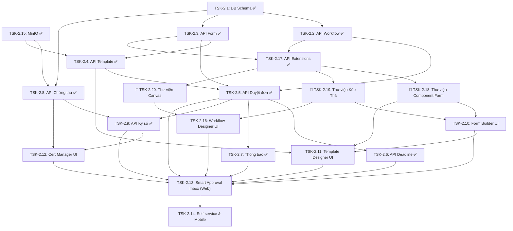

# Chỉ mục công việc Sprint 2 (Sprint 2 Task Index)

## Dự án: Nền tảng SaaS quản trị doanh nghiệp hợp nhất - Enterprise SaaS Platform
## Sprint 2: Quy trình phê duyệt rẽ nhánh nâng cao, Form động, OnlyOffice, Ký số nội bộ & Bảo mật nhật ký (Tamper-proof logs)

---

### 1. Thông tin chung Sprint 2

- **Mục tiêu Sprint:** 
  1. Xây dựng lõi quy trình phê duyệt (Workflow Engine) linh hoạt hỗ trợ cấu hình động, rẽ nhánh phức tạp với các điều kiện đồng thuận đa dạng (ALL, ANY, Threshold %).
  2. Thiết lập cơ chế bảo mật chống giả mạo nhật ký xử lý (`workflow_logs`) sử dụng mô hình hash-chain liên kết.
  3. Xây dựng phân hệ Form động (Dynamic Form Builder) và Biểu mẫu động tích hợp OnlyOffice Adapter nhằm tự sinh và kết xuất văn bản (PDF, DOCX).
  4. Triển khai hạ tầng ký số nội bộ (Internal CA), cấp phát chứng thư số X.509 cho cá nhân/phòng ban để chứng thực chữ ký số trực tiếp trên đơn từ mà không phụ thuộc bên thứ ba.
  5. Xây dựng giao diện Web/Mobile hoàn chỉnh hỗ trợ các luồng tự phục vụ (Self-service), hộp thư duyệt thông minh (Smart Approval Inbox), đảm bảo trải nghiệm đồng nhất với theme màu chủ đạo **Rose Gold (`#B76E79`)** và đa ngôn ngữ.
- **Thời gian thực hiện:** 2 tuần (Giả định).
- **Môi trường chạy thử:** Dev Local (Postgres, Redis, NestJS, Angular, Ionic) và tự động deploy UAT qua pipeline CI/CD.

---

### 2. Chỉ mục trạng thái công việc (Task Index Dashboard)

Dưới đây là danh sách 20 Task cần triển khai trong Sprint 2:

| ID | Tên công việc (Task Name) | Mô tả tóm tắt | Trạng thái (Status) | Nhân sự chính | Tài liệu chi tiết |
| :--- | :--- | :--- | :--- | :--- | :--- |
| **TSK-2.1** | Thiết kế sơ đồ dữ liệu Workflow Engine & Chống chỉnh sửa | Thiết kế DB Schema chi tiết và cấu trúc lưu vết chống chỉnh sửa thông qua cơ chế hash-chaining (SHA-256). | [x] Done | BE Leads / DB Architect | [task_01_tamper_proof_schema.md](./tasks/task_01_tamper_proof_schema.md) |
| **TSK-2.2** | API Cấu hình quy trình rẽ nhánh | APIs thiết lập sơ đồ quy trình động, cho phép cấu hình điều kiện rẽ nhánh, luồng song song (Fork/Join) và các quy tắc đồng thuận. | [x] Done | BE Engineers | [task_02_branching_workflow_api.md](./tasks/task_02_branching_workflow_api.md) |
| **TSK-2.3** | API Thiết kế & Quản lý Form động | APIs quản lý vòng đời form động: định nghĩa cấu trúc trường, kiểu dữ liệu, các ràng buộc validate đầu vào và cơ chế versioning. | [x] Done | BE Engineers | [task_03_dynamic_form_api.md](./tasks/task_03_dynamic_form_api.md) |
| **TSK-2.4** | API Mẫu văn bản động & OnlyOffice Adapter | APIs lưu mẫu tài liệu, cấu hình OnlyOffice, ánh xạ dữ liệu động từ form vào file (PDF, DOCX, XLSX, PPTX) và biên tập trực tuyến. | [x] Done | BE Engineers | [task_04_onlyoffice_templates_api.md](./tasks/task_04_onlyoffice_templates_api.md) |
| **TSK-2.5** | API Duyệt đơn nâng cao theo module | APIs thực hiện hành động tại mỗi bước duyệt (Approve, Reject, Consult - xin ý kiến, Spawn Subprocess, Gen Document, Join Sync). | [x] Done | BE Engineers | [task_05_advanced_actions_api.md](./tasks/task_05_advanced_actions_api.md) |
| **TSK-2.6** | API Thiết lập Deadline & Đốc thúc tự động | Cơ chế cài đặt deadline cho bước duyệt, tự động gửi cảnh báo và quét BullMQ Scheduler chạy tác vụ nhắc nhở. | [x] Done | BE Engineers | [task_06_deadlines_reminders_api.md](./tasks/task_06_deadlines_reminders_api.md) |
| **TSK-2.7** | Hệ thống thông báo đa kênh thời gian thực | Xây dựng Gateway WebSocket (Socket.io) gửi tin in-app tức thời kết hợp gửi mail cảnh báo qua Nodemailer/AWS SES. | [x] Done | BE Engineers | [task_07_multi_channel_notifications.md](./tasks/task_07_multi_channel_notifications.md) |
| **TSK-2.8** | API Sinh và quản lý Chứng thư số nội bộ | Cài đặt hạ tầng khóa công khai nội bộ (Internal CA): sinh root cert, phát hành X.509 cert cho người dùng/phòng ban. | [x] Done | SecOps / BE Engineers | [task_08_internal_ca_api.md](./tasks/task_08_internal_ca_api.md) |
| **TSK-2.9** | API Ký số & Chứng thực chữ ký số | APIs thực hiện ký số payload đơn từ bằng khóa riêng tư và giải mã xác thực chữ ký bằng khóa công khai trên hệ thống. | [x] Done | SecOps / BE Engineers | [task_09_digital_signature_verification_api.md](./tasks/task_09_digital_signature_verification_api.md) |
| **TSK-2.15** | Tích hợp MinIO Object Storage | Cấu hình hạ tầng MinIO, S3 SDK phục vụ việc lưu trữ tệp tin độc lập của hệ thống và chia sẻ qua Pre-signed URLs. | [x] Done | BE Leads / DevOps | [task_15_minio_object_storage.md](./tasks/task_15_minio_object_storage.md) |
| **TSK-2.17** | Cập nhật API Form động & Workflow Engine | Cập nhật API để hỗ trợ cấu trúc dữ liệu grid/table, bố cục layout và các cấu hình gán việc nâng cao cho Node trong workflow. | [x] Done | BE Engineers | [task_17_api_extensions.md](./tasks/task_17_api_extensions.md) |
| **TSK-2.18** | Thư viện Component Form dùng chung | Xây dựng thư viện `@open-erp/shared-ui/form` gồm đầy đủ các primitive, composite, layout components và Form Engine Renderer schema-driven cho toàn hệ thống. | [x] Done | FE Web Engineers | [task_18_form_component_library.md](./tasks/task_18_form_component_library.md) |
| **TSK-2.19** | Thư viện Kéo Thả dùng chung | Xây dựng thư viện `@open-erp/shared-ui/dnd` cung cấp directives và components kéo thả chuẩn hóa (multi-list, nested, touch, keyboard) cho Form Builder, Workflow Designer và mọi màn hình reorder. | [x] Done | FE Web Engineers | [task_19_drag_drop_library.md](./tasks/task_19_drag_drop_library.md) |
| **TSK-2.20** | Thư viện Canvas vẽ đồ họa dùng chung | Xây dựng thư viện `@open-erp/shared-ui/canvas` để vẽ nodes, edges, hiển thị dữ liệu trên SVG canvas, hỗ trợ pan/zoom, auto-layout và undo/redo cho Workflow Designer. | [ ] Todo | FE Web Engineers | [task_20_canvas_library.md](./tasks/task_20_canvas_library.md) |
| **TSK-2.10** | Giao diện thiết lập Form động nâng cao | Giao diện Web kéo thả và dùng nút điều hướng thiết kế form động, thiết lập layout đa thiết bị, điều kiện logic và liên kết API. Sử dụng TSK-2.18 & TSK-2.19. | [ ] Todo | FE Web Engineers | [task_10_dynamic_form_builder_ui.md](./tasks/task_10_dynamic_form_builder_ui.md) |
| **TSK-2.16** | Giao diện thiết kế Workflow nâng cao | Giao diện Web Canvas thiết kế sơ đồ quy trình rẽ nhánh, cấu hình node, hành động/kết quả và hỗ trợ tự động sắp xếp node. Sử dụng TSK-2.19 & TSK-2.20. | [ ] Todo | FE Web Engineers | [task_16_workflow_designer_ui.md](./tasks/task_16_workflow_designer_ui.md) |
| **TSK-2.11** | Giao diện Thiết kế Biểu mẫu & OnlyOffice | Giao diện Web cấu hình vị trí map trường dữ liệu vào file template, tích hợp frame OnlyOffice để hiệu chỉnh văn bản. Sử dụng TSK-2.18. | [ ] Todo | FE Web Engineers | [task_11_template_designer_ui.md](./tasks/task_11_template_designer_ui.md) |
| **TSK-2.12** | Giao diện Quản lý Chứng thư & Ký số | Giao diện Web quản lý cặp khóa cá nhân, thực hiện thao tác ký số tài liệu và hiển thị trạng thái chứng thực trực quan. | [ ] Todo | FE Web Engineers | [task_12_cert_manager_ui.md](./tasks/task_12_cert_manager_ui.md) |
| **TSK-2.13** | Hộp thư phê duyệt thông minh (Web) | Giao diện Web tích hợp hiển thị form động, chứng từ OnlyOffice, timeline lịch sử, nút xin ý kiến, ký duyệt và cảnh báo deadline. | [ ] Todo | FE Web Engineers | [task_13_smart_approval_inbox_ui.md](./tasks/task_13_smart_approval_inbox_ui.md) |
| **TSK-2.14** | Giao diện Tự phục vụ & Phê duyệt di động | Cổng tự phục vụ gửi đơn, phê duyệt nhanh một chạm và cơ chế xác thực ký số nội bộ trên ứng dụng di động (Ionic). | [ ] Todo | FE Mobile Engineers | [task_14_mobile_self_service_ui.md](./tasks/task_14_mobile_self_service_ui.md) |

---

### 3. Trật tự thực thi & Luồng phụ thuộc công việc (Execution Flow & Dependencies)

Để đảm bảo tiến độ không bị nghẽn, các công việc được sắp xếp theo mối quan hệ phụ thuộc như sau:

#### Thứ tự thực hiện đề xuất (FE Team)

| Giai đoạn | Task | Lý do ưu tiên |
| :--- | :--- | :--- |
| **Giai đoạn 1** *(Song song, 3 engineer)* | **TSK-2.18** · **TSK-2.19** · **TSK-2.20** | Ba thư viện nền tảng phải hoàn thành **trước tiên** — mọi UI task FE đều phụ thuộc vào ít nhất một trong ba. Phân công mỗi engineer phụ trách một thư viện riêng. |
| **Giai đoạn 2** *(Song song)* | **TSK-2.10** · **TSK-2.16** | Form Builder (dùng TSK-2.18 + TSK-2.19) và Workflow Designer (dùng TSK-2.19 + TSK-2.20) có thể chạy song song ngay sau giai đoạn 1. |
| **Giai đoạn 3** *(Song song)* | **TSK-2.11** · **TSK-2.12** | Template Designer (cần TSK-2.10 + TSK-2.18) và Cert Manager (backend đã sẵn: TSK-2.8, TSK-2.9). |
| **Giai đoạn 4** | **TSK-2.13** | Smart Approval Inbox tích hợp tất cả kết quả: form renderer, OnlyOffice, ký số, timeline. |
| **Giai đoạn 5** | **TSK-2.14** | Mobile: port luồng từ Web sang Ionic sau khi Web hoàn chỉnh và ổn định. |

---

### 4. Quy chuẩn Sprint 2

- **Thiết kế Cơ sở dữ liệu & Cô lập Tenant (SaaS Isolation):** 
  - Mọi bảng dữ liệu mới (`workflows`, `workflow_steps`, `dynamic_forms`, `document_templates`, `workflow_instances`, `workflow_logs`, `certificates`) phải chứa cột `tenant_id` kiểu `uuid` và áp dụng Row-Level Security (RLS) để cô lập dữ liệu tương tự Sprint 1.
  - Phải có cơ chế hash-chaining để đảm bảo tính toàn vẹn dữ liệu cho bảng nhật ký phê duyệt (`workflow_logs`), ngăn chặn việc sửa đổi hoặc xóa vết bằng các tác động trực tiếp từ database.
- **Thư viện UI dùng chung (`open-erp-shared-ui`):** 
  - Sử dụng triệt để các component UI dùng chung từ thư viện `@open-erp/shared-ui` nhằm đảm bảo giao diện đồng bộ 100% về màu Rose Gold (`#B76E79`) và tương thích hoàn toàn chế độ Light/Dark Mode.
  - **Ba thư viện nền tảng TSK-2.18, TSK-2.19, TSK-2.20 phải được hoàn thành và publish vào `@open-erp/shared-ui` trước khi bất kỳ UI task nào (TSK-2.10, TSK-2.16, TSK-2.11...) bắt đầu triển khai.**
- **Chứng thư số nội bộ (Internal CA):** 
  - Sinh chứng thư sử dụng thuật toán mã hóa hiện đại (RSA 2048-bit hoặc ECDSA) và lưu trữ khóa an toàn. Việc ký số và xác thực được thực hiện trực tiếp trong phần mềm dựa trên chứng thư gốc tự tin cậy của OpenERP.
- **Xử lý nền & Đốc thúc:** 
  - Sử dụng hàng đợi BullMQ với Redis để điều phối các tác vụ gửi email, kiểm tra deadline bất đồng bộ nhằm tối ưu hóa hiệu năng phản hồi của APIs.
- **Đa ngôn ngữ (Transloco):** 
  - Mọi văn bản hiển thị trên giao diện, nhãn trường động, thông báo lỗi validate, nội dung email template phải được cấu hình qua Transloco với các file ngôn ngữ `vi.json`, `en.json`, `zh.json`, `ja.json`.

---

### 5. Kiến trúc Microservice: Tách biệt Phân hệ Thông báo (Notification Microservice)

Nhằm tối ưu hóa hiệu năng của Main App khi hệ thống trong thời điểm cao tải, phân hệ thông báo (in-app notifications, push notifications thời gian thực qua WebSocket, SMTP Mail service và BullMQ workers) đã được tách thành một microservice độc lập:

1. **Giao tiếp bất đồng bộ qua Redis:** 
   - Main App (`main.ts`, cổng 3000) không trực tiếp xử lý ghi nhận thông báo, gửi email hay lên lịch nhắc nhở deadline qua BullMQ nữa.
   - Thay vào đó, Main App sử dụng `ClientProxy` gửi các sự kiện `send_notification` và `schedule_deadline_reminder` sang Redis Transporter. Việc này giúp giảm thời gian phản hồi của APIs xử lý workflow phê duyệt xuống mức tối đa.
2. **Notification Microservice (cổng 3001):**
   - Chạy entrypoint riêng `main-notification.ts` với cấu hình Hybrid App (HTTP REST + Socket.io Gateway trên cổng 3001 + Redis event listener).
   - Tiếp nhận các sự kiện từ Redis để thực hiện:
     - Ghi nhận thông báo in-app vào DB.
     - Đẩy tin thời gian thực qua WebSocket (Socket.io) namespace `/ws`.
     - Đẩy các tác vụ gửi email phê duyệt vào BullMQ queue `email-queue` và xử lý bất đồng bộ.
     - Chạy worker `WorkflowDeadlineConsumer` để lên lịch gửi cảnh báo đốc thúc quá hạn và tự động quét các tác vụ trễ hạn.
   - Cung cấp các APIs nghiệp vụ của thông báo như: `GET /notifications` và `PATCH /notifications/:id/read`.
