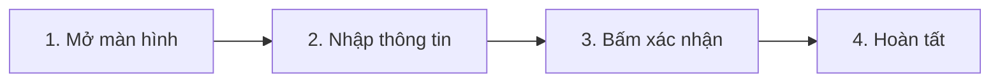

# Hướng Dẫn Sử Dụng: [Tên Tính Năng / Module]

- **Tính năng / Plugin**: [Tên tính năng]
- **Nền tảng áp dụng**: [x] Web Desktop / [ ] Mobile App (Ionic 8)
- **Đối tượng sử dụng**: [Tenant Admin / Nhân viên bán hàng / Thủ kho / ...]
- **Phiên bản tài liệu**: `v1.0.0`
- **Người soạn thảo**: BA Agent / QA Agent

---

## 1. Tổng Quan Tính Năng
> Giới thiệu ngắn gọn mục đích sử dụng và lợi ích của tính năng đối với người dùng.

Tính năng này giúp bạn:
- Thực hiện công việc A...
- Theo dõi thông tin B...

---

## 2. Hướng Dẫn Thao Tác Chi Tiết (Từng Bước Kèm Hình Ảnh)

### Bước 1: Truy Cập Vào Chức Năng
1. Đăng nhập vào hệ thống tại `https://<tenant-slug>.openerp.vn`.
2. Trên thanh điều hướng chính bên trái, bấm chọn **[Tên Menu]**.

*(Hình 1: Bấm vào biểu tượng menu trên thanh điều hướng)*

---

### Bước 2: Nhập Liệu Và Cấu Hình
1. Nhấp vào nút **"Tạo mới"** (màu xanh ở góc phải trên).
2. Điền đầy đủ các trường thông tin bắt buộc (có dấu `*` đỏ):
   - **Tên**: Nhập tên bản ghi.
   - **Mã**: Nhập mã hoặc để hệ thống tự sinh tự động.

*(Hình 2: Điền thông tin vào các trường bắt buộc và nhấn Lưu)*

---

### Bước 3: Xác Nhận & Xem Kết Quả
1. Bấm nút **"Lưu & Xác nhận"**.
2. Hệ thống sẽ hiển thị thông báo màu xanh *"Tạo mới thành công"* ở góc phải màn hình.

*(Hình 3: Thông báo thành công và bản ghi xuất hiện trong danh sách)*

---

## 3. Các Câu Hỏi Thường Gặp (FAQ & Troubleshooting)

| Vấn Đề Gặp Phải | Nguyên Nhân | Cách Khắc Phục |
| :--- | :--- | :--- |
| Nút "Tạo mới" bị mờ, không bấm được | Bạn chưa được cấp quyền quản trị | Liên hệ Tenant Admin để xin cấp quyền `<module>:create` |
| Báo lỗi "Mã đã tồn tại" | Mã nghiệp vụ bị trùng lặp | Nhập mã khác hoặc chọn tự sinh mã |
