# Hướng Dẫn Sử Dụng: Core IAM - Định Danh, Đăng Nhập & Quản Lý Tài Khoản (Sprint 01)

- **Mã Tài Liệu**: UG-01
- **Phiên Bản**: 1.0 (2026-09-18)
- **Phạm Vi**: 6 chức năng Core IAM của Sprint 01 - Đăng ký cá nhân/doanh nghiệp, Đăng nhập & chọn Workspace, Quên mật khẩu, Xác thực 2 yếu tố (2FA), Quản lý tài khoản.
- **Nền Tảng**: Web Desktop (Angular 22 + Tailwind 4) và Mobile (Ionic 8 + Angular).
- **Hình Ảnh Minh Họa**: [`assets/sprint_01_core_iam/`](assets/sprint_01_core_iam/)

> **Đối tượng đọc**: Khách hàng/Quản trị viên doanh nghiệp (Tenant Admin) và người dùng cuối.

---

## Mục Lục
1. [Bắt đầu & Đăng nhập môi trường Local](#1-bắt-đầu--đăng-nhập-môi-trường-local)
2. [Đăng ký tài khoản cá nhân](#2-đăng-ký-tài-khoản-cá-nhân)
3. [Đăng nhập & Chọn Workspace](#3-đăng-nhập--chọn-workspace)
4. [Màn hình Dashboard](#4-màn-hình-dashboard)
5. [Quản lý tài khoản](#5-quản-lý-tài-khoản)
6. [Xác thực 2 yếu tố (2FA)](#6-xác-thực-2-yếu-tố-2fa)
7. [Quên mật khẩu & Đặt lại mật khẩu](#7-quên-mật-khẩu--đặt-lại-mật-khẩu)
8. [Đăng ký tài khoản doanh nghiệp](#8-đăng-ký-tài-khoản-doanh-nghiệp)
9. [Giao diện & Chọn Theme (Sáng/Tối/Hệ thống)](#9-giao-diện--chọn-theme-sángtốihệ-thống)
10. [Sử dụng Trên Điện Thoại](#10-sử-dụng-trên-điện-thoại)
11. [Bản đồ URL & Điều hướng](#11-bản-đồ-url--điều-hướng)
12. [Câu hỏi thường gặp & Xử lý sự cố](#12-câu-hỏi-thường-gặp--xử-lý-sự-cố)
13. [Giới hạn đã biết](#13-giới-hạn-đã-biết)

---

## 1. Bắt đầu & Đăng nhập môi trường Local

| Thành Phần | Địa Chỉ |
| :--- | :--- |
| Ứng dụng Web | http://localhost:4200 |
| Ứng dụng Mobile | http://localhost:8100 |
| API Backend | http://localhost:8088 (Swagger: `/q/swagger-ui`) |
| Hộp thư thử nghiệm (Mailpit) | http://localhost:8025 |

- Hệ thống hỗ trợ **2 ngôn ngữ**: Tiếng Việt (VI) / Tiếng Anh (EN) - bộ chuyển ngôn ngữ ở góc phải trên.
- Trên môi trường local, **mọi email** (mã OTP, link đặt lại mật khẩu) được gửi vào **Mailpit** thay vì hộp thư thật. Hãy mở song song tab Mailpit khi test.

> **Tài khoản dùng thử** (do đội QA tạo sẵn trên môi trường local):
> - Email: `qa.guide.1789716997060@example.com`
> - Mật khẩu: `QaGuide@123`
> - Tài khoản này đã bật 2FA và thuộc 2 workspace (Không gian cá nhân + "Công ty Demo").

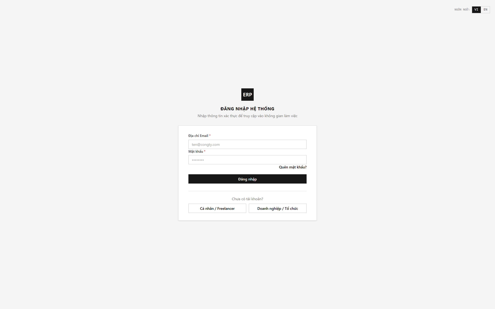
*[Ảnh 01] Trang đăng nhập: nhập Email + Mật khẩu, có liên kết "Quên mật khẩu?" và nút đăng ký cá nhân/doanh nghiệp.*

---

## 2. Đăng ký tài khoản cá nhân

**Dành cho**: cá nhân/freelancer muốn sử dụng Open-ERP.

1. Tại trang đăng nhập, bấm **"Cá nhân / Freelancer"**.
2. Điền Họ tên, Email, Mật khẩu (tối thiểu 8 ký tự, gồm chữ hoa, chữ thường, số, ký tự đặc biệt) và Số điện thoại (tùy chọn).

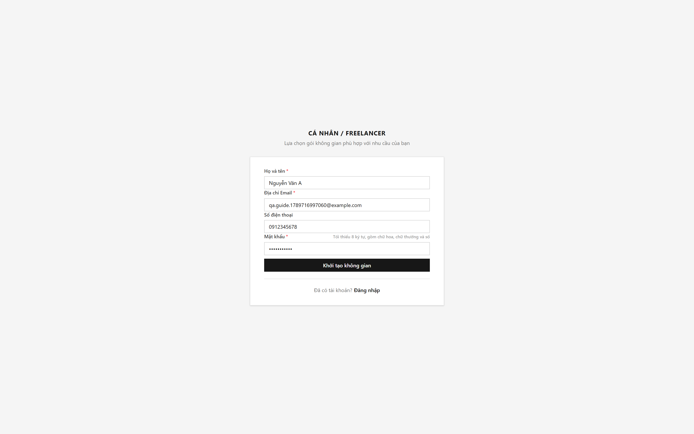
*[Ảnh 02] Form đăng ký cá nhân với thiết kế vuông vắn, mật độ thông tin cao.*

3. Bấm **"Khởi tạo không gian"** → hệ thống gửi **mã OTP 6 số** về email.
4. Mở **Mailpit** (http://localhost:8025), mở email "[Open-ERP] Mã xác thực kích hoạt tài khoản" để lấy mã.

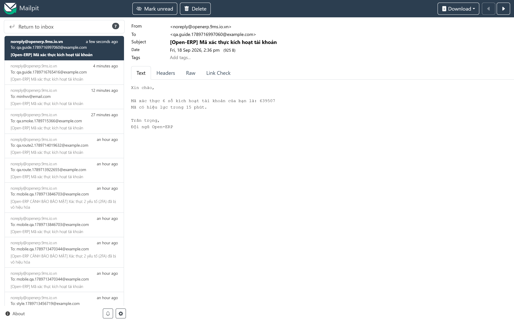
*[Ảnh 04] Email OTP trong hộp thư Mailpit.*

5. Nhập mã OTP vào màn hình xác thực. Nếu chưa nhận được, bấm **"Gửi lại mã"** (chờ 60 giây giữa 2 lần gửi).

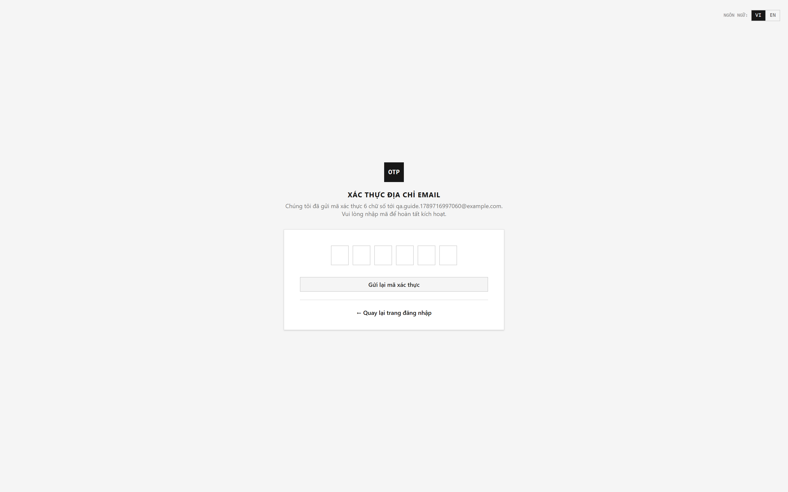
*[Ảnh 03] Màn hình nhập OTP 6 số (ô PIN vuông).*

6. Xác thực thành công → tài khoản **ACTIVE**, hệ thống tự cấp một **Không gian cá nhân (Personal Workspace)**.

---

## 3. Đăng nhập & Chọn Workspace

1. Nhập Email + Mật khẩu tại trang đăng nhập.
2. Nếu tài khoản **chưa bật 2FA** và **chỉ thuộc 1 workspace** → vào thẳng Dashboard.
3. Nếu tài khoản **thuộc nhiều workspace** → hiển thị màn hình chọn doanh nghiệp. Bấm chọn workspace mong muốn (có nhãn **MẶC ĐỊNH** cho không gian mặc định).

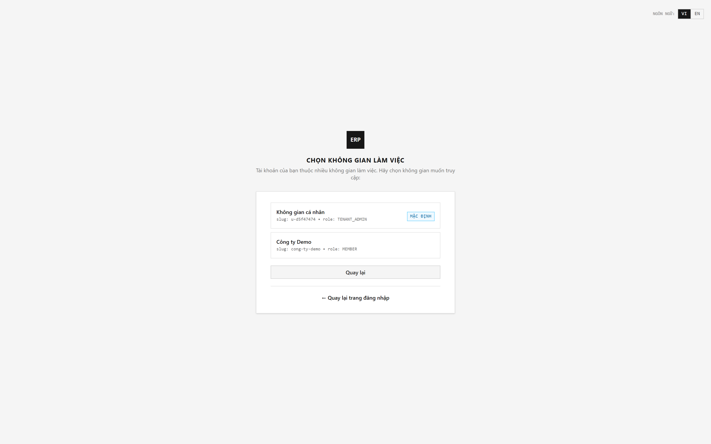
*[Ảnh 05] Workspace Picker: chọn không gian cá nhân hoặc doanh nghiệp để làm việc.*

4. Nếu tài khoản **đã bật 2FA** → hệ thống yêu cầu nhập mã 6 số từ ứng dụng Authenticator (xem [mục 6](#6-xác-thực-2-yếu-tố-2fa)).
5. Bấm **Đăng xuất** ở góc phải khi cần kết thúc phiên.

---

## 4. Màn hình Dashboard

Sau khi chọn workspace, bạn vào Dashboard - trung tâm điều hướng:

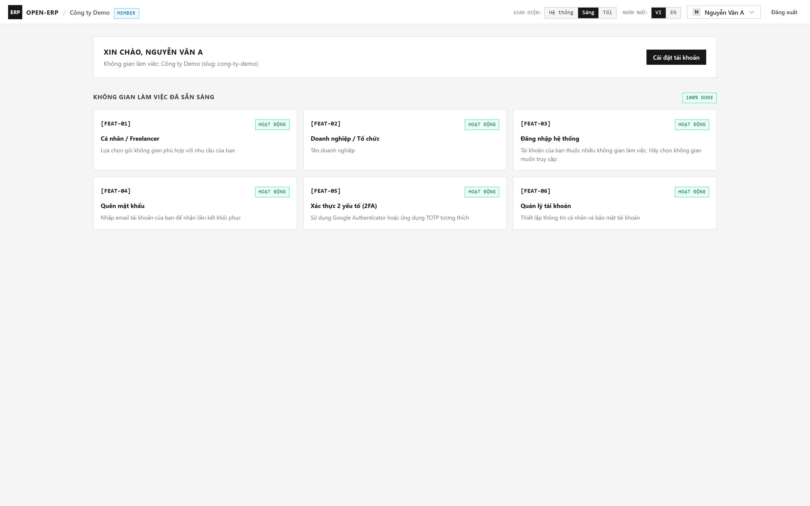
*[Ảnh 06] Dashboard hiển thị lời chào, workspace hiện tại và trạng thái 6 chức năng Core IAM.*

- **Thanh trên (TopBar)**: logo, workspace + vai trò (TENANT_ADMIN/MEMBER), bộ chuyển ngôn ngữ, nút **Quản lý tài khoản**, nút **Đăng xuất**.
- **Nút "Cài đặt tài khoản"** và nút trên TopBar đều mở **Drawer Quản lý tài khoản** (xem mục 5).

---

## 5. Quản lý tài khoản

Drawer Quản lý tài khoản trượt từ cạnh phải, gồm **3 tab**. Mỗi tab có URL riêng để bạn có thể **F5/reload hoặc lưu bookmark** mà vẫn giữ đúng trạng thái.

### 5.1. Tab Hồ sơ cá nhân (`/account/detail`)
- Xem Email (không sửa được), cập nhật **Họ tên**, **Số điện thoại**, **URL ảnh đại diện**, **Ngôn ngữ giao diện**, **Múi giờ**.
- Bấm **"Lưu thay đổi"** → tên hiển thị trên TopBar cập nhật ngay.

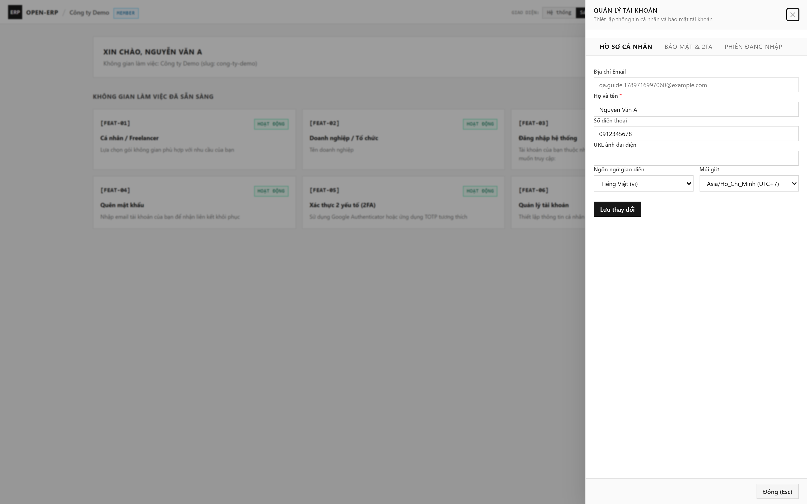
*[Ảnh 07] Tab Hồ sơ cá nhân.*

### 5.2. Tab Bảo mật & 2FA (`/account/security`)
- **Đổi mật khẩu**: nhập mật khẩu hiện tại + mật khẩu mới 2 lần; có tùy chọn **"Đăng xuất các thiết bị khác"**.
- **Bảo mật 2 lớp (2FA)**: xem trạng thái BẬT/TẮT, số mã dự phòng còn lại, nút **Bật 2FA** / **Tắt 2FA** / **Mã dự phòng**.

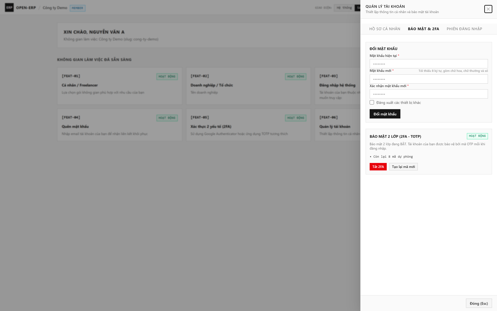
*[Ảnh 08] Tab Bảo mật & 2FA khi chưa kích hoạt.*

### 5.3. Tab Phiên đăng nhập (`/account/sessions`)
- Danh sách các thiết bị đang đăng nhập: thiết bị/trình duyệt, IP, thời điểm hoạt động gần nhất; phiên hiện tại có nhãn riêng.
- Nút **"Đăng xuất thiết bị này"** cho từng phiên và **"Đăng xuất tất cả thiết bị khác"**.

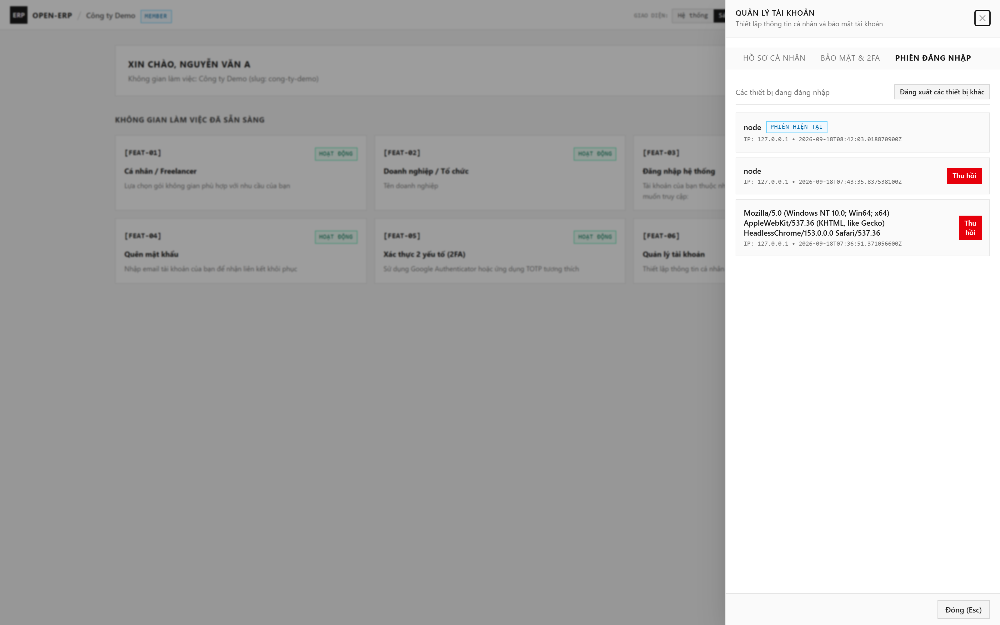
*[Ảnh 11] Quản lý phiên đăng nhập, thu hồi phiên từ xa.*

---

## 6. Xác thực 2 yếu tố (2FA)

### 6.1. Bật 2FA
1. Vào **Quản lý tài khoản → Bảo mật & 2FA** → bấm **"Kích hoạt 2FA"**.
2. Drawer con (Stacked Drawer) mở ra, hiển thị **mã QR** và **mã bí mật (Secret Key)**.

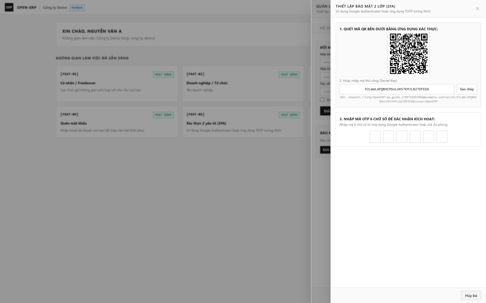
*[Ảnh 09] Drawer thiết lập 2FA với QR + Secret Key + ô nhập OTP.*

3. Mở ứng dụng **Google Authenticator / Microsoft Authenticator**:
   - Quét mã QR, hoặc
   - Bấm **"Sao chép"** cạnh Secret Key rồi dán vào ứng dụng Authenticator.
4. Nhập **mã 6 số** hiện tại từ ứng dụng vào 6 ô OTP và bấm xác nhận.
5. Hệ thống hiển thị **8 mã dự phòng (Backup Codes)** - hãy lưu lại an toàn (**mỗi mã chỉ dùng 1 lần**); có thể bấm **"Sao chép toàn bộ"** hoặc **"Tải file (.txt)"**.

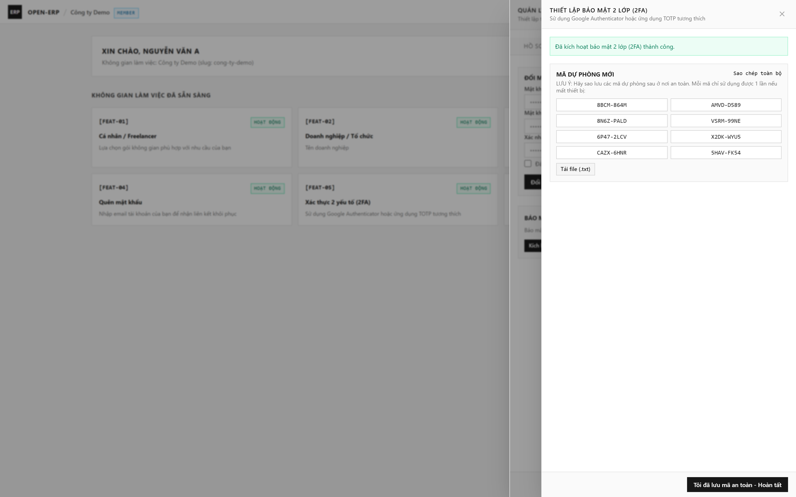
*[Ảnh 10] 8 mã dự phòng chỉ hiển thị một lần sau khi kích hoạt.*

### 6.2. Đăng nhập khi đã bật 2FA
- Sau khi nhập đúng mật khẩu, hệ thống yêu cầu **mã 6 số** từ Authenticator.
- Nếu không có điện thoại, chọn **"Dùng mã khôi phục"** và nhập 1 mã dự phòng.
- Nhập sai **3 lần liên tiếp** → phiên xác thực tạm bị hủy, bạn phải đăng nhập lại từ đầu.

### 6.3. Tắt 2FA
1. Vào **Bảo mật & 2FA** → bấm **"Tắt 2FA"**.
2. Nhập **mật khẩu hiện tại** + **mã OTP 6 số** (hoặc 1 mã dự phòng) để xác nhận chính chủ.
3. Sau khi tắt thành công, hệ thống gửi **email cảnh báo bảo mật** (kiểm tra Mailpit).

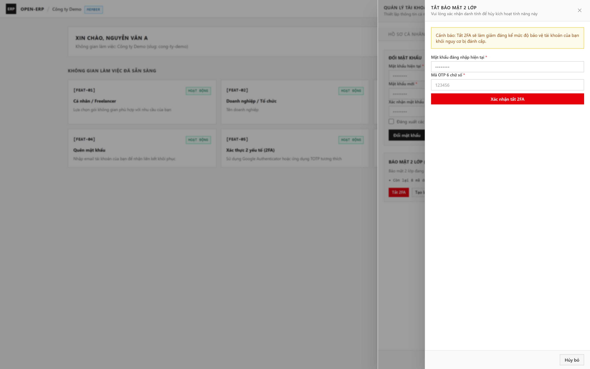
*[Ảnh 20] Drawer xác nhận tắt 2FA (bảo mật kép: mật khẩu + OTP).*

### 6.4. Tái tạo mã dự phòng
- Tại tab Bảo mật, bấm **"Mã dự phòng"** → nhập mật khẩu hiện tại → hệ thống cấp **8 mã mới** và vô hiệu hóa toàn bộ mã cũ.

---

## 7. Quên mật khẩu & Đặt lại mật khẩu

1. Tại trang đăng nhập, bấm **"Quên mật khẩu?"**.
2. Nhập Email đã đăng ký → bấm gửi yêu cầu. Vì lý do bảo mật, hệ thống luôn hiển thị thông báo chung (không tiết lộ email có tồn tại hay không).

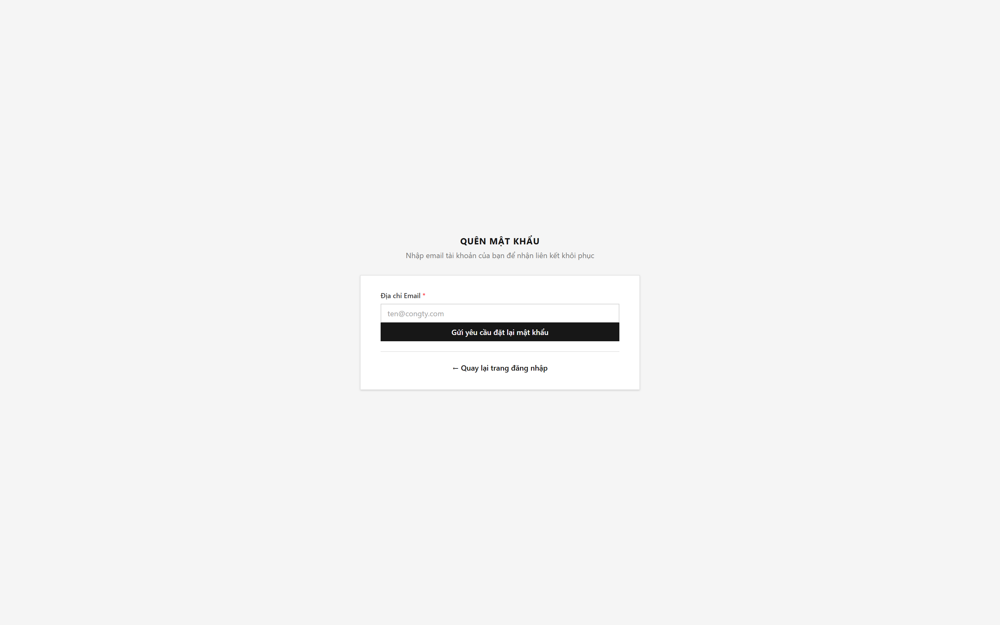
*[Ảnh 12] Trang yêu cầu khôi phục mật khẩu.*

3. Mở Mailpit → email "[Open-ERP] Yêu cầu đặt lại mật khẩu" chứa link đặt lại (hiệu lực 15 phút).
4. Bấm link → nhập **mật khẩu mới** 2 lần → hoàn tất. Toàn bộ phiên đăng nhập cũ bị thu hồi; hãy đăng nhập lại bằng mật khẩu mới.

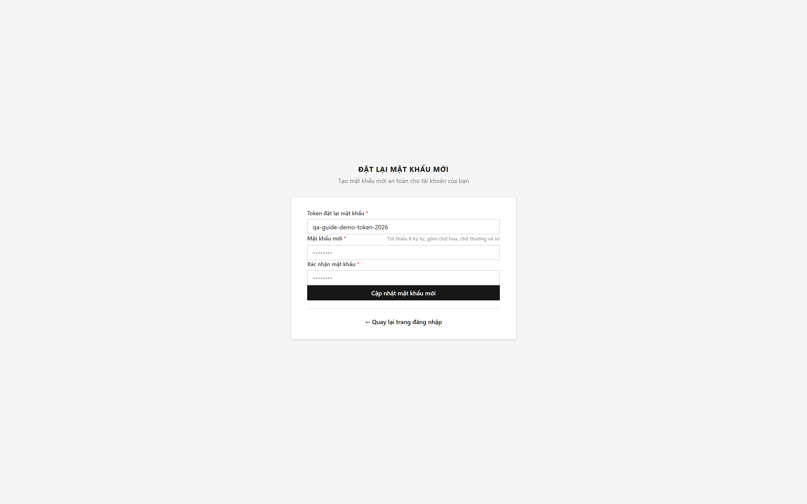
*[Ảnh 13] Trang đặt lại mật khẩu (token lấy từ email).*

---

## 8. Đăng ký tài khoản doanh nghiệp

Dành cho chủ doanh nghiệp muốn tạo Không gian Doanh nghiệp (Tenant) riêng:

1. Tại trang đăng nhập, bấm **"Doanh nghiệp / Tổ chức"**.
2. **Bước 1/2 - Thông tin quản trị viên**: nhập Họ tên, Email, Mật khẩu → bấm **"Tiếp tục"**.
3. **Bước 2/2 - Thông tin doanh nghiệp**: nhập Tên công ty, Subdomain (slug), Mã số thuế, Quy mô, Tiền tệ. Khi nhập Subdomain, hệ thống **tự kiểm tra trực tiếp** và hiển thị ngay:
   - 🟢 *"Đường dẫn còn trống, có thể sử dụng."* - có thể đăng ký.
   - 🔴 *"Đường dẫn định danh không gian làm việc (...) đã tồn tại."* - cần chọn slug khác.
   - Kèm dòng **"Xem trước: https://<slug>.openerp.9ms.io.vn"** để bạn kiểm tra trước.

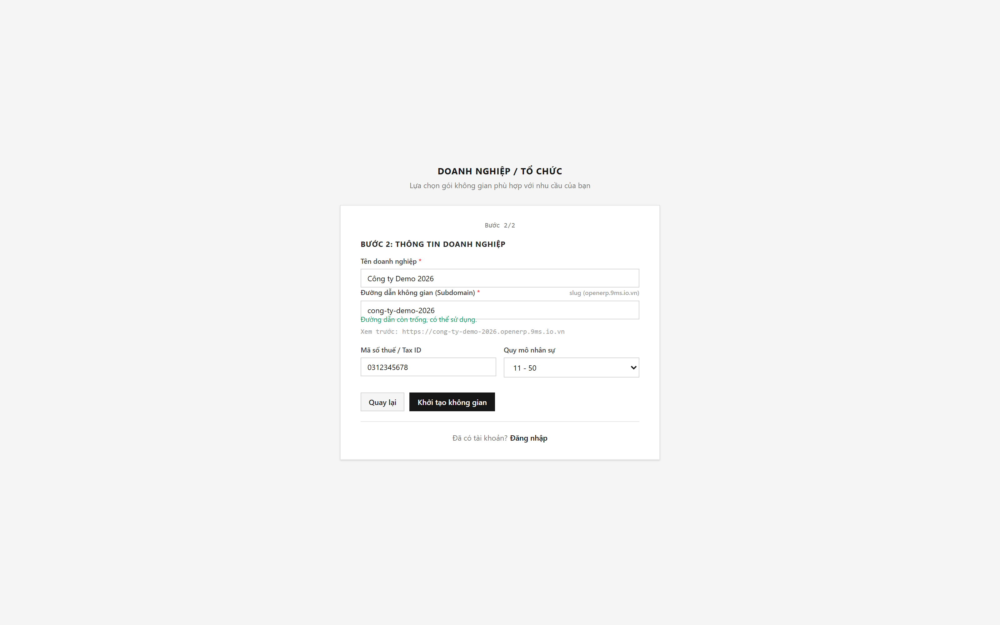
*[Ảnh 19] Bước 2/2 - Thông tin doanh nghiệp, kèm kết quả kiểm tra Subdomain trực tiếp.*

4. Bấm **"Khởi tạo doanh nghiệp"** → hệ thống tạo Tenant, gán quyền **TENANT_ADMIN** cho bạn và gửi email chào mừng kèm tên/slug workspace.
5. Đăng nhập lại để bắt đầu làm việc trong workspace doanh nghiệp.

> **Lưu ý**: Subdomain (slug) là duy nhất toàn hệ thống; nút khởi tạo bị chặn khi slug đang kiểm tra hoặc đã tồn tại. Email quản trị đã tồn tại sẽ bị từ chối để chống chiếm đoạt tài khoản.

---

## 9. Giao diện & Chọn Theme (Sáng/Tối/Hệ thống)

Giao diện có bộ chọn **Theme** với 3 lựa chọn, đặt cạnh bộ chọn ngôn ngữ trên TopBar (desktop) và trong Drawer điều hướng (điện thoại):

- **Hệ thống** (mặc định): tự động theo chế độ Sáng/Tối của hệ điều hành.
- **Sáng**: luôn dùng giao diện sáng.
- **Tối**: luôn dùng giao diện tối.

Lựa chọn được **ghi nhớ** cho các lần truy cập sau.

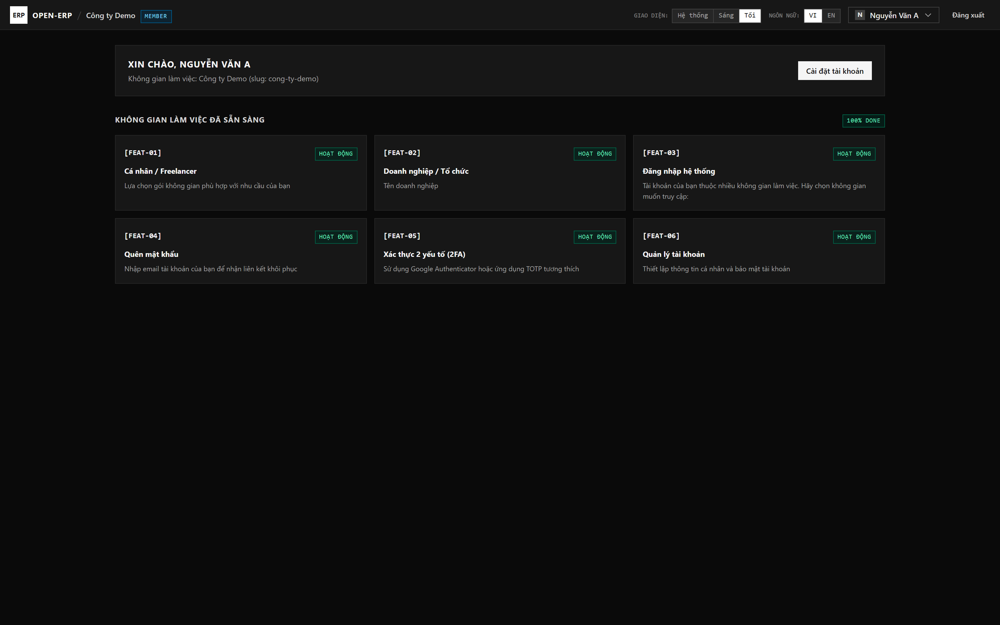
*[Ảnh 14] Dashboard ở chế độ tối (TopBar có bộ chọn "GIAO DIỆN: Hệ thống / Sáng / Tối").*

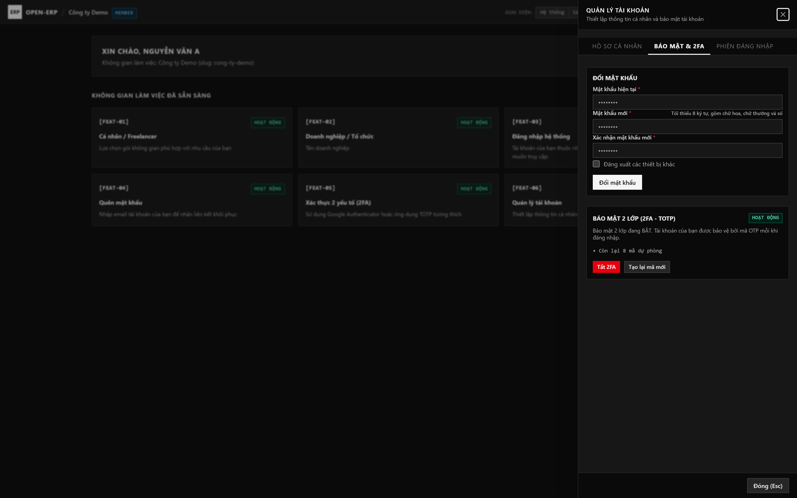
*[Ảnh 15] Drawer Quản lý tài khoản ở chế độ tối.*

---

## 10. Sử dụng Trên Điện Thoại

### 10.1. Ứng dụng Mobile (Ionic 8)

Mobile (Ionic 8) tối giản so với bản Web, điều hướng tập trung qua **Side Menu**:

- Điều hướng mượt với nút Back trên header và cử chỉ vuốt/back của hệ điều hành; sau khi đăng nhập hoặc đăng xuất, nút Back không quay lại màn hình trung gian.
- **Đăng nhập / 2FA / Chọn workspace** tương tự bản Web; các trang này đều có bộ chọn ngôn ngữ + theme gọn ở góc trên.

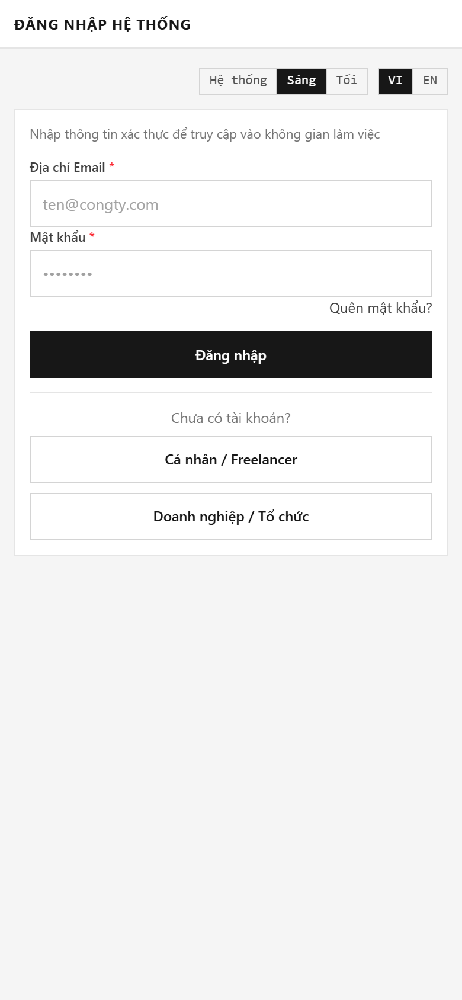
*[Ảnh 16] Trang đăng nhập trên Mobile.*

- **Dashboard**: toolbar chỉ còn nút menu (☰) + tiêu đề; thông tin tài khoản và workspace nằm trong Side Menu.

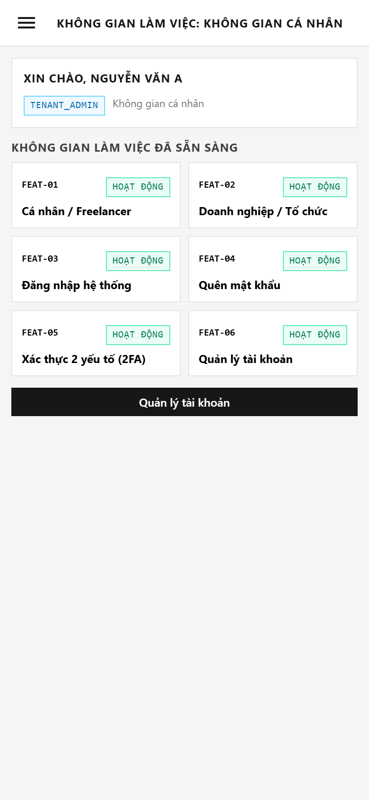
*[Ảnh 17] Dashboard Mobile với nút menu (☰) trên toolbar.*

- Nhấn **☰** để mở **Side Menu**, chứa đầy đủ:
  1. Thông tin tài khoản: avatar, tên, email, workspace, vai trò.
  2. Menu: Bảng điều khiển, Hồ sơ cá nhân, Bảo mật & 2FA, Phiên đăng nhập (bấm tự đóng menu).
  3. Chuyển ngôn ngữ VI/EN.
  4. Chọn Theme: Hệ thống / Sáng / Tối.
  5. Nút Đăng xuất.

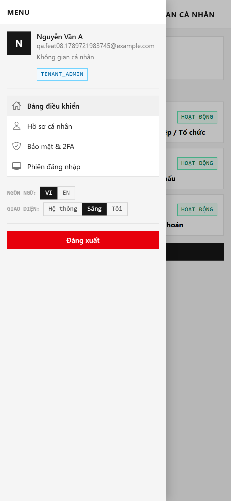
*[Ảnh 24] Side Menu trên Mobile: thông tin tài khoản, menu, ngôn ngữ, theme, đăng xuất.*

- **Theme** Sáng/Tối/Hệ thống hoạt động trên Mobile và **ghi nhớ lựa chọn** cho lần sau.

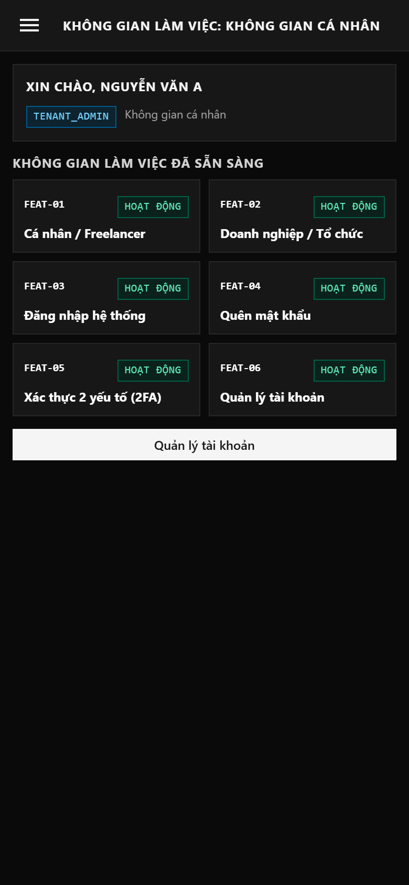
*[Ảnh 25] Mobile ở chế độ tối - áp dụng cho cả toolbar, nội dung và Side Menu.*

- **Tài khoản**: các tab Hồ sơ / Bảo mật & 2FA (ưu tiên nút **Sao chép mã bí mật** khi bật 2FA) / Phiên đăng nhập, truy cập qua Side Menu.

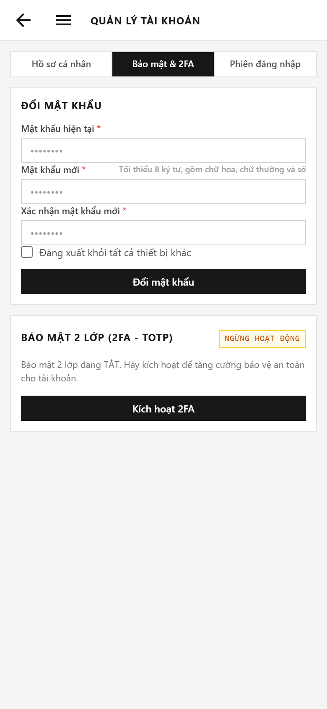
*[Ảnh 18] Trang tài khoản Mobile - tab Bảo mật & 2FA.*

### 10.2. Web trên Điện thoại (Responsive) & Drawer Điều hướng

Khi mở Web (http://localhost:4200) trên điện thoại, giao diện tự tối ưu:

- Trang **đăng nhập/đăng ký/quên mật khẩu** hiển thị 1 cột, form rộng toàn màn hình, nút bấm full-width.
- **Dashboard** không còn tràn ngang; TopBar chỉ còn **logo + nút hamburger (☰)**.

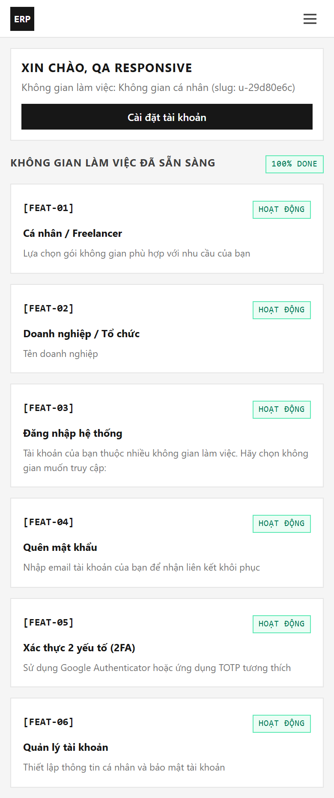
*[Ảnh 21] Dashboard trên điện thoại: TopBar gọn với nút hamburger, thẻ tính năng 1 cột.*

- Nhấn **hamburger (☰)** để mở **Drawer điều hướng**, chứa đầy đủ:
  1. Thông tin tài khoản: tên, email, workspace, vai trò.
  2. Menu: Bảng điều khiển, Hồ sơ cá nhân, Bảo mật & 2FA, Phiên đăng nhập.
  3. Chuyển ngôn ngữ VI/EN.
  4. Chọn Theme: Hệ thống / Sáng / Tối.
  5. Nút Đăng xuất.

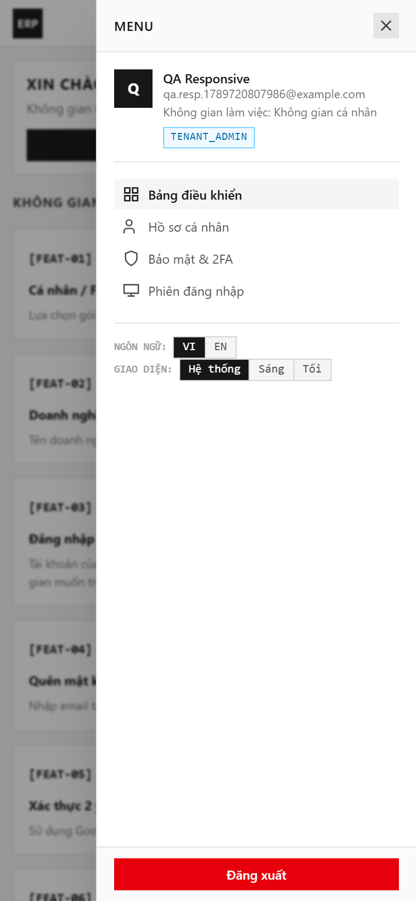
*[Ảnh 22] Drawer điều hướng trên điện thoại: thông tin tài khoản, menu, ngôn ngữ, theme, đăng xuất.*

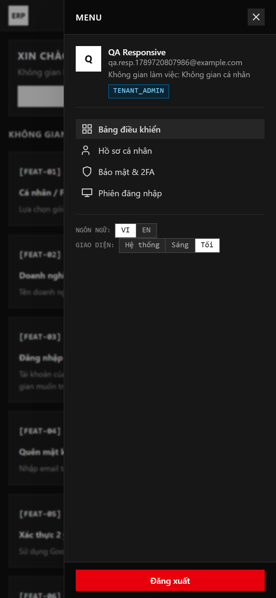
*[Ảnh 23] Chọn theme "Tối" áp dụng ngay và được ghi nhớ cho lần sau.*

---

## 11. Bản đồ URL & Điều hướng

Mọi trạng thái quan trọng đều được lưu vào URL: có thể **F5, bookmark, gửi link** trực tiếp.

| Màn hình | URL |
| :--- | :--- |
| Đăng nhập | `/login` |
| Đăng ký cá nhân / doanh nghiệp | `/register/personal`, `/register/business` |
| Xác thực email OTP | `/verify-email?email=...` |
| Chọn workspace | `/select-tenant` |
| Nhập mã 2FA khi đăng nhập | `/auth/2fa` |
| Quên / Đặt lại mật khẩu | `/forgot-password`, `/reset-password?token=...` |
| Dashboard | `/dashboard` |
| Tab Hồ sơ | `/account/detail` |
| Tab Bảo mật & 2FA | `/account/security` |
| Bật / Tắt 2FA | `/account/security/2fa/setup`, `/account/security/2fa/disable` |
| Tab Phiên đăng nhập | `/account/sessions` |

> Nếu truy cập `/account/**` hoặc `/dashboard` khi chưa đăng nhập, hệ thống tự chuyển về `/login` và sau khi đăng nhập sẽ quay lại đúng trang bạn muốn vào.

---

## 12. Câu hỏi thường gặp & Xử lý sự cố

| Tình huống | Cách xử lý |
| :--- | :--- |
| Không nhận được email OTP/khôi phục | Mở Mailpit http://localhost:8025 (local); bấm "Gửi lại mã" (chờ 60 giây); kiểm tra đúng địa chỉ email. |
| Báo tài khoản bị khóa | Nhập sai mật khẩu 5 lần trong 10 phút sẽ khóa tạm 15 phút - chờ hết thời gian và thử lại. |
| Mất điện thoại có 2FA | Dùng 1 trong 8 **mã dự phòng** ở bước nhập OTP; sau đó vào Bảo mật để bật lại 2FA trên thiết bị mới. |
| Nhập sai OTP 2FA quá 3 lần | Phiên xác thực tạm bị hủy - hãy đăng nhập lại từ đầu. |
| Đang đăng nhập mà bị đẩy ra | Phiên hết hạn/ bị thu hồi; đăng nhập lại. Hệ thống tự làm mới token khi còn hiệu lực. |
| Tài khoản bị xóa/không tồn tại | Đăng ký lại tài khoản mới (môi trường local có thể bị QA dọn dữ liệu). |
| Backend không khởi động (Java 25) | Dùng `dev.bat`/`run_backend.bat` (đã cấu hình sẵn `net.bytebuddy.experimental`). |
| Test backend làm mất dữ liệu? | Không còn - từ 2026-09-18 `mvn test` dùng DB riêng `openerp_test`. |

**Lệnh khởi chạy nhanh (từ thư mục gốc, Windows CMD):**
```bat
dev.bat        :: Docker (Postgres + Redis + Mailpit) + Backend + Web + Mobile
stop-dev.bat   :: Dừng các cửa sổ dev
```

---

## 13. Giới hạn đã biết

Các điểm dưới đây đã được ghi nhận thành item `BUG` và dự kiến xử lý ở Sprint 02 (không chặn luồng sử dụng chính):

- Chưa có tính năng tạo thêm doanh nghiệp cho người dùng đã đăng nhập (hiện đăng ký doanh nghiệp yêu cầu email chưa tồn tại).
- Màn hình lỗi khi request không có token (401) trả body rỗng ở tầng bảo mật - Web đã tự xử lý hiển thị "Phiên đăng nhập đã hết hạn".
- Một số cải tiến UX đang hoãn: kiểm tra subdomain trực tiếp khi đăng ký doanh nghiệp, form doanh nghiệp 2 bước, checkbox điều khoản ở trang đăng nhập.
- Entity Registry và đồng bộ enum `ORGANIZATION/BUSINESS` sẽ hoàn thiện ở Sprint 02.

> Danh sách đầy đủ: `docs/sprints/sprint_01_core_iam/09_review/QA_RETEST_SPRINT_01.md`.

---

*Hết tài liệu UG-01. Mọi góp ý về hướng dẫn, vui lòng phản hồi cho đội dự án qua kênh hỗ trợ.*
