# Hướng Dẫn Sử Dụng: Super Admin, Phân Quyền Chức Năng & Phân Quyền Dữ Liệu (Sprint 02)

- **Mã Tài Liệu**: UG-02
- **Phiên Bản**: 1.0 (2026-09-19)
- **Phạm Vi**: 11 chức năng Sprint 02 - Quản trị nền tảng (Tenant, Người dùng toàn cầu, Impersonation, Audit, Health, Vòng đời Super Admin), Cơ cấu tổ chức, RBAC chức năng, Phân quyền dữ liệu 7 phạm vi × 6 thao tác.
- **Nền Tảng**: Web Desktop (Angular 22 + Tailwind 4) và Mobile (Ionic 8 + Angular).
- **Hình Ảnh Minh Họa**: [`assets/sprint_02_superadmin_rbac/`](assets/sprint_02_superadmin_rbac/) (27 ảnh chụp thật từ đợt nghiệm thu QA 2026-09-19).

> **Đối tượng đọc**:
> - **Platform Operator / Super Admin / Support Engineer** (nhân viên vận hành nền tảng Open-ERP).
> - **Tenant Admin** (Quản trị viên doanh nghiệp khách thuê) sử dụng nhóm chức năng Cài đặt.
>
> *Lưu ý: ảnh minh họa được chụp trên môi trường QA với dữ liệu mẫu (`qa-test-corp-02`, tài khoản `qa.*@example.com`); tên thật trên hệ thống của bạn có thể khác.*

---

## Mục Lục
1. [Giới thiệu & Phân vai](#1-giới-thiệu--phân-vai)
2. [Đăng nhập Platform & Đổi mật khẩu bắt buộc](#2-đăng-nhập-platform--đổi-mật-khẩu-bắt-buộc)
3. [Quản lý khách thuê (Tenants)](#3-quản-lý-khách-thuê-tenants)
4. [Quản lý người dùng toàn cầu](#4-quản-lý-người-dùng-toàn-cầu)
5. [Truy cập đại diện (Impersonation)](#5-truy-cập-đại-diện-impersonation)
6. [Nhật ký kiểm toán nền tảng](#6-nhật-ký-kiểm-toán-nền-tảng)
7. [Sức khỏe hệ thống](#7-sức-khỏe-hệ-thống)
8. [Quản trị Super Admin & CLI](#8-quản-trị-super-admin--cli)
9. [Tenant Admin: Vai trò & Phân quyền chức năng](#9-tenant-admin-vai-trò--phân-quyền-chức-năng)
10. [Tenant Admin: Cơ cấu tổ chức (2 view + Canvas)](#10-tenant-admin-cơ-cấu-tổ-chức-2-view--canvas)
11. [Tenant Admin: Thành viên & Bản ghi mẫu (kiểm chứng phạm vi)](#11-tenant-admin-thành-viên--bản-ghi-mẫu-kiểm-chứng-phạm-vi)
12. [Sử dụng trên Mobile](#12-sử-dụng-trên-mobile)
13. [Web trên điện thoại (Responsive)](#13-web-trên-điện-thoại-responsive)
14. [Bản đồ URL & Điều hướng](#14-bản-đồ-url--điều-hướng)
15. [Câu hỏi thường gặp](#15-câu-hỏi-thường-gặp)
16. [Giới hạn đã biết](#16-giới-hạn-đã-biết)

---

## 1. Giới thiệu & Phân vai

Open-ERP tách biệt **ngữ cảnh nền tảng (Platform)** và **ngữ cảnh khách thuê (Tenant)**:

| Vai trò | Phạm vi | Khu vực sử dụng |
| :--- | :--- | :--- |
| **SUPER_ADMIN** | Toàn quyền vận hành nền tảng | `/platform/*` (Tenants, Users, Health, Audit, Admins) |
| **SUPPORT_ENGINEER** | Hỗ trợ kỹ thuật: chỉ xem Tenant/User + Impersonation | `/platform/*` (không thấy mục Quản Trị Super Admin; ẩn thao tác ghi) |
| **TENANT_ADMIN / TENANT_OWNER** | Quản trị doanh nghiệp khách thuê | `/settings/*` (Vai trò, Cơ cấu tổ chức, Thành viên, Bản ghi mẫu) |

- Giao diện Portal nền tảng có thanh điều hướng riêng (nền tối): **Quản Lý Khách Thuê (Tenants)** • **Người dùng toàn cầu** • **Sức khỏe hệ thống** • **Nhật Ký Kiểm Toán Nền Tảng** • **Quản Trị Super Admin**.
- Mọi thao tác nhạy cảm đều được ghi vào **Nhật ký kiểm toán bất biến** (hash chain SHA-256) kèm lý do, ticket hỗ trợ và địa chỉ IP.

---

## 2. Đăng nhập Platform & Đổi mật khẩu bắt buộc

### 2.1. Đăng nhập
1. Mở trình duyệt tới địa chỉ Web (local: `http://localhost:4200`).
2. Nhập **Email + Mật khẩu** của tài khoản vận hành nền tảng và bấm đăng nhập.

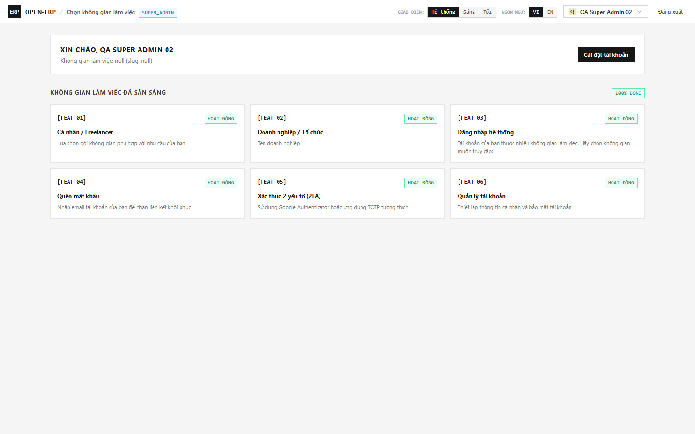
*[Ảnh 01] Trang đăng nhập dùng chung; tài khoản có quyền nền tảng sẽ truy cập được khu vực `/platform/*`.*

> Super Admin **không thể tự đăng ký** qua API công khai. Quyền nền tảng chỉ được cấp qua **bootstrap cấu hình**, **API bởi SUPER_ADMIN hiện hữu** hoặc **CLI quản trị** (xem mục 8).

### 2.2. Đổi mật khẩu bắt buộc (first-run / sau khi được cấp quyền)
Tài khoản mới được bootstrap hoặc được cấp quyền có cờ `must_change_password = true`:
1. Sau khi đăng nhập, hệ thống tự chuyển tới trang **Đổi mật khẩu bắt buộc** (`/platform/change-password`).
2. Nhập mật khẩu mới đủ mạnh (tối thiểu 8 ký tự, gồm chữ hoa, chữ thường, số và ký tự đặc biệt).
3. Sau khi lưu, **mọi token cũ bị vô hiệu hóa** — bạn được đưa về trang đăng nhập; đăng nhập lại bình thường (không lặp lại bước đổi mật khẩu).

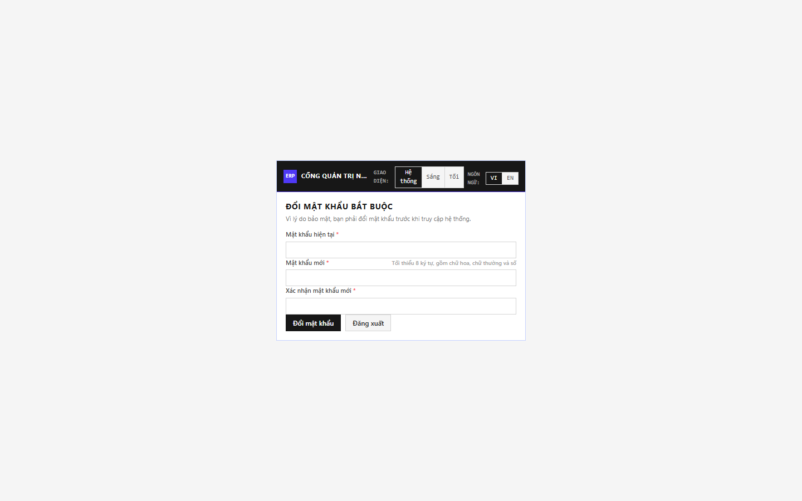
*[Ảnh 02] Trang đổi mật khẩu bắt buộc trong lần đăng nhập đầu tiên.*

---

## 3. Quản lý khách thuê (Tenants)

Truy cập **Quản Lý Khách Thuê (Tenants)** (`/platform/tenants`).

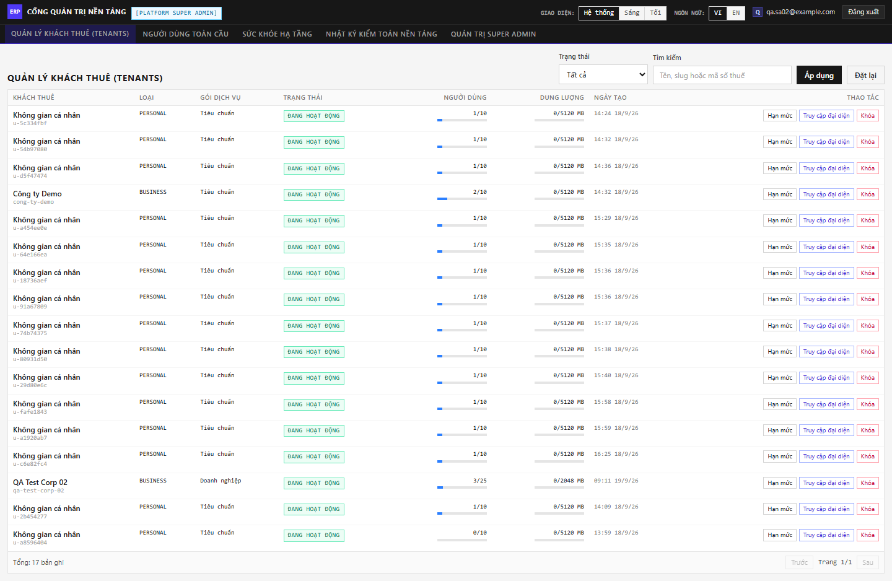
*[Ảnh 03] Bảng mật độ cao: tên, slug, loại, gói dịch vụ, trạng thái, số người dùng, dung lượng, ngày tạo; hỗ trợ tìm kiếm (tên/slug/mã số thuế) và lọc trạng thái.*

### 3.1. Cập nhật hạn mức (Quota)
1. Bấm nút **Hạn mức** trên dòng khách thuê → Drawer **Cấu hình hạn mức khách thuê** trượt từ cạnh phải.
2. Chỉnh **Số người dùng tối đa**, **Dung lượng tối đa (MB)**, **Gói dịch vụ**.
3. Tại mục **Plugin được phép**: danh sách switch dọc chia 2 nhóm:
   - **Bắt buộc**: plugin `core` luôn BẬT và không thể tắt.
   - **Tùy chọn**: bật/tắt từng plugin; có ô **tìm kiếm**, bộ đếm `Đã bật X/Y`, cảnh báo khi tắt plugin đang có chức năng liên quan.
4. Bấm **Lưu** → hệ thống ghi nhận vào nhật ký kiểm toán và không làm mất danh sách plugin (kể cả khi bấm Lưu nhiều lần).

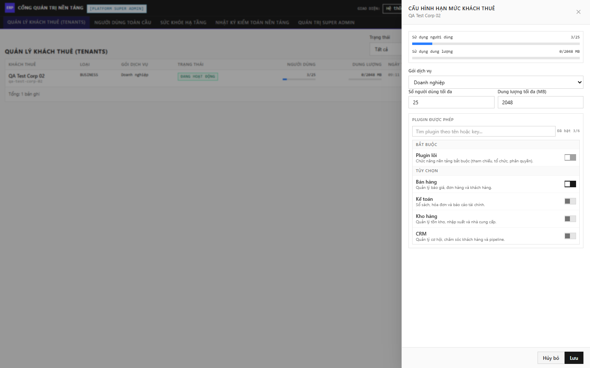
*[Ảnh 04] Drawer Hạn mức với danh sách switch plugin (nhóm Bắt buộc/Tùy chọn, tìm kiếm, đếm X/Y).*

### 3.2. Khóa khẩn cấp / Mở khóa
1. Bấm **Khóa** trên dòng khách thuê cần tạm ngưng.
2. Nhập **Lý do khóa** (bắt buộc) và mật khẩu xác nhận.

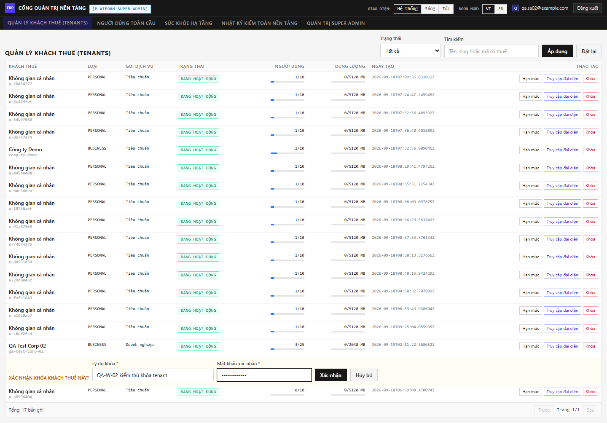
*[Ảnh 05] Xác nhận khóa kèm lý do — thao tác được audit.*

3. Trạng thái khách thuê chuyển sang **SUSPENDED**; mọi API nghiệp vụ của người dùng thuộc khách thuê đó bị chặn với mã `TENANT_SUSPENDED`.
4. Bấm **Mở khóa** để trả về **ACTIVE** khi khách thuê đã xử lý xong (hóa đơn, sự cố...).

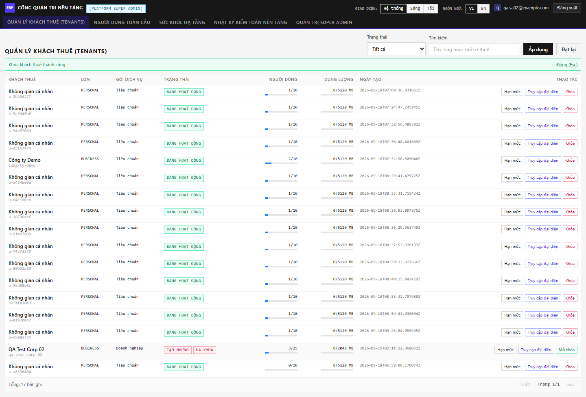
*[Ảnh 06] Khách thuê hiển thị nhãn Đã khóa trong danh sách.*

> **Lưu ý**: Nếu khách thuê đang có phiên Impersonation chưa kết thúc, thao tác khóa bị từ chối `409 PLATFORM_TENANT_IMPERSONATION_ACTIVE`. Phiên quá hạn sẽ được job nền tự đóng `TIMEOUT` trước khi khóa thành công.

---

## 4. Quản lý người dùng toàn cầu

Truy cập **Người dùng toàn cầu** (`/platform/users`).

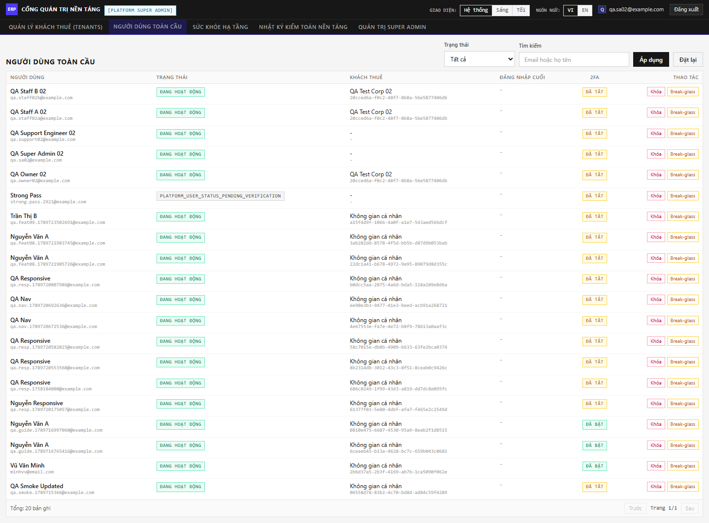
*[Ảnh 07] Danh sách người dùng toàn nền tảng: email, khách thuê, trạng thái, đăng nhập cuối, 2FA; tìm kiếm theo email/họ tên.*

- **Khóa / Mở khóa**: chuyển trạng thái user sang `LOCKED`/`ACTIVE`; khi khóa, toàn bộ phiên đăng nhập trên Redis bị hủy (user bị đăng xuất khỏi mọi khách thuê).
- **Break-glass** (khôi phục khẩn cấp khi user mất thiết bị 2FA): nhập **mã ticket hỗ trợ** + **mật khẩu xác nhận** để tắt 2FA cho user; hệ thống ghi nhật ký mức Critical và gửi email thông báo cho user.

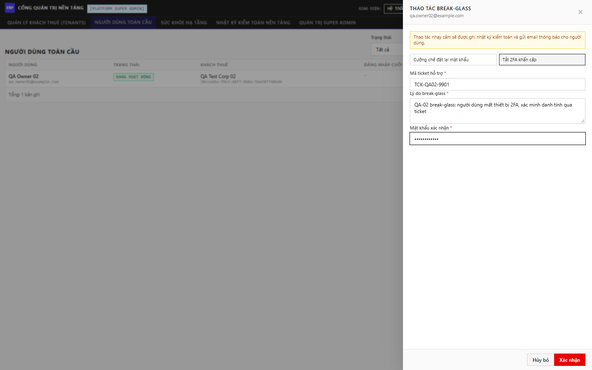
*[Ảnh 08] Drawer Break-glass bắt buộc ticket hỗ trợ + xác nhận mật khẩu.*

---

## 5. Truy cập đại diện (Impersonation)

> Chỉ **Web Desktop** hỗ trợ Impersonation. Mobile **không** hỗ trợ tính năng này (xem mục 12).

### 5.1. Bắt đầu phiên
1. Từ danh sách khách thuê, bấm **Truy cập đại diện**.
2. Điền **Mã ticket hỗ trợ** + **Lý do hỗ trợ**; có thể chọn **Người dùng đích** (mặc định là TENANT_OWNER).
3. Tích cam kết chỉ dùng cho mục đích hỗ trợ kỹ thuật và bấm **Bắt đầu phiên**.

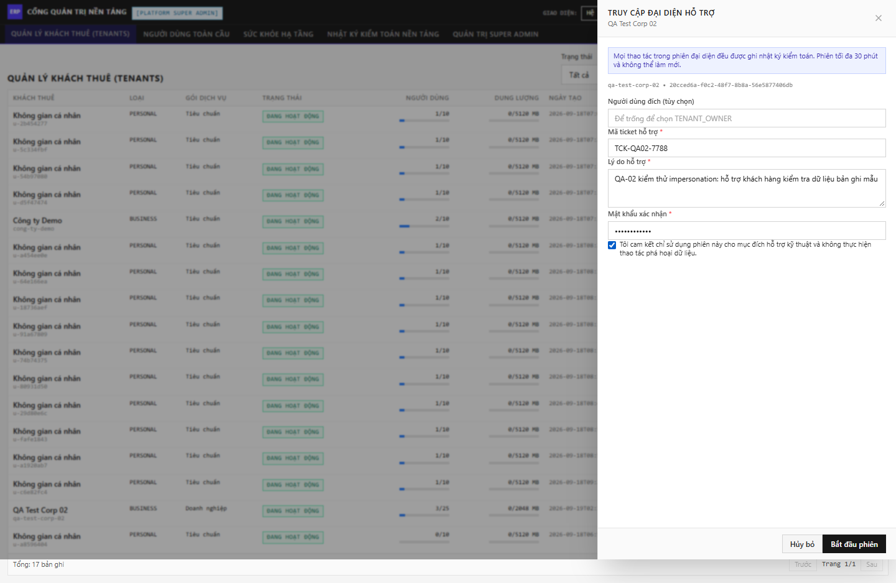
*[Ảnh 09] Drawer xác nhận phiên đại diện: ticket, lý do, người dùng đích, cam kết.*

### 5.2. Trong phiên đại diện
- Thanh **banner vàng cố định** hiển thị trên mọi màn: `BẠN ĐANG TRUY CẬP ĐẠI DIỆN` kèm **đồng hồ đếm ngược** thời gian còn lại.
- **Giới hạn**: tối đa **30 phút**, **không có refresh token** — hết hạn phiên tự đóng (`TIMEOUT`) và ghi audit.
- **Bị chặn** các thao tác nhạy cảm: xuất dữ liệu, đổi mật khẩu, bật/tắt 2FA → `403 SUPERADMIN_IMPERSONATION_SECRET_EXPORT_FORBIDDEN`.

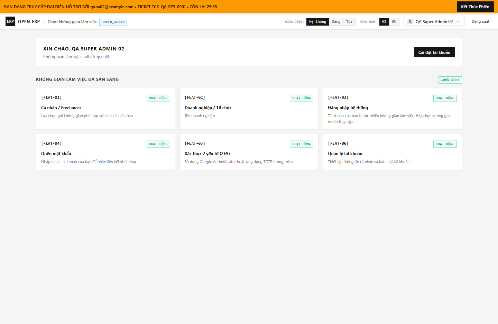
*[Ảnh 10] Banner cảnh báo + đồng hồ đếm ngược trong phiên đại diện.*

### 5.3. Kết thúc phiên
Bấm **Kết thúc phiên** trên banner → token đại diện bị xóa khỏi Redis, log chuyển `ENDED`, giao diện trở về Portal nền tảng. Token cũ nếu bị giữ lại sẽ nhận `401`.

---

## 6. Nhật ký kiểm toán nền tảng

Truy cập **Nhật Ký Kiểm Toán Nền Tảng** (`/platform/audit-logs`).

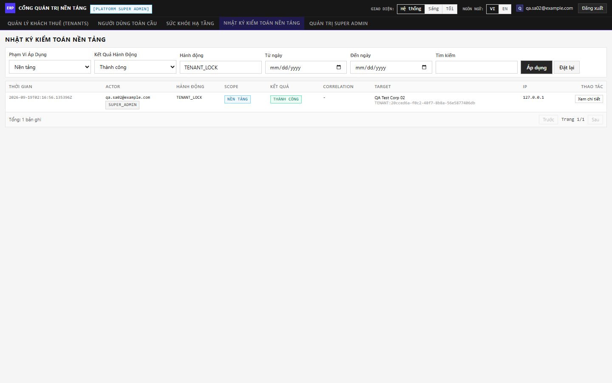
*[Ảnh 11] Danh sách nhật ký + bộ lọc theo hành động/phạm vi/kết quả và khoảng thời gian.*

- Bấm một dòng để mở **Drawer chi tiết**: thông tin actor, target, lý do, **diff JSON Trước/Sau**, cùng các trường toàn vẹn `event_id`, `correlation_id`, `ip_address`, `user_agent`.
- Khối **Chuỗi toàn vẹn**: hiển thị `prev_hash` / `entry_hash` và trạng thái `Chuỗi Toàn Vẹn: Đã Xác Minh`.
- Nhật ký **bất biến**: CSDL chặn mọi lệnh `UPDATE/DELETE` trực tiếp; dữ liệu được phân vùng theo tháng và lưu giữ 24 tháng ở tầng hot.

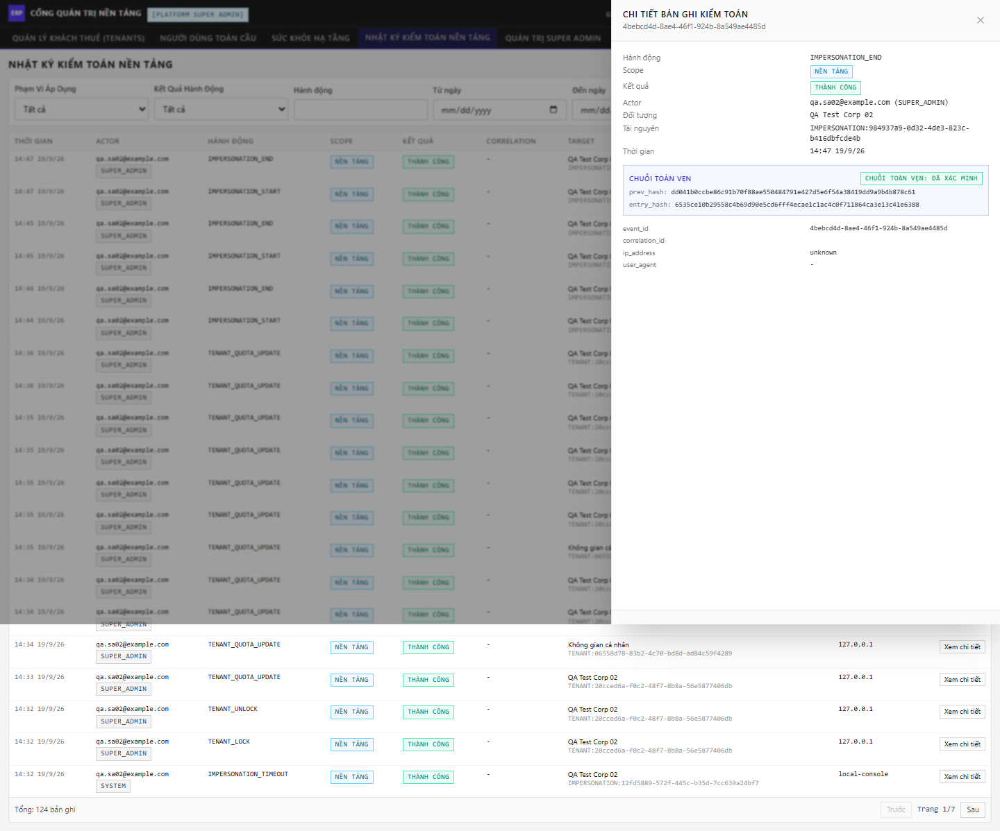
*[Ảnh 12] Drawer chi tiết bản ghi kiểm toán với diff và hash chain.*

### 6.1. Múi giờ & định dạng
- Backend lưu **UTC** trong CSDL; giao diện hiển thị theo **múi giờ + ngôn ngữ người dùng** (ví dụ `Asia/Ho_Chi_Minh` + vi-VN hiển thị `11:01 19/9/26` với cùng dữ liệu UTC `04:01`; chuyển EN/US hiển thị `4:01 AM`).
- Giá trị rỗng (ví dụ chưa từng đăng nhập) hiển thị `—`.

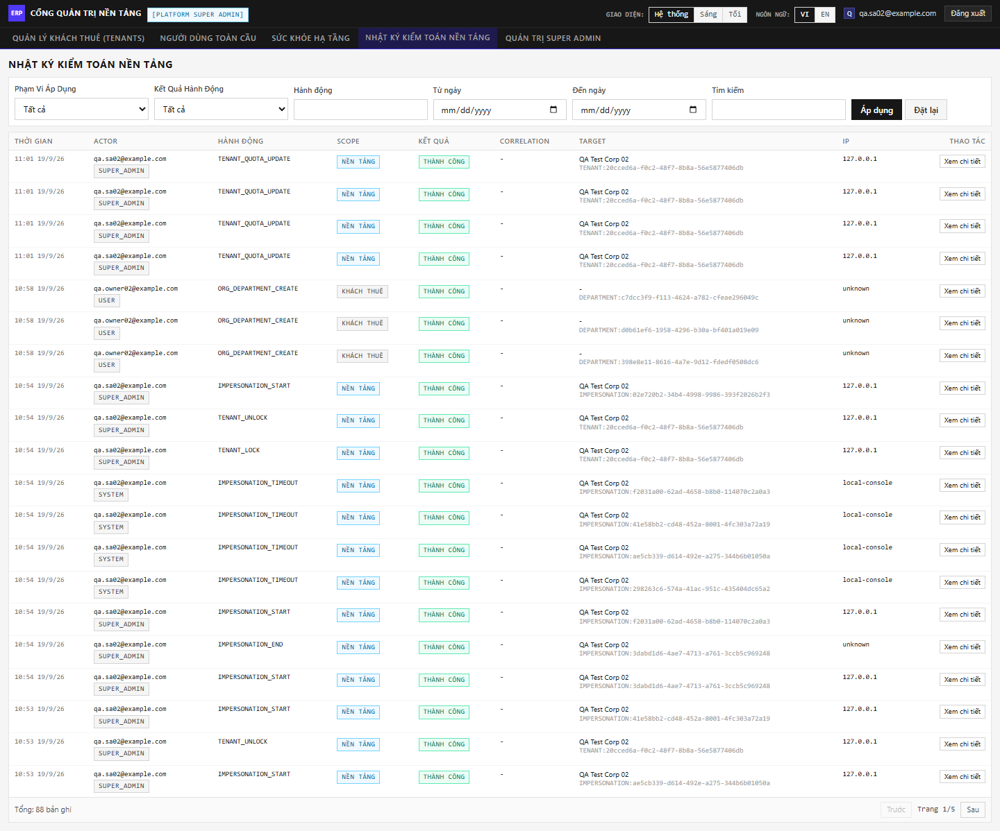
*[Ảnh 13] Cùng một bản ghi hiển thị theo timezone/locale đã chọn.*

---

## 7. Sức khỏe hệ thống

Truy cập **Sức khỏe hệ thống** (`/platform/health`).

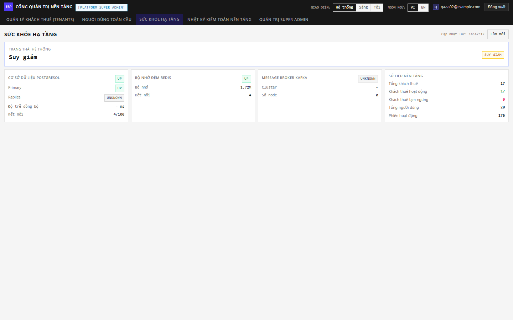
*[Ảnh 14] Thẻ trạng thái PostgreSQL (Primary/Replica, độ trễ đồng bộ, kết nối), Redis (bộ nhớ, client) và Kafka (cluster, node); kèm số liệu nền tảng: tổng/đang hoạt động/tạm ngưng khách thuê, tổng người dùng, phiên hoạt động.*

- Thẻ xanh = hoạt động; vàng = suy giảm (`DEGRADED`); xám = chưa xác định (`UNKNOWN`, ví dụ Kafka chưa bật ở local).
- Bấm **làm mới** để cập nhật trạng thái và thời điểm "Cập nhật lúc".

---

## 8. Quản trị Super Admin & CLI

Truy cập **Quản Trị Super Admin** (`/platform/admins`) — chỉ hiển thị với **SUPER_ADMIN** (SUPPORT_ENGINEER không thấy mục này).

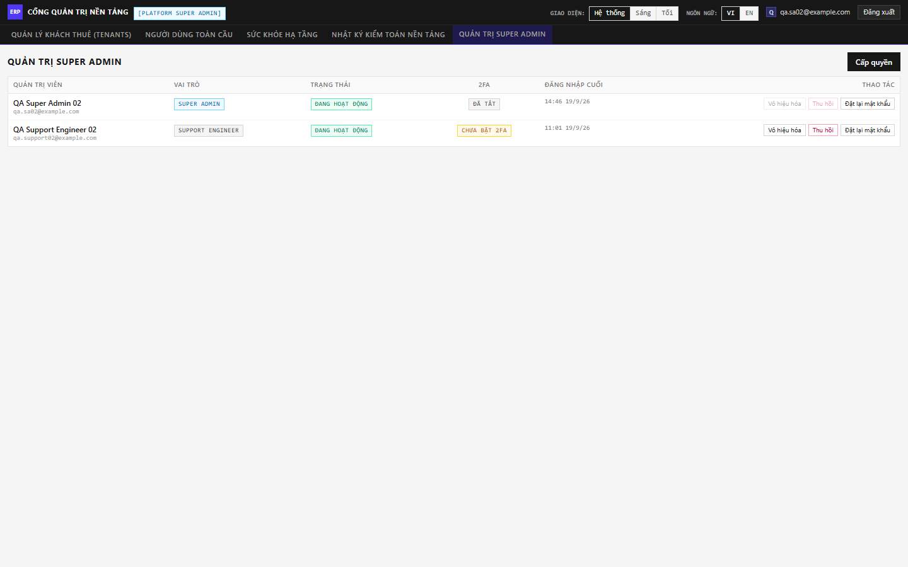
*[Ảnh 15] Danh sách quản trị viên nền tảng: email, vai trò (SUPER_ADMIN/SUPPORT_ENGINEER), trạng thái (Đã mời/Đang hoạt động/Vô hiệu hóa/Đã thu hồi), 2FA bắt buộc.*

### 8.1. Cấp quyền / Vô hiệu hóa / Thu hồi
1. Bấm **Cấp quyền** → nhập email + chọn vai trò (SUPPORT_ENGINEER hoặc SUPER_ADMIN).
   - Nếu email **chưa tồn tại**: hệ thống gửi lời mời, trạng thái `INVITED`.
   - Nếu email **đã tồn tại**: nâng cấp tài khoản hiện hữu (không tạo trùng).
2. **Vô hiệu hóa / Kích hoạt lại**: thu hồi session + blacklist token ngay lập tức; gửi email cảnh báo cho admin bị tác động.
3. **Thu hồi**: gỡ hoàn toàn quyền nền tảng.

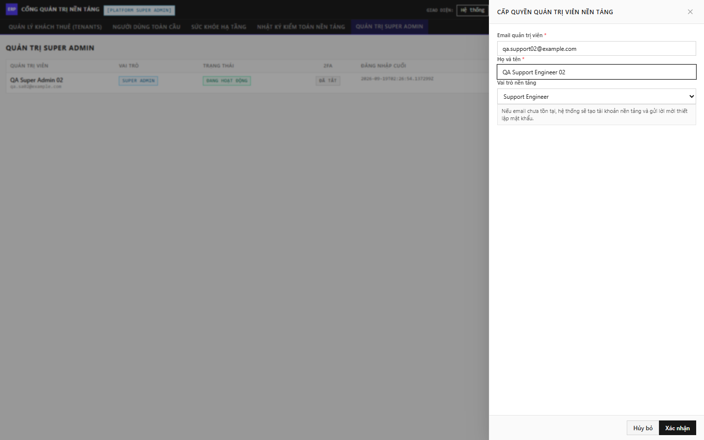
*[Ảnh 16] Drawer cấp quyền quản trị viên nền tảng.*

> **Cơ chế bảo vệ**:
> - Không thể tự vô hiệu hóa/thu hồi chính mình → `403 PLATFORM_SELF_DISABLE_FORBIDDEN`.
> - Không thể vô hiệu hóa/thu hồi **SUPER_ADMIN ACTIVE cuối cùng** → `409 PLATFORM_LAST_ADMIN_PROTECTED`.
> - Admin được cấp quyền bắt buộc **đổi mật khẩu + bật 2FA** trước khi dùng portal.

### 8.2. CLI quản trị (Offline Command Mode)
Dùng khi **mất toàn bộ Super Admin** hoặc API không truy cập được; chạy trực tiếp trên server (yêu cầu biến môi trường `OPENERP_ADMIN_BOOTSTRAP_SECRET`):

```bash
# Bootstrap từ danh sách email cấu hình (idempotent)
java -jar quarkus-run.jar admin-cli bootstrap

# Liệt kê quản trị viên nền tảng
java -jar quarkus-run.jar admin-cli list-admins

# Cấp / thu hồi quyền
java -jar quarkus-run.jar admin-cli grant-admin --email admin@congty.vn --role SUPER_ADMIN
java -jar quarkus-run.jar admin-cli revoke-admin --email admin@congty.vn
```

- CLI **không nhận mật khẩu qua tham số dòng lệnh**; mọi thao tác ghi audit `actor_type = CLI`, `ip_address = local-console`.
- Chi tiết cấu hình & quy trình khẩn cấp: [Hướng dẫn cài đặt Local](../07_deployment_guides/local_setup_guide.md) mục 6.

---

## 9. Tenant Admin: Vai trò & Phân quyền chức năng

Khu vực dành cho **Tenant Admin** — truy cập menu **Cài đặt** (thanh nav ngang): **Quản Lý Vai Trò & Phân Quyền** (`/settings/roles`).

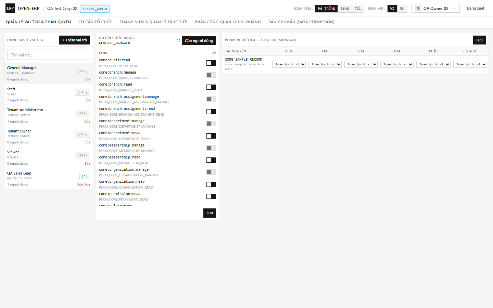
*[Ảnh 17] Bố cục Split-Screen 3 cột: Cột 1 danh sách Vai trò → Cột 2 quyền chức năng → Cột 3 (trong tab Phạm vi dữ liệu) ma trận dữ liệu.*

### 9.1. Quản lý vai trò
- Vai trò **hệ thống** (`TENANT_OWNER`, `TENANT_ADMIN`, `GENERAL_MANAGER`, `STAFF`, `VIEWER`) có nhãn `[SYS]` và **không thể xóa**.
- Bấm **+ Thêm Vai Trò** để tạo vai trò tùy biến; vai trò đang được gán cho người dùng sẽ bị chặn xóa (`IAM_ROLE_IN_USE`).

### 9.2. Quyền chức năng (tab Quyền chức năng)
- Bật/tắt từng quyền dạng `domain:resource:action` (ví dụ `sales:order:read`, `sales:order:create`) rồi bấm **Lưu**.
- Hệ thống áp dụng tức thì và xóa cache phiên liên quan; người dùng có **nhiều vai trò** sẽ nhận **hợp (union)** quyền của tất cả vai trò.
- Tab **Người dùng** trong chi tiết vai trò cho phép gán/gỡ vai trò cho từng nhân sự.

### 9.3. Phân quyền dữ liệu — 7 phạm vi × 6 thao tác (tab Phạm vi dữ liệu)
Với từng tài nguyên nghiệp vụ, chọn phạm vi cho 6 thao tác: **CREATE, READ, UPDATE, DELETE, EXPORT, SHARE**:

| Phạm vi | Ý nghĩa |
| :--- | :--- |
| `ALL` | Toàn bộ dữ liệu của khách thuê |
| `BRANCH` | Dữ liệu thuộc (các) chi nhánh thành viên + chi nhánh được quản lý |
| `DEPARTMENT_AND_CHILDREN` | Phòng ban hiện tại và toàn bộ phòng ban con |
| `DEPARTMENT` | Chỉ phòng ban hiện tại |
| `OWN_AND_SUBORDINATES` | Dữ liệu của mình và cấp dưới theo tuyến quản lý |
| `OWN_ONLY` | Chỉ dữ liệu do mình tạo/được giao |
| `NONE` | Không được phép (thao tác bị chặn `403`) |

- Nguyên tắc **Most Permissive**: khi một user có nhiều vai trò, phạm vi rộng nhất được áp dụng.
- **TENANT_OWNER** luôn có `ALL` cho mọi thao tác, không bị giới hạn bởi chính sách.

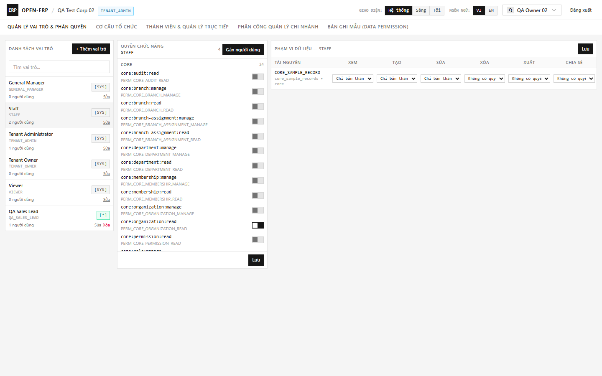
*[Ảnh 18] Thiết lập phạm vi cho từng thao tác dữ liệu và lưu thành công.*

---

## 10. Tenant Admin: Cơ cấu tổ chức (2 view + Canvas)

Truy cập **Cơ Cấu Tổ Chức** (`/settings/organization`).

### 10.1. View danh sách (Indented List)
- Cây phòng ban thụt lề theo cấp (0/14/28/42/56px cho 5 cấp); nút thu gọn/mở rộng từng node, "Mở rộng/Thu gọn tất cả".
- Bấm node → **panel chi tiết inline** (không modal): tên, mã, chi nhánh, trưởng phòng, số thành viên, cấp + hành động **Thêm con / Sửa / Xóa** (mở Drawer).

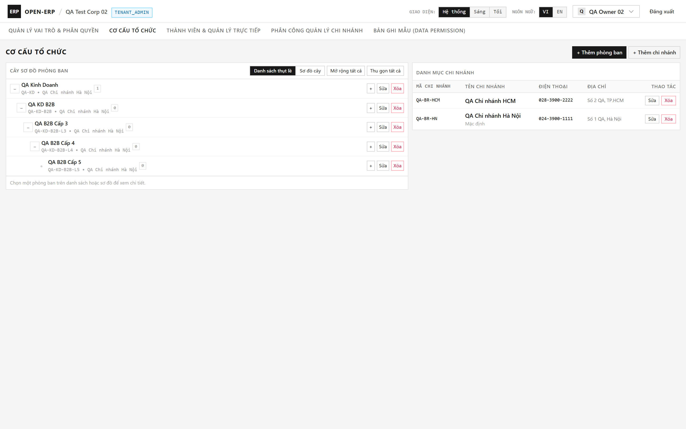
*[Ảnh 19] View danh sách với 5 cấp phòng ban và panel chi tiết.*

### 10.2. View sơ đồ Canvas
- Chuyển segmented control **list ⇄ graph**; trạng thái thu gọn/node đang chọn được chia sẻ giữa 2 view.
- **Thao tác**: kéo nền để pan; lăn chuột hoặc nút `+`/`−` để zoom (giới hạn 25%–250%); **Vừa khung** để fit toàn cây; **Đặt lại** để về mặc định; nhấp đôi để căn giữa node.
- Cây lớn được **culling** và vẽ trên Canvas 2D nên vẫn mượt (~60 FPS với cây 405 node); trạng thái view/viewport được giữ khi F5.

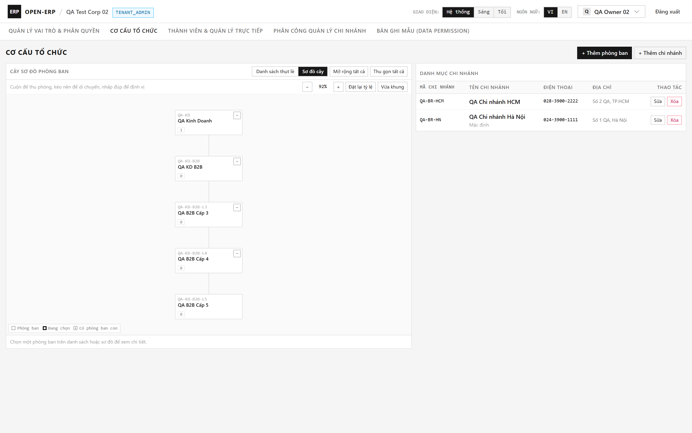
*[Ảnh 20] View Canvas: node, đường nối cha–con, legend, zoom/pan và panel chi tiết.*

### 10.3. Chi nhánh & Phân công quản lý chi nhánh
- Tạo chi nhánh (không trùng mã trong cùng khách thuê), gán nhân sự vào phòng ban kèm quản lý trực tiếp (hệ thống chặn vòng lặp báo cáo).
- Màn **Phân Công Quản Lý Chi Nhánh** (`/settings/branch-assignments`) cho phép gán một người quản lý **nhiều chi nhánh** mà không cần membership từng phòng ban; phạm vi `BRANCH` của người này gồm toàn bộ chi nhánh được gán.

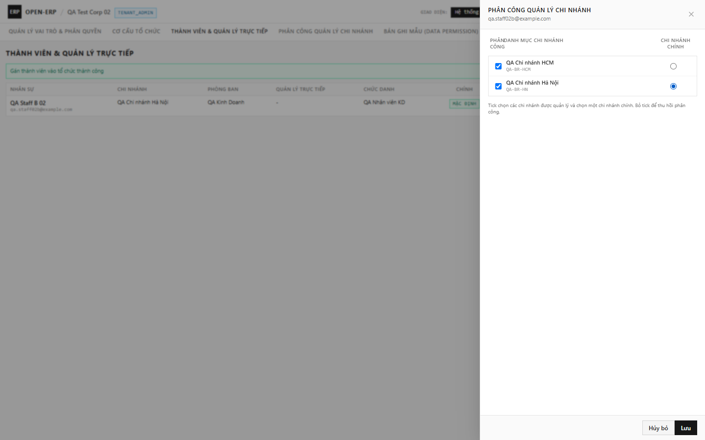
*[Ảnh 21] Drawer phân công quản lý chi nhánh.*

---

## 11. Tenant Admin: Thành viên & Bản ghi mẫu (kiểm chứng phạm vi)

- **Thành viên & Quản lý trực tiếp** (`/settings/members`): gán nhân sự vào phòng ban, chỉ định quản lý trực tiếp, đặt phòng ban chính (`is_primary`).
- **Bản ghi mẫu** (`/settings/sample-records`): thực thể tham chiếu của Core dùng để **kiểm chứng trực quan** cơ chế phân quyền dữ liệu (CRUD, Xuất, Chia sẻ).

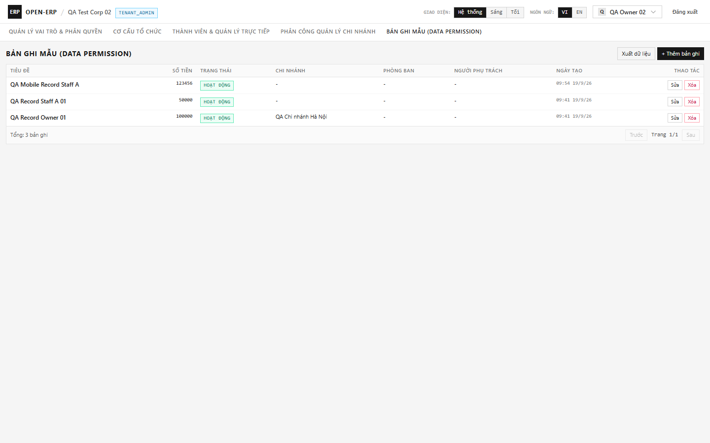
*[Ảnh 22] TENANT_OWNER thấy toàn bộ bản ghi và nút Xuất.*

- **Kiểm chứng phạm vi**: nhân viên có `read_scope = OWN_ONLY` chỉ thấy bản ghi do mình tạo/được giao; nhân viên có `export_scope = NONE` bị chặn xuất dữ liệu với lỗi `403 IAM_PERMISSION_DENIED_EXPORT`.

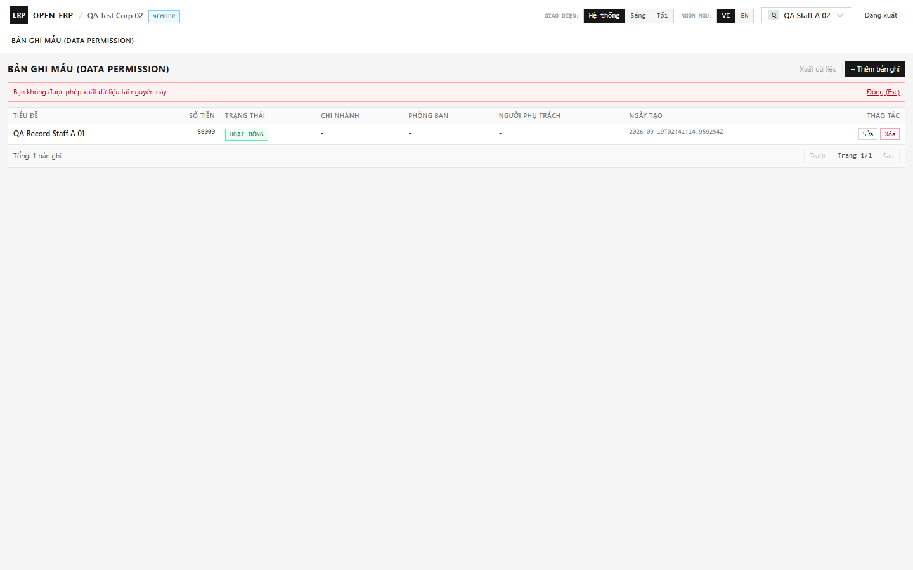
*[Ảnh 23] Tài khoản STAFF bị từ chối xuất dữ liệu do `export_scope = NONE`.*

---

## 12. Sử dụng trên Mobile

Ứng dụng Ionic 8 (local: `http://localhost:8100`) cung cấp phiên bản tối giản cho các tác vụ Sprint 02:

- **Menu điều hướng**: thông tin tài khoản, vai trò, các màn Vai trò, Cơ cấu tổ chức, Bản ghi mẫu, Emergency (plugin).

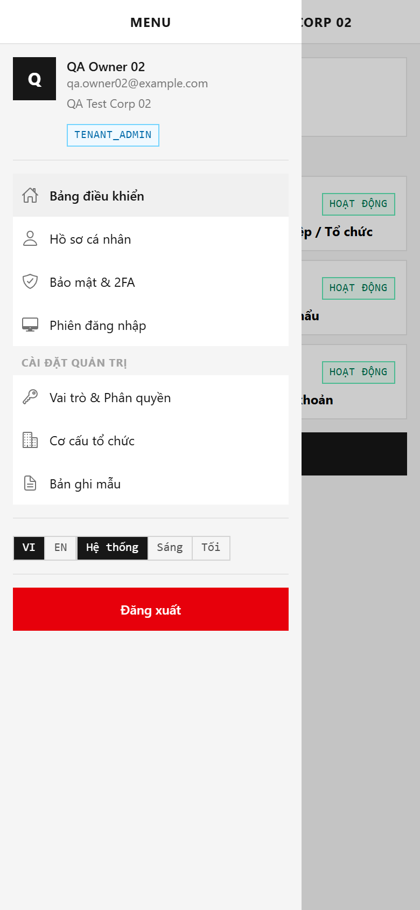
*[Ảnh 24] Menu Mobile với các mục Sprint 02.*

- **Cơ cấu tổ chức**: 3 tab Chi nhánh / Phòng ban (cây lồng nhau) / Thành viên.

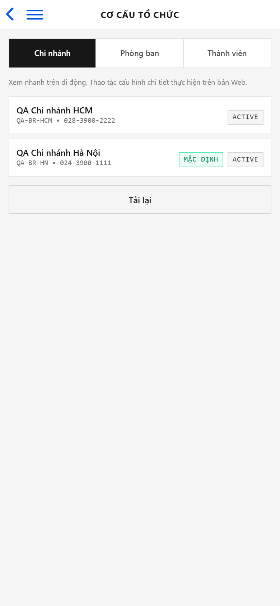
*[Ảnh 25] Màn Cơ cấu tổ chức trên Mobile (390×844).*

- **Emergency (Plugin read-only)**: xem trạng thái và danh sách plugin được phép của khách thuê dạng toggle khóa (chỉ đọc, touch target ≥ 40px).

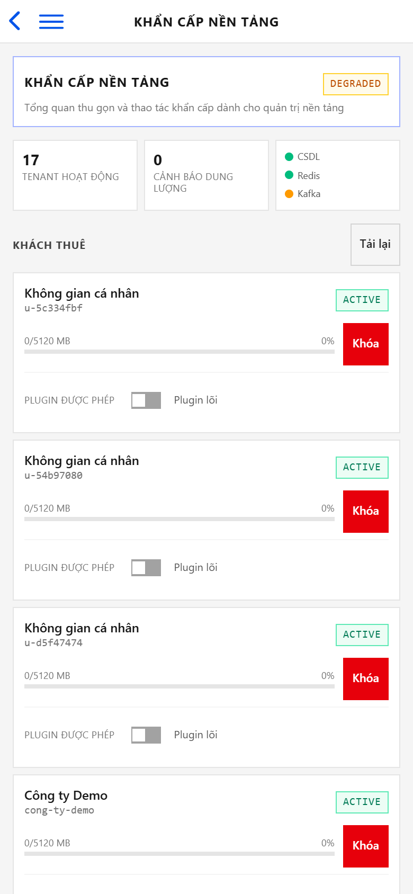
*[Ảnh 26] Màn Emergency: trạng thái hệ thống + plugin được phép (chỉ đọc).*

> **Giới hạn trên Mobile**: **không hỗ trợ Impersonation**, không có thao tác ghi cho quản trị nền tảng (khóa tenant, sửa quota, quản trị admin...). Các tác vụ này chỉ thực hiện trên Web Desktop.

---

## 13. Web trên điện thoại (Responsive)

Bản Web cũng dùng được trên điện thoại (viewport 390×844): toàn bộ 13 màn Platform + Cài đặt đạt **không tràn ngang (overflow = 0)**; Drawer mở full-width; nút bấm/toggle đạt touch target ≥40px.

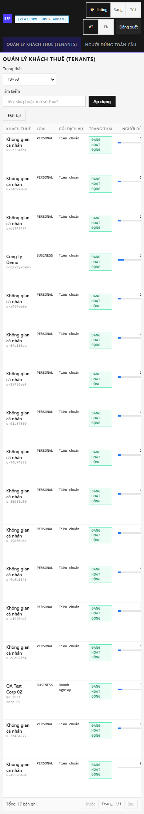
*[Ảnh 27] Danh sách khách thuê trên Web tại 390×844 (không tràn ngang).*

---

## 14. Bản đồ URL & Điều hướng

| Khu vực | URL | Ghi chú |
| :--- | :--- | :--- |
| Đăng nhập | `/login` | Dùng chung cho mọi vai trò |
| Đổi mật khẩu bắt buộc | `/platform/change-password` | Bắt buộc với admin mới/được cấp quyền |
| Khách thuê | `/platform/tenants` | Kèm Drawer Hạn mức, khóa/mở khóa, Impersonation |
| Người dùng toàn cầu | `/platform/users` | Khóa/mở khóa, Break-glass |
| Sức khỏe | `/platform/health` | Dashboard hạ tầng |
| Nhật ký kiểm toán | `/platform/audit-logs` | Filter + Drawer chi tiết hash chain |
| Quản trị Super Admin | `/platform/admins` | Chỉ SUPER_ADMIN |
| Vai trò & Phân quyền | `/settings/roles` | Split-Screen 3 cột |
| Cơ cấu tổ chức | `/settings/organization` | 2 view list ⇄ graph |
| Thành viên | `/settings/members` | Membership + quản lý trực tiếp |
| Phân công chi nhánh | `/settings/branch-assignments` | Quản lý đa chi nhánh |
| Bản ghi mẫu | `/settings/sample-records` | Kiểm chứng scope + export |

---

## 15. Câu hỏi thường gặp

**1. Tài khoản của tôi không thấy mục "Quản Trị Super Admin"?**
Bạn đang là **SUPPORT_ENGINEER** (chỉ xem Tenant/User + Impersonation). Mục quản trị admin chỉ dành cho SUPER_ADMIN.

**2. Vì sao nút Khóa khách thuê báo lỗi `PLATFORM_TENANT_IMPERSONATION_ACTIVE`?**
Khách thuê đang có phiên đại diện chưa kết thúc. Hãy kết thúc phiên (hoặc chờ job nền tự đóng khi hết hạn 30 phút) rồi khóa lại.

**3. Tôi quên mất phiên Impersonation đang mở thì sao?**
Phiên tự động hết hạn sau 30 phút; hệ thống ghi `TIMEOUT` + audit và bạn được đưa về Portal. Không có refresh token nên phiên không thể kéo dài.

**4. Vì sao tài khoản nhân viên không thấy nút Xuất ở Bản ghi mẫu?**
Vai trò của họ có `export_scope = NONE` trên tài nguyên `SAMPLE_RECORD`. Điều chỉnh tại **Cài đặt → Vai trò → Phạm vi dữ liệu**, cột `EXPORT`.

**5. Nhân viên thuộc nhiều phòng ban thì phạm vi tính thế nào?**
Áp dụng nguyên tắc **Most Permissive**: phạm vi rộng nhất trong tất cả vai trò/chính sách được dùng; riêng `BRANCH` là hợp của chi nhánh thành viên và chi nhánh được phân công quản lý.

**6. Nhật ký kiểm toán có sửa/xóa được không?**
Không. CSDL chặn `UPDATE/DELETE` bằng trigger; mỗi bản ghi liên kết chuỗi hash SHA-256 và có thể xác minh toàn vẹn trong Drawer chi tiết.

**7. Vì sao giờ trên màn hình khác với giờ trong CSDL?**
CSDL lưu **UTC**; giao diện hiển thị theo múi giờ + ngôn ngữ của bạn. Đổi timezone trong Hồ sơ cá nhân để xem đúng giờ địa phương.

**8. Cấp quyền cho admin mới mà người đó chưa có tài khoản?**
Hệ thống gửi **lời mời** (trạng thái `INVITED`). Khi người đó đăng nhập lần đầu, bắt buộc đổi mật khẩu và bật 2FA trước khi dùng portal.

---

## 16. Giới hạn đã biết

1. **Impersonation chỉ trên Web Desktop**; Mobile chỉ xem thông tin.
2. **Cold archive audit > 24 tháng** (MongoDB/S3 WORM + legal hold) chưa bật trong Sprint 02 — audit hot storage + hash chain + retention 24 tháng đã hoạt động đầy đủ; hạng mục TASK-293 chuyển Sprint sau.
3. **API mời thành viên chưa có** trong Sprint 02: hạn mức người dùng hiện được enforce tại luồng đăng ký; các điểm tạo thành viên tương lai sẽ đi qua cùng cơ chế.
4. **Hạn mức dung lượng** đã có cấu hình nhưng chưa có luồng upload thực tế để đếm; sẽ kích hoạt khi có module Storage.
5. **CLI**: hiện có Offline CLI 4 lệnh trên server; script Remote CLI gọi API từ xa chưa ban hành.
6. Bản Web tại 390×844 vẫn còn vài điểm chạm ở shared topbar/nav đang được xử lý (BUG-83, Medium, đã fix FE + build PASS — chờ QA đo lại runtime).

---

*Tài liệu liên quan: [Biên bản nghiệm thu Sprint 02](../sprints/sprint_02_superadmin_rbac/09_review/sprint_review.md) • [Báo cáo kiểm thử TR-02](../sprints/sprint_02_superadmin_rbac/08_testing/test_report.md) • [Hướng dẫn sử dụng Sprint 01](sprint_01_core_iam_user_guide.md).*
