# Hướng Dẫn Sử Dụng: Plugin Manager, Marketplace & Plugin Host (Sprint 03)

- **Mã Tài Liệu**: UG-03
- **Phiên Bản**: 1.0 (2026-10-04)
- **Nền Tảng**: Web Desktop (Angular 22 + Tailwind 4) và Mobile (Ionic 8 + Angular — chỉ đọc).
- **Phạm Vi**: Plugin Manager (danh mục & vòng đời cài/nâng cấp/bật-tắt/gỡ), Marketplace tenant, Plugin riêng của tenant, Credential Registry (nền tảng & tenant), Plugin Host (nhúng UI plugin vào Core), giám sát & khóa khẩn cấp trên nền tảng.
- **Hình Ảnh Minh Họa**: [`assets/sprint_03_plugin_manager/`](assets/sprint_03_plugin_manager/) — **21 ảnh chụp thật**.
- **Nguồn Bằng Chứng**: Toàn bộ ảnh được trích từ đợt nghiệm thu QA Sprint 03 ngày **2026-09-20**, thư mục `docs/sprints/sprint_03_plugin_manager/08_testing/evidence/screenshots/` (báo cáo [QA-01](../sprints/sprint_03_plugin_manager/08_testing/QA-01_sprint_03_test_report.md)). Đặc tả UI tham chiếu: [DES-03-UI](../sprints/sprint_03_plugin_manager/06_designs/ui_ux/PLUGIN_MANAGER_UI_SPEC.md).

> **Đối tượng đọc**:
> - **Tenant Admin / TENANT_OWNER** (quản trị doanh nghiệp khách thuê) — tự cài đặt, nâng cấp, bật/tắt, gỡ plugin và đăng ký plugin riêng.
> - **SUPER_ADMIN** (nhân viên vận hành nền tảng) — quản lý danh mục plugin, phiên bản, khóa khẩn cấp, giám sát plugin riêng.
> - **SUPPORT_ENGINEER** — chỉ xem danh mục và plugin riêng (read-only).
> - **End-user** — sử dụng các màn hình do plugin nhúng vào Core (`/apps/:pluginKey/*`).
>
> *Lưu ý: ảnh minh họa được chụp trên môi trường QA với dữ liệu mẫu (`QA Plugin Co`, plugin `sales`, `inventory`, `crm`, `qa-custom-tool`); tên/phiên bản thật trên hệ thống của bạn có thể khác.*

---

## Mục Lục
1. [Giới thiệu & Phân vai](#1-giới-thiệu--phân-vai)
2. [Bản đồ URL & Điều hướng](#2-bản-đồ-url--điều-hướng)
3. [Tenant Admin: Marketplace plugin](#3-tenant-admin-marketplace-plugin)
4. [Tenant Admin: Cài đặt plugin](#4-tenant-admin-cài-đặt-plugin)
5. [Tenant Admin: Chi tiết & phiên bản](#5-tenant-admin-chi-tiết--phiên-bản)
6. [Tenant Admin: Nâng cấp & Khôi phục](#6-tenant-admin-nâng-cấp--khôi-phục)
7. [Tenant Admin: Bật/Tắt & Gỡ plugin (giữ dữ liệu)](#7-tenant-admin-bậttắt--gỡ-plugin-giữ-dữ-liệu)
8. [Tenant Admin: Plugin riêng của tôi](#8-tenant-admin-plugin-riêng-của-tôi)
9. [Credential Registry (Tenant & Nền tảng)](#9-credential-registry-tenant--nền-tảng)
10. [Platform Super Admin: Danh mục plugin](#10-platform-super-admin-danh-mục-plugin)
11. [Platform: Giám sát Plugin riêng của Tenant](#11-platform-giám-sát-plugin-riêng-của-tenant)
12. [End-user: Plugin Host (màn hình do plugin nhúng)](#12-end-user-plugin-host-màn-hình-do-plugin-nhúng)
13. [Sử dụng trên Mobile (chỉ đọc)](#13-sử-dụng-trên-mobile-chỉ-đọc)
14. [Lưu ý nghiệp vụ quan trọng](#14-lưu-ý-nghiệp-vụ-quan-trọng)
15. [Câu hỏi thường gặp / Xử lý sự cố](#15-câu-hỏi-thường-gặp--xử-lý-sự-cố)
16. [Giới hạn đã biết](#16-giới-hạn-đã-biết)

---

## 1. Giới thiệu & Phân vai

Tính năng Plugin Manager cho phép mỗi khách thuê **tự quản lý bộ plugin** của mình trong khi nền tảng giữ quyền **kiểm soát danh mục và khóa khẩn cấp**:

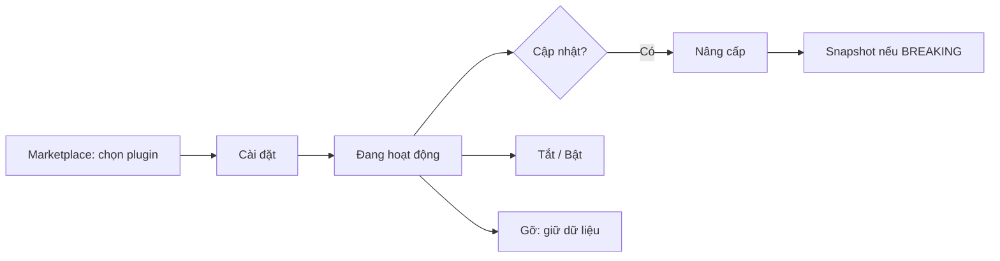
```mermaid
graph LR
    A[Marketplace: chọn plugin] --> B[Cài đặt]
    B --> C[Đang hoạt động]
    C --> D{Cập nhật?}
    D -- Có --> E[Nâng cấp]
    E --> F[Snapshot nếu BREAKING]
    C --> G[Tắt / Bật]
    C --> H[Gỡ: giữ dữ liệu]
```

| Vai trò | Phạm vi | Khu vực sử dụng |
| :--- | :--- | :--- |
| **TENANT_ADMIN / TENANT_OWNER** | Quản lý plugin của chính khách thuê | `/settings/plugins`, `/settings/plugin-credentials` |
| **SUPER_ADMIN** | Toàn quyền danh mục + khóa khẩn cấp | `/platform/plugins`, `/platform/plugin-credentials`, `/platform/tenant-private-plugins` |
| **SUPPORT_ENGINEER** | Chỉ xem danh mục + plugin riêng (không thấy nút Khóa) | `/platform/plugins`, `/platform/tenant-private-plugins` |
| **End-user** | Dùng màn hình plugin đã cài | `/apps/:pluginKey/*` |
| **Mobile (Ionic)** | Chỉ xem trạng thái, không thao tác ghi | `/settings/plugins` (Mobile) |

- Quyền tenant tương ứng: `core:plugin:read`, `core:plugin:install`, `core:plugin:manage`, `core:plugin:credential_manage`, `core:plugin:register_custom`.
- Mọi thao tác vòng đời plugin đều **bất đồng bộ** (job nền), có `operation_id` và tiến trình từng bước (PRE_FLIGHT → LEDGER → PROVISION_DATASOURCE → DEPLOY → HEALTH → SEED_PERMISSIONS → ACTIVATE).

---

## 2. Bản đồ URL & Điều hướng

| Khu vực | URL | Ghi chú |
| :--- | :--- | :--- |
| Marketplace tenant | `/settings/plugins` | 3 nhóm: Đã cài / Có thể cài / Plugin riêng |
| Chi tiết plugin (Drawer) | `/settings/plugins/…/detail` | Mở Drawer, giữ được khi F5 / deep-link |
| Nâng cấp plugin (Drawer) | `/settings/plugins/…/upgrade` | Deep-link được |
| Quản lý phiên bản plugin riêng | `/settings/plugins/…/manage` | Deep-link được |
| Credential tenant | `/settings/plugin-credentials` | Secret không bao giờ hiển thị |
| Danh mục nền tảng | `/platform/plugins` | Split-Screen, mặc định chuẩn hoá `all/-/20/1/-/list` |
| Credential nền tảng | `/platform/plugin-credentials` | Dùng chung nhiều plugin |
| Plugin riêng của tenant | `/platform/tenant-private-plugins` | Giám sát + khóa khẩn cấp |
| Màn hình plugin | `/apps/:pluginKey/*` | Do Core đăng ký từ UI Manifest |

> **Chuẩn path-segment** (khách hàng chốt 2026-09-21): màn bảng lưu trạng thái vào URL theo khuôn `/:filter/:sort/:pageSize/:page/:id/:mode` (mặc định `all/-/20/1/-/list`); nhờ đó dùng được deep-link, F5 và nút Back.

---

## 3. Tenant Admin: Marketplace plugin

### Bước 1: Truy cập màn hình
1. Đăng nhập bằng tài khoản **TENANT_ADMIN**.
2. Trên thanh điều hướng, bấm **QUẢN LÝ PLUGIN**.

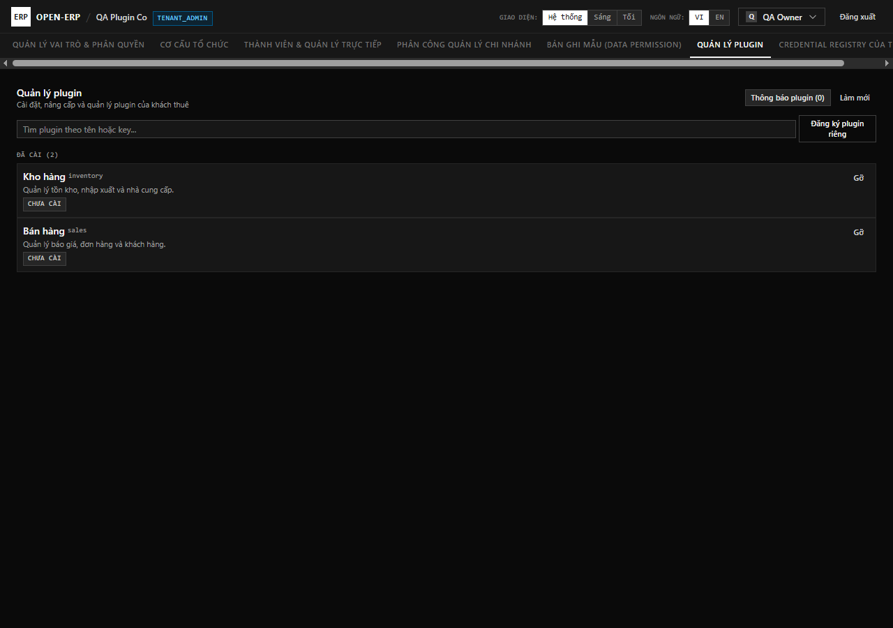
*[Ảnh 1] Màn **Quản lý plugin** — tiêu đề “Cài đặt, nâng cấp và quản lý plugin của khách thuê”, ô tìm kiếm, nút **Làm mới**, **Thông báo plugin (0)** và **Đăng ký plugin riêng** ở góc phải (ảnh chụp giai đoạn đầu đợt QA; xem Ảnh 2 cho cách nhóm đã hoàn thiện).*

### Bước 2: Đọc danh sách theo 3 nhóm
Danh sách được chia 3 nhóm rõ ràng:

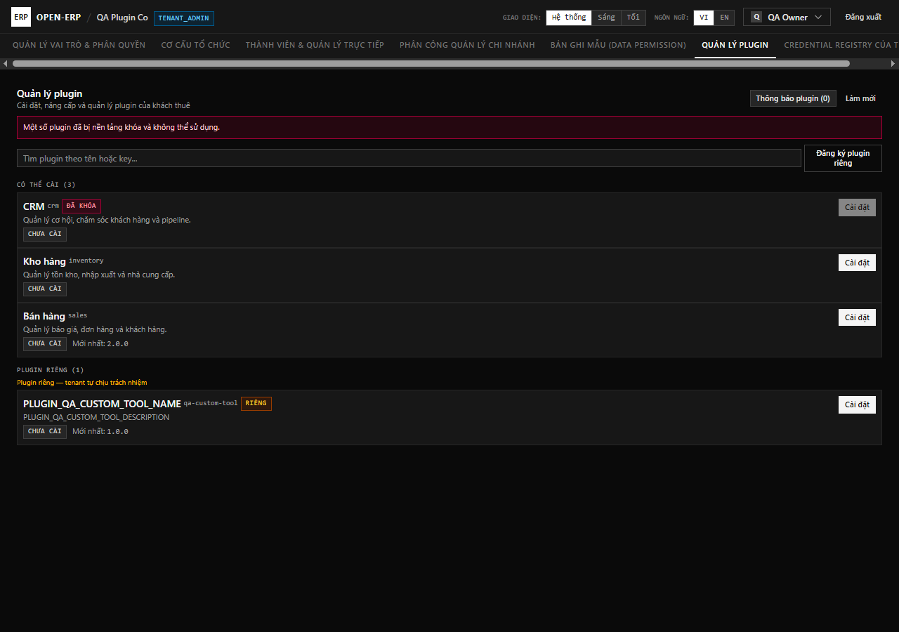
*[Ảnh 2] **ĐÃ CÀI** (có nút Bật/Tắt, Gỡ, Chi tiết) • **CÓ THỂ CÀI** (nút **Cài đặt**) • **PLUGIN RIÊNG** (nhãn “Plugin riêng — tenant tự chịu trách nhiệm”).*

- Plugin bị nền tảng khóa hiện **badge “ĐÃ KHÓA”** màu đỏ và **mọi nút hành động bị vô hiệu**; banner đỏ “Một số plugin đã bị nền tảng khóa và không thể sử dụng.” hiện trên đầu trang (xem Ảnh 3).

### Bước 3: Tìm kiếm
1. Gõ từ khóa vào ô **“Tìm plugin theo tên hoặc key…”** rồi bấm chuột ra ngoài/nhấn Enter.
2. Danh sách lọc ngay; nút **Xóa tìm kiếm** xuất hiện bên cạnh.

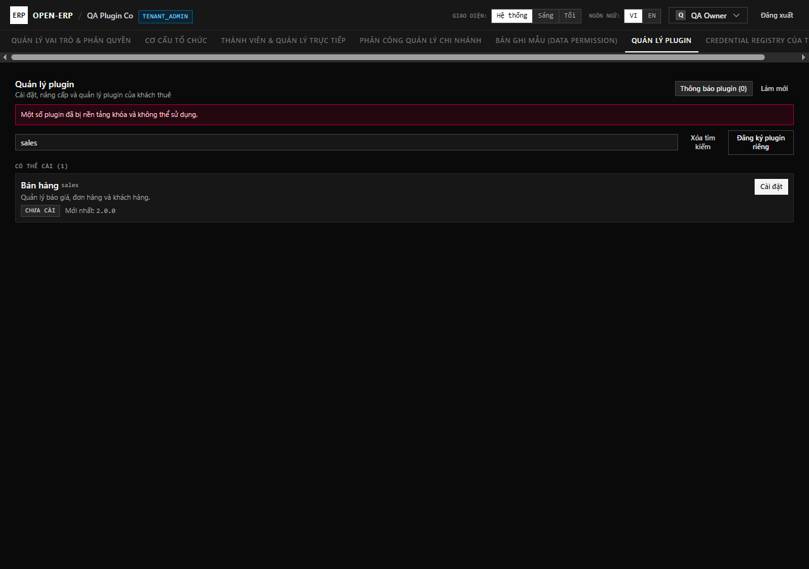
*[Ảnh 3] Kết quả lọc theo từ khóa `sales` (4 thẻ → 1 thẻ); plugin bị khóa vẫn hiển thị badge “ĐÃ KHÓA” nhưng không cài được.*

---

## 4. Tenant Admin: Cài đặt plugin

1. Ở nhóm **CÓ THỂ CÀI**, bấm nút **Cài đặt** trên thẻ plugin.
2. Hệ thống mở panel tiến trình **Cài đặt plugin** và chạy lần lượt các bước:

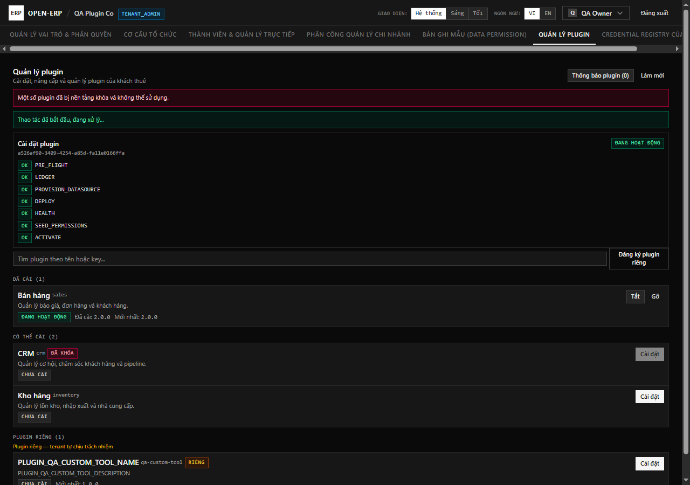
*[Ảnh 4] Tiến trình cài đặt từng bước, mỗi bước có trạng thái OK; phần trên hiển thị `operation_id` và trạng thái tổng.*

3. Khi hoàn tất, plugin chuyển sang nhóm **ĐÃ CÀI** với badge **ĐANG HOẠT ĐỘNG** và các nút **Tắt / Gỡ**; thông báo xanh “Thao tác đã bắt đầu, đang xử lý…” xuất hiện.

*[Ảnh 5] Plugin `Bán hàng` đã vào nhóm Đã cài (Đang hoạt động, “Đã cài: 2.0.0 • Mới nhất: 2.0.0”).*

> **Lưu ý**: nút hành động tự chuyển sang trạng thái disabled trong lúc job chạy; không bấm lặp lại.

---

## 5. Tenant Admin: Chi tiết & phiên bản

1. Trên thẻ plugin đã cài, bấm **Chi tiết**.
2. Drawer **CHI TIẾT PLUGIN** trượt từ cạnh phải, hiển thị mô tả, danh sách **PHIÊN BẢN** cùng trạng thái và dải tương thích Core.

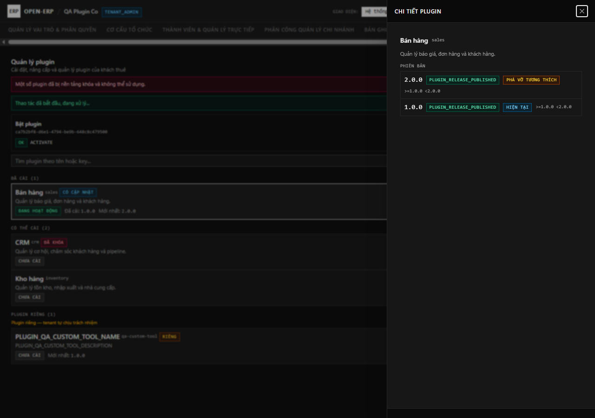
*[Ảnh 6] Drawer Chi tiết plugin: phiên bản `2.0.0` nhãn “PHÁ VỠ TƯƠNG THÍCH”, phiên bản `1.0.0` nhãn “HIỆN TẠI”. Drawer hỗ trợ deep-link và giữ nguyên khi F5.*

- Với plugin riêng, Drawer Chi tiết có thêm nút **Quản lý phiên bản** và **Xóa plugin riêng** (xem Mục 8).

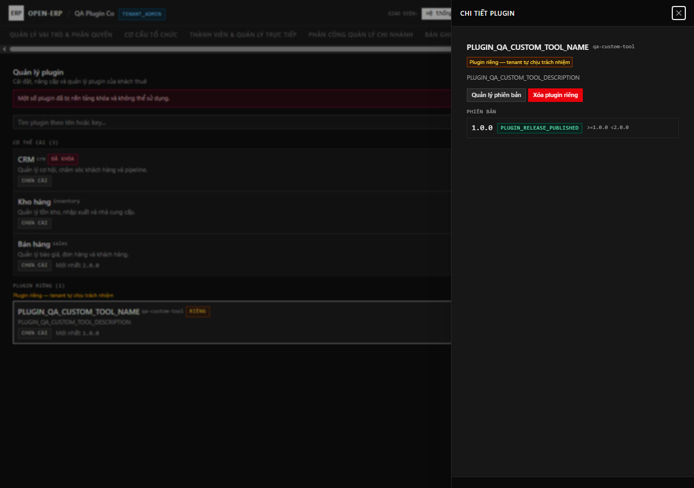
*[Ảnh 7] Drawer Chi tiết của plugin riêng `qa-custom-tool`, mở trực tiếp bằng deep-link.*

---

## 6. Tenant Admin: Nâng cấp & Khôi phục

> **Khôi phục (Rollback)** là thao tác dành cho nhân viên hỗ trợ nền tảng (mục 10.3) — Tenant Admin thực hiện **Nâng cấp**.

### Bước 1: Mở Drawer nâng cấp
1. Trên plugin có cập nhật (badge **CÓ CẬP NHẬT**), bấm **Nâng cấp**.
2. Drawer **NÂNG CẤP PLUGIN** mở ra, yêu cầu chọn **Phiên bản đích**.

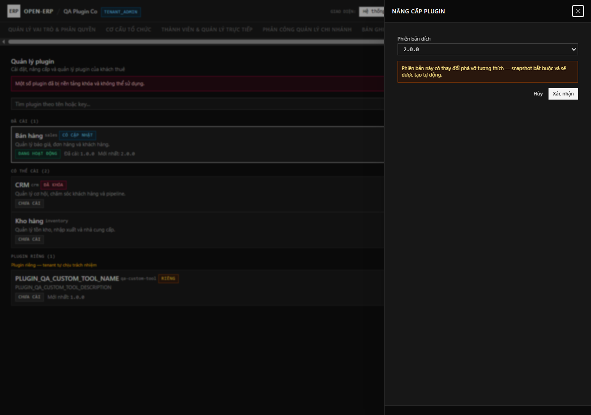
*[Ảnh 8] Drawer Nâng cấp: chọn phiên bản đích và cảnh báo vàng.*

- Nếu phiên bản đích có thay đổi **phá vỡ tương thích (BREAKING)**: hiển thị cảnh báo *“Phiên bản này có thay đổi phá vỡ tương thích — snapshot bắt buộc và sẽ được tạo tự động.”* Hệ thống **tự tạo snapshot dữ liệu** trước khi nâng cấp.

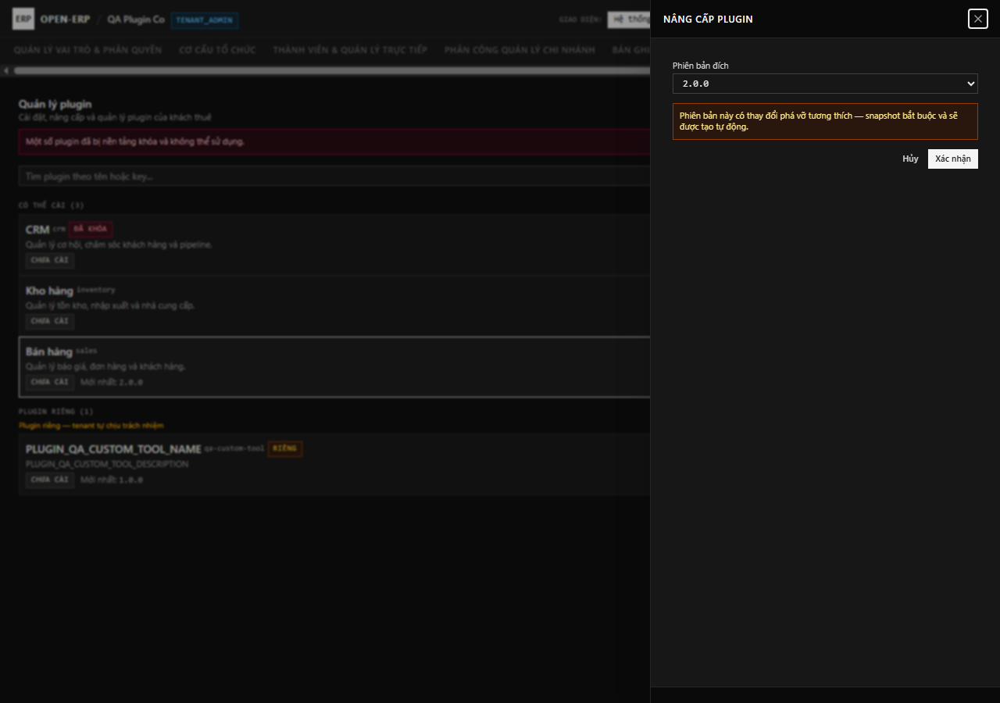
*[Ảnh 9] Cùng Drawer nâng cấp được mở trực tiếp bằng deep-link (trạng thái URL lưu trong path).*

### Bước 2: Xác nhận
Bấm **Xác nhận** (hoặc **Hủy** để đóng). Thao tác nâng cấp chạy qua cùng chuỗi bước như cài đặt và ghi audit.

> Nâng cấp thường (COMPATIBLE) không bắt buộc snapshot; nếu phiên bản đích bị khóa (`release_status = BLOCKED`), phiên bản đó **không xuất hiện** trong danh sách chọn.

---

## 7. Tenant Admin: Bật/Tắt & Gỡ plugin (giữ dữ liệu)

### 7.1. Tắt / Bật
Trên thẻ plugin ở nhóm **ĐÃ CÀI**, bấm **Tắt** để tạm ngưng (badge **TẠM DỪNG**) hoặc **Bật** để kích hoạt lại.

### 7.2. Gỡ plugin
1. Bấm **Gỡ** trên thẻ plugin.
2. Drawer **GỠ PLUGIN** hiện cảnh báo giữ dữ liệu và yêu cầu xác nhận.

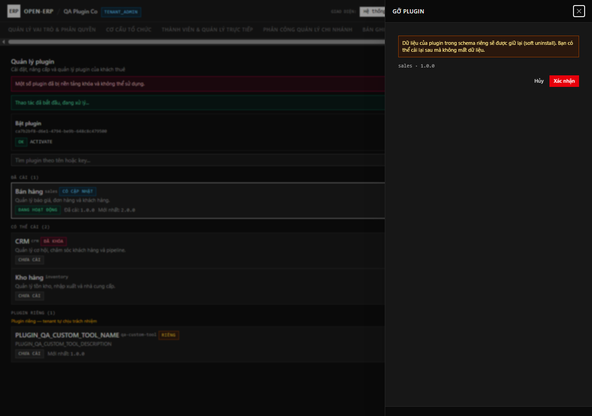
*[Ảnh 10] Drawer Gỡ plugin: “Dữ liệu của plugin trong schema riêng sẽ được giữ lại (soft uninstall). Bạn có thể cài lại sau mà không mất dữ liệu.” + tên và phiên bản plugin.*

3. Bấm **Xác nhận** (nút đỏ) để gỡ. Plugin chuyển về nhóm **CÓ THỂ CÀI** và có thể **Cài đặt** lại.

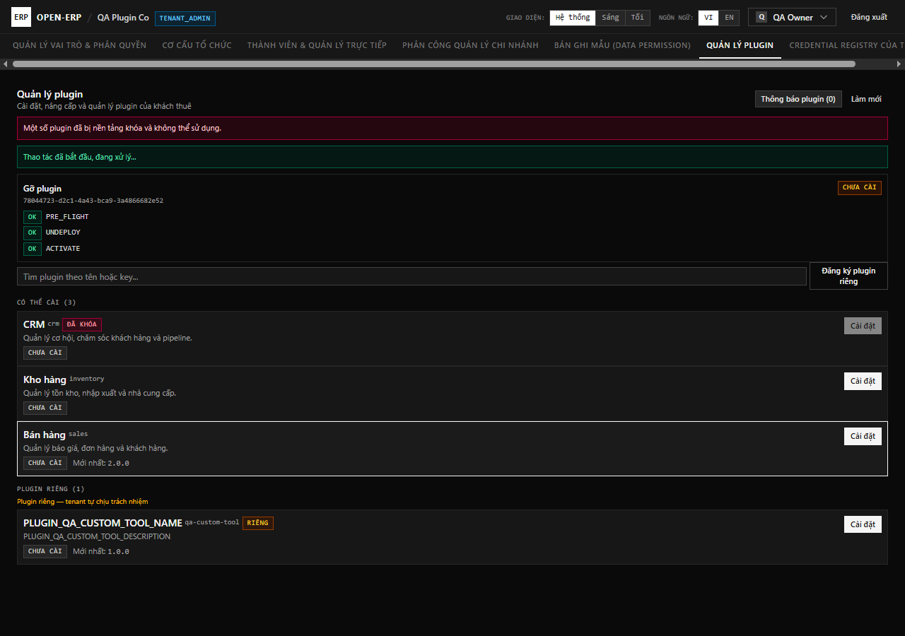
*[Ảnh 11] Plugin `Bán hàng` trở lại nhóm Có thể cài với nút **Cài đặt**; tiến trình gỡ (PRE_FLIGHT → UNDEPLOY → ACTIVATE) hoàn tất.*

> **Dữ liệu được giữ nguyên**: schema riêng của tenant (ví dụ `tenant_<id>_sales`) **vẫn tồn tại** sau khi gỡ; cài lại không mất dữ liệu.

---

## 8. Tenant Admin: Plugin riêng của tôi

> Chỉ hiển thị khi nền tảng đã bật **`allow_custom_plugins = true`** cho khách thuê. Nếu chưa: thông báo *“Khách thuê chưa được bật tính năng plugin riêng. Vui lòng liên hệ nền tảng.”*

### Bước 1: Đăng ký plugin riêng
1. Bấm **Đăng ký plugin riêng** (góc phải trên).
2. Trong Drawer **ĐĂNG KÝ PLUGIN RIÊNG**, chọn 1 trong 3 kênh nguồn: **Docker Hub** • **Registry của tôi** • **Tải tệp lên**.
3. Điền thông tin: plugin key, tên/mô tả (i18n key), phiên bản, image ref/repository, credential registry (tùy chọn).
4. Xác nhận để tạo bản ghi ở trạng thái **Nháp (DRAFT)**.

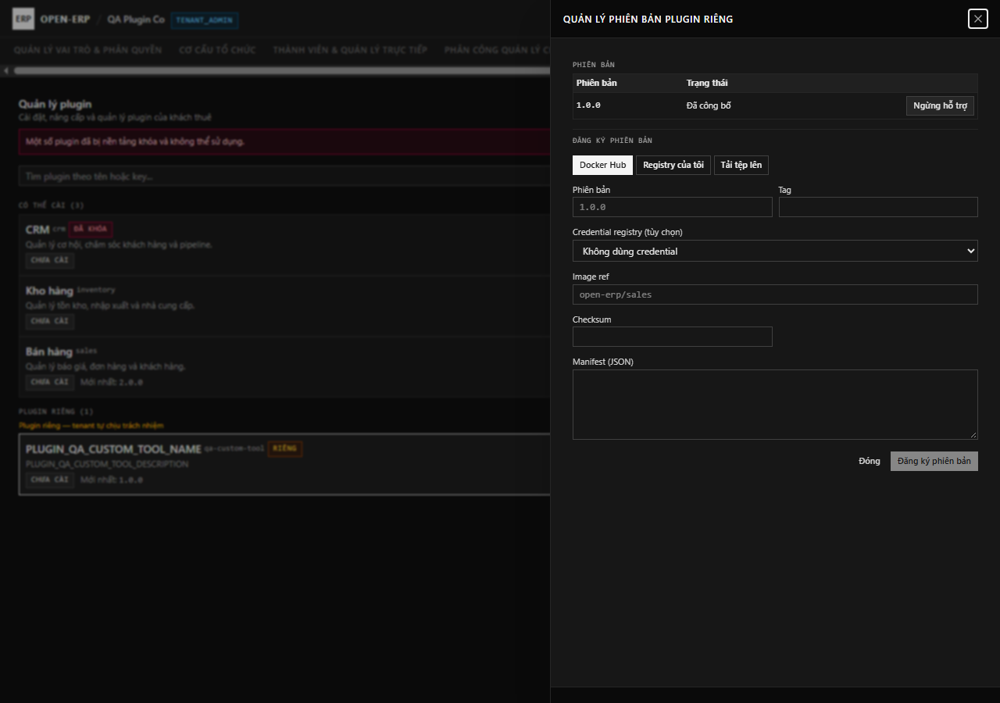
*[Ảnh 12] Drawer **QUẢN LÝ PHIÊN BẢN PLUGIN RIÊNG**: danh sách phiên bản hiện có, khu **ĐĂNG KÝ PHIÊN BẢN** với 3 tab nguồn, chọn **Credential registry (tùy chọn)**, image ref, checksum, manifest (JSON).*

### Bước 2: Quản lý phiên bản
Trên plugin riêng, bấm **Chi tiết → Quản lý phiên bản**:
- **Đăng ký phiên bản** mới (như trên).
- **Công bố** (PUBLISHED) / **Ngừng hỗ trợ** (DEPRECATED) một phiên bản.
- **Gỡ** phiên bản chưa dùng (bị chặn nếu đang được cài).
- **Xóa plugin riêng** khi không còn phiên bản đang dùng.

> Plugin riêng mang nhãn **“Plugin riêng — tenant tự chịu trách nhiệm”**. Nền tảng vẫn **giám sát và có thể khóa khẩn cấp** (mục 11).

---

## 9. Credential Registry (Tenant & Nền tảng)

### 9.1. Tenant
Menu **CREDENTIAL REGISTRY CỦA TENANT** (`/settings/plugin-credentials`) — dùng để kéo image/manifest cho plugin riêng.

*[Ảnh 13] Màn Credential Registry của Tenant: nút **Thêm credential**, **Tải lại**; trạng thái rỗng hiển thị “Chưa có credential nào.”*

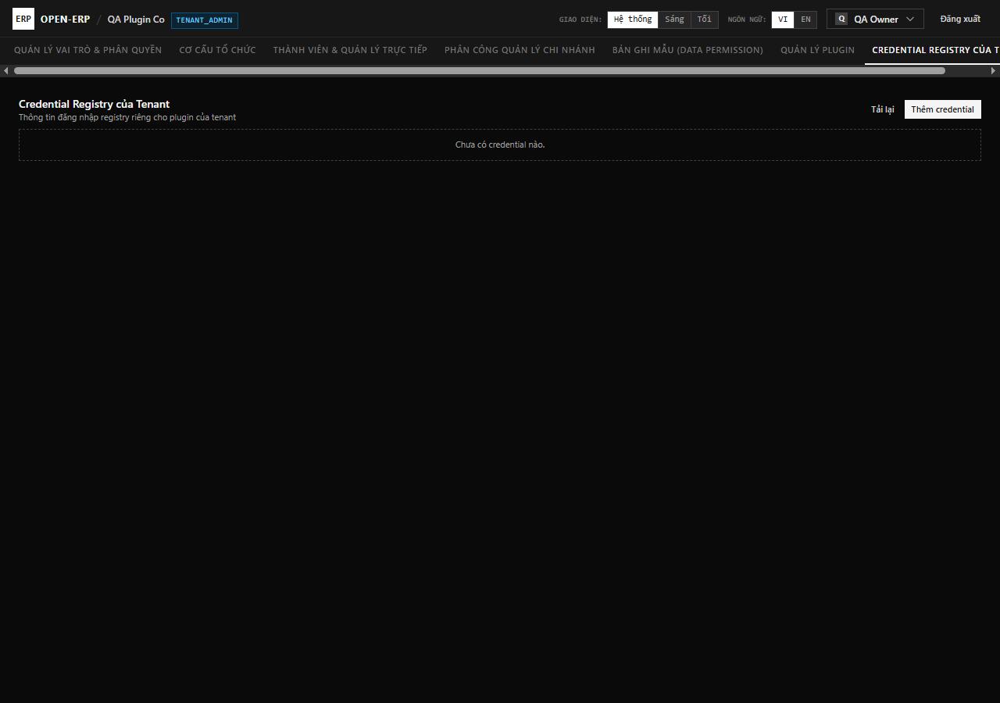
*[Ảnh 14] Cùng màn hình sau khi thao tác — credential được thêm/xóa, danh sách cập nhật tức thì.*

- Drawer thêm/sửa credential gồm: **Tên credential**, **Registry host**, **Tên đăng nhập**, **Mật khẩu/token**, và nút **Kiểm tra kết nối**.
- **Secret không bao giờ hiển thị lại**; khi xóa, nếu credential đang được dùng sẽ báo `PLUGIN_CREDENTIAL_IN_USE`.

### 9.2. Nền tảng
Menu **CREDENTIAL REGISTRY (NỀN TẢNG)** (`/platform/plugin-credentials`) — credential dùng chung cho danh mục.

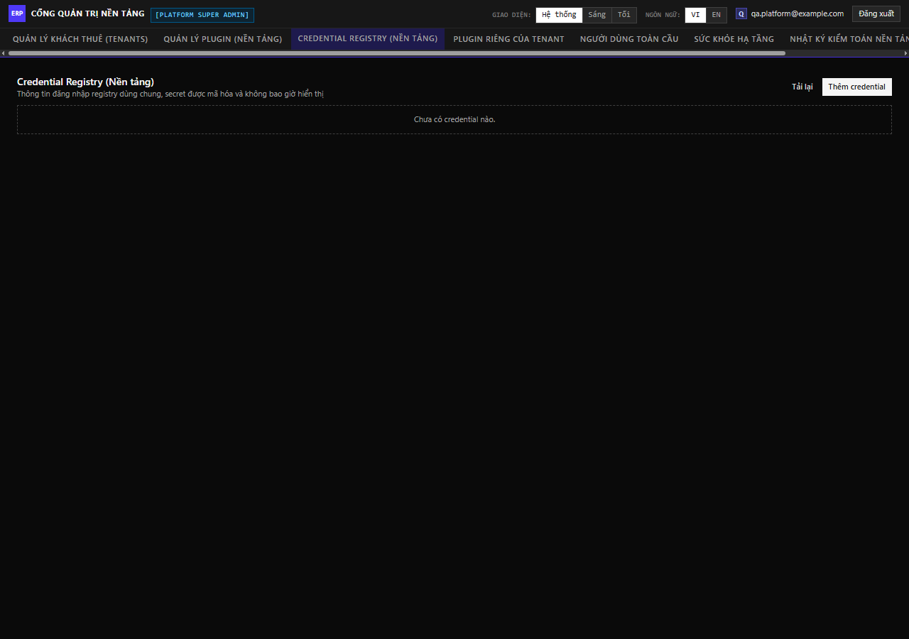
*[Ảnh 15] Credential Registry (Nền tảng): “Thông tin đăng nhập registry dùng chung, secret được mã hóa và không bao giờ hiển thị.”*

---

## 10. Platform Super Admin: Danh mục plugin

Truy cập **QUẢN LÝ PLUGIN (NỀN TẢNG)** (`/platform/plugins`). Giao diện **Split-Screen**: cột trái danh mục, cột phải chi tiết.

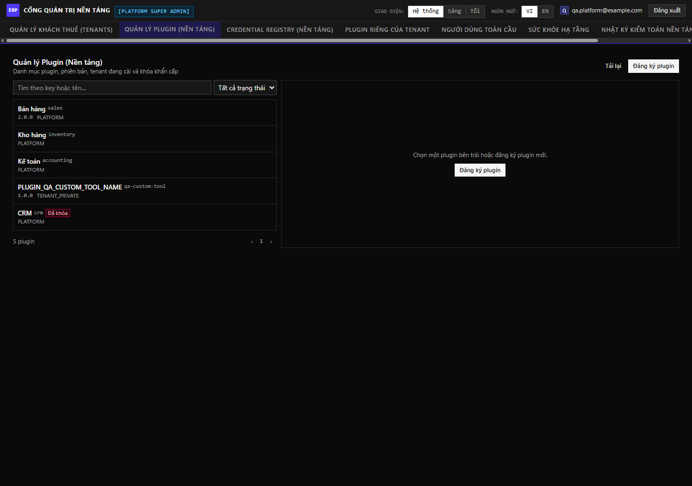
*[Ảnh 16] Cột trái: tìm kiếm + lọc trạng thái, danh sách plugin (key • phiên bản • badge “Đã khóa”) và nhóm **PLUGIN RIÊNG CỦA TENANT**. Cột phải: empty state “Chọn một plugin bên trái hoặc đăng ký plugin mới.” Toolbar có **Tải lại** và **Đăng ký plugin**.*

- Nút **Đăng ký plugin** mở Drawer 3 kênh (Docker Hub / Image Registry / Tải tệp lên) với 3 bước: Nguồn → Thông tin (+ **Kiểm tra kết nối**) → Xem trước & Xác nhận (bản ghi `DRAFT`).
- Cột trái còn có mục **“Hệ thống lõi”** (danh sách Core modules, chỉ đọc, tách khỏi danh mục plugin).

### 10.1. Chi tiết plugin (cột phải)
Chọn một plugin để xem nhanh metadata, phiên bản, tenant đang cài và hành động.

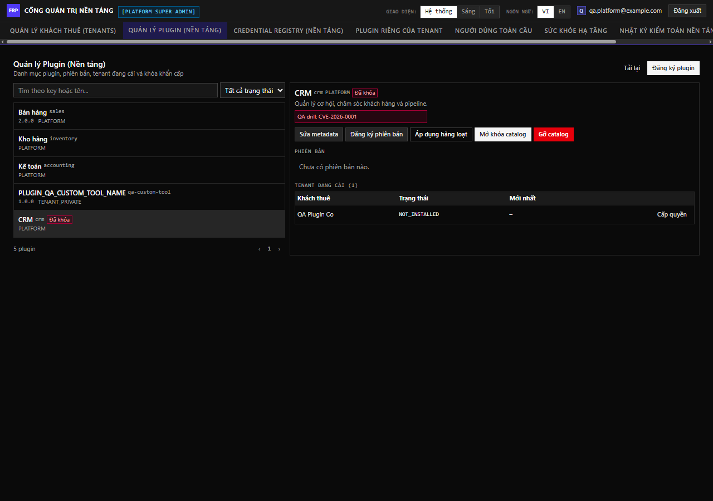
*[Ảnh 17] Panel chi tiết: metadata, lý do khóa (`QA drill CVE-2026-0001`), các nút **Sửa metadata**, **Đăng ký phiên bản**, **Áp dụng hàng loạt**, **Mở khóa catalog**, **Gỡ catalog**; bảng **TENANT ĐANG CÀI** kèm nút **Cấp quyền**.*

### 10.2. Phiên bản (Timeline)
- Mở khu **Phiên bản** để xem timeline; mỗi dòng có SemVer, trạng thái, ngày/người đăng ký, nguồn, checksum và hành động **Công bố / Ngừng hỗ trợ / Khóa / Gỡ artifact**.

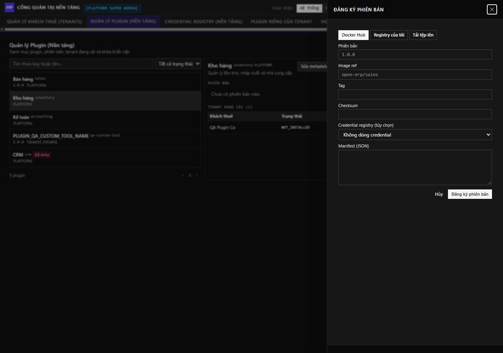
*[Ảnh 18] Drawer **ĐĂNG KÝ PHIÊN BẢN**: 3 tab nguồn, chọn **Credential registry (tùy chọn)**, phiên bản, image ref, tag, checksum, manifest (JSON).*

> Phân biệt rõ: **Mở khóa catalog** (P25) đưa cả plugin về trạng thái dùng được, khác **Mở khóa phiên bản** (P26) chỉ chuyển một version sang PUBLISHED và **không tự cài lại**.

### 10.3. Hỗ trợ tenant (Cài/Gỡ/Bật-Tắt/Nâng cấp/Khôi phục)
Trong panel chi tiết, bảng **TENANT ĐANG CÀI** có nút **Hỗ trợ** cho từng tenant → thực hiện Cài/Gỡ/Bật-Tắt/Nâng cấp/**Khôi phục**. Thao tác bắt buộc nhập **Lý do**, có audit + `operation_id`.

### 10.4. Khóa khẩn cấp plugin
Bấm **Khóa khẩn cấp** để mở Drawer P7:
- Hiển thị **danh sách tenant bị ảnh hưởng** (preview), nhập **Lý do (bắt buộc)**, gõ lại `plugin_key` để xác nhận, tùy chọn **Cưỡng chế gỡ ngay**.
- Sau khi khóa: màn hình tiến trình từng tenant + nút **Gửi lại thông báo**. Plugin chuyển badge **“Đã khóa”** ở cả nền tảng lẫn Marketplace tenant.

---

## 11. Platform: Giám sát Plugin riêng của Tenant

Menu **PLUGIN RIÊNG CỦA TENANT** (`/platform/tenant-private-plugins`).

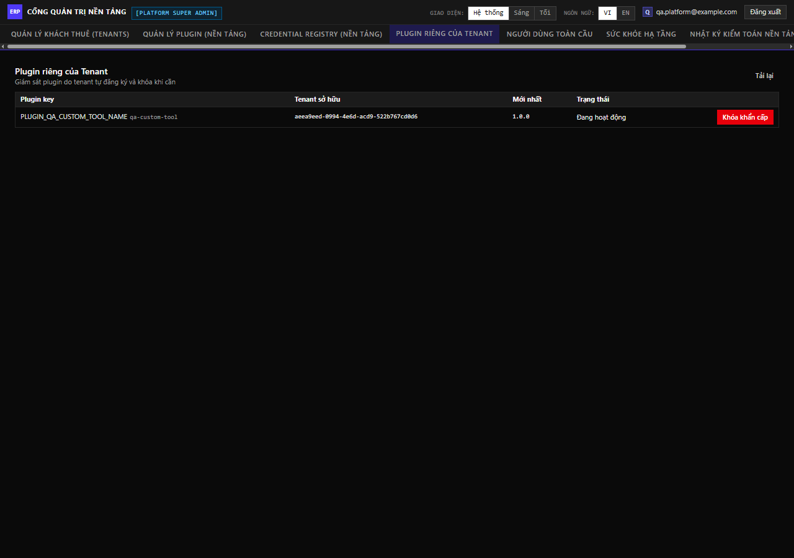
*[Ảnh 19] Bảng dense: Plugin key • Tenant sở hữu • Mới nhất • Trạng thái + nút **Khóa khẩn cấp**.*

- **SUPER_ADMIN**: thấy nút **Khóa khẩn cấp**. **SUPPORT_ENGINEER**: chỉ xem, **không** thấy nút khóa (read-only).

---

## 12. End-user: Plugin Host (màn hình do plugin nhúng)

- Khi plugin được cài và hoạt động, Core tự đăng ký route động `/apps/:pluginKey/*` từ UI Manifest; người dùng mở màn hình plugin như màn hình bình thường (giữ nguyên TopBar/NavBar của Core).
- Nội dung render theo `render_mode`: **MF** (Module Federation, mặc định) • **WC** (Web Component / Shadow DOM) • **iframe** (cách ly).
- Trong lúc tải: hiển thị skeleton. Nếu contribution lỗi: khối **“Không thể hiển thị plugin này”** kèm mã lỗi i18n, **không làm hỏng** phần còn lại của màn hình.
- Nếu plugin `TẠM DỪNG`/`ĐÃ GỠ`: không render; người dùng được điều hướng về Marketplace; banner cảnh báo hiện khi đang trong màn plugin.
- Với slot do plugin khác làm host, component phải khớp `host.installed_version` + `host.contract_version`; lệch → không render + log cảnh báo.

---

## 13. Sử dụng trên Mobile (chỉ đọc)

Ứng dụng Ionic 8 (local: `http://localhost:8100`) chỉ **hiển thị trạng thái plugin**, không có hành động ghi.

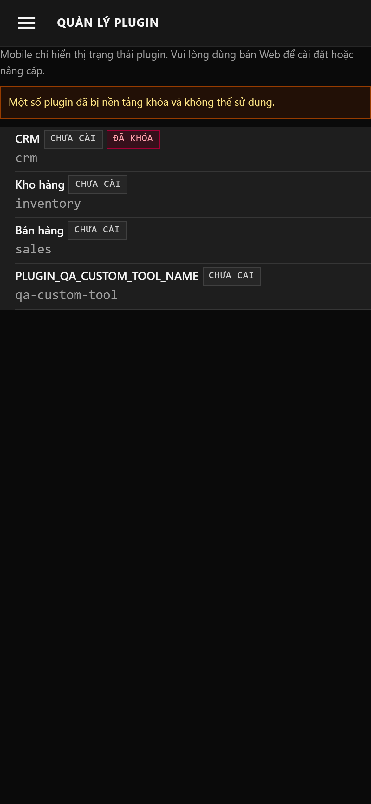
*[Ảnh 20] Màn **QUẢN LÝ PLUGIN** (390×844): ghi chú “Mobile chỉ hiển thị trạng thái plugin. Vui lòng dùng bản Web để cài đặt hoặc nâng cấp.”, banner khóa màu amber và các thẻ plugin (badge “CHƯA CÀI”, “ĐÃ KHÓA”), overflow = 0.*

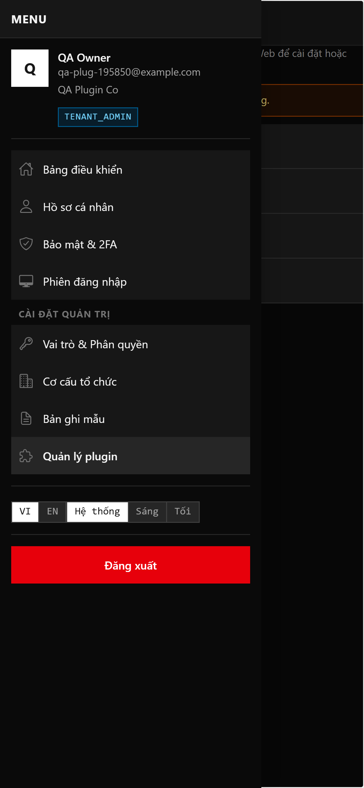
*[Ảnh 21] Menu Mobile: mục **Quản lý plugin** trong nhóm “CÀI ĐẶT QUẢN TRỊ”, touch target ≥ 40px.*

> **Giới hạn trên Mobile**: không cài/nâng cấp/bật-tắt/gỡ plugin, không quản lý credential; các thao tác này chỉ có trên Web Desktop.

---

## 14. Lưu ý nghiệp vụ quan trọng

1. **Gỡ plugin không mất dữ liệu**: đây là *soft uninstall* — schema riêng của tenant được giữ nguyên; cài lại tiếp tục dùng dữ liệu cũ.
2. **Nâng cấp BREAKING bắt buộc snapshot**: hệ thống tự tạo snapshot trước khi nâng cấp; nếu thiếu điều kiện snapshot, API trả `PLUGIN_SNAPSHOT_REQUIRED`.
3. **Plugin bị khóa (BLOCKED) thì mọi hành động bị vô hiệu**: cài mới, nâng cấp, bật đều bị chặn; Marketplace hiện badge **“Đã khóa”**. Version bị khóa không xuất hiện trong danh sách chọn phiên bản. Chỉ SUPER_ADMIN **Mở khóa catalog**.
4. **Cô lập dữ liệu tenant**: thao tác plugin luôn lấy `tenant_id` từ phiên đăng nhập (SecurityContext), **không nhận từ client**; artifact tải lên gắn prefix tenant và chặn truy cập chéo (`PLUGIN_ARTIFACT_NOT_OWNED`).
5. **Secret không bao giờ hiển thị**: credential chỉ hiện tên/host/username che `••••`; token iframe có scope tenant×plugin và ngắn hạn.
6. **Thao tác nền tảng phải nêu lý do**: Cài/Gỡ/Bật-Tắt/Nâng cấp/Khôi phục và Khóa khẩn cấp đều bắt buộc `reason` + được ghi audit kèm `operation_id`.

---

## 15. Câu hỏi thường gặp / Xử lý sự cố

| Vấn đề gặp phải | Nguyên nhân | Cách khắc phục |
| :--- | :--- | :--- |
| Plugin hiện badge **“ĐÃ KHÓA”**, không bấm Cài đặt được | Plugin bị nền tảng khóa (`catalog_status = BLOCKED`) | Liên hệ nền tảng; chỉ SUPER_ADMIN **Mở khóa catalog** mới dùng lại được. |
| Plugin chưa cài lại bị xếp nhầm vào nhóm “Đã cài” | Lỗi đã sửa (BUG-104: phân nhóm theo trạng thái thực) | Nâng cấp Web lên bản có bản vá; tải lại màn hình. |
| Plugin riêng chưa đăng ký ledger bị ẩn khỏi Marketplace | Lỗi đã sửa (BUG-105: bổ sung pass TENANT_PRIVATE) | Nâng cấp Web lên bản có bản vá. |
| Không thấy plugin bị khóa trong Marketplace | Lỗi đã sửa (BUG-106: giữ item BLOCKED kèm badge) | Nâng cấp Web lên bản có bản vá. |
| Tenant báo 403 khi dùng tính năng plugin | Thiếu seed quyền `core:plugin:*` (BUG-102) | Áp dụng migration `V3.0.3` (đã có) hoặc gán lại vai trò TENANT_OWNER/TENANT_ADMIN. |
| Cột “Khách thuê” ở bảng cài đặt hiển thị UUID thay vì tên | Lỗi đã sửa (BUG-107: mapping snake_case) | Nâng cấp bản có bản vá. |
| Ô tìm kiếm nhập mà danh sách không lọc | Lỗi đã sửa (BUG-108/2e: `q` từ khóa tham gia vào `listKey`) | Nâng cấp Web; nhấn Enter/Áp dụng sau khi nhập. |
| Deep-link/`F5` mất Drawer hoặc mất bộ lọc | Đã khắc phục bằng **route-state path-segment** | Dùng URL dạng `/:filter/:sort/:pageSize/:page/:id/:mode`. |
| Backend không khởi động khi cấu hình `registry-allowed-hosts` để trống | Lỗi đã sửa (BUG-103: `Optional<String>`) | Cập nhật cấu hình/bản vá; không để dòng rỗng. |
| Screen MF/WC trắng và gateway trả 401 | Lỗi đã sửa (BUG-95: token cho asset plugin) | Nâng cấp bản có bản vá. |

---

## 16. Giới hạn đã biết

1. **Chuông thông báo TopBar + banner toàn cục + banner Dashboard Mobile** chưa hoàn thiện (BUG-98, Medium, **hoãn sang Sprint 04**; hiện có nút “Thông báo plugin (0)” và banner trong màn Marketplace làm workaround).
2. **Lý do hành động nền tảng** còn một số chỗ hardcode và chưa đối chiếu đầy đủ `affected_tenants` (BUG-99, Low → Sprint 04).
3. **Warning `NG01354`** (ngModel trong child component) chưa xử lý (BUG-110, Low → Sprint 04).
4. **Dùng credential để pull manifest/digest (OCI token auth)** vẫn đang hoàn thiện (`TASK-331`) — cần hạ tầng registry thật để nghiệm thu.
5. **CLI `publish`** chưa có (`TASK-347`, → Sprint 04).
6. **Job phục hồi thao tác** và **phát hiện chu trình dependency** chưa có (`TASK-346`, → Sprint 04).

---

*Tài liệu liên quan: [Đặc tả UI Plugin Manager (DES-03-UI)](../sprints/sprint_03_plugin_manager/06_designs/ui_ux/PLUGIN_MANAGER_UI_SPEC.md) • [Báo cáo QA Sprint 03 (QA-01)](../sprints/sprint_03_plugin_manager/08_testing/QA-01_sprint_03_test_report.md) • [Hướng dẫn Sprint 02](sprint_02_superadmin_rbac_user_guide.md).*
