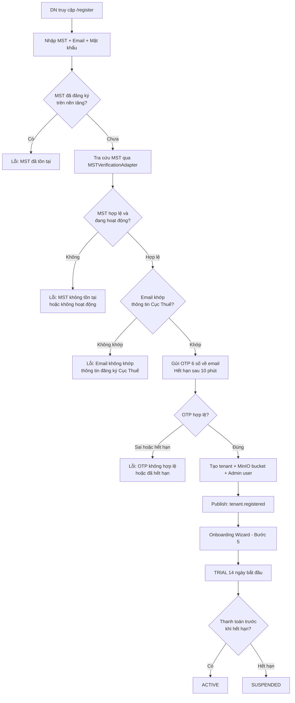

# SaaS Multi-Tenancy Design — Open ERP

**Phiên bản:** 1.1  
**Ngày tạo:** 09/05/2026  
**Ngày cập nhật:** 09/05/2026  
**Tác giả:** Technical Leader  
**Trạng thái:** Hoàn chỉnh

---

## Mục lục

1. [Chiến lược Multi-Tenancy](#1-chiến-lược-multi-tenancy)
2. [Tenant Isolation ở tầng Data](#2-tenant-isolation-ở-tầng-data)
3. [TenantMiddleware — Trích xuất tenantId](#3-tenantmiddleware--trích-xuất-tenantid)
4. [TenantGuard — Xác thực trạng thái tenant](#4-tenantguard--xác-thực-trạng-thái-tenant)
5. [Tenant Onboarding Flow](#5-tenant-onboarding-flow)
6. [Subscription Tiers](#6-subscription-tiers)
7. [Quota Enforcement](#7-quota-enforcement)
8. [Tenant Lifecycle Management](#8-tenant-lifecycle-management)
9. [Security Boundaries](#9-security-boundaries)

---

## 1. Chiến lược Multi-Tenancy

### 1.1 Chiến lược đã chọn: Shared Database — Logical Isolation (tenantId)

Open ERP áp dụng mô hình **Shared Database, Shared Schema** với **Logical Isolation** qua `tenantId`.

| Tiêu chí                | Shared DB (đã chọn)                 | Separate DB per Tenant |
| ----------------------- | ----------------------------------- | ---------------------- |
| Chi phí vận hành        | Thấp — 1 cluster MongoDB            | Cao — N clusters       |
| Độ phức tạp deploy      | Thấp                                | Cao                    |
| Isolation mức độ        | Logic (tenantId filter)             | Vật lý                 |
| Khả năng migrate schema | Dễ — cùng schema                    | Phức tạp               |
| Phù hợp giai đoạn       | Early-stage SaaS (< 10.000 tenants) | Enterprise SaaS lớn    |

**Kế hoạch nâng cấp:** Khi vượt 10.000 tenants hoặc có yêu cầu data residency, chuyển sang hybrid model (dedicated DB cho enterprise tenants).

### 1.2 Định danh Tenant

| Định danh   | Kiểu                    | Ví dụ                      | Mục đích                                   |
| ----------- | ----------------------- | -------------------------- | ------------------------------------------ |
| `tenantId`  | `ObjectId` (MongoDB)    | `6645a2b3c4d5e6f7a8b9c0d1` | Primary key trong mọi collection nghiệp vụ |
| `subdomain` | `string`                | `acme-corp`                | URL access: `acme-corp.openErp.vn`         |
| `apiKey`    | `string` (SHA-256 hash) | `oek_...`                  | External system integration                |

---

## 2. Tenant Isolation ở tầng Data

### 2.1 Quy tắc bắt buộc

- **Mọi collection nghiệp vụ** đều có trường `tenantId: ObjectId` (bắt buộc, indexed).
- **Mọi MongoDB query** đều phải có `{ tenantId: req.tenantId }` trong filter.
- **Compound index bắt buộc:** `{ tenantId: 1, <field_khác>: 1 }` cho mọi query pattern.
- **Không được** join/lookup cross-tenant trong bất kỳ trường hợp nào.

### 2.2 Ví dụ Data Isolation

```typescript
// ✅ ĐÚNG — luôn filter theo tenantId
async findAllOrders(tenantId: string) {
  return this.orderModel.find({ tenantId }).exec();
}

// ❌ SAI — query không có tenantId filter (data leak!)
async findAllOrders() {
  return this.orderModel.find({}).exec();
}
```

### 2.3 MinIO Storage Isolation

```
Mỗi tenant có bucket riêng:
  Bucket name: tenant-{tenantId}
  Ví dụ:       tenant-6645a2b3c4d5e6f7a8b9c0d1/
                  ├── documents/
                  ├── avatars/
                  ├── attachments/
                  └── invoices/
```

---

## 3. TenantMiddleware — Trích xuất tenantId

### 3.1 Mô tả

`TenantMiddleware` chạy ở **api-gateway** trước tất cả route handlers. Nhiệm vụ: extract `tenantId` từ JWT token hoặc subdomain, sau đó inject vào `request` object.

### 3.2 Thứ tự ưu tiên trích xuất

```
1. JWT payload field: jwt.tenantId  (ưu tiên cao nhất)
2. Request header: X-Tenant-ID
3. Subdomain:  acme-corp.openErp.vn → tenantId của 'acme-corp'
4. Từ chối request nếu không xác định được tenantId
```

### 3.3 Pseudocode TenantMiddleware

```typescript
@Injectable()
export class TenantMiddleware implements NestMiddleware {
  constructor(private tenantService: TenantService) {}

  async use(req: Request, res: Response, next: NextFunction) {
    // 1. Thử lấy từ JWT
    let tenantId = extractTenantFromJwt(req.headers.authorization);

    // 2. Thử lấy từ header
    if (!tenantId) {
      tenantId = req.headers["x-tenant-id"] as string;
    }

    // 3. Thử lấy từ subdomain
    if (!tenantId) {
      const subdomain = extractSubdomain(req.hostname); // acme-corp.openErp.vn
      if (subdomain) {
        const tenant = await this.tenantService.findBySubdomain(subdomain);
        tenantId = tenant?._id?.toString();
      }
    }

    // 4. Từ chối nếu không xác định được
    if (!tenantId) {
      throw new UnauthorizedException("Không xác định được tenant");
    }

    req["tenantId"] = tenantId;
    next();
  }
}
```

---

## 4. TenantGuard — Xác thực trạng thái tenant

### 4.1 Mô tả

`TenantGuard` kiểm tra trạng thái tenant sau khi `TenantMiddleware` đã extract `tenantId`. Chặn request nếu tenant đang bị SUSPENDED hoặc TERMINATED.

### 4.2 Pseudocode TenantGuard

```typescript
@Injectable()
export class TenantGuard implements CanActivate {
  constructor(
    private tenantService: TenantService,
    private redisService: RedisService,
  ) {}

  async canActivate(context: ExecutionContext): Promise<boolean> {
    const request = context.switchToHttp().getRequest();
    const tenantId = request["tenantId"];

    // Kiểm tra cache trước (TTL: 60 giây)
    const cached = await this.redisService.get(`tenant:status:${tenantId}`);
    const status = cached ?? (await this.tenantService.getStatus(tenantId));

    if (!cached) {
      await this.redisService.set(`tenant:status:${tenantId}`, status, 60);
    }

    if (status === "SUSPENDED") {
      throw new ForbiddenException("Tài khoản doanh nghiệp đã bị tạm ngưng");
    }
    if (status === "TERMINATED") {
      throw new ForbiddenException("Tài khoản doanh nghiệp đã bị hủy");
    }
    if (status === "PENDING_SETUP") {
      // Chỉ cho phép truy cập onboarding endpoints
      if (!request.path.startsWith("/api/v1/onboarding")) {
        throw new ForbiddenException("Vui lòng hoàn tất thiết lập tài khoản");
      }
    }

    return true;
  }
}
```

---

## 5. Tenant Onboarding Flow

### 5.1 Mô tả tổng quát

Kể từ phiên bản 1.1, Tenant **không còn được tạo thủ công bởi Super Admin**. Doanh nghiệp tự đăng ký và được xác thực danh tính qua **Mã số thuế (MST)** và **email đã đăng ký với Cục Thuế**.

> **Ghi chú — MST Verification Adapter:** Việc tra cứu và xác thực MST sử dụng **Adapter Pattern**, cho phép dễ dàng chuyển đổi giữa các nguồn dữ liệu. Adapter mặc định tích hợp với **masothue.com** hoặc **API tra cứu chính thức của Cục Thuế**. Trong tương lai, sẽ bổ sung phương thức xác thực bổ sung qua **số điện thoại đã đăng ký tại Cục Thuế**.

### 5.2 Các bước Onboarding

```
Bước 1: Doanh nghiệp truy cập /register
  → Nhập: Mã số thuế (MST) + Email đăng ký + Mật khẩu
  → Hệ thống kiểm tra MST chưa được đăng ký trên nền tảng

Bước 2: Hệ thống tra cứu và xác minh MST
  → Gọi MSTVerificationAdapter (masothue.com hoặc API Cục Thuế)
  → Lấy thông tin doanh nghiệp: tên, địa chỉ, trạng thái hoạt động
  → So khớp email người dùng nhập với email đã đăng ký tại Cục Thuế
  → Nếu không khớp: trả lỗi "Email không khớp với thông tin đăng ký Cục Thuế"

Bước 3: Gửi OTP xác minh email
  → Tạo mã OTP 6 số, thời hạn 10 phút
  → Gửi OTP về email đã nhập
  → Người dùng nhập OTP để xác minh danh tính
  → Cho phép gửi lại OTP sau 60 giây (tối đa 3 lần/phiên)

Bước 4: Tạo tenant và khởi tạo tài nguyên
  → Tạo record trong platform_tenants:
     - Nếu config REQUIRE_MANUAL_REVIEW = true  → status: PENDING_VERIFICATION
     - Nếu config REQUIRE_MANUAL_REVIEW = false → status: TRIAL
  → Tạo MinIO bucket: tenant-{tenantId}/
  → Tạo Admin user đầu tiên (email đăng ký = tài khoản Admin)
  → Publish event: tenant.registered
     (user-service, catalog-service, rbac-service lắng nghe để khởi tạo tài nguyên)

Bước 5: Onboarding wizard (frontend)
  a. Xác nhận và bổ sung thông tin doanh nghiệp (đã điền sẵn từ kết quả tra cứu MST)
  b. Cấu hình đơn vị tiền tệ, múi giờ, ngôn ngữ
  c. Tạo cơ cấu phòng ban ban đầu
  d. Mời nhân viên (import Excel hoặc thêm thủ công)
  e. Chọn các phân hệ cần kích hoạt

Bước 6: Bắt đầu giai đoạn TRIAL 14 ngày
  → Tenant chuyển sang trạng thái TRIAL
  → Quota áp dụng theo Free tier trong toàn bộ giai đoạn TRIAL
  → Event: tenant.onboarded → notification-service gửi email chào mừng
  → Sau 14 ngày nếu chưa nâng cấp: tự động chuyển sang SUSPENDED
```

### 5.3 Flow Diagram



### 5.4 Event Sequence

```
[Bước 4] tenant-service  →→ [tenant.registered] →→ user-service      (tạo Admin user đầu tiên)
                         →→ [tenant.registered] →→ catalog-service   (seed danh mục mặc định)
                         →→ [tenant.registered] →→ rbac-service      (tạo role mặc định: Admin, User)

[Bước 6] tenant-service  →→ [tenant.onboarded]  →→ notification-service (gửi email chào mừng)
                         →→ [tenant.onboarded]  →→ audit-service         (ghi log sự kiện)
```

---

## 6. Subscription Tiers

| Tính năng                    | Free      | Starter | Professional | Enterprise     |
| ---------------------------- | --------- | ------- | ------------ | -------------- |
| **Giá (VND/tháng)**          | 0         | 500.000 | 2.000.000    | Liên hệ        |
| **Người dùng tối đa**        | 5         | 30      | 200          | Không giới hạn |
| **Dung lượng lưu trữ**       | 1 GB      | 20 GB   | 100 GB       | 1 TB+          |
| **Gọi API / tháng**          | 10.000    | 100.000 | 1.000.000    | Không giới hạn |
| **Phân hệ System Admin**     | ✓         | ✓       | ✓            | ✓              |
| **Phân hệ HR**               | Cơ bản    | ✓       | ✓            | ✓              |
| **Phân hệ Sale & Logistics** | ✗         | ✓       | ✓            | ✓              |
| **Phân hệ Office**           | ✗         | ✓       | ✓            | ✓              |
| **Phân hệ Accounting**       | ✗         | ✗       | ✓            | ✓              |
| **Hóa đơn điện tử**          | ✗         | ✗       | ✓            | ✓              |
| **AI Agent**                 | ✗         | ✗       | Cơ bản       | Đầy đủ         |
| **Dashboard KPI**            | Cơ bản    | ✓       | ✓            | Tùy chỉnh      |
| **API Key (External)**       | ✗         | ✗       | ✓            | ✓              |
| **Custom Domain**            | ✗         | ✗       | ✗            | ✓              |
| **SLA**                      | Không     | 99.5%   | 99.9%        | 99.99%         |
| **Support**                  | Community | Email   | Priority     | Dedicated CSM  |

---

## 7. Quota Enforcement

### 7.1 Quota được kiểm tra ở đâu

| Quota              | Service kiểm tra            | Thời điểm kiểm tra     |
| ------------------ | --------------------------- | ---------------------- |
| Số lượng user      | user-service                | Trước khi tạo user mới |
| Dung lượng storage | storage-service             | Trước khi upload file  |
| Gọi API            | api-gateway (Redis counter) | Mỗi request            |
| Số nhân viên       | hr-service                  | Trước khi tạo employee |
| Số hóa đơn/tháng   | invoice-service             | Trước khi phát hành    |

### 7.2 Cơ chế Quota Enforcement

```typescript
// Trong api-gateway — Rate limiting theo tenant
@Injectable()
export class TenantQuotaGuard implements CanActivate {
  async canActivate(context: ExecutionContext): Promise<boolean> {
    const tenantId = request["tenantId"];
    const plan = await this.getSubscriptionPlan(tenantId); // cached Redis

    // Kiểm tra API call quota
    const key = `quota:api:${tenantId}:${currentMonth()}`;
    const currentCalls = await this.redis.incr(key);
    await this.redis.expire(key, secondsUntilEndOfMonth());

    if (currentCalls > plan.apiCallsPerMonth) {
      throw new ForbiddenException({
        code: "QUOTA_EXCEEDED",
        message: "Đã vượt giới hạn gọi API trong tháng",
        detail: { limit: plan.apiCallsPerMonth, used: currentCalls },
      });
    }
    return true;
  }
}
```

### 7.3 Quota Thresholds & Alerts

```
80% quota used → Gửi email cảnh báo tới Admin tenant
95% quota used → Gửi email + in-app notification
100% quota used → Chặn request, trả 429 Too Many Requests
                  (exception: đọc data vẫn được, chỉ chặn write)
```

---

## 8. Tenant Lifecycle Management

### 8.1 Vòng đời trạng thái

```
     [Luồng mới — Tự đăng ký]            [Luồng cũ — Deprecated]
     ┌──────────────────────────┐         ┌────────────────┐
     │   PENDING_VERIFICATION   │         │ PENDING_SETUP  │
     │ ← DN tự đăng ký, OTP đã  │         │ ← Tạo thủ công │
     │   xác minh, chờ onboard  │         │   bởi Super    │
     └────────────┬─────────────┘         │   Admin        │
                  │                       └───────┬────────┘
                  └──────────────┬────────────────┘
                                 │ Hoàn tất onboarding wizard
                                 ▼
                    ┌───────────────┐
                    │    TRIAL      │ ← Dùng thử 14 ngày
                    └───────┬───────┘
              Thanh toán ↓        ↓ Hết hạn trial
                    ┌──────┴──────┐
                    │   ACTIVE    │ ← Đang sử dụng, đã thanh toán
                    └──────┬──────┘
          Quá hạn TT ↓         ↓ Vi phạm / Admin xử lý
                    ┌──────┴──────┐
                    │  SUSPENDED  │ ← Bị tạm ngưng
                    └──────┬──────┘
           Tái kích hoạt ↑   ↓ Sau 30 ngày / Admin xóa
                    ┌──────┴──────┐
                    │ TERMINATED  │ ← Data xóa sau 30 ngày
                    └─────────────┘
```

### 8.2 Hành động theo trạng thái

| Trạng thái                   | Đọc data      | Ghi data | Đăng nhập           | API                    |
| ---------------------------- | ------------- | -------- | ------------------- | ---------------------- |
| PENDING_VERIFICATION         | ✗             | ✗        | ✓ (onboarding only) | Chỉ onboarding         |
| PENDING_SETUP _(Deprecated)_ | ✗             | ✗        | ✓ (onboarding only) | Chỉ onboarding         |
| TRIAL                        | ✓             | ✓        | ✓                   | ✓ (giới hạn Free tier) |
| ACTIVE                       | ✓             | ✓        | ✓                   | ✓ (theo gói)           |
| SUSPENDED                    | ✓ (read-only) | ✗        | ✓                   | GET only               |
| TERMINATED                   | ✗             | ✗        | ✗                   | ✗                      |

---

## 9. Security Boundaries

### 9.1 Các tầng bảo vệ

```
Tầng 1 — Network: Nginx chỉ expose 443, nội bộ không public
Tầng 2 — Gateway: JWT validation, tenant resolution, rate limiting
Tầng 3 — Middleware: TenantMiddleware inject tenantId vào request
Tầng 4 — Guard: TenantGuard kiểm tra tenant status
Tầng 5 — Guard: AuthGuard kiểm tra JWT hợp lệ
Tầng 6 — Guard: RbacGuard kiểm tra permission
Tầng 7 — Service: Mọi DB query đều filter theo tenantId
Tầng 8 — Audit: Ghi log mọi CRUD action
```

### 9.2 Quy tắc bắt buộc

| Mã     | Quy tắc                                                                  |
| ------ | ------------------------------------------------------------------------ |
| MT-001 | Mọi API endpoint (trừ auth public) đều yêu cầu JWT hợp lệ với `tenantId` |
| MT-002 | `tenantId` trong JWT phải khớp với data được truy cập                    |
| MT-003 | Super Admin chỉ truy cập data tenant qua giao diện quản trị riêng biệt   |
| MT-004 | Tenant bị SUSPENDED trả về 403 cho mọi write request                     |
| MT-005 | Audit log phải ghi đủ `tenantId` cho mọi thao tác CRUD                   |
| MT-006 | MinIO bucket riêng mỗi tenant: `tenant-{tenantId}/`                      |
| MT-007 | Không được JOIN hoặc aggregate cross-tenant                              |
| MT-008 | API Key external phải được hash (SHA-256) trước khi lưu DB               |
