# Kiến trúc Hệ thống — Open ERP
# SaaS Multi-Tenant Enterprise Management Platform

**Phiên bản:** 1.0  
**Ngày tạo:** 09/05/2026  
**Tác giả:** Technical Leader  
**Trạng thái:** Hoàn chỉnh  

---

## Mục lục

1. [Tổng quan kiến trúc](#1-tổng-quan-kiến-trúc)
2. [Sơ đồ kiến trúc hệ thống](#2-sơ-đồ-kiến-trúc-hệ-thống)
3. [Danh sách 20 Microservices](#3-danh-sách-20-microservices)
4. [Network Topology](#4-network-topology)
5. [Technology Stack](#5-technology-stack)
6. [Communication Patterns](#6-communication-patterns)
7. [Quyết định kiến trúc (ADR)](#7-quyết-định-kiến-trúc-adr)
8. [Security Architecture](#8-security-architecture)
9. [Observability & Monitoring](#9-observability--monitoring)

---

## 1. Tổng quan kiến trúc

Open ERP được xây dựng theo kiến trúc **Microservices** với mô hình SaaS multi-tenant. Mỗi phân hệ nghiệp vụ là một microservice độc lập, có thể scale, deploy và phát triển riêng biệt.

### 1.1 Nguyên tắc kiến trúc cốt lõi

| Nguyên tắc | Áp dụng |
|---|---|
| **Single Responsibility** | Mỗi microservice chỉ phụ trách một miền nghiệp vụ duy nhất |
| **API First** | Tất cả giao tiếp thông qua API được định nghĩa rõ ràng |
| **Database per Service** | Mỗi service sở hữu collection MongoDB riêng, không chia sẻ trực tiếp |
| **Event-Driven** | Giao tiếp bất đồng bộ giữa services thông qua RabbitMQ |
| **Tenant-Aware** | Mọi data đều có `tenantId`, mọi logic đều kiểm tra tenant |
| **Stateless Services** | Services không lưu session, dùng JWT + Redis |
| **Fail-Safe** | Circuit breaker, retry, fallback cho tất cả inter-service calls |

---

## 2. Sơ đồ kiến trúc hệ thống

### 2.1 Sơ đồ ASCII tổng thể

```
╔═══════════════════════════════════════════════════════════════════════╗
║                         CLIENT LAYER                                 ║
║  ┌─────────────────────┐        ┌──────────────────────────────────┐  ║
║  │  Angular Web App    │        │  Ionic Angular Mobile            │  ║
║  │  (port 4200 dev)    │        │  (Android / iOS - Capacitor)     │  ║
║  └──────────┬──────────┘        └────────────────┬─────────────────┘  ║
╚═════════════╪══════════════════════════════════════╪══════════════════╝
              │ HTTPS / REST                         │ HTTPS / REST
              ▼                                      ▼
╔═════════════════════════════════════════════════════════════════════╗
║                      API GATEWAY LAYER                              ║
║  ┌──────────────────────────────────────────────────────────────┐   ║
║  │  NestJS API Gateway  (port 3000)                             │   ║
║  │  ► JWT Authentication Middleware                             │   ║
║  │  ► Tenant Resolution (subdomain/header → tenantId)           │   ║
║  │  ► Rate Limiting (Redis-backed)                              │   ║
║  │  ► Request Routing → microservices (TCP transport)           │   ║
║  │  ► Socket.IO Gateway (realtime — port 3000/ws)               │   ║
║  │  ► SSL Termination / CORS / Request Logging                  │   ║
║  └──────────────────────────────────────────────────────────────┘   ║
╚══════╤════════════════════╤══════════════════════╤═══════════════════╝
       │ TCP/NestJS RPC     │ TCP/NestJS RPC        │ TCP/NestJS RPC
╔══════▼════════════════════▼══════════════════════▼═══════════════════╗
║                      MICROSERVICE LAYER (20 services)                ║
║                                                                       ║
║  [Platform Core]                                                      ║
║  auth-service(3001) tenant-service(3002) user-service(3003)           ║
║  rbac-service(3004) catalog-service(3005) audit-service(3006)         ║
║  notification-service(3007)                                           ║
║                                                                       ║
║  [Business Modules]                                                   ║
║  hr-service(3008)    sale-service(3009)   inventory-service(3010)     ║
║  logistics-service(3011) purchase-service(3012) office-service(3013)  ║
║  meeting-service(3014)  chat-service(3015)  accounting-service(3016)  ║
║  invoice-service(3017)  ai-agent-service(3018) dashboard-service(3019)║
╚══════╤═══════════════════════╤═══════════════════╤═══════════════════╝
       │                       │                   │
╔══════▼═══════╗  ╔════════════▼══════╗  ╔═════════▼══════════════════╗
║  DATA LAYER  ║  ║  MESSAGE BROKER   ║  ║  CACHE / STORAGE LAYER     ║
║ ┌──────────┐ ║  ║  ┌─────────────┐  ║  ║  ┌───────────────────────┐ ║
║ │ MongoDB  │ ║  ║  │  RabbitMQ   │  ║  ║  │ Redis 7+              │ ║
║ │ Replica  │ ║  ║  │  port 5672  │  ║  ║  │ - Token/session store │ ║
║ │ Set      │ ║  ║  │  UI: 15672  │  ║  ║  │ - Rate limit counter  │ ║
║ │ port     │ ║  ║  │  Exchanges: │  ║  ║  │ - Permission cache    │ ║
║ │ 27017    │ ║  ║  │  direct,    │  ║  ║  │ - Query result cache  │ ║
║ └──────────┘ ║  ║  │  topic,     │  ║  ║  └───────────────────────┘ ║
║              ║  ║  │  fanout     │  ║  ║  ┌───────────────────────┐ ║
║              ║  ║  └─────────────┘  ║  ║  │ MinIO (S3-compatible) │ ║
║              ║  ╚═══════════════════╝  ║  │ port 9000 / UI 9001   │ ║
╚══════════════╝                         ║  │ - File upload/download│ ║
                                         ║  │ - Document storage    │ ║
                                         ║  │ - Thumbnail cache     │ ║
                                         ║  └───────────────────────┘ ║
                                         ╚════════════════════════════╝
```

### 2.2 Sơ đồ Mermaid chi tiết

```mermaid
graph TB
    subgraph Clients ["Lớp Client"]
        WEB["Angular Web App<br/>(port 4200)"]
        MOB["Ionic Mobile<br/>(Android/iOS)"]
        EXT["External Systems<br/>(API Key)"]
    end

    subgraph Gateway ["API Gateway (port 3000)"]
        GW["NestJS API Gateway<br/>JWT | RateLimit | Routing | Socket.IO"]
    end

    subgraph Platform ["Platform Services"]
        AUTH["auth-service:3001"]
        TENANT["tenant-service:3002"]
        USER["user-service:3003"]
        RBAC["rbac-service:3004"]
        CATALOG["catalog-service:3005"]
        AUDIT["audit-service:3006"]
        NOTIF["notification-service:3007"]
    end

    subgraph Business ["Business Services"]
        HR["hr-service:3008"]
        SALE["sale-service:3009"]
        INV["inventory-service:3010"]
        LOG["logistics-service:3011"]
        PUR["purchase-service:3012"]
        OFF["office-service:3013"]
        MEET["meeting-service:3014"]
        CHAT["chat-service:3015"]
        ACC["accounting-service:3016"]
        INVO["invoice-service:3017"]
        AI["ai-agent-service:3018"]
        DASH["dashboard-service:3019"]
    end

    subgraph Infra ["Hạ tầng"]
        MQ["RabbitMQ:5672"]
        REDIS["Redis:6379"]
        MONGO["MongoDB:27017"]
        MINIO["MinIO:9000"]
    end

    subgraph External ["Tích hợp ngoài"]
        OO["ONLYOFFICE"]
        JITSI["Jitsi Meet"]
        MISA["MISA AMIS"]
        ETAX["eTax / GDT"]
        EINV["E-Invoice Providers"]
        OPENAI["OpenAI API"]
    end

    WEB & MOB & EXT --> GW
    GW --> AUTH & TENANT & USER & RBAC & CATALOG & AUDIT & NOTIF
    GW --> HR & SALE & INV & LOG & PUR & OFF & MEET & CHAT & ACC & INVO & AI & DASH

    Platform & Business --> MQ
    MQ --> Platform & Business

    AUTH & TENANT & USER & RBAC --> REDIS
    GW --> REDIS

    Platform & Business --> MONGO
    OFF --> OO
    MEET --> JITSI
    ACC & INVO --> MISA & ETAX & EINV
    AI --> OPENAI
```



---

## 3. Danh sách 20 Microservices

| # | Service | Port | Mô tả vai trò |
|---|---|---|---|
| 1 | `api-gateway` | **3000** | Entry point, JWT validation, rate limiting, tenant resolution, Socket.IO |
| 2 | `auth-service` | **3001** | Phát hành JWT, OAuth2 Google/Microsoft, refresh token, MFA (TOTP/OTP), password reset |
| 3 | `tenant-service` | **3002** | Lifecycle tenant, subscription, quota, onboarding, billing hook |
| 4 | `user-service` | **3003** | Quản lý user, profile, department, org chart |
| 5 | `rbac-service` | **3004** | Role, permission, policy enforcement, permission cache Redis |
| 6 | `catalog-service` | **3005** | Master data, danh mục động, biểu mẫu động, lookup tables |
| 7 | `audit-service` | **3006** | Ghi audit log bất biến, truy vấn lịch sử thao tác |
| 8 | `notification-service` | **3007** | Email (SMTP), push notification (FCM/APNS), in-app notification |
| 9 | `hr-service` | **3008** | Hồ sơ nhân viên, hợp đồng, chấm công, nghỉ phép, đánh giá KPI |
| 10 | `sale-service` | **3009** | Khách hàng, sản phẩm, báo giá, đơn bán hàng, bảng giá |
| 11 | `inventory-service` | **3010** | Kho hàng, tồn kho, xuất nhập tồn, serial/lot tracking |
| 12 | `logistics-service` | **3011** | Giao hàng, tracking, COD, tích hợp đơn vị vận chuyển |
| 13 | `purchase-service` | **3012** | Mua hàng, nhà cung cấp, đơn mua hàng, nhận hàng |
| 14 | `office-service` | **3013** | Công việc, dự án, văn bản, ONLYOFFICE integration |
| 15 | `meeting-service` | **3014** | Lịch họp, Jitsi Meet JWT, ghi chú cuộc họp, action items |
| 16 | `chat-service` | **3015** | Chat nội bộ theo kênh, tin nhắn trực tiếp, file attachments |
| 17 | `accounting-service` | **3016** | Hạch toán kép, sổ cái, công nợ, dòng tiền, báo cáo tài chính |
| 18 | `invoice-service` | **3017** | Hóa đơn điện tử, kết nối MISA/VNPT/Viettel/BKAV/FPT |
| 19 | `ai-agent-service` | **3018** | AI Agent trung tâm, chatbot, automation, suggestion engine |
| 20 | `dashboard-service` | **3019** | Dashboard KPI realtime, aggregate từ các service khác |

---

## 4. Network Topology

### 4.1 Docker Networks

```yaml
# docker-compose network layout
networks:
  openErp-gateway-net:    # API Gateway ↔ Microservices (TCP)
    driver: bridge
  openErp-internal-net:   # Microservices ↔ MongoDB/RabbitMQ/Redis (nội bộ)
    driver: bridge
  openErp-storage-net:    # Microservices ↔ MinIO (file transfer)
    driver: bridge
```

### 4.2 Quy tắc phân vùng mạng

| Thành phần | Gateway Net | Internal Net | Storage Net | Expose ra ngoài |
|---|---|---|---|---|
| Nginx Reverse Proxy | ✓ | ✗ | ✗ | **443 (HTTPS)** |
| api-gateway (3000) | ✓ | ✓ | ✗ | Qua Nginx |
| Microservices (3001–3019) | ✓ | ✓ | ✓ | Không |
| MongoDB (27017) | ✗ | ✓ | ✗ | Không |
| RabbitMQ (5672) | ✗ | ✓ | ✗ | 15672 (UI, nội bộ) |
| Redis (6379) | ✗ | ✓ | ✗ | Không |
| MinIO (9000) | ✗ | ✓ | ✓ | 9001 (UI, nội bộ) |

### 4.3 Subdomain & Routing

```
*.openErp.vn          → Nginx → api-gateway:3000 (tenant resolution qua subdomain)
admin.openErp.vn      → Nginx → api-gateway:3000/admin (Super Admin portal)
app.openErp.vn        → Angular Web App (CDN / static hosting)
api.openErp.vn        → Nginx → api-gateway:3000 (API direct access)
storage.openErp.vn    → Nginx → MinIO:9000 (presigned URL)

Ví dụ tenant URL:
  acme-corp.openErp.vn  → tenantId: resolved từ subdomain 'acme-corp'
```

---

## 5. Technology Stack

| Lớp | Công nghệ | Phiên bản | Ghi chú |
|---|---|---|---|
| **API Gateway** | NestJS | 10.x | TCP transport tới microservices |
| **Microservices** | NestJS Microservices | 10.x | TypeScript, TCP/RabbitMQ transport |
| **Web Frontend** | Angular | 18.x | Standalone components, Signals |
| **Mobile** | Ionic Angular + Capacitor | Ionic 7 / Cap 5 | Android & iOS |
| **Database** | MongoDB | 7.0 | Replica Set 3 nodes |
| **ODM** | Mongoose | 8.x | TypeScript schemas |
| **Message Broker** | RabbitMQ | 3.13 | AMQP 0-9-1, Management UI |
| **Cache** | Redis | 7.2 | Cluster mode (prod), Standalone (dev) |
| **File Storage** | MinIO | RELEASE.2024 | S3-compatible, bucket per tenant |
| **Realtime** | Socket.IO | 4.x | Qua api-gateway |
| **Auth** | JWT (RS256) + Passport | — | Access 15m / Refresh 7d |
| **OAuth2** | Google, Microsoft | — | Passport strategy |
| **AI** | OpenAI API + LangChain | GPT-4o | Fallback: local LLM |
| **Document Edit** | ONLYOFFICE Docs Server | 7.5 | Self-hosted, JWT integration |
| **Video Meet** | Jitsi Meet | Self-hosted | JWT room auth |
| **Container** | Docker + Docker Compose | 24.x / 2.x | Dev environment |
| **Orchestration** | Kubernetes (prod) | 1.29+ | HPA cho mỗi service |
| **Reverse Proxy** | Nginx | 1.25 | SSL termination, load balancing |
| **Monitoring** | Prometheus + Grafana | — | Metrics per service |
| **Logging** | ELK Stack | Elasticsearch 8 | Centralized logs |
| **Tracing** | Jaeger | 1.x | Distributed tracing |
| **CI/CD** | GitHub Actions | — | Build, test, deploy pipeline |

---

## 6. Communication Patterns

### 6.1 Synchronous (Request-Response)

```
Client → API Gateway → Microservice
Giao thức: NestJS TCP transport (JSON RPC)
Timeout: 30s (mặc định), 120s (báo cáo/export)
Pattern: @MessagePattern('query.users') / @Client(TCP)
```

### 6.2 Asynchronous (Event-Driven)

```
Microservice A → RabbitMQ Exchange → Microservice B
Giao thức: AMQP 0-9-1
Pattern: @EventPattern('order.created') / client.emit('order.created', payload)
Exchange types:
  - direct: routing key khớp chính xác (user.created → user-service)
  - topic:  routing key pattern (order.* → notification-service, audit-service)
  - fanout: broadcast tới tất cả subscribers (tenant.suspended)
```

### 6.3 Realtime (WebSocket)

```
Client ↔ API Gateway (Socket.IO) ↔ Redis Pub/Sub ↔ Microservices
Rooms: tenant-{tenantId}, user-{userId}, dept-{deptId}
Events: notification.new, task.updated, order.status, dashboard.refresh
```

---

## 7. Quyết định kiến trúc (ADR)

| # | Quyết định | Lý do chọn | Phương án đã xem xét |
|---|---|---|---|
| ADR-001 | NestJS Microservices với TCP transport | TypeScript uniform, ít overhead, dễ debug | gRPC (phức tạp hơn), REST inter-service (latency cao) |
| ADR-002 | MongoDB Shared Database + tenantId | Đơn giản vận hành, phù hợp SMB SaaS | Database per tenant (chi phí cao), Schema per tenant (MongoDB không native support) |
| ADR-003 | RabbitMQ cho async messaging | Hỗ trợ ACK/NACK, dead letter queue, durable | Kafka (overkill cho giai đoạn này), Redis Pub/Sub (no ACK) |
| ADR-004 | JWT RS256 + Refresh Token Rotation | Bất đối xứng, không cần secret chia sẻ giữa services | HS256 (cần chia secret), Opaque token (cần introspection call) |
| ADR-005 | MinIO thay vì AWS S3 | Self-hosted, S3-compatible API, không vendor lock-in | AWS S3 (cloud cost), Azure Blob (lock-in) |
| ADR-006 | Angular 18 Standalone + Signals | Modern Angular, không cần NgModule, reactive | React (đổi stack), Vue (không phù hợp Ionic) |
| ADR-007 | Ionic Angular cho mobile | Code share với Angular web, Capacitor native APIs | React Native (đổi stack), Flutter (Dart) |
| ADR-008 | Socket.IO qua api-gateway | Tập trung auth, room management; scale qua Redis adapter | Mỗi service có WebSocket riêng (phân tán, khó quản lý) |

---

## 8. Security Architecture

### 8.1 Luồng xác thực (Authentication Flow)

```
1. Client gửi POST /api/v1/auth/login {email, password, tenantId}
2. api-gateway chuyển tới auth-service (TCP)
3. auth-service verify credentials (bcrypt), kiểm tra tenant status
4. Trả về: { accessToken (15m, RS256), refreshToken (7d, httpOnly cookie) }
5. Client gửi request với header: Authorization: Bearer <accessToken>
6. api-gateway xác thực JWT (public key), extract {userId, tenantId, roles}
7. Inject tenantId vào request context, forward tới service phù hợp
```

### 8.2 Security Headers

```
Strict-Transport-Security: max-age=31536000; includeSubDomains
Content-Security-Policy: default-src 'self'; ...
X-Frame-Options: DENY
X-Content-Type-Options: nosniff
Referrer-Policy: strict-origin-when-cross-origin
```

---

## 9. Observability & Monitoring

### 9.1 Metrics (Prometheus)

| Metric | Service | Mô tả |
|---|---|---|
| `http_request_duration_seconds` | Tất cả | Latency API theo endpoint |
| `http_requests_total` | Tất cả | Tổng request theo status code |
| `rabbitmq_messages_consumed` | Tất cả | Event processing rate |
| `mongodb_query_duration_ms` | Tất cả | Thời gian query DB |
| `redis_hit_ratio` | api-gateway | Tỷ lệ cache hit |
| `tenant_active_count` | tenant-service | Số tenant đang hoạt động |

### 9.2 Logging (ELK)

```json
{
  "timestamp": "2026-05-09T10:00:00Z",
  "level": "info",
  "service": "sale-service",
  "tenantId": "6645a2b3c4d5e6f7a8b9c0d1",
  "userId": "abc123",
  "traceId": "jaeger-trace-id",
  "message": "Order created successfully",
  "orderId": "ORD-2026-0001",
  "duration": 45
}
```

### 9.3 Health Checks

```
GET /health          → { status: 'ok', info: { mongodb, redis, rabbitmq } }
GET /health/liveness → HTTP 200 (service alive)
GET /health/readiness → HTTP 200 (service ready to serve)
```
