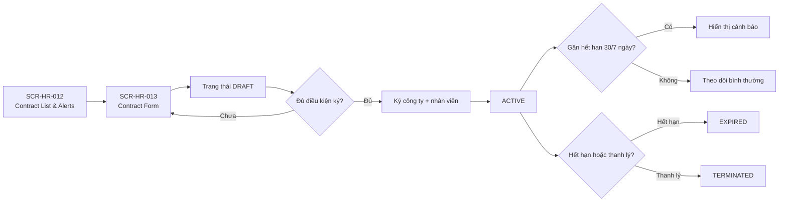

# Flow — HR Sprint 03: Contract Lifecycle

**Mã flow:** FLOW-HR-S03-CON-001  
**Actor chính:** HR Staff, HR Manager, Employee  
**Mục tiêu:** Quản lý vòng đời hợp đồng lao động từ DRAFT đến ACTIVE/EXPIRED/TERMINATED với cảnh báo 30/7 ngày.

---

## 1. Tổng quan luồng

- Điểm bắt đầu: HR Staff mở danh sách hợp đồng của nhân viên.
- Điểm kết thúc: Hợp đồng đi đúng lifecycle, dữ liệu lịch sử được bảo toàn bất biến.
- Phụ thuộc nghiệp vụ: F-HR-011, F-HR-063, BR-HR-002, BR-HR-007, BR-HR-S03-C01.

## 2. Flow diagram

## 3. Danh sách màn hình trong luồng

1. SCR-HR-012 — Contract List & Expiry Alerts
2. SCR-HR-013 — Contract Form / Activate / Terminate
3. SCR-HR-017 — Mobile Contract Summary

## 4. Thiết kế tương tác (Interactions)

- Tại trạng thái ACTIVE, các trường nội dung chính chuyển read-only.
- Cảnh báo 30 ngày và 7 ngày hiển thị theo mức ưu tiên màu khác nhau.
- Thanh lý hợp đồng yêu cầu nhập lý do bắt buộc và xác nhận hai bước.
- Gia hạn thực hiện bằng tạo contract mới có liên kết `previousContractId`.

## 5. Case hiển thị theo luồng nghiệp vụ

### 5.1 Happy path

- Tạo DRAFT hợp lệ -> ký -> ACTIVE.
- Hệ thống tạo cảnh báo đúng mốc 30/7 ngày.

### 5.2 Validation error

- `endDate < startDate`.
- `basicSalary` dưới mức tối thiểu vùng.
- Thiếu file hợp đồng khi policy tenant yêu cầu.

### 5.3 Expired / Locked / Permission / No-data / Offline

- Expired: hợp đồng quá hạn tự chuyển EXPIRED.
- Locked: hợp đồng ACTIVE không cho sửa nội dung cốt lõi.
- Permission: chỉ HR Manager có quyền terminate.
- No-data: nhân viên chưa có hợp đồng -> CTA tạo mới.
- Offline: xem được dữ liệu cache, tạm khóa thao tác ghi.
