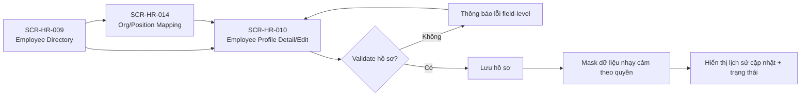

# Flow — HR Sprint 03: Employee Profile Lifecycle

**Mã flow:** FLOW-HR-S03-EMP-001  
**Actor chính:** HR Staff, HR Manager, Employee  
**Mục tiêu:** Tạo, cập nhật và tra cứu hồ sơ nhân viên theo quyền, bao gồm kiểm soát dữ liệu nhạy cảm.

---

## 1. Tổng quan luồng

- Điểm bắt đầu: HR Staff mở danh sách nhân viên.
- Điểm kết thúc: Hồ sơ nhân viên được lưu hợp lệ và hiển thị theo đúng policy quyền.
- Phụ thuộc nghiệp vụ: F-HR-010, F-HR-062, BR-HR-S03-E01, BR-HR-S03-E02.

## 2. Flow diagram

## 3. Danh sách màn hình trong luồng

1. SCR-HR-009 — Employee Directory List
2. SCR-HR-010 — Employee Profile Detail/Edit
3. SCR-HR-014 — Org/Position Mapping
4. SCR-HR-011 — Employee Documents & Sensitive Data Panel

## 4. Thiết kế tương tác (Interactions)

- Form hồ sơ chia section rõ ràng: cá nhân, liên hệ, tổ chức, giấy tờ.
- Khi trùng `employeeCode` hoặc `nationalId`, trả lỗi 409 và focus vào trường vi phạm.
- Các trường nhạy cảm hiển thị mask mặc định, chỉ mở khi role hợp lệ và thao tác xác nhận.
- Employee tự cập nhật trên mobile chỉ sửa được thông tin liên hệ cho phép.

## 5. Case hiển thị theo luồng nghiệp vụ

### 5.1 Happy path

- Tạo hồ sơ mới hợp lệ, hệ thống cấp employeeCode thành công.
- Cập nhật profile không vi phạm unique/validation.

### 5.2 Validation error

- `nationalId` sai định dạng 9/12/15 số.
- `dateOfBirth` chưa đủ 16 tuổi.
- Thiếu `departmentId` hoặc `positionId`.

### 5.3 Expired / Locked / Permission / No-data / Offline

- Locked: hồ sơ bị chỉnh sửa đồng thời, yêu cầu reload bản mới nhất.
- Permission: không đủ quyền xem dữ liệu nhạy cảm -> chỉ thấy giá trị mask.
- No-data: chưa có tài liệu đính kèm -> empty state có CTA tải lên.
- Offline: khóa submit, giữ dữ liệu draft local và cho retry.
