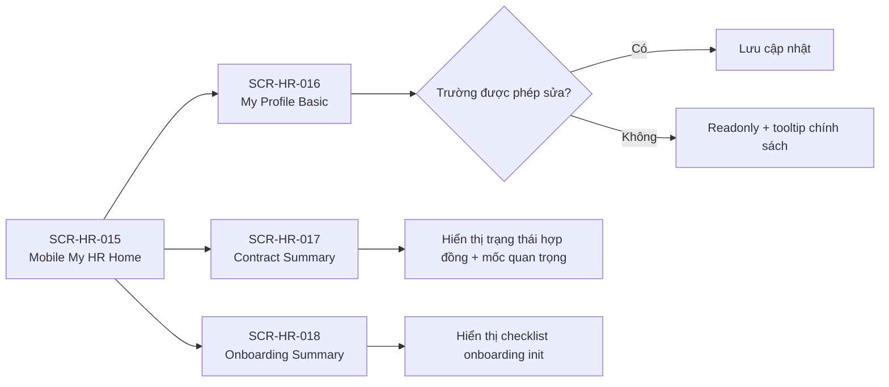

# Flow — HR Sprint 03: Employee Self-Service Mobile Basic

**Mã flow:** FLOW-HR-S03-MOB-001  
**Actor chính:** Employee  
**Mục tiêu:** Cung cấp self-service mobile tối thiểu cho profile cơ bản, contract summary và onboarding summary.

---

## 1. Tổng quan luồng

- Điểm bắt đầu: Employee mở module My HR trên mobile.
- Điểm kết thúc: Employee xem/cập nhật dữ liệu cơ bản của mình trong phạm vi cho phép.
- Phụ thuộc nghiệp vụ: F-HR-065, BR-HR-S03-M01, BR-HR-S03-M02.

## 2. Flow diagram

## 3. Danh sách màn hình trong luồng

1. SCR-HR-015 — Mobile My HR Home
2. SCR-HR-016 — Mobile My Profile Basic
3. SCR-HR-017 — Mobile Contract Summary
4. SCR-HR-018 — Mobile Onboarding Summary

## 4. Thiết kế tương tác (Interactions)

- Điều hướng bằng tab/card lớn, ưu tiên thao tác một tay.
- Trường nhạy cảm luôn readonly hoặc ẩn, có nhãn giải thích chính sách.
- Hỗ trợ pull-to-refresh cho từng màn hình.
- Khi offline, hiển thị banner và cho xem snapshot dữ liệu gần nhất.

## 5. Case hiển thị theo luồng nghiệp vụ

### 5.1 Happy path

- Employee xem đầy đủ profile/contract/onboarding summary của chính mình.
- Cập nhật email, số điện thoại, địa chỉ thành công.

### 5.2 Validation error

- Số điện thoại sai định dạng.
- Email sai định dạng.
- Dữ liệu vượt giới hạn ký tự.

### 5.3 Expired / Locked / Permission / No-data / Offline

- Permission: truy cập employeeId khác bị chặn và chuyển về màn hình chính.
- No-data: chưa có hợp đồng hoặc onboarding item -> empty state có hướng dẫn liên hệ HR.
- Offline: chỉ cho chỉnh sửa local draft, đồng bộ khi có mạng.
