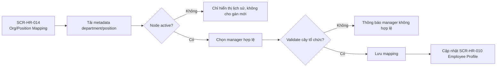

# Flow — HR Sprint 03: Org/Position Mapping

**Mã flow:** FLOW-HR-S03-ORG-001  
**Actor chính:** HR Staff, HR Manager  
**Mục tiêu:** Gán phòng ban, chức danh và quản lý trực tiếp hợp lệ cho hồ sơ nhân viên.

---

## 1. Tổng quan luồng

- Điểm bắt đầu: HR Staff mở màn hình mapping tổ chức.
- Điểm kết thúc: Mapping org-position-manager hợp lệ được lưu và đồng bộ cho hồ sơ nhân viên.
- Phụ thuộc nghiệp vụ: F-HR-060, F-HR-064, BR-HR-S03-O01, BR-HR-S03-O02.

## 2. Flow diagram

## 3. Danh sách màn hình trong luồng

1. SCR-HR-014 — Org/Position Mapping
2. SCR-HR-010 — Employee Profile Detail/Edit
3. SCR-SA-005 — Department / Org Chart (tham chiếu read-only)

## 4. Thiết kế tương tác (Interactions)

- Cho phép xem cây tổ chức dạng split-pane: tree bên trái, chi tiết mapping bên phải.
- Node inactive hiển thị badge Inactive và disable hành động gán mới.
- Danh sách manager đề xuất lọc theo department/position và loại trừ vòng lặp quản lý.
- Khi đổi manager, hiển thị impact preview các rule phân quyền dữ liệu liên quan.

## 5. Case hiển thị theo luồng nghiệp vụ

### 5.1 Happy path

- Chọn department/position active.
- Chọn manager hợp lệ cùng tenant.
- Lưu mapping thành công và phản ánh ngay ở hồ sơ nhân viên.

### 5.2 Validation error

- Manager khác tenant.
- Tạo vòng lặp quản lý trực tiếp/gián tiếp.
- Position không thuộc department đã chọn.

### 5.3 Expired / Locked / Permission / No-data / Offline

- Locked: node org đang bị chỉnh sửa bởi admin khác.
- Permission: HR Staff chỉ được sửa trong phạm vi phòng ban được phân quyền.
- No-data: chưa đồng bộ position catalog -> hướng dẫn sync từ System Admin.
- Offline: cho phép xem cây cached, không cho submit thay đổi.
