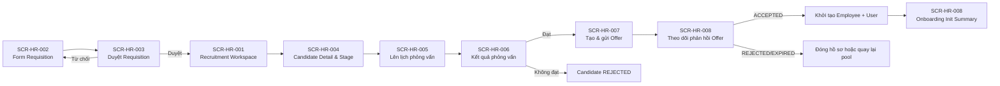

# Flow — HR Sprint 03: Recruitment -> Candidate -> Interview -> Offer -> Onboarding Init

**Mã flow:** FLOW-HR-S03-REC-001  
**Actor chính:** HR Staff, HR Manager, Interviewer, Candidate  
**Mục tiêu:** Vận hành luồng tuyển dụng cốt lõi từ requisition đến khởi tạo onboarding init khi ứng viên nhận offer.

---

## 1. Tổng quan luồng

- Điểm bắt đầu: HR Staff tạo requisition mới.
- Điểm kết thúc: Hệ thống tạo employee tối thiểu, tạo user account và hiển thị onboarding summary.
- Phụ thuộc nghiệp vụ: F-HR-001, F-HR-002, F-HR-003, F-HR-004, BR-HR-S03-R01..R09.

## 2. Flow diagram

## 3. Danh sách màn hình trong luồng

1. SCR-HR-001 — Recruitment Workspace
2. SCR-HR-002 — Requisition Form
3. SCR-HR-003 — Requisition Approval Detail
4. SCR-HR-004 — Candidate Detail & Stage
5. SCR-HR-005 — Interview Scheduler
6. SCR-HR-006 — Interview Result
7. SCR-HR-007 — Offer Composer
8. SCR-HR-008 — Offer Tracking & Onboarding Init

## 4. Thiết kế tương tác (Interactions)

- Stage candidate chỉ cho chuyển theo ma trận hợp lệ; action không hợp lệ bị disable và có tooltip giải thích.
- Khi tạo lịch phỏng vấn, kiểm tra xung đột interviewer theo time slot trước khi cho lưu.
- Offer mặc định hết hạn sau 7 ngày; trạng thái chuyển tự động sang EXPIRED khi quá hạn.
- Callback ACCEPTED bắt buộc idempotency key để chống tạo trùng employee/user.
- Sau khi tạo thành công onboarding init, hiển thị panel checklist mức tối thiểu cho HR theo dõi.

## 5. Case hiển thị theo luồng nghiệp vụ

### 5.1 Happy path

- Requisition được duyệt và publish.
- Candidate đi qua SCREENING -> INTERVIEW -> OFFER.
- Candidate ACCEPTED trong thời hạn offer.
- Hệ thống tạo employee, user account, onboarding init summary.

### 5.2 Validation error

- Requisition: `numberOfPositions < 1`, `deadline <= currentDate`.
- Interview: `scheduledAt < now + 24h` hoặc interviewer trùng lịch.
- Offer: thiếu dữ liệu bắt buộc hoặc expiry không hợp lệ.

### 5.3 Expired / Locked / Permission / No-data / Offline

- Expired: offer quá 7 ngày chuyển EXPIRED, khóa action ACCEPT.
- Locked: candidate đang bị xử lý bởi thao tác song song, hiển thị conflict.
- Permission: HR Staff không có quyền duyệt requisition, ẩn nút approve/reject.
- No-data: requisition không có candidate, hiển thị empty state có CTA nhập candidate.
- Offline: lưu tạm dữ liệu form cục bộ, cho phép retry khi có mạng.
