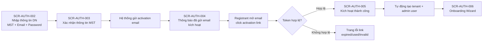

# Flow — Đăng ký doanh nghiệp tự phục vụ (Self-Service)

**Mã flow:** FLOW-AUTH-REGISTER-DN-001  
**Actor chính:** Registrant (Đại diện doanh nghiệp)  
**Mục tiêu:** Hoàn tất đăng ký tenant theo luồng tự phục vụ, bắt buộc kích hoạt email qua activation link.

---

## 1. Tổng quan luồng

- Điểm bắt đầu: Người dùng truy cập trang đăng ký doanh nghiệp.
- Điểm kết thúc: Tenant được kích hoạt, người dùng vào Onboarding Wizard.
- Phụ thuộc nghiệp vụ: F-SA-010, F-SA-011, F-SA-012, F-SA-013, F-SA-014.

## 2. Flow diagram

## 3. Danh sách màn hình trong luồng

1. SCR-AUTH-002 — Nhập thông tin đăng ký doanh nghiệp
2. SCR-AUTH-003 — Xác nhận thông tin MST
3. SCR-AUTH-004 — Đã gửi email kích hoạt
4. SCR-AUTH-005 — Kích hoạt thành công
5. SCR-AUTH-006 — Onboarding Wizard

## 4. Thiết kế tương tác

- Từ SCR-AUTH-004, UI hiển thị rõ email đích đã được ẩn bớt (ví dụ m***@company.com).
- Nút Gửi lại email kích hoạt có cooldown 60s; tối đa 3 lần/24h.
- Khi click activation link:
  - Nếu token hợp lệ: chuyển đến SCR-AUTH-005 và tự động chuyển sang onboarding.
  - Nếu token đã dùng/hết hạn: hiển thị trang lỗi có CTA Gửi lại email kích hoạt.
- Luồng activation là chủ động từ email; không dùng OTP nhập tay cho đăng ký DN.

## 5. Case hiển thị theo luồng nghiệp vụ

### 5.1 Happy path

- SCR-AUTH-002: người dùng nhập hợp lệ MST + email + mật khẩu.
- SCR-AUTH-003: xác nhận dữ liệu MST hợp lệ từ nguồn thuế.
- SCR-AUTH-004: hệ thống gửi activation email thành công.
- SCR-AUTH-005: token hợp lệ, tenant provisioning thành công.
- SCR-AUTH-006: hoàn tất onboarding và vào dashboard.

### 5.2 Validation error

- SCR-AUTH-002: MST sai định dạng, email sai định dạng, mật khẩu không đạt policy.
- SCR-AUTH-003: thiếu xác nhận dữ liệu pháp lý trước khi tiếp tục.
- SCR-AUTH-006: dữ liệu từng bước onboarding chưa hợp lệ.

### 5.3 Expired / Used / Invalid token

- Activation token hết hạn/đã dùng/không hợp lệ không vào SCR-AUTH-005.
- Điều hướng về trang lỗi link kèm CTA gửi lại activation email.

### 5.4 Locked / Rate-limit

- Giới hạn gửi lại activation email: cooldown 60 giây, tối đa 3 lần/24h.
- Vượt ngưỡng: khóa hành động gửi lại và hiển thị thông báo theo `messageKey + metadata`.

### 5.5 Permission / No-data / Offline

- Permission: người dùng không phải tenant admin không được thao tác các bước onboarding quản trị.
- No-data: không tìm thấy dữ liệu MST thì yêu cầu nhập lại hoặc liên hệ hỗ trợ.
- Offline: mất kết nối khi submit/polling thì hiển thị cảnh báo, giữ dữ liệu cục bộ và cho phép retry.
