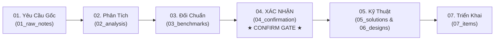

# [00] Bản Đồ Điều Hướng Đọc Tài Liệu Tuần Tự: Sprint 01 - Core IAM

- **Tên Sprint**: Sprint 01 - Core Identity, Access & Account Management
- **Mục Tiêu**: Xây dựng nền tảng định danh toàn cục, phân giải không gian Tenant SaaS, đăng ký, đăng nhập, quên mật khẩu, 2FA và quản lý tài khoản qua Drawer Anti-Modal.
- **Thời Gian Dự Kiến**: 2026-09-18 đến 2026-10-02 (2 tuần)
- **Trạng Thái Hiện Tại**: [x] ĐÃ XỬ LÝ TOÀN BỘ BUG (30/30 test PASS, Browser verify 6/6) → CHỜ QA SIGN-OFF CUỐI & COMMIT

---

## Hướng Dẫn Dành Cho Khách Hàng / Reviewer: Đọc Từ Đâu Đến Đâu?

Để không bị lạc và không bỏ sót bất kỳ nội dung nào, **bạn chỉ cần đọc tài liệu theo đúng thứ tự tuần tự từ Bước 1 đến Bước 4 dưới đây**:

---

## 🧭 Lộ Trình Đọc Tuần Tự & Trạng Thái Phê Duyệt

### 📌 Giai Đoạn 1: Xem Xét & Phê Duyệt Nghiệp Vụ (Khách Hàng / Product Owner)

| Thứ Tự Đọc | Thư Mục / File | Mục Đích Nội Dung | Người Phụ Trách | Trạng Thái |
| :---: | :--- | :--- | :---: | :---: |
| **1** | [01_raw_notes/](01_raw_notes/) • [RAW-01_sprint_01_core_identity.md](01_raw_notes/RAW-01_sprint_01_core_identity.md) • [RAW-02_account_2fa_management.md](01_raw_notes/RAW-02_account_2fa_management.md) | **Kiểm tra xem AI/BA đã ghi nhận đúng mong muốn ban đầu của bạn chưa**: Đăng ký cá nhân, doanh nghiệp, đăng nhập, quên mật khẩu, 2FA và Quản lý tài khoản (Đăng ký/Xóa 2FA). | BA Agent | [x] Đã ghi nhận |
| **2** | [02_analysis/](02_analysis/) • [ANL-01_core_identity_access.md](02_analysis/ANL-01_core_identity_access.md) | **Đọc phân tích nghiệp vụ chuyên sâu**: Xem các quy tắc bảo mật (Argon2id, brute-force, bảo mật kép khi tắt 2FA, ma trận phân định Web Desktop vs Mobile). | BA Agent | [x] Đã hoàn thành |
| **3** | [03_benchmarks/](03_benchmarks/) • [BENCH-01_auth_identity_saas.md](03_benchmarks/BENCH-01_auth_identity_saas.md) | **Xem khảo sát các phần mềm hàng đầu**: Học hỏi ưu/nhược điểm từ Odoo, Keycloak, Auth0, Supabase để áp dụng chuẩn mực tốt nhất vào Open-ERP. | BA Agent | [x] Đã hoàn thành |
| **4** | [04_confirmation/](04_confirmation/) • [CONF-01_sprint_01_scope.md](04_confirmation/CONF-01_sprint_01_scope.md) **(CONFIRMATION GATE)** | **★ ĐIỂM CHỐT XÁC NHẬN QUAN TRỌNG NHẤT ★**: Khách hàng kiểm tra bảng phạm vi cam kết (In-scope) và các tiêu chí nghiệm thu. **Chỉ khi khách hàng xác nhận tại file này, bước kỹ thuật mới được phép tiến hành.** | Khách Hàng & BA | **[x] ĐÃ PHÊ DUYỆT** |

---

### 🛠️ Giai Đoạn 2: Xem Xét Giải Pháp Kỹ Thuật & Thiết Kế (Tech Lead / Architect / Dev)

| Thứ Tự Đọc | Thư Mục / File | Mục Đích Nội Dung | Người Phụ Trách | Trạng Thái |
| :---: | :--- | :--- | :---: | :---: |
| **5** | [05_solutions/](05_solutions/) • [SOL-01_core_identity_architecture.md](05_solutions/SOL-01_core_identity_architecture.md) | Nghiên cứu giải pháp kỹ thuật, so sánh công nghệ (Argon2id, Quarkus vs Spring Boot, Redis vs DB Session). | Solution Architect | [x] Đã duyệt |
| **6** | [06_designs/](06_designs/) • [database/CORE_IAM_DATABASE_SCHEMA.md](06_designs/database/CORE_IAM_DATABASE_SCHEMA.md) • [api/CORE_IAM_API_SPEC.md](06_designs/api/CORE_IAM_API_SPEC.md) • [ui_ux/CORE_IAM_UI_SPEC.md](06_designs/ui_ux/CORE_IAM_UI_SPEC.md) | **Bản thiết kế chi tiết 100% để Developer lập trình**: - CSDL PostgreSQL Multi-Tenant (7 bảng). - Đặc tả REST API chuẩn hóa (Code-based i18n Contract). - Đặc tả UI Anti-Modal: Drawer trượt, Stacked Drawer cho 2FA. | Solution Architect | [x] Đã duyệt |
| **7** | [07_items/](07_items/) • [FEAT-01: Đăng ký cá nhân](07_items/FEAT-01_personal_registration.md) • [FEAT-02: Đăng ký doanh nghiệp](07_items/FEAT-02_business_registration.md) • [FEAT-03: Đăng nhập Multi-Tenant](07_items/FEAT-03_authentication_login.md) • [FEAT-04: Quên mật khẩu](07_items/FEAT-04_forgot_password.md) • [FEAT-05: Xác thực 2FA TOTP](07_items/FEAT-05_two_factor_auth.md) • [FEAT-06: Quản lý tài khoản & 2FA](07_items/FEAT-06_account_management.md) • [FEAT-07: Responsive điện thoại & Mobile Nav Drawer](07_items/FEAT-07_responsive_phone_and_mobile_nav.md) • [FEAT-08: Ionic Mobile Side Menu & Theme](07_items/FEAT-08_ionic_mobile_menu_theme.md) • [FEAT-09: Ionic Auth UX & Điều hướng](07_items/FEAT-09_ionic_auth_ux_and_navigation.md) | **Danh sách các hạng mục công việc chi tiết**: Quản lý từng Feature dạng file, quy định Acceptance Criteria và các Sub-task kỹ thuật. | Developer & PM | [x] In Progress |

---

### 🧪 Giai Đoạn 3: Kiểm Thử Chất Lượng & Đóng Sprint (QA / QC & PM)

| Thứ Tự Đọc | Thư Mục / File | Mục Đích Nội Dung | Người Phụ Trách | Trạng Thái |
| :---: | :--- | :--- | :---: | :---: |
| **8** | [08_testing/](08_testing/) • [test_plan.md](08_testing/test_plan.md) • [manual_test_guide.md](08_testing/manual_test_guide.md) • [CODE_REVIEW_SPRINT_01.md](09_review/CODE_REVIEW_SPRINT_01.md) • [QA_RETEST_SPRINT_01.md](09_review/QA_RETEST_SPRINT_01.md) | Kế hoạch kiểm thử: Unit Test Backend Quarkus Java và Kiểm thử thủ công trên Trình duyệt (Browser Manual Testing) cho Angular & Ionic. **Code Review (REV-02)**: 9 Critical + 14 High + 8 Medium. **Re-test (REV-03)**: đã xử lý xong toàn bộ bug (Critical/High/Medium/Low), backend 30/30 test PASS, Web/Mobile build PASS + browser verify 6/6; chờ QA sign-off cuối. | QA/QC Agent | [ ] Browser Manual Testing (đã fix BUG-35 → BUG-37, BUG-24 → BUG-31, BUG-34, BUG-42 → BUG-45; chờ QA duyệt tổng thể) |
| **8b** | [manual_test_guide.md](08_testing/manual_test_guide.md) • [test_report_sprint_01.md](08_testing/test_reports/test_report_sprint_01.md) • [UG-01 User Guide](../../06_user_guides/sprint_01_core_iam_user_guide.md) | Hướng dẫn QA thao tác tay, báo cáo kiểm thử và Hướng dẫn sử dụng (20 ảnh) cho Khách hàng. | QA/QC & BA | [x] Đã có |
| **9** | [09_review/](09_review/) • [sprint_review.md](09_review/sprint_review.md) | **Đóng Sprint**: Kiểm tra điều kiện đóng Sprint (100% item Critical và High đạt Done), đánh giá kết quả và lập biên bản bàn giao. | PM Agent | [ ] Chờ nghiệm thu |

---

## Bảng Checklist Phê Duyệt Của Khách Hàng (Customer Sign-Off Gate)

- [x] **Bước 1**: Đã xem ghi chú yêu cầu thô trong `01_raw_notes/` và đồng ý với phạm vi tiếp nhận.
- [x] **Bước 2**: Đã xem tài liệu phân tích nghiệp vụ `02_analysis/ANL-01` và hài lòng với quy trình nghiệp vụ đề xuất.
- [x] **Bước 3**: Đã xem tài liệu đối chuẩn `03_benchmarks/BENCH-01`.
- [x] **Bước 4**: **ĐÃ PHÊ DUYỆT BIÊN BẢN XÁC NHẬN PHẠM VI** `04_confirmation/CONF-01_sprint_01_scope.md`.
- [x] **Bổ sung ngày 2026-09-18**: Đã xác nhận bổ sung phân hệ Đăng ký & Xóa/Tắt 2FA vào Quản lý tài khoản (FEAT-06).
- [x] **Bổ sung ngày 2026-09-18 (sau rà soát)**: Đã rà soát tính nhất quán toàn bộ tài liệu Sprint 01 và phê duyệt xác nhận bổ sung tại [Mục 3 của CONF-01](04_confirmation/CONF-01_sprint_01_scope.md). Sẵn sàng chuyển sang Bước 7 (Lập trình).
