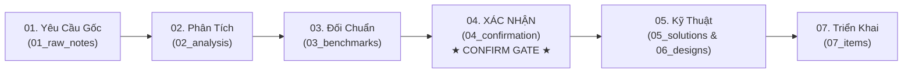

# [00] Bản Đồ Điều Hướng Đọc Tài Liệu Tuần Tự: Sprint 02 - Super Admin & Phân Quyền Toàn Diện

- **Tên Sprint**: Sprint 02 - Super Admin Platform Management, Functional RBAC & Multi-Scope Data Access Control
- **Mục Tiêu**: Xây dựng nền tảng quản trị hệ thống dành cho Super Admin (Platform Operator), quản lý vòng đời Tenant, cơ chế đăng nhập đại diện (Impersonation), giám sát hạ tầng; đồng thời thiết lập cơ chế phân quyền chức năng (RBAC), sơ đồ tổ chức (Chi nhánh, Cây phòng ban) và kiểm soát truy cập dữ liệu đa phạm vi (7 Scopes) với 6 thao tác tác động dữ liệu (CRUD, Export, Share).
- **Thời Gian Dự Kiến**: 2026-10-05 đến 2026-10-19 (2 tuần)
- **Trạng Thái Hiện Tại**: [x] ĐÃ HOÀN THÀNH TÀI LIỆU THIẾT KẾ (Bước 1 - Bước 6) & ĐÃ SẴN SÀNG CONFIRMATION GATE

---

## Hướng Dẫn Dành Cho Khách Hàng / Reviewer: Đọc Từ Đâu Đến Đâu?

Để nắm bắt trọn vẹn giải pháp và không bỏ sót bất kỳ quy tắc bảo mật nào, **bạn chỉ cần đọc tài liệu theo đúng thứ tự tuần tự từ Bước 1 đến Bước 4 dưới đây**:

---

## 🧭 Lộ Trình Đọc Tuần Tự & Trạng Thái Phê Duyệt

### 📌 Giai Đoạn 1: Xem Xét & Phê Duyệt Nghiệp Vụ (Khách Hàng / Product Owner)

| Thứ Tự Đọc | Thư Mục / File | Mục Đích Nội Dung | Người Phụ Trách | Trạng Thái |
| :---: | :--- | :--- | :---: | :---: |
| **1** | [01_raw_notes/](01_raw_notes/) • [RAW-01_superadmin_platform_management.md](01_raw_notes/RAW-01_superadmin_platform_management.md) • [RAW-02_functional_rbac_and_data_scopes.md](01_raw_notes/RAW-02_functional_rbac_and_data_scopes.md) | **Kiểm tra ghi nhận yêu cầu thô**: Quản lý toàn bộ hệ thống bằng Super Admin, phân quyền chức năng và phân quyền dữ liệu theo nhiều phạm vi và thao tác. | BA Agent | [x] Đã ghi nhận |
| **2** | [02_analysis/](02_analysis/) • [ANL-01_superadmin_platform_management.md](02_analysis/ANL-01_superadmin_platform_management.md) • [ANL-02_functional_rbac_and_data_scope_permissions.md](02_analysis/ANL-02_functional_rbac_and_data_scope_permissions.md) | **Đọc phân tích nghiệp vụ chuyên sâu**: Xem quy tắc vận hành vòng đời Tenant, quota lưu trữ, cơ chế Impersonation an toàn, 7 phạm vi dữ liệu (All, Branch, Dept, Subordinates, Own...) và ma trận 6 thao tác dữ liệu. | BA Agent | [x] Đã hoàn thành |
| **3** | [03_benchmarks/](03_benchmarks/) • [BENCH-01_superadmin_and_multi_scope_rbac.md](03_benchmarks/BENCH-01_superadmin_and_multi_scope_rbac.md) | **Xem khảo sát hệ thống hàng đầu**: Học hỏi ưu/nhược điểm từ Odoo Record Rules, Salesforce Sharing Model, SAP Authorization Objects, Casbin/Permify. | BA Agent | [x] Đã hoàn thành |
| **4** | [04_confirmation/](04_confirmation/) • [CONF-01_sprint_02_scope.md](04_confirmation/CONF-01_sprint_02_scope.md) **(CONFIRMATION GATE)** | **★ ĐIỂM CHỐT XÁC NHẬN QUAN TRỌNG NHẤT ★**: Khách hàng kiểm tra bảng cam kết phạm vi In-Scope và các tiêu chí nghiệm thu (Given-When-Then). **Chỉ khi khách hàng xác nhận tại file này, bước lập trình mới được phép tiến hành.** | Khách Hàng & BA | **[x] CHỜ PHÊ DUYỆT** |

---

### 🛠️ Giai Đoạn 2: Xem Xét Giải Pháp Kỹ Thuật & Thiết Kế (Tech Lead / Architect / Dev)

| Thứ Tự Đọc | Thư Mục / File | Mục Đích Nội Dung | Người Phụ Trách | Trạng Thái |
| :---: | :--- | :--- | :---: | :---: |
| **5** | [05_solutions/](05_solutions/) • [SOL-01_superadmin_architecture_and_security.md](05_solutions/SOL-01_superadmin_architecture_and_security.md) • [SOL-02_rbac_and_data_scope_enforcement_engine.md](05_solutions/SOL-02_rbac_and_data_scope_enforcement_engine.md) | Nghiên cứu giải pháp kỹ thuật, phân tách Token Platform vs Tenant, Audit Log bất biến, Engine thực thi SQL Filter tự động trong Quarkus Java và cơ chế Cache Redis. | Solution Architect | [x] Đã hoàn thành |
| **6** | [06_designs/](06_designs/) • [database/SUPERADMIN_RBAC_DATABASE_SCHEMA.md](06_designs/database/SUPERADMIN_RBAC_DATABASE_SCHEMA.md) • [api/SUPERADMIN_RBAC_API_SPEC.md](06_designs/api/SUPERADMIN_RBAC_API_SPEC.md) • [ui_ux/SUPERADMIN_RBAC_UI_SPEC.md](06_designs/ui_ux/SUPERADMIN_RBAC_UI_SPEC.md) | **Bản thiết kế chi tiết 100% để Developer lập trình**: - CSDL PostgreSQL: 10 bảng mới phục vụ Platform Admin, Cơ cấu tổ chức, Phân quyền RBAC & Data Policies. - Đặc tả REST API chuẩn hóa (100% Code-based i18n contract). - Thiết kế UI Anti-Modal: Portal Super Admin, Ma trận phân quyền Split-Screen, Stacked Drawers. | Solution Architect | [x] Đã hoàn thành |
| **7** | [07_items/](07_items/) • [FEAT-10: Quản trị Tenant & Hạn mức](07_items/FEAT-10_superadmin_tenant_management.md) • [FEAT-11: Quản lý người dùng toàn cục & Impersonation](07_items/FEAT-11_superadmin_global_user_and_impersonation.md) • [FEAT-12: Giám sát sức khỏe hạ tầng & Nhật ký nền tảng](07_items/FEAT-12_superadmin_system_health_and_audit.md) • [FEAT-13: Cơ cấu tổ chức (Chi nhánh, Phòng ban, Cấp bậc)](07_items/FEAT-13_organization_hierarchy_structure.md) • [FEAT-14: Ma trận Phân quyền chức năng (RBAC)](07_items/FEAT-14_functional_rbac_matrix.md) • [FEAT-15: Phân quyền dữ liệu đa phạm vi & 6 thao tác](07_items/FEAT-15_multi_scope_data_access_control.md) • [FEAT-16: Engine thực thi phân quyền dữ liệu tự động Backend](07_items/FEAT-16_data_permission_enforcement_engine.md) | **Danh sách các hạng mục công việc chi tiết**: Quản lý từng Feature dạng file, quy định Acceptance Criteria và các Sub-task kỹ thuật. | Developer & PM | [x] Sẵn sàng phát triển |

---

### 🧪 Giai Đoạn 3: Kiểm Thử Chất Lượng & Đóng Sprint (QA / QC & PM)

| Thứ Tự Đọc | Thư Mục / File | Mục Đích Nội Dung | Người Phụ Trách | Trạng Thái |
| :---: | :--- | :--- | :---: | :---: |
| **8** | [08_testing/](08_testing/) • [test_plan.md](08_testing/test_plan.md) | Kế hoạch kiểm thử: Unit Test Backend Quarkus Java (Multi-tenant leakage test, Data scope boundary test) và Dual-mode browser manual testing cho Web/Mobile. | QA/QC Agent | [x] Đã lập kế hoạch |
| **9** | [09_review/](09_review/) • [sprint_review_template.md](09_review/sprint_review_template.md) | Mẫu biên bản nghiệm thu và tiêu chuẩn đóng Sprint (DoD Gate: 0 bug Critical/High). | PM Agent | [ ] Chờ hoàn thành Sprint |

---

## Bảng Checklist Phê Duyệt Của Khách Hàng (Customer Sign-Off Gate)

- [ ] **Bước 1**: Đã xem ghi chú yêu cầu thô trong `01_raw_notes/` và đồng ý với phạm vi tiếp nhận.
- [ ] **Bước 2**: Đã xem tài liệu phân tích nghiệp vụ `02_analysis/` và hài lòng với quy trình Super Admin và Phân quyền đề xuất.
- [ ] **Bước 3**: Đã xem tài liệu đối chuẩn `03_benchmarks/`.
- [ ] **Bước 4**: **ĐÃ PHÊ DUYỆT BIÊN BẢN XÁC NHẬN PHẠM VI** `04_confirmation/CONF-01_sprint_02_scope.md`.
- [ ] **Bước 7**: Cho phép triển khai lập trình mã nguồn (Implementation).
