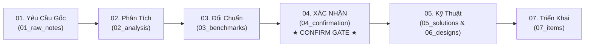

# [00] Bản Đồ Điều Hướng Đọc Tài Liệu Tuần Tự: Sprint 02 - Super Admin & Phân Quyền Toàn Diện

## Điều hướng chuẩn cho developer — 2026-10-04

Bắt đầu với [Developer Reading Guide](../../08_developer_guides/00_READING_GUIDE.md). Trong sprint này đọc scope/AC → SOL → DES (DB → API → UI) → feature/item → test plan/report → review. Bảng dưới định thứ tự các file thật; index dùng alias legacy có sprint theo [chuẩn tài liệu](../../../.agents/rules/documentation_standards.md). File template trong pack chỉ là mẫu, không phải artifact hoàn thành.

[Review](09_review/sprint_review.md) ghi PM đủ DoD và đóng sau khách hàng ký; mục chữ ký khách hàng còn trống. Chưa xác nhận được customer acceptance từ chữ ký trong file; giữ lịch sử, không tự ký hoặc sửa quyết định cũ.

| Thứ tự | ID/alias và file | Mục đích |
| :--- | :--- | :--- |
| 01.01 | [S02/RAW-01](01_raw_notes/RAW-01_superadmin_platform_management.md) | Yêu cầu gốc |
| 01.02 | [S02/RAW-02](01_raw_notes/RAW-02_functional_rbac_and_data_scopes.md) | Yêu cầu gốc |
| 02.01 | [S02/ANL-01](02_analysis/ANL-01_superadmin_platform_management.md) | Phân tích nghiệp vụ |
| 02.02 | [S02/ANL-02](02_analysis/ANL-02_functional_rbac_and_data_scope_permissions.md) | Phân tích nghiệp vụ |
| 03.01 | [S02/BENCH-01](03_benchmarks/BENCH-01_superadmin_and_multi_scope_rbac.md) | Đối chuẩn |
| 04.01 | [S02/CONF-01](04_confirmation/CONF-01_sprint_02_scope.md) | Scope/AC/approval |
| 05.01 | [S02/SOL-01](05_solutions/SOL-01_superadmin_architecture_and_security.md) | Giải pháp và lý do |
| 05.02 | [S02/SOL-02](05_solutions/SOL-02_rbac_and_data_scope_enforcement_engine.md) | Giải pháp và lý do |
| 06.01 | [S02/SUPERADMIN_RBAC_DATABASE_SCHEMA](06_designs/database/SUPERADMIN_RBAC_DATABASE_SCHEMA.md) | Thiết kế chi tiết |
| 06.02 | [S02/SUPERADMIN_RBAC_API_SPEC](06_designs/api/SUPERADMIN_RBAC_API_SPEC.md) | Thiết kế chi tiết |
| 06.03 | [S02/SUPERADMIN_RBAC_UI_SPEC](06_designs/ui_ux/SUPERADMIN_RBAC_UI_SPEC.md) | Thiết kế chi tiết |
| 07.01 | [FEAT-10](07_items/FEAT-10_superadmin_tenant_management.md) | Feature; đọc task con theo dependency và file item nguồn |
| 07.02 | [FEAT-11](07_items/FEAT-11_superadmin_global_user_and_impersonation.md) | Feature; đọc task con theo dependency và file item nguồn |
| 07.03 | [FEAT-12](07_items/FEAT-12_superadmin_system_health_and_audit.md) | Feature; đọc task con theo dependency và file item nguồn |
| 07.04 | [FEAT-13](07_items/FEAT-13_organization_hierarchy_structure.md) | Feature; đọc task con theo dependency và file item nguồn |
| 07.05 | [FEAT-14](07_items/FEAT-14_functional_rbac_matrix.md) | Feature; đọc task con theo dependency và file item nguồn |
| 07.06 | [FEAT-15](07_items/FEAT-15_multi_scope_data_access_control.md) | Feature; đọc task con theo dependency và file item nguồn |
| 07.07 | [FEAT-16](07_items/FEAT-16_data_permission_enforcement_engine.md) | Feature; đọc task con theo dependency và file item nguồn |
| 07.08 | [FEAT-17](07_items/FEAT-17_core_reference_entity.md) | Feature; đọc task con theo dependency và file item nguồn |
| 07.09 | [FEAT-18](07_items/FEAT-18_superadmin_account_lifecycle_and_cli.md) | Feature; đọc task con theo dependency và file item nguồn |
| 07.10 | [FEAT-19](07_items/FEAT-19_department_tree_dual_view.md) | Feature; đọc task con theo dependency và file item nguồn |
| 07.11 | [FEAT-20](07_items/FEAT-20_plugin_config_list_switches.md) | Feature; đọc task con theo dependency và file item nguồn |
| 08.01 | [S02/test_plan](08_testing/test_plan.md) | Kế hoạch/kết quả QA theo từng baseline |
| 08.02 | [S02/test_report](08_testing/test_report.md) | Kế hoạch/kết quả QA theo từng baseline |
| 09.01 | [S02/sprint_review](09_review/sprint_review.md) | Review/bằng chứng/quyết định |

Kế hoạch: [sprint_plan.md](sprint_plan.md). Bug/task đọc theo dependency và severity trong [07_items](07_items/); file item là nguồn trạng thái. Task inline lịch sử giữ dấu vết; việc mở phải tách file trước phân công mới. Không cấp theo dải 1xx/2xx/3xx; điều phối reserve ID toàn dự án trước giao song song.

### Danh mục ID mới / reservation

| ID | File hoặc reservation | Owner | Tình trạng |
| :--- | :--- | :--- | :--- |
| Chưa cấp ID mới trong phiên này | Giữ IDs lịch sử | Điều phối | — |

Bảng đọc là snapshot danh mục; khi thêm artifact phải cập nhật index. Những bảng tiến độ, số test và checklist phía dưới lưu hồ sơ các mốc cũ; kiểm tra quyết định tại nguồn đã link trước khi nhận việc. Không quy đổi Resolved/Fixed thành Done chỉ từ summary.

> **Quy ước mã tài liệu**: Mã SOL/DES/TEST/REV mang phạm vi cục bộ trong từng Sprint-Pack (ví dụ DES-02-API của Sprint 02 khác DES-02 của Sprint 01).

- **Tên Sprint**: Sprint 02 - Super Admin Platform Management, Functional RBAC & Multi-Scope Data Access Control
- **Mục Tiêu**: Xây dựng nền tảng quản trị hệ thống dành cho Super Admin (Platform Operator), quản lý vòng đời Tenant, cơ chế đăng nhập đại diện (Impersonation), giám sát hạ tầng; đồng thời thiết lập cơ chế phân quyền chức năng (RBAC), sơ đồ tổ chức (Chi nhánh, Cây phòng ban) và kiểm soát truy cập dữ liệu đa phạm vi (7 Scopes) với 6 thao tác tác động dữ liệu (CRUD, Export, Share).
- **Thời Gian Dự Kiến**: 2026-10-05 đến 2026-10-19 (2 tuần)
- **Trạng Thái Hiện Tại**: [x] **HOÀN TẤT SPRINT 02 (BƯỚC 8-9) — ĐÃ NGHIỆM THU & ĐÓNG (2026-09-19)**; DoD Gate PASS: 0 Critical/High, backend 193/193 test PASS, QA dual-mode 0 console error, UG-02 kèm 27 ảnh.

---

## Hướng Dẫn Dành Cho Khách Hàng / Reviewer: Đọc Từ Đâu Đến Đâu?

Để nắm bắt trọn vẹn giải pháp và không bỏ sót bất kỳ quy tắc bảo mật nào, **bạn chỉ cần đọc tài liệu theo đúng thứ tự tuần tự từ Bước 1 đến Bước 4 dưới đây**:

```mermaid
flowchart LR
    Step1["01. Yêu Cầu Gốc\n(01_raw_notes)"] --> Step2["02. Phân Tích\n(02_analysis)"]
    Step2 --> Step3["03. Đối Chuẩn\n(03_benchmarks)"]
    Step3 --> Step4["04. XÁC NHẬN\n(04_confirmation)\n★ CONFIRM GATE ★"]
    Step4 --> Step5["05. Kỹ Thuật\n(05_solutions & 06_designs)"]
    Step5 --> Step6["07. Triển Khai\n(07_items)"]
```

---

## 🧭 Lộ Trình Đọc Tuần Tự & Trạng Thái Phê Duyệt

### 📌 Giai Đoạn 1: Xem Xét & Phê Duyệt Nghiệp Vụ (Khách Hàng / Product Owner)

| Thứ Tự Đọc | Thư Mục / File | Mục Đích Nội Dung | Người Phụ Trách | Trạng Thái |
| :---: | :--- | :--- | :---: | :---: |
| **1** | [01_raw_notes/](01_raw_notes/) • [RAW-01_superadmin_platform_management.md](01_raw_notes/RAW-01_superadmin_platform_management.md) • [RAW-02_functional_rbac_and_data_scopes.md](01_raw_notes/RAW-02_functional_rbac_and_data_scopes.md) | **Kiểm tra ghi nhận yêu cầu thô**: Quản lý toàn bộ hệ thống bằng Super Admin, phân quyền chức năng và phân quyền dữ liệu theo nhiều phạm vi và thao tác. | BA Agent | [x] Đã ghi nhận |
| **2** | [02_analysis/](02_analysis/) • [ANL-01_superadmin_platform_management.md](02_analysis/ANL-01_superadmin_platform_management.md) • [ANL-02_functional_rbac_and_data_scope_permissions.md](02_analysis/ANL-02_functional_rbac_and_data_scope_permissions.md) | **Đọc phân tích nghiệp vụ chuyên sâu**: Xem quy tắc vận hành vòng đời Tenant, quota lưu trữ, cơ chế Impersonation an toàn, 7 phạm vi dữ liệu (All, Branch, Dept, Subordinates, Own...) và ma trận 6 thao tác dữ liệu. | BA Agent | [x] Đã hoàn thành |
| **3** | [03_benchmarks/](03_benchmarks/) • [BENCH-01_superadmin_and_multi_scope_rbac.md](03_benchmarks/BENCH-01_superadmin_and_multi_scope_rbac.md) | **Xem khảo sát hệ thống hàng đầu**: Học hỏi ưu/nhược điểm từ Odoo Record Rules, Salesforce Sharing Model, SAP Authorization Objects, Casbin/Permify. | BA Agent | [x] Đã hoàn thành |
| **4** | [04_confirmation/](04_confirmation/) • [CONF-01_sprint_02_scope.md](04_confirmation/CONF-01_sprint_02_scope.md) **(CONFIRMATION GATE)** | **★ ĐIỂM CHỐT XÁC NHẬN QUAN TRỌNG NHẤT ★**: Khách hàng kiểm tra bảng cam kết phạm vi In-Scope và các tiêu chí nghiệm thu (Given-When-Then). **Chỉ khi khách hàng xác nhận tại file này, bước lập trình mới được phép tiến hành.** | Khách Hàng & BA | **[x] ĐÃ PHÊ DUYỆT (2026-09-18) - gồm 9 mục Phụ lục rà soát** |

> **Quy ước theo dõi công việc**: Các mã `TASK-2xx` liệt kê bên trong file FEAT là sub-task theo dõi nội bộ (file FEAT là file quản lý chính); chỉ các task/bug phát sinh độc lập mới tạo file riêng trong `07_items/`. Dải mã TASK Sprint 01: 101–149; Sprint 02: 201–290.

---

### 🛠️ Giai Đoạn 2: Xem Xét Giải Pháp Kỹ Thuật & Thiết Kế (Tech Lead / Architect / Dev)

| Thứ Tự Đọc | Thư Mục / File | Mục Đích Nội Dung | Người Phụ Trách | Trạng Thái |
| :---: | :--- | :--- | :---: | :---: |
| **5** | [05_solutions/](05_solutions/) • [SOL-01_superadmin_architecture_and_security.md](05_solutions/SOL-01_superadmin_architecture_and_security.md) • [SOL-02_rbac_and_data_scope_enforcement_engine.md](05_solutions/SOL-02_rbac_and_data_scope_enforcement_engine.md) | Nghiên cứu giải pháp kỹ thuật, phân tách Token Platform vs Tenant, Audit Log bất biến, Engine thực thi SQL Filter tự động trong Quarkus Java và cơ chế Cache Redis. | Solution Architect | [x] Đã hoàn thành |
| **6** | [06_designs/](06_designs/) • [database/SUPERADMIN_RBAC_DATABASE_SCHEMA.md](06_designs/database/SUPERADMIN_RBAC_DATABASE_SCHEMA.md) • [api/SUPERADMIN_RBAC_API_SPEC.md](06_designs/api/SUPERADMIN_RBAC_API_SPEC.md) • [ui_ux/SUPERADMIN_RBAC_UI_SPEC.md](06_designs/ui_ux/SUPERADMIN_RBAC_UI_SPEC.md) | **Bản thiết kế chi tiết 100% để Developer lập trình**: - CSDL PostgreSQL: 12 bảng mới (Platform Admin, Cơ cấu tổ chức gồm Phân công quản lý Chi nhánh, RBAC & Data Policies) + 1 bảng Reference Entity `core_sample_records` (FEAT-17); mở rộng bảng `tenants` (quotas, lock, trial). - Đặc tả REST API chuẩn hóa (100% Code-based i18n contract). - Thiết kế UI Anti-Modal: Portal Super Admin, Ma trận phân quyền Split-Screen, Stacked Drawers. | Solution Architect | [x] Đã hoàn thành |
| **7** | [07_items/](07_items/) • [FEAT-10: Quản trị Tenant & Hạn mức](07_items/FEAT-10_superadmin_tenant_management.md) • [FEAT-11: Quản lý người dùng toàn cục & Impersonation](07_items/FEAT-11_superadmin_global_user_and_impersonation.md) • [FEAT-12: Giám sát sức khỏe hạ tầng & Nhật ký nền tảng](07_items/FEAT-12_superadmin_system_health_and_audit.md) • [FEAT-13: Cơ cấu tổ chức (Chi nhánh, Phòng ban, Cấp bậc)](07_items/FEAT-13_organization_hierarchy_structure.md) • [FEAT-14: Ma trận Phân quyền chức năng (RBAC)](07_items/FEAT-14_functional_rbac_matrix.md) • [FEAT-15: Phân quyền dữ liệu đa phạm vi & 6 thao tác](07_items/FEAT-15_multi_scope_data_access_control.md) • [FEAT-16: Engine thực thi phân quyền dữ liệu tự động Backend](07_items/FEAT-16_data_permission_enforcement_engine.md) • [FEAT-17: Reference Entity cho Data Permission Engine](07_items/FEAT-17_core_reference_entity.md) • [FEAT-18: Vòng đời tài khoản Super Admin & CLI quản trị](07_items/FEAT-18_superadmin_account_lifecycle_and_cli.md) • [FEAT-19: Department Tree 2 view + Canvas](07_items/FEAT-19_department_tree_dual_view.md) • [FEAT-20: Plugin switch list](07_items/FEAT-20_plugin_config_list_switches.md) | **Danh sách các hạng mục công việc chi tiết**: Quản lý từng Feature dạng file, quy định Acceptance Criteria và các Sub-task kỹ thuật. | Developer & PM | [x] **Toàn bộ Done (77/78 item; TASK-293 Deferred)** |

---

### 🧪 Giai Đoạn 3: Kiểm Thử Chất Lượng & Đóng Sprint (QA / QC & PM)

| Thứ Tự Đọc | Thư Mục / File | Mục Đích Nội Dung | Người Phụ Trách | Trạng Thái |
| :---: | :--- | :--- | :---: | :---: |
| **8** | [08_testing/](08_testing/) • [test_plan.md](08_testing/test_plan.md) • [test_report.md](08_testing/test_report.md) | Kế hoạch & Báo cáo kiểm thử: Unit Test Backend Quarkus Java (Multi-tenant leakage test, Data scope boundary test) và Dual-mode browser manual testing cho Web/Mobile. | QA/QC Agent | [x] **Đã kiểm thử & nghiệm thu cuối (TR-02 ĐẠT: 193/193 test, 0 console error, overflow 0)** |
| **9** | [09_review/](09_review/) • [sprint_review.md](09_review/sprint_review.md) | Biên bản nghiệm thu và tiêu chuẩn đóng Sprint (DoD Gate: 0 bug Critical/High). | PM Agent | [x] **ĐÃ ĐÓNG SPRINT (2026-09-19) — DoD Gate PASS** |

---

## Bảng Checklist Phê Duyệt Của Khách Hàng (Customer Sign-Off Gate)

- [x] **Bước 1**: Đã xem ghi chú yêu cầu thô trong `01_raw_notes/` và đồng ý với phạm vi tiếp nhận.
- [x] **Bước 2**: Đã xem tài liệu phân tích nghiệp vụ `02_analysis/` và hài lòng với quy trình Super Admin và Phân quyền đề xuất.
- [x] **Bước 3**: Đã xem tài liệu đối chuẩn `03_benchmarks/`.
- [x] **Bước 4**: **ĐÃ PHÊ DUYỆT BIÊN BẢN XÁC NHẬN PHẠM VI** `04_confirmation/CONF-01_sprint_02_scope.md` (ngày 2026-09-18).
- [x] **Bước 7**: Cho phép triển khai lập trình mã nguồn (Implementation).
- [x] **Phụ lục rà soát (2026-09-18)**: Khách hàng đã xác nhận **cả 9 mục** bổ sung trong Mục 6 của CONF-01 (FEAT-17 Reference Entity, Break-Glass APIs, Quota Enforcement, Role source migration, Tenant EXPIRED, Scope set, Multi-Branch Manager, Audit Log Storage, Super Admin Lifecycle & CLI).
- [x] **Bước 8 (2026-09-19)**: QA nghiệm thu cuối **ĐẠT** — backend `mvn test` 193/193 PASS (PostgreSQL + Redis thật), Web/Mobile build PASS, QA dual-mode 0 console error & overflow 0 (239 ảnh minh chứng), báo cáo [TR-02](08_testing/test_report.md).
- [x] **Bước 9 (2026-09-19)**: PM đóng Sprint 02 theo **DoD Gate PASS** (0 Critical/High; 77/78 item Done, TASK-293 Medium → Deferred hợp lệ); biên bản [REV-02](09_review/sprint_review.md); UG-02 kèm 27 ảnh đã ban hành.
- [ ] **Khách hàng ký duyệt nghiệm thu cuối** tại mục 8 của [sprint_review.md](09_review/sprint_review.md).
