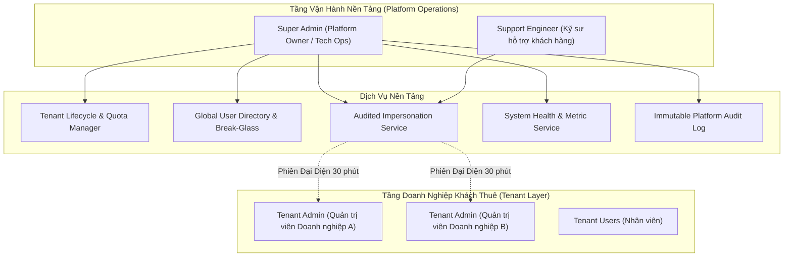
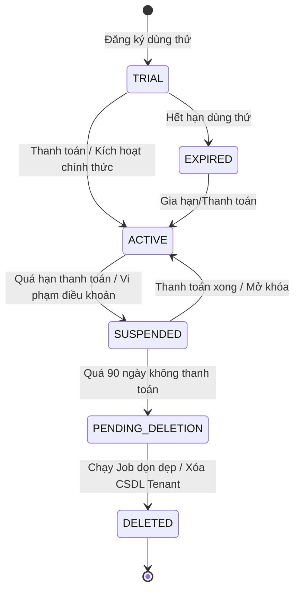
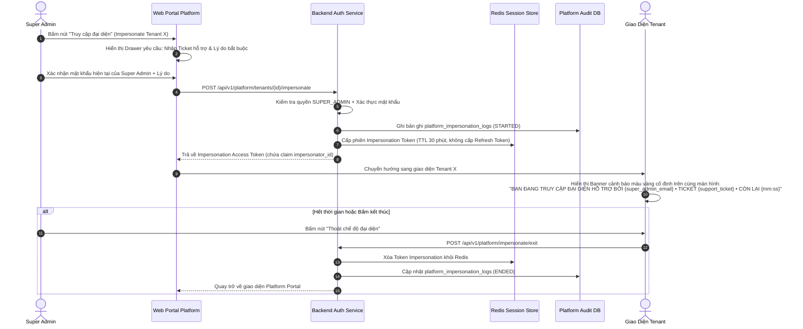

# [ANL-01] Phân Tích Nghiệp Vụ Chuyên Sâu: Cơ Chế Super Admin Quản Lý Toàn Bộ Hệ Thống

- **Mã Tài Liệu**: ANL-01
- **Phụ Trách**: BA Agent
- **Thuộc Sprint**: Sprint 02 - Super Admin & Phân Quyền Toàn Diện
- **Ngày Hoàn Thành**: 2026-09-18

---

## 1. Tổng Quan & Các Tác Nhân Hệ Thống (Actors)

Trong mô hình SaaS Multi-Tenant của Open-ERP, hệ thống phân định rõ rệt giữa hai tầng quản trị: **Tầng Vận Hành Nền Tảng (Platform Layer)** và **Tầng Doanh Nghiệp Khách Thuê (Tenant Layer)**.

### Các Tác Nhân Chính (Actors):
1. **Platform Super Admin**: Người sở hữu hoặc vận hành nền tảng SaaS có toàn quyền cấu hình tham số toàn cục, quản lý Tenant, phân bổ quota tài nguyên và xem xét toàn bộ nhật ký hệ thống.
2. **Platform Support Engineer**: Kỹ sư hỗ trợ kỹ thuật được cấp quyền hỗ trợ khách hàng, có thể khởi tạo phiên truy cập đại diện (Impersonation) với lý do nghiệp vụ cụ thể.
3. **Tenant Admin**: Quản trị viên của một doanh nghiệp khách thuê cụ thể; bị chi phối bởi các hạn mức (Quotas) và trạng thái hoạt động do Super Admin cấu hình.

---

## 2. Phân Tích Chi Tiết Các Khối Chức Năng Cốt Lõi

### 2.1. Quản Trị Vòng Đời Tenant (Tenant Lifecycle Management)

Tenant không chỉ có trạng thái bật/tắt đơn giản mà trải qua một máy trạng thái (State Machine) hoàn chỉnh:

#### Bảng Trạng Thái Tenant:
| Trạng Thái | Ý Nghĩa Nghiệp Vụ | Quyền Của Người Dùng Trong Tenant |
| :--- | :--- | :--- |
| `TRIAL` | Đang dùng thử theo thời hạn (`trial_ends_at`). | Sử dụng đầy đủ tính năng trong hạn mức dùng thử. |
| `ACTIVE` | Đang hoạt động bình thường, gói trả phí. | Toàn quyền hoạt động theo Quota đã thanh toán. |
| `EXPIRED` | Hết hạn dùng thử/gói chưa gia hạn; chặn thêm mới dữ liệu, cho phép Tenant Admin vào trang thanh toán. | Chỉ Tenant Admin xem thông báo; chặn nhân viên. |
| `SUSPENDED` | Bị tạm khóa bởi Super Admin hoặc quá hạn cước. | Chỉ cho phép Tenant Admin đăng nhập xem thông báo cước; chặn toàn bộ nhân viên thao tác dữ liệu. |
| `PENDING_DELETION` | Chờ xóa vĩnh viễn (sau 90 ngày tạm khóa). | Không ai được đăng nhập, dữ liệu đang chờ sao lưu/hủy. |
| `DELETED` | Đã xóa hoặc lưu trữ lạnh. | Đã bị dọn dẹp hoặc gỡ bỏ CSDL. |

#### Mô Hình Hạn Mức Nền Tảng (Platform Quotas & Limits):
Mỗi Tenant được gán một cấu hình hạn mức:
1. `max_users`: Số lượng tài khoản người dùng tối đa được tạo trong Tenant (ví dụ: Gói Free = 5, Standard = 20, Enterprise = Không giới hạn).
2. `max_storage_mb`: Dung lượng lưu trữ file/chứng từ tối đa (MB).
3. `plan_tier`: Gói dịch vụ (`COMMUNITY`, `STANDARD`, `ENTERPRISE`).
4. `allowed_plugins`: Danh sách mã plugin được phép cài đặt (`core`, `sales`, `accounting`, `inventory`...).

---

### 2.2. Quản Lý Người Dùng Toàn Cục & Can Thiệp Khẩn Cấp (Global User Directory & Break-Glass)

1. **Tra Cứu Người Dùng Toàn Nền Tảng**:
   - Super Admin có thể tìm kiếm bất kỳ tài khoản nào theo email, số điện thoại hoặc User ID.
   - Hiển thị danh sách tất cả các Tenant mà tài khoản này đang tham gia kèm vai trò tương ứng.
2. **Khóa Toàn Cục Khẩn Cấp (Global Account Lockout)**:
   - Khi phát hiện tài khoản bị tấn công hoặc có hành vi gian lận trên nền tảng, Super Admin có quyền kích hoạt khóa toàn cục (`users.status = 'LOCKED'`).
   - Ngay lập tức: Tất cả các Refresh Token của tài khoản đó trên Redis bị thu hồi, Access Token đưa vào Blacklist; người dùng bị đẩy văng ra khỏi tất cả các thiết bị.
3. **Cơ Chế Phá Kính Khẩn Cấp (Break-Glass Recovery)**:
   - Khi Tenant Admin duy nhất của một doanh nghiệp bị mất hoàn toàn quyền truy cập (mất thiết bị 2FA, mất cả 8 Backup codes, quên mật khẩu):
   - Super Admin có quy trình Break-Glass: Xác minh danh tính qua kênh offline, sau đó thực hiện lệnh vô hiệu hóa 2FA hoặc gửi link đặt lại mật khẩu đặc biệt vào email của chủ sở hữu doanh nghiệp.
   - Bắt buộc ghi nhận biên bản số (Digital ticket ID & lý do can thiệp) vào Audit Log.

---

### 2.3. Cơ Chế Truy Cập Đại Diện Kiểm Toán (Audited Support Impersonation / "Login-As")

Đây là một trong những tính năng nhạy cảm nhất của nền tảng SaaS. Mọi quy trình phải được thiết kế chống lạm quyền:

#### Các Nguyên Tắc An Toàn Tuyệt Đối Cho Impersonation:
1. **Lý do bắt buộc (Mandatory Justification)**: Bắt buộc nhập lý do có độ dài tối thiểu 10 ký tự và Mã số yêu cầu hỗ trợ (Support Ticket Code).
2. **Thời hạn ngắn (Strict Short TTL)**: Token đại diện có thời hạn tối đa **30 phút**, hoàn toàn **không có Refresh Token**.
3. **Giới hạn thao tác phá hoại (Destructive Action Block)**: Khi mang Token Impersonation, hệ thống tự động chặn các thao tác: Xóa Tenant, Đổi quyền Owner của Tenant, Đổi mật khẩu của Tenant Admin.
4. **Cảnh báo thường trực (Persistent Warning Banner)**: Trên toàn bộ giao diện làm việc của Tenant hiển thị thanh dải băng màu vàng rực rỡ với đồng hồ đếm ngược thời gian phiên hỗ trợ.
5. **Nhật ký bất biến**: Bắt buộc ghi nhận thời điểm bắt đầu, thời điểm kết thúc, IP nguồn và danh sách các thao tác đã thực hiện.
6. **Cấm xuất dữ liệu bí mật (Secret Export Block)**: Trong phiên impersonation cấm export secret (2FA key, hash mật khẩu, API key) — mã lỗi `SUPERADMIN_IMPERSONATION_SECRET_EXPORT_FORBIDDEN`.
7. **Target mặc định khi Impersonation**: Target mặc định là `TENANT_OWNER`; nếu tenant không có OWNER thì lấy `TENANT_ADMIN` đầu tiên.

---

### 2.4. Giám Sát Sức Khỏe Hạ Tầng Nền Tảng (System Health & Infrastructure Monitoring)

Super Admin được cung cấp một trang điều khiển giám sát tài nguyên tối thiểu:
1. **Trạng thái Cơ sở dữ liệu PostgreSQL**:
   - Kết nối DB chính (Primary Read-Write).
   - Trạng thái DB bản sao (Read-Replica) và độ trễ đồng bộ (Replication Lag ms).
   - Kích thước cơ sở dữ liệu và số lượng kết nối đang mở (Connection Pool).
2. **Trạng thái Redis Cache**:
   - Trạng thái kết nối, dung lượng RAM sử dụng, số lượng Key phiên hoạt động (`session:*`).
3. **Trạng thái Apache Kafka Message Broker**:
   - Kết nối Broker, độ trễ xử lý các Topic phân tán.
   - **Ghi chú môi trường tối giản**: Khi chạy Docker Compose minimal profile (không bật Kafka), dịch vụ báo trạng thái `UNKNOWN/DEGRADED`, nhưng API health vẫn trả HTTP 200 kèm `system_status` phù hợp.
4. **Tổng quan số liệu nền tảng (High-level Counters)**:
   - Tổng số Tenant (Active, Trial, Suspended).
   - Tổng số User toàn cầu.
   - Số phiên người dùng đang hoạt động đồng thời (Active Sessions).

---

## 3. Ma Trận Phân Định Nền Tảng: Web Desktop vs Mobile App

| Chức Năng Super Admin | Web Desktop ($\ge$ 1280px) | Mobile Ionic 8 (Phone 390px) | Ghi Chú Trải Nghiệm |
| :--- | :---: | :---: | :--- |
| Danh sách & Tìm kiếm Tenant | Đầy đủ (Lưới dữ liệu, bộ lọc nâng cao) | Thu gọn (Danh sách thẻ, tìm kiếm cơ bản) | Mobile hiển thị tên, trạng thái và nút tác vụ nhanh. |
| Xem chi tiết Quota & Cấu hình hạn mức | Đầy đủ (Drawer trượt, biểu đồ thanh) | Xem nhanh dạng Read-only | Cấu hình hạn mức phức tạp thực hiện trên Desktop. |
| Khóa / Mở khóa khẩn cấp Tenant | Có | Có | Thao tác tác vụ khẩn cấp cho phép thực hiện trên Mobile (kèm xác nhận mật khẩu). |
| Khóa / Mở khóa người dùng toàn cầu | Có | Có | Hỗ trợ xử lý khẩn cấp khi người dùng báo mất tài khoản. |
| Impersonation ("Login-As") | Có đầy đủ | **Không hỗ trợ (Blocked)** | Thao tác can thiệp kỹ thuật phức tạp chỉ thực hiện trên Web Desktop an toàn. |
| Xem Health Check hạ tầng (DB, Redis, Kafka) | Đầy đủ (Metrics, biểu đồ trạng thái) | Thu gọn (Chỉ hiển thị đèn xanh/vàng/đỏ) | Giúp Admin nhận diện nhanh sự cố khi đang di chuyển. |
| Xem Nhật Ký Kiểm Toán (Audit Logs) | Đầy đủ (Bảng dữ liệu phân trang, lọc JSON) | Thu gọn (Xem 20 sự kiện gần nhất) | Phân tích log chuyên sâu thực hiện trên Web Desktop. |

---

## 4. Danh Sách Quy Tắc Nghiệp Vụ (Business Rules)

- **BR-SA-01**: Quyền `SUPER_ADMIN` là quyền toàn cục, được cấp trực tiếp qua cấu hình máy chủ hoặc bảng `platform_super_admins`. Người dùng bình thường trong một Tenant không bao giờ có thể tự nâng cấp lên Super Admin.
- **BR-SA-02**: Không cho phép Super Admin tự khóa chính tài khoản của mình trên cổng quản trị.
- **BR-SA-03**: Khi một Tenant chuyển sang trạng thái `SUSPENDED`, mọi yêu cầu API nghiệp vụ từ người dùng của Tenant đó (ngoại trừ tài khoản Tenant Owner/Admin truy cập trang thanh toán) đều bị chặn đứng với mã lỗi `TENANT_SUSPENDED`.
- **BR-SA-04**: Trong phiên Impersonation, cấm tuyệt đối việc tải về (export) dữ liệu bí mật như khóa bí mật 2FA hoặc hash mật khẩu của khách hàng.
- **BR-SA-05**: Khi Tenant hết hạn dùng thử (`trial_ends_at < NOW()`), hệ thống tự động chuyển trạng thái Tenant sang `EXPIRED`, gửi email thông báo và chặn thao tác thêm mới dữ liệu.
