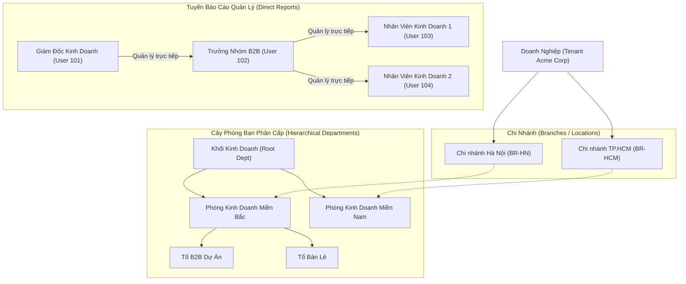
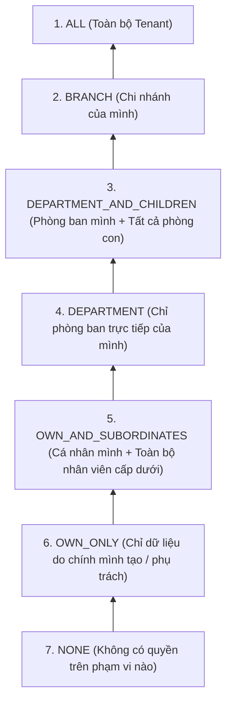
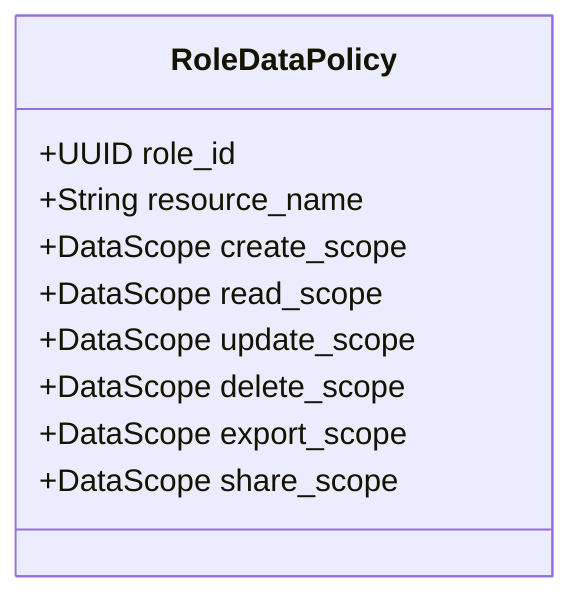

# [ANL-02] Phân Tích Nghiệp Vụ Chuyên Sâu: Phân Quyền Chức Năng, Cơ Cấu Tổ Chức & Phân Quyền Dữ Liệu Đa Phạm Vi

- **Mã Tài Liệu**: ANL-02
- **Phụ Trách**: BA Agent
- **Thuộc Sprint**: Sprint 02 - Super Admin & Phân Quyền Toàn Diện
- **Ngày Hoàn Thành**: 2026-09-18

---

## 1. Nền Tảng Cơ Cấu Tổ Chức Doanh Nghiệp (Organizational Foundation)

Trong thực tế vận hành ERP của doanh nghiệp, không thể phân quyền dữ liệu nếu thiếu **Cơ cấu tổ chức**. Mọi phạm vi dữ liệu (Chi nhánh, Phòng ban, Cấp dưới) đều bắt nguồn từ cấu trúc này:

### Các Khái Niệm Cốt Lõi:
1. **Chi Nhánh (Branch / Location)**: Đơn vị địa lý độc lập có địa chỉ, mã số thuế chi nhánh, kho hàng riêng biệt.
2. **Cây Phòng Ban (Hierarchical Department Tree)**: Cấu trúc hình cây đa cấp (Parent-Child) cho phép một phòng ban chứa các phòng ban hoặc tổ/đội trực thuộc.
3. **Mối Quan Hệ Báo Cáo Quản Lý (Management Reporting Lines)**: Mỗi nhân viên được định nghĩa rõ ai là người quản lý trực tiếp (`direct_manager_user_id`), hình thành chuỗi cấp trên - cấp dưới (Manager - Subordinates chain).
4. **Chi Nhánh Thành Viên và Chi Nhánh Được Quản Lý (Member vs Managed Branches)**: `member_branch_ids` là các Chi nhánh mà user thuộc biên chế qua membership phòng ban; `managed_branch_ids` là các Chi nhánh user được phân công quản lý qua bảng `user_branch_assignments` (TASK-287). Quản lý cấp cao (ví dụ Giám đốc vùng) có thể phụ trách nhiều Chi nhánh mà **không cần membership giả** tại từng Chi nhánh. Mỗi user có tối đa **một Chi nhánh chính (`primary_branch`)** dùng làm Chi nhánh mặc định khi tạo bản ghi (CREATE).

---

## 2. Phân Quyền Chức Năng (Functional RBAC)

Phân quyền chức năng kiểm soát **Người dùng được phép truy cập màn hình nào và gọi các hành động chức năng nào**.

### 2.1. Chuẩn Định Danh Quyền Hạn (Permission Code Standard)
Mọi quyền trong hệ thống tuân thủ định dạng 3 phần:
$$\text{domain} : \text{resource} : \text{action}$$

- **Domain**: Tên phân hệ lớn (`core`, `sales`, `accounting`, `inventory`, `crm`...).
- **Resource**: Thực thể nghiệp vụ (`user`, `role`, `department`, `customer`, `order`, `invoice`...).
- **Action**: Hành động chức năng (`read`, `create`, `update`, `delete`, `export`, `approve`...).

*Ví dụ chuẩn*:
- `core:user:create`: Quyền thêm người dùng mới vào doanh nghiệp.
- `core:role:update`: Quyền chỉnh sửa cấu hình vai trò.
- `sales:order:approve`: Quyền duyệt đơn hàng bán.

### 2.2. Phân Loại Vai Trò (System Roles vs Custom Roles)
1. **Vai Trò Hệ Thống (Built-in System Roles)**:
   - Được định nghĩa sẵn khi khởi tạo Tenant, không thể bị xóa hoặc đổi mã:
     - `TENANT_OWNER`: Người sở hữu doanh nghiệp, có toàn bộ các quyền tuyệt đối, không bị giới hạn bất kỳ phạm vi nào.
     - `TENANT_ADMIN`: Quản trị viên hệ thống của Tenant, quản lý người dùng, vai trò, cấu hình.
     - `GENERAL_MANAGER`: Ban giám đốc, quyền xem toàn diện và phê duyệt.
     - `STAFF`: Nhân viên thông thường, thực hiện nghiệp vụ hàng ngày.
     - `VIEWER`: Chỉ xem, không có quyền thêm sửa xóa.
2. **Vai Trò Tùy Biến (Custom Roles)**:
   - Do Tenant Admin tự tạo theo cơ cấu thực tế (ví dụ: `Trưởng phòng thu mua`, `Kế toán công nợ`, `Nhân viên kinh doanh HN`).
   - Có thể gán danh sách quyền tùy chọn và tinh chỉnh ma trận dữ liệu.

---

## 3. Phân Quyền Dữ Liệu Đa Phạm Vi (Multi-Scope Data Access Control)

Phân quyền chức năng chỉ trả lời câu hỏi *"User có quyền sửa đơn hàng không?"*, nhưng **Phân quyền dữ liệu** sẽ trả lời câu hỏi *"User được sửa NHỮNG ĐƠN HÀNG NÀO?"*.

### 3.1. Danh Sách 7 Phạm Vi Dữ Liệu Chuẩn Mực (Data Scopes Hierarchy)

| Tên Scope | Ký Hiệu Enum | Ý Nghĩa Nghiệp Vụ & Quy Tắc Lọc SQL | Áp Dụng Điển Hình |
| :--- | :--- | :--- | :--- |
| **Toàn công ty** | `ALL` | Xem/thao tác trên toàn bộ dữ liệu của Tenant. `tenant_id = :currentTenantId` | Ban giám đốc, Kế toán trưởng, Kiểm toán nội bộ |
| **Chi nhánh** | `BRANCH` | Xem/thao tác dữ liệu thuộc mọi Chi nhánh mà người dùng là thành viên hoặc được phân công quản lý (union). `tenant_id = :currentTenantId AND branch_id IN (:effectiveBranchIds)` *Trong đó `effectiveBranchIds = member_branch_ids ∪ managed_branch_ids` (BR-RBAC-08)* | Giám đốc chi nhánh, Giám đốc vùng, Thủ kho chi nhánh |
| **Phòng ban & Phòng con** | `DEPARTMENT_AND_CHILDREN` | Dữ liệu thuộc phòng ban của user hoặc bất kỳ phòng ban con nào trong cây tổ chức. `department_id IN (:userDeptAndSubDeptIds)` | Trưởng khối, Trưởng phòng lớn quản lý nhiều tổ nhỏ |
| **Chỉ phòng ban** | `DEPARTMENT` | Chỉ dữ liệu thuộc đúng phòng ban trực tiếp của user. `department_id = :userDeptId` | Trưởng nhóm, Nhân sự phụ trách phòng ban |
| **Cá nhân & Cấp dưới** | `OWN_AND_SUBORDINATES` | Dữ liệu do chính user tạo/phụ trách HOẶC do bất kỳ cấp dưới nào theo tuyến báo cáo tạo ra. `owner_id = :userId OR owner_id IN (:subordinateIds)` | Trưởng nhóm kinh doanh, Đội trưởng đội dự án |
| **Chỉ bản thân** | `OWN_ONLY` | Chỉ bản ghi do chính user tạo ra (`created_by`) hoặc được giao làm đầu mối phụ trách (`assignee_id`). `created_by = :userId OR assignee_id = :userId` | Nhân viên bán hàng, Chuyên viên kỹ thuật |

> **Ghi chú phạm vi**: `CUSTOM`/ABAC nâng cao thuộc Out-of-Scope Sprint 02 (xem CONF-01 mục 2). Mọi entity áp dụng data-scope bắt buộc có cột `assignee_id` để công thức `OWN_ONLY` và `OWN_AND_SUBORDINATES` hoạt động thống nhất.

---

## 4. Ma Trận 6 Thao Tác Tác Động Dữ Liệu (Data Operations)

Đối với từng tài nguyên dữ liệu (ví dụ: `CUSTOMER`, `SALE_ORDER`, `PURCHASE_ORDER`, `INVOICE`, `EMPLOYEE`), quyền của một Vai trò được thiết lập độc lập cho **6 thao tác**:

1. **`CREATE` (Tạo mới dữ liệu)**:
   - Quy định phạm vi mà bản ghi mới được sinh ra. Ví dụ: Nếu `create_scope = BRANCH`, nhân viên chỉ được tạo đơn hàng gắn với Chi nhánh của mình, không được tạo đơn cho chi nhánh khác.
2. **`READ` (Xem dữ liệu)**:
   - Giới hạn các bản ghi xuất hiện trong danh sách tìm kiếm và màn hình xem chi tiết.
3. **`UPDATE` (Chỉnh sửa dữ liệu)**:
   - Giới hạn các bản ghi mà người dùng được phép chỉnh sửa nội dung. Thông thường `update_scope` hẹp hơn hoặc bằng `read_scope` (Ví dụ: Cho xem toàn bộ chi nhánh, nhưng chỉ sửa đơn hàng của chính mình).
4. **`DELETE` (Xóa dữ liệu)**:
   - Giới hạn bản ghi được phép xóa hoặc lưu trữ. Thường được thắt chặt ở mức `OWN_ONLY` hoặc cấm hoàn toàn (`NONE`) với nhân viên cấp thấp.
5. **`EXPORT` (Xuất file ra ngoài hệ thống)**:
   - Kiểm soát quyền kết xuất file Excel/CSV/PDF danh sách hàng loạt. Đây là chốt chặn then chốt để chống đánh cắp cơ sở dữ liệu khách hàng.
6. **`SHARE` (Chia sẻ / Chuyển giao quyền sở hữu)**:
   - Quyền chuyển giao người phụ trách (`assignee_id`) hoặc chia sẻ bản ghi cho cá nhân/phòng ban khác xem tạm thời.

---

## 5. Nguyên Tắc Gộp Quyền Khi Người Dùng Mang Nhiều Vai Trò (Union / Most Permissive Rule)

Một người dùng trong doanh nghiệp có thể được gán nhiều vai trò (ví dụ: vừa là `Kinh doanh B2B` vừa là `Trợ lý Ban giám đốc`). Khi đó, hệ thống áp dụng nguyên tắc **Quyền mở rộng nhất (Most Permissive)**:

$$\text{Effective Scope} = \max(\text{Scope}_{\text{Role 1}}, \text{Scope}_{\text{Role 2}}, \dots)$$

Thứ tự ưu tiên phạm vi từ hẹp đến rộng:
$$\text{NONE} < \text{OWN\_ONLY} < \text{OWN\_AND\_SUBORDINATES} < \text{DEPARTMENT} < \text{DEPARTMENT\_AND\_CHILDREN} < \text{BRANCH} < \text{ALL}$$

*Ví dụ minh họa*:
- Vai trò `Kinh doanh B2B`: Có quyền `READ` đơn hàng với scope = `OWN_ONLY`.
- Vai trò `Trợ lý Ban giám đốc`: Có quyền `READ` đơn hàng với scope = `ALL`.
- $\rightarrow$ **Quyền đọc thực tế của người dùng đối với đơn hàng là: `ALL` (Xem được toàn bộ đơn hàng công ty)**.
- Tuy nhiên, với thao tác `DELETE`: Cả hai vai trò đều là `NONE` $\rightarrow$ **Người dùng tuyệt đối không được xóa đơn hàng nào**.

---

## 6. Ma Trận Phân Định Nền Tảng: Web Desktop vs Mobile App

| Nghiệp Vụ Phân Quyền | Web Desktop ($\ge$ 1280px) | Mobile Ionic 8 (Phone 390px) | Trải Nghiệm Tương Tác |
| :--- | :---: | :---: | :--- |
| Sơ đồ Cơ cấu tổ chức (Cây phòng ban) | Cây trực quan kéo thả, chia cột | Danh sách phân cấp lồng nhau | Desktop hỗ trợ kéo thả đổi phòng ban cha; Mobile xem danh sách và lọc. |
| Danh sách Vai trò (Roles) | Bảng phân loại có đếm số lượng user | Danh sách thẻ gọn | Đầy đủ thông tin trên cả hai nền tảng. |
| Ma trận Phân quyền chức năng | Lưới Switch Toggle đa cột mật độ cao | Danh sách nhóm chức năng theo Drawer | Desktop cấu hình hàng loạt; Mobile hỗ trợ bật/tắt nhanh từng mục. |
| Ma trận Phân quyền dữ liệu 6 thao tác | Lưới Matrix 2 chiều: Dòng là Resource, Cột là 6 thao tác Dropdown | Xem chi tiết dạng thẻ từng Resource | Desktop chỉnh sửa ma trận tổng quan nhanh chóng; Mobile hỗ trợ xem và điều chỉnh đơn lẻ. |
| Gán Vai trò cho Nhân sự | Drawer trượt đa chọn kèm tìm kiếm | Drawer/Action Sheet trượt chọn nhanh (Anti-Modal) | Tìm kiếm và chọn nhanh vai trò cho nhân viên. |

---

## 7. Danh Sách Quy Tắc Nghiệp Vụ (Business Rules)

- **BR-RBAC-01**: Vai trò `TENANT_OWNER` luôn có toàn bộ quyền chức năng và mọi thao tác dữ liệu đều là scope `ALL`. Hệ thống không cho phép sửa đổi hoặc hạ quyền của `TENANT_OWNER`.
- **BR-RBAC-02**: Không cho phép xóa một Vai trò nếu vẫn còn người dùng đang được gán vai trò đó. Phải điều chuyển người dùng sang vai trò khác trước.
- **BR-RBAC-03**: Một người dùng bắt buộc phải thuộc ít nhất một Phòng ban chính (`is_primary = true`) và một Chi nhánh để hệ thống tính toán được phạm vi dữ liệu tự động.
- **BR-RBAC-04**: Tuyến báo cáo quản lý (`direct_manager_user_id`) không được tạo thành vòng lặp khép kín (ví dụ: A quản lý B, B quản lý C, C quản lý A). Hệ thống phải kiểm tra phát hiện chu trình (Cycle Detection) khi cập nhật người quản lý.
- **BR-RBAC-05**: Khi người dùng bị đổi Vai trò hoặc đổi Phòng ban, hệ thống tự động xóa Cache phân quyền của người dùng đó trên Redis ngay lập tức (Event-driven Cache Invalidation).
- **BR-RBAC-06**: Chỉ `TENANT_OWNER`/`TENANT_ADMIN` có quyền `core:role:manage`/`core:organization:manage` mới được cấu hình RBAC/Org; mọi API enforce bằng `@RequirePermission`.
- **BR-RBAC-07**: Mọi user hiện hữu phải được backfill Chi nhánh mặc định "HQ" + Phòng ban mặc định "GENERAL" khi nâng cấp Sprint 02.
- **BR-RBAC-08**: Phạm vi `BRANCH` được tính bằng **hợp (union)** của Chi nhánh thành viên (`member_branch_ids`) và Chi nhánh được quản lý (`managed_branch_ids`): `effective_branch_ids = member_branch_ids ∪ managed_branch_ids`. Mọi tính toán scope, hiển thị và compiler SQL bắt buộc dùng `effective_branch_ids`, không dùng danh sách membership đơn lẻ.
- **BR-RBAC-09**: Mỗi user có tối đa **một** Chi nhánh chính (`primary_branch`, ràng buộc partial unique index `uq_user_primary_branch`). `primary_branch` được dùng làm Chi nhánh mặc định khi tạo bản ghi (CREATE) nếu request không truyền `branch_id`.
- **BR-RBAC-10**: `membership.branch_id` bắt buộc khớp `departments.branch_id` khi phòng ban có gán Chi nhánh; phòng ban xuyên chi nhánh được phép khai báo `branch_id NULL` và khi đó membership được tự do chọn Chi nhánh thuộc `effective_branch_ids` của user.
- **BR-RBAC-11**: Gán hoặc thay đổi `departments.manager_user_id` bắt buộc **tự động đồng bộ membership** cho trưởng bộ phận (tạo/cập nhật `user_department_memberships` tương ứng) nhằm đảm bảo chỉ tồn tại **một nguồn scope thống nhất**; tuyệt đối không tạo nguồn tính scope thứ hai song song.
