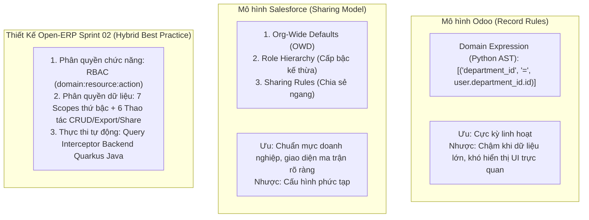

# [BENCH-01] Nghiên Cứu Đối Chuẩn Thị Trường: Super Admin Nền Tảng & Hệ Thống Phân Quyền Đa Phạm Vi

- **Mã Tài Liệu**: BENCH-01
- **Phụ Trách**: BA Agent
- **Thuộc Sprint**: Sprint 02 - Super Admin & Phân Quyền Toàn Diện
- **Ngày Hoàn Thành**: 2026-09-18

---

## 1. Mục Đích Khảo Sát & Đối Chuẩn (Benchmarking Objectives)

Để xây dựng hệ thống Open-ERP có năng lực cạnh tranh toàn cầu và kế thừa những tinh hoa thiết kế đã được kiểm chứng qua hàng chục năm, chúng tôi tiến hành khảo sát và đối chuẩn với 4 hệ thống ERP & IAM đầu ngành:
1. **Odoo ERP**: Nổi tiếng với mô hình Record Rules (`ir.rule`) và phân quyền nhóm người dùng (`res.groups`).
2. **Salesforce CRM/ERP**: Chuẩn mực thế giới về cơ chế bảo mật đa tầng (Org-Wide Defaults, Role Hierarchy, Sharing Rules).
3. **SAP S/4HANA**: Hệ thống ERP doanh nghiệp lớn với cơ chế Authorization Objects và Organizational Levels.
4. **Mô hình Google Zanzibar / Permify & Casbin**: Các công nghệ phân quyền hiện đại hàng đầu cho kiến trúc Microservices & Cloud-Native.

---

## 2. So Sánh Cơ Chế Super Admin & Quản Lý Nền Tảng SaaS

| Tiêu Chí So Sánh | Odoo (Odoo.sh / SaaS Control) | Keycloak (Master Realm) | Salesforce (Control Force / Partner Org) | Thiết Kế Của Open-ERP (Sprint 02) |
| :--- | :--- | :--- | :--- | :--- |
| **Mô hình cô lập tài khoản Admin** | Cơ sở dữ liệu độc lập cho master control; phân tách hoàn toàn với database của khách. | Master Realm là cảnh giới cha quản lý toàn bộ các Tenant Realm con. | Tài khoản Admin nền tảng tách biệt, dùng giao diện riêng và xác thực MFA cấp cao. | **Platform Context độc lập**: `SUPER_ADMIN` không thuộc Tenant nào (`tenant_id = null`), có route riêng `/platform/*` và Guard bảo vệ chuyên biệt. |
| **Cơ chế Đăng nhập đại diện (Impersonation)** | Cho phép truy cập qua SSH hoặc web token trực tiếp từ portal. | Chức năng "Impersonate" tích hợp sẵn trong console nhưng khó hạn chế thời gian tự động. | "Login Access Granted" - Yêu cầu Tenant phải chủ động bật cấp phép hỗ trợ trước. | **Impersonation an toàn có kiểm toán**: Yêu cầu nhập lý do + mã ticket, token TTL 30 phút, cấm refresh, banner cảnh báo đếm ngược và log bất biến. |
| **Kiểm soát Hạn mức (Quotas)** | Kiểm soát số user và dung lượng file qua công cụ quản lý subscription. | Quota giới hạn theo realm setting (số client, số user). | Giới hạn dung lượng Storage, API Calls/ngày, số license chặt chẽ. | **Bảng Quota linh hoạt**: `max_users`, `max_storage_mb`, `plan_tier`, tự động khóa khi hết hạn dùng thử (`trial_ends_at`). |

---

## 3. So Sánh Cơ Chế Phân Quyền Dữ Liệu & Thao Tác

### 3.1. Phân Tích Chuyên Sâu Mô Hình Odoo ERP
- **Cơ chế**: Odoo sử dụng hai khái niệm: `Access Rights` (phân quyền theo Model với 4 cờ: Read, Write, Create, Unlink) và `Record Rules` (lọc dòng dữ liệu dựa trên câu lệnh Domain Python).
- **Điểm mạnh**: Người dùng kỹ thuật có thể viết các điều kiện tùy biến rất sâu (ví dụ: `[('state', '=', 'confirmed'), ('user_id', '=', user.id)]`).
- **Điểm yếu**:
  - Người dùng nghiệp vụ bình thường không thể tự cấu hình được vì phải biết cú pháp Polish notation của Odoo Domain.
  - Mỗi khi query, Odoo phải dịch Python domain sang SQL WHERE clause bằng ORM, gây chậm đáng kể khi dữ liệu lên tới hàng triệu dòng hoặc join nhiều bảng.

### 3.2. Phân Tích Chuyên Sâu Mô Hình Salesforce
- **Cơ chế**:
  - `Org-Wide Defaults (OWD)`: Xác định mức bảo mật sàn (Private, Public Read Only, Public Read/Write).
  - `Role Hierarchy`: Tự động mở rộng quyền lên cấp trên. Nếu nhân viên A có quyền xem bản ghi thì sếp của A và sếp của sếp cũng tự động xem được.
  - `Sharing Rules`: Mở rộng quyền xem/sửa giữa các nhóm ngang hàng.
- **Điểm mạnh**: Rất chuẩn chỉnh cho doanh nghiệp đa tầng; hỗ trợ quyền Xuất file (Export Reports) riêng biệt để chống lộ lọt data.
- **Điểm yếu**: Quá phức tạp và cồng kềnh với các doanh nghiệp vừa và nhỏ (SME).

### 3.3. Phân Tích Chuyên Sâu Mô Hình SAP S/4HANA
- **Cơ chế**: `Authorization Objects` chứa tối đa 10 trường (Authorization Fields). Có trường `ACTVT` (Activity) chuẩn hóa các thao tác:
  - `01`: Create
  - `02`: Change (Update)
  - `03`: Display (Read)
  - `06`: Delete
  - Các trường Org-Level: Công ty (Company Code), Nhà máy/Chi nhánh (Plant), Bộ phận bán hàng (Sales Org).
- **Điểm mạnh**: Cực kỳ chặt chẽ, tối ưu hóa mức độ thực thi trong nhân hệ thống.
- **Điểm yếu**: Giao diện cấu hình cũ kỹ (Transaction PFCG), phân mảnh khó sử dụng.

---

## 4. Bài Học Đúc Rút & Quyết Định Áp Dụng Cho Open-ERP

Từ việc khảo sát các hệ thống trên, chúng tôi chắt lọc giải pháp tối ưu cho Open-ERP:

1. **Kết Hợp Ma Trận Giao Diện Trực Quan (Salesforce/SAP) Với Sự Linh Hoạt (Odoo)**:
   - Thay vì bắt người dùng viết biểu thức code, Open-ERP cung cấp **Lưới Ma Trận 2 Chiều trực quan**:
     - Cột dọc: Danh sách Thực thể nghiệp vụ (`Khách hàng`, `Đơn hàng`, `Hóa đơn`...).
     - Cột ngang: 6 thao tác dữ liệu chuẩn (`Tạo`, `Xem`, `Sửa`, `Xóa`, `Xuất file`, `Chia sẻ`).
     - Mỗi ô lựa chọn: Dropdown 7 phạm vi chuẩn (`ALL`, `BRANCH`, `DEPARTMENT_AND_CHILDREN`, `DEPARTMENT`, `OWN_AND_SUBORDINATES`, `OWN_ONLY`, `NONE`).
   - Vừa dễ hiểu cho người làm nghiệp vụ, vừa đảm bảo tính bảo mật nghiêm ngặt.
2. **Quyền Xuất Dữ Liệu (Export) Độc Lập**:
   - Học hỏi từ Salesforce: Tách riêng quyền `EXPORT` thành một cột độc lập. Rất nhiều doanh nghiệp cho phép nhân viên xem toàn bộ khách hàng để không gọi trùng, nhưng **tuyệt đối cấm xuất Excel danh sách khách hàng** để tránh mang ra ngoài bán cho đối thủ.
3. **Thực Thi Tự Động Ở Tầng CSDL (Query Rewriter trong Quarkus)**:
   - Không xử lý lọc trên bộ nhớ (In-memory filtering) như một số thư viện Node.js/Python vì sẽ gây tràn RAM và chậm trễ.
   - Biên dịch ma trận Scope thành mệnh đề `WHERE` được tham số hóa (Parameterized SQL) tiêm thẳng vào truy vấn cơ sở dữ liệu PostgreSQL. Kết hợp đánh chỉ mục Composite Index để đạt tốc độ phản hồi $< 50ms$.
4. **Cơ Chế Impersonation Vượt Trội**:
   - Kế thừa sự tiện lợi của Keycloak/Odoo nhưng bổ sung cơ chế kiểm toán an toàn nhất: Token 30 phút, lý do bắt buộc, banner cảnh báo thường trực và lưu log bất biến.
