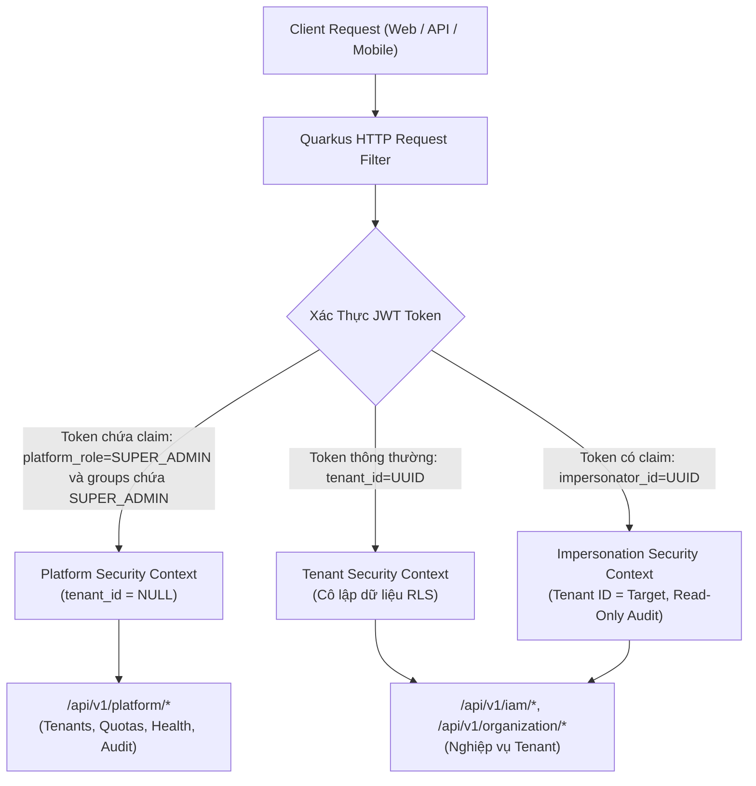
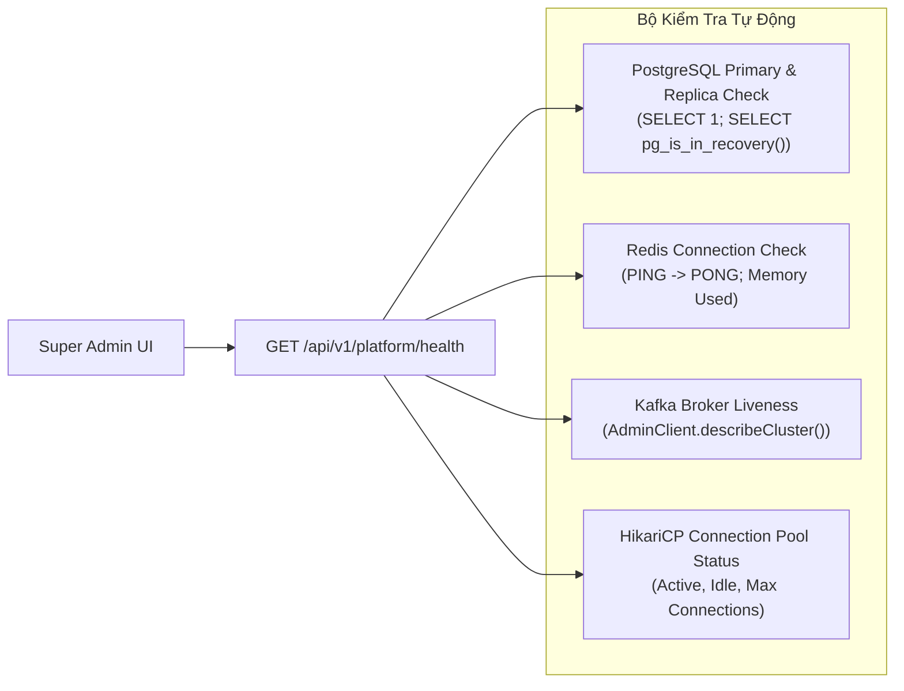

# [SOL-01] Nghiên Cứu Giải Pháp Kỹ Thuật: Kiến Trúc Super Admin & An Toàn Nền Tảng

- **Mã Tài Liệu**: SOL-01
- **Phụ Trách**: Solution Architect Agent
- **Thuộc Sprint**: Sprint 02 - Super Admin & Phân Quyền Toàn Diện
- **Ngày Hoàn Thành**: 2026-09-18

---

## 1. Kiến Trúc Tách Biệt Ngữ Cảnh Nền Tảng (Platform Context Separation)

Trong hệ thống SaaS Multi-tenant của Open-ERP, rủi ro lớn nhất là sự nhầm lẫn giữa **Tài khoản Khách thuê (Tenant Account)** và **Tài khoản Vận hành Nền tảng (Platform Super Admin)**.



### 1.1. Cấu Trúc JWT Claims Dành Cho Super Admin
Khi một Super Admin đăng nhập vào cổng quản trị nền tảng:
```json
{
  "sub": "b2c9a101-0000-4000-a000-000000000001",
  "email": "ops-admin@openerp.9ms.io.vn",
  "platform_role": "SUPER_ADMIN",
  "groups": ["SUPER_ADMIN"],
  "tenant_id": null,
  "iss": "https://openerp.9ms.io.vn/auth",
  "exp": 1758200000,
  "jti": "jwt-platform-session-uuid"
}
```
- **Ràng buộc an toàn**: Các API nghiệp vụ thông thường (`/api/v1/sales/*`, `/api/v1/customers/*`) khi nhận được token có `tenant_id == null` sẽ ngay lập tức từ chối (`400 Bad Request` hoặc `403 Forbidden`) vì không thể thực thi trong ngữ cảnh rỗng.
- Ngược lại, các endpoint quản trị `/api/v1/platform/*` bắt buộc phải có annotation `@RolesAllowed("SUPER_ADMIN")` hoặc `@PlatformAdminOnly`.
- **Bắt buộc set song song `platform_role` và `groups` (BUG-65)**: Quarkus SmallRye JWT Security (`@RolesAllowed`) đọc roles từ claim **`groups`**, do đó token Super Admin phải chứa cả `platform_role: "SUPER_ADMIN"` (dùng cho logic phân tách Platform Context) **lẫn** `groups: ["SUPER_ADMIN"]` (dùng cho `@RolesAllowed("SUPER_ADMIN")`). Token thiếu `groups` sẽ bị mọi endpoint platform từ chối `401/403` dù `platform_role` đúng.

### 1.2. Bootstrap Super Admin (TASK-274)
Hệ thống **không hardcode** tài khoản Super Admin trong migration. Một bean `@Startup` (observer `StartupEvent`) đọc danh sách email từ cấu hình Quarkus `openerp.platform.bootstrap-emails` (ví dụ: `ops-admin@openerp.9ms.io.vn,cto@openerp.9ms.io.vn`) và seed **idempotent** khi khởi động:

1. Với mỗi email, tìm `users` theo email:
   - Chưa tồn tại $\rightarrow$ tạo user nền tảng (`tenant_id = NULL`, `status = ACTIVE`), mật khẩu tạm thời ngẫu nhiên và bắt buộc đổi ở lần đăng nhập đầu tiên.
   - Đã tồn tại $\rightarrow$ bỏ qua, không ghi đè mật khẩu/trạng thái.
2. `INSERT ... ON CONFLICT (user_id) DO NOTHING` bản ghi vào `platform_super_admins` với `role = 'SUPER_ADMIN'`, `is_active = TRUE`.
3. Cấu hình rỗng hoặc lỗi định dạng email $\rightarrow$ ghi log `WARN` và bỏ qua an toàn, không làm sập ứng dụng.

Đặc tính: chạy lại nhiều lần không tạo trùng dữ liệu; chỉ khác nhau giữa các môi trường qua giá trị cấu hình.

---

## 2. Giải Pháp Kỹ Thuật Cho Cơ Chế Impersonation ("Login-As")

### 2.1. Cấu Trúc Token Impersonation
Khi Super Admin yêu cầu hỗ trợ một Tenant X:
```json
{
  "sub": "user-uuid-of-target-selected",
  "target_user_id": "user-uuid-of-target-selected",
  "tenant_id": "tenant-uuid-acme-corp",
  "impersonator_id": "super-admin-uuid",
  "impersonator_email": "ops-admin@openerp.9ms.io.vn",
  "support_ticket": "TCK-1024",
  "is_impersonation": true,
  "exp": 1758201800,
  "jti": "imp-token-uuid"
}
```
- **Chọn `target_user_id` (BUG-57)**: Request `POST /api/v1/platform/tenants/{tenant_id}/impersonate` có thể truyền `target_user_id` (tùy chọn) khi Super Admin cần đại diện đúng một nhân viên cụ thể. Nếu bỏ trống, hệ thống tự chọn theo thứ tự ưu tiên:
  1. User đang có role `TENANT_OWNER`.
  2. Fallback: user có role `TENANT_ADMIN` đầu tiên (theo `assigned_at`).
  3. Không tìm được $\rightarrow$ từ chối `400` với mã `PLATFORM_IMPERSONATION_TARGET_NOT_FOUND`.

  `target_user_id` được chọn bắt buộc thuộc đúng `tenant_id` và đang có membership hợp lệ.
- Token impersonation **bắt buộc chứa `target_user_id`**; `sub` phải bằng chính `target_user_id` để downstream service xử lý như người dùng thật.
- **Thời gian hết hạn (TTL)**: Cố định **1800 giây (30 phút)**. Không cấp `refresh_token`.
- **Lưu trữ trạng thái trong Redis**:
  - Key: `impersonation:session:{imp-token-uuid}`
  - Value: `{ "super_admin_id": "...", "tenant_id": "...", "target_user_id": "...", "started_at": 1758200000 }`
  - TTL: 1800 giây.
  - Khi Super Admin bấm "Thoát chế độ đại diện", hệ thống xóa key này trên Redis, biến token thành vô hiệu ngay lập tức.
- **Guard cho `POST /api/v1/platform/impersonate/exit` (BUG-65)**: Endpoint này chấp nhận token có `is_impersonation = true` **kể cả khi token không mang `platform_role`/`groups` của Super Admin** (token impersonation chỉ chứa danh tính target). Điều kiện hợp lệ: `is_impersonation = true` **VÀ** key Redis `impersonation:session:{jti}` vẫn còn tồn tại; nếu key đã bị xóa/hết hạn $\rightarrow$ `401` `PLATFORM_IMPERSONATION_SESSION_EXPIRED`. Vì vậy endpoint exit **không** dùng `@RolesAllowed("SUPER_ADMIN")`.

### 2.2. Kiểm Soát Hành Động Phá Hoại (Destructive Mutation Guard)
Trong Quarkus ContainerRequestFilter:
```java
if (securityContext.isImpersonation()) {
    String method = requestContext.getMethod();
    String path = requestContext.getUriInfo().getPath();
    
    // Cấm xóa Tenant, cấm đổi chủ sở hữu, cấm đổi mật khẩu user
    if (isDestructiveAction(method, path)) {
        throw new BusinessException("SUPERADMIN_IMPERSONATION_DESTRUCTIVE_ACTION_FORBIDDEN");
    }
}
```

- **Chặn rò rỉ bí mật (BUG-68)**: Trong chế độ impersonation, mọi hành vi đọc/xuất các trường nhạy cảm (`secret_key_enc`, `password_hash`, API key, refresh token) đều bị chặn ở tầng filter/serializer với mã lỗi `SUPERADMIN_IMPERSONATION_SECRET_EXPORT_FORBIDDEN`:
```java
if (securityContext.isImpersonation() && readsSensitiveSecret(method, path, responseFields)) {
    throw new BusinessException("SUPERADMIN_IMPERSONATION_SECRET_EXPORT_FORBIDDEN");
}
```
Áp dụng cho cả trường hợp export file (CSV/Excel) lẫn endpoint trả chi tiết cấu hình plugin/tenant (danh sách secret/API key bị loại bỏ hoàn toàn khỏi payload).

---

## 3. Kiến Trúc Nhật Ký Kiểm Toán Bất Biến (Immutable Audit Trail)

### 3.1. Thiết Kế Chống Sửa Đổi (Append-Only Design)
- Bảng `platform_audit_logs` trong PostgreSQL được cấu hình quyền:
  - **Production**: tạo DB role riêng `openerp_app`; chỉ cấp `SELECT, INSERT` và thu hồi triệt để `UPDATE/DELETE`:
    ```sql
    GRANT SELECT, INSERT ON platform_audit_logs TO openerp_app;
    REVOKE UPDATE, DELETE ON platform_audit_logs FROM openerp_app;
    ```
  - **Local Dev tối giản (TASK/BUG-70)**: môi trường dev dùng user `openerp` (owner do Docker Compose tạo) để thuận tiện migration/debug; do đó tính bất biến trên dev được đảm bảo bằng trigger bên dưới — đúng hành vi như production, không khác biệt logic.
- Kèm theo Trigger PostgreSQL chặn sửa xóa:
  ```sql
  CREATE OR REPLACE FUNCTION prevent_audit_log_modification()
  RETURNS TRIGGER AS $$
  BEGIN
      RAISE EXCEPTION 'Audit log entries are immutable and cannot be updated or deleted!';
  END;
  $$ LANGUAGE plpgsql;

  CREATE TRIGGER trg_audit_log_immutable
  BEFORE UPDATE OR DELETE ON platform_audit_logs
  FOR EACH ROW EXECUTE FUNCTION prevent_audit_log_modification();
  ```
- **Ngoại lệ có kiểm soát**: Bảng `platform_impersonation_logs` **KHÔNG** áp trigger immutable, vì luồng nghiệp vụ bắt buộc `UPDATE` cột `status`/`ended_at` khi phiên kết thúc (`STARTED → ENDED/TIMEOUT`). Bảng này vẫn bị `REVOKE DELETE` với role ứng dụng; thao tác `UPDATE` chỉ thực hiện bên trong service nội bộ.

### 3.2. Cấu Trúc Dữ Liệu Nhật Ký
Mỗi bản ghi log bao gồm:
- `id`: UUID.
- `actor_user_id`: ID của Super Admin hoặc kỹ sư hỗ trợ.
- `action`: Mã hành động (`TENANT_LOCK`, `TENANT_UNLOCK`, `TENANT_QUOTA_UPDATE`, `USER_GLOBAL_LOCK`, `IMPERSONATION_START`, `IMPERSONATION_END`).
- `target_tenant_id`: ID của Tenant bị tác động (nếu có).
- `target_user_id`: ID của User bị can thiệp (nếu có).
- `details`: Đối tượng JSONB chứa giá trị trước (old_val) và giá trị sau (new_val).
- `ip_address`: Địa chỉ IP nguồn của request.
- `user_agent`: Trình duyệt/Client gọi API.
- `created_at`: Dấu thời gian chính xác `TIMESTAMP WITH TIME ZONE DEFAULT NOW()`.

---

## 4. Kiến Trúc Giám Sát Sức Khỏe Hạ Tầng (System Health Monitoring)

Hệ thống sử dụng các tiện ích gốc của **SmallRye Health (MicroProfile Health)**. Các quyết định kỹ thuật bắt buộc:
- **Dependency (BUG-64)**: bổ sung `io.quarkus:quarkus-smallrye-health` vào `pom.xml`; một số cấu hình Quarkus tối giản không kéo sẵn extension này. Các health check tùy biến kế thừa `HealthCheck` và được đăng ký qua CDI.
- **Enum `SystemHealthStatus`**: `HEALTHY | DEGRADED | DOWN | UNKNOWN` (đồng bộ Java `com.vn9melody.openerp.common.enums` và TypeScript `@shared/enums`):
  - `HEALTHY`: mọi thành phần bắt buộc (PostgreSQL Primary, Redis) đều UP.
  - `DEGRADED`: thành phần bắt buộc vẫn UP nhưng có thành phần tùy chọn DOWN/UNKNOWN.
  - `DOWN`: thành phần bắt buộc DOWN.
  - `UNKNOWN`: chưa đủ dữ liệu để kết luận.
- **Hồ sơ dev tối giản (minimal profile)**: khi Kafka không được bật, health check Kafka không khởi tạo $\rightarrow$ trả `kafka.status = "UNKNOWN"` và tổng hợp `system_status = "DEGRADED"` (Kafka là thành phần tùy chọn ở dev, không tính là DOWN).



- **PostgreSQL Replica Check**: Kiểm tra xem cơ chế Master - Slave có hoạt động không và đo lường độ trễ nhân bản (Replication Lag):
  ```sql
  SELECT CASE WHEN pg_is_in_recovery() THEN pg_last_wal_replay_lsn() - pg_last_wal_receive_lsn() ELSE 0 END AS replication_lag_bytes;
  ```
- **Redis Health**: Gọi lệnh Redis `INFO MEMORY` để lấy `used_memory_human` và `connected_clients`.
- **Cơ chế Cache Metrics**: Để tránh làm tải thêm hệ thống khi Super Admin liên tục F5 trang giám sát, kết quả kiểm tra sức khỏe được Cache trong Redis với TTL 10 giây.

---

## 5. Đánh Giá Trade-Offs & Quyết Định Kỹ Thuật

| Phương Án Kiến Trúc | Lựa Chọn Đề Xuất | Đánh Đổi / Lý Do Chấp Nhận |
| :--- | :--- | :--- |
| **Cổng Portal Super Admin** | Route riêng `/platform/*` trên cùng Web Angular. | *Ưu điểm*: Tái sử dụng 100% Shared UI Library, Token Interceptor, i18n.<br>*Nhược điểm*: Phải cấu hình Angular Guard và Server-side Route Filter cực kỳ nghiêm ngặt để người dùng thường không chạm được mã portal. |
| **Lưu trữ Audit Log** | PostgreSQL Table có Trigger chống Update/Delete. | *Ưu điểm*: Đơn giản, tính nhất quán ACID cao, dễ truy vấn bằng SQL.<br>*Đánh đổi*: Nếu hệ thống hàng triệu log/ngày thì sau này cần chuyển sang lưu trữ phân tán (Elasticsearch/ClickHouse). Giai đoạn Sprint 02 dùng PostgreSQL là tối ưu nhất. |
| **Xác thực Impersonation** | Yêu cầu nhập lại mật khẩu Super Admin trước khi cấp Token. | *Ưu điểm*: Chống việc người khác ngồi vào máy Super Admin đang mở rồi bấm impersonate trái phép.<br>*Đánh đổi*: Tốn thêm một thao tác nhập mật khẩu của Admin. |
