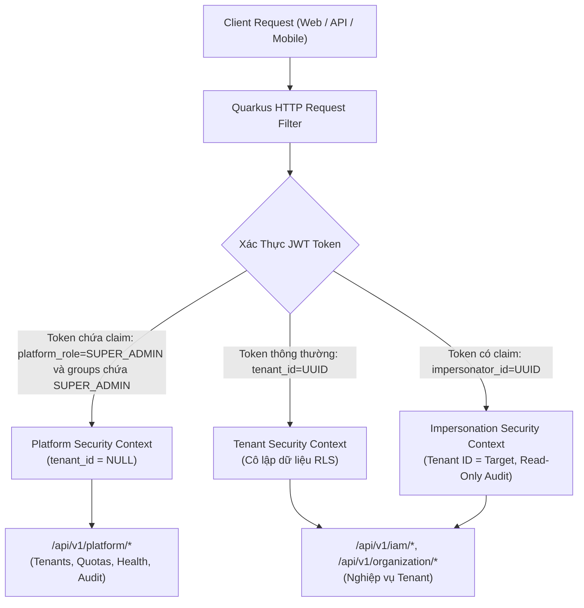
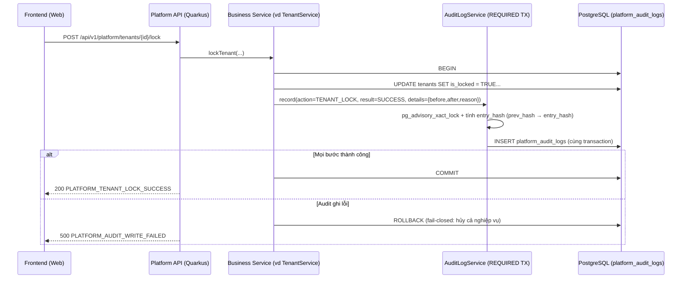
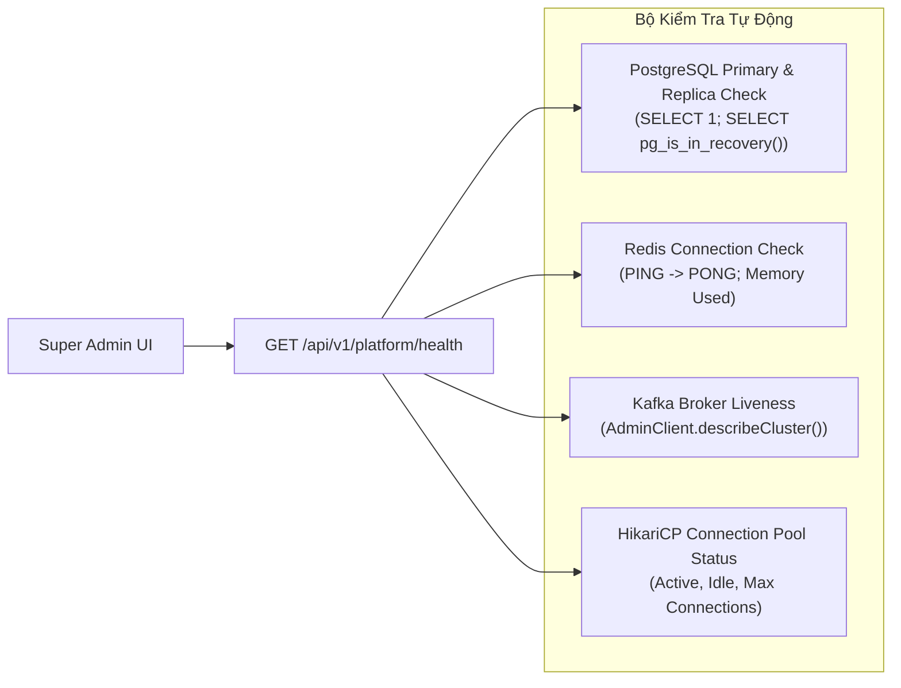

# [SOL-01] Nghiên Cứu Giải Pháp Kỹ Thuật: Kiến Trúc Super Admin & An Toàn Nền Tảng

- **Mã Tài Liệu**: SOL-01
- **Phụ Trách**: Solution Architect Agent
- **Thuộc Sprint**: Sprint 02 - Super Admin & Phân Quyền Toàn Diện
- **Ngày Hoàn Thành**: 2026-09-18

---

## 1. Kiến Trúc Tách Biệt Ngữ Cảnh Nền Tảng (Platform Context Separation)

Trong hệ thống SaaS Multi-tenant của Open-ERP, rủi ro lớn nhất là sự nhầm lẫn giữa **Tài khoản Khách thuê (Tenant Account)** và **Tài khoản Vận hành Nền tảng (Platform Super Admin)**.



### 1.1. Cấu Trúc JWT Claims Dành Cho Super Admin
Khi một Super Admin đăng nhập vào cổng quản trị nền tảng:
```json
{
  "sub": "b2c9a101-0000-4000-a000-000000000001",
  "email": "ops-admin@openerp.9ms.io.vn",
  "platform_role": "SUPER_ADMIN",
  "groups": ["SUPER_ADMIN"],
  "tenant_id": null,
  "iss": "https://openerp.9ms.io.vn/auth",
  "exp": 1758200000,
  "jti": "jwt-platform-session-uuid"
}
```
- **Ràng buộc an toàn**: Các API nghiệp vụ thông thường (`/api/v1/sales/*`, `/api/v1/customers/*`) khi nhận được token có `tenant_id == null` sẽ ngay lập tức từ chối (`400 Bad Request` hoặc `403 Forbidden`) vì không thể thực thi trong ngữ cảnh rỗng.
- Ngược lại, các endpoint quản trị `/api/v1/platform/*` bắt buộc phải có annotation `@RolesAllowed("SUPER_ADMIN")` hoặc `@PlatformAdminOnly`.
- **Bắt buộc set song song `platform_role` và `groups` (BUG-65)**: Quarkus SmallRye JWT Security (`@RolesAllowed`) đọc roles từ claim **`groups`**, do đó token Super Admin phải chứa cả `platform_role: "SUPER_ADMIN"` (dùng cho logic phân tách Platform Context) **lẫn** `groups: ["SUPER_ADMIN"]` (dùng cho `@RolesAllowed("SUPER_ADMIN")`). Token thiếu `groups` sẽ bị mọi endpoint platform từ chối `401/403` dù `platform_role` đúng.

### 1.2. Provisioning & Vòng Đời Tài Khoản Super Admin (FEAT-18, TASK-274, TASK-294→TASK-296)

#### 1.2.1. Nguyên Tắc Cấp Quyền
- **Không tự đăng ký**: API đăng ký công khai (`/api/v1/auth/*`) **tuyệt đối không** tạo tài khoản `SUPER_ADMIN`/`SUPPORT_ENGINEER`; mọi request đăng ký chỉ tạo user/tenant nghiệp vụ thông thường. Không tồn tại endpoint công khai nào cấp quyền nền tảng.
- **3 con đường cấp quyền duy nhất**:
  1. **Bootstrap first-run** từ cấu hình máy chủ (mục 1.2.3) — chỉ chạy khi **không còn SUPER_ADMIN nào ở trạng thái `ACTIVE`** (idempotent, ghi audit `PLATFORM_ADMIN_BOOTSTRAPPED`).
  2. **Platform API** do một SUPER_ADMIN hiện hữu thực hiện (`POST /api/v1/platform/admins`).
  3. **CLI quản trị** (mục 1.2.6): Offline CLI trên server cho tình huống khẩn cấp, Remote CLI gọi Platform API.
- Mọi con đường cấp quyền bắt buộc ghi `platform_audit_logs` với `scope = 'PLATFORM'`; tự đăng ký không nằm trong bất kỳ luồng nào.

#### 1.2.2. Trạng Thái Vòng Đời (Lifecycle State Machine)
Cột `platform_super_admins.status` (đồng bộ enum Java `PlatformAdminStatus` và TypeScript `@shared/enums`) nhận đúng 4 giá trị:

| Trạng Thái | Ý Nghĩa | Điều Kiện Chuyển Tiếp |
| :--- | :--- | :--- |
| `INVITED` | Bản ghi vừa được cấp qua API/CLI cho user mới; user nhận email lời mời thiết lập mật khẩu. | → `ACTIVE` khi user hoàn tất thiết lập/đăng nhập lần đầu. |
| `ACTIVE` | Đang hiệu lực; `is_active = TRUE`. | → `DISABLED` khi bị vô hiệu hóa; → `REVOKED` khi thu hồi. |
| `DISABLED` | Vô hiệu hóa tạm thời; session/token đã bị thu hồi, không đăng nhập được portal. | → `ACTIVE` khi enable lại; → `REVOKED`. |
| `REVOKED` | Thu hồi vĩnh viễn, không thể enable lại (muốn dùng lại phải cấp mới qua grant). | Trạng thái kết thúc. |

- Tương thích ngược: giữ cột `is_active` với bất biến `is_active = (status = 'ACTIVE')`.
- `must_change_password = TRUE` và `two_factor_required = TRUE` là cờ bắt buộc với mọi bản ghi; admin chưa hoàn tất đổi mật khẩu/bật 2FA bị chặn tại guard và chỉ được điều hướng tới màn thiết lập bắt buộc, không truy cập được các màn `/platform/*` khác.

#### 1.2.3. Bootstrap First-Run (TASK-274)
Hệ thống **không hardcode** tài khoản Super Admin trong migration. Một bean `@Startup` (observer `StartupEvent`) đọc danh sách email từ cấu hình Quarkus `openerp.platform.bootstrap-emails` (ví dụ: `ops-admin@openerp.9ms.io.vn,cto@openerp.9ms.io.vn`) và seed **idempotent** khi khởi động:

- **Điều kiện chạy**: chỉ thực thi khi `SELECT 1 FROM platform_super_admins WHERE role = 'SUPER_ADMIN' AND status = 'ACTIVE'` rỗng (first-run hoặc sau khi toàn bộ SUPER_ADMIN bị vô hiệu hóa/thu hồi). Chạy lại nhiều lần không tạo trùng dữ liệu.
- **Xác thực**: yêu cầu biến môi trường `OPENERP_ADMIN_BOOTSTRAP_SECRET` (đối chiếu constant-time); thiếu/sai secret → bỏ qua an toàn + log `WARN`, không làm sập ứng dụng.
- Với mỗi email hợp lệ:
  1. Email chưa tồn tại $\rightarrow$ tạo user nền tảng (`tenant_id = NULL`, `status = ACTIVE`, `email_verified = TRUE`) với mật khẩu tạm thời ngẫu nhiên.
  2. Email đã tồn tại $\rightarrow$ **nâng cấp tài khoản hiện hữu** (không tạo trùng user, không ghi đè mật khẩu/trạng thái hiện tại).
  3. Gán bản ghi `platform_super_admins`: `role = 'SUPER_ADMIN'`, `status = 'ACTIVE'`, `is_active = TRUE`, `must_change_password = TRUE`, `two_factor_required = TRUE`, `granted_by = NULL` (SYSTEM).
- Audit `PLATFORM_ADMIN_BOOTSTRAPPED` cho từng bản ghi với `actor_type = 'SYSTEM'`.
- Cấu hình rỗng hoặc lỗi định dạng email $\rightarrow$ ghi log `WARN` và bỏ qua an toàn.
- Đặc tính: chỉ khác nhau giữa các môi trường qua giá trị cấu hình.

#### 1.2.4. Cấp & Thu Hồi Qua API (TASK-294)
- **Cấp quyền**: `POST /api/v1/platform/admins` — body `{ email, role, full_name }`, chỉ SUPER_ADMIN hiện hữu được gọi.
  - User chưa tồn tại $\rightarrow$ tạo user nền tảng (`tenant_id = NULL`, `status = ACTIVE`, `email_verified = TRUE`), trạng thái admin `INVITED`, gửi email invitation (`PLATFORM_ADMIN_INVITATION_SENT`).
  - User đã tồn tại $\rightarrow$ nâng cấp tài khoản hiện hữu, trạng thái `ACTIVE` (`PLATFORM_ADMIN_GRANTED`); bản ghi đã tồn tại (kể cả `REVOKED`) được cập nhật (upsert), không tạo trùng.
- **Thu hồi**: `DELETE /api/v1/platform/admins/{id}` $\rightarrow$ `status = 'REVOKED'`, `is_active = FALSE`, revoke session/token, audit `PLATFORM_ADMIN_REVOKED`.
- **Đặt lại mật khẩu**: `POST /api/v1/platform/admins/{id}/reset-password` $\rightarrow$ gửi email, đặt `must_change_password = TRUE`.
- **Break-glass tắt 2FA**: `POST /api/v1/platform/admins/{id}/disable-2fa` — dùng khi admin mất thiết bị 2FA; bắt buộc `support_ticket` + lý do, audit mức Critical.
- Giới hạn: disable/revoke **không áp dụng cho chính mình**; SUPPORT_ENGINEER không được gọi nhóm API này (mục 1.2.7).

#### 1.2.5. Vô Hiệu Hóa & Kích Hoạt Lại (Disable/Enable)
- `POST /api/v1/platform/admins/{id}/disable` (body `{ reason, confirm_password }`) và `POST /api/v1/platform/admins/{id}/enable`.
- **Guards bắt buộc**:
  - `PLATFORM_SELF_DISABLE_FORBIDDEN` (`403`): không cho disable/revoke chính mình.
  - `PLATFORM_LAST_ADMIN_PROTECTED` (`409`): không cho disable/revoke SUPER_ADMIN `ACTIVE` cuối cùng; kiểm tra trong cùng transaction với `SELECT ... FOR UPDATE` chống race khi 2 request đồng thời.
- **Hiệu lực tức thì**: xóa toàn bộ session Redis của user, đưa access/refresh token vào blacklist, gửi email cảnh báo cho chính admin và các SUPER_ADMIN khác.
- Audit `scope = 'PLATFORM'` với action `PLATFORM_ADMIN_DISABLED`/`PLATFORM_ADMIN_ENABLED`, kèm `before`/`after` + `reason`, cập nhật `disabled_at`, `disabled_by`.
- Chỉ SUPER_ADMIN được thao tác; mọi hành vi bị từ chối ghi audit `result = DENIED`.

#### 1.2.6. CLI Quản Trị (TASK-295)
**Offline CLI (khuyến nghị khi sự cố)** — chạy trực tiếp trên server:
- Quarkus command mode/picocli: `java -jar quarkus-run.jar admin-cli <command>` hoặc `mvn quarkus:dev -Dquarkus.args="admin-cli ..."`.
- Yêu cầu `OPENERP_ADMIN_BOOTSTRAP_SECRET` + truy cập trực tiếp DB/Redis (không cần HTTP API).
- Subcommands: `bootstrap`, `list`, `grant`, `revoke`, `disable`, `enable`, `reset-password`, `disable-2fa`, `revoke-sessions`, `verify-audit-chain`.
- **Không nhận mật khẩu qua CLI arg** (tránh lộ trong process list/shell history) — chỉ prompt ẩn hoặc biến môi trường.
- Dùng khi: mất toàn bộ SUPER_ADMIN `ACTIVE`, sự cố hạ tầng không gọi được API, cần verify audit chain.

**Remote CLI** — `scripts/platform/platform-admin-cli.bat` (Windows) / `scripts/platform/platform-admin-cli.sh` (Linux/macOS):
- Gọi Platform API qua HTTPS bằng tài khoản admin + mã TOTP (hoặc service token ngắn hạn), kèm IP allowlist.
- Không bypass guard nghiệp vụ (self-disable/last-admin áp dụng nguyên vẹn).
- Dùng khi cần quản trị từ xa mà không thao tác trên portal.

**Audit CLI**: mọi thao tác CLI bắt buộc ghi `platform_audit_logs` với `actor_type = 'CLI'`, `correlation_id`, `ip_address` (offline ghi `local-console`), `actor_email_snapshot` lấy từ tài khoản thực thi; fail-closed.

#### 1.2.7. Ma Trận Phân Quyền SUPER_ADMIN vs SUPPORT_ENGINEER

| Nhóm Hành Động | SUPER_ADMIN | SUPPORT_ENGINEER |
| :--- | :---: | :---: |
| Xem danh sách Tenant/User toàn cục | Có | Có (read-only) |
| Impersonation (kèm ticket + lý do) | Có | Có |
| Khóa/mở khóa Tenant | Có | Không |
| Cập nhật quota / plugin allowlist Tenant | Có | Không |
| Quản trị tài khoản platform admin (grant/disable/enable/revoke/reset-password/disable-2FA) | Có | Không |
| Bootstrap / CLI quản trị | Có | Không |
| Break-glass user toàn cục (force-reset, disable-2FA) | Có | Không |

- Các endpoint quản trị tài khoản admin (DES-API §3.12) bắt buộc `@RolesAllowed("SUPER_ADMIN")`; các endpoint cho phép SUPPORT_ENGINEER (list tenant/user, impersonation) được nới guard tương ứng theo bảng trên, các nhóm còn lại giữ `SUPER_ADMIN`.

---

## 2. Giải Pháp Kỹ Thuật Cho Cơ Chế Impersonation ("Login-As")

### 2.1. Cấu Trúc Token Impersonation
Khi Super Admin yêu cầu hỗ trợ một Tenant X:
```json
{
  "sub": "user-uuid-of-target-selected",
  "target_user_id": "user-uuid-of-target-selected",
  "tenant_id": "tenant-uuid-acme-corp",
  "impersonator_id": "super-admin-uuid",
  "impersonator_email": "ops-admin@openerp.9ms.io.vn",
  "support_ticket": "TCK-1024",
  "is_impersonation": true,
  "exp": 1758201800,
  "jti": "imp-token-uuid"
}
```
- **Chọn `target_user_id` (BUG-57)**: Request `POST /api/v1/platform/tenants/{tenant_id}/impersonate` có thể truyền `target_user_id` (tùy chọn) khi Super Admin cần đại diện đúng một nhân viên cụ thể. Nếu bỏ trống, hệ thống tự chọn theo thứ tự ưu tiên:
  1. User đang có role `TENANT_OWNER`.
  2. Fallback: user có role `TENANT_ADMIN` đầu tiên (theo `assigned_at`).
  3. Không tìm được $\rightarrow$ từ chối `400` với mã `PLATFORM_IMPERSONATION_TARGET_NOT_FOUND`.

  `target_user_id` được chọn bắt buộc thuộc đúng `tenant_id` và đang có membership hợp lệ.
- Token impersonation **bắt buộc chứa `target_user_id`**; `sub` phải bằng chính `target_user_id` để downstream service xử lý như người dùng thật.
- **Thời gian hết hạn (TTL)**: Cố định **1800 giây (30 phút)**. Không cấp `refresh_token`.
- **Lưu trữ trạng thái trong Redis**:
  - Key: `impersonation:session:{imp-token-uuid}`
  - Value: `{ "super_admin_id": "...", "tenant_id": "...", "target_user_id": "...", "started_at": 1758200000 }`
  - TTL: 1800 giây.
  - Khi Super Admin bấm "Thoát chế độ đại diện", hệ thống xóa key này trên Redis, biến token thành vô hiệu ngay lập tức.
- **Guard cho `POST /api/v1/platform/impersonate/exit` (BUG-65)**: Endpoint này chấp nhận token có `is_impersonation = true` **kể cả khi token không mang `platform_role`/`groups` của Super Admin** (token impersonation chỉ chứa danh tính target). Điều kiện hợp lệ: `is_impersonation = true` **VÀ** key Redis `impersonation:session:{jti}` vẫn còn tồn tại; nếu key đã bị xóa/hết hạn $\rightarrow$ `401` `PLATFORM_IMPERSONATION_SESSION_EXPIRED`. Vì vậy endpoint exit **không** dùng `@RolesAllowed("SUPER_ADMIN")`.

### 2.2. Kiểm Soát Hành Động Phá Hoại (Destructive Mutation Guard)
Trong Quarkus ContainerRequestFilter:
```java
if (securityContext.isImpersonation()) {
    String method = requestContext.getMethod();
    String path = requestContext.getUriInfo().getPath();
    
    // Cấm xóa Tenant, cấm đổi chủ sở hữu, cấm đổi mật khẩu user
    if (isDestructiveAction(method, path)) {
        throw new BusinessException("SUPERADMIN_IMPERSONATION_DESTRUCTIVE_ACTION_FORBIDDEN");
    }
}
```

- **Chặn rò rỉ bí mật (BUG-68)**: Trong chế độ impersonation, mọi hành vi đọc/xuất các trường nhạy cảm (`secret_key_enc`, `password_hash`, API key, refresh token) đều bị chặn ở tầng filter/serializer với mã lỗi `SUPERADMIN_IMPERSONATION_SECRET_EXPORT_FORBIDDEN`:
```java
if (securityContext.isImpersonation() && readsSensitiveSecret(method, path, responseFields)) {
    throw new BusinessException("SUPERADMIN_IMPERSONATION_SECRET_EXPORT_FORBIDDEN");
}
```
Áp dụng cho cả trường hợp export file (CSV/Excel) lẫn endpoint trả chi tiết cấu hình plugin/tenant (danh sách secret/API key bị loại bỏ hoàn toàn khỏi payload).

---

## 3. Kiến Trúc Nhật Ký Kiểm Toán Bất Biến (Immutable Audit Trail)

### 3.1. Quyết Định Lưu Trữ & Phân Tầng (Storage Tiering Decision)

Audit log là **bằng chứng pháp lý**, nên ưu tiên số một là tính toàn vẹn – bất biến – truy vết, sau đó mới đến chi phí lưu trữ dài hạn. Kiến trúc chốt phương án **phân tầng lưu trữ (tiered storage)**:

| Tiêu Chí | PostgreSQL (Hot – Sprint 02) | MongoDB / S3 WORM (Cold Archive – Sprint sau) |
| :--- | :--- | :--- |
| Vai trò | Ghi + truy vấn audit đang hoạt động (≤ 24 tháng) | Lưu trữ dài hạn > 24 tháng, ít truy vấn |
| Tính nhất quán | ACID, ghi **cùng transaction** với nghiệp vụ (fail-closed) | Ghi bất đồng bộ theo lô (eventually consistent) |
| Truy vấn | SQL đầy đủ + JSONB (`details`), join `users`/`tenants` | Truy vấn tài liệu theo `event_id`/`correlation_id`; S3 Object Lock (WORM) |
| Chi phí | Cao hơn khi dữ liệu phình to | Rẻ, nén tốt, phù hợp lưu trữ pháp lý dài hạn |
| Bảo vệ bất biến | REVOKE + Trigger + Hash chain + Partition | Object Lock (WORM) + Legal Hold |

- **Lý do chọn PostgreSQL cho Sprint 02**: hành động nhạy cảm (khóa tenant, break-glass, đổi quyền) cần audit ghi **cùng transaction** để đảm bảo "không thay đổi nào thoát khỏi dấu vết"; PostgreSQL cho phép rollback cả audit lẫn nghiệp vụ khi lỗi (fail-closed), đồng thời truy vấn SQL trực tiếp phục vụ màn hình `/platform/audit-logs`.
- **Đối chiếu SYSTEM_BLUEPRINT §5.2**: Blueprint định hướng MongoDB cho "Nhật ký kiểm toán thao tác người dùng (Audit Logs)". Quyết định Sprint 02 **không mâu thuẫn**: MongoDB giữ đúng vai trò lưu trữ audit nhưng ở **tầng lạnh (cold archive)** cho dữ liệu > 24 tháng, triển khai ở sprint sau khi profile `mongo` được bật (TASK-293); giai đoạn 0–24 tháng dùng PostgreSQL để đổi lấy ACID + same-transaction write path.

### 3.2. Mô Hình Dữ Liệu Audit Dùng Chung (Unified Audit Model)

Một bảng duy nhất `platform_audit_logs` phục vụ cả hai ngữ cảnh:
- `scope = 'PLATFORM'`: hành động của Super Admin/Support Engineer lên nền tảng, tenant, user toàn cục (`tenant_id IS NULL`).
- `scope = 'TENANT'`: hành động quản trị bên trong tenant (RBAC, cơ cấu tổ chức) — `tenant_id` **bắt buộc**.

Giải thích các cột chính (schema đầy đủ tại [DES-02-DB §2.4](../06_designs/database/SUPERADMIN_RBAC_DATABASE_SCHEMA.md)):
- `event_id`: định danh nghiệp vụ UUID (ổn định khi đối soát/trích xuất, độc lập với khóa kỹ thuật `id`).
- `actor_type`: `USER | SUPER_ADMIN | SUPPORT_ENGINEER | SYSTEM | CLI` — hành động tự động của job mang `SYSTEM`; thao tác qua CLI quản trị mang `CLI` (mục 1.2.6).
- `actor_email_snapshot`: **denormalize** email tại thời điểm hành động; user đổi email về sau vẫn truy vết đúng danh tính lịch sử.
- `correlation_id`: mã tương quan xuyên service (HTTP header `X-Correlation-Id` / Kafka), ghép nhóm nhiều bản ghi của cùng một yêu cầu.
- `result`: `SUCCESS | DENIED | FAILED` — ghi cả hành vi **bị từ chối** (`DENIED`) là yêu cầu bảo mật (phát hiện dò quyền).
- `details` JSONB theo schema chuẩn `{ "before": {…}, "after": {…}, "reason": "…", "extra": {…} }`; `before`/`after` phục vụ diff trên UI, `reason` bắt buộc với hành động nhạy cảm, `extra` mở rộng theo action.
- `prev_hash` / `entry_hash`: cột hash chain (mục 3.3); `ip_address`, `user_agent`: dấu vết client.

### 3.3. Bất Biến 4 Lớp + Hash Chain (Tamper-Evident)

**4 lớp bảo vệ bất biến**:
1. **Phân quyền CSDL (REVOKE)**: role ứng dụng chỉ có `SELECT, INSERT`; thu hồi `UPDATE/DELETE`.
2. **Trigger chặn**: `trg_audit_logs_immutable` chặn mọi `UPDATE/DELETE` cấp dòng.
3. **Hash chain + job verify**: mỗi bản ghi có `entry_hash` liên kết bản ghi trước; job `AuditChainVerifier` phát hiện đứt chuỗi kể cả khi kẻ tấn công có quyền superuser phá trigger.
4. **Archive WORM**: bản ghi > 24 tháng chuyển sang MongoDB/S3 Object Lock (WORM) ở sprint sau (TASK-293).

REVOKE + trigger giữ nguyên hành vi hiện hành:
```sql
GRANT SELECT, INSERT ON platform_audit_logs TO openerp_app;
REVOKE UPDATE, DELETE ON platform_audit_logs FROM openerp_app;

CREATE OR REPLACE FUNCTION prevent_audit_log_modification()
RETURNS TRIGGER AS $$
BEGIN
    RAISE EXCEPTION 'Audit log entries are immutable and cannot be updated or deleted!';
END;
$$ LANGUAGE plpgsql;

CREATE TRIGGER trg_audit_log_immutable
BEFORE UPDATE OR DELETE ON platform_audit_logs
FOR EACH ROW EXECUTE FUNCTION prevent_audit_log_modification();
```

- **Local Dev tối giản (BUG-70)**: môi trường dev dùng user `openerp` (owner do Docker Compose tạo) để thuận tiện migration/debug; bất biến trên dev được đảm bảo bằng trigger — cùng hành vi như production, không khác biệt logic.

**Công thức hash chain**:
```
entry_hash = SHA-256( canonical(
    event_id, actor_user_id, action,
    resource_type, resource_id, target_tenant_id, target_user_id,
    result, details, created_at, prev_hash
) )
prev_hash  = entry_hash của bản ghi liền trước theo thứ tự (created_at, id); bản ghi đầu tiên dùng prev_hash = NULL
```
- `canonical(...)`: chuỗi JSON canonical (sắp xếp key cố định, không khoảng trắng dư, timestamp ISO-8601 UTC) để hash ổn định giữa các lần tính.
- **Tranh chấp ghi đồng thời**: `AuditLogService.record()` lấy `pg_advisory_xact_lock(<hằng số audit chain>)` (hoặc sequence chuyên dụng) trong cùng transaction trước khi đọc `prev_hash` và tính `entry_hash`, đảm bảo chuỗi tuyến tính, không phân nhánh; lock tự nhả khi transaction kết thúc.
- **Job `AuditChainVerifier`**: quét theo lô từng partition tháng, kiểm tra `prev_hash` bản ghi N khớp `entry_hash` bản ghi N-1 và hash tính lại khớp `entry_hash` đã lưu; phát hiện lệch → cảnh báo `CRITICAL` + metric `audit_chain_broken_total`, **không tự ý sửa dữ liệu**.
- **Ngoại lệ có kiểm soát**: `platform_impersonation_logs` **KHÔNG** áp trigger immutable vì luồng nghiệp vụ cần `UPDATE` `status`/`ended_at` khi phiên kết thúc (`STARTED → ENDED/TIMEOUT`); bảng này vẫn bị `REVOKE DELETE` với role ứng dụng, `UPDATE` chỉ thực hiện qua service nội bộ.

### 3.4. Partition & Indexing

- **Partition theo tháng**: `PARTITION BY RANGE (created_at)`, mỗi tháng một partition `platform_audit_logs_YYYY_MM` + `platform_audit_logs_default` hứng dữ liệu ngoài phạm vi (lưới an toàn, không bao giờ chặn ghi). Partition giúp `DETACH`/archive theo tháng nhanh, giảm chi phí VACUUM và giữ index gọn.
- **Lưu ý khóa chính**: PostgreSQL yêu cầu khóa chính của bảng partitioned chứa cột partition key → `PRIMARY KEY (id, created_at)`.
- **Index**:
  - BRIN `created_at` (dữ liệu append-only theo thời gian rất phù hợp BRIN, tiết kiệm dung lượng).
  - B-tree `(scope, tenant_id, created_at DESC)`, `(actor_user_id, created_at DESC)`, `(action, created_at DESC)`; bổ trợ `(target_tenant_id, created_at DESC)` cho tra cứu theo tenant đích.
  - GIN `details jsonb_path_ops` cho tìm kiếm từ khóa trong JSONB.
- **Tạo partition tự động**: job `AuditPartitionMaintainer` (TASK-292) tạo trước **3 tháng**; job retention đánh dấu dữ liệu > 24 tháng thuộc diện archive.

### 3.5. Write Path & Failure Policy



- **Fail-closed (bắt buộc)** cho hành động nhạy cảm: `AuditLogService.record()` propagation `REQUIRED` — audit không ghi được thì toàn bộ nghiệp vụ rollback; không thay đổi nào được phép "thoát" khỏi audit trail.
- **Log bất đồng bộ (qua Kafka)**: chỉ áp dụng cho **log không nhạy cảm** (analytics, thống kê truy cập) — không áp dụng cho coverage matrix §3.6. Khi Kafka tắt ở hồ sơ dev tối giản, các log này bị bỏ qua an toàn, không ảnh hưởng nghiệp vụ.
- `AuditLogService.record()` là **API duy nhất** để ghi audit; cấm INSERT trực tiếp rải rác trong service nghiệp vụ.

### 3.6. Ma Trận Phủ Audit (Coverage Matrix)

Các hành động **bắt buộc** ghi `platform_audit_logs`:

| # | Action | Scope | Mức Độ | Ghi Chú Target |
| :--- | :--- | :--- | :--- | :--- |
| 1 | TENANT_LOCK | PLATFORM | Critical | `target_tenant_id`, `details.reason` |
| 2 | TENANT_UNLOCK | PLATFORM | High | `target_tenant_id` |
| 3 | TENANT_QUOTA_UPDATE | PLATFORM | High | `target_tenant_id`, before/after quota |
| 4 | USER_GLOBAL_LOCK | PLATFORM | Critical | `target_user_id` |
| 5 | USER_GLOBAL_UNLOCK | PLATFORM | High | `target_user_id` |
| 6 | USER_FORCE_PASSWORD_RESET | PLATFORM | High | `target_user_id`, ticket/reason |
| 7 | USER_BREAK_GLASS_DISABLE_2FA | PLATFORM | Critical | `target_user_id`, ticket/reason |
| 8 | IMPERSONATION_START | PLATFORM | Critical | `target_tenant_id`, `target_user_id`, support_ticket |
| 9 | IMPERSONATION_END | PLATFORM | High | `target_tenant_id`, `target_user_id` |
| 10 | IMPERSONATION_TIMEOUT | PLATFORM | High | `result = FAILED`, `target_tenant_id` |
| 11 | IAM_ROLE_CREATE | TENANT | High | `tenant_id`, `resource_type = ROLE` |
| 12 | IAM_ROLE_UPDATE | TENANT | High | `tenant_id`, `resource_id = role_id` |
| 13 | IAM_ROLE_DELETE | TENANT | Critical | `tenant_id`, `resource_id = role_id` |
| 14 | IAM_ROLE_PERMISSION_UPDATE | TENANT | Critical | `tenant_id`, before/after permission set |
| 15 | IAM_ROLE_DATA_POLICY_UPDATE | TENANT | Critical | `tenant_id`, before/after data policies |
| 16 | IAM_USER_ROLE_ASSIGN | TENANT | High | `tenant_id`, `target_user_id` |
| 17 | IAM_USER_ROLE_REMOVE | TENANT | High | `tenant_id`, `target_user_id` |
| 18 | ORG_BRANCH_CREATE | TENANT | High | `tenant_id`, `resource_type = BRANCH` |
| 19 | ORG_BRANCH_UPDATE | TENANT | High | `tenant_id`, before/after branch |
| 20 | ORG_BRANCH_DELETE | TENANT | High | `tenant_id`, `resource_id = branch_id` |
| 21 | ORG_DEPARTMENT_CREATE | TENANT | High | `tenant_id`, `resource_type = DEPARTMENT` |
| 22 | ORG_DEPARTMENT_MOVE | TENANT | High | `tenant_id`, before/after parent_id |
| 23 | ORG_DEPARTMENT_DELETE | TENANT | High | `tenant_id`, `resource_id = department_id` |
| 24 | ORG_MEMBERSHIP_ASSIGN | TENANT | High | `tenant_id`, `target_user_id` |
| 25 | ORG_MEMBERSHIP_UPDATE | TENANT | High | `tenant_id`, `target_user_id`, before/after |
| 26 | ORG_MEMBERSHIP_REMOVE | TENANT | High | `tenant_id`, `target_user_id` |
| 27 | ORG_BRANCH_ASSIGNMENT_CREATE | TENANT | High | `tenant_id`, `target_user_id` |
| 28 | ORG_BRANCH_ASSIGNMENT_UPDATE | TENANT | High | `tenant_id`, `target_user_id`, before/after |
| 29 | ORG_BRANCH_ASSIGNMENT_DELETE | TENANT | High | `tenant_id`, `target_user_id` |
| 30 | PLATFORM_ADMIN_BOOTSTRAPPED | PLATFORM | Critical | `target_user_id`, `details.extra.bootstrap_emails`, `actor_type = SYSTEM` |
| 31 | PLATFORM_ADMIN_GRANTED | PLATFORM | Critical | `target_user_id`, `resource_type = PLATFORM_ADMIN`, before/after role/status |
| 32 | PLATFORM_ADMIN_DISABLED | PLATFORM | Critical | `target_user_id`, `details.reason`; kèm revoke session + blacklist token |
| 33 | PLATFORM_ADMIN_ENABLED | PLATFORM | High | `target_user_id` |
| 34 | PLATFORM_ADMIN_REVOKED | PLATFORM | Critical | `target_user_id`, `details.reason` |
| 35 | PLATFORM_ADMIN_PASSWORD_RESET_SENT | PLATFORM | High | `target_user_id` |
| 36 | PLATFORM_ADMIN_2FA_DISABLED | PLATFORM | Critical | `target_user_id`, ticket/reason (break-glass) |

- Enum `AuditAction` khai báo đầy đủ 36 giá trị, đồng bộ Java (`com.vn9melody.openerp.common.enums`) và TypeScript `@shared/enums`; cấm gõ chuỗi tự do.
- Bổ sung action mới bắt buộc cập nhật bảng này + enum + i18n hiển thị.

### 3.7. Retention & Archive

- **Hot retention 24 tháng** trên PostgreSQL; bản ghi > 24 tháng thuộc diện **cold archive** sang MongoDB (`audit_logs_archive`) và/hoặc S3 Object Lock (WORM) ở sprint sau (TASK-293), bảo toàn nguyên vẹn đoạn hash chain + manifest checksum.
- **Legal hold**: bản ghi/tenant đang bị giữ pháp lý không được archive-purge; cờ hold được tôn trọng khi archive và có audit cho chính thao tác archive.
- **Không xóa cứng** trong thời gian lưu trữ; chỉ `DETACH`/purge khỏi hot storage sau khi archive đã ghi và verify thành công.

### 3.8. Tenant-scope Audit (Audit Dùng Chung)

- Hành động quản trị tenant ghi cùng bảng với `scope = 'TENANT'` + `tenant_id` bắt buộc, `actor_type = 'USER'`.
- **Sprint 02**: chỉ ghi + tra cứu qua Platform API (`GET /api/v1/platform/audit-logs?scope=TENANT`).
- Màn hình xem audit cho **Tenant Admin deferred Sprint sau** — cần bổ sung permission `core:audit:read` và RLS cô lập tenant; ghi chú rõ tại DES-API §3.7 và DES-UI §4.6.

---

## 4. Kiến Trúc Giám Sát Sức Khỏe Hạ Tầng (System Health Monitoring)

Hệ thống sử dụng các tiện ích gốc của **SmallRye Health (MicroProfile Health)**. Các quyết định kỹ thuật bắt buộc:
- **Dependency (BUG-64)**: bổ sung `io.quarkus:quarkus-smallrye-health` vào `pom.xml`; một số cấu hình Quarkus tối giản không kéo sẵn extension này. Các health check tùy biến kế thừa `HealthCheck` và được đăng ký qua CDI.
- **Enum `SystemHealthStatus`**: `HEALTHY | DEGRADED | DOWN | UNKNOWN` (đồng bộ Java `com.vn9melody.openerp.common.enums` và TypeScript `@shared/enums`):
  - `HEALTHY`: mọi thành phần bắt buộc (PostgreSQL Primary, Redis) đều UP.
  - `DEGRADED`: thành phần bắt buộc vẫn UP nhưng có thành phần tùy chọn DOWN/UNKNOWN.
  - `DOWN`: thành phần bắt buộc DOWN.
  - `UNKNOWN`: chưa đủ dữ liệu để kết luận.
- **Hồ sơ dev tối giản (minimal profile)**: khi Kafka không được bật, health check Kafka không khởi tạo $\rightarrow$ trả `kafka.status = "UNKNOWN"` và tổng hợp `system_status = "DEGRADED"` (Kafka là thành phần tùy chọn ở dev, không tính là DOWN).



- **PostgreSQL Replica Check**: Kiểm tra xem cơ chế Master - Slave có hoạt động không và đo lường độ trễ nhân bản (Replication Lag):
  ```sql
  SELECT CASE WHEN pg_is_in_recovery() THEN pg_last_wal_replay_lsn() - pg_last_wal_receive_lsn() ELSE 0 END AS replication_lag_bytes;
  ```
- **Redis Health**: Gọi lệnh Redis `INFO MEMORY` để lấy `used_memory_human` và `connected_clients`.
- **Cơ chế Cache Metrics**: Để tránh làm tải thêm hệ thống khi Super Admin liên tục F5 trang giám sát, kết quả kiểm tra sức khỏe được Cache trong Redis với TTL 10 giây.

---

## 5. Đánh Giá Trade-Offs & Quyết Định Kỹ Thuật

| Phương Án Kiến Trúc | Lựa Chọn Đề Xuất | Đánh Đổi / Lý Do Chấp Nhận |
| :--- | :--- | :--- |
| **Cổng Portal Super Admin** | Route riêng `/platform/*` trên cùng Web Angular. | *Ưu điểm*: Tái sử dụng 100% Shared UI Library, Token Interceptor, i18n.<br>*Nhược điểm*: Phải cấu hình Angular Guard và Server-side Route Filter cực kỳ nghiêm ngặt để người dùng thường không chạm được mã portal. |
| **Lưu trữ Audit Log** | PostgreSQL Table có Trigger chống Update/Delete. | *Ưu điểm*: Đơn giản, tính nhất quán ACID cao, dễ truy vấn bằng SQL.<br>*Đánh đổi*: Nếu hệ thống hàng triệu log/ngày thì sau này cần chuyển sang lưu trữ phân tán (Elasticsearch/ClickHouse). Giai đoạn Sprint 02 dùng PostgreSQL là tối ưu nhất. |
| **Xác thực Impersonation** | Yêu cầu nhập lại mật khẩu Super Admin trước khi cấp Token. | *Ưu điểm*: Chống việc người khác ngồi vào máy Super Admin đang mở rồi bấm impersonate trái phép.<br>*Đánh đổi*: Tốn thêm một thao tác nhập mật khẩu của Admin. |
