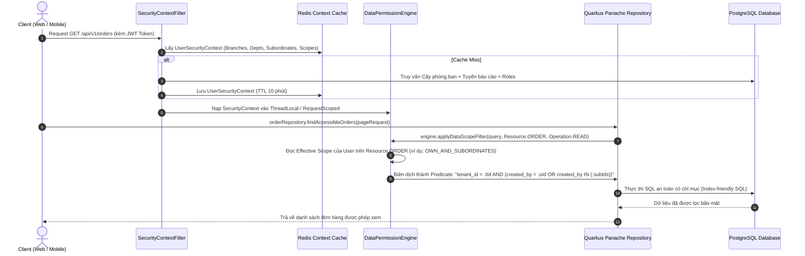

# [SOL-02] Nghiên Cứu Giải Pháp Kỹ Thuật: Bộ Máy Thực Thi Phân Quyền Dữ Liệu Tự Động (Data Permission Enforcement Engine)

- **Mã Tài Liệu**: SOL-02
- **Phụ Trách**: Solution Architect Agent
- **Thuộc Sprint**: Sprint 02 - Super Admin & Phân Quyền Toàn Diện
- **Ngày Hoàn Thành**: 2026-09-18

---

## 1. Vấn Đề Kiến Trúc & Yêu Cầu Đặt Ra

Trong hầu hết các hệ thống ERP thất bại về bảo mật, nguyên nhân là do **phụ thuộc vào tính kỷ luật của lập trình viên**:
- Lập trình viên viết câu lệnh query `SELECT * FROM sale_orders WHERE tenant_id = ?` nhưng quên mất kiểm tra xem người dùng hiện tại có thuộc cùng Phòng ban hay Chi nhánh hay không.
- Khi cần kiểm tra quyền Sửa/Xóa, từng controller/service lại phải viết hàng chục dòng `if-else` phức tạp để so sánh `user.id == order.created_by`.

**Mục tiêu của Sprint 02**: Xây dựng một **Data Permission Enforcement Engine** tự động ở tầng lõi Quarkus Backend. Lập trình viên nghiệp vụ chỉ cần gọi repository chuẩn, bộ máy sẽ tự động tính toán và tiêm mệnh đề bảo mật vào SQL trước khi câu lệnh được gửi tới cơ sở dữ liệu PostgreSQL.

---

## 2. Luồng Xử Lý Của Enforcement Engine



---

## 3. Kiến Trúc Dữ Liệu Ngữ Cảnh Bảo Mật (UserSecurityContext)

Để tránh việc mỗi truy vấn lại phải JOIN qua 5 bảng (`branches`, `departments`, `user_departments`, `user_roles`, `role_data_policies`), hệ thống đóng gói toàn bộ ngữ cảnh này thành một cấu trúc dữ liệu gọn gàng trong Redis:

### Cấu Trúc JSON Cache Trong Redis:
- **Key Pattern**: `sec:ctx:{tenant_id}:{user_id}`
- **TTL**: 10 phút.
```json
{
  "user_id": "c1a20000-0000-4000-a000-000000000001",
  "tenant_id": "e5b30000-0000-4000-a000-000000000001",
  "branch_ids": ["br-hanoi-uuid"],
  "primary_department_id": "dept-sales-b2b-uuid",
  "department_ids": ["dept-sales-b2b-uuid"],
  "department_and_child_ids": [
    "dept-sales-b2b-uuid",
    "dept-sales-retail-uuid"
  ],
  "subordinate_user_ids": [
    "user-nv1-uuid",
    "user-nv2-uuid",
    "user-nv3-uuid"
  ],
  "functional_permissions": [
    "sales:order:read",
    "sales:order:create",
    "sales:order:update",
    "crm:customer:read"
  ],
  "effective_data_policies": {
    "SALE_ORDER": {
      "create_scope": "BRANCH",
      "read_scope": "OWN_AND_SUBORDINATES",
      "update_scope": "OWN_ONLY",
      "delete_scope": "NONE",
      "export_scope": "NONE",
      "share_scope": "DEPARTMENT"
    },
    "CUSTOMER": {
      "create_scope": "BRANCH",
      "read_scope": "BRANCH",
      "update_scope": "OWN_ONLY",
      "delete_scope": "NONE",
      "export_scope": "NONE",
      "share_scope": "BRANCH"
    }
  }
}
```

---

## 4. Cơ Chế Biên Dịch Mệnh Đề Lọc SQL Cho 7 Phạm Vi (Scope SQL Compiler)

Khi truy vấn dữ liệu của một thực thể có cài đặt phân quyền (chứa các cột chuẩn: `tenant_id`, `branch_id`, `department_id`, `created_by`), Engine biên dịch thành các mệnh đề SQL tối ưu:

| Phạm Vi (DataScope) | Mệnh Đề SQL Được Tiêm Tự Động |
| :--- | :--- |
| **`ALL`** | `WHERE tenant_id = :tenantId` |
| **`BRANCH`** | `WHERE tenant_id = :tenantId AND branch_id IN (:userBranchIds)` |
| **`DEPARTMENT_AND_CHILDREN`** | `WHERE tenant_id = :tenantId AND department_id IN (:userDeptAndChildIds)` |
| **`DEPARTMENT`** | `WHERE tenant_id = :tenantId AND department_id IN (:userDeptIds)` |
| **`OWN_AND_SUBORDINATES`** | `WHERE tenant_id = :tenantId AND (created_by = :userId OR created_by IN (:subordinateIds))` |
| **`OWN_ONLY`** | `WHERE tenant_id = :tenantId AND created_by = :userId` |
| **`NONE`** | `WHERE 1 = 0` *(Lập tức trả về danh sách rỗng mà không cần scan bảng)* |

### Ràng Buộc Kiểm Soát Thao Tác (Operation Enforcement):
1. **Đối với thao tác `READ`**: Engine tiêm mệnh đề lọc vào câu lệnh `SELECT`.
2. **Đối với thao tác `CREATE`**: Trước khi `persist()`, Engine kiểm tra:
   - `branch_id` của bản ghi mới có nằm trong `branch_ids` được phép của User không.
   - `department_id` của bản ghi mới có hợp lệ với phạm vi tạo của User không.
3. **Đối với thao tác `UPDATE` / `DELETE` / `SHARE`**:
   - Truy vấn bản ghi hiện tại lên theo ID.
   - Thực thi hàm kiểm tra: `engine.canMutate(existingRecord, Operation.UPDATE)`.
   - Nếu bản ghi vi phạm phạm vi $\rightarrow$ Ném ngoại lệ `PermissionDeniedException("IAM_PERMISSION_DENIED_DATA_SCOPE")`.
4. **Đối với thao tác `EXPORT`**:
   - Nếu `export_scope == NONE` $\rightarrow$ Chặn ngay từ tầng Controller (`403 Forbidden`).
   - Nếu có phạm vi $\rightarrow$ Xuất file chỉ bao gồm các dòng thỏa mãn mệnh đề lọc của `export_scope`.

---

## 5. Thuật Toán Phát Hiện Vòng Lặp Tuyến Báo Cáo (Cycle Detection Algorithm)

Khi gán hoặc thay đổi người quản lý trực tiếp (`direct_manager_user_id`) cho nhân viên X:
- Ta mô hình hóa tuyến báo cáo thành một **Đồ thị có hướng (Directed Graph)**: Cạnh từ Nhân viên $\rightarrow$ Quản lý.
- Khi cập nhật `Manager(X) = Y`: Bắt buộc kiểm tra xem **X có phải là cấp trên của Y hay không** (tức là có đường đi từ $Y \leadsto X$ hay không).
- Thuật toán duyệt đồ thị **DFS (Depth-First Search)** với bộ nhớ đệm:
  ```java
  public boolean wouldCreateCycle(UUID employeeId, UUID proposedManagerId) {
      if (employeeId.equals(proposedManagerId)) return true;
      Set<UUID> visited = new HashSet<>();
      Queue<UUID> queue = new LinkedList<>();
      queue.add(proposedManagerId);
      
      while (!queue.isEmpty()) {
          UUID current = queue.poll();
          if (current.equals(employeeId)) {
              return true; // Phát hiện chu trình vòng lặp!
          }
          if (visited.add(current)) {
              UUID nextManager = getDirectManagerId(current);
              if (nextManager != null) {
                  queue.add(nextManager);
              }
          }
      }
      return false; // Hợp lệ, không có chu trình
  }
  ```

---

## 6. Chiến Lược Vô Hiệu Hóa Cache Tức Thì (Event-Driven Invalidation)

Để đảm bảo hiệu năng cao (đọc từ Redis) nhưng không bị tình trạng "lỗi thời quyền" (Stale Permissions):
1. Khi có bất kỳ sự kiện nào sau đây xảy ra:
   - Thay đổi danh sách quyền của một Role (`RolePermissionChangedEvent`).
   - Thêm/Xóa Role của User (`UserRoleAssignedEvent`).
   - Điều chuyển Phòng ban/Chi nhánh của User (`UserDepartmentTransferredEvent`).
   - Cập nhật Quản lý trực tiếp (`ManagerReportingLineChangedEvent`).
2. Hệ thống phát tin qua **Redis Pub/Sub** hoặc **Apache Kafka topic**:
   - `Topic: openerp.iam.permission-invalidations`
   - Payload: `{ "tenant_id": "...", "affected_user_ids": ["..."] }`
3. Toàn bộ các Quarkus node lắng nghe và xóa key Redis `sec:ctx:{tenant_id}:{user_id}`.
4. Lần request tiếp theo của người dùng sẽ tự động tính toán lại ngữ cảnh mới nhất trong $< 15ms$.

---

## 7. Đánh Chỉ Mục CSDL Tối Ưu Cho Data Scopes (Index Optimization)

Mọi bảng nghiệp vụ trong hệ thống Open-ERP có áp dụng phân quyền dữ liệu bắt buộc phải có chỉ mục tổ hợp (Composite B-Tree Indexes) theo thứ tự:

```sql
-- Chỉ mục phục vụ phạm vi ALL và BRANCH
CREATE INDEX idx_entity_tenant_branch ON sale_orders (tenant_id, branch_id);

-- Chỉ mục phục vụ phạm vi DEPARTMENT và DEPARTMENT_AND_CHILDREN
CREATE INDEX idx_entity_tenant_dept ON sale_orders (tenant_id, department_id);

-- Chỉ mục phục vụ phạm vi OWN_ONLY và OWN_AND_SUBORDINATES
CREATE INDEX idx_entity_tenant_creator ON sale_orders (tenant_id, created_by);
```

Nhờ có chỉ mục tổ hợp bắt đầu bằng `tenant_id`, bộ tối ưu hóa PostgreSQL (Query Planner) luôn thực hiện **Bitmap Index Scan** cực kỳ nhanh chóng, giữ thời gian truy vấn $< 20ms$ kể cả khi bảng có hơn 1 triệu bản ghi.
