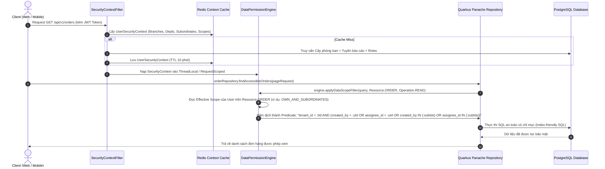

# [SOL-02] Nghiên Cứu Giải Pháp Kỹ Thuật: Bộ Máy Thực Thi Phân Quyền Dữ Liệu Tự Động (Data Permission Enforcement Engine)

- **Mã Tài Liệu**: SOL-02
- **Phụ Trách**: Solution Architect Agent
- **Thuộc Sprint**: Sprint 02 - Super Admin & Phân Quyền Toàn Diện
- **Ngày Hoàn Thành**: 2026-09-18

---

## 1. Vấn Đề Kiến Trúc & Yêu Cầu Đặt Ra

Trong hầu hết các hệ thống ERP thất bại về bảo mật, nguyên nhân là do **phụ thuộc vào tính kỷ luật của lập trình viên**:
- Lập trình viên viết câu lệnh query `SELECT * FROM sale_orders WHERE tenant_id = ?` nhưng quên mất kiểm tra xem người dùng hiện tại có thuộc cùng Phòng ban hay Chi nhánh hay không.
- Khi cần kiểm tra quyền Sửa/Xóa, từng controller/service lại phải viết hàng chục dòng `if-else` phức tạp để so sánh `user.id == order.created_by`.

**Mục tiêu của Sprint 02**: Xây dựng một **Data Permission Enforcement Engine** tự động ở tầng lõi Quarkus Backend. Lập trình viên nghiệp vụ chỉ cần gọi repository chuẩn, bộ máy sẽ tự động tính toán và tiêm mệnh đề bảo mật vào SQL trước khi câu lệnh được gửi tới cơ sở dữ liệu PostgreSQL.

---

## 2. Luồng Xử Lý Của Enforcement Engine



---

## 3. Kiến Trúc Dữ Liệu Ngữ Cảnh Bảo Mật (UserSecurityContext)

Để tránh việc mỗi truy vấn lại phải JOIN qua 5 bảng (`branches`, `departments`, `user_departments`, `user_roles`, `role_data_policies`), hệ thống đóng gói toàn bộ ngữ cảnh này thành một cấu trúc dữ liệu gọn gàng trong Redis:

### Cấu Trúc JSON Cache Trong Redis:
- **Key Pattern**: `sec:ctx:{tenant_id}:{user_id}`
- **TTL**: 10 phút.
```json
{
  "user_id": "c1a20000-0000-4000-a000-000000000001",
  "tenant_id": "e5b30000-0000-4000-a000-000000000001",
  "member_branch_ids": ["br-hanoi-uuid"],
  "managed_branch_ids": ["br-hcm-uuid"],
  "effective_branch_ids": ["br-hanoi-uuid", "br-hcm-uuid"],
  "primary_branch_id": "br-hanoi-uuid",
  "primary_department_id": "dept-sales-b2b-uuid",
  "department_ids": ["dept-sales-b2b-uuid"],
  "department_and_child_ids": [
    "dept-sales-b2b-uuid",
    "dept-sales-retail-uuid"
  ],
  "subordinate_user_ids": [
    "user-nv1-uuid",
    "user-nv2-uuid",
    "user-nv3-uuid"
  ],
  "functional_permissions": [
    "sales:order:read",
    "sales:order:create",
    "sales:order:update",
    "crm:customer:read"
  ],
  "effective_data_policies": {
    "SALE_ORDER": {
      "create_scope": "BRANCH",
      "read_scope": "OWN_AND_SUBORDINATES",
      "update_scope": "OWN_ONLY",
      "delete_scope": "NONE",
      "export_scope": "NONE",
      "share_scope": "DEPARTMENT"
    },
    "CUSTOMER": {
      "create_scope": "BRANCH",
      "read_scope": "BRANCH",
      "update_scope": "OWN_ONLY",
      "delete_scope": "NONE",
      "export_scope": "NONE",
      "share_scope": "BRANCH"
    }
  }
}
```

---

## 4. Cơ Chế Biên Dịch Mệnh Đề Lọc SQL Cho 7 Phạm Vi (Scope SQL Compiler)

Khi truy vấn dữ liệu của một thực thể có cài đặt phân quyền (chứa các cột chuẩn: `tenant_id`, `branch_id`, `department_id`, `created_by`, `assignee_id`), Engine biên dịch thành các mệnh đề SQL tối ưu:

| Phạm Vi (DataScope) | Mệnh Đề SQL Được Tiêm Tự Động |
| :--- | :--- |
| **`ALL`** | `WHERE tenant_id = :tenantId` |
| **`BRANCH`** | `WHERE tenant_id = :tenantId AND branch_id IN (:effectiveBranchIds)` *(với `effectiveBranchIds = member_branch_ids ∪ managed_branch_ids`, BR-RBAC-08)* |
| **`DEPARTMENT_AND_CHILDREN`** | `WHERE tenant_id = :tenantId AND department_id IN (:userDeptAndChildIds)` |
| **`DEPARTMENT`** | `WHERE tenant_id = :tenantId AND department_id IN (:userDeptIds)` |
| **`OWN_AND_SUBORDINATES`** | `WHERE tenant_id = :tenantId AND (created_by = :uId OR assignee_id = :uId OR created_by IN (:subordinateIds) OR assignee_id IN (:subordinateIds))` |
| **`OWN_ONLY`** | `WHERE tenant_id = :tenantId AND (created_by = :uId OR assignee_id = :uId)` |
| **`NONE`** | `WHERE 1 = 0` *(Lập tức trả về danh sách rỗng mà không cần scan bảng)* |

**Chốt cơ chế thực thi `READ` (loại bỏ mơ hồ "Hibernate Filter / JPA Specification Interceptor")**:
- Engine dùng **Hibernate `@Filter`** khai báo trên entity (`@FilterDef(name = "...", parameters = ...)` + `@Filter(name = "...", condition = "...")`).
- Mỗi request, một bean `@RequestScoped` (`DataScopeFilterActivator`) kích hoạt filter tương ứng qua **`Session.enableFilter(...)`** với tham số `:tenantId`, `:uId`, `:effectiveBranchIds`, `:userDeptIds`, `:subordinateIds` lấy từ `UserSecurityContext`.
- Không dùng JPA Specification Interceptor toàn cục; mọi truy vấn đọc đi qua Panache repository đều tự động được Hibernate filter gắn mệnh đề an toàn.

### Ràng Buộc Kiểm Soát Thao Tác (Operation Enforcement):
1. **Đối với thao tác `READ`**: Áp dụng Hibernate `@Filter` + `Session.enableFilter` như mô tả ở trên.
2. **Đối với thao tác `CREATE`**: Trước khi `persist()`, Engine kiểm tra và tự động gán theo bảng quy tắc:

| Create Scope | Quy Tắc Kiểm Tra / Gán Tự Động |
| :--- | :--- |
| `ALL` | `branch_id` và `department_id` phải tồn tại và thuộc đúng `tenant_id` của user. |
| `BRANCH` | `branch_id` mặc định = `primary_branch_id` khi request không truyền; nếu truyền, bắt buộc ∈ `effective_branch_ids` (nếu không → `403 IAM_PERMISSION_DENIED_DATA_SCOPE`). `department_id` (nếu có) phải thuộc branch hợp lệ. |
| `DEPARTMENT` / `DEPARTMENT_AND_CHILDREN` | `department_id` ∈ `userDeptIds` / `userDeptAndChildIds`; `branch_id` suy ra theo department. |
| `OWN_ONLY` / `OWN_AND_SUBORDINATES` | Engine tự gán `created_by = :uId`; `branch_id`/`department_id` lấy theo membership chính của user. |
| `NONE` | Chặn ngay, ném `PermissionDeniedException("IAM_PERMISSION_DENIED_DATA_SCOPE")`. |

3. **Đối với thao tác `UPDATE` / `DELETE` / `SHARE`**:
   - Truy vấn bản ghi hiện tại lên theo ID.
   - Thực thi hàm kiểm tra **tường minh**: `engine.canMutate(existingRecord, Operation.UPDATE)` (TASK-263). Mutations **không** phụ thuộc Hibernate Filter mà luôn đi qua `canMutate` để chặn theo đúng scope của thao tác.
   - Nếu bản ghi vi phạm phạm vi $\rightarrow$ Ném ngoại lệ `PermissionDeniedException("IAM_PERMISSION_DENIED_DATA_SCOPE")`.
4. **Đối với thao tác `EXPORT`**:
   - Nếu `export_scope == NONE` $\rightarrow$ Chặn ngay từ tầng Controller (`403 Forbidden`, mã `IAM_PERMISSION_DENIED_EXPORT`).
   - Nếu có phạm vi $\rightarrow$ Xuất file chỉ bao gồm các dòng thỏa mãn mệnh đề lọc của `export_scope`.

> **Entity kiểm chứng (FEAT-17)**: Toàn bộ Engine được kiểm chứng bằng **Reference Entity** `core_sample_records` với các cột chuẩn `tenant_id, branch_id, department_id, created_by, assignee_id`. Mọi plugin về sau khai báo entity phân quyền bắt buộc tuân thủ đúng bộ cột chuẩn này.

### 4.1. Quản Lý Đa Chi Nhánh (Multi-Branch Manager)

Để đáp ứng mô hình quản lý cấp cao phụ trách nhiều Chi nhánh (Giám đốc vùng) mà không cần tạo membership giả tại từng Chi nhánh, Engine phân biệt hai nguồn Chi nhánh:
1. **Chi Nhánh Thành Viên (`member_branch_ids`)**: sinh từ `user_department_memberships.branch_id` của user.
2. **Chi Nhánh Được Quản Lý (`managed_branch_ids`)**: sinh từ bảng `user_branch_assignments` (`can_manage = TRUE`, TASK-287).

**Quy tắc union (BR-RBAC-08)**: `effective_branch_ids = member_branch_ids ∪ managed_branch_ids`. Đây là nguồn duy nhất cho mọi mệnh đề `BRANCH` (READ/UPDATE/DELETE/EXPORT/SHARE) và cho kiểm tra `canMutate`; tuyệt đối không dùng riêng danh sách membership.

**Auto-sync từ trưởng bộ phận (BR-RBAC-11)**: khi gán/đổi `departments.manager_user_id`, hệ thống tự động đồng bộ membership cho trưởng bộ phận; nhờ đó scope `BRANCH`/`DEPARTMENT` luôn nhất quán và không tồn tại nguồn scope thứ hai.

**Primary branch (BR-RBAC-09)**: mỗi user có tối đa 1 `primary_branch_id` (partial unique index `uq_user_primary_branch`). Khi thao tác CREATE không truyền `branch_id`, Engine tự gán `primary_branch_id`; nếu truyền, giá trị phải ∈ `effective_branch_ids`, ngược lại chặn với `403 IAM_PERMISSION_DENIED_DATA_SCOPE`.

---

## 5. Thuật Toán Phát Hiện Vòng Lặp Tuyến Báo Cáo (Cycle Detection Algorithm)

Khi gán hoặc thay đổi người quản lý trực tiếp (`direct_manager_user_id`) cho nhân viên X:
- Ta mô hình hóa tuyến báo cáo thành một **Đồ thị có hướng (Directed Graph)**: Cạnh từ Nhân viên $\rightarrow$ Quản lý.
- Khi cập nhật `Manager(X) = Y`: Bắt buộc kiểm tra xem **X có phải là cấp trên của Y hay không** (tức là có đường đi từ $Y \leadsto X$ hay không).
- Thuật toán duyệt đồ thị **BFS (Breadth-First Search)** với bộ nhớ đệm (Queue-based, khớp với code bên dưới):
  ```java
  public boolean wouldCreateCycle(UUID employeeId, UUID proposedManagerId) {
      if (employeeId.equals(proposedManagerId)) return true;
      Set<UUID> visited = new HashSet<>();
      Queue<UUID> queue = new LinkedList<>();
      queue.add(proposedManagerId);
      
      while (!queue.isEmpty()) {
          UUID current = queue.poll();
          if (current.equals(employeeId)) {
              return true; // Phát hiện chu trình vòng lặp!
          }
          if (visited.add(current)) {
              UUID nextManager = getDirectManagerId(current);
              if (nextManager != null) {
                  queue.add(nextManager);
              }
          }
      }
      return false; // Hợp lệ, không có chu trình
  }
  ```

---

## 6. Chiến Lược Vô Hiệu Hóa Cache Tức Thì (Event-Driven Invalidation)

Để đảm bảo hiệu năng cao (đọc từ Redis) nhưng không bị tình trạng "lỗi thời quyền" (Stale Permissions):
1. Khi có bất kỳ sự kiện nào sau đây xảy ra:
   - Thay đổi danh sách quyền của một Role (`RolePermissionChangedEvent`).
   - Thêm/Xóa Role của User (`UserRoleAssignedEvent`).
   - Điều chuyển Phòng ban/Chi nhánh của User (`UserDepartmentTransferredEvent`).
   - Cập nhật Quản lý trực tiếp (`ManagerReportingLineChangedEvent`).
   - Phân công hoặc thu hồi quyền quản lý Chi nhánh của User (`BranchAssignmentChangedEvent`, TASK-288).
2. **Cơ chế chính thức (bắt buộc): Redis Pub/Sub.**
   - Kênh: `openerp.iam.permission-invalidations`
   - Payload: `{ "tenant_id": "...", "affected_user_ids": ["..."] }`
   - Redis Pub/Sub được chốt làm cơ chế invalidation vì chạy được ngay với hạ tầng dev tối giản (`make infra` chỉ cần PostgreSQL + Redis), không phụ thuộc Kafka.
3. **Apache Kafka topic `openerp.iam.permission-invalidations` chỉ là phương án mở rộng tùy chọn (optional, future)** khi bật profile `kafka`: dùng cùng payload/kênh logic để phát cho các consumer ngoài hệ thống (audit, analytics). Khi triển khai Kafka, nội bộ Quarkus vẫn duy trì Redis Pub/Sub làm kênh invalidation cache chính thức; Kafka không thay thế.
4. Toàn bộ các Quarkus node lắng nghe Redis Pub/Sub và xóa key Redis `sec:ctx:{tenant_id}:{user_id}`.
5. Lần request tiếp theo của người dùng sẽ tự động tính toán lại ngữ cảnh mới nhất trong $< 15ms$.

---

## 6b. Enforce Quyền Chức Năng (Functional Permission Enforcement) (TASK-267, TASK-268)

Song song với phạm vi dữ liệu, mọi endpoint nghiệp vụ bắt buộc khai báo quyền chức năng yêu cầu:

1. **Annotation `@RequirePermission`** — gắn trên resource method:
   ```java
   @RequirePermission("core:role:manage")
   public Response createRole(CreateRoleRequest request) { ... }
   ```
2. **`PermissionEnforcementFilter`** (JAX-RS `ContainerRequestFilter`, `@Priority(AUTHORIZATION)`):
   - Chỉ chạy với endpoint có gắn `@RequirePermission`.
   - Đọc `UserSecurityContext.functional_permissions` (đã cache Redis, danh sách mã `domain:resource:action`).
   - Nếu không chứa mã yêu cầu $\rightarrow$ chặn `403 Forbidden` với mã lỗi `IAM_PERMISSION_DENIED_FUNCTIONAL`, `params: { "required_permission": "core:role:manage" }`.
3. **Thứ tự thực thi**: Xác thực JWT $\rightarrow$ nạp `UserSecurityContext` $\rightarrow$ `PermissionEnforcementFilter` (quyền chức năng) $\rightarrow$ `DataPermissionEngine` (phạm vi dữ liệu / `canMutate`). Nhờ đó user thiếu quyền chức năng bị chặn sớm, không cần chạm tới dữ liệu.
4. Mã quyền chức năng chuẩn `domain:resource:action` được seed idempotent vào bảng `permissions` (TASK-268) và ánh xạ 1-1 với enum phía Frontend.

---

## 7. Đánh Chỉ Mục CSDL Tối Ưu Cho Data Scopes (Index Optimization)

Bộ chỉ mục mẫu dưới đây được áp dụng trước hết cho **Reference Entity `core_sample_records` (FEAT-17)**, và là **chuẩn bắt buộc cho mọi entity plugin** về sau khi có áp dụng phân quyền dữ liệu (Composite B-Tree Indexes theo thứ tự):

```sql
-- Chỉ mục phục vụ phạm vi ALL và BRANCH
CREATE INDEX idx_core_sample_records_tenant_branch ON core_sample_records (tenant_id, branch_id);

-- Chỉ mục phục vụ phạm vi DEPARTMENT và DEPARTMENT_AND_CHILDREN
CREATE INDEX idx_core_sample_records_tenant_dept ON core_sample_records (tenant_id, department_id);

-- Chỉ mục phục vụ phạm vi OWN_ONLY và OWN_AND_SUBORDINATES (bản ghi do mình tạo)
CREATE INDEX idx_core_sample_records_tenant_created ON core_sample_records (tenant_id, created_by);

-- Chỉ mục phục vụ phạm vi OWN_ONLY và OWN_AND_SUBORDINATES (bản ghi được giao cho mình)
CREATE INDEX idx_core_sample_records_tenant_assignee ON core_sample_records (tenant_id, assignee_id);
```

Mọi entity plugin khai báo phân quyền dữ liệu sau này bắt buộc tạo 4 chỉ mục cùng khuôn mẫu (thay tiền tố tên bảng). Nhờ chỉ mục tổ hợp bắt đầu bằng `tenant_id`, bộ tối ưu hóa PostgreSQL (Query Planner) luôn thực hiện **Bitmap Index Scan** cực kỳ nhanh chóng, giữ thời gian truy vấn $< 20ms$ kể cả khi bảng có hơn 1 triệu bản ghi.
