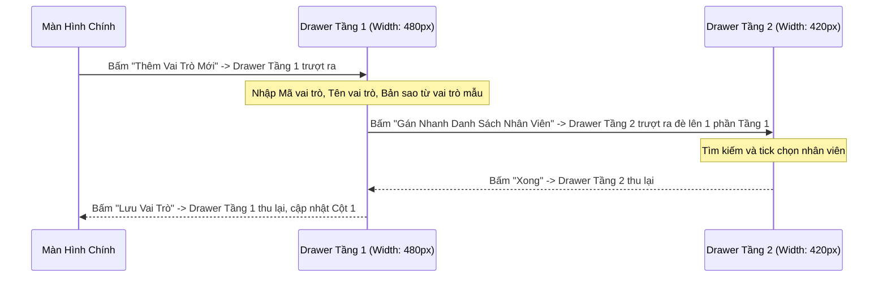

# [DES-02-UI] Thiết Kế Giao Diện & Trải Nghiệm Người Dùng (UI/UX): Super Admin & Ma Trận Phân Quyền Anti-Modal

- **Mã Tài Liệu**: DES-02-UI
- **Phụ Trách**: Solution Architect & UI/UX Specialist
- **Thuộc Sprint**: Sprint 02 - Super Admin & Phân Quyền Toàn Diện
- **Phong Cách Thiết Kế**: Industrial Sharp, Mật Độ Thông Tin Cao (High Density), Triệt Để Anti-Modal
- **Ngày Hoàn Thành**: 2026-09-18

---

## 1. Nguyên Tắc Thiết Kế Cốt Lõi (Core UI/UX Principles)

1. **Mật Độ Thông Tin Cao (High Information Density)**:
   - Font chữ chuẩn: `text-xs` (12px) cho nhãn bảng và dữ liệu chi tiết; `text-sm` (13px) cho tiêu đề nhóm và form controls.
   - Khoảng cách đệm và lề tối giản: `p-1`, `p-2`, `gap-1`, `space-y-1.5`. Giảm thiểu cuộn trang, hiển thị tối đa thông tin quan trọng trong một khung nhìn.
2. **Phong Cách Sắc Nét, Vuông Vắn (Industrial Sharp Aesthetic)**:
   - Bo góc siêu nhỏ hoặc góc vuông hoàn toàn: `rounded-none` hoặc `rounded-sm`.
   - Viền mỏng tinh tế: `border border-neutral-200 dark:border-neutral-800`.
   - Màu sắc phân định: Cổng Super Admin sử dụng viền nhấn màu Tím Đậm / Đỏ Thẫm (`indigo-900` / `rose-900`) để phân biệt rõ với không gian Tenant thông thường (`slate-900` / `blue-600`).
3. **Triệt Để Anti-Modal (Không Dùng Modal Popup)**:
   - Cấm dùng popup modal che khuất màn hình. Thay thế 100% bằng **Split-Screen (Chia màn hình đa cột)** và **Drawer (Side sheet trượt cạnh phải, hỗ trợ xếp chồng đa tầng - Stacked Drawers)**.

---

## 2. Bố Cục Cổng Quản Trị Nền Tảng (Super Admin Platform Portal)

### 2.1. Thanh Điều Hướng Nền Tảng (Platform Topbar)
- Hiển thị dải màu nhận diện riêng biệt: Nền tối `bg-neutral-900 text-white border-b border-indigo-700`.
- Huy hiệu nổi bật: `[PLATFORM SUPER ADMIN]` màu tím dạ quang `bg-indigo-500/20 text-indigo-300 border border-indigo-500/40 text-[10px] px-1.5 py-0.5`.
- Menu chức năng:
  - `Quản Lý Tenant` (`/platform/tenants`)
  - `Người Dùng Toàn Cầu` (`/platform/users`)
  - `Quản Trị Super Admin` (`/platform/admins`) — chỉ hiển thị với SUPER_ADMIN (FEAT-18)
  - `Sức Khỏe Hạ Tầng` (`/platform/health`)
  - `Nhật Ký Kiểm Toán` (`/platform/audit-logs`)
- Góc phải: Bộ chuyển đổi Sáng/Tối/Hệ thống (`ThemeSwitcher`) và Thông tin Super Admin.

### 2.2. Dải Băng Cảnh Báo Khi Impersonate (Persistent Impersonation Banner)
Khi Super Admin đang đăng nhập đại diện vào một Tenant, thanh này ghim cố định ở vị trí cao nhất trên toàn màn hình (`sticky top-0 z-50`):
```
+----------------------------------------------------------------------------------------------------------------------------------------------+
| ⚠️ BẠN ĐANG TRUY CẬP ĐẠI DIỆN HỖ TRỢ BỞI ops-admin@openerp.9ms.io.vn • TICKET TCK-9981 • CÒN LẠI 27:45 | [KẾT THÚC PHIÊN] |
+----------------------------------------------------------------------------------------------------------------------------------------------+
```
- **Key i18n chuẩn hóa (BUG-69)**: `IMPERSONATION_ACTIVE_BANNER` = `"BẠN ĐANG TRUY CẬP ĐẠI DIỆN HỖ TRỢ BỞI {admin_email} • TICKET {ticket} • CÒN LẠI {mm:ss}"`. Ba tham số `{admin_email}`, `{ticket}`, `{mm:ss}` được bind động từ dữ liệu phiên, tuyệt đối không hardcode chuỗi hiển thị.
- **Màu sắc**: `bg-amber-500 text-neutral-950 font-medium px-3 py-1 text-xs flex justify-between items-center shadow-md animate-pulse`.
- **Nút hành động**: Nút `[KẾT THÚC PHIÊN]` màu đen vuông vắn `bg-neutral-900 text-white px-2 py-0.5 hover:bg-neutral-800` gọi API thoát đại diện và đưa Admin về cổng quản trị.

---

## 3. Bố Cục Màn Hình Phân Quyền Split-Screen (Role & Permission Matrix)

Màn hình phân quyền của Tenant (`/settings/roles`) được thiết kế chia làm **3 Cột Đồng Thời (Split-Screen View)** trên Web Desktop ($\ge$ 1280px):

```
+--------------------------+-------------------------------------+--------------------------------------------------------+
| CỘT 1: DANH SÁCH VAI TRÒ | CỘT 2: QUYỀN CHỨC NĂNG (RBAC)       | CỘT 3: MA TRẬN PHẠM VI DỮ LIỆU (DATA SCOPES)           |
| (Chiều rộng: 260px)      | (Chiều rộng: 360px)                 | (Phần còn lại chiếm trọn màn hình)                     |
+--------------------------+-------------------------------------+--------------------------------------------------------+
| [+ Thêm Vai Trò]         | Vai Trò Đang Chọn: SALES_LEAD       | Thiết Lập Phạm Vi & Thao Tác Cho: SALES_LEAD          |
|                          | Nhóm: Bán Hàng (Sales)              |                                                        |
| [SYS] TENANT_OWNER       | [x] sales:order:read                | +--------------+--------+--------+--------+--------+---+ |
| [SYS] TENANT_ADMIN       | [x] sales:order:create              | | Tài Nguyên   | Xem    | Tạo    | Sửa    | Xóa    |...| |
| [SYS] GENERAL_MANAGER    | [x] sales:order:update              | +--------------+--------+--------+--------+--------+---+ |
| > [*] SALES_LEAD (4)     | [ ] sales:order:delete              | | ĐƠN HÀNG     | [SUBv] | [BR v] | [OWNv] | [NO v] |   | |
|   [*] Kế Toán Kho (2)    | [ ] sales:order:approve             | | KHÁCH HÀNG   | [BR v] | [BR v] | [OWNv] | [NO v] |   | |
|   [*] Nhân Viên Bán Lẻ (6| Nhóm: Quản Trị Hệ Thống (Core)      | | BÁO GIÁ      | [SUBv] | [BR v] | [OWNv] | [NO v] |   | |
|                          | [ ] core:user:read                  | | CÔNG NỢ      | [NO v] | [NO v] | [NO v] | [NO v] |   | |
|                          | [ ] core:role:manage                | +--------------+--------+--------+--------+--------+---+ |
+--------------------------+-------------------------------------+--------------------------------------------------------+
```

### Chi Tiết Tương Tác:
1. **Cột 1 (Vai Trò)**:
   - Danh sách cuộn độc lập, có ô tìm kiếm nhanh tên vai trò.
   - Badge `[SYS]` màu xám nhạt cho vai trò hệ thống, badge `[*]` màu xanh cho vai trò tùy biến.
   - Bấm chọn vai trò nào $\rightarrow$ Cột 2 và Cột 3 tự động cập nhật dữ liệu của vai trò đó mà không cần tải lại trang.
2. **Cột 2 (Quyền Chức Năng)**:
   - Các quyền được gom nhóm dạng Accordion theo Domain (`Bán Hàng`, `Kho Hàng`, `Kế Toán`, `Cốt Lõi`).
   - Mỗi dòng là một Switch Toggle siêu nhỏ (`h-4 w-7`) với nhãn mã quyền và mô tả song ngữ.
3. **Cột 3 (Ma Trận Phạm Vi Dữ Liệu)**:
   - Lưới bảng vuông vắn với 6 cột thao tác: **Xem (Read)**, **Tạo (Create)**, **Sửa (Update)**, **Xóa (Delete)**, **Xuất file (Export)**, **Chia sẻ (Share)**.
   - Mỗi ô là một Select Dropdown nhỏ gọn có nhãn rút gọn và màu sắc phân biệt:
     - `ALL` (Toàn cty): Chữ màu tím dạ quang `text-purple-600 dark:text-purple-400 font-semibold`.
     - `BR` (Chi nhánh): Chữ màu xanh dương `text-blue-600 dark:text-blue-400`.
     - `DEPT` (Phòng ban): Chữ màu lục `text-emerald-600 dark:text-emerald-400`.
     - `DEPT+` (Phòng ban & phòng ban con - `DEPARTMENT_AND_CHILDREN`): Chữ màu cyan `text-cyan-600 dark:text-cyan-400`.
     - `SUB` (Cấp dưới): Chữ màu cam `text-amber-600 dark:text-amber-400`.
     - `OWN` (Cá nhân): Chữ màu xám đậm `text-neutral-700 dark:text-neutral-300`.
     - `NO` (Cấm): Chữ màu đỏ nhạt `text-rose-500 font-medium`.

---

## 4. Hệ Thống Drawer Trượt Xếp Chồng (Stacked Drawers Anti-Modal)

Khi người dùng cần thực hiện các thao tác phụ trợ, hệ thống sử dụng Drawer trượt từ cạnh phải:



### Các Drawer Cốt Lõi Trong Sprint 02:
1. `TenantQuotaDrawer` (Super Admin): Trượt ra khi bấm cấu hình quota của một Tenant. Hiển thị thanh đo dung lượng (Storage Progress Bar) và các ô nhập số liệu người dùng tối đa.
2. `ImpersonateConfirmDrawer` (Super Admin): Form nhập Ticket ID, lý do hỗ trợ và mật khẩu xác nhận với các điều khoản pháp lý bắt buộc tick đồng ý.
3. `DepartmentFormDrawer` (Tenant): Tạo/Sửa phòng ban, chọn phòng ban cha từ dropdown dạng cây và chọn Trưởng phòng.
4. `UserAssignmentDrawer` (Tenant): Gán nhân viên vào Chi nhánh, Phòng ban và chỉ định Quản lý trực tiếp.
5. `BranchAssignmentDrawer` (Tenant): Phân công quản lý nhiều Chi nhánh — chọn nhân sự + tick nhiều Chi nhánh (cột `Quản lý`) + radio `Chi nhánh chính` (đảm bảo tối đa 1 primary); lưu qua API `/api/v1/organization/branch-assignments` (TASK-289).

Trong danh sách nhân sự của màn Cơ cấu tổ chức (`/settings/memberships`), mỗi nhân sự có phân công quản lý hiển thị badge `ORGANIZATION_BRANCH_ASSIGNMENT_MANAGE_BADGE` ("Quản lý {count} chi nhánh"); bấm badge mở `BranchAssignmentDrawer` tương ứng.

### 4.6. Màn Hình Nhật Ký Kiểm Toán Nền Tảng (`/platform/audit-logs`) & Drawer Chi Tiết

Bảng nhật ký mật độ cao (Industrial Sharp) bổ sung các cột và bộ lọc phục vụ đối soát bất biến (BUG-72):

| Cột | Nội dung | Ghi chú |
| :--- | :--- | :--- |
| Thời gian | `created_at` (giờ địa phương + UTC) | Sắp xếp giảm dần mặc định |
| Actor | `actor_email` + badge `actor_type` | SUPER_ADMIN tím, SYSTEM xám |
| Hành động | `action` (enum `AuditAction`) | Nhãn i18n theo action |
| **Scope** | Badge `PLATFORM` / `TENANT` | Tím nhạt / xanh lam nhạt |
| **Result** | Badge màu: `SUCCESS` (xanh lục), `DENIED` (vàng), `FAILED` (đỏ) | Nhãn `PLATFORM_AUDIT_RESULT` |
| **Correlation** | `correlation_id` rút gọn 8 ký tự đầu, hover/copy xem đủ | Truy vết xuyên service |
| Target | `target_tenant_name` / `resource_type:resource_id` | — |
| IP | `ip_address` | — |

- **Bộ lọc mật độ cao**: khoảng thời gian (`from_date`/`to_date`), `scope`, `result`, `action`, `actor_user_id`, `resource_type`, `tenant_id`, `keyword` (tìm trong `details`).
- **Drawer chi tiết `AuditLogDetailDrawer`** (trượt phải, rộng 560px, Anti-Modal):
  1. **Diff JSON `before` / `after`**: hai cột đối chiếu (trước: nền đỏ nhạt, sau: nền xanh lục nhạt), highlight khác biệt từng khóa.
  2. **`reason`**: lý do hành động, bắt buộc hiển thị nếu có.
  3. **Khối "Chuỗi toàn vẹn" (Integrity Chain)**: hiển thị `prev_hash`, `entry_hash` dạng monospace (copy được) kèm badge trạng thái `VERIFIED` màu xanh lục (`PLATFORM_AUDIT_CHAIN_VERIFIED`); dữ liệu lấy từ `GET /api/v1/platform/audit-logs/{id}`.
  4. Metadata: `event_id`, `correlation_id`, `ip_address`, `user_agent`, `created_at`.
- **Ghi chú deferred**: màn hình xem audit cho **Tenant Admin** (scope `TENANT`) **deferred Sprint sau** — cần bổ sung permission `core:audit:read` + RLS cô lập tenant; Sprint 02 chỉ ghi log tenant-scope và xem qua Platform API.

### 4.7. Màn Hình Quản Trị Super Admin (`/platform/admins`) — FEAT-18

Màn hình danh sách tài khoản quản trị nền tảng (mật độ cao, Industrial Sharp), chỉ hiển thị với SUPER_ADMIN:

| Cột | Nội dung | Ghi chú |
| :--- | :--- | :--- |
| Email | `email` + `full_name` | Cột nhận diện chính |
| Vai trò | Badge `[SUPER_ADMIN]` (tím đậm) / `[SUPPORT]` (xanh lam) | `role` |
| Trạng thái | Badge `INVITED`/`ACTIVE`/`DISABLED`/`REVOKED` (nhãn `PLATFORM_ADMIN_STATUS`) | Xám / xanh lục / vàng / đỏ |
| 2FA | `two_factor_required` + `is_2fa_enabled` | Cảnh báo vàng nếu bắt buộc mà chưa bật |
| Đăng nhập cuối | `last_login_at` | — |
| Hành động | Enable/Disable, Revoke, Reset mật khẩu, Disable 2FA | Inline confirm + nhập mật khẩu xác nhận |

- **Nút "Cấp quyền"** (`PLATFORM_ADMIN_GRANT_BTN`) mở `PlatformAdminGrantDrawer` (Drawer trượt phải, Anti-Modal): nhập email, họ tên, chọn role `SUPER_ADMIN`/`SUPPORT_ENGINEER`; nếu email chưa tồn tại hiển thị ghi chú "hệ thống sẽ gửi lời mời thiết lập mật khẩu".
- **Disable/Revoke**: bắt buộc nhập lý do + mật khẩu xác nhận; nút disable/revoke chính mình bị vô hiệu hóa (disabled state) kèm tooltip `PLATFORM_SELF_DISABLE_FORBIDDEN`; khi chỉ còn 1 admin active, nút disable admin đó hiển thị cảnh báo `PLATFORM_LAST_ADMIN_PROTECTED`.
- **Thiết lập bắt buộc**: admin có `must_change_password`/`two_factor_required` chưa hoàn tất bị điều hướng tới màn Đổi mật khẩu/Thiết lập 2FA bắt buộc, không truy cập các màn `/platform/*` khác.
- Không dùng Modal; mọi xác nhận dùng inline confirm hoặc Drawer.

---

## 5. Trải Nghiệm Trên Điện Thoại Di Động (Mobile Ionic 8 - Viewport 390x844px)

Trên ứng dụng di động Ionic 8, giao diện được tối ưu hóa cho màn hình cảm ứng:
1. **Quy tắc kích thước chạm (Tap Targets)**:
   - Toàn bộ nút bấm, hàng danh sách, item chọn đều có chiều cao tối thiểu **$\ge$ 40px** (`min-h-[40px]`).
   - Khoảng cách an toàn (Safe-area padding) cho vùng tai thỏ / Dynamic Island và thanh điều hướng đáy điện thoại.
2. **Không tràn ngang (`overflow-x = 0`)**:
   - Thay vì hiển thị ma trận 3 cột (Split-Screen), trên Mobile được chuyển đổi thành **Luồng xem theo tab hoặc danh sách lồng**:
     - Màn hình 1: Danh sách các Vai trò.
     - Chạm vào một vai trò $\rightarrow$ Chuyển sang trang Chi tiết vai trò với 2 Tab con: `Quyền Chức Năng` (Danh sách toggle cuộn dọc) và `Phạm Vi Dữ Liệu` (Danh sách thẻ Resource, mỗi thẻ mở Action Sheet chọn Scope).
3. **Màn hình Super Admin Khẩn Cấp Trên Mobile**:
   - Trang tổng quan thu gọn hiển thị 3 thẻ trạng thái: Số Tenant đang hoạt động, Cảnh báo dung lượng và Đèn xanh/vàng/đỏ của DB/Redis/Kafka.
   - Thao tác nhanh: Khóa khẩn cấp Tenant có hộp thoại trượt từ đáy màn hình (Action Sheet) xác nhận mật khẩu.

---

## 6. Bộ Từ Điển Mã Đa Ngôn Ngữ i18n (i18n Translation Keys)

| Mã i18n | Tiếng Việt (`vi.json`) | Tiếng Anh (`en.json`) |
| :--- | :--- | :--- |
| `PLATFORM_PORTAL_TITLE` | Cổng Quản Trị Nền Tảng | Platform Administration Portal |
| `PLATFORM_TENANT_MANAGEMENT` | Quản Lý Khách Thuê (Tenants) | Tenant Management |
| `PLATFORM_SYSTEM_HEALTH` | Sức Khỏe Hạ Tầng | System Infrastructure Health |
| `PLATFORM_AUDIT_TRAIL` | Nhật Ký Kiểm Toán Nền Tảng | Platform Audit Trail |
| `PLATFORM_AUDIT_SCOPE` | Phạm Vi Áp Dụng | Audit Scope |
| `PLATFORM_AUDIT_RESULT` | Kết Quả Hành Động | Action Result |
| `PLATFORM_AUDIT_CHAIN_VERIFIED` | Chuỗi Toàn Vẹn: Đã Xác Minh | Integrity Chain: Verified |
| `PLATFORM_ADMINS_TITLE` | Quản Trị Super Admin | Super Admin Management |
| `PLATFORM_ADMIN_GRANT_BTN` | Cấp quyền | Grant Access |
| `PLATFORM_ADMIN_DISABLE_BTN` | Vô hiệu hóa | Disable |
| `PLATFORM_ADMIN_STATUS` | Trạng thái quản trị viên | Admin Status |
| `IMPERSONATION_ACTIVE_BANNER` | BẠN ĐANG TRUY CẬP ĐẠI DIỆN HỖ TRỢ BỞI {admin_email} • TICKET {ticket} • CÒN LẠI {mm:ss} | SUPPORT IMPERSONATION ACTIVE BY {admin_email} • TICKET {ticket} • REMAINING {mm:ss} |
| `IMPERSONATION_EXIT_BTN` | Kết Thúc Phiên | Exit Impersonation |
| `IAM_ROLE_MANAGEMENT` | Quản Lý Vai Trò & Phân Quyền | Role & Permission Management |
| `IAM_DATA_SCOPE_ALL` | Toàn bộ tổ chức | Entire Organization |
| `IAM_DATA_SCOPE_BRANCH` | Cùng chi nhánh | Same Branch |
| `IAM_DATA_SCOPE_DEPT_CHILDREN` | Phòng ban & phòng ban con | Department & Sub-departments |
| `IAM_DATA_SCOPE_DEPT` | Chỉ phòng ban trực tiếp | Direct Department Only |
| `IAM_DATA_SCOPE_SUBORDINATES` | Bản thân & Cấp dưới | Self & Subordinates |
| `IAM_DATA_SCOPE_OWN` | Chỉ bản thân | Self Only |
| `IAM_DATA_SCOPE_NONE` | Không có quyền | No Permission |
| `ORGANIZATION_STRUCTURE` | Cơ Cấu Tổ Chức | Organizational Structure |
| `ORGANIZATION_BRANCHES` | Danh Mục Chi Nhánh | Branch List |
| `ORGANIZATION_DEPARTMENT_TREE` | Cây Sơ Đồ Phòng Ban | Department Hierarchy Tree |
| `IAM_PERMISSION_DENIED_FUNCTIONAL` | Bạn không có quyền thực hiện chức năng này | You do not have permission for this function |
| `IAM_PERMISSION_DENIED_DATA_SCOPE` | Bạn không có quyền truy cập dữ liệu ngoài phạm vi được phép | You cannot access data outside your allowed scope |
| `IAM_PERMISSION_DENIED_EXPORT` | Bạn không được phép xuất dữ liệu tài nguyên này | You are not allowed to export this resource data |
| `PLATFORM_TENANT_QUOTA_EXCEEDED` | Hạn mức khách thuê đã vượt giới hạn cho phép | Tenant quota exceeds the allowed limit |
| `PLATFORM_TENANT_LOCK_SUCCESS` | Khóa khách thuê thành công | Tenant locked successfully |
| `PLATFORM_TENANT_UNLOCK_SUCCESS` | Mở khóa khách thuê thành công | Tenant unlocked successfully |
| `PLATFORM_USER_LOCKED_SUCCESS` | Khóa người dùng thành công | User locked successfully |
| `PLATFORM_USER_UNLOCKED_SUCCESS` | Mở khóa người dùng thành công | User unlocked successfully |
| `PLATFORM_USER_PASSWORD_RESET_FORCED` | Đã buộc đặt lại mật khẩu người dùng | User password reset forced |
| `PLATFORM_USER_2FA_DISABLED_BY_BREAK_GLASS` | Đã tắt 2FA theo quy trình break-glass | 2FA disabled via break-glass |
| `ORGANIZATION_DEPARTMENT_CYCLE_DETECTED` | Phát hiện vòng lặp trong cây phòng ban | Circular loop detected in the department tree |
| `PLATFORM_GLOBAL_USERS` | Người Dùng Toàn Cầu | Global Users |
| `PLATFORM_IMPERSONATION_LOG_LIST` | Nhật Ký Phiên Đại Diện | Impersonation Sessions |
| `ORGANIZATION_MEMBERSHIPS` | Thành Viên & Quản Lý Trực Tiếp | Memberships & Reporting Lines |
| `ORGANIZATION_BRANCH_ASSIGNMENT_TITLE` | Phân Công Quản Lý Chi Nhánh | Branch Assignment |
| `ORGANIZATION_BRANCH_ASSIGNMENT_BRANCHES` | Chi Nhánh Quản Lý | Managed Branches |
| `ORGANIZATION_BRANCH_ASSIGNMENT_PRIMARY_BRANCH` | Chi Nhánh Chính | Primary Branch |
| `ORGANIZATION_BRANCH_ASSIGNMENT_MANAGE_BADGE` | Quản lý {count} chi nhánh | Manages {count} branches |
| `IAM_TAB_FUNCTIONAL_PERMISSIONS` | Quyền Chức Năng | Functional Permissions |
| `IAM_TAB_DATA_SCOPES` | Phạm Vi Dữ Liệu | Data Scopes |
| `COMMON_SAVE` | Lưu | Save |
| `COMMON_CANCEL` | Hủy | Cancel |
| `COMMON_DELETE` | Xóa | Delete |
| `COMMON_CONFIRM` | Xác Nhận | Confirm |

> **Lưu ý**: Bảng trên liệt kê các key chính xuất hiện trong Sprint 02. Từ điển đầy đủ (full dictionary) nằm tại `frontend/{web,mobile}/public/i18n/{vi,en}.json`; mọi chuỗi mới phát sinh phải được bổ sung đồng thời cả `vi` và `en`, không hardcode trong template.

---

## 7. Điều Hướng, Routes & Guard (TASK-280, TASK-281)

### 7.1. Bảng Routes & Guard (Web Angular)
| Route | Màn hình | Guard | Điều kiện cho phép |
| :--- | :--- | :--- | :--- |
| `/platform/tenants` | Quản lý Tenant (Super Admin) | `platformRoleGuard` | token có `platform_role = SUPER_ADMIN` **và** `groups` chứa `SUPER_ADMIN` |
| `/platform/tenants/:id` | Chi tiết Tenant (split-screen + drawer quota) | `platformRoleGuard` | như trên |
| `/platform/users` | Người dùng toàn cầu (khóa/mở khóa/break-glass) | `platformRoleGuard` | như trên |
| `/platform/admins` | Quản trị tài khoản Super Admin (grant/disable/revoke) | `platformRoleGuard` | như trên, chỉ `SUPER_ADMIN` (không dành cho SUPPORT_ENGINEER) |
| `/platform/health` | Sức khỏe hạ tầng | `platformRoleGuard` | như trên |
| `/platform/audit-logs` | Nhật ký kiểm toán nền tảng | `platformRoleGuard` | như trên |
| `/platform/impersonation-logs` | Nhật ký phiên đại diện | `platformRoleGuard` | như trên |
| `/settings/roles` | Vai trò & Phân quyền (Tenant Admin) | `permissionGuard` | `core:role:manage` |
| `/settings/organization` | Cơ cấu tổ chức (chi nhánh + cây phòng ban) | `permissionGuard` | `core:organization:manage` |
| `/settings/memberships` | Thành viên & quản lý trực tiếp | `permissionGuard` | `core:organization:manage` |

- Người dùng Tenant thường chạm route `/platform/*` $\rightarrow$ `platformRoleGuard` chuyển hướng về trang chủ tenant.
- Người dùng thiếu quyền chức năng chạm `/settings/*` $\rightarrow$ `permissionGuard` chặn và hiển thị `IAM_PERMISSION_DENIED_FUNCTIONAL`.

### 7.2. Điều Hướng Mobile Ionic 8 (Viewport 390x844px)
1. **Tenant Admin (bổ sung mục menu chính)**:
   - `Vai Trò & Phân Quyền` — màn Vai trò dạng danh sách + tab (theo mục 5).
   - `Cơ Cấu Tổ Chức` — danh sách chi nhánh + cây phòng ban dạng accordion.
2. **Super Admin (màn hình khẩn cấp)**: giữ màn tổng quan thu gọn 3 thẻ trạng thái; bổ sung 2 thao tác khẩn cấp dạng Action Sheet trượt từ đáy:
   - **Khóa Tenant**: danh sách tenant + nhập lý do; gọi `POST /api/v1/platform/tenants/{id}/lock`.
   - **Khóa User**: tìm user toàn cầu + khóa/mở khóa; gọi `POST /api/v1/platform/users/{id}/lock|unlock`.
3. **Ẩn hoàn toàn Impersonation trên Mobile**: không hiển thị nút/menu bắt đầu impersonate, không nhận `impersonation_token` và không render banner impersonation trên Mobile — tính năng này chỉ khả dụng trên bản Web nhằm tránh thao tác hỗ trợ ngoài kiểm soát từ thiết bị di động.
