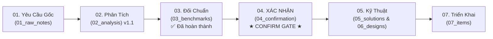

# [00] Bản Đồ Điều Hướng Đọc Tài Liệu Tuần Tự: Sprint 03 - Plugin Manager, Plugin CLI & Cơ Chế Phân Phối Plugin

> **Quy ước mã tài liệu**: Mã SOL/DES/TEST/REV mang phạm vi cục bộ trong từng Sprint-Pack (ví dụ DES-03-API của Sprint 03 khác DES-02 của Sprint 02).

- **Tên Sprint**: Sprint 03 - Plugin Manager, Plugin Scaffolding CLI & Cơ Chế Phân Phối/Cài Đặt Plugin Đa Kênh
- **Mục Tiêu**: Biến cơ chế plugin tĩnh của Sprint 02 thành **Plugin Manager thực thụ**: danh mục plugin + phiên bản trong DB; vòng đời cài/gỡ/bật/tắt/nâng cấp theo từng Tenant; **mỗi plugin chạy container riêng cho từng tenant và được tự động deploy**; chợ plugin (Marketplace) cho Tenant; CLI Node/npm sinh khung dự án plugin chuẩn hóa; và cơ chế đưa plugin vào hệ thống qua 3 kênh: Docker Hub, Image Registry (link + credentials đa phạm vi) và tệp JAR backend + bản build Web (Core tự build image).
- **Thời Gian Dự Kiến**: 2026-10-20 đến 2026-11-02 (2 tuần)
- **Trạng Thái Hiện Tại**: [ ] **BƯỚC 1-3 HOÀN TẤT — CHỜ KHÁCH HÀNG REVIEW ĐỐI CHUẨN VÀ PHÊ DUYỆT CONFIRMATION GATE (BƯỚC 4)**; nghiêm cấm chuyển sang Bước 5-7 khi chưa có xác nhận tại Bước 4.

---

## Hướng Dẫn Dành Cho Khách Hàng / Reviewer: Đọc Từ Đâu Đến Đâu?

Để nắm bắt trọn vẹn giải pháp và không bỏ sót bất kỳ quy tắc an toàn nào, **bạn chỉ cần đọc tài liệu theo đúng thứ tự tuần tự từ Bước 1 đến Bước 4 dưới đây**:

---

## 🗳️ Quyết Định Lớn Đã Chốt Tại Phiên Review Bước 1-2 (2026-09-19)

| # | Chủ Đề | Quyết Định Của Khách Hàng |
| :---: | :--- | :--- |
| 1 | Dữ liệu entitlement + cài đặt | **Một bảng duy nhất** (gộp quyền được cài + trạng thái cài đặt). |
| 2 | Gỡ plugin & dữ liệu | **Chỉ gỡ plugin, giữ nguyên dữ liệu**; dữ liệu plugin đã gỡ không được làm hỏng hệ thống. |
| 3 | Khóa plugin | **Cưỡng chế gỡ toàn bộ tenant** + **thông báo** tenant bị ảnh hưởng. |
| 4 | Core modules | **Tách riêng** khỏi cơ chế plugin để dễ quản lý/nâng cấp. |
| 5 | Cài cấp hệ thống | **Có** — plugin mặc định hệ thống, tenant mới áp dụng tự động. |
| 6 | Marketplace | **Chỉ hiển thị plugin đã được cấp phép**. |
| 7 | Dùng thử plugin | **Không có**; đơn vị phát triển plugin tự triển khai nếu muốn. |
| 8 | Phụ thuộc khi gỡ | **Chặn gỡ + đưa lộ trình thứ tự gỡ**. |
| 9 | Công nghệ CLI | **Node.js**, phát hành **npm/npx**; **repo riêng + git submodule**; có command sinh entity/menu; package + checksum; hỗ trợ PostgreSQL/MongoDB; sinh Dockerfile/K8s. |
| 10 | Mô hình plugin runtime | **Mỗi tenant một container**, **tự động deploy**. |
| 11 | JAR tải lên | **Tự build thành image rồi deploy** (không nạp động vào Core). |
| 12 | Web plugin trong Core | Hai chế độ: **màn hình riêng** HOẶC **nhúng vào màn hình có sẵn của Core/plugin khác** (UI Contribution vào UI Slot); kỹ thuật **Web Components + Module Federation** cho nhúng trực tiếp (chốt 2026-09-19), **iframe sandbox** là chế độ dự phòng. |
| 13 | Lưu trữ artifact | **MinIO**. |
| 14 | Ký số | **Để giai đoạn sau**; Sprint 03 dùng checksum SHA-256. |
| 15 | Credentials registry | **Đa phạm vi**: tầng nền tảng nhiều credential, tầng tenant cũng vậy. |
| 16 | Migration DB plugin | **Plugin tự chạy migrate**. |
| 17 | Đa phiên bản | **Có** — tenant A dùng v1, tenant B dùng v2. |
| 18 | Plugin riêng của Tenant | **Tenant Admin cũng được đăng ký/cài custom plugin cho tenant của họ** (`TENANT_PRIVATE`), không chỉ Super Admin; vẫn qua xác minh artifact đầy đủ; nền tảng giám sát + khóa khẩn cấp. |
| 19 | Cô lập dữ liệu Tenant | **Dữ liệu riêng của mỗi tenant ở schema/DB khác nhau** (`DEDICATED_SCHEMA` mặc định, `DEDICATED_DATABASE` cho Enterprise); plugin chỉ migrate trong phạm vi tenant; DB role least privilege — không ảnh hưởng tenant khác. Dữ liệu **Core** giữ `SHARED_SCHEMA_RLS` trong Sprint 03 (theo đề xuất BA). |

---

## 🧭 Lộ Trình Đọc Tuần Tự & Trạng Thái Phê Duyệt

### 📌 Giai Đoạn 1: Xem Xét & Phê Duyệt Nghiệp Vụ (Khách Hàng / Product Owner) — **ĐANG Ở ĐÂY**

| Thứ Tự Đọc | Thư Mục / File | Mục Đích Nội Dung | Người Phụ Trách | Trạng Thái |
| :---: | :--- | :--- | :---: | :---: |
| **1** | [01_raw_notes/](01_raw_notes/) • [RAW-01: Quản lý plugin hệ thống & tenant](01_raw_notes/RAW-01_plugin_management_system_tenant.md) • [RAW-02: CLI tạo dự án plugin mới](01_raw_notes/RAW-02_plugin_scaffold_cli.md) • [RAW-03: Cơ chế phân phối Docker Hub / Registry / JAR + Web](01_raw_notes/RAW-03_plugin_distribution_channels.md) | **Kiểm tra ghi nhận yêu cầu thô**: 3 nhóm yêu cầu Sprint 03 kèm bối cảnh kế thừa Sprint 02 và **phản hồi làm rõ của khách hàng (Mục 4 mỗi file)**. | BA Agent | [x] Đã ghi nhận |
| **2** | [02_analysis/](02_analysis/) • [ANL-01: Plugin Manager — Danh mục & Vòng đời (v1.3)](02_analysis/ANL-01_plugin_manager_lifecycle.md) • [ANL-02: Plugin Scaffolding CLI (v1.2)](02_analysis/ANL-02_plugin_scaffold_cli.md) • [ANL-03: Phân phối & Cài đặt đa kênh (v1.3)](02_analysis/ANL-03_plugin_distribution_and_installation.md) | **Đọc phân tích nghiệp vụ chuyên sâu (đã cập nhật theo toàn bộ quyết định 2026-09-19)**: mô hình 1 bảng duy nhất; core tách riêng; container-per-tenant + auto-deploy; soft uninstall giữ dữ liệu; khóa plugin cưỡng chế gỡ + thông báo; CLI Node/npm; 3 kênh phân phối; MinIO; credentials đa phạm vi; đa phiên bản song song; plugin riêng của Tenant; cô lập dữ liệu schema/DB riêng; nhúng UI bằng Web Components/Module Federation. | BA Agent | [x] **Đã hoàn thành v1.3 (chờ review)** |
| **3** | [03_benchmarks/](03_benchmarks/) • [BENCH-01: Danh mục & Vòng đời plugin theo Tenant](03_benchmarks/BENCH-01_plugin_manager_catalog_and_tenant_lifecycle.md) • [BENCH-02: Phân phối, Container-per-Tenant, UI Extension & CLI](03_benchmarks/BENCH-02_plugin_distribution_cli_ui_and_isolation.md) | **Xem khảo sát hệ thống hàng đầu**: Odoo, ERPNext/Frappe, WordPress Multisite, Salesforce AppExchange, Atlassian Marketplace (catalog/lifecycle/cô lập dữ liệu); Helm/OCI, Docker Hub, Grafana, Shopify, Backstage, VS Code, Supabase/Neon, JupyterHub (phân phối/runtime/UI); **CLI hệ thống (odoo-bin, Frappe bench, wp-cli, kcadm.sh, occ, Supabase CLI) và CLI/DX phát triển plugin (Grafana create-plugin, Backstage, Shopify, Forge, sf, yo code, ng generate)**. **Kết luận: các quyết định Sprint 03 trùng khớp best practice; đề xuất bổ sung lệnh `dev` cho CLI plugin**. | BA Agent | [x] **Đã hoàn thành (2026-09-19 — chờ khách xem)** |
| **4** | [04_confirmation/](04_confirmation/) **(CONFIRMATION GATE)** | **★ ĐIỂM CHỐT XÁC NHẬN QUAN TRỌNG NHẤT ★**: Khách hàng kiểm tra bảng cam kết phạm vi In-Scope và tiêu chí nghiệm thu (Given-When-Then), đặc biệt các **câu hỏi phát sinh mới** tại Mục 11.2 của ANL-01/02/03 (backend deploy K8s/Docker, resource limits, giới hạn phiên bản runtime, kênh thông báo, duyệt registry host, phê duyệt plugin riêng của tenant, **lệnh `dev` cho CLI plugin**, chế độ render cho plugin riêng). **Chỉ khi khách hàng xác nhận tại file này, bước kỹ thuật (5-7) mới được phép tiến hành.** | Khách Hàng & BA | **[ ] CHƯA PHÊ DUYỆT** |

> **Quy ước theo dõi công việc**: `FEAT-21` (Plugin Manager — Danh mục & Vòng đời), `FEAT-22` (Plugin Scaffolding CLI), `FEAT-23` (Phân phối & Cài đặt đa kênh). Dải mã dự kiến: TASK-301 trở đi (sub-task inline trong FEAT; task phát sinh độc lập tạo file riêng); BUG tiếp nối từ BUG-84. Không nhảy cóc mã giữa các sprint (Sprint 01: 101–149; Sprint 02: 201–298).

---

### 🛠️ Giai Đoạn 2: Xem Xét Giải Pháp Kỹ Thuật & Thiết Kế (Tech Lead / Architect / Dev)

| Thứ Tự Đọc | Thư Mục / File | Mục Đích Nội Dung | Người Phụ Trách | Trạng Thái |
| :---: | :--- | :--- | :---: | :---: |
| **5** | [05_solutions/](05_solutions/) | Nghiên cứu giải pháp kỹ thuật: Plugin Manager trong Quarkus; **Deployer tự động (K8s API + Docker API)**; image build từ bundle (Docker/BuildKit/Kaniko); **Tenant Datasource Router — schema/database riêng theo tenant, DB role least privilege, connection pool theo tenant**; **hợp đồng UI Slot/UI Contribution (Web Components + Module Federation cho nhúng trực tiếp, iframe sandbox dự phòng)**; MinIO; template engine CLI Node; credentials encryption. | Solution Architect | [ ] Chưa thực hiện |
| **6** | [06_designs/](06_designs/) | **Bản thiết kế chi tiết 100% để Developer lập trình**: - CSDL PostgreSQL: `plugin_catalog`, `plugin_versions`, `tenant_plugins` (**1 bảng duy nhất: entitlement + lifecycle + version + deploy**), `plugin_credentials` (đa phạm vi). - Đặc tả REST API chuẩn hóa (i18n code-based) cho platform & tenant, gồm install/upgrade/uninstall/block/credentials. - Thiết kế UI Anti-Modal: Portal plugin Super Admin, Marketplace Tenant, Drawer đăng ký artifact 3 kênh, **2 chế độ hiển thị Web (màn hình riêng + UI Contribution)**, Mobile read-only. - API contract versioning cho đa phiên bản plugin. | Solution Architect | [ ] Chưa thực hiện |
| **7** | [07_items/](07_items/) | **Danh sách hạng mục công việc chi tiết** (FEAT-21→23 + TASK phát sinh) với Acceptance Criteria và sub-task kỹ thuật. | Developer & PM | [ ] Chưa thực hiện |

---

### 🧪 Giai Đoạn 3: Kiểm Thử Chất Lượng & Đóng Sprint (QA / QC & PM)

| Thứ Tự Đọc | Thư Mục / File | Mục Đích Nội Dung | Người Phụ Trách | Trạng Thái |
| :---: | :--- | :--- | :---: | :---: |
| **8** | [08_testing/](08_testing/) | Kế hoạch & Báo cáo kiểm thử: vòng đời plugin đầy đủ (Cài → Nâng cấp → Tắt/Bật → Gỡ, giữ dữ liệu), **deploy container-per-tenant**, đa phiên bản, checksum mismatch, cưỡng chế gỡ + thông báo, cô lập Tenant, Dual-mode browser testing Web/Mobile. | QA/QC Agent | [ ] Chưa thực hiện |
| **9** | [09_review/](09_review/) | Biên bản nghiệm thu và tiêu chuẩn đóng Sprint (DoD Gate: 0 bug Critical/High). | PM Agent | [ ] Chưa thực hiện |

---

## 📦 Hạng Mục Chuyển Tiếp Từ Sprint 02 (Cần Khách Hàng Quyết Định Có Đưa Vào Sprint 03 Không)

| Mã | Hạng Mục | Mức Độ | Ghi Chú |
| :--- | :--- | :---: | :--- |
| **TASK-293** | Cold archive audit log > 24 tháng (MongoDB/S3 WORM) + legal hold | Medium | Đang Deferred từ Sprint 02; cần profile `mongo`/`storage`. |
| (Follow-up) | API mời/thêm thành viên (invite user) | — | Chưa có entry point; liên quan quota người dùng. |
| (Follow-up) | Storage quota enforcement | — | Cần module upload/Storage; **liên quan trực tiếp FEAT-23 (MinIO + artifact)** và dữ liệu plugin giữ lại vẫn tính quota. |
| (Follow-up) | Remote CLI script + subcommand mở rộng (`disable/enable/reset-password/...`) | Low/Medium | Sprint 02 mới có Offline CLI 4 lệnh; **có thể gộp vào FEAT-22 nếu khách hàng đồng ý** (cùng hạ tầng CLI). |
| (QA follow-up) | Re-measure BUG-83 trên app thật (`resp2.mjs`) | Low | FE đã fix + build PASS; QA chốt tại Sprint 03. |

---

## Bảng Checklist Phê Duyệt Của Khách Hàng (Customer Sign-Off Gate)

- [x] **Phiên review Bước 1-2 (2026-09-19)**: Khách hàng đã trả lời **toàn bộ 25 câu hỏi mở**; tài liệu RAW (Mục 4) và ANL (v1.1) đã ghi nhận đầy đủ.
- [ ] **Bước 1**: Đã xem ghi chú yêu cầu thô trong `01_raw_notes/` và đồng ý với phạm vi tiếp nhận.
- [ ] **Bước 2**: Đã xem tài liệu phân tích nghiệp vụ `02_analysis/` (v1.1) và hài lòng với mô hình Plugin Manager, CLI và cơ chế phân phối đề xuất.
- [ ] **Bước 3**: Đã xem tài liệu đối chuẩn `03_benchmarks/`.
- [ ] **Bước 4**: **PHÊ DUYỆT BIÊN BẢN XÁC NHẬN PHẠM VI** `04_confirmation/CONF-01_sprint_03_scope.md`.
- [ ] **Bước 7**: Cho phép triển khai lập trình mã nguồn (Implementation).
- [ ] **Bước 8**: QA nghiệm thu cuối (báo cáo kiểm thử).
- [ ] **Bước 9**: PM đóng Sprint theo DoD Gate; khách hàng ký duyệt nghiệm thu cuối.

> **Ghi chú cho Khách Hàng**: Các **câu hỏi phát sinh mới** (do chính các quyết định vừa chốt) nằm ở **Mục 11.2 của ANL-01/02/03** — ví dụ: backend deploy (K8s/Docker), resource limits mỗi container, giới hạn phiên bản runtime, kênh thông báo khi khóa plugin, duyệt registry host của tenant, phê duyệt plugin riêng của tenant. Vui lòng trả lời trong phiên review hoặc ghi chú vào `04_confirmation/`.
