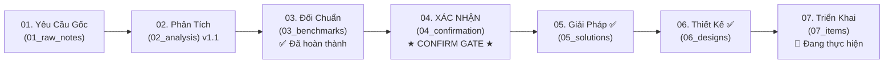

# [00] Bản Đồ Điều Hướng Đọc Tài Liệu Tuần Tự: Sprint 03 - Plugin Manager, Plugin CLI & Cơ Chế Phân Phối Plugin

> **Quy ước mã tài liệu**: Mã SOL/DES/TEST/REV mang phạm vi cục bộ trong từng Sprint-Pack (ví dụ DES-03-API của Sprint 03 khác DES-02 của Sprint 02).

> **Kết quả hiện hành — review lần 3 (2026-09-20)**: [REV-02](09_review/REV-02_document_rereview_2026-09-20.md) đóng 7/8 lỗi vòng 1 ở mức tài liệu; 3 High còn lại (**BUG-86, BUG-92, BUG-93**) **đã được xử lý** tại [REV-02-RESPONSE](09_review/REV-02-response_document_rereview_2026-09-20.md) + [OPENCODE_review3_fixes](09_review/OPENCODE_review3_fixes.md), kèm bằng chứng PostgreSQL cho BUG-92 ([REV-03](09_review/REV-03_postgresql_seed_evidence.md)). Các item đang `In Review`, chờ Reviewer xác nhận đóng. Các bảng review lần 1 bên dưới được giữ làm lịch sử.

> **Review tài liệu 2026-09-20**: [REV-01 — Báo cáo review trước lập trình](09_review/REV-01_document_review_2026-09-20.md) ghi nhận **6 High, 2 Medium** (BUG-84–91) — đã xử lý 8/8. [REV-02 — Review lại tài liệu Sprint 03](09_review/REV-02_document_rereview_2026-09-20.md) ghi nhận **3 High** còn lại (BUG-86 chưa đóng, BUG-92, BUG-93) — đã xử lý tại [REV-02-RESPONSE](09_review/REV-02-response_document_rereview_2026-09-20.md); các item `In Review`, chờ Reviewer/QA xác nhận đóng trước khi lập trình. Đây không phải biên bản đóng Sprint.

- **Tên Sprint**: Sprint 03 - Plugin Manager, Plugin Scaffolding CLI & Cơ Chế Phân Phối/Cài Đặt Plugin Đa Kênh
- **Mục Tiêu**: Biến cơ chế plugin tĩnh của Sprint 02 thành **Plugin Manager thực thụ**: danh mục plugin + phiên bản trong DB; vòng đời cài/gỡ/bật/tắt/nâng cấp theo từng Tenant; **mỗi plugin chạy container riêng cho từng tenant và được tự động deploy**; chợ plugin (Marketplace) cho Tenant; CLI Node/npm sinh khung dự án plugin chuẩn hóa; và cơ chế đưa plugin vào hệ thống qua 3 kênh: Docker Hub, Image Registry (link + credentials đa phạm vi) và tệp JAR backend + bản build Web (Core tự build image).
- **Thời Gian Dự Kiến**: 2026-10-20 đến 2026-11-02 (2 tuần)
- **Trạng Thái Hiện Tại**: [x] **BƯỚC 1-6 HOÀN TẤT**; 🔄 **BƯỚC 7 GẦN HOÀN TẤT** — FEAT-21 (TASK-301→320), FEAT-22 (CLI) và FEAT-23 (TASK-331→345) đã code xong trên thực tế; **backend 210/210 test PASS** trên PostgreSQL thật, Web/Mobile build PASS; BUG-87 đã xác nhận triển khai, BUG-86/92/93/94 đang `In Review` chờ Reviewer; còn **BƯỚC 8 (QA dual-mode + ảnh minh chứng)** và BƯỚC 9 (PM đóng Sprint).

---

## Hướng Dẫn Dành Cho Khách Hàng / Reviewer: Đọc Từ Đâu Đến Đâu?

Để nắm bắt trọn vẹn giải pháp và không bỏ sót bất kỳ quy tắc an toàn nào, **bạn chỉ cần đọc tài liệu theo đúng thứ tự tuần tự từ Bước 1 đến Bước 4 dưới đây**:

```mermaid
flowchart LR
    Step1["01. Yêu Cầu Gốc\n(01_raw_notes)"] --> Step2["02. Phân Tích\n(02_analysis) v1.1"]
    Step2 --> Step3["03. Đối Chuẩn\n(03_benchmarks)\n✅ Đã hoàn thành"]
    Step3 --> Step4["04. XÁC NHẬN\n(04_confirmation)\n★ CONFIRM GATE ★"]
    Step4 --> Step5["05. Giải Pháp ✅\n(05_solutions)"]
    Step5 --> Step5b["06. Thiết Kế ✅\n(06_designs)"]
    Step5b --> Step6["07. Triển Khai\n(07_items)\n🔄 Đang thực hiện"]
```

---

## 🗳️ Quyết Định Lớn Đã Chốt Tại Phiên Review Bước 1-2 (2026-09-19)

| # | Chủ Đề | Quyết Định Của Khách Hàng |
| :---: | :--- | :--- |
| 1 | Dữ liệu entitlement + cài đặt | **Một bảng duy nhất** (gộp quyền được cài + trạng thái cài đặt). |
| 2 | Gỡ plugin & dữ liệu | **Chỉ gỡ plugin, giữ nguyên dữ liệu**; dữ liệu plugin đã gỡ không được làm hỏng hệ thống. |
| 3 | Khóa plugin | **Cưỡng chế gỡ toàn bộ tenant** + **thông báo** tenant bị ảnh hưởng. |
| 4 | Core modules | **Tách riêng** khỏi cơ chế plugin để dễ quản lý/nâng cấp. |
| 5 | Cài cấp hệ thống | **Có** — plugin mặc định hệ thống, tenant mới áp dụng tự động. |
| 6 | Marketplace | **Chỉ hiển thị plugin đã được cấp phép**. |
| 7 | Dùng thử plugin | **Không có**; đơn vị phát triển plugin tự triển khai nếu muốn. |
| 8 | Phụ thuộc khi gỡ | **Chặn gỡ + đưa lộ trình thứ tự gỡ**. |
| 9 | Công nghệ CLI | **Node.js**, phát hành **npm/npx**; **repo riêng + git submodule**; có command sinh entity/menu; package + checksum; hỗ trợ PostgreSQL/MongoDB; sinh Dockerfile/K8s. |
| 10 | Mô hình plugin runtime | **Mỗi tenant một container**, **tự động deploy**. |
| 11 | JAR tải lên | **Tự build thành image rồi deploy** (không nạp động vào Core). |
| 12 | Web plugin trong Core | Hai chế độ: **màn hình riêng** HOẶC **nhúng vào màn hình có sẵn của Core/plugin khác** (UI Contribution vào UI Slot); kỹ thuật **Web Components + Module Federation** cho nhúng trực tiếp (chốt 2026-09-19), **áp dụng cả plugin riêng của tenant**; **iframe sandbox** là chế độ dự phòng. |
| 13 | Lưu trữ artifact | **MinIO**. |
| 14 | Ký số | **Để giai đoạn sau**; Sprint 03 dùng checksum SHA-256. |
| 15 | Credentials registry | **Đa phạm vi**: tầng nền tảng nhiều credential, tầng tenant cũng vậy. |
| 16 | Migration DB plugin | **Plugin tự chạy migrate**. |
| 17 | Đa phiên bản | **Có** — tenant A dùng v1, tenant B dùng v2. |
| 18 | Plugin riêng của Tenant | **Tenant Admin cũng được đăng ký/cài custom plugin cho tenant của họ** (`TENANT_PRIVATE`), không chỉ Super Admin; vẫn qua xác minh artifact đầy đủ; nền tảng giám sát + khóa khẩn cấp. |
| 19 | Cô lập dữ liệu Tenant | **Dữ liệu riêng của mỗi tenant ở schema/DB khác nhau** (`DEDICATED_SCHEMA` mặc định, `DEDICATED_DATABASE` cho Enterprise); plugin chỉ migrate trong phạm vi tenant; DB role least privilege — không ảnh hưởng tenant khác. Dữ liệu **Core** giữ `SHARED_SCHEMA_RLS` trong Sprint 03 (theo đề xuất BA). |
| 20 | Lưu trữ toàn hệ thống | **MinIO là công cụ lưu trữ CHÍNH của toàn hệ thống** (chốt Gate 2026-09-19) — không chỉ artifact plugin. |
| 21 | CLI `dev` | **Đưa lệnh `dev` (plugin local + hot reload + kết nối Core dev) vào Sprint 03** (chốt Gate). |
| 22 | Tên package CLI | **`@open-erp/cli`** — tên chung cho hệ sinh thái (chốt bổ sung 2026-09-19); nhóm lệnh plugin là nhóm đầu tiên. |

---

## 🧭 Lộ Trình Đọc Tuần Tự & Trạng Thái Phê Duyệt

### 📌 Giai Đoạn 1: Xem Xét & Phê Duyệt Nghiệp Vụ (Khách Hàng / Product Owner) — **ĐANG Ở ĐÂY**

| Thứ Tự Đọc | Thư Mục / File | Mục Đích Nội Dung | Người Phụ Trách | Trạng Thái |
| :---: | :--- | :--- | :---: | :---: |
| **1** | [01_raw_notes/](01_raw_notes/) • [RAW-01: Quản lý plugin hệ thống & tenant](01_raw_notes/RAW-01_plugin_management_system_tenant.md) • [RAW-02: CLI tạo dự án plugin mới](01_raw_notes/RAW-02_plugin_scaffold_cli.md) • [RAW-03: Cơ chế phân phối Docker Hub / Registry / JAR + Web](01_raw_notes/RAW-03_plugin_distribution_channels.md) | **Kiểm tra ghi nhận yêu cầu thô**: 3 nhóm yêu cầu Sprint 03 kèm bối cảnh kế thừa Sprint 02 và **phản hồi làm rõ của khách hàng (Mục 4 mỗi file)**. | BA Agent | [x] Đã ghi nhận |
| **2** | [02_analysis/](02_analysis/) • [ANL-01: Plugin Manager — Danh mục & Vòng đời (v1.3)](02_analysis/ANL-01_plugin_manager_lifecycle.md) • [ANL-02: Plugin Scaffolding CLI (v1.2)](02_analysis/ANL-02_plugin_scaffold_cli.md) • [ANL-03: Phân phối & Cài đặt đa kênh (v1.3)](02_analysis/ANL-03_plugin_distribution_and_installation.md) | **Đọc phân tích nghiệp vụ chuyên sâu (đã cập nhật theo toàn bộ quyết định 2026-09-19)**: mô hình 1 bảng duy nhất; core tách riêng; container-per-tenant + auto-deploy; soft uninstall giữ dữ liệu; khóa plugin cưỡng chế gỡ + thông báo; CLI Node/npm; 3 kênh phân phối; MinIO; credentials đa phạm vi; đa phiên bản song song; plugin riêng của Tenant; cô lập dữ liệu schema/DB riêng; nhúng UI bằng Web Components/Module Federation. | BA Agent | [x] **Đã hoàn thành v1.3 (chờ review)** |
| **3** | [03_benchmarks/](03_benchmarks/) • [BENCH-01: Danh mục & Vòng đời plugin theo Tenant](03_benchmarks/BENCH-01_plugin_manager_catalog_and_tenant_lifecycle.md) • [BENCH-02: Phân phối, Container-per-Tenant, UI Extension & CLI](03_benchmarks/BENCH-02_plugin_distribution_cli_ui_and_isolation.md) | **Xem khảo sát hệ thống hàng đầu**: Odoo, ERPNext/Frappe, WordPress Multisite, Salesforce AppExchange, Atlassian Marketplace (catalog/lifecycle/cô lập dữ liệu); Helm/OCI, Docker Hub, Grafana, Shopify, Backstage, VS Code, Supabase/Neon, JupyterHub (phân phối/runtime/UI); **CLI hệ thống (odoo-bin, Frappe bench, wp-cli, kcadm.sh, occ, Supabase CLI) và CLI/DX phát triển plugin (Grafana create-plugin, Backstage, Shopify, Forge, sf, yo code, ng generate)**. **Kết luận: các quyết định Sprint 03 trùng khớp best practice; đề xuất bổ sung lệnh `dev` cho CLI plugin**. | BA Agent | [x] **Đã hoàn thành (2026-09-19 — chờ khách xem)** |
| **4** | [04_confirmation/](04_confirmation/) • [CONF-01: Phạm vi & Tiêu chí nghiệm thu Sprint 03](04_confirmation/CONF-01_sprint_03_scope.md) **(CONFIRMATION GATE)** | **★ ĐIỂM CHỐT XÁC NHẬN QUAN TRỌNG NHẤT ★**: Khách hàng kiểm tra phạm vi In/Out-Scope, **18 kịch bản Acceptance Criteria (Given-When-Then)** và trả lời **10 câu hỏi chốt cuối** (Mục 5: backend deploy K8s/Docker, image build, resource limits, giới hạn phiên bản runtime, MinIO, kênh thông báo, plugin mặc định, phê duyệt plugin riêng, render mode plugin riêng, lệnh `dev`). | Khách Hàng & BA | **[x] ĐÃ PHÊ DUYỆT (2026-09-19) — Gate ĐÓNG** |

> **Quy ước theo dõi công việc**: `FEAT-21` (Plugin Manager — Danh mục & Vòng đời), `FEAT-22` (Plugin Scaffolding CLI), `FEAT-23` (Phân phối & Cài đặt đa kênh). Dải mã dự kiến: TASK-301 trở đi (sub-task inline trong FEAT; task phát sinh độc lập tạo file riêng); BUG tiếp nối từ BUG-84. Không nhảy cóc mã giữa các sprint (Sprint 01: 101–149; Sprint 02: 201–298).

---

### 🛠️ Giai Đoạn 2: Xem Xét Giải Pháp Kỹ Thuật & Thiết Kế (Tech Lead / Architect / Dev)

| Thứ Tự Đọc | Thư Mục / File | Mục Đích Nội Dung | Người Phụ Trách | Trạng Thái |
| :---: | :--- | :--- | :---: | :---: |
| **5** | [05_solutions/](05_solutions/) • [SOL-01: Kiến trúc Plugin Manager & Vòng đời](05_solutions/SOL-01_plugin_manager_architecture_and_lifecycle.md) • [SOL-02: Phân phối, Deployer & Cô lập dữ liệu](05_solutions/SOL-02_plugin_distribution_runtime_and_isolation.md) • [SOL-03: UI Extension Runtime & Plugin CLI](05_solutions/SOL-03_plugin_ui_extension_and_cli_dev_experience.md) | **Nghiên cứu giải pháp kỹ thuật**: module `modules/plugin` + Saga orchestrator + một bảng `tenant_plugins` + async job + UI Manifest API; 3 kênh artifact → image (Docker/Kaniko) + `PluginRuntimeDeployer` (Docker/K8s) + `TenantDatasourceService` (schema riêng theo tenant×plugin, DB role least privilege) + MinIO; WC/MF/iframe runtime + CLI Node/npm đủ 10 lệnh (gồm `dev`). | Solution Architect | [x] **Đã hoàn thành (2026-09-19)** |
| **6** | [06_designs/](06_designs/) • [DES-03-DB: Thiết kế CSDL](06_designs/database/PLUGIN_MANAGER_DATABASE_SCHEMA.md) • [DES-03-API: Đặc tả REST API](06_designs/api/PLUGIN_MANAGER_API_SPEC.md) • [DES-03-UI: Đặc tả giao diện](06_designs/ui_ux/PLUGIN_MANAGER_UI_SPEC.md) | **Bản thiết kế chi tiết 100% để Developer lập trình**: - CSDL: 7 bảng (`plugin_catalog`, `plugin_versions`, `tenant_plugins` — **1 bảng duy nhất**, `plugin_credentials`, `plugin_ui_slots`, `plugin_operation_logs`, `tenant_notifications`) + `ALTER tenants` + backfill `allowed_plugins` (V3.0.0/V3.0.1). - API: 18 endpoint Platform + 13 tenant + 3 shared (UI Manifest/Operations/Runtime health) theo 4 khuôn mẫu; `PluginErrorCode`/`PluginResponseKey`. - UI Anti-Modal: Catalog + Drawer 3 tầng, Block/Bulk Apply, Marketplace, Đăng ký 3 kênh, Plugin Host Region (WC/MF/iframe), Mobile read-only; checklist QA dual-mode. | Solution Architect | [x] **Đã hoàn thành (2026-09-19)** |
| **7** | [07_items/](07_items/) • [FEAT-21: Plugin Manager — Danh mục & Vòng đời](07_items/FEAT-21_plugin_manager_lifecycle.md) — TASK-301→320 • [FEAT-22: Plugin Scaffolding CLI `@open-erp/cli`](07_items/FEAT-22_plugin_scaffolding_cli.md) — TASK-321→330 • [FEAT-23: Phân phối, Deployer & Plugin Host Runtime](07_items/FEAT-23_plugin_distribution_runtime_and_host.md) — TASK-331→345 • BUG review: BUG-84→94 | **Danh sách hạng mục công việc chi tiết**: sub-task inline theo từng FEAT với Acceptance Criteria, tham chiếu thẳng DES-03-DB/API/UI + SOL-01/02/03; BUG review theo dõi trạng thái đóng. **Tất cả task chuyển `In Review` — chờ QA (Bước 8) và Reviewer ký BUG.** | Developer & PM | 🔄 **Đang thực hiện (code hoàn tất, chờ QA)** |

---

### 🧪 Giai Đoạn 3: Kiểm Thử Chất Lượng & Đóng Sprint (QA / QC & PM)

| Thứ Tự Đọc | Thư Mục / File | Mục Đích Nội Dung | Người Phụ Trách | Trạng Thái |
| :---: | :--- | :--- | :---: | :---: |
| **8** | [08_testing/](08_testing/) | Kế hoạch & Báo cáo kiểm thử: vòng đời plugin đầy đủ (Cài → Nâng cấp → Tắt/Bật → Gỡ, giữ dữ liệu), **deploy container-per-tenant**, đa phiên bản, checksum mismatch, cưỡng chế gỡ + thông báo, cô lập Tenant, Dual-mode browser testing Web/Mobile. | QA/QC Agent | [ ] Chưa thực hiện |
| **9** | [09_review/](09_review/) | Biên bản nghiệm thu và tiêu chuẩn đóng Sprint (DoD Gate: 0 bug Critical/High). | PM Agent | [ ] Chưa thực hiện |

---

## 🔍 Nhật Ký Rà Soát Thiết Kế (Design Review 2026-09-19)

Khách hàng review bộ thiết kế Bước 5-6 và yêu cầu bổ sung **6 điểm High + 2 điểm Medium (vòng 1)** trước khi lập trình; vòng 2 ghi nhận thêm **3 điểm High** (BUG-86 bổ sung, BUG-92, BUG-93). **8/8 điểm vòng 1 + 3/3 điểm vòng 2 đã được xử lý** (bảng đối chiếu đầy đủ tại [CONF-01 Mục 9](04_confirmation/CONF-01_sprint_03_scope.md)):

| # | Mức | Vấn Đề | Xử Lý | Tài Liệu |
| :---: | :---: | :--- | :--- | :--- |
| 1 | High | Backfill entitlement trước seed catalog → mất quyền đã cấp | Đổi thứ tự migration + backfill tự tạo placeholder catalog + đối soát fail-fast | DES-03-DB mục 4 |
| 2 | High | Trùng `plugin_key` nhưng ledger/API chưa phân biệt | Khóa duy nhất **toàn cục** cho `plugin_key` (kể cả TENANT_PRIVATE) | DES-03-DB mục 2.1; DES-03-API mục 1; ANL-01 BR-PLG-22 |
| 3 | High | Rollback chỉ đổi image, chưa xử lý dữ liệu đã migrate | `migration_policy` + snapshot schema trước nâng cấp BREAKING + khôi phục khi rollback; **vòng 2: snapshot bắt buộc (`PLUGIN_SNAPSHOT_REQUIRED`) + preservation snapshot + `rollback_strategy`** | DES-03-DB; DES-03-API 4.4; SOL-02 4.4; SOL-01 4.3 |
| 4 | High | Plugin riêng thiếu contract upload/publish/thêm phiên bản | Bổ sung endpoint T14–T18 + UI quản lý phiên bản | DES-03-API 4.3; DES-03-UI 4.3; ANL-03 3.6 |
| 5 | High | UI Slot Registry chưa phân biệt phiên bản & chủ sở hữu | `declared_in_version` + unique theo `(owner, slot, contract_version)` + UI Manifest trả `host` | DES-03-DB 2.5; DES-03-API 5.1; DES-03-UI 5.2 |
| 6 | High | Portal có thao tác hỗ trợ tenant nhưng thiếu API | Bổ sung P19–P23 (install/uninstall/enable-disable/upgrade/rollback) | DES-03-API 3; DES-03-UI 3.2 |
| 7 | Medium | AC-23.5 bắt plugin riêng dùng iframe (trái quyết định Gate) | Viết lại AC-23.5 — plugin riêng được phép WC/MF | CONF-01 AC-23.5 |
| 8 | Medium | AC-21.5 chưa phân biệt mặc định bắt buộc/tùy chọn | Viết lại AC-21.5 — `locked` vs `locked=false` | CONF-01 AC-21.5 |
| 9 | High | (Vòng 2) Seed Core slot không khớp partial unique index → chặn migration | Sửa conflict target `ON CONFLICT (slot_code) WHERE host_type = 'CORE'` + kiểm chứng seed 2 lần | DES-03-DB mục 6 (BUG-92) |
| 10 | High | (Vòng 2) Thiếu khóa cấp catalog & chặn publish/cài sau khóa | `catalog_status BLOCKED` + P7 scope CATALOG + **P25 unblock** + trigger publish guard + job re-check trước ACTIVATE | DES-03-DB 2.1/2.2/5; DES-03-API 3; DES-03-UI 3.1/3.2/4.1; ANL-01 BR-PLG-09; SOL-01 4.3 (BUG-93) |

> **Theo dõi**: các điểm trên được quản lý dưới dạng file item tại [`07_items/`](07_items/): **BUG-84 → BUG-87** (đã `Done`/xác nhận triển khai), **BUG-88 → BUG-94** (đang `In Review`, chờ QA/Reviewer xác nhận đóng — trong đó BUG-94 là xung đột contract P1/FEAT-20 phát sinh khi lập trình).

> **Kết luận**: bộ thiết kế DES-03-DB/API/UI + SOL-01/02/03 đủ điều kiện chuyển sang **Bước 7 (Lập trình)**.

---

## 📦 Hạng Mục Chuyển Tiếp Từ Sprint 02 (Cần Khách Hàng Quyết Định Có Đưa Vào Sprint 03 Không)

| Mã | Hạng Mục | Mức Độ | Ghi Chú |
| :--- | :--- | :---: | :--- |
| **TASK-293** | Cold archive audit log > 24 tháng (MongoDB/S3 WORM) + legal hold | Medium | Đang Deferred từ Sprint 02; cần profile `mongo`/`storage`. |
| (Follow-up) | API mời/thêm thành viên (invite user) | — | Chưa có entry point; liên quan quota người dùng. |
| (Follow-up) | Storage quota enforcement | — | Cần module upload/Storage; **liên quan trực tiếp FEAT-23 (MinIO + artifact)** và dữ liệu plugin giữ lại vẫn tính quota. |
| (Follow-up) | Remote CLI script + subcommand mở rộng (`disable/enable/reset-password/...`) | Low/Medium | Sprint 02 mới có Offline CLI 4 lệnh; **có thể gộp vào FEAT-22 nếu khách hàng đồng ý** (cùng hạ tầng CLI). |
| (QA follow-up) | Re-measure BUG-83 trên app thật (`resp2.mjs`) | Low | FE đã fix + build PASS; QA chốt tại Sprint 03. |

---

## Bảng Checklist Phê Duyệt Của Khách Hàng (Customer Sign-Off Gate)

- [x] **Phiên review Bước 1-2 (2026-09-19)**: Khách hàng đã trả lời **toàn bộ 25 câu hỏi mở**; tài liệu RAW (Mục 4) và ANL (v1.4/v1.3/v1.4) đã ghi nhận đầy đủ.
- [x] **Bước 1**: Đã xem ghi chú yêu cầu thô trong `01_raw_notes/` và đồng ý với phạm vi tiếp nhận.
- [x] **Bước 2**: Đã xem tài liệu phân tích nghiệp vụ `02_analysis/` và hài lòng với mô hình Plugin Manager, CLI và cơ chế phân phối đề xuất.
- [x] **Bước 3**: Đã xem tài liệu đối chuẩn `03_benchmarks/`.
- [x] **Bước 4 (2026-09-19)**: **ĐÃ PHÊ DUYỆT BIÊN BẢN XÁC NHẬN PHẠM VI** `04_confirmation/CONF-01_sprint_03_scope.md` — 10/10 câu hỏi chốt cuối đã trả lời (2 điểm điều chỉnh: MinIO = lưu trữ chính toàn hệ thống; plugin riêng được nhúng WC/MF).
- [ ] **Bước 7**: Cho phép triển khai lập trình mã nguồn (Implementation).
- [ ] **Bước 8**: QA nghiệm thu cuối (báo cáo kiểm thử).
- [ ] **Bước 9**: PM đóng Sprint theo DoD Gate; khách hàng ký duyệt nghiệm thu cuối.

> **Ghi chú**: Confirmation Gate đã đóng ngày 2026-09-19. Các điều chỉnh sau Gate (nếu có) phải được ghi nhận tại `04_confirmation/` và cập nhật đồng bộ tài liệu Sprint-Pack.
