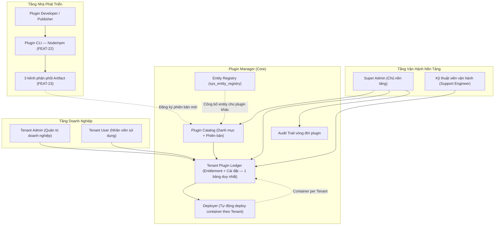
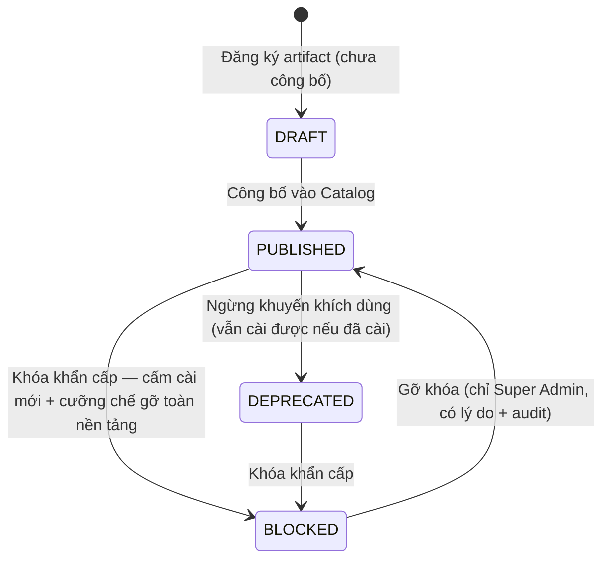
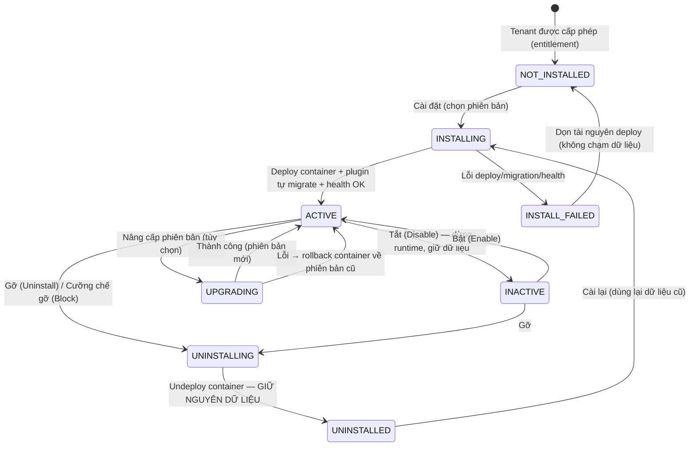
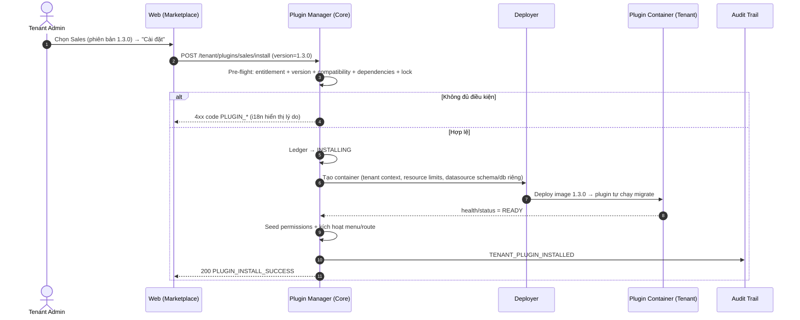
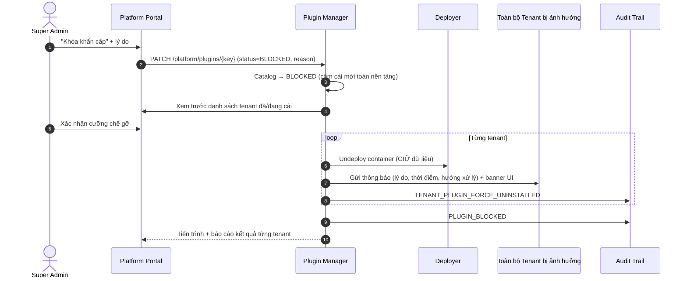
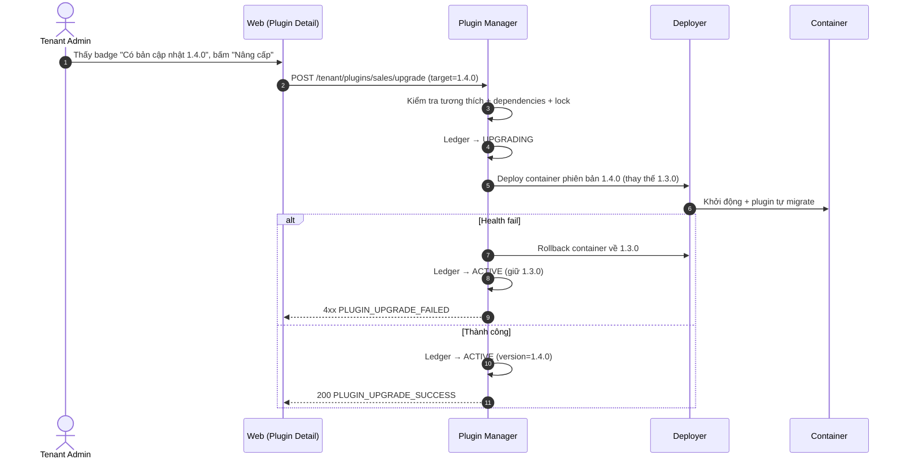

# [ANL-01] Phân Tích Nghiệp Vụ Chuyên Sâu: Plugin Manager — Quản Lý Danh Mục & Vòng Đời Plugin (Hệ Thống & Tenant)

- **Mã Tài Liệu**: ANL-01
- **Phiên Bản**: 1.3 — Cập nhật theo phản hồi khách hàng ngày 2026-09-19 (bổ sung: plugin riêng của Tenant; cô lập dữ liệu schema/database riêng theo tenant; nhúng UI bằng Web Components/Module Federation)
- **Phụ Trách**: BA Agent
- **Thuộc Sprint**: Sprint 03 - Plugin Manager, Plugin CLI & Cơ Chế Phân Phối Plugin
- **Tài Liệu Nguồn**: [RAW-01](../01_raw_notes/RAW-01_plugin_management_system_tenant.md), [RAW-03](../01_raw_notes/RAW-03_plugin_distribution_channels.md)
- **Trạng Thái**: Draft — Chờ khách hàng phê duyệt tại Confirmation Gate

---

## 1. Tổng Quan & Các Tác Nhân Hệ Thống (Actors)

Sprint 02 đã đặt nền móng cho cơ chế plugin ở dạng **tĩnh** (danh mục cấu hình trong file + allowlist `allowed_plugins`). Sprint 03 nâng cấp thành **Plugin Manager thực thụ** theo `SYSTEM_BLUEPRINT.md` mục 2.1.5: danh mục plugin động (DB-driven), quản lý phiên bản, vòng đời cài đặt đầy đủ và **mỗi plugin chạy dạng container riêng theo từng tenant** (quyết định Q1/ANL-03).

### Các Tác Nhân Chính:
1. **Super Admin (Chủ nền tảng)**: Quản lý danh mục plugin toàn hệ thống: đăng ký/gỡ phiên bản, gắn nguồn phân phối artifact, cấu hình plugin **cài mặc định cấp hệ thống**, khóa plugin khẩn cấp (kèm cưỡng chế gỡ toàn nền tảng), can thiệp vòng đời plugin của bất kỳ tenant nào.
2. **Platform Support Engineer**: Xem toàn cảnh cài đặt và hỗ trợ cài/gỡ/bật/tắt/nâng cấp plugin cho tenant khi được yêu cầu (theo phân quyền platform hiện có, có audit).
3. **Tenant Admin**: Cài/gỡ/bật/tắt/nâng cấp plugin **trong phạm vi được cấp phép** qua Chợ plugin (Marketplace) — bao gồm chọn phiên bản khi cài (hỗ trợ đa phiên bản song song).
4. **Tenant User (End-User)**: Sử dụng tính năng plugin đã kích hoạt; không thấy menu/route của plugin chưa cài, đã tắt hoặc đã gỡ; chịu chi phối bởi RBAC Sprint 02.
5. **Plugin Developer / Publisher**: Xây dựng plugin bằng CLI (Node/npm), đóng gói container/image hoặc bundle JAR + Web, phát hành qua 3 kênh phân phối (ANL-02, ANL-03).

---

## 2. Kiến Trúc Khái Niệm Quản Lý Plugin

### 2.1. Tách Biệt Core Modules Khỏi Cơ Chế Plugin (Quyết Định Q4)

| Khái Niệm | Phạm Vi | Đối Tượng Quản Lý | Ý Nghĩa Nghiệp Vụ |
| :--- | :--- | :--- | :--- |
| **Core Modules** (`core`, `iam`, `organization`, `platform`) | Toàn nền tảng | Super Admin (theo vòng phát hành Core) | **Tách riêng biệt** khỏi cơ chế plugin để dễ quản lý và nâng cấp; luôn khả dụng; không có trạng thái cài đặt; không xuất hiện trong Marketplace hay danh mục plugin tùy chọn. |
| **Plugin Catalog** (Danh mục plugin tùy chọn) | Toàn nền tảng | Super Admin | "Trên nền tảng hiện có những plugin tùy chọn nào, phiên bản nào, nguồn gốc từ đâu, tương thích Core nào". |
| **Tenant Plugin Ledger** (Sổ entitlement + cài đặt) | Từng Tenant | Super Admin / Tenant Admin | **Một bảng duy nhất** (Q1): mỗi dòng = quyền được cài (entitlement) + trạng thái vòng đời + phiên bản đang dùng + thông tin deploy của một plugin cho một tenant. |

> **Hệ quả UI**: Giao diện quản trị có 2 khu vực tách biệt — (1) **"Hệ thống lõi"** (danh sách Core modules, chỉ đọc, hiển thị phiên bản Core) và (2) **"Plugin tùy chọn"** (Catalog + Marketplace). Không còn hiển thị `core` như một dòng plugin trong danh sách switch như Sprint 02.

### 2.2. Một Bảng Duy Nhất Cho Entitlement & Cài Đặt (Quyết Định Q1)

- Bảng `tenant_plugins` (tên làm việc — chốt tại Bước 6) là **nguồn sự thật duy nhất**, chứa cả:
  - **Entitlement**: sự tồn tại của dòng = tenant được cấp phép plugin đó.
  - **Trạng thái vòng đời**: `NOT_INSTALLED` → `INSTALLING` → `ACTIVE` ⇄ `INACTIVE` → `UNINSTALLING` → `UNINSTALLED`; nhánh lỗi `INSTALL_FAILED`; nhánh nâng cấp `UPGRADING`.
  - **Phiên bản**: `installed_version` (đang chạy) và `target_version` (khi nâng cấp), hỗ trợ **đa phiên bản song song giữa các tenant**.
  - **Thông tin deploy**: container/service tương ứng (mã định danh, trạng thái runtime, URL nội bộ, health).
- **Di trú dữ liệu**: `tenants.allowed_plugins` (JSONB của Sprint 02) được backfill thành các dòng `tenant_plugins` trạng thái `NOT_INSTALLED`; trường cũ được giữ tạm để tương thích hợp đồng API `PATCH /quotas` rồi loại bỏ dần. API `/quotas` đọc/ghi giá trị `allowed_plugins` được **suy ra từ bảng mới** (Frontend Sprint 02 không cần đổi).
- **Chốt chặn runtime** `TenantPluginAllowlistService` (Sprint 02) được nâng cấp để đọc trạng thái từ bảng mới: chỉ chấp nhận khi dòng tồn tại **và** trạng thái `ACTIVE`.

### 2.3. Ba Nhóm Plugin Tùy Chọn (Làm Rõ 2026-09-19)

1. **Official Plugins (Chính thức)**: đội nền tảng phát triển; Super Admin đăng ký vào catalog toàn nền tảng (ví dụ `sales`, `inventory`, `accounting`, `crm`).
2. **Third-party Public Plugins (Đối tác phát hành công khai)**: Super Admin đăng ký vào catalog toàn nền tảng sau kiểm duyệt; cấp entitlement cho tenant theo gói.
3. **Tenant-Private Custom Plugins (Plugin riêng của Tenant)** — **LÀM RÕ MỚI (2026-09-19)**: **Tenant Admin cũng được phép đăng ký và cài plugin custom cho chính tenant của mình**, không chỉ Super Admin. Phân phối qua đúng 3 kênh (Docker Hub / Image Registry / JAR Bundle) với **credentials của tenant**; plugin **chỉ hiển thị và cài được cho tenant sở hữu** (`visibility = TENANT_PRIVATE`), không xuất hiện trong chợ của tenant khác.

**Ràng buộc với plugin riêng của Tenant** (chi tiết BR-PLG-22 → BR-PLG-25):
- Phải được Super Admin bật quyền `allow_custom_plugins` cho tenant/gói dịch vụ.
- Vẫn qua đầy đủ pipeline xác minh: manifest + checksum + tương thích Core + phụ thuộc + allowlist registry.
- Không được đánh dấu `default_install`; không được là phụ thuộc công khai cho plugin của tenant khác.
- Tài nguyên container tính vào quota/hạn mức của tenant; giới hạn số plugin riêng được cấu hình.
- Super Admin **vẫn giám sát được** (audit + danh sách tập trung) và có quyền **khóa/gỡ cưỡng chế** plugin riêng nếu gây hại cho nền tảng.

> **Không có cơ chế dùng thử (trial)** (Quyết định Q7): nếu đơn vị phát triển plugin muốn cho dùng thử, họ **tự triển khai** ngoài phạm vi nền tảng.

---

## 3. Danh Mục Plugin (Plugin Catalog)

### 3.1. Siêu Dữ Liệu Của Một Plugin (BA-level)

| Nhóm Thông Tin | Trường | Mô Tả / Quy Tắc |
| :--- | :--- | :--- |
| Định danh | `plugin_key` | Khóa duy nhất toàn hệ thống, lowercase kebab-case, **bất biến sau khi đăng ký** (ví dụ `sales`, `open-erp-hrm`). |
| Định danh | `name_key`, `description_key` | Khóa i18n, không hardcode văn bản (kế thừa chuẩn FEAT-20 Sprint 02). |
| Phiên bản | `version` (SemVer) | `MAJOR.MINOR.PATCH`; mỗi phiên bản là một bản ghi bất biến. |
| Tương thích | `core_version_compatibility` | Khoảng phiên bản Core hỗ trợ (ví dụ `>=1.0.0 <2.0.0`). |
| Phụ thuộc | `dependencies[]` | Danh sách `plugin_key + min_version`; cài plugin phải đủ phụ thuộc đang ACTIVE. |
| Nền tảng | `platforms.desktop`, `platforms.mobile` | Ma trận hỗ trợ + danh sách chức năng từng nền tảng (bắt buộc khai báo minh bạch). |
| Bảo mật | `permissions[]` | Quyền công bố theo chuẩn `domain:resource:action`; seed vào RBAC khi cài. |
| Dữ liệu | `entities[]` | Entity công bố + đăng ký `sys_entity_registry`. |
| Sự kiện | `kafka_events.publishes/subscribes` | Topic theo chuẩn `erp.<domain>.<event>`. |
| Phân phối | `distribution` | Loại kênh (`DOCKER_HUB`, `IMAGE_REGISTRY`, `JAR_BUNDLE`) + tham chiếu image + checksum (chi tiết ANL-03). |
| Mặc định hệ thống | `default_install` | **Quyết định Q5**: đánh dấu plugin được **cài mặc định ở cấp hệ thống** — tenant đăng ký mới được áp dụng tự động. |
| Phạm vi | `visibility`, `owner_tenant_id` | `PLATFORM` (Super Admin đăng ký, dùng cho mọi tenant được cấp phép) hoặc `TENANT_PRIVATE` (Tenant Admin đăng ký, chỉ tenant sở hữu — làm rõ 2026-09-19). |
| Thương mại | `entitlement` | Gói dịch vụ được phép dùng (`plan_tier`) / cấp thủ công theo tenant. |

### 3.2. Vòng Đời Bản Phát Hành (Release Lifecycle)

| Trạng Thái | Cài Mới Được? | Ý Nghĩa & Hành Vi Hệ Thống |
| :--- | :---: | :--- |
| `DRAFT` | Không | Đã đăng ký nhưng chưa công bố; chỉ Super Admin thấy. |
| `PUBLISHED` | Có | Sẵn sàng cho Tenant cài trong phạm vi entitlement. |
| `DEPRECATED` | Có (kèm cảnh báo) | Khuyến nghị tenant nâng cấp; hiển thị nhãn "Ngừng hỗ trợ". |
| `BLOCKED` | Không | Khóa khẩn cấp toàn nền tảng: cấm cài mới + **cưỡng chế gỡ khỏi toàn bộ tenant đã/đang cài** + **gửi thông báo cho tenant bị ảnh hưởng** (Q3). Dữ liệu tenant **được giữ nguyên**. |

### 3.3. Tương Thích, Phụ Thuộc & Đa Phiên Bản

- **Tương thích Core**: chặn cài/nâng cấp nếu Core nằm ngoài khoảng `core_version_compatibility` (`PLUGIN_CORE_VERSION_INCOMPATIBLE`).
- **Phụ thuộc giữa các plugin**:
  1. Cài thiếu phụ thuộc → chặn `PLUGIN_DEPENDENCY_MISSING` + danh sách plugin còn thiếu.
  2. Gỡ plugin đang có plugin khác phụ thuộc (đang ACTIVE) → **chặn + trả về lộ trình thứ tự gỡ** (Q8) để người dùng thực hiện đúng thứ tự nếu muốn tiếp tục.
  3. Phát hiện vòng lặp phụ thuộc (cycle detection).
- **Đa phiên bản song song (Q9/ANL-03)**: catalog lưu nhiều phiên bản; **mỗi tenant ghim một phiên bản** (`installed_version`); tenant A có thể dùng v1 trong khi tenant B dùng v2. Hệ thống phải chạy đồng thời nhiều phiên bản runtime của cùng plugin (mỗi phiên bản một image/tag khác nhau) — điều này được đảm bảo bởi mô hình **container-per-tenant**.
  - Khi cài lần đầu: mặc định dùng phiên bản `PUBLISHED` mới nhất trong khoảng tương thích; Tenant Admin có thể chọn phiên bản cụ thể (trong entitlement).
  - Nâng cấp là hành vi **tùy chọn theo từng tenant**; không auto-upgrade.
  - Rollback khẩn cấp: đưa container về phiên bản liền trước (Super Admin, kèm lý do + audit).

### 3.4. Phân Định Nền Tảng (Desktop vs. Mobile)

| Hạng Mục | Web / Desktop | Mobile (Ionic) |
| :--- | :--- | :--- |
| Quản lý Catalog cấp hệ thống | Đầy đủ (Super Admin) | Không hỗ trợ |
| Chợ plugin của Tenant | Đầy đủ: cài/gỡ/bật/tắt/nâng cấp/chọn phiên bản | Chỉ xem danh sách plugin đã cài + trạng thái (read-only) |
| Hiển thị tính năng plugin | Theo `platforms.desktop.features` + RBAC | Theo `platforms.mobile.features` + RBAC |
| Cảnh báo phiên bản lỗi thời / plugin bị khóa | Có | Có (badge nhỏ + banner) |

---

## 4. Vòng Đời Cài Đặt Plugin Theo Tenant (Tenant Installation Lifecycle)

### 4.1. Máy Trạng Thái Cài Đặt

### 4.2. Ý Nghĩa Từng Trạng Thái

| Trạng Thái | Menu/Route | API Plugin | Container Runtime | Dữ Liệu Tenant | Ghi Chú |
| :--- | :---: | :---: | :--- | :--- | :--- |
| `NOT_INSTALLED` | Không hiển thị | 403 `PLATFORM_PLUGIN_NOT_ALLOWED` | Chưa tạo | Chưa có (hoặc còn từ lần trước) | Dòng entitlement tồn tại (được cấp phép nhưng chưa cài). |
| `INSTALLING` | Không | 409 `PLUGIN_OPERATION_IN_PROGRESS` | Đang deploy | Plugin tự migrate khi khởi động | Khóa Redis chống thao tác đồng thời. |
| `ACTIVE` | Hiển thị theo RBAC | Hoạt động bình thường | Chạy + healthy | Tồn tại, có `tenant_id` | Chỉ trạng thái này phục vụ nghiệp vụ. |
| `INACTIVE` | Ẩn | 403 `PLUGIN_DISABLED_FOR_TENANT` | Dừng (undeploy/scale 0) | **Giữ nguyên** | Công tắc tạm dừng; bật lại deploy lại container. |
| `UPGRADING` | Hiển thị (khóa thao tác ghi) | 409 `PLUGIN_OPERATION_IN_PROGRESS` | Đang thay image phiên bản mới | Plugin tự migrate phiên bản mới | Lỗi → rollback container bản cũ. |
| `INSTALL_FAILED` | Ẩn | 403 | Đã dọn | Có thể còn dữ liệu migrate dở (nếu có) | Lưu vết lỗi; chỉ Super Admin xem chi tiết; cài lại được. |
| `UNINSTALLING` | Ẩn | 403 | Đang drain + remove | Giữ nguyên | Không thể hủy giữa chừng. |
| `UNINSTALLED` | Ẩn | 403 | Đã gỡ | **Giữ nguyên vĩnh viễn** (Sprint 03 không purge) | Cài lại sẽ dùng lại dữ liệu cũ. |

### 4.3. Quy Trình Cài Đặt (Install Pipeline — Container-per-Tenant)

1. **Kiểm tra điều kiện (Pre-flight Validation)**:
   - Dòng `tenant_plugins` tồn tại (đã được cấp phép) — Q1.
   - Phiên bản `PUBLISHED`/`DEPRECATED` + tương thích Core + đủ phụ thuộc ACTIVE.
   - Không có thao tác vòng đời nào đang chạy (khóa Redis `tenant_id + plugin_key`).
   - Plugin hỗ trợ ít nhất một nền tảng đang bật.
2. **Ghi ledger → `INSTALLING`** (phiên bản mục tiêu, người thực hiện).
3. **Chuẩn bị artifact**: lấy image từ Docker Hub/Registry (kèm credential theo phạm vi phù hợp) hoặc image đã build từ bundle JAR tải lên (ANL-03).
4. **Deploy container cho tenant** (tự động — Q2/ANL-03): Deployer tạo container với nhãn `tenant_id + plugin_key + version`, giới hạn tài nguyên, cấp ngữ cảnh tenant + **thông tin kết nối datasource riêng của tenant (schema/database + credentials giới hạn quyền)** — xem mục 4.7.
5. **Plugin tự chạy migration** (Q8/ANL-03) khi khởi động **trong schema/database riêng của tenant**; Core **không can thiệp schema**, chỉ chờ `health/status` báo sẵn sàng.
6. **Seed quyền hạn**: đăng ký `permissions[]` vào danh mục quyền của tenant; `TENANT_OWNER` nhận toàn bộ quyền plugin mới.
7. **Kích hoạt `ACTIVE`**: menu/route của plugin xuất hiện theo RBAC; đăng ký Entity từ manifest (đã có trong Registry).
8. **Audit + thông báo**: ghi `TENANT_PLUGIN_INSTALLED`; thông báo cho Tenant Admin.

> **Nguyên tắc an toàn**: nếu bước 3–7 thất bại, Deployer dọn tài nguyên container và ledger về `INSTALL_FAILED` → có thể cài lại. **Không xóa dữ liệu** trong mọi trường hợp (Q2).

### 4.4. Cài Mặc Định Cấp Hệ Thống (Quyết Định Q5)

- Super Admin đánh dấu plugin (hoặc phiên bản) là **mặc định cấp hệ thống** (`default_install`).
- **Tenant đăng ký mới**: provisioning tự tạo dòng `tenant_plugins` với trạng thái `ACTIVE` (hoặc `NOT_INSTALLED` nếu muốn tenant tự bật — chốt tại Confirmation) và deploy container tương ứng theo quota.
- **Tenant hiện hữu**: Super Admin có thao tác **"Áp dụng cho toàn bộ tenant"** (bulk install) với màn hình xem trước danh sách tenant bị ảnh hưởng; tiến trình chạy nền có theo dõi trạng thái từng tenant.
- Plugin mặc định hệ thống vẫn có thể bị tenant tắt/gỡ **nếu chính sách cho phép** (trường `locked` trên catalog — chốt tại Bước 6).

### 4.5. Chính Sách Gỡ Bỏ (Quyết Định Q2)

| Chế Độ | Hành Vi | Trạng Thái Sprint 03 |
| :--- | :--- | :--- |
| **Soft Uninstall (duy nhất)** | Undeploy container, ẩn menu/route, khóa API, thu hồi quyền, dừng job nền, đánh dấu Entity Registry inactive — **giữ nguyên 100% dữ liệu**. | **Bắt buộc triển khai**. |
| Archive & Purge / Xóa dữ liệu | Snapshot rồi xóa bảng/schema. | **Không triển khai trong Sprint 03**; để giai đoạn sau. |

**Bảo đảm dữ liệu plugin đã gỡ không làm hỏng hệ thống Core** (yêu cầu trực tiếp của khách hàng):
1. Cấm mọi khóa ngoại (FK) từ bảng Core → bảng do plugin tạo.
2. Plugin bắt buộc dùng **schema/database riêng của tenant** (mục 4.7) để cô lập dữ liệu; tiền tố bảng `plg_<key>_` chỉ là quy ước đặt tên bổ sung.
3. Khi gỡ: container bị xóa → mọi job/scheduler của plugin dừng; Entity Registry chuyển entry sang trạng thái `inactive` để plugin khác không tham chiếu.
4. Truy vấn/thống kê của Core không được phụ thuộc vào bảng plugin; dữ liệu mồ côi bị bỏ qua khi tính toán/health check.
5. Dữ liệu giữ lại vẫn **tính vào quota lưu trữ** của tenant (liên kết hạng mục Storage quota enforcement từ backlog Sprint 02).
6. Cài lại (reinstall) phải **dùng lại dữ liệu cũ** — migration của plugin phải idempotent (`IF NOT EXISTS`, không DDL phá hủy).

### 4.6. Ngăn Chặn Tác Động Khi Khóa Plugin (Quyết Định Q3)

1. Super Admin bấm **"Khóa khẩn cấp"** + nhập lý do bắt buộc.
2. Catalog phiên bản/plugin chuyển `BLOCKED` → chặn mọi cài mới/nâng cấp.
3. Hệ thống **cưỡng chế gỡ (forced uninstall)** khỏi toàn bộ tenant đã/đang cài (undeploy container) theo hướng soft — **dữ liệu giữ nguyên**.
4. **Gửi thông báo** đến toàn bộ tenant bị ảnh hưởng (Tenant Admin): lý do, thời điểm, hướng xử lý; hiển thị banner trong UI.
5. Audit `PLUGIN_BLOCKED` + `TENANT_PLUGIN_FORCE_UNINSTALLED` cho từng tenant; tiến trình chạy nền, có màn hình theo dõi kết quả từng tenant.
6. Chỉ Super Admin được gỡ khóa trở lại.

### 4.7. Cô Lập Dữ Liệu Tenant — Schema/Database Riêng Theo Tenant (Làm Rõ 2026-09-19)

> **Rủi ro khách hàng nêu**: nếu toàn bộ tenant dùng chung một schema/CSDL, một tenant cài custom plugin có migration có thể ảnh hưởng dữ liệu của tenant khác. Yêu cầu: **dữ liệu riêng của mỗi tenant nằm ở schema và database khác nhau**.

**Mô hình lưu trữ (Tenant Storage Model)** — mỗi tenant được cấu hình 1 mô hình:

| Mô Hình | Mô Tả | Áp Dụng |
| :--- | :--- | :--- |
| `SHARED_SCHEMA_RLS` | Dùng chung schema, cách ly bằng `tenant_id` + Row-Level Security | **Chỉ cho dữ liệu Core** (IAM/Organization/RBAC) — giữ nguyên Sprint 01/02; **KHÔNG dùng cho dữ liệu plugin**. |
| `DEDICATED_SCHEMA` *(mặc định cho plugin)* | Mỗi tenant có **schema PostgreSQL riêng** (ví dụ `tenant_<short_id>`) trên cluster chung | Tenant thường/chuẩn. |
| `DEDICATED_DATABASE` | Mỗi tenant có **database riêng** | Gói Enterprise / tenant yêu cầu cách ly cao hoặc theo quy định pháp lý. |

**Cơ chế vận hành:**
1. **Tenant Datasource Router** (Core): cấp thông tin kết nối datasource theo tenant (`DEDICATED_SCHEMA` → schema riêng; `DEDICATED_DATABASE` → database riêng).
2. **Provisioning khi cài plugin**: nếu chưa tồn tại, hệ thống tạo schema/database riêng cho tenant + **DB role giới hạn quyền chỉ trong phạm vi đó** (least privilege) trước khi deploy container.
3. **Plugin tự migrate trong không gian của tenant**: container nhận endpoint + schema + credentials riêng; migration **chỉ chạy trong schema/database của tenant đó**.
4. **Chặn tuyệt đối DDL/ghi ngoài phạm vi**: DB role của plugin **không có quyền** trên `public` hay schema/DB của tenant khác; cấm thao tác cross-schema; advisory lock theo schema chống chạy song song.
5. **Gỡ plugin**: chỉ undeploy container + thu hồi credentials — **không xóa schema/dữ liệu**; dọn schema chỉ trong luồng purge (ngoài Sprint 03).
6. **Backup/restore theo tenant**: thực hiện độc lập theo phạm vi schema/database (phục vụ hỗ trợ/pháp lý).

**Điểm cần lưu ý (Architect chốt tại Bước 5/6):**
- Quản lý **connection pool theo tenant** (lazy, pool nhỏ) để tránh bùng nổ tài nguyên.
- Script tạo schema tự động trong Deployer; giám sát số lượng schema/DB.
- Dữ liệu **Core** có tách sang schema riêng theo tenant trong Sprint 03 hay không → **câu hỏi N1 (đã điều chỉnh)** tại mục 11.2.

---

## 5. Quy Tắc Nghiệp Vụ (Business Rules)

- **BR-PLG-01**: **Core modules (`core`, `iam`, `organization`, `platform`) tách biệt hoàn toàn** khỏi Plugin Manager: không nằm trong Catalog, không có bản ghi cài đặt, luôn khả dụng; quản lý/nâng cấp theo vòng phát hành Core.
- **BR-PLG-02**: `plugin_key` bất biến, duy nhất, lowercase kebab-case; không cho phép đăng ký trùng khóa (kể cả khác hoa/thường — kế thừa chuẩn dedupe Sprint 02).
- **BR-PLG-03**: Tenant chỉ cài được plugin khi có **dòng entitlement** + phiên bản `PUBLISHED`/`DEPRECATED` + tương thích Core + đủ phụ thuộc ACTIVE.
- **BR-PLG-04**: Cài plugin khi thiếu phụ thuộc → chặn `PLUGIN_DEPENDENCY_MISSING` kèm danh sách plugin còn thiếu.
- **BR-PLG-05**: Gỡ plugin đang có plugin khác phụ thuộc (ACTIVE) → chặn `PLUGIN_HAS_DEPENDENTS` + trả về **lộ trình thứ tự gỡ đề xuất** (Q8).
- **BR-PLG-06**: **Plugin tự chạy migration** trong container khi khởi động; Core không can thiệp schema; migration phải **idempotent, không phá hủy dữ liệu**; Core xác nhận qua health/status của container.
- **BR-PLG-07**: Gỡ plugin **chỉ gỡ tầng runtime/UI/route/quyền**; **tuyệt đối giữ nguyên dữ liệu** (kể cả bảng/schema do plugin tạo). Không có purge trong Sprint 03.
- **BR-PLG-08**: Dữ liệu plugin đã gỡ **không được làm hỏng hệ thống Core**: cấm FK từ Core → bảng plugin; plugin dùng namespace dữ liệu riêng; entry Entity Registry chuyển `inactive`; Core không phụ thuộc bảng plugin; dữ liệu mồ côi bị bỏ qua khi tính toán/health; vẫn tính vào quota lưu trữ.
- **BR-PLG-09**: Plugin `BLOCKED` → cấm cài mới + **cưỡng chế gỡ khỏi toàn bộ tenant** + **thông báo tenant bị ảnh hưởng**; dữ liệu giữ nguyên; chỉ Super Admin gỡ khóa.
- **BR-PLG-10**: Mọi hành động vòng đời plugin (đăng ký, công bố, khóa, cài, gỡ, bật, tắt, nâng cấp, rollback, deploy/undeploy, cấp/thu entitlement) bắt buộc ghi Audit Trail bất biến.
- **BR-PLG-11**: Runtime enforcement: API plugin khi chưa cài, đã tắt, đã gỡ hoặc bị platform khóa trả về mã chuẩn hóa (`PLATFORM_PLUGIN_NOT_ALLOWED`, `PLUGIN_DISABLED_FOR_TENANT`, `PLUGIN_BLOCKED_BY_PLATFORM`) — **không bao giờ trả 500**; chốt chặn ở Backend, không phụ thuộc ẩn nút Frontend.
- **BR-PLG-12**: Khi cài plugin, quyền mới chỉ seed cho `TENANT_OWNER`; các vai trò khác do Tenant Admin gán trên ma trận RBAC.
- **BR-PLG-13**: Menu/route/UI plugin (màn hình riêng **và** UI Contribution nhúng vào slot của Core/plugin khác) chỉ hiển thị khi trạng thái `ACTIVE` **và** người dùng có quyền tương ứng (RBAC + Data Scope Sprint 02).
- **BR-PLG-14 (Đa phiên bản)**: Mỗi `(tenant_id, plugin_key)` ghim **một phiên bản** tại một thời điểm; các tenant khác nhau có thể dùng phiên bản khác nhau; hệ thống phải chạy đồng thời nhiều phiên bản runtime; hợp đồng API giữa plugin và Core được **version hóa**.
- **BR-PLG-15 (Khóa thao tác)**: Thao tác vòng đời trên cùng `(tenant_id, plugin_key)` phải được khóa (Redis distributed lock) chống chạy đồng thời.
- **BR-PLG-16**: Entity của plugin chưa đăng ký Entity Registry → chặn công bố phiên bản (`PLUGIN_ENTITY_NOT_REGISTERED`).
- **BR-PLG-17**: Nâng cấp plugin không được làm mất dữ liệu; do plugin tự migrate; nếu container phiên bản mới fail → rollback container về phiên bản cũ, ledger giữ ACTIVE bản cũ.
- **BR-PLG-18 (Cô lập tenant)**: **Mỗi plugin chạy một container riêng cho từng tenant**; container chỉ được truy cập dữ liệu của tenant tương ứng (credentials/ngữ cảnh do Core cấp); nghiêm cấm rò rỉ chéo.
- **BR-PLG-19 (Mặc định hệ thống)**: Plugin đánh dấu `default_install` được cài tự động cho **tenant đăng ký mới**; Super Admin có thao tác áp dụng hàng loạt cho tenant hiện hữu kèm xem trước danh sách ảnh hưởng.
- **BR-PLG-20**: Thao tác ảnh hưởng nhiều tenant (bulk install, block/force uninstall) bắt buộc có **màn hình xem trước + tiến trình theo từng tenant + báo cáo kết quả**; không thao tác "mù".
- **BR-PLG-21**: Container plugin chỉ được ACTIVE khi health check đạt; Core giám sát và hiển thị trạng thái runtime trên UI quản trị.
- **BR-PLG-22 (Plugin riêng của Tenant — làm rõ 2026-09-19)**: Tenant Admin được đăng ký/cài plugin custom **chỉ cho tenant mình** khi `allow_custom_plugins` được bật; plugin riêng **không hiển thị và không cài được cho tenant khác**.
- **BR-PLG-23**: Plugin riêng của tenant vẫn phải qua **đầy đủ xác minh artifact** (manifest, checksum, tương thích Core, phụ thuộc, allowlist registry); **không** được `default_install`; **không** được là phụ thuộc công khai cho plugin của tenant khác.
- **BR-PLG-24**: Super Admin có quyền **giám sát toàn bộ plugin riêng** của mọi tenant và **khóa/gỡ cưỡng chế** khi gây hại; tenant tự chịu trách nhiệm về plugin riêng của mình trong phạm vi tenant.
- **BR-PLG-25**: Tài nguyên container của plugin riêng tính vào **quota/hạn mức của tenant**; số lượng plugin riêng bị giới hạn theo cấu hình nền tảng.
- **BR-PLG-26**: Dữ liệu do plugin sinh ra bắt buộc nằm trong **không gian riêng của tenant** (`DEDICATED_SCHEMA` hoặc `DEDICATED_DATABASE` theo cấu hình); **không dùng chung schema** với plugin của tenant khác.
- **BR-PLG-27**: DB role cấp cho container plugin bị **giới hạn quyền** chỉ trong schema/database của tenant sở hữu; cấm DDL/ghi vào `public` hoặc schema/DB tenant khác.
- **BR-PLG-28**: Mỗi tenant có cấu hình `storage_model` do Super Admin/gói dịch vụ quyết định; thay đổi mô hình lưu trữ phải qua quy trình migration an toàn (không tự động).
- **BR-PLG-29**: Gỡ/tắt plugin **không xóa schema/dữ liệu**; purge schema chỉ thực hiện ngoài Sprint 03 với xác nhận đặc biệt.
- **BR-PLG-30**: Backup/restore theo tenant hoạt động **độc lập** theo phạm vi schema/database; lỗi migration của một tenant **không được ảnh hưởng** tenant khác.
- **BR-PLG-31 (đề xuất — chốt Bước 5/6)**: UI Contribution nhúng trực tiếp bằng **Web Components/Module Federation** chỉ áp dụng cho plugin tin cậy/đã kiểm duyệt; mỗi contribution khai báo `render_mode`; plugin riêng chưa kiểm duyệt **mặc định iframe sandbox**; bắt buộc CSP, error boundary, giới hạn theo RBAC và audit.

---

## 6. Luồng Nghiệp Vụ Chính

### 6.1. Tenant Admin Cài Plugin Từ Marketplace (Container per Tenant)

### 6.2. Super Admin Khóa Plugin Khẩn Cấp (Cưỡng Chế Gỡ + Thông Báo)

### 6.3. Nâng Cấp Phiên Bản (Tùy Chọn Theo Tenant)

---

## 7. Yêu Cầu Giao Diện (BA-level)

### 7.1. Web — Portal Super Admin

- **Màn `/platform/plugins`** (bổ sung route còn thiếu từ FEAT-20 Sprint 02):
  - Cột trái: danh sách plugin tùy chọn (tìm kiếm, bộ lọc trạng thái/nguồn/nền tảng, nhãn "Mặc định hệ thống"); **khu vực riêng "Hệ thống lõi"** hiển thị Core modules read-only (Q4).
  - Drawer chi tiết: metadata, timeline phiên bản, nguồn artifact, tương thích, danh sách tenant đang cài (dense, phân trang, ghim phiên bản).
  - Hành động: Đăng ký plugin/phiên bản, Công bố, Ngừng hỗ trợ, **Khóa khẩn cấp (kèm preview + tiến trình force uninstall)**, Rollback, **Cài mặc định cho tenant mới**, **Áp dụng hàng loạt**.
  - Drawer "Cấp entitlement cho tenant": tìm kiếm tenant, cấp/thu quyền plugin (ghi trực tiếp vào bảng `tenant_plugins`).
- **Màn cấu hình Registry Credentials** (Q7/ANL-03): danh sách credential tầng nền tảng (nhiều credential), thêm/sửa/xóa, che bí mật.
- **Khu vực "Plugin riêng của Tenant" (governance)**: Super Admin xem toàn bộ plugin `TENANT_PRIVATE` của mọi tenant (chủ sở hữu, nguồn artifact, checksum, trạng thái), có hành động **Khóa khẩn cấp** và bật/tắt `allow_custom_plugins` theo tenant/gói.
- Mật độ cao (`text-xs`/`text-sm`), 100% Drawer xếp tầng — không Modal.

### 7.2. Web — Khu Vực Tenant (Marketplace)

- **Màn `/settings/plugins`**: **chỉ hiển thị plugin đã được cấp phép** (Q6) — nhóm "Đã cài" và "Có thể cài".
  - Mỗi dòng: tên + mô tả i18n, badge nền tảng, phiên bản hiện tại (và bộ chọn phiên bản khi cài), trạng thái runtime, hành động Cài/Gỡ/Bật/Tắt/Nâng cấp.
  - Cảnh báo khi gỡ: "Plugin sẽ được gỡ nhưng **dữ liệu vẫn được giữ nguyên**" (banner inline, không popup native).
  - Banner khi plugin bị nền tảng khóa (kèm lý do từ thông báo).
- **Màn cấu hình Registry Credentials của tenant** (Q7): nhiều credential phục vụ kéo image riêng.
- **Nút "Đăng ký plugin riêng"** (khi được bật `allow_custom_plugins`): Tenant Admin tự đăng ký custom plugin từ 3 kênh (ANL-03) với phạm vi `TENANT_PRIVATE`; plugin chỉ xuất hiện cho tenant sở hữu; cảnh báo tenant tự chịu trách nhiệm và vẫn bị nền tảng giám sát/khóa.

### 7.3. Mobile (Ionic) — Tối Giản

- Màn "Plugin của tôi" (read-only): danh sách plugin đã cài + trạng thái + phiên bản + badge cập nhật/khóa; **không** hỗ trợ cài/gỡ.
- Touch target ≥ 40px, overflow = 0, safe-area.

### 7.4. Hiển Thị Web Plugin — Hai Chế Độ & Điểm Mở Rộng UI

- **Chế độ 1 — Màn hình riêng**: route động `/apps/<plugin-id>` + menu sinh từ manifest khi plugin ACTIVE (nội dung trong layout Core: topbar/menu vẫn của Core).
- **Chế độ 2 — Nhúng vào màn hình đang có**: plugin đóng góp **UI Contribution** vào **UI Slot** do **Core hoặc plugin khác** khai báo (widget dashboard, tab chi tiết...), chỉ hiển thị khi plugin ACTIVE + người dùng có quyền.
- Hợp đồng UI Slot/Contribution và kỹ thuật render — **Web Components + Module Federation (quyết định khách hàng 2026-09-19) cho nhúng trực tiếp; iframe sandbox là chế độ dự phòng** — chi tiết tại ANL-03 mục 4.4.
- 100% chuỗi qua i18n; không hardcode tên plugin.

---

## 8. Audit & Thông Báo

### 8.1. Hành Động Audit (đề xuất — chốt tại Bước 6)

| Nhóm | Hành Động | Phạm Vi |
| :--- | :--- | :--- |
| Catalog | `PLUGIN_REGISTERED`, `PLUGIN_VERSION_ADDED`, `PLUGIN_PUBLISHED`, `PLUGIN_DEPRECATED`, `PLUGIN_BLOCKED`, `PLUGIN_UNBLOCKED`, `PLUGIN_ARTIFACT_UPDATED` | PLATFORM |
| Entitlement | `PLUGIN_ENTITLEMENT_GRANTED`, `PLUGIN_ENTITLEMENT_REVOKED` | TENANT |
| Installation | `TENANT_PLUGIN_INSTALLED`, `TENANT_PLUGIN_INSTALL_FAILED`, `TENANT_PLUGIN_ENABLED`, `TENANT_PLUGIN_DISABLED`, `TENANT_PLUGIN_UPGRADED`, `TENANT_PLUGIN_ROLLED_BACK`, `TENANT_PLUGIN_UNINSTALLED`, `TENANT_PLUGIN_FORCE_UNINSTALLED` | TENANT |
| Deploy | `PLUGIN_SERVICE_DEPLOYED`, `PLUGIN_SERVICE_UNDEPLOYED`, `PLUGIN_SERVICE_HEALTH_FAILED` | TENANT |
| Migration | `PLUGIN_MIGRATION_COMPLETED`, `PLUGIN_MIGRATION_FAILED` (do plugin báo cáo qua status) | TENANT |
| Truy cập | `PLUGIN_ACCESS_DENIED` (đã có Sprint 02), `PLUGIN_BLOCKED_ACCESS_DENIED` | TENANT |
| Tenant Custom Catalog | `TENANT_PLUGIN_REGISTERED`, `TENANT_PLUGIN_CATALOG_UPDATED`, `TENANT_PLUGIN_CATALOG_REMOVED`, `TENANT_CUSTOM_PLUGIN_BLOCKED` | TENANT |

### 8.2. Thông Báo (Bắt Buộc — Q3)

- **Thông báo khi plugin bị khóa khẩn cấp**: gửi tới toàn bộ Tenant Admin bị ảnh hưởng (in-app + banner; email cân nhắc), nội dung: tên plugin, lý do, thời điểm, hướng xử lý; ghi vết việc gửi.
- **Thông báo có bản cập nhật plugin**: badge trong Marketplace.
- **Thông báo kết quả thao tác hàng loạt** cho Super Admin: báo cáo theo từng tenant (thành công/thất bại, lý do).

---

## 9. Chỉ Số Theo Dõi (Metrics)

1. Tỉ lệ cài đặt plugin theo tenant (adoption).
2. Số lần cài/nâng cấp lỗi theo plugin & phiên bản.
3. Số tenant dùng phiên bản `DEPRECATED` (nhắc nâng cấp).
4. Số container plugin đang chạy / tài nguyên tiêu thụ theo tenant (phục vụ scale).
5. Thời gian deploy + migrate trung bình theo plugin.

---

## 10. Ranh Giới Phạm Vi (Scope)

### In-Scope Sprint 03:
- Plugin Catalog trong DB: đăng ký plugin + phiên bản, công bố/ngừng hỗ trợ/khóa, metadata đầy đủ (tương thích, phụ thuộc, nền tảng, quyền, entity, nguồn phân phối, cờ mặc định hệ thống).
- **Một bảng duy nhất** cho entitlement + trạng thái cài đặt + phiên bản ghim + thông tin deploy; backfill từ `allowed_plugins`; API `/quotas` tương thích ngược.
- Cài/gỡ/bật/tắt/nâng cấp theo tenant; **container-per-tenant + tự động deploy**; plugin tự migrate; giữ nguyên dữ liệu khi gỡ.
- **Đa phiên bản song song** giữa các tenant; chọn phiên bản khi cài; nâng cấp tùy chọn.
- **Cài mặc định cấp hệ thống** cho tenant mới + áp dụng hàng loạt.
- **Khóa plugin khẩn cấp + cưỡng chế gỡ + thông báo tenant**.
- Permission seeding + menu/route injection + **hai chế độ hiển thị Web (màn hình riêng & UI Contribution vào slot của Core/plugin khác) bằng Web Components + Module Federation** (iframe sandbox dự phòng).
- **Plugin riêng của Tenant**: Tenant Admin tự đăng ký/cài custom plugin cho tenant mình (`visibility = TENANT_PRIVATE`, cần `allow_custom_plugins`); Super Admin giám sát + khóa khẩn cấp; artifact vẫn qua xác minh đầy đủ; tài nguyên tính quota tenant.
- **Cô lập dữ liệu plugin theo tenant**: mô hình `DEDICATED_SCHEMA` (mặc định) / `DEDICATED_DATABASE` (Enterprise); Tenant Datasource Router + DB role least privilege; plugin tự migrate trong schema/database riêng; backup/restore theo tenant.
- Audit vòng đời; UI Web (platform + tenant), Mobile read-only; cấu hình Registry Credentials đa phạm vi (platform/tenant).

### Out-of-Scope (giai đoạn sau — cần khách hàng xác nhận):
- Marketplace công khai cho bên thứ ba tự đăng bán plugin hoặc để tenant chia sẻ plugin riêng (`TENANT_PRIVATE`) cho tenant khác (billing/revenue share).
- **Cơ chế dùng thử plugin (trial)** — khách hàng đã chốt không làm (Q7).
- **Purge/xóa vĩnh viễn dữ liệu plugin** (Sprint 03 chỉ soft uninstall).
- Ký số artifact bắt buộc (để giai đoạn sau — ANL-03 Q6).
- Tự động cập nhật không cần xác nhận (auto-upgrade).

---

## 11. Quyết Định Đã Chốt & Câu Hỏi Phát Sinh

### 11.1. Quyết Định Của Khách Hàng (2026-09-19)

| # | Quyết Định | Ảnh Hưởng Đã Phản Ánh Vào Tài Liệu |
| :---: | :--- | :--- |
| Q1 | **Một bảng duy nhất** cho entitlement + cài đặt | Mục 2.2; BR-PLG-03; API `/quotas` suy ra từ bảng mới. |
| Q2 | **Chỉ gỡ plugin, giữ nguyên dữ liệu**; dữ liệu mồ côi không được làm hỏng hệ thống | Mục 4.5; BR-PLG-07, BR-PLG-08, BR-PLG-17. |
| Q3 | **Cưỡng chế gỡ toàn bộ tenant + thông báo tenant bị ảnh hưởng** | Mục 4.6, 8.2; BR-PLG-09, BR-PLG-20. |
| Q4 | **Core/module nền tảng tách riêng** | Mục 2.1; BR-PLG-01; UI 7.1. |
| Q5 | **Cài mặc định cấp hệ thống**, tenant mới áp dụng tự động | Mục 4.4; BR-PLG-19; metadata `default_install`. |
| Q6 | **Marketplace chỉ hiển thị plugin được cấp phép** | Mục 7.2. |
| Q7 | **Không có cơ chế dùng thử** | Mục 2.3, 10. |
| Q8 | **Chặn gỡ + lộ trình thứ tự gỡ** | Mục 3.3; BR-PLG-05. |
| Bổ sung (2026-09-19) | **Tenant Admin được đăng ký plugin custom cho tenant mình** (không chỉ Super Admin) | Mục 2.3; metadata `visibility`/`owner_tenant_id`; BR-PLG-22→25; UI 7.1/7.2; ANL-03 mục 3.6, 9.3. |
| Bổ sung 2 (2026-09-19) | **Dữ liệu riêng của mỗi tenant nằm ở schema/database khác nhau** (cô lập migration plugin) | Mục 4.7; BR-PLG-26→30; ANL-03 mục 4.3, 5, 6. |

### 11.2. Câu Hỏi Phát Sinh Từ Quyết Định (Cần Chốt Trước/Song Song Bước 5)

| # | Câu Hỏi | Ảnh Hưởng | Đề Xuất Của BA |
| :---: | :--- | :--- | :--- |
| N1 | **ĐÃ CHỐT (2026-09-19)**: plugin data dùng schema/database riêng theo tenant (mục 4.7); **dữ liệu Core giữ `SHARED_SCHEMA_RLS`** trong Sprint 03 (theo đề xuất BA — đã kiểm thử Sprint 01/02); việc tách Core sang schema riêng sẽ xem xét giai đoạn sau nếu có yêu cầu. | Phạm vi Sprint 03 | Khách hàng đã đồng ý theo đề xuất BA. |
| N2 | Tenant đăng ký mới nhận plugin mặc định ở trạng thái ACTIVE (bật sẵn) hay NOT_INSTALLED (chờ tenant bật)? | Trải nghiệm onboarding, chi phí hạ tầng | **ACTIVE** cho plugin mặc định bắt buộc; **NOT_INSTALLED** cho plugin tùy chọn — cần xác nhận. |
| N3 | Plugin mặc định hệ thống có cho tenant tắt/gỡ không? | Chính sách sản phẩm | Đề xuất có cờ `locked` per plugin: locked = không tắt/gỡ; mặc định locked cho plugin nền tảng mới bắt buộc. |
| N4 | Kênh gửi thông báo khi plugin bị khóa: in-app + banner (và email)? | Vận hành, hạ tầng email | In-app + banner bắt buộc; email tận dụng hạ tầng Mailpit/SMTP sẵn có (tùy chọn). |
| N5 | Số phiên bản runtime đồng thời tối đa cho một plugin (giới hạn để tránh bùng nổ container)? | Hạ tầng, chi phí | Đề xuất giới hạn cấu hình được (ví dụ tối đa N major versions đồng thời). |
| N6 | Resource limit mỗi container plugin (CPU/RAM) do đâu cấu hình — theo plugin hay theo tenant/plan? | Chi phí vận hành | Theo plugin (default) + override theo plan/tenant — chốt tại Bước 5/6. |
| N7 | Plugin riêng của tenant có cần Super Admin phê duyệt trước khi cài, hay tự động khi `allow_custom_plugins` được bật? | Bảo mật, vận hành | Đề xuất **tự động** (container cô lập theo tenant) + giới hạn số lượng + audit + khóa khẩn cấp; có thể bật chế độ duyệt nếu khách muốn. |
| N8 | Registry host riêng của tenant có phải qua allowlist nền tảng (Super Admin duyệt host mới) hay tenant tự thêm host? | Bảo mật SSRF, governance | Đề xuất **Super Admin duyệt host** (quản trị tập trung) trước khi tenant dùng. |
