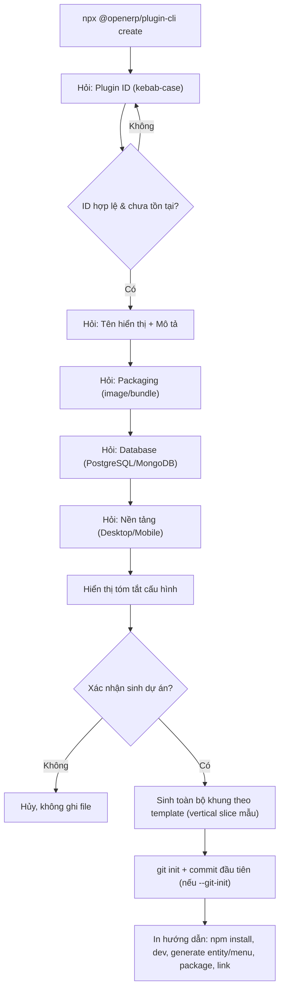

# [ANL-02] Phân Tích Nghiệp Vụ Chuyên Sâu: Plugin Scaffolding CLI — Tạo Dự Án Plugin Mới

- **Mã Tài Liệu**: ANL-02
- **Phiên Bản**: 1.2 — Cập nhật theo phản hồi khách hàng ngày 2026-09-19 (bổ sung: `render_mode` cho UI Contribution, đối chuẩn CLI/DX và đề xuất lệnh `dev`)
- **Phụ Trách**: BA Agent
- **Thuộc Sprint**: Sprint 03 - Plugin Manager, Plugin CLI & Cơ Chế Phân Phối Plugin
- **Tài Liệu Nguồn**: [RAW-02](../01_raw_notes/RAW-02_plugin_scaffold_cli.md)
- **Trạng Thái**: Draft — Chờ khách hàng phê duyệt tại Confirmation Gate

---

## 1. Mục Tiêu & Tác Nhân

### 1.1. Mục Tiêu Nghiệp Vụ
- Chuẩn hóa 100% việc khởi tạo plugin: mọi plugin mới đều có cùng cấu trúc, cùng chuẩn chất lượng (Entity Registry, ResponseKey, i18n, migration idempotent, test trên PostgreSQL/Redis thật).
- Giảm thời gian tạo khung plugin từ **hàng ngày (làm tay theo hướng dẫn)** xuống **dưới 1 phút (một lệnh)**.
- Cung cấp **command bổ sung để sinh entity và đăng ký menu vào hệ thống** (yêu cầu bổ sung của khách hàng), giúp phát triển plugin theo từng nhát cắt dọc (vertical slice) nhanh chóng.
- Khung sinh ra **gắn sẵn** với cơ chế đóng gói/phân phối của Sprint 03 (container image, bundle JAR + Web, Dockerfile/K8s) để plugin có thể đăng ký vào Plugin Catalog ngay.

### 1.2. Tác Nhân

| Tác Nhân | Vai Trò Với CLI |
| :--- | :--- |
| **Plugin Developer (nội bộ)** | Dùng CLI hằng ngày để tạo/kiểm tra/đóng gói plugin. |
| **Đối tác / Khách hàng Enterprise tự phát triển plugin** | Dùng CLI theo chuẩn nền tảng trước khi phân phối qua kênh tin cậy. |
| **CI/CD Pipeline** | Chạy CLI non-interactive (`create/generate/validate/package`) tự động. |
| **Solution Architect / Tech Lead** | Quản lý phiên bản bộ template (Template Version) gắn với phiên bản Core. |

---

## 2. Khái Niệm Cốt Lõi

1. **Plugin CLI (Node.js)** (Quyết định Q1/RAW-02): công cụ dòng lệnh viết bằng **Node.js**, đóng gói và phát hành dưới dạng **npm package** chạy qua `npx` hoặc cài global — cùng trải nghiệm với các framework khác (Q2).
2. **Standalone Plugin Repo + Git Submodule** (Q3): mỗi plugin là **một repository riêng**; khi cần đưa vào môi trường phát triển tổng thể, repo chính liên kết qua **git submodule** tại `plugins/<plugin-id>/`. CLI hỗ trợ khởi tạo git và lệnh liên kết submodule.
3. **Template Bundle**: bộ mẫu version hóa, gắn với phiên bản Core; mỗi lần Core thay đổi hợp đồng (API contract, manifest schema) sẽ phát hành template mới.
4. **Chuỗi công cụ khép kín**: `create` → `generate entity/menu/ui-contribution` → **`dev` (đề xuất bổ sung)** → `validate` → `package` (đóng gói JAR/image + checksum + manifest phát hành) → `link` (submodule) → bàn giao artifact cho Super Admin/Tenant Admin đăng ký (ANL-03).
5. **Generated Vertical Slice** (Q4): khung sinh ra phải có **mẫu màn hình quản trị hoàn chỉnh** (danh sách + form + quyền + menu + i18n), không chỉ plugin rỗng.

---

## 3. Danh Mục Lệnh CLI (Command Catalog)

> Tên package làm việc: `@openerp/plugin-cli` (chốt tại Bước 5/6 — xem câu hỏi phát sinh N1). Gọi qua `npx @openerp/plugin-cli <command>` hoặc cài global `npm i -g @openerp/plugin-cli`.

| # | Lệnh | Mục Đích | Đối Tượng | Ưu Tiên Sprint 03 |
| :---: | :--- | :--- | :--- | :---: |
| 1 | `create` | Sinh khung dự án plugin mới (repo riêng) từ template. | Developer | **Bắt buộc (MVP)** |
| 2 | `generate entity` | Sinh entity + migration + repository/service/resource/DTO + đăng ký Entity Registry + quyền mẫu + i18n. | Developer | **Bắt buộc (MVP)** |
| 3 | `generate menu` | Đăng ký màn hình riêng (menu/route) vào manifest + sinh route stub + i18n key. | Developer | **Bắt buộc (MVP)** |
| 4 | `generate ui-contribution` | Đăng ký đóng góp UI vào **UI Slot** của Core/plugin khác (widget, tab...) + sinh stub theo `--render-mode` (`web-component` / `module-federation` / `iframe`) + i18n key. | Developer | **Bắt buộc (MVP)** |
| 5 | `validate` | Kiểm tra cấu trúc dự án + `plugin.json` hợp lệ theo chuẩn (gồm validate slot tồn tại). | Developer, CI | **Bắt buộc (MVP)** |
| 6 | `package` | Build backend JAR + build Web, build **container image** (hoặc đóng **bundle zip**), sinh checksum SHA-256 + manifest phát hành + Dockerfile/K8s manifest. | Developer, CI | **Bắt buộc (MVP)** |
| 7 | `link` | Liên kết repo plugin vào repo chính dưới dạng **git submodule** (`plugins/<plugin-id>/`). | Developer | **Nên có** |
| 8 | `inspect` | Đọc manifest/checksum của artifact mà không cần cài đặt. | Developer, Super Admin | **Nên có** |
| 9 | `publish` | Push image lên Docker Hub/Registry theo cấu hình. | Developer, CI | Có thể (phụ thuộc Bước 5) |
| 10 | `template list/upgrade` | Xem/nâng cấp dự án theo template mới. | Developer | Sau (Sprint sau) |
| 11 | `dev` *(đề xuất bổ sung — chờ chốt)* | Khởi chạy plugin local (container) + web dev server + kết nối Core dev, hot reload (mô hình Grafana/Shopify/Forge). | Developer | **Đề xuất (chờ khách chốt phạm vi)** |

---

## 4. Đặc Tả Lệnh `create` (Chi Tiết Nghiệp Vụ)

### 4.1. Tham Số

| Tham Số | Bắt Buộc | Mặc Định | Mô Tả / Validation |
| :--- | :---: | :--- | :--- |
| `--id` | ✔ | — | `plugin_key`: lowercase kebab-case `^[a-z][a-z0-9-]{2,49}$`; chặn từ khóa dành riêng (`core`, `iam`, `platform`, `organization`). |
| `--name` | ✔ | — | Tên hiển thị (sinh `name_key` i18n tương ứng, không nhúng text cứng vào code). |
| `--description` | ✖ | rỗng | Mô tả ngắn; sinh `description_key`. |
| `--packaging` | ✖ | `image` | `image` (Dockerfile + K8s, deploy container) hoặc `bundle` (JAR + Web zip để upload lên Core → Core build image). *Lưu ý: không còn loại "module gắn thẳng Core" — Core modules tách riêng (ANL-01 Q4); mọi plugin đều chạy container (ANL-03 Q1/Q3).* |
| `--db` | ✖ | `postgres` | `postgres` hoặc `mongodb` (**Q6**: hỗ trợ chọn ngay khi tạo). |
| `--target` | ✖ | `./<plugin-id>` | Thư mục sinh repo; từ chối ghi đè nếu tồn tại (trừ `--force`). |
| `--package` | ✖ | `com.vn9melody.openerp.plugins.<id_snake>` | Base package Java; validate định dạng. |
| `--with-web` | ✖ | `true` | Sinh khung Web Angular 22 + Tailwind 4 dùng shared components. |
| `--with-mobile` | ✖ | `false` | Sinh khung Mobile Ionic 8 tối giản. |
| `--platforms` | ✖ | `desktop` | Danh sách nền tảng hỗ trợ (`desktop`, `mobile`, `desktop,mobile`). |
| `--core-version` | ✖ | phiên bản Core hiện tại | Ghi vào `core_version_compatibility`. |
| `--git-init` | ✖ | `true` | Khởi tạo git repo + commit đầu tiên cho repo plugin (Q3). |
| `--non-interactive` | ✖ | `false` | Bỏ qua hỏi đáp, dùng toàn bộ giá trị từ tham số (cho CI). |
| `--dry-run` | ✖ | `false` | Chỉ in kế hoạch sinh file, không ghi đĩa. |
| `--force` | ✖ | `false` | Cho phép ghi đè thư mục đích (yêu cầu xác nhận khi interactive). |

### 4.2. Hành Vi Khi Chạy (Interactive Mode)



### 4.3. Kết Quả Đầu Ra (Output Contract)

- Exit code `0` khi thành công; khác `0` khi lỗi (phân biệt mã lỗi: tham số sai, thư mục tồn tại, template lỗi, sinh file lỗi).
- In danh sách file đã sinh + bước tiếp theo (`generate entity`, `validate`, `package`, `link`).
- **Không** kết nối database, **không** gọi API hệ thống khi `create` (công cụ offline thuần túy).
- Nếu sinh dở dang bị lỗi → **dọn sạch file đã sinh** (tránh dự án nửa vời).

---

## 5. Cấu Trúc Dự Án Plugin Sinh Ra (Standalone Repo)

```
<plugin-id>/                       # Repo độc lập (sau đó link vào repo chính qua submodule)
├── plugin.json                    # Manifest: id, name_key, version, compatibility, dependencies,
│                                  # platforms, permissions, entities, kafka_events, distribution, menus
├── pom.xml                        # Maven module backend (Quarkus, Java 21)
├── src/main/java/<package>/
│   ├── model/<Entity>.java        # Entity mẫu + @RegisterEntity + tenant_id
│   ├── repository/                # Panache Repository
│   ├── service/<Entity>Service.java
│   ├── resource/<Entity>Resource.java   # REST /api/v1/plugins/<plugin-id>/...
│   └── dto/                       # Request/Response DTO định kiểu mạnh + ResponseKey
├── src/main/resources/
│   ├── application.properties
│   └── db/plugin-migration/       # Migration idempotent (plugin TỰ chạy khi khởi động)
│       ├── V1.0.0__initial_schema.up.sql
│       └── V1.0.0__initial_schema.down.sql   # Chỉ phục vụ rollback nâng cấp (không xóa dữ liệu khi gỡ)
├── src/test/java/...              # Test mẫu (JUnit 5 + RestAssured, PostgreSQL/Redis thật — CẤM H2)
├── web/                           # Khung Angular 22 (nếu --with-web)
│   ├── src/app/features/          # MÀN HÌNH QUẢN TRỊ MẪU: danh sách + form + route stub + UI contribution stub
│   └── public/i18n/{vi,en}.json   # i18n mẫu cho name_key/description_key/menu
├── mobile/                        # Khung Ionic 8 (nếu --with-mobile)
├── deploy/                        # (packaging=image) Dockerfile multi-stage + K8s base/overlays (Q8)
├── bundle/                        # (packaging=bundle) script đóng gói JAR + Web zip + checksums
├── ci/                            # Workflow build/test/package mẫu
├── .gitignore                     # target/, dist/, node_modules/, .env, *.pem...
└── README.md                      # Hướng dẫn phát triển plugin với CLI
```

### 5.1. Quy Tắc Bắt Buộc Với Mã Sinh Ra

- Backend: Java 21 + Quarkus; entity có `tenant_id`; migration idempotent (`IF NOT EXISTS`), plugin tự chạy khi khởi động; đăng ký `@RegisterEntity` với `pluginId` = `plugin_key`.
- API: tuân thủ 4 khuôn mẫu response + `code` UPPER_SNAKE_CASE + `ResponseKey` (không `Map<String,Object>`).
- Frontend: template `.html` tách riêng, 100% i18n, không hardcode chuỗi; component từ `@shared/*`; Tailwind 4 + thiết kế dense/sharp/anti-modal.
- **Vertical slice mẫu (Q4)**: sinh kèm màn hình quản trị mẫu (list + create/edit + phân quyền) để lập trình viên thấy ngay luồng hoàn chỉnh: menu → route trong Core → UI plugin → API → DB → Registry.
- Test: JUnit 5 + RestAssured chạy trên PostgreSQL/Redis thật; **không H2**; **không** sinh test frontend.
- Không sinh mã chứa secrets; cấu hình qua biến môi trường.

### 5.2. Command `generate entity` (Yêu Cầu Bổ Sung)

- Sinh đồng bộ: Entity (+ `@RegisterEntity`) → Migration up (idempotent) → Repository → Service → Resource (4 khuôn mẫu response) → DTO + `ResponseKey` → quyền mẫu `domain:resource:action` khai báo vào `plugin.json` → i18n key cho Web/Mobile.
- Tham số gợi ý: `--name <EntityName>` (PascalCase), `--table <table_name>` (snake_case, mặc định suy diễn), `--fields "code:string,total:decimal,status:string"`, `--db postgres|mongodb`, `--non-interactive`.
- Validate trùng tên entity/bảng trong cùng plugin; cảnh báo nếu `plugin_key` chưa có trong `plugin.json`.

### 5.3. Command `generate menu` (Yêu Cầu Bổ Sung)

- Sinh/cập nhật khai báo menu trong `plugin.json` (nhóm menu, tiêu đề i18n key, icon, thứ tự, route, quyền yêu cầu) + route stub trong Web app + i18n key vi/en.
- Menu này được Core **đọc từ manifest và hiển thị động** khi plugin ACTIVE (xem ANL-01 mục 7.4 — hai chế độ hiển thị Web).
- Tham số gợi ý: `--title-key <KEY>`, `--route </apps/<plugin>/...>`, `--permission <code>`, `--icon <name>`, `--order <n>`.

### 5.4. Command `generate ui-contribution` (Theo Làm Rõ Q4 — Web Plugin)

- Khai báo **đóng góp UI vào UI Slot** do **Core hoặc plugin khác** khai báo (widget dashboard, tab chi tiết, section cài đặt...): cập nhật `ui.contributions[]` trong `plugin.json` (`slot`, `title_key`, `entry`, `order`, `permission`, **`render_mode`**) + sinh stub tương ứng (`web-component` dùng custom element + Shadow DOM; `module-federation` sinh remote module + shared config; `iframe` sinh trang nhúng) + i18n key vi/en.
- Tham số gợi ý: `--slot <code>`, `--render-mode web-component|module-federation|iframe` (mặc định `iframe` sandbox theo chính sách an toàn), `--title-key`, `--permission`, `--order`.
- `validate` phải kiểm tra slot có tồn tại trong danh mục UI Slot đã biết (Core + các plugin đang cài) và cảnh báo nếu hợp đồng slot không tương thích phiên bản.
- Kết hợp với `generate menu` (chế độ màn hình riêng) để plugin làm chủ cả hai chế độ hiển thị theo yêu cầu khách hàng.

### 5.5. Đề Xuất Bổ Sung: Lệnh `dev` (Trải Nghiệm Phát Triển Plugin)

- **Bối cảnh đối chuẩn** ([BENCH-02 mục 5.3](../03_benchmarks/BENCH-02_plugin_distribution_cli_ui_and_isolation.md)): các hệ sinh thái plugin hàng đầu đều có vòng lặp phát triển local nhanh — Grafana `npm run dev`, Backstage `yarn dev`, Shopify `shopify app dev` (tunnel), Atlassian `forge tunnel`, VS Code Extension Host, Salesforce scratch org.
- **Đề xuất lệnh `dev`**:
  1. Khởi chạy container plugin local (hoặc Quarkus dev + Web dev server) gắn với **tenant dev**.
  2. Kết nối Core dev qua cấu hình (`--core-url`) và giả lập slot/`render_mode` để xem UI Contribution ngay.
  3. Hot reload backend (Quarkus dev) + frontend (Angular dev server), không cần build → package → registry → cài đặt mỗi lần sửa.
- **Giá trị**: tăng tốc phát triển plugin, đặc biệt quan trọng với mô hình **container-per-tenant** của Sprint 03.
- **Phạm vi**: nằm trong **đề xuất bổ sung FEAT-22 — chờ khách hàng chốt tại Bước 4** (xem N7). Nếu ưu tiên giữ nguyên phạm vi Sprint 03 thì chuyển sang Sprint 04.

---

## 6. Quy Tắc Nghiệp Vụ (Business Rules)

- **BR-CLI-01**: `plugin_key` unique toàn cục, lowercase kebab-case; chặn key dành riêng của hệ thống (`core`, `iam`, `platform`, `organization`, `plugins`...).
- **BR-CLI-02**: Không ghi đè thư mục đích nếu đã tồn tại; chỉ cho phép khi có `--force` và xác nhận rõ ràng.
- **BR-CLI-03**: Ở chế độ `--non-interactive`, toàn bộ tham số bắt buộc phải được cung cấp; thiếu → thoát với mã lỗi rõ ràng, không hỏi.
- **BR-CLI-04**: Template phải tương thích phiên bản Core khai báo; CLI cảnh báo nếu template cũ hơn Core.
- **BR-CLI-05**: Dự án sinh ra phải **build thành công ngay** và test mẫu PASS trên PostgreSQL/Redis thật.
- **BR-CLI-06**: `plugin.json` sinh ra phải qua được `validate` và đủ trường tối thiểu để `package` hoạt động.
- **BR-CLI-07**: CLI không được kết nối/ghi vào môi trường production; không chứa credentials mặc định.
- **BR-CLI-08**: Sinh i18n key `PLUGIN_<KEY>_NAME` / `PLUGIN_<KEY>_DESCRIPTION` + menu key đồng bộ vi/en cho cả Web và Mobile (chuẩn Sprint 02).
- **BR-CLI-09**: Khung UI sinh ra phải dùng component từ thư viện `src/frontend/shared`; nghiêm cấm copy component ad-hoc.
- **BR-CLI-10**: Mọi thay đổi cấu trúc template phải version hóa và ghi changelog; không sửa template đã phát hành mà không tăng phiên bản.
- **BR-CLI-11 (Q3)**: Mỗi plugin là **repo riêng**; CLI khởi tạo git repo; liên kết vào repo chính qua **git submodule** tại `plugins/<plugin-id>/`; không copy mã nguồn plugin trực tiếp vào repo chính.
- **BR-CLI-12 (Q5)**: `package` bắt buộc sinh **checksum SHA-256** cho mọi artifact; ký số chưa bắt buộc trong Sprint 03 (ANL-03 Q6).
- **BR-CLI-13 (Q6)**: Hỗ trợ `--db postgres|mongodb`; mã sinh ra khác nhau theo lựa chọn (entity Panache vs document Mongo), mặc định PostgreSQL.
- **BR-CLI-14 (Q8)**: Với `--packaging image`, sinh Dockerfile multi-stage + K8s manifest mẫu đúng chuẩn deployment hiện có; với `--packaging bundle`, sinh script đóng gói JAR + Web zip + checksums để upload lên Core.
- **BR-CLI-15**: `generate entity`/`generate menu` phải chạy được nhiều lần (idempotent ở mức an toàn: không ghi đè file đã chỉnh sửa nếu không có cờ `--force`; merge an toàn vào `plugin.json`).

---

## 7. Trải Nghiệm CLI (Developer Experience)

| Hạng Mục | Yêu Cầu |
| :--- | :--- |
| Công nghệ (Q1) | **Node.js** (khuyến nghị Node ≥ 20 LTS; đồng bộ Node 22 đang dùng cho Web/Mobile). |
| Phân phối (Q2) | **npm package** phát hành công khai/private registry; chạy `npx` hoặc cài global `npm i -g`. |
| Nền tảng | Windows (môi trường dev hiện tại) + macOS/Linux. |
| Ngôn ngữ hiển thị (Q7) | **Chỉ tiếng Anh**. |
| Tương tác | Interactive mặc định + `--non-interactive` cho CI; `--dry-run`; màu sắc hỗ trợ. |
| An toàn | Hiển thị rõ đường dẫn ghi; dọn file khi lỗi; không chạy script lạ. |
| Tài liệu | `--help` đầy đủ từng lệnh; cập nhật `docs/08_developer_guides/create_new_plugin_guide.md` sau khi hoàn thành. |

---

## 8. Template Versioning & Tương Thích

- Bộ template đánh phiên bản riêng, gắn với khoảng phiên bản Core (ví dụ `template 1.0.0` đi với `core >= 1.0.0 < 2.0.0`).
- `plugin.json` sinh ra ghi `template_version` để phục vụ điều tra/tương thích.
- Khi Core thay đổi hợp đồng (API envelope, manifest schema, chuẩn permission), Architect phát hành template mới; plugin cũ không tự đổi — cần lệnh nâng cấp riêng (ngoài phạm vi Sprint 03).
- Template lưu trong package npm (ví dụ `templates/`); CI của nền tảng kiểm tra template build PASS mỗi khi Core đổi hợp đồng.

---

## 9. Tiêu Chí Nghiệm Thu Sơ Bộ (BA-level)

- [ ] Chạy `create` một lệnh sinh repo plugin đầy đủ theo cấu trúc mục 5 cho cả `image` và `bundle`.
- [ ] Dự án sinh ra build PASS backend + Web (và Mobile nếu chọn) mà không sửa code; test backend mẫu PASS trên PostgreSQL/Redis thật.
- [ ] `generate entity` / `generate menu` / `generate ui-contribution` sinh đúng mã + i18n + quyền + đăng ký Entity Registry + slot hợp lệ; chạy lại không phá file đã sửa.
- [ ] `validate` phát hiện đúng lỗi manifest (thiếu trường, sai SemVer, permission sai định dạng, key dành riêng, trùng entity).
- [ ] `package` tạo image/bundle + checksum SHA-256; Dockerfile/K8s sinh đúng chuẩn; bundle upload được cho Core (ANL-03).
- [ ] `link` thêm submodule thành công vào repo chính.
- [ ] Không ghi đè khi thư mục tồn tại; `--dry-run` không tạo file; chạy trên Windows OK.
- [ ] Hướng dẫn `create_new_plugin_guide.md` được cập nhật dùng CLI.
- [ ] QA kiểm thử CLI trên Windows + ghi lại log/ảnh minh chứng.

---

## 10. Ranh Giới Phạm Vi (Scope)

### In-Scope Sprint 03:
- CLI Node.js phát hành npm: `create`, `generate entity`, `generate menu`, `generate ui-contribution`, `validate`, `package`, `link`, `inspect` (và `publish` nếu kịp); **`dev` (đề xuất bổ sung — chờ chốt tại Bước 4)**.
- Hỗ trợ `--packaging image|bundle`, `--db postgres|mongodb`, sinh Dockerfile/K8s, sinh bundle + checksum.
- Template sinh vertical slice mẫu (màn hình quản trị + quyền + menu + i18n + test).
- Repo riêng + git submodule.
- Cập nhật tài liệu hướng dẫn phát triển plugin.

### Out-of-Scope (đề xuất để giai đoạn sau):
- `template upgrade` nâng cấp dự án plugin cũ theo template mới.
- Sinh micro-frontend động (Module Federation) — Sprint 03 dùng iframe cho cả màn hình riêng và UI Contribution (ANL-03 mục 4.4).
- Sinh mã cho plugin chạy đa ngôn ngữ CLI (Q7: chỉ tiếng Anh).
- Marketplace chợ plugin bên thứ ba.

---

## 11. Quyết Định Đã Chốt & Câu Hỏi Phát Sinh

### 11.1. Quyết Định Của Khách Hàng (2026-09-19)

| # | Quyết Định | Ảnh Hưởng Đã Phản Ánh |
| :---: | :--- | :--- |
| Q1 | **CLI viết bằng Node.js** | Mục 2.1, 7. |
| Q2 | **Phát hành npm/npx global** | Mục 2.1, 3, 7. |
| Q3 | **Repo riêng + git submodule** | Mục 2.2, 5; BR-CLI-11. |
| Q4 | **Có sinh màn hình quản trị mẫu + seed quyền/menu** | Mục 2.5, 5.1. |
| Q5 | **Có lệnh `package` + checksum trong Sprint 03** | Mục 3, 5; BR-CLI-12. |
| Q6 | **Hỗ trợ chọn PostgreSQL/MongoDB** | Mục 4.1, 5; BR-CLI-13. |
| Q7 | **Chỉ tiếng Anh** | Mục 7. |
| Q8 | **Sinh Dockerfile/K8s** | Mục 5, 5.1; BR-CLI-14. |
| Q9 | **Bổ sung command sinh entity + đăng ký menu** | Mục 3, 5.2, 5.3; bổ sung 5.4 (`generate ui-contribution` theo làm rõ Q4 Web). |

### 11.2. Câu Hỏi Phát Sinh (Cần Chốt Trước/Song Song Bước 5)

| # | Câu Hỏi | Ảnh Hưởng | Đề Xuất Của BA |
| :---: | :--- | :--- | :--- |
| N1 | Tên package npm và scope (`@openerp/plugin-cli`, `create-openerp-plugin`, registry private hay public)? | Phân phối CLI | Đề xuất `@openerp/plugin-cli` phát hành trên registry private trước, public sau. |
| N2 | Phiên bản Node tối thiểu (20 LTS hay 22 đồng bộ Web/Mobile)? | CI, môi trường dev | **Node 22 LTS** để đồng bộ. |
| N3 | Nền tảng CI mẫu sinh kèm (GitHub Actions / GitLab CI)? | Repo plugin độc lập | Sinh cả hai hoặc cấu hình qua `--ci=github|gitlab` — cần xác nhận. |
| N4 | Quy ước đặt tên repo plugin (`open-erp-plugin-<key>` / `openerp-<key>`)? | Submodule, registry | Đề xuất `open-erp-plugin-<key>`. |
| N5 | Khi `package --packaging image`, build image cần Docker daemon — dev local có sẵn Docker? CI dùng BuildKit/Kaniko? | Quy trình đóng gói | Dev local dùng Docker daemon; CI/K8s dùng Kaniko — chốt ở Bước 5. |
| N6 | Có phát hành CLI kèm tài liệu version compatibility matrix (CLI ↔ Core ↔ Template) không? | Vận hành | Có — bảng nhỏ trong README package. |
| N7 | Có đưa lệnh **`dev`** (chạy plugin local + hot reload + kết nối Core dev) vào Sprint 03 không? | Trải nghiệm phát triển, phạm vi | Đề xuất **CÓ ở mức tối thiểu** (docker compose + proxy Core dev) vì mô hình container-per-tenant; nếu ưu tiên giữ phạm vi thì chuyển Sprint 04. |
