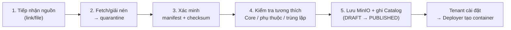
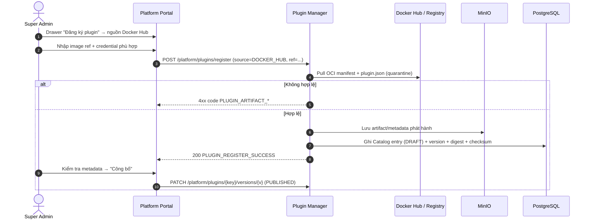
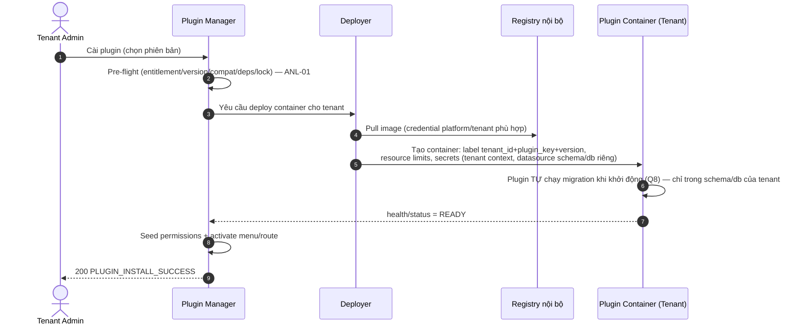
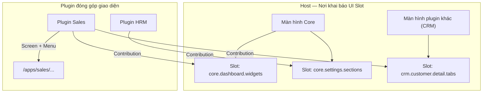

# [ANL-03] Phân Tích Nghiệp Vụ Chuyên Sâu: Cơ Chế Phân Phối & Cài Đặt Plugin Đa Kênh

- **Mã Tài Liệu**: ANL-03
- **Phiên Bản**: 1.3 — Cập nhật theo phản hồi khách hàng ngày 2026-09-19 (bổ sung: plugin riêng của Tenant; cô lập dữ liệu schema/database riêng; quyết định Web Components/Module Federation cho nhúng UI)
- **Phụ Trách**: BA Agent
- **Thuộc Sprint**: Sprint 03 - Plugin Manager, Plugin CLI & Cơ Chế Phân Phối Plugin
- **Tài Liệu Nguồn**: [RAW-03](../01_raw_notes/RAW-03_plugin_distribution_channels.md), [RAW-01](../01_raw_notes/RAW-01_plugin_management_system_tenant.md)
- **Trạng Thái**: Draft — Chờ khách hàng phê duyệt tại Confirmation Gate

---

## 1. Mục Tiêu & Tác Nhân

### 1.1. Mục Tiêu Nghiệp Vụ
- Cho phép đưa plugin đã đóng gói vào hệ thống qua **3 kênh**: Docker Hub, Image Registry (link + credentials), và tải lên file JAR backend + bản build Web.
- Quy tất cả về **một mô hình thống nhất**: mọi plugin đều được đóng gói thành **container image** và **tự động deploy riêng cho từng tenant** (quyết định Q1/Q2/Q3).
- Biến mọi nguồn plugin thành dữ liệu trong Plugin Catalog để Tenant cài đặt qua Marketplace như nhau, không phân biệt nguồn gốc.
- Đảm bảo an toàn chuỗi cung ứng: xác minh manifest, checksum SHA-256, tương thích Core, phụ thuộc; credentials đa phạm vi (nền tảng + tenant) được mã hóa; lưu trữ artifact bằng **MinIO**.

### 1.2. Tác Nhân

| Tác Nhân | Vai Trò |
| :--- | :--- |
| **Super Admin** | Người duy nhất được đăng ký/cập nhật/gỡ nguồn artifact plugin cấp hệ thống; quản lý credentials nền tảng. |
| **Tenant Admin** | Quản lý credentials registry của riêng tenant (Q7); cài plugin trong phạm vi được cấp phép; **đăng ký/cài plugin custom riêng cho tenant** (`TENANT_PRIVATE`) khi được bật `allow_custom_plugins` (làm rõ 2026-09-19). |
| **Platform Support Engineer** | Xem thông tin artifact, chẩn đoán lỗi deploy/cài đặt; không đăng ký nguồn. |
| **Plugin Developer / Publisher** | Đóng gói artifact qua CLI (Node/npm) và cung cấp link/tệp. |
| **Deployer (hệ thống)** | Thành phần tự động tạo/quản lý container plugin theo từng tenant. |

---

## 2. Khái Niệm Plugin Package & Artifact

### 2.1. Mô Hình Chung

Mọi plugin dù phân phối qua kênh nào đều có **hai phần**:

1. **Manifest (`plugin.json`)** — id, tên (i18n key), phiên bản SemVer, tương thích Core, phụ thuộc, nền tảng, quyền, entity, kafka events, menu, khối `distribution` mô tả nguồn artifact.
2. **Artifacts** — gói thực thi dưới dạng **container image**:
   - Kênh Docker Hub / Image Registry: image đã build sẵn.
   - Kênh JAR Bundle: **JAR backend + bản build Web** được đóng gói; Core **tự build thành image** rồi deploy (Q3).
   - Checksum SHA-256 bắt buộc cho mọi artifact; chữ ký số để giai đoạn sau (Q6).

### 2.2. Cấu Trúc Bundle File (Kênh tải lên)

```
<plugin-id>-<version>.zip
├── plugin.json                     # Manifest phát hành
├── backend/
│   ├── plugin-backend.jar          # Artifact backend (Quarkus fast-jar)
│   └── checksums.txt               # SHA-256 từng file backend
├── web/
│   ├── web-bundle.zip              # Bản build Web tĩnh (nếu có)
│   └── checksums.txt
├── mobile/                         # (tùy chọn)
│   └── mobile-bundle.zip
└── MANIFEST.sha256                 # Checksum tổng của toàn gói
```

> **Quy tắc**: `plugin.json` trong gói phải khớp phiên bản và checksum khai báo khi đăng ký; bundle không chứa secrets/thông tin môi trường. Bundle được lưu ở **MinIO** (Q5) và **build thành image** theo Dockerfile chuẩn của nền tảng (base runtime image + JAR + web assets).

### 2.3. Loại Phân Phối (Distribution Type)

| Giá Trị | Kênh | Artifact | Ghi Chú |
| :--- | :--- | :--- | :--- |
| `DOCKER_HUB` | Docker Hub | OCI Image (public/private) | Plugin phát hành công khai, pull trực tiếp. |
| `IMAGE_REGISTRY` | Registry bất kỳ (GHCR, Harbor, GitLab, Private) | OCI Image + credentials | Doanh nghiệp có registry riêng; môi trường nội bộ. |
| `JAR_BUNDLE` | Tải lên/xuống gói | JAR backend + Web build | Air-gapped; Core build image từ bundle (Q3). |

> **Core modules không nằm trong cơ chế này** (Q4/ANL-01): `core`, `iam`, `organization`, `platform` tách riêng, không phân phối qua catalog plugin.

---

## 3. Chi Tiết Ba Kênh Phân Phối

### 3.1. Kênh 1 — Docker Hub

1. Super Admin nhập tham chiếu image: `<namespace>/<image>:<tag>` hoặc kèm digest `<image>@sha256:<digest>`.
2. Hệ thống pull OCI manifest + đọc `plugin.json` bên trong image (quarantine) → kiểm tra → lưu catalog (DRAFT) → Công bố.
3. **BR-DIS-01**: Khuyến khích **digest bất biến** cho production; nếu dùng tag, ghi lại digest tại thời điểm đăng ký để phát hiện thay đổi.
4. **BR-DIS-02**: Private repo cần credentials (username + access token) — không dùng mật khẩu chính.
5. **BR-DIS-03**: Cảnh báo rate-limit Docker Hub; khuyến nghị mirror/registry nội bộ cho production.

### 3.2. Kênh 2 — Image Registry (Link Registry)

1. Nhập URL registry + repository + tag/digest (ví dụ `harbor.congty.vn/openerp/plugin-hrm:1.0.0`).
2. Nhập credentials nếu private; hệ thống **mã hóa khi lưu**, chỉ dùng server-side, không trả ngược UI.
3. Kiểm tra kết nối (TLS hợp lệ), pull manifest, đọc `plugin.json`, ghi Catalog.

**Quy tắc bảo mật**:
- **BR-DIS-04**: Chỉ fetch từ **allowlist registry/host** cấu hình (`openerp.plugin.registry-allowed-hosts`) — chống SSRF.
- **BR-DIS-05**: Bắt buộc HTTPS (ngoại lệ registry nội bộ cấu hình tường minh); từ chối chứng chỉ không hợp lệ.
- **BR-DIS-06**: Credentials lưu mã hóa; audit mọi lần sử dụng (pull).
- **BR-DIS-07**: Không cho phép URL có tham số lạ/redirect; giới hạn kích thước artifact tải về.

### 3.3. Kênh 3 — File JAR Backend + Bản Build Web (Q3/Q5)

1. Super Admin (hoặc Tenant Admin theo quyền) tải lên gói `.zip` chuẩn (mục 2.2) qua Drawer "Tải lên plugin".
2. Hệ thống kiểm tra: định dạng gói, kích thước, manifest hợp lệ, checksum khớp, cấu trúc đúng chuẩn.
3. Lưu trữ artifact vào **MinIO** (bắt buộc — Q5); ghi Catalog với `distribution = JAR_BUNDLE`.
4. Khi cài cho tenant: **Core build image từ bundle** (base runtime + JAR + web assets) và push vào registry nội bộ, sau đó deploy như mọi kênh khác — **KHÔNG nạp classloader vào lõi, KHÔNG cần restart Core** (Q3).

**Quy tắc**:
- **BR-DIS-08**: Chỉ chấp nhận gói đúng chuẩn; upload nâng cao (file rời) chỉ dành Super Admin.
- **BR-DIS-09**: Checksum sai lệch 100% → từ chối `PLUGIN_ARTIFACT_CHECKSUM_MISMATCH` + audit.
- **BR-DIS-10**: Upload streaming, giới hạn kích thước cấu hình được, hiển thị tiến trình.
- **BR-DIS-11**: Kênh chính thức hỗ trợ **air-gapped**; sau khi upload một lần, tenant cài không cần internet.

### 3.4. Credentials Đa Phạm Vi (Quyết Định Q7)

| Phạm Vi | Đối Tượng Quản Lý | Mục Đích |
| :--- | :--- | :--- |
| **PLATFORM** | Super Admin | Pull image từ Docker Hub/registry dùng chung toàn nền tảng; nhiều credential song song (nhiều registry/account). |
| **TENANT** | Tenant Admin | Pull image từ registry riêng của doanh nghiệp; nhiều credential song song. |

- Mỗi credential: tên gợi nhớ, registry host, username, secret (mã hóa), phạm vi, ngày tạo/người tạo; audit khi dùng.
- Khi pull/deploy image, hệ thống chọn credential phù hợp host + phạm vi (ưu tiên tenant nếu tenant đã khai báo).
- **BR-DIS-12**: Bí mật không bao giờ trả về UI/log (che `••••`); xóa credential phải kiểm tra không còn plugin/tenant đang dùng.

### 3.5. Bảng So Sánh Ba Kênh

| Tiêu Chí | Docker Hub | Image Registry Link | JAR + Web Bundle |
| :--- | :--- | :--- | :--- |
| Cần internet khi đăng ký | Có | Không (mạng nội bộ được) | Không |
| Xác thực | Token Docker Hub | Credential platform/tenant | Qua kênh đăng ký (Super Admin/Tenant) |
| Xử lý tại Core | Pull manifest | Pull manifest | **Build image từ bundle** |
| Tính bất biến | Tag/digest | Tag/digest | Gói cố định theo checksum |
| Phù hợp production | Hạn chế (rate-limit) | Khuyến nghị | Khuyến nghị cho bảo mật cao/air-gapped |

### 3.6. Kênh Đăng Ký Plugin Riêng Của Tenant (Tenant-Private — Làm Rõ 2026-09-19)

Ngoài luồng Super Admin đăng ký catalog toàn nền tảng, **Tenant Admin cũng được đăng ký custom plugin cho chính tenant của mình**:

1. **Điều kiện**: tenant được Super Admin bật `allow_custom_plugins` (theo gói hoặc cấp riêng).
2. **Nguồn**: dùng đúng 3 kênh — Docker Hub / Image Registry (credentials **của tenant**) / JAR + Web bundle upload.
3. **Xác minh bắt buộc như plugin công khai**: manifest schema, checksum SHA-256, tương thích Core, phụ thuộc, allowlist registry (host riêng của tenant phải được Super Admin duyệt — xem ANL-01 N8).
4. **Phạm vi**: bản ghi catalog có `visibility = TENANT_PRIVATE` + `owner_tenant_id`; chỉ tenant sở hữu thấy và cài; không thể `default_install`; không làm phụ thuộc công khai cho plugin khác.
5. **Giám sát nền tảng**: Super Admin thấy toàn bộ plugin riêng của mọi tenant, có quyền **khóa/gỡ cưỡng chế**; mọi thao tác ghi audit (`TENANT_PLUGIN_REGISTERED`, `TENANT_CUSTOM_PLUGIN_BLOCKED`...).
6. **Tài nguyên**: container plugin riêng tính vào **quota/hạn mức của tenant**; giới hạn số plugin riêng theo cấu hình.
7. **Trách nhiệm**: cảnh báo rõ trên UI — tenant tự chịu trách nhiệm về plugin riêng, nhưng nền tảng vẫn bảo vệ hệ thống bằng cô lập container + quyền khóa.

---

## 4. Luồng Đăng Ký & Cài Đặt (End-to-End)

### 4.1. Pipeline Xử Lý Artifact (5 bước)



| Bước | Nội Dung | Thất Bại Thì Sao? |
| :---: | :--- | :--- |
| 1 | Nhập link hoặc tải file. | Lỗi validate URL/file ngay trên UI. |
| 2 | Tải/giải nén về vùng quarantine tạm. | `PLUGIN_ARTIFACT_DOWNLOAD_FAILED`; không ghi Catalog. |
| 3 | Đọc `plugin.json`, kiểm tra schema, checksum SHA-256 (chữ ký nếu có — phase sau). | `PLUGIN_ARTIFACT_INVALID_MANIFEST` / `..._CHECKSUM_MISMATCH`. |
| 4 | So khớp tương thích Core, phụ thuộc, trùng `plugin_key + version`. | `PLUGIN_CORE_VERSION_INCOMPATIBLE` / `PLUGIN_DEPENDENCY_MISSING` / `PLUGIN_VERSION_ALREADY_EXISTS`. |
| 5 | Lưu artifact chính thức vào **MinIO** + ghi Catalog (mặc định DRAFT). | Lỗi lưu trữ → rollback, audit thất bại. |

### 4.2. Sequence — Đăng Ký Plugin Từ Docker Hub



### 4.3. Cài Đặt Cho Tenant — Container-per-Tenant + Tự Động Deploy (Q1/Q2)



**Quy tắc deploy**:
- **BR-DIS-13**: **1 container / 1 plugin / 1 tenant** (Q1); không dùng chung container giữa các tenant.
- **BR-DIS-14**: Deploy/undeploy **tự động hoàn toàn** (Q2); thao tác thủ công chỉ là phương án dự phòng khi có sự cố hạ tầng.
- **BR-DIS-15**: Container gắn nhãn chuẩn (`tenant_id`, `plugin_key`, `plugin_version`) để truy vết và dọn dẹp.
- **BR-DIS-16**: Gỡ plugin → **undeploy container nhưng giữ nguyên dữ liệu** (ANL-01 BR-PLG-07/08).
- **BR-DIS-17**: Deployer hỗ trợ tối thiểu 2 backend: **Kubernetes API** (staging/production) và **Docker Engine API** (local dev); cấu hình chọn backend theo môi trường.
- **BR-DIS-18**: Mỗi container có **resource limits** (CPU/RAM) cấu hình theo plugin + override theo plan/tenant; vượt hạn mức → cảnh báo Super Admin.
- **BR-DIS-19**: Health check bắt buộc; container fail liên tục → ledger `INSTALL_FAILED` (khi cài) hoặc cảnh báo + khả năng rollback (khi nâng cấp).
- **BR-DIS-22 (Cô lập dữ liệu — làm rõ 2026-09-19)**: Container plugin chỉ nhận **datasource/schema riêng của tenant** với DB role least privilege; migration chỉ chạy trong phạm vi tenant đó; cấm cross-schema (chi tiết ANL-01 mục 4.7, BR-PLG-26→30).

### 4.4. Mô Hình Hiển Thị Web Plugin — Hai Chế Độ & Điểm Mở Rộng UI (Q4)

> **Làm rõ của khách hàng (2026-09-19)**: Web plugin phải hiển thị được **theo một trong hai chế độ**:
> 1. **Màn hình riêng** — plugin có màn hình/route và menu riêng trong hệ thống.
> 2. **Nằm trong một màn hình đang có** — plugin đóng góp một vùng giao diện vào màn hình có sẵn của **Core** hoặc của **plugin khác**.
>
> *(Bản v1.0 ghi nhận chưa đúng — không phải chỉ một "Plugin Host Region" cố định; nay sửa lại theo đúng yêu cầu.)*

**Hai chế độ hiển thị:**

| Chế Độ | Mô Tả | Ví Dụ |
| :--- | :--- | :--- |
| **1. Màn hình riêng (Standalone Screen)** | Plugin khai báo screen + menu + route trong `plugin.json` (`ui.screens[]`); Core render route `/apps/<plugin-id>/...` trong layout Core khi plugin ACTIVE. | Plugin Bán hàng có menu "Bán hàng" và các màn hình danh sách/chi tiết đơn. |
| **2. Nhúng vào màn hình đang có (Embedded UI Contribution)** | Plugin đóng góp một vùng/widget vào **UI Slot** do **Host** khai báo: Host có thể là Core **hoặc plugin khác** (`ui.contributions[]`). | Widget "Doanh thu hôm nay" của plugin Sales nhúng vào Dashboard Core; tab "Đơn hàng" của plugin Sales nhúng vào màn hình chi tiết khách hàng của plugin CRM. |



**Khái niệm & hợp đồng:**
- **UI Slot (Điểm mở rộng giao diện)**: vùng được **Host** khai báo với hợp đồng rõ ràng: mã slot, kích thước/tỷ lệ, quyền cần có, ngữ cảnh truyền vào (tenant, bản ghi đang xem...), phiên bản hợp đồng.
- **UI Contribution**: plugin khai báo trong `plugin.json` mục `ui.contributions[]` (`slot`, `title_key`, `entry_url`/component, `order`, `permission`); chỉ render khi plugin ACTIVE + người dùng có quyền + slot tương thích.
- **Core cung cấp bộ slot chuẩn** (tối thiểu trong Sprint 03): ví dụ `core.dashboard.widgets`, `core.settings.sections`; danh sách chính thức chốt tại Bước 6.
- **Plugin làm Host**: plugin cũng có thể khai báo slot của riêng mình (`ui.slots[]`) để plugin khác đóng góp — dùng chung một hợp đồng, không phân biệt Core hay plugin.
- **Validate**: contribution vào slot không tồn tại → cảnh báo khi `validate`/đăng ký phiên bản; không cho phép ghi đè UI ngoài vùng slot.

**Kỹ thuật render (CẬP NHẬT 2026-09-19 — Quyết định khách hàng)**: khách hàng chốt **triển khai Web Components và Module Federation ngay trong Sprint 03** để nhúng plugin vào các màn hình đã có (không chỉ iframe). Đánh giá & vai trò từng phương án:

| Phương Án | Cách Hoạt Động | Vai Trò Sprint 03 | Lưu Ý |
| :--- | :--- | :--- | :--- |
| **Web Components (Custom Elements)** | Plugin export custom element chuẩn hóa cho từng contribution (Shadow DOM cô lập CSS); Core chèn vào UI Slot. | **Triển khai chính** cho UI Contribution nhúng trực tiếp. | Cần chuẩn hóa contract (tag, inputs/outputs, theme token, lifecycle); plugin Angular dùng `@angular/elements`. |
| **Module Federation** | Host nạp remote module của plugin runtime (shared-lib version pin). | **Triển khai chính** cho màn hình riêng và contribution phức tạp cần chia sẻ runtime. | Ràng buộc phiên bản shared lib giữa Core ↔ plugin; bắt buộc contract versioning + kiểm soát xung đột. |
| **iframe sandbox** *(dự phòng)* | Nhúng iframe + token ngắn hạn, proxy qua gateway Core. | **Chế độ fallback/sandbox**: plugin chưa hỗ trợ contract WC/MF, plugin riêng chưa kiểm duyệt, hoặc khi cần cô lập tuyệt đối. | UX kém liền mạch hơn; ưu tiên khi cần an toàn tối đa. |

- **Nguyên tắc an toàn bắt buộc (đề xuất BA — chốt chi tiết Bước 5/6)**:
  - Mỗi UI Contribution khai báo `render_mode = WEB_COMPONENT | MODULE_FEDERATION | IFRAME`.
  - Mặc định **IFRAME sandbox** cho plugin chưa qua kiểm duyệt / plugin riêng của tenant chưa xác thực; WC/MF chỉ bật cho plugin Official hoặc plugin được Super Admin đánh dấu **tin cậy**.
  - Vì WC/MF chạy JS trong **origin của Core**, bắt buộc: contract version hóa, **CSP**, **error boundary**, **Shadow DOM** cho Web Component, shared-lib version pin cho Module Federation, giới hạn contribution theo RBAC, audit đầy đủ.
  - Xung đột tài nguyên/UI (trùng tên element, CSS leak, version Angular) phải được phát hiện khi `validate` và hiển thị trong Portal Super Admin.
- Bổ sung quy tắc: **BR-DIS-20** — UI Contribution chỉ render khi plugin ACTIVE + quyền hợp lệ + slot hợp lệ; **BR-DIS-21** — danh sách UI Slot được quản lý tập trung (Core + plugin) và hiển thị trong Portal Super Admin để kiểm soát xung đột; **BR-DIS-23** — mỗi contribution khai báo `render_mode`; mặc định iframe sandbox cho plugin chưa được duyệt.

---

## 5. Mô Hình Vận Hành (Đã Chốt Theo Quyết Định Khách Hàng)

| Hạng Mục | Quyết Định | Ghi Chú Kỹ Thuật (chốt tại Bước 5/6) |
| :--- | :--- | :--- |
| Đơn vị runtime | **Container-per-tenant** (Q1) | Scale theo tenant; namespace/label chuẩn; dọn dẹp tập trung. |
| Deploy | **Tự động** (Q2) | Deployer abstraction: K8s API + Docker API local. |
| Nạp JAR | **Build image từ bundle rồi deploy** (Q3) | Không classloader/nạp động vào Core; không cần restart Core. |
| Migration | **Plugin tự chạy** (Q8) | Core theo dõi trạng thái qua health/status; không orchestrate schema. |
| Dữ liệu plugin | **Schema/database riêng theo tenant** (làm rõ 2026-09-19) | `DEDICATED_SCHEMA` mặc định, `DEDICATED_DATABASE` cho Enterprise; Tenant Datasource Router; DB role least privilege; cấm cross-schema; backup/restore theo tenant. |
| Lưu trữ artifact | **MinIO** (Q5) | Profile `storage`; local dev cần `make infra-storage` khi test phân phối. |
| Ký số | Giai đoạn sau (Q6) | Sprint 03: checksum SHA-256 bắt buộc. |
| Credentials | **Đa phạm vi platform + tenant** (Q7) | Mã hóa; UI quản lý riêng cho từng tầng. |
| Phiên bản | **Đa phiên bản song song theo tenant** (Q9) | Mỗi tenant ghim 1 phiên bản; image/tag tương ứng; contract API version hóa. |
| Web UI | **Hai chế độ**: màn hình riêng + UI Contribution nhúng vào UI Slot của Core/plugin khác (Q4) | Kỹ thuật **Web Components + Module Federation** (chốt 2026-09-19) + iframe sandbox dự phòng; contract version hóa. |

---

## 6. Bảo Mật & Tin Cậy Chuỗi Cung Ứng

| Lớp Bảo Vệ | Yêu Cầu Sprint 03 | Ghi Chú |
| :--- | :--- | :--- |
| Phân quyền đăng ký | Chỉ `SUPER_ADMIN`; `SUPPORT_ENGINEER` chỉ xem | Kế thừa chốt chặn platform Sprint 02. |
| Toàn vẹn | Bắt buộc checksum SHA-256 cho mọi artifact | Q6: chữ ký số giai đoạn sau. |
| Chống SSRF | Allowlist host registry; HTTPS; chặn redirect | BR-DIS-04 → 07. |
| Kích thước | Giới hạn gói/artifact cấu hình được | BR-DIS-07, BR-DIS-10. |
| Cách ly | Artifact mới ở `DRAFT`, cần Công bố; container cô lập theo tenant | BR-DIS-13; ANL-01 BR-PLG-18. |
| Bí mật | Credentials mã hóa đa phạm vi; secrets inject vào container runtime | BR-DIS-12; không trả UI/log. |
| Quét mã độc | Tối thiểu kiểm tra cấu trúc + cảnh báo; scan chuyên sâu giai đoạn sau | Không chặn MVP nếu khách hàng đồng ý. |
| Audit | Đăng ký/tải/kiểm tra/công bố/gỡ artifact + deploy/undeploy | `PLUGIN_ARTIFACT_*`, `PLUGIN_SERVICE_*`. |
| Phạm vi plugin | Plugin `TENANT_PRIVATE` chỉ hiển thị/cài cho tenant sở hữu; Super Admin giám sát + khóa khẩn cấp; artifact vẫn qua xác minh đầy đủ | BR-PLG-22 → 25 (ANL-01); mục 3.6. |
| Cô lập dữ liệu | Plugin chỉ migrate/ghi trong **schema/database riêng của tenant**; DB role least privilege; cấm cross-schema | BR-PLG-26 → 30 (ANL-01 mục 4.7); BR-DIS-22. |
| Nhúng UI trực tiếp | WC/MF chạy JS trong **origin Core** ⇒ chỉ plugin tin cậy; khai báo `render_mode`; CSP + error boundary + Shadow DOM + shared-lib version pin; plugin riêng chưa duyệt mặc định iframe sandbox | BR-DIS-23; chốt chi tiết Bước 5/6. |

---

## 7. Nâng Cấp, Rollback & Đa Phiên Bản

1. **Đăng ký phiên bản mới**: thêm version vào Catalog (DRAFT → PUBLISHED); tenant thấy badge "Có bản cập nhật".
2. **Nâng cấp theo tenant**: tùy chọn; deploy container phiên bản mới, plugin tự migrate; fail → rollback container về phiên bản cũ (ANL-01 4.3/6.3).
3. **Đa phiên bản song song (Q9)**: tenant A dùng v1, tenant B dùng v2 — mỗi tenant một image/tag; Core phải hỗ trợ nhiều hợp đồng API plugin (version hóa contract, ví dụ prefix `/api/v1/plugins/<key>/<contract-version>/...` hoặc header).
4. **Ghim phiên bản**: mặc định tenant giữ nguyên phiên bản đã cài; chỉ đổi khi Tenant Admin/Super Admin chủ động nâng cấp hoặc rollback.
5. **Rollback khẩn cấp**: Super Admin chuyển phiên bản lỗi sang `BLOCKED` → cưỡng chế gỡ toàn nền tảng + thông báo (ANL-01 4.6); hoặc rollback từng tenant về bản trước.
6. **Gỡ artifact khỏi Catalog**: chỉ khi không còn tenant nào cài (`PLUGIN_IN_USE_BY_TENANTS`).

---

## 8. Xử Lý Lỗi & Mã Lỗi Đề Xuất (BA-level)

| Tình Huống | Mã Lỗi (đề xuất) | Thông Điệp Hiển Thị (i18n key) |
| :--- | :--- | :--- |
| Link/URL không hợp lệ | `PLUGIN_ARTIFACT_SOURCE_INVALID` | Nguồn plugin không hợp lệ. |
| Không tải được artifact | `PLUGIN_ARTIFACT_DOWNLOAD_FAILED` | Không thể tải plugin từ nguồn đã cung cấp. |
| Manifest thiếu/sai | `PLUGIN_ARTIFACT_INVALID_MANIFEST` | Gói plugin thiếu hoặc sai thông tin manifest. |
| Checksum sai | `PLUGIN_ARTIFACT_CHECKSUM_MISMATCH` | Tệp plugin không toàn vẹn (checksum không khớp). |
| Chữ ký sai (phase sau) | `PLUGIN_ARTIFACT_SIGNATURE_INVALID` | Chữ ký số của plugin không hợp lệ. |
| Registry không nằm allowlist | `PLUGIN_REGISTRY_NOT_ALLOWED` | Registry không nằm trong danh sách cho phép. |
| Sai credentials registry | `PLUGIN_REGISTRY_AUTH_FAILED` | Không đăng nhập được registry. |
| Dung lượng vượt giới hạn | `PLUGIN_ARTIFACT_TOO_LARGE` | Gói plugin vượt quá dung lượng cho phép. |
| Phiên bản đã tồn tại | `PLUGIN_VERSION_ALREADY_EXISTS` | Phiên bản plugin này đã tồn tại. |
| Core không tương thích | `PLUGIN_CORE_VERSION_INCOMPATIBLE` | Plugin không tương thích phiên bản hệ thống. |
| Thiếu phụ thuộc | `PLUGIN_DEPENDENCY_MISSING` | Plugin yêu cầu plugin khác chưa được cài. |
| Trùng `plugin_key` | `PLUGIN_KEY_ALREADY_EXISTS` | Mã plugin đã tồn tại. |
| Trùng credential host (cảnh báo) | `PLUGIN_CREDENTIAL_DUPLICATE_HOST` | Đã có credential cho registry này. |
| Build image từ bundle lỗi | `PLUGIN_IMAGE_BUILD_FAILED` | Không thể đóng gói image từ gói plugin. |
| Deploy container lỗi | `PLUGIN_DEPLOY_FAILED` | Không thể triển khai dịch vụ plugin. |
| Không tạo được schema/database riêng cho tenant | `PLUGIN_TENANT_DATASOURCE_FAILED` | Không thể khởi tạo không gian dữ liệu riêng cho plugin. |
| Container không healthy | `PLUGIN_SERVICE_UNHEALTHY` | Dịch vụ plugin không khởi động được. |
| Vượt resource quota | `PLUGIN_RESOURCE_QUOTA_EXCEEDED` | Tài nguyên cấp cho plugin vượt hạn mức. |
| Plugin đang được tenant dùng | `PLUGIN_IN_USE_BY_TENANTS` | Không thể gỡ: đang có doanh nghiệp sử dụng. |
| Plugin bị khóa toàn nền tảng | `PLUGIN_BLOCKED_BY_PLATFORM` | Plugin đã bị tạm ngưng bởi quản trị nền tảng. |
| API plugin khi chưa cài/tắt | `PLATFORM_PLUGIN_NOT_ALLOWED` / `PLUGIN_DISABLED_FOR_TENANT` | (kế thừa Sprint 02 + bổ sung). |

> Mã lỗi chính thức, params và i18n key chốt tại Bước 6 (API Spec).

---

## 9. Yêu Cầu Giao Diện (BA-level)

### 9.1. Drawer "Đăng Ký Plugin" (Super Admin)

1. **Chọn nguồn**: Docker Hub / Image Registry / Tải tệp lên.
2. **Nhập thông tin nguồn**:
   - Docker Hub: image ref + credential.
   - Registry: URL + chọn credential (platform) + nút "Kiểm tra kết nối".
   - Tải tệp: kéo-thả `.zip` + tiến trình + checksum sau khi tải.
3. **Xem trước & Xác nhận**: metadata đọc được + cảnh báo + nút "Đăng ký".

### 9.2. Drawer Chi Tiết Plugin (Super Admin)

- Timeline phiên bản + nguồn artifact (kênh, digest/checksum, ngày, người đăng ký).
- Nút: Thêm phiên bản, Công bố/Ngừng hỗ trợ/Khóa, Gỡ artifact, **Rollback tenant**.
- Tab "Tenant đang cài": bảng dense, tìm kiếm, phân trang, ghim phiên bản, trạng thái container.
- Tab/trang **Registry Credentials (Platform)**: nhiều credential, che bí mật.

### 9.3. Marketplace Tenant

- Chỉ hiển thị plugin đã được cấp phép (ANL-01 Q6); badge nguồn gốc nhẹ (Chính thức/Đối tác).
- Chọn phiên bản khi cài (hỗ trợ đa phiên bản — Q9).
- Trang **Registry Credentials (Tenant)**: nhiều credential phục vụ registry riêng (Q7).
- **Drawer "Đăng ký plugin riêng"** (khi `allow_custom_plugins` bật): Tenant Admin đăng ký custom plugin từ 3 kênh với credentials của mình; hiển thị nhãn `TENANT_PRIVATE` + cảnh báo trách nhiệm + trạng thái giám sát của nền tảng.

### 9.4. Nguyên Tắc Chung

- Anti-Modal, density cao (`text-xs`/`text-sm`), i18n 100%, theme sáng/tối.
- Thông tin bảo mật che `••••`, không copy, không xuất log.
- Hiển thị trạng thái deploy (đang deploy, healthy, lỗi) trên UI quản trị.

---

## 10. Ranh Giới Phạm Vi (Scope)

### In-Scope Sprint 03:
- Đăng ký plugin từ 3 kênh: Docker Hub, Image Registry link, File JAR + Web build → **tất cả quy về container image**.
- Build image từ bundle JAR + Web; deploy **container-per-tenant tự động** (Deployer: K8s + Docker local).
- Xác minh manifest + checksum + tương thích + phụ thuộc + trùng lặp; lưu artifact bằng **MinIO**.
- **Credentials đa phạm vi** (platform + tenant), mã hóa, quản lý trên UI.
- **Đa phiên bản song song theo tenant** (Q9); chọn phiên bản khi cài; rollback.
- **Hai chế độ hiển thị Web**: màn hình riêng (menu/route động) + **UI Contribution** nhúng vào UI Slot của Core/plugin khác bằng **Web Components + Module Federation** (quyết định 2026-09-19); iframe sandbox là chế độ dự phòng.
- UI Drawer đăng ký/phiên bản/credentials; audit đầy đủ.
- **Plugin riêng của Tenant**: Tenant Admin đăng ký custom plugin (`TENANT_PRIVATE`) qua 3 kênh khi được bật `allow_custom_plugins`; xác minh artifact đầy đủ; Super Admin giám sát + khóa; tài nguyên tính quota tenant.
- **Cô lập dữ liệu plugin theo tenant**: `DEDICATED_SCHEMA` (mặc định) / `DEDICATED_DATABASE` (Enterprise); tenant datasource + DB role least privilege; migration không ảnh hưởng tenant khác.

### Out-of-Scope (giai đoạn sau):
- Ký số bắt buộc + quét mã độc chuyên sâu (SBOM, CVE scan).
- Marketplace bên thứ ba + thanh toán doanh thu; chia sẻ plugin riêng (`TENANT_PRIVATE`) giữa các tenant.
- Tự động scale container theo tải (horizontal autoscaling) — có thể cân nhắc giữa sprint nếu khách hàng ưu tiên.
- Purge dữ liệu plugin khi gỡ (ANL-01 Q2).

---

## 11. Quyết Định Đã Chốt & Câu Hỏi Phát Sinh

### 11.1. Quyết Định Của Khách Hàng (2026-09-19)

| # | Quyết Định | Ảnh Hưởng Đã Phản Ánh |
| :---: | :--- | :--- |
| Q1 | **Mỗi tenant một container** (scale theo tenant) | Mục 4.3, 5; BR-DIS-13. |
| Q2 | **Hệ thống tự động deploy** | Mục 4.3, 5; BR-DIS-14 → 19. |
| Q3 | **JAR upload → tự build image → deploy** | Mục 2.2, 3.3, 5; BR-DIS-15. |
| Q4 | Web plugin **màn hình riêng HOẶC nhúng vào màn hình có sẵn của Core/plugin khác** | Mục 4.4 — hai chế độ + UI Slot/UI Contribution; kỹ thuật **Web Components + Module Federation**, iframe sandbox dự phòng (chốt 2026-09-19). |
| Q5 | **Lưu trữ artifact bằng MinIO** | Mục 3.3, 5. |
| Q6 | **Ký số để giai đoạn sau**; Sprint 03 dùng checksum | Mục 6. |
| Q7 | **Credentials đa phạm vi** (platform + tenant, nhiều credential) | Mục 3.4, 9.2, 9.3; BR-DIS-12. |
| Q8 | **Plugin tự chạy migrate** | Mục 4.3, 5. |
| Q9 | **Đa phiên bản song song theo tenant** | Mục 7; ANL-01 BR-PLG-14. |
| Bổ sung (2026-09-19) | **Tenant Admin được đăng ký custom plugin cho tenant mình** (không chỉ Super Admin) | Mục 1.2, 3.6, 9.3; ANL-01 BR-PLG-22→25. |
| Bổ sung 2 (2026-09-19) | **Dữ liệu riêng của tenant ở schema/database khác nhau** (cô lập migration plugin) | Mục 4.3, 5, 6; ANL-01 mục 4.7 + BR-PLG-26→30; BR-DIS-22. |
| Bổ sung 3 (2026-09-19) | **Triển khai Web Components/Module Federation để nhúng plugin vào màn hình có sẵn** | Mục 4.4, 5, 6; BR-DIS-23; ANL-02 `generate ui-contribution`. |

### 11.2. Câu Hỏi Phát Sinh (Cần Chốt Trước/Song Song Bước 5)

| # | Câu Hỏi | Ảnh Hưởng | Đề Xuất Của BA |
| :---: | :--- | :--- | :--- |
| N1 | Backend deploy Sprint 03: K8s API cho staging/production + Docker API cho local — ai cấp quyền cluster (service account/RBAC)? | Hạ tầng, bảo mật | Architect thiết kế Deployer + ServiceAccount tối thiểu quyền; chốt Bước 5. |
| N2 | Image build từ bundle: chạy bằng Docker daemon (local) hay BuildKit/Kaniko (K8s)? Push vào registry nội bộ nào? | Hạ tầng | Local: Docker daemon; K8s: Kaniko; registry nội bộ cấu hình `DOCKER_REGISTRY`. |
| N3 (đã điều chỉnh) | **Đã chốt**: schema/database riêng theo tenant. Còn lại: chi tiết Tenant Datasource Router, cấp phát/rotate credentials, connection pool theo tenant | Kiến trúc, vận hành | Architect chốt Bước 5/6. |
| N4 | Resource limits mặc định mỗi container (CPU/RAM) và cách override theo plan/tenant? | Chi phí, vận hành | Mặc định theo plugin; override theo plan; cấu hình tập trung. |
| N5 | Giới hạn số phiên bản runtime đồng thời cho một plugin (tránh bùng nổ container)? | Hạ tầng | Cấu hình giới hạn (ví dụ tối đa N major versions). |
| N6 | MinIO trở thành dịch vụ bắt buộc cho tính năng phân phối plugin — local dev cần `make infra-storage`; có chấp nhận tăng footprint khi test plugin? | Guardrail môi trường dev | Chấp nhận theo profile on-demand; tài liệu hóa rõ trong deployment guide. |
| N7 | Plugin riêng của tenant có cần Super Admin phê duyệt trước khi cài? Registry host riêng của tenant có phải qua allowlist nền tảng? | Bảo mật, governance | Xem ANL-01 N7/N8: đề xuất tự động khi bật `allow_custom_plugins` + Super Admin duyệt host registry. |
| N8 | Plugin riêng của tenant (`TENANT_PRIVATE`) có được nhúng trực tiếp bằng WC/MF vào màn hình Core hay mặc định iframe sandbox? | Bảo mật origin Core | Đề xuất: mặc định **iframe sandbox**; WC/MF chỉ khi plugin được Super Admin đánh dấu **tin cậy** (plugin official) hoặc tenant xác nhận rủi ro. |
