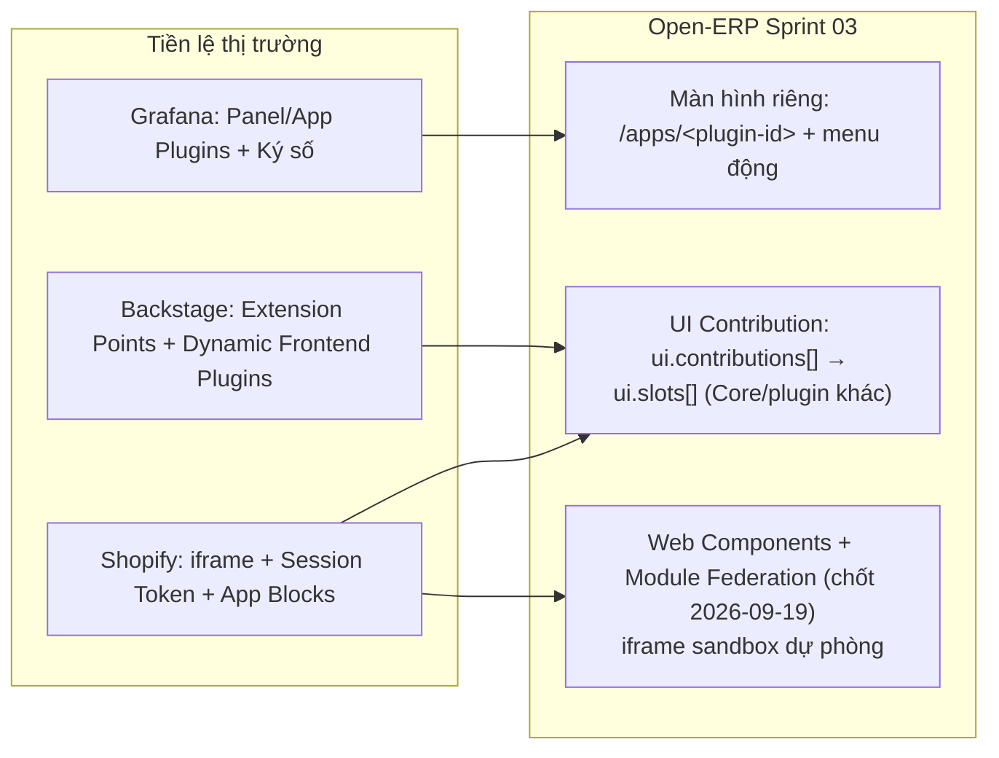

# [BENCH-02] Nghiên Cứu Đối Chuẩn Thị Trường: Phân Phối Artifact, Runtime Container-per-Tenant, UI Extension & CLI Scaffolding

- **Mã Tài Liệu**: BENCH-02
- **Phụ Trách**: BA Agent
- **Thuộc Sprint**: Sprint 03 - Plugin Manager, Plugin CLI & Cơ Chế Phân Phối Plugin
- **Ngày Hoàn Thành**: 2026-09-19
- **Hệ Thống Khảo Sát**: Kubernetes Helm/OCI, Docker Hub & Portainer, Grafana Plugins, Shopify Embedded Apps, Backstage, VS Code Marketplace, Supabase/Neon, JupyterHub & K8s Multi-Tenancy, **CLI hệ thống** (odoo-bin, Frappe bench, wp-cli, Keycloak kcadm.sh, Nextcloud occ, Supabase CLI), **CLI phát triển plugin** (Grafana create-plugin, Backstage create-app, Shopify CLI, Salesforce sf, Atlassian Forge CLI, VS Code yo code/vsce, Angular CLI/schematics)
- **Tài Liệu Liên Quan**: [ANL-02](../02_analysis/ANL-02_plugin_scaffold_cli.md), [ANL-03](../02_analysis/ANL-03_plugin_distribution_and_installation.md)

---

## 1. Mục Đích Khảo Sát

Kiểm chứng và học hỏi best practices cho 3 trụ cột kỹ thuật của Sprint 03: (1) **phân phối & xác minh artifact** qua registry/file; (2) **runtime container-per-tenant + cô lập dữ liệu**; (3) **cơ chế UI Extension** (màn hình riêng + nhúng vào màn hình có sẵn) và **CLI scaffolding** phát hành qua npm.

---

## 2. Phân Phối & Xác Minh Artifact

| Tiêu Chí | Kubernetes Helm | Docker Hub / Portainer | Grafana Plugins | VS Code Marketplace | Open-ERP Sprint 03 |
| :--- | :--- | :--- | :--- | :--- | :--- |
| **Đóng gói** | Chart (`Chart.yaml` + templates, SemVer) | OCI Image (tag/digest) | Plugin bundle + `plugin.json` | `.vsix` + `package.json` | `plugin.json` + image/bundle (JAR + Web zip) |
| **Kênh phân phối** | Repo HTTP (`index.yaml`) + **OCI Registry** | Docker Hub + registry bất kỳ | Catalog Grafana | Marketplace (public/private) | Docker Hub / Image Registry / File upload (MinIO) |
| **Toàn vẹn** | `SHA256` + **`.prov` ký PGP (provenance)** | Digest `@sha256:...` (bất biến) | **Plugin được Grafana ký số**; unsigned bị chặn ở production | Publisher verification + chữ ký gói | **Checksum SHA-256 bắt buộc**; ký số giai đoạn sau (Q6) |
| **Cài & quản lý phiên bản** | `helm install/upgrade/rollback/uninstall`, mỗi lần cài là 1 "release" có revision | `docker pull` tag/digest; Portainer app templates | Cài qua UI/CLI, cập nhật theo phiên bản | Cài từ Marketplace/`code --install-extension`, auto-update | Cài/gỡ/nâng cấp theo tenant; ledger + rollback container |
| **Rollback** | Có (`helm rollback` về revision trước) | Không native (phải pull lại image cũ) | Không có rollback chuẩn hóa | Không (cài lại bản cũ) | **Rollback container về bản liền trước** (BR-PLG-17) |
| **Hạn chế đáng lưu ý** | Chart dependency phức tạp | Tag mutable; **rate-limit**; thiếu audit | Signing key nội bộ; unsigned dev phải bật cờ | Public marketplace khó kiểm soát nội bộ | Digest khuyến nghị; allowlist registry; checksum + audit |

**Bài học chính**:
- Mô hình **"release/revision" của Helm** (mỗi lần cài có lịch sử) ≈ ledger `tenant_plugins` + lịch sử nâng cấp của Open-ERP.
- **OCI Registry + digest bất biến** là chuẩn phân phối; **checksum tối thiểu, chữ ký là bước tiến hóa tiếp theo** (đúng lộ trình Q6).
- **Grafana cho thấy ký số + chặn unsigned ở production** là khả thi cho plugin UI/backend — Open-ERP để giai đoạn sau nhưng đã chừa chỗ trong manifest (`distribution.checksum`).

---

## 3. Runtime Container-per-Tenant & Cô Lập Dữ Liệu

| Tiêu Chí | JupyterHub (K8s) | K8s Multi-Tenancy | Supabase / Neon | Odoo / Frappe (ERP) | Open-ERP Sprint 03 |
| :--- | :--- | :--- | :--- | :--- | :--- |
| **Đơn vị runtime** | **Pod riêng cho mỗi user** (spawn/cull) | Namespace-per-tenant | Project = database riêng | DB/site riêng mỗi tenant | **Container riêng cho mỗi tenant + plugin** |
| **Cô lập tài nguyên** | Resource limits, idle culling | `ResourceQuota`, `NetworkPolicy`, RBAC | Connection pooler (Supavisor/PgBouncer) | DB-per-tenant | Resource limits + quota tenant; pool lazy theo tenant |
| **Cô lập dữ liệu** | Volume riêng mỗi user | Namespace + RBAC | **DB-per-project** hoặc schema + RLS | DB-per-tenant | **`DEDICATED_SCHEMA` / `DEDICATED_DATABASE`** + DB role least privilege |
| **Vòng đời** | Spawn khi dùng, cull khi idle | Operator quản lý | Scale-to-zero | Install module theo DB | Cài/gỡ/bật/tắt; gỡ = undeploy + giữ dữ liệu |
| **Bài học** | Idle culling tiết kiệm tài nguyên; spawn tự động qua API | Nhãn + namespace chuẩn để quản lý/dọn dẹp | **Nhiều tenant ⇒ nhu cầu connection pooling**; db-per-tenant tốt cho cô lập nhưng tốn vận hành | Chuẩn mực ERP SaaS — đúng mô hình khách hàng yêu cầu | Deployer tự động + nhãn `tenant_id/plugin_key/version`; cân nhắc idle scaling sau |

**Bài học chính**:
- **Container-per-tenant là mô hình đã được kiểm chứng** (JupyterHub per-user pod, K8s namespaces) — đổi lại phải có: cấp phát tự động, resource limits, **idle/culling** và **connection pool theo tenant**.
- **DB-per-tenant/schema-per-tenant** (Supabase, Odoo, Frappe) là chuẩn để cô lập migration/dữ liệu; **không nền tảng nào dùng chung 1 schema cho dữ liệu plugin bên thứ ba**.
- Supabase/Neon nhắc nhở: khi số tenant tăng, **pooling và scale-to-zero** là yếu tố sống còn — ghi nhận vào rủi ro Sprint 03.

---

## 4. Cơ Chế UI Extension (Màn Hình Riêng & Nhúng Vào Màn Hình Có Sẵn)

| Tiêu Chí | Shopify Embedded Apps | Backstage | Grafana App Plugins | WordPress Admin | Open-ERP Sprint 03 |
| :--- | :--- | :--- | :--- | :--- | :--- |
| **Màn hình riêng** | App có page riêng trong Admin | Plugin thêm page/route | App plugin thêm trang + menu nav | Plugin thêm menu admin | Route `/apps/<plugin-id>` + menu từ `plugin.json` |
| **Nhúng vào màn hình có sẵn** | **Admin UI Extensions / App Blocks** gắn vào trang sản phẩm, checkout... | **Extension points** của host | **Panel plugin** render trong dashboard | Dashboard widget, metabox | **UI Contribution** vào `ui.slots[]` của Core/plugin khác |
| **Kỹ thuật render** | **iframe + App Bridge + session token (postMessage)** | Extension component (cùng runtime) / dynamic frontend plugin | React component nạp vào runtime Grafana | PHP hooks chạy cùng runtime | **Web Components + Module Federation (chốt Sprint 03)** cho nhúng trực tiếp; **iframe sandbox dự phòng** |
| **Xác thực** | Session token ngắn hạn (JWT) qua App Bridge | Host context | Grafana session | WordPress session | Token ngắn hạn Core ký + proxy gateway (chốt Bước 5/6) |
| **Menu điều hướng** | App Bridge `NavMenu` thêm mục menu | Host nav | App plugin nav | `add_menu_page` | Menu sinh động từ manifest khi plugin ACTIVE + RBAC |
| **Kiểm duyệt** | App Store review | Open source | Ký plugin + catalog | Open | Super Admin duyệt công khai; tenant-private có giám sát |

**Bài học chính**:
- **iframe + session token là chuẩn công nghiệp** cho app bên thứ ba nhúng vào admin UI (Shopify) — xác nhận mô hình nhúng contribution; Open-ERP chốt kỹ thuật **Web Components + Module Federation** cho nhúng trực tiếp (theo mô hình extension của Backstage/Grafana) và giữ **iframe sandbox** làm chế độ dự phòng an toàn (theo mô hình Shopify). Lưu ý: WC/MF chạy trong origin Core nên cần kiểm soát tin cậy, CSP, Shadow DOM và version pin.
- Mô hình **Extension Points/Blocks** (Shopify, Backstage) xác nhận thiết kế **UI Slot + UI Contribution** cho phép plugin hiển thị trong màn hình có sẵn của Core/plugin khác.
- **Grafana là tiền lệ gần nhất về manifest + ký số + catalog cập nhật** cho plugin có cả backend lẫn frontend.

---

## 5. CLI Hệ Thống & Trải Nghiệm Phát Triển Plugin

### 5.1. CLI Quản Trị Hệ Thống (System / Admin CLI)

| Hệ Thống | CLI | Mô Hình | Bài Học Cho Open-ERP |
| :--- | :--- | :--- | :--- |
| **Odoo** | `odoo-bin` | CLI Python chạy cùng mã nguồn: `-d/--database`, `-i/-u <module>` (cài/nâng cấp module), `shell`, **`scaffold <module>`** | Quản trị module gắn chặt DB; `scaffold` là tiền lệ sinh khung module |
| **Frappe / ERPNext** | `bench` | Một CLI cho cả vận hành lẫn phát triển: `new-site`, `new-app`, `install-app`, `uninstall-app`, `migrate`, `restore` | **Một CLI hợp nhất cho vòng đời app + vận hành**; subcommand rõ ràng, chạy theo site |
| **WordPress** | `wp-cli` | CLI PHP cài ngoài; `wp plugin install/activate/update/uninstall`, **`wp scaffold plugin`**; hỗ trợ chạy remote qua SSH | Lệnh vòng đời plugin chuẩn mực + scaffold; remote CLI hữu ích |
| **Keycloak** | `kcadm.sh` | CLI admin **gọi Admin REST API** thay vì truy cập DB trực tiếp | CLI mỏng, an toàn — nên áp dụng khi mở rộng **remote admin CLI** của Open-ERP |
| **Nextcloud** | `occ` | CLI PHP chạy trong instance: `app:enable/disable`, `maintenance:mode`, `upgrade` | Lệnh bật/tắt app và bảo trì rất gần với Plugin Manager |
| **Supabase** | `supabase` CLI | npm/brew: `start`, `db`, `functions deploy`, `link` | Dev local + deploy; trải nghiệm CLI hiện đại |
| **Open-ERP (Sprint 02)** | `admin-cli` (Quarkus command-mode) | Offline trên server: `bootstrap`, `grant-admin`, `revoke-admin`, `list-admins`; audit actor `CLI` | Nền tảng tốt; backlog mở rộng remote CLI + subcommand |

### 5.2. CLI Phát Triển Plugin (Scaffolding & Dev Loop)

| Hệ Thống | CLI | Tạo Khung | Dev Loop / Hot Reload | Sinh Thành Phần | Đóng Gói / Phát Hành |
| :--- | :--- | :--- | :--- | :--- | :--- |
| **Grafana** | `@grafana/create-plugin` (npx) | ✓ backend + frontend | **`npm run dev`** (Docker Compose + hot reload, kết nối Grafana dev) | — | Build + ký + catalog |
| **Backstage** | `@backstage/create-app` (npx) | ✓ | **`yarn dev`** (frontend + backend) | **`yarn new`** (plugin/package) | Publish npm package |
| **Shopify** | `shopify` CLI | `shopify app init` | **`shopify app dev`** (tunnel HTTPS + hot reload) | App extensions | `shopify app deploy` |
| **Salesforce** | `sf` CLI | `sf project generate` | **Scratch org + `sf project deploy`** | `sf generate` | Package version + release |
| **Atlassian** | `forge` CLI | `forge create` | **`forge tunnel`** (chạy local, debug trên cloud) | — | `forge deploy` + install |
| **VS Code** | `yo code` (Yeoman) / `vsce` | ✓ | **Extension Development Host** (F5, hot reload) | — | `vsce package/publish` |
| **WordPress** | `wp scaffold plugin` | ✓ | `wp-env` / Docker | `wp scaffold` | wordpress.org SVN |
| **Frappe** | `bench new-app` | ✓ | `bench start` (hot reload) | `bench new-app` | Git + Marketplace |
| **Angular** | Angular CLI | `ng new` | `ng serve` | **`ng generate` (schematics)** | `ng build` |
| **Open-ERP Sprint 03** | `@openerp/plugin-cli` (Node/npm) | `create` (repo riêng + submodule) | **Đề xuất bổ sung lệnh `dev`** (chạy container plugin local + web dev server kết nối Core dev) — chờ khách chốt | `generate entity/menu/ui-contribution` | `package` + checksum + Dockerfile/K8s |

### 5.3. Trải Nghiệm Phát Triển Plugin (Dev Loop) — Bài Học

1. Mọi hệ sinh thái plugin thành công đều có **vòng lặp phát triển local nhanh**: Grafana `npm run dev`, Backstage `yarn dev`, Shopify `app dev` (tunnel), Forge `tunnel`, Salesforce scratch org, VS Code Extension Host — lập trình viên **không phải build/đăng ký phiên bản mỗi lần sửa**.
2. **Ba trụ cột DX** cần có cho plugin CLI:
   - **`create` + `generate`**: sinh khung chuẩn, hạn chế code tay (Frappe `bench new-app`, Angular schematics, Grafana/Backstage `create-*`).
   - **`dev`**: chạy plugin local + hot reload + kết nối Core dev (Grafana, Shopify, Forge).
   - **`validate` + `package` + `publish`**: kiểm tra, đóng gói, checksum, đẩy registry (Helm/Docker pattern — mục 2).
3. **Đề xuất cho Open-ERP**: bổ sung lệnh **`dev`** cho FEAT-22 (khởi chạy container plugin local + web dev server, trỏ về Core dev, hot reload) — phù hợp kiến trúc container-per-tenant; xem câu hỏi mở tại [ANL-02 N7](../02_analysis/ANL-02_plugin_scaffold_cli.md) (chờ khách hàng chốt phạm vi Sprint 03).
4. **CLI quản trị hệ thống** nên tiến hóa theo mô hình **API-first** (`kcadm.sh`, `occ`): remote CLI gọi API có xác thực thay vì thao tác DB trực tiếp; giữ offline CLI cho tình huống break-glass (backlog Sprint 02: remote CLI script + subcommand mở rộng).

**Bài học chính (CLI)**:
- **`npx` là chuẩn phân phối CLI cho nhà phát triển** — khớp quyết định Q2 (npm/npx global).
- **`ng generate` (schematics)** là mô hình chuẩn cho lệnh **sinh entity/menu/UI contribution** — Open-ERP kế thừa cách đặt lệnh, validation và merge an toàn file hiện hữu.
- **Template gắn version + compatibility** (Grafana/Backstage) là cách chống lỗi thời template — Open-ERP áp dụng `template_version` trong manifest.
- **Thiếu `dev` sẽ làm giảm trải nghiệm phát triển** so với các hệ sinh thái hàng đầu — cần cân nhắc đưa vào Sprint 03.

---

## 6. Bài Học Đúc Rút & Quyết Định Áp Dụng Cho Open-ERP Sprint 03

| # | Bài Học | Áp Dụng Vào Sprint 03 | Truy Vết |
| :---: | :--- | :--- | :--- |
| 1 | OCI + digest + checksum, chữ ký là bước sau (Helm, Grafana) | 3 kênh phân phối; checksum bắt buộc; digest khuyến nghị; ký số giai đoạn sau | ANL-03 mục 2–3, 6 |
| 2 | Release/revision + rollback (Helm) | Ledger `tenant_plugins` + lịch sử; rollback container bản liền trước | ANL-01 mục 4; BR-PLG-13/17 |
| 3 | Container-per-tenant đã kiểm chứng (JupyterHub, K8s) | Deployer tự động; nhãn chuẩn; resource limits; idle scaling cân nhắc sau | ANL-03 mục 4.3, 5 |
| 4 | DB/schema-per-tenant là chuẩn ERP (Odoo, Frappe, Supabase) | `DEDICATED_SCHEMA`/`DEDICATED_DATABASE`; DB role least privilege; pool theo tenant | ANL-01 mục 4.7; BR-PLG-26→30 |
| 5 | iframe + session token + blocks (Shopify); extension points (Backstage/Grafana) | Màn hình riêng + UI Contribution vào slot; kỹ thuật **Web Components + Module Federation** cho nhúng trực tiếp, iframe sandbox dự phòng | ANL-03 mục 4.4; `generate ui-contribution` |
| 6 | Extension points + dynamic UI (Backstage, Grafana) | Hợp đồng `ui.screens[]`/`ui.slots[]`/`ui.contributions[]`; plugin làm Host | ANL-03 mục 4.4 |
| 7 | `npx create-*` + `ng generate` (schematics) | CLI Node/npm với `create`/`generate`; template versioning; merge an toàn | ANL-02 mục 3, 5.2–5.4 |
| 8 | Ký số & kiểm duyệt (Grafana, VS Code, Salesforce) | Lộ trình: checksum (Sprint 03) → signing/quét mã độc (giai đoạn sau); governance 2 tầng | ANL-03 Q6; ANL-01 mục 2.3 |
| 9 | Nhiều tenant ⇒ pooling/scale-to-zero (Supabase/Neon) | Đưa vào rủi ro Sprint 03 + thiết kế Tenant Datasource Router tại Bước 5/6 | Sprint Plan mục 5 (Risk) |
| 10 | CLI hệ thống API-first (kcadm.sh, occ, wp-cli) | Mở rộng remote admin CLI theo mô hình gọi API có xác thực; giữ offline CLI break-glass; subcommand vòng đời plugin (`install-app`/`app:enable`) | Backlog Sprint 02 + FEAT-22/23 |
| 11 | Dev loop local (Grafana `dev`, Backstage `yarn dev`, Shopify `app dev`, Forge `tunnel`) | **Đề xuất bổ sung lệnh `dev`** cho plugin CLI (container local + hot reload + kết nối Core dev) | ANL-02 mục 5.5 + N7 (chờ chốt phạm vi) |

> **Kết luận đối chuẩn**: Các quyết định của khách hàng (1 bảng entitlement + cài đặt; container-per-tenant; schema/DB riêng; soft uninstall giữ dữ liệu; plugin riêng của tenant; UI 2 chế độ; CLI npm) đều **trùng khớp với best practice đã được kiểm chứng** của ít nhất 2–3 nền tảng hàng đầu. Không có xung đột kiến trúc cần điều chỉnh; các điểm cần chú ý khi thiết kế chi tiết là **connection pooling theo tenant**, **bảo mật token cho UI nhúng** và **lộ trình ký số artifact**.
