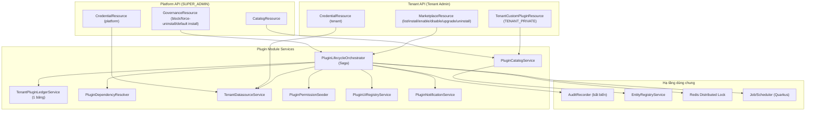

# [SOL-01] Nghiên Cứu Giải Pháp Kiến Trúc: Plugin Manager & Vòng Đời Plugin

- **Mã Tài Liệu**: SOL-01
- **Phụ Trách**: Solution Architect
- **Thuộc Sprint**: Sprint 03 - Plugin Manager, Plugin CLI & Cơ Chế Phân Phối Plugin
- **Tài Liệu Nguồn**: [CONF-01](../04_confirmation/CONF-01_sprint_03_scope.md), [ANL-01 v1.4](../02_analysis/ANL-01_plugin_manager_lifecycle.md)
- **Trạng Thái**: Hoàn thành — Chờ duyệt để chuyển sang Bước 6 (Thiết kế chi tiết)

---

## 1. Mục Tiêu Kỹ Thuật

1. Hiện thực **Plugin Manager** đúng quyết định đã chốt: một bảng duy nhất cho entitlement + vòng đời; Core modules tách riêng; soft uninstall giữ dữ liệu; cài mặc định; đa phiên bản; plugin riêng của tenant; khóa khẩn cấp cưỡng chế gỡ + thông báo.
2. Đảm bảo **an toàn giao dịch** cho chuỗi thao tác dài (provision datasource → deploy container → plugin tự migrate → health → seed quyền → activate) theo mô hình **Saga + bù trừ (compensation)**, không để trạng thái nửa vời.
3. Tương thích ngược với nền tảng Sprint 02: `allowed_plugins` → di trú vào bảng mới; `TenantPluginAllowlistService` nâng cấp đọc trạng thái; `GET /platform/plugins` giữ hợp đồng khi có thể.
4. Tận dụng tối đa hạ tầng đã có: Audit Trail bất biến, Entity Registry, RBAC/Data Scope, Redis lock, Quarkus/PostgreSQL.

---

## 2. Phương Án Kiến Trúc Module

### 2.1. So Sánh Phương Án

| Tiêu Chí | Phương Án A — Mở rộng `modules/platform` | Phương Án B — Module mới `modules/plugin` *(đề xuất)* |
| :--- | :--- | :--- |
| Ranh giới nghiệp vụ | Platform vừa quản trị tenant vừa sở hữu vòng đời plugin → phình to | Tách bạch: Platform = governance/API cho Super Admin; Plugin = nghiệp vụ lõi |
| Khả năng tái sử dụng | Khó tái sử dụng logic deploy/catalog cho tenant API | Service dùng chung cho cả platform API và tenant API |
| Độ phức tạp triển khai | Thấp ban đầu | Trung bình (thêm package module, không thêm service) |
| Trái với Blueprint? | Không | Khớp Blueprint 2.1.5 (Plugin Engine là Core service độc lập) |

**Quyết định**: chọn **Phương Án B** — thêm module `com.vn9melody.openerp.modules.plugin` gồm các gói `model/`, `repository/`, `service/`, `resource/`, `dto/`, `deployer/`, `artifact/`, `cli/` (nếu có CLI Core-side), `api/` (mã lỗi/response key riêng: `PluginErrorCode`, `PluginResponseKey`).

### 2.2. Sơ Đồ Thành Phần

---

## 3. Mô Hình Dữ Liệu Cấp Kiến Trúc (Chi Tiết Ở DES-03-DB)

| Bảng (làm việc) | Vai Trò | Ghi Chú Then Chốt |
| :--- | :--- | :--- |
| `plugin_catalog` | Danh mục plugin tùy chọn cấp nền tảng | `plugin_key` unique; `visibility = PLATFORM \| TENANT_PRIVATE`; `owner_tenant_id` (nullable); `is_core` luôn false (Core tách riêng); `default_install` |
| `plugin_versions` | Phiên bản bất biến (SemVer) | `core_compatibility`, `dependencies`, `platforms`, `permissions`, `entities`, `ui`, `distribution`, `checksum`, trạng thái phiên bản |
| `tenant_plugins` | **Một bảng duy nhất**: entitlement + trạng thái + phiên bản ghim + deploy | PK `(tenant_id, plugin_key)`; `status`, `installed_version`, `target_version`, `storage_model`, `deploy_ref`, `last_error`, `locked`; unique chống trùng |
| `plugin_ui_slots` | Registry UI Slot (Core + plugin) | `slot_code`, `host_type`, `contract_version`, `owner_plugin_key` |
| `plugin_credentials` | Credentials đa phạm vi | `scope = PLATFORM \| TENANT`, `tenant_id` nullable; secret mã hóa |
| `plugin_operation_logs` | Vết các bước Saga | `operation_id`, `step`, `result`, `detail` (phục vụ chẩn đoán) |
| `tenant_notifications` (đề xuất) | Thông báo trong ứng dụng | Plugin bị khóa, cập nhật, kết quả bulk |

**Di trú**: `V3.0.0__plugin_manager_schema.sql` tạo bảng; `V3.0.1__backfill_allowed_plugins.sql` chuyển từng phần tử `tenants.allowed_plugins` thành dòng `tenant_plugins(status='NOT_INSTALLED')`. Trường cũ giữ tạm để API `/quotas` tương thích ngược, sau đó deprecate có kiểm soát.

---

## 4. Máy Trạng Thái & Đồng Bộ

### 4.1. Trạng Thái

`NOT_INSTALLED → INSTALLING → ACTIVE ⇄ INACTIVE`; nhánh `UPGRADING → ACTIVE` (hoặc rollback); `UNINSTALLING → UNINSTALLED`; lỗi `INSTALL_FAILED`.

### 4.2. Chống Tranh Chấp (Concurrency)

- **Redis lock** `plugin:lock:{tenantId}:{pluginKey}` (TTL ngắn, gia hạn khi job dài) — chặn 2 thao tác vòng đời song song.
- **Optimistic lock** trên `tenant_plugins.version` (cột `@Version`) cho cập nhật trạng thái.
- Mọi thao tác ghi ledger kèm `operation_id` để truy vết và chống xử lý trùng khi retry.

### 4.3. Saga & Bù Trừ

| Bước | Hành Động | Bù Trừ Khi Lỗi |
| :---: | :--- | :--- |
| 1 | Pre-flight validate (entitlement/phiên bản/tương thích/phụ thuộc/nền tảng) | Không cần |
| 2 | Ghi ledger `INSTALLING` | Trả về `NOT_INSTALLED`/trạng thái trước đó |
| 3 | Provision datasource tenant (schema/db + role) nếu chưa có | Không xóa schema (idempotent, tái sử dụng lần sau) |
| 4 | Deploy container tenant | Undeploy container |
| 5 | Chờ plugin tự migrate + health/status | Undeploy container; `INSTALL_FAILED` |
| 6 | Seed permission + đăng ký menu/UI slot | Thu hồi permission đã seed |
| 7 | **Precondition check lần cuối** (catalog `ACTIVE`, version không `BLOCKED`, không bị khóa giữa chừng) → Ledger `ACTIVE` + audit + thông báo | Nếu bị khóa trong lúc chạy → bù trừ (undeploy), **không** chuyển ACTIVE (BUG-93) |

> Nguyên tắc: mọi bước **idempotent**; không bao giờ xóa dữ liệu tenant trong bù trừ (BR-PLG-07/29).
> **Nâng cấp (upgrade)** dùng cùng mô hình Saga với bước bổ sung **SNAPSHOT** (khi `migration_policy = BREAKING`) và bù trừ **RESTORE_SNAPSHOT** — chi tiết tại [SOL-02 mục 4.5](SOL-02_plugin_distribution_runtime_and_isolation.md).

---

## 5. Các Quyết Định Kỹ Thuật Chính

| # | Vấn Đề | Phương Án Chọn | Lý Do / Đánh Đổi |
| :---: | :--- | :--- | :--- |
| 1 | Nơi xử lý tác vụ dài (deploy) | **Async job** (Quarkus scheduler/job) + API trả `operation_id`, client polling trạng thái | Tránh giữ HTTP request dài; UI hiển thị tiến trình từng bước. Đổi lại cần API trạng thái thao tác |
| 2 | Xác thực SemVer/ràng buộc phiên bản | **Comparator SemVer tối giản tự viết + parser range `>=,<,^,~`** kèm unit test | Tránh thêm thư viện ngoài; phạm vi cần dùng nhỏ |
| 3 | Dependency resolver | Kiểm tra đồ thị theo yêu cầu (không cài tự động phụ thuộc) + cycle detection + trả lộ trình gỡ | Đơn giản, minh bạch với người dùng; tự động cài có thể gây bất ngờ chi phí/hạ tầng |
| 4 | Seed quyền | Đăng ký `permissions[]` vào danh mục quyền tenant; cấp toàn bộ cho `TENANT_OWNER` | Tái dùng RBAC Sprint 02; không tự động cấp cho vai trò khác |
| 5 | Menu/route/UI injection | **UI Manifest API** trả về từ `plugin_ui_slots` + manifest phiên bản, lọc theo trạng thái ACTIVE + RBAC | Một nguồn sự thật cho Web/Mobile; không hardcode route |
| 6 | Cài mặc định hệ thống | Cờ `default_install` + hook provisioning khi tạo tenant + job bulk apply có preview | Đáp ứng Q5; an toàn nhờ preview + báo cáo từng tenant |
| 7 | Khóa khẩn cấp | Đổi phiên bản/plugin sang `BLOCKED` + job force-uninstall fans-out theo tenant + notification | Giảm thiểu cửa sổ rủi ro; dữ liệu giữ nguyên |
| 8 | Entitlement 1 bảng | `tenant_plugins` là nguồn duy nhất; API `/quotas` suy ra `allowed_plugins` từ bảng | Đúng Q1; giữ tương thích FE Sprint 02 |
| 9 | Audit | Dùng `AuditRecorder` + `PlatformAction`/`TenantAction` mở rộng | Nhất quán Sprint 02, hash-chain sẵn có |
| 10 | Thông báo | Bảng `tenant_notifications` + UI bell/banner; email tùy chọn qua SMTP | Đáp ứng Q3 mức tối thiểu, không kéo thêm hạ tầng |

---

## 6. Hợp Đồng API Cấp Kiến Trúc (Chi Tiết Ở DES-03-API)

- **Platform (SUPER_ADMIN)**: quản lý catalog/phiên bản/công bố/khóa; cấp-thu entitlement; bulk install; governance plugin riêng; credentials platform.
- **Tenant (Tenant Admin)**: marketplace (chỉ plugin được cấp phép); install/enable/disable/upgrade/uninstall; đăng ký plugin riêng nếu `allow_custom_plugins`; credentials tenant.
- **Dùng chung**: `GET /api/v1/plugins/ui-manifest` (menu + slots + contributions cho tenant/user hiện tại); `GET /api/v1/plugins/operations/{id}` (tiến trình thao tác).
- Mọi phản hồi tuân thủ 4 khuôn mẫu chuẩn + `PluginErrorCode` UPPER_SNAKE_CASE + `PluginResponseKey`.

---

## 7. Rủi Ro Kỹ Thuật & Giảm Thiểu

| Rủi Ro | Mức | Giảm Thiểu |
| :--- | :---: | :--- |
| Job deploy bị gián đoạn (crash/restart) | High | Saga lưu `plugin_operation_logs` trạng thái từng bước; job recovery chạy lại từ bước dang dở (idempotent) |
| Seed quyền trùng khi retry | Medium | Upsert theo `(tenant_id, permission_code)`; idempotent |
| Backfill `allowed_plugins` sai lệch | Medium | Migration có kiểm thử trên dữ liệu thật + đối soát count trước/sau; giữ trường cũ trong 1 sprint |
| Bulk apply trên hàng nghìn tenant | Medium | Job nền có phân trang + rate limit + báo cáo; preview bắt buộc |
| Sai lệch phiên bản runtime | High | `installed_version` ghim rõ; UI hiển thị phiên bản; validate contract version tại Bước 6 |

---

## 8. Kết Luận & Bàn Giao Sang Bước 6

- **Kiến trúc chọn**: module `modules/plugin` + Saga orchestrator + một bảng `tenant_plugins` + async job + UI Manifest API.
- **Việc cần làm ở Bước 6**: đặc tả chi tiết `V3.0.0` schema (DDL, index, constraint), danh sách endpoint đầy đủ (request/response/error code), thiết kế UI (Portal/Marketplace/Drawer), và **thiết kế Deployer/Datasource/UI runtime** (SOL-02, SOL-03).

> **Đối chuẩn đã kiểm chứng**: mô hình ledger + saga + self-migration tương đồng Odoo (`ir_module_module` + migrations) và Frappe (`bench install-app` + patches) — xem [BENCH-01](../03_benchmarks/BENCH-01_plugin_manager_catalog_and_tenant_lifecycle.md).
