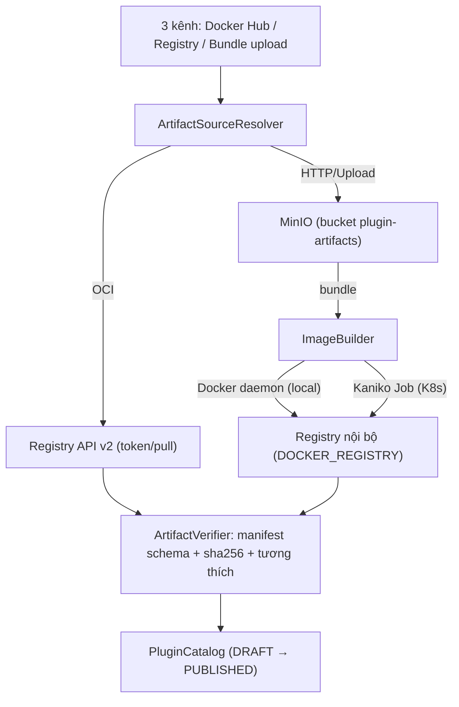
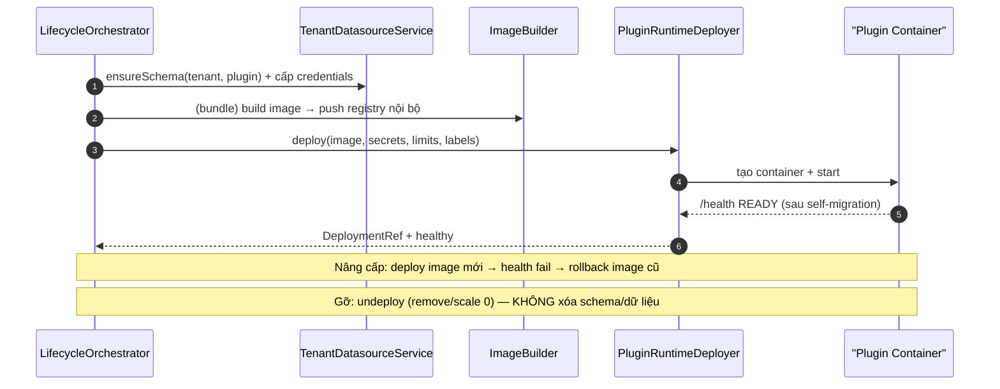

# [SOL-02] Nghiên Cứu Giải Pháp Kiến Trúc: Phân Phối Artifact, Deployer Container-per-Tenant & Cô Lập Dữ Liệu

- **Mã Tài Liệu**: SOL-02
- **Phụ Trách**: Solution Architect
- **Thuộc Sprint**: Sprint 03 - Plugin Manager, Plugin CLI & Cơ Chế Phân Phối Plugin
- **Tài Liệu Nguồn**: [CONF-01](../04_confirmation/CONF-01_sprint_03_scope.md), [ANL-03 v1.4](../02_analysis/ANL-03_plugin_distribution_and_installation.md), [BENCH-02](../03_benchmarks/BENCH-02_plugin_distribution_cli_ui_and_isolation.md)
- **Trạng Thái**: Hoàn thành — Chờ duyệt để chuyển sang Bước 6

---

## 1. Mục Tiêu Kỹ Thuật

1. Hiện thực **3 kênh đăng ký artifact** (Docker Hub / Image Registry / JAR + Web bundle) với xác minh manifest + checksum, quy tất cả về **container image**.
2. Hiện thực **Deployer tự động container-per-tenant** trên 2 backend: **Kubernetes API** (staging/prod) và **Docker Engine API** (local dev) — theo quyết định Gate.
3. Hiện thực **Tenant Datasource Router** cấp schema/database riêng theo tenant + DB role least privilege; **plugin tự migrate** trong không gian của mình.
4. Dùng **MinIO là lưu trữ chính toàn hệ thống** cho artifact/tệp; credentials registry đa phạm vi platform/tenant, mã hóa.

---

## 2. Pipeline Phân Phối Artifact

### 2.1. Sơ Đồ Thành Phần



### 2.2. Các Thành Phần

| Thành Phần | Trách Nhiệm | Ghi Chú |
| :--- | :--- | :--- |
| `ArtifactSourceResolver` | Phân giải nguồn: OCI ref, registry URL + credential, file upload | Chuẩn hóa về `ResolvedArtifact {type, ref, digest, checksum, manifest}` |
| `OciRegistryClient` | Pull manifest/config/layer metadata, xác thực token (Docker Hub/Registry v2) | Chỉ đọc metadata + `plugin.json`, không tải toàn bộ layer khi chỉ đăng ký |
| `BundleIngestService` | Nhận zip JAR + Web, lưu MinIO, bóc manifest, kiểm tra cấu trúc | Stream upload, giới hạn dung lượng cấu hình |
| `ArtifactVerifier` | JSON-schema manifest, checksum SHA-256, SemVer, tương thích Core, phụ thuộc, trùng phiên bản | Trả `PluginErrorCode` chi tiết |
| `ImageBuilder` | Từ bundle → image chuẩn nền tảng (base runtime + JAR + Web assets), push registry nội bộ | Docker daemon local / Kaniko trong K8s |
| `PluginCatalogService` | Ghi `plugin_catalog`/`plugin_versions` (DRAFT → PUBLISHED) | Từ SOL-01 |
| `CredentialService` | Quản lý credentials đa phạm vi, chọn credential theo host + scope | Mã hóa AES-GCM, master key từ env/secret |

### 2.3. Xác Minh & An Toàn Chuỗi Cung Ứng

1. Manifest phải qua **JSON Schema** (`plugin.schema.json`) — nguồn sự thật cho FEAT-22 `validate`.
2. Checksum SHA-256 **bắt buộc** cho mọi artifact (bundle, JAR, web zip); image ghi kèm digest.
3. **Allowlist registry** (`openerp.plugin.registry-allowed-hosts`) + HTTPS bắt buộc (chống SSRF); host mới của tenant do Super Admin duyệt (Gate).
4. Giới hạn `max-artifact-size-mb`; chặn redirect lạ; timeout tải.
5. Chữ ký số (cosign/GPG) — **giai đoạn sau**; thiết kế chừa trường `signature` trong manifest.

---

## 3. Tenant Datasource Router & Cô Lập Dữ Liệu

### 3.1. Mô Hình

| `storage_model` | Mô Tả | Áp Dụng | Đơn Vị Dữ Liệu |
| :--- | :--- | :--- | :--- |
| `DEDICATED_SCHEMA` | Schema riêng `tenant_<short>` trên cluster chung | Mặc định cho plugin | 1 schema/tenant dùng chung cho mọi plugin? **Không** — mỗi plugin 1 schema riêng: `tenant_<short>_<plugin_key>` |
| `DEDICATED_DATABASE` | Database riêng cho tenant | Enterprise | Mỗi plugin có schema riêng trong DB riêng |
| `SHARED_SCHEMA_RLS` | Shared + RLS | **Chỉ dữ liệu Core** (không dùng cho plugin) | — |

> **Tinh chỉnh quan trọng so với ANL-03**: để cô lập cả **giữa các plugin** (tránh plugin A đọc/ghi bảng của plugin B trong cùng schema tenant), mỗi plugin nhận **schema riêng**: `tenant_<short>_<plugin_key>`; DB role cũng cấp theo `(tenant, plugin)`. Điều này tăng số schema nhưng đảm bảo least privilege triệt để và đơn giản hóa purge/nhận diện dữ liệu mồ côi.

### 3.2. Provisioning & Credentials

1. `TenantDatasourceService.ensureSchema(tenantId, pluginKey)`:
   - `CREATE SCHEMA IF NOT EXISTS tenant_<short>_<plugin_key>`;
   - `CREATE ROLE` (nếu chưa có) + `GRANT USAGE, CREATE ON SCHEMA ...` + thu hồi mọi quyền ngoài phạm vi; role **không** có quyền trên `public` hay schema khác;
   - Sinh mật khẩu ngẫu nhiên, lưu mã hóa trong `plugin_credentials` (scope TENANT, gắn tenant+plugin).
2. Khi deploy container, Deployer inject secrets:
   - `TENANT_ID`, `PLUGIN_KEY`, `DB_URL`, `DB_SCHEMA`, `DB_USER`, `DB_PASSWORD` (ephemeral/rotatable);
   - Plugin dùng Flyway (đóng gói trong artifact) tự chạy migration trong schema của mình khi khởi động — **Core không kết nối schema plugin**.
3. **Connection pool**: Core **không** mở pool tới schema plugin ⇒ không phát sinh vấn đề pool theo tenant ở Core. Mỗi container plugin tự quản pool nhỏ (cấu hình qua env `DB_POOL_MAX` — mặc định 5).
4. **Backup/restore theo tenant**: dùng `pg_dump -n tenant_<short>_<plugin_key>` (script vận hành) — thiết kế hỗ trợ ở Bước 6/7.

### 3.3. Hệ Quả & Đánh Đổi

- **Ưu**: cô lập migration tuyệt đối; least privilege; purge/dọn dẹp theo schema; backup theo tenant; phù hợp container-per-tenant.
- **Nhược**: số schema tăng theo `tenant × plugin`; cần script vận hành + giám sát; migration Core không đụng schema plugin.
- **Giảm thiểu**: chỉ tạo schema **khi tenant thực sự cài plugin** (lazy provisioning); dọn schema chỉ trong luồng purge (ngoài Sprint 03); giám sát số schema/DB.

---

## 4. Deployer Container-per-Tenant

### 4.1. Trừu Tượng Hóa

```
interface PluginRuntimeDeployer {
  DeploymentRef deploy(DeployRequest req);      // tenant, plugin, version, image, secrets, limits
  void undeploy(DeploymentRef ref);             // giữ dữ liệu
  HealthStatus health(DeploymentRef ref);
  void rollback(DeploymentRef ref, String previousImage);
}
```

| Implementation | Môi Trường | Cơ Chế |
| :--- | :--- | :--- |
| `DockerRuntimeDeployer` | Local dev | Docker Engine API: create/start/stop/remove container; network `openerp-net`; env secrets; healthcheck |
| `KubernetesRuntimeDeployer` | Staging/Production | K8s API (fabric8 client hoặc Quarkus Kubernetes client): Deployment + Service + ConfigMap/Secret + labels; readiness/liveness probes; resource limits |

### 4.2. Quy Ước Container

- **Labels**: `app=openerp-plugin`, `tenant_id`, `plugin_key`, `plugin_version`, `managed-by=plugin-manager`.
- **Tài nguyên**: `resources.limits` CPU/RAM theo plugin (default cấu hình) + override theo plan/tenant (Gate câu 3).
- **Secrets**: inject qua env (Docker) / Secret ref (K8s); không log giá trị.
- **Mạng**: container chỉ expose cổng HTTP nội bộ; Core proxy/gateway truy cập; NetworkPolicy (K8s) giới hạn egress mặc định.
- **Health**: endpoint `/health` chuẩn; readiness fail → `INSTALL_FAILED`; upgrade fail → rollback image cũ.

### 4.3. Luồng Deploy & Rollback



### 4.4. Cấu Hình Đề Xuất (application.properties)

```
openerp.plugin.registry-allowed-hosts=                      # CSV allowlist
openerp.plugin.max-artifact-size-mb=512
openerp.plugin.image-builder=docker|kaniko                   # theo profile
openerp.plugin.deployer=docker|kubernetes                    # theo profile
openerp.plugin.internal-registry=${DOCKER_REGISTRY:openerp-registry.local}
openerp.plugin.resources.default-cpu=500m
openerp.plugin.resources.default-memory-mb=512
openerp.plugin.runtime-max-versions-per-plugin=3
openerp.storage.minio.endpoint=... / access-key / secret-key / bucket=plugin-artifacts
```

---

## 5. MinIO — Lưu Trữ Chính Toàn Hệ Thống (Chốt Gate)

| Hạng Mục | Thiết Kế |
| :--- | :--- |
| Vai trò | Lưu artifact bundle, file plugin, và **là kho lưu trữ chính** cho tệp/dữ liệu không cấu trúc của toàn hệ thống |
| Buckets đề xuất | `plugin-artifacts` (bundle/JAR/web), `tenant-files` (đính kèm nghiệp vụ — mở rộng sau), `audit-cold` (phục vụ TASK-293 sau này) |
| Bảo mật | Access key riêng cho Core; presigned URL khi cần tải; SSE; versioning bucket |
| Local dev | Docker Compose profile `storage` — `make infra-storage`; tài liệu hóa trong deployment guide |
| Dọn dẹp | Artifact của phiên bản bị gỡ chỉ xóa khi không còn tenant dùng (`PLUGIN_IN_USE_BY_TENANTS`) |

---

## 6. Rủi Ro Kỹ Thuật & Giảm Thiểu

| Rủi Ro | Mức | Giảm Thiểu |
| :--- | :---: | :--- |
| Kaniko/Docker build thất bại giữa chừng | High | Build trong job riêng có log; không ghi catalog PUBLISHED khi build lỗi; retry idempotent |
| Rò rỉ secret qua log/env | Critical | Không log secret; dùng Secret manager của nền tảng; audit truy cập credential |
| Schema/role tồn đọng khi lỗi provisioning | Medium | Provision idempotent (`IF NOT EXISTS`); dọn role thừa khi purge; giám sát |
| Tranh chấp cổng/tên container giữa tenant | Medium | Tên theo `plugin-<key>-<tenantShort>`; kiểm tra tồn tại trước deploy |
| SSRF qua registry URL | Critical | Allowlist host + HTTPS + chặn redirect + timeout (đã chốt) |
| K8s RBAC quá rộng | Critical | ServiceAccount chỉ có quyền trong namespace nghiệp vụ; tài liệu hóa tại deployment guide |

---

## 7. Kết Luận & Bàn Giao Sang Bước 6

- **Chọn**: `ArtifactVerifier` + `ImageBuilder` (Docker/Kaniko) + `PluginRuntimeDeployer` (Docker/K8s) + `TenantDatasourceService` (schema-per-tenant-per-plugin) + MinIO.
- **Bước 6 cần đặc tả**: DDL `plugin_credentials`/`plugin_catalog`/`plugin_versions`; API đăng ký artifact + deploy + trạng thái; UI Drawer 3 kênh; tài liệu cấu hình Deployer/MinIO.
- **Điểm chỉnh so với ANL-03**: schema tách theo **plugin** (không chỉ theo tenant) — cần khách hàng/BA xác nhận tại mục 8.

## 8. Điểm Cần BA/Khách Hàng Xác Nhận (Không Chặn Bước 6)

| # | Điểm | Đề Xuất Architect |
| :---: | :--- | :--- |
| 1 | Schema riêng theo `(tenant, plugin)` thay vì mỗi tenant một schema | **Đồng ý** — an toàn hơn, hỗ trợ purge/dọn dẹp theo plugin; đã phản ánh vào ANL-03 nếu được chấp thuận |
| 2 | Registry nội bộ mặc định (`DOCKER_REGISTRY`) cho image build từ bundle | Giữ nguyên cấu hình hiện có, ghi rõ trong deployment guide |
