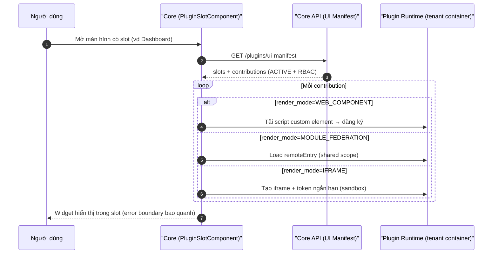

# [SOL-03] Nghiên Cứu Giải Pháp Kiến Trúc: UI Extension Runtime (WC/MF/iframe) & Plugin CLI (Node/npm)

- **Mã Tài Liệu**: SOL-03
- **Phụ Trách**: Solution Architect
- **Thuộc Sprint**: Sprint 03 - Plugin Manager, Plugin CLI & Cơ Chế Phân Phối Plugin
- **Tài Liệu Nguồn**: [CONF-01](../04_confirmation/CONF-01_sprint_03_scope.md), [ANL-02 v1.3](../02_analysis/ANL-02_plugin_scaffold_cli.md), [ANL-03 v1.4](../02_analysis/ANL-03_plugin_distribution_and_installation.md), [BENCH-02](../03_benchmarks/BENCH-02_plugin_distribution_cli_ui_and_isolation.md)
- **Trạng Thái**: Hoàn thành — Chờ duyệt để chuyển sang Bước 6

---

## 1. Mục Tiêu Kỹ Thuật

1. Hiện thực **hai chế độ hiển thị Web**: màn hình riêng (route/menu) và **UI Contribution** nhúng vào màn hình có sẵn của Core/plugin khác, với kỹ thuật **Web Components + Module Federation** (chốt Gate), **iframe sandbox** là chế độ dự phòng; **áp dụng cả plugin riêng của tenant**.
2. Hiện thực **Plugin CLI Node/npm** đầy đủ vòng đời nhà phát triển: `create`, `generate entity/menu/ui-contribution`, **`dev`** (bắt buộc — chốt Gate), `validate`, `package`, `link`, `inspect`, `publish` (nếu kịp).
3. Đảm bảo an toàn khi nhúng JS bên thứ ba vào origin Core: `render_mode` per contribution, CSP, error boundary, Shadow DOM, shared-lib version pin, RBAC, audit.

---

## 2. UI Extension Runtime

### 2.1. Khái Niệm & Dữ Liệu

| Khái Niệm | Khai Báo Ở | Ví Dụ |
| :--- | :--- | :--- |
| **Screen (màn hình riêng)** | `plugin.json → ui.screens[]` | `/apps/sales/orders` + menu "Bán hàng" |
| **UI Slot (điểm mở rộng)** | Host khai báo: Core (chuẩn) hoặc plugin (`ui.slots[]`) | `core.dashboard.widgets`, `crm.customer.detail.tabs` |
| **UI Contribution** | `plugin.json → ui.contributions[]` | Widget "Doanh thu hôm nay" vào `core.dashboard.widgets` |
| **Render Mode** | `render_mode = WEB_COMPONENT \| MODULE_FEDERATION \| IFRAME` | Quyết định cách host nạp |

Dữ liệu runtime: `plugin_ui_slots` (registry) + manifest phiên bản (catalog) → tổng hợp thành **UI Manifest API** cho tenant/user hiện tại (chỉ plugin `ACTIVE` + có quyền).

### 2.2. Kiến Trúc Host Runtime (thư viện dùng chung `src/frontend/shared`)

```
shared/plugin-host/
├── plugin-slot.component.{ts,html}        # Render 1 slot, resolve contributions
├── contribution-outlet.component.{ts,html} # Chọn loader theo render_mode + error boundary
├── loaders/
│   ├── web-component-loader.ts            # nạp script, đăng ký custom element, gắn vào DOM
│   ├── module-federation-loader.ts        # nạp remote entry, resolve exposed module (shared scope)
│   └── iframe-loader.ts                   # tạo iframe + sandbox attrs + postMessage bridge
├── ui-manifest.service.ts                 # GET /api/v1/plugins/ui-manifest + cache
└── plugin-bridge.ts                       # theme/i18n/auth context protocol
```

- **Web Component**: plugin export custom element (Angular `@angular/elements`); host chèn thẻ `<op-plugin-xxx>`; **Shadow DOM** cô lập CSS; contract: tag name, inputs/outputs, theme via CSS custom properties.
- **Module Federation**: plugin build remote (`remoteEntry.js`) expose module theo contract; host dùng `@module-federation/runtime` để nạp **với shared scope version pin** (Angular core, rxjs, shared lib); contribution là một Angular component/standalone mount.
- **iframe sandbox**: dùng khi plugin không hỗ trợ WC/MF hoặc cần cô lập tối đa; URL do Core proxy cấp kèm **token ngắn hạn**; bridge `postMessage` (theme, ngôn ngữ, resize, điều hướng).

> **Ngoại lệ thư viện**: `@module-federation/runtime` là phụ thuộc bắt buộc cho cơ chế MF (chuẩn công nghiệp) — ghi nhận ngoại lệ có kiểm soát; các phần còn lại tự xây dựng trên Angular/Tailwind.

### 2.3. Luồng Nạp Contribution



### 2.4. Nguyên Tắc An Toàn (Bắt Buộc)

| Lớp | Biện Pháp |
| :--- | :--- |
| Kiểm soát tải | Chỉ contribution của plugin `ACTIVE` + entitlement + quyền người dùng; origin lấy từ UI Manifest (không nhận URL tùy ý từ client) |
| CSP | `script-src`/`connect-src`/`frame-src` allowlist origin runtime plugin (cấu hình động theo tenant) |
| Cô lập | Shadow DOM (WC), sandbox attrs + `allow-same-origin` hạn chế (iframe), shared scope version pin (MF) |
| Chịu lỗi | Error boundary per contribution; 1 contribution lỗi không làm hỏng màn hình Core |
| Phiên | Token ngắn hạn ký bởi Core cho iframe; WC/MF gọi API qua interceptor gắn JWT hiện có |
| Theme/i18n | CSS custom properties + event `language-changed`; không hardcode màu/chuỗi |
| Audit | Ghi nhận bật/tắt contribution, lỗi tải (telemetry tối thiểu) |

### 2.5. Đánh Đổi Đã Chấp Nhận

- WC/MF chạy trong origin Core ⇒ rủi ro bảo mật cao hơn iframe; đã chốt cho phép với biện pháp kỹ thuật bắt buộc + plugin riêng vẫn qua xác minh/audit/khóa.
- Shared-lib version pin cần quy trình: mỗi lần Core nâng Angular/shared-lib lớn, phải kiểm thử ma trận với các major version plugin đang chạy (thêm vào QA matrix).

---

## 3. Plugin CLI (Node.js / npm)

### 3.1. Kiến Trúc

- **Runtime**: Node ≥ 22 LTS, TypeScript, build ra JS; phát hành npm **`@open-erp/cli`** — **CLI chung của hệ sinh thái** (nhóm lệnh plugin là nhóm đầu tiên), chạy `npx` hoặc cài global.
- **Phụ thuộc tối thiểu (dev tooling — ngoại lệ có kiểm soát)**: `commander` (parse lệnh), `prompts` (interactive), `ajv` (JSON Schema manifest), `execa` (gọi docker/git), `tar`/`adm-zip` (bundle). Không dùng framework nặng.
- **Cấu trúc module**:

```
open-erp-cli/
├── bin/open-erp.js
├── src/
│   ├── commands/        # create, generate/*, dev, validate, package, link, inspect, publish
│   ├── core/            # manifest-schema, semver, checksum(sha256), template-engine, git
│   ├── packaging/       # image-builder (docker build), bundle-builder (zip + checksums), k8s-manifests
│   ├── dev/             # compose-generator, watch, core-proxy, tenant-dev-context
│   └── templates/       # template bundle versioned (backend/, web/, mobile/, deploy/, ci/)
└── test/                # smoke test (node --test) cho create/validate/package
```

### 3.2. Đặc Tả Lệnh (MVP Sprint 03)

| Lệnh | Tóm Tắt Kỹ Thuật |
| :--- | :--- |
| `create` | Copy template + thay token (id, name, package, core-version, db, packaging), `git init`, in bước tiếp theo |
| `generate entity` | Template backend + migration idempotent + registry entity + permission + i18n; merge `plugin.json` an toàn |
| `generate menu` | Cập nhật `ui.screens[]` + route stub + i18n |
| `generate ui-contribution` | Cập nhật `ui.contributions[]` (`slot`, `render_mode`) + stub tương ứng (WC/MF/iframe) + i18n |
| `dev` **(bắt buộc)** | Sinh `docker-compose.dev.yml` (container plugin + Postgres schema dev + MinIO nếu cần) + chạy Quarkus dev / Angular dev server + proxy tới `--core-url`; watch & hot reload; tenant dev context tự tạo |
| `validate` | JSON Schema + SemVer + permission format + slot tồn tại + trùng entity |
| `package` | Build JAR + Web → Dockerfile build image (hoặc bundle zip) → **checksum SHA-256** → manifest phát hành → K8s manifests |
| `link` | `git submodule add <repo> plugins/<id>` trong repo chính |
| `inspect` | Đọc manifest/checksum artifact không cần cài |
| `publish` | Push image lên registry (nếu kịp trong sprint) |

### 3.3. Template Bundle & Versioning

- Template nằm trong package npm, có `template.json` (version, `core_compatibility`, danh sách biến) → ghi `template_version` vào `plugin.json`.
- Khi Core đổi hợp đồng (API envelope, manifest schema), phát hành template mới; CLI cảnh báo nếu template cũ hơn Core.
- CI nền tảng chạy **smoke test template** (create → build → test backend) mỗi khi Core đổi hợp đồng.

### 3.4. An Toàn & Chất Lượng CLI

- Không kết nối production; không chứa credentials; `--dry-run` không ghi file; dọn file khi lỗi.
- Exit code rõ ràng; `--non-interactive` cho CI.
- Test: smoke test Node (không áp dụng chính sách cấm unit test frontend vì đây là dev tooling) — tối thiểu cho `create`/`validate`/`package --dry-run`.

---

## 4. Rủi Ro Kỹ Thuật & Giảm Thiểu

| Rủi Ro | Mức | Giảm Thiểu |
| :--- | :---: | :--- |
| Xung đột shared lib giữa Core và MF remote | High | Version pin trong shared scope; contract version; test ma trận; cảnh báo khi `validate` phát hiện lệch |
| Contribution lỗi làm treo màn hình Core | High | Error boundary per contribution; timeout tải; fallback "không thể hiển thị" |
| Rò rỉ CSS/JS ra ngoài vùng slot | Medium | Shadow DOM (WC); style isolation; review theme tokens |
| `dev` phức tạp do container-per-tenant | Medium | MVP chỉ Docker Compose + proxy Core dev; tài liệu hóa; không hỗ trợ K8s local |
| Template lỗi thời | Medium | Template versioning + smoke test CI + cảnh báo CLI |
| Token iframe bị lạm dụng | High | Token ngắn hạn, audience/origin gắn tenant+plugin; verify ở plugin runtime |

---

## 5. Kết Luận & Bàn Giao Sang Bước 6

- **Chọn**: WC + MF là kỹ thuật chính, iframe sandbox dự phòng; loader trong thư viện shared; UI Manifest API là nguồn dữ liệu; CLI Node/npm với 10 lệnh (gồm `dev`).
- **Bước 6 cần đặc tả**: hợp đồng chi tiết WC/MF/iframe (tag name, exposed module, token protocol); JSON Schema `plugin.schema.json`; danh sách API UI Manifest; UI Slot Registry; thiết kế CLI template & command help; kế hoạch test smoke.

## 6. Điểm Cần BA/Khách Hàng Xác Nhận (Không Chặn Bước 6)

| # | Điểm | Đề Xuất Architect |
| :---: | :--- | :--- |
| 1 | Thêm phụ thuộc `@module-federation/runtime` vào shared (ngoại lệ chính sách hạn chế thư viện) | **Đồng ý** — bắt buộc cho cơ chế MF; các phần khác tự xây |
| 2 | Smoke test Node cho CLI (không vi phạm chính sách cấm unit test frontend) | **Đồng ý** — tối thiểu, chạy trong CI |
| 3 | MVP `dev` chỉ hỗ trợ Docker Compose (không K8s local) | **Đồng ý** — phù hợp môi trường dev hiện tại |
