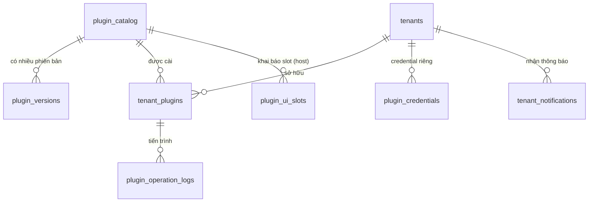

# [DES-03-DB] Thiết Kế Chi Tiết Cơ Sở Dữ Liệu: Plugin Manager, Phân Phối & Vòng Đời Plugin

- **Mã Tài Liệu**: DES-03-DB
- **Phụ Trách**: Solution Architect Agent
- **Thuộc Sprint**: Sprint 03 - Plugin Manager, Plugin CLI & Cơ Chế Phân Phối Plugin
- **Hệ Quản Trị CSDL**: PostgreSQL 16+
- **Schema**: `public` (dữ liệu quản trị plugin) + schema riêng theo tenant cho **dữ liệu nghiệp vụ của plugin** (`tenant_<short>_<plugin_key>` — do plugin tự tạo/migrate)
- **Ngày Hoàn Thành**: 2026-09-19
- **Tài Liệu Nguồn**: [SOL-01](../../05_solutions/SOL-01_plugin_manager_architecture_and_lifecycle.md), [SOL-02](../../05_solutions/SOL-02_plugin_distribution_runtime_and_isolation.md), [ANL-01 v1.4](../../02_analysis/ANL-01_plugin_manager_lifecycle.md)

---

## 1. Sơ Đồ Quan Hệ Thực Thể Tổng Thể (ERD)



> **Lưu ý kiến trúc**: `plugin_catalog` chỉ chứa **plugin tùy chọn** (Core modules tách riêng). Dữ liệu nghiệp vụ do plugin sinh ra **không nằm trong schema `public`** mà ở schema riêng từng `(tenant, plugin)` — Core không kết nối tới các schema này.

---

## 2. Chi Tiết Các Bảng Dữ Liệu

### 2.1. Bảng `plugin_catalog` (Danh Mục Plugin Tùy Chọn)

```sql
CREATE TABLE plugin_catalog (
    id UUID PRIMARY KEY DEFAULT gen_random_uuid(),
    plugin_key VARCHAR(100) NOT NULL,
    name_key VARCHAR(120) NOT NULL,
    description_key VARCHAR(120) NOT NULL,
    visibility VARCHAR(20) NOT NULL DEFAULT 'PLATFORM',          -- PLATFORM | TENANT_PRIVATE
    owner_tenant_id UUID REFERENCES tenants(id) ON DELETE CASCADE,
    default_install BOOLEAN NOT NULL DEFAULT FALSE,               -- Q5: cài mặc định cấp hệ thống
    locked BOOLEAN NOT NULL DEFAULT FALSE,                        -- plugin mặc định bắt buộc: không tắt/gỡ
    is_core BOOLEAN NOT NULL DEFAULT FALSE,                       -- luôn FALSE (Core tách riêng — Q4)
    entitlement_plans JSONB NOT NULL DEFAULT '[]'::jsonb,         -- ["STANDARD","ENTERPRISE"]
    created_by UUID,
    created_at TIMESTAMPTZ NOT NULL DEFAULT CURRENT_TIMESTAMP,
    updated_at TIMESTAMPTZ NOT NULL DEFAULT CURRENT_TIMESTAMP,
    CONSTRAINT chk_plugin_visibility CHECK (
        (visibility = 'PLATFORM'      AND owner_tenant_id IS NULL     AND is_core = FALSE)
        OR
        (visibility = 'TENANT_PRIVATE' AND owner_tenant_id IS NOT NULL AND is_core = FALSE AND default_install = FALSE)
    )
);

-- Khóa duy nhất: plugin nền tảng unique toàn cục; plugin riêng unique theo tenant
CREATE UNIQUE INDEX uq_plugin_catalog_platform_key
    ON plugin_catalog (plugin_key) WHERE visibility = 'PLATFORM';
CREATE UNIQUE INDEX uq_plugin_catalog_tenant_key
    ON plugin_catalog (owner_tenant_id, plugin_key) WHERE visibility = 'TENANT_PRIVATE';

CREATE INDEX idx_plugin_catalog_default_install ON plugin_catalog (default_install) WHERE visibility = 'PLATFORM';
CREATE INDEX idx_plugin_catalog_owner ON plugin_catalog (owner_tenant_id) WHERE visibility = 'TENANT_PRIVATE';
```

### 2.2. Bảng `plugin_versions` (Phiên Bản Bất Biến)

```sql
CREATE TABLE plugin_versions (
    id UUID PRIMARY KEY DEFAULT gen_random_uuid(),
    catalog_id UUID NOT NULL REFERENCES plugin_catalog(id) ON DELETE CASCADE,
    version VARCHAR(32) NOT NULL,                               -- SemVer: MAJOR.MINOR.PATCH
    release_status VARCHAR(20) NOT NULL DEFAULT 'DRAFT',        -- DRAFT | PUBLISHED | DEPRECATED | BLOCKED
    core_compatibility VARCHAR(64) NOT NULL,                    -- ví dụ: >=1.0.0 <2.0.0
    dependencies JSONB NOT NULL DEFAULT '[]'::jsonb,            -- [{"key":"inventory","min_version":"1.1.0"}]
    platforms JSONB NOT NULL DEFAULT '{}'::jsonb,               -- {"desktop":{...},"mobile":{...}}
    permissions JSONB NOT NULL DEFAULT '[]'::jsonb,             -- ["sales:order:read", ...]
    entities JSONB NOT NULL DEFAULT '[]'::jsonb,                -- [{"name":"SaleOrder","table":"...","public_fields":[...]}]
    ui_manifest JSONB NOT NULL DEFAULT '{}'::jsonb,             -- {"screens":[...],"slots":[...],"contributions":[...]}
    distribution JSONB NOT NULL DEFAULT '{}'::jsonb,            -- {"type":"DOCKER_HUB|IMAGE_REGISTRY|JAR_BUNDLE","image_ref":"...","digest":"sha256:...","checksum":"...","bundle_ref":"minio://...","size_bytes":123}
    manifest JSONB NOT NULL,                                    -- plugin.json gốc (bất biến sau công bố)
    template_version VARCHAR(32),
    created_by UUID,
    created_at TIMESTAMPTZ NOT NULL DEFAULT CURRENT_TIMESTAMP,
    published_at TIMESTAMPTZ,
    publish_reason TEXT,
    block_reason TEXT,
    blocked_at TIMESTAMPTZ,
    CONSTRAINT uq_plugin_version UNIQUE (catalog_id, version),
    CONSTRAINT chk_release_status CHECK (release_status IN ('DRAFT','PUBLISHED','DEPRECATED','BLOCKED'))
);

CREATE INDEX idx_plugin_versions_catalog_status ON plugin_versions (catalog_id, release_status);
```

### 2.3. Bảng `tenant_plugins` (MỘT BẢNG DUY NHẤT — Entitlement + Vòng Đời + Phiên Bản + Deploy)

```sql
CREATE TABLE tenant_plugins (
    id UUID PRIMARY KEY DEFAULT gen_random_uuid(),
    tenant_id UUID NOT NULL REFERENCES tenants(id) ON DELETE CASCADE,
    catalog_id UUID NOT NULL REFERENCES plugin_catalog(id) ON DELETE RESTRICT,
    plugin_key VARCHAR(100) NOT NULL,                           -- denormalized để tra cứu nhanh
    status VARCHAR(24) NOT NULL DEFAULT 'NOT_INSTALLED',
    installed_version VARCHAR(32),
    target_version VARCHAR(32),
    storage_model VARCHAR(24) NOT NULL DEFAULT 'DEDICATED_SCHEMA', -- DEDICATED_SCHEMA | DEDICATED_DATABASE
    storage_schema VARCHAR(63),                                 -- tenant_<short>_<plugin_key>
    deploy_ref JSONB NOT NULL DEFAULT '{}'::jsonb,              -- {"runtime":"kubernetes|docker","deployment":"...","service":"...","healthy":true}
    last_error_code VARCHAR(80),
    last_error_params JSONB,
    operation_id UUID,                                          -- thao tác đang chạy (nếu có)
    row_version INT NOT NULL DEFAULT 0,                         -- optimistic lock
    installed_at TIMESTAMPTZ,
    activated_at TIMESTAMPTZ,
    uninstalled_at TIMESTAMPTZ,
    created_at TIMESTAMPTZ NOT NULL DEFAULT CURRENT_TIMESTAMP,
    updated_at TIMESTAMPTZ NOT NULL DEFAULT CURRENT_TIMESTAMP,
    CONSTRAINT uq_tenant_plugin UNIQUE (tenant_id, plugin_key),
    CONSTRAINT chk_tenant_plugin_status CHECK (status IN (
        'NOT_INSTALLED','INSTALLING','ACTIVE','INACTIVE','UPGRADING',
        'INSTALL_FAILED','UNINSTALLING','UNINSTALLED'
    )),
    CONSTRAINT chk_tenant_plugin_storage CHECK (storage_model IN ('DEDICATED_SCHEMA','DEDICATED_DATABASE'))
);

CREATE INDEX idx_tenant_plugins_tenant_status ON tenant_plugins (tenant_id, status);
CREATE INDEX idx_tenant_plugins_plugin_status ON tenant_plugins (plugin_key, status);
CREATE INDEX idx_tenant_plugins_operation ON tenant_plugins (operation_id) WHERE operation_id IS NOT NULL;
```

> **Quan hệ entitlement**: sự tồn tại của dòng = tenant được cấp phép plugin; `status = 'NOT_INSTALLED'` = đã cấp phép nhưng chưa cài. Thu hồi entitlement = xóa dòng (chỉ khi chưa từng cài hoặc đã `UNINSTALLED`).

### 2.4. Bảng `plugin_credentials` (Credentials Đa Phạm Vi — Q7)

```sql
CREATE TABLE plugin_credentials (
    id UUID PRIMARY KEY DEFAULT gen_random_uuid(),
    scope VARCHAR(16) NOT NULL,                                 -- PLATFORM | TENANT
    tenant_id UUID REFERENCES tenants(id) ON DELETE CASCADE,
    name VARCHAR(100) NOT NULL,
    registry_host VARCHAR(255) NOT NULL,
    username VARCHAR(200),
    secret_cipher TEXT NOT NULL,                                -- AES-GCM (Base64)
    secret_nonce VARCHAR(64) NOT NULL,
    key_version INT NOT NULL DEFAULT 1,
    created_by UUID,
    created_at TIMESTAMPTZ NOT NULL DEFAULT CURRENT_TIMESTAMP,
    last_used_at TIMESTAMPTZ,
    CONSTRAINT chk_credential_scope CHECK (
        (scope = 'PLATFORM' AND tenant_id IS NULL)
        OR (scope = 'TENANT' AND tenant_id IS NOT NULL)
    )
);

CREATE UNIQUE INDEX uq_plugin_credentials_platform_host
    ON plugin_credentials (registry_host, name) WHERE scope = 'PLATFORM';
CREATE UNIQUE INDEX uq_plugin_credentials_tenant_host
    ON plugin_credentials (tenant_id, registry_host, name) WHERE scope = 'TENANT';
```

### 2.5. Bảng `plugin_ui_slots` (Registry UI Slot — DES-03-UI)

```sql
CREATE TABLE plugin_ui_slots (
    id UUID PRIMARY KEY DEFAULT gen_random_uuid(),
    slot_code VARCHAR(120) NOT NULL,                            -- core.dashboard.widgets, crm.customer.detail.tabs...
    host_type VARCHAR(16) NOT NULL,                             -- CORE | PLUGIN
    owner_plugin_key VARCHAR(100),                              -- plugin làm host (nếu host_type = PLUGIN)
    title_key VARCHAR(120) NOT NULL,
    contract_version VARCHAR(16) NOT NULL DEFAULT '1.0',
    allowed_render_modes JSONB NOT NULL DEFAULT '["WEB_COMPONENT","MODULE_FEDERATION","IFRAME"]'::jsonb,
    constraints JSONB NOT NULL DEFAULT '{}'::jsonb,             -- kích thước tối thiểu, số contribution tối đa...
    created_at TIMESTAMPTZ NOT NULL DEFAULT CURRENT_TIMESTAMP,
    CONSTRAINT uq_plugin_ui_slot_code UNIQUE (slot_code),
    CONSTRAINT chk_ui_slot_host CHECK (
        (host_type = 'CORE' AND owner_plugin_key IS NULL)
        OR (host_type = 'PLUGIN' AND owner_plugin_key IS NOT NULL)
    )
);
```

### 2.6. Bảng `plugin_operation_logs` (Vết Saga — Phục Vụ Chẩn Đoán/Recovery)

```sql
CREATE TABLE plugin_operation_logs (
    id BIGSERIAL PRIMARY KEY,
    operation_id UUID NOT NULL,
    tenant_id UUID,
    plugin_key VARCHAR(100) NOT NULL,
    operation VARCHAR(40) NOT NULL,                             -- INSTALL/UPGRADE/UNINSTALL/ENABLE/DISABLE/BLOCK/FORCE_UNINSTALL/BULK_APPLY
    step VARCHAR(60) NOT NULL,                                  -- PRE_FLIGHT/LEDGER/PROVISION_DATASOURCE/BUILD_IMAGE/DEPLOY/HEALTH/SEED_PERMISSIONS/ACTIVATE/COMPENSATE
    result VARCHAR(16) NOT NULL,                                -- STARTED | OK | FAILED | COMPENSATED
    detail JSONB NOT NULL DEFAULT '{}'::jsonb,
    created_at TIMESTAMPTZ NOT NULL DEFAULT CURRENT_TIMESTAMP,
    CONSTRAINT chk_op_result CHECK (result IN ('STARTED','OK','FAILED','COMPENSATED'))
);

CREATE INDEX idx_plugin_op_logs_operation ON plugin_operation_logs (operation_id, created_at);
CREATE INDEX idx_plugin_op_logs_plugin ON plugin_operation_logs (plugin_key, created_at DESC);
```

### 2.7. Bảng `tenant_notifications` (Thông Báo Trong Ứng Dụng — Q3)

```sql
CREATE TABLE tenant_notifications (
    id UUID PRIMARY KEY DEFAULT gen_random_uuid(),
    tenant_id UUID NOT NULL REFERENCES tenants(id) ON DELETE CASCADE,
    type VARCHAR(40) NOT NULL,                                  -- PLUGIN_BLOCKED | PLUGIN_FORCE_UNINSTALLED | PLUGIN_UPDATE_AVAILABLE | PLUGIN_INSTALL_FAILED
    title_code VARCHAR(120) NOT NULL,                           -- i18n code
    params JSONB NOT NULL DEFAULT '{}'::jsonb,
    severity VARCHAR(16) NOT NULL DEFAULT 'INFO',               -- INFO | WARNING | CRITICAL
    read_at TIMESTAMPTZ,
    created_at TIMESTAMPTZ NOT NULL DEFAULT CURRENT_TIMESTAMP,
    CONSTRAINT chk_notification_severity CHECK (severity IN ('INFO','WARNING','CRITICAL'))
);

CREATE INDEX idx_tenant_notifications_tenant_unread
    ON tenant_notifications (tenant_id, created_at DESC) WHERE read_at IS NULL;
```

### 2.8. Cập Nhật Bảng `tenants` (Bổ Sung Cấu Hình Plugin)

```sql
ALTER TABLE tenants
ADD COLUMN IF NOT EXISTS allow_custom_plugins BOOLEAN NOT NULL DEFAULT FALSE,   -- Q8 Gate: tenant tự đăng ký plugin riêng
ADD COLUMN IF NOT EXISTS storage_model VARCHAR(24) NOT NULL DEFAULT 'DEDICATED_SCHEMA';

CREATE INDEX IF NOT EXISTS idx_tenants_allow_custom_plugins ON tenants (allow_custom_plugins);
```

> `tenants.allowed_plugins` (Sprint 02) **được giữ tạm** để tương thích hợp đồng API `/quotas`, nhưng từ V3.0.1 nguồn sự thật là `tenant_plugins`; API suy ra `allowed_plugins` từ bảng mới. Trường cũ sẽ được deprecate và xóa ở sprint sau.

---

## 3. Enum Chuẩn Hóa (Đồng Bộ Java ↔ TypeScript)

| Enum Java (`core.enums`) / TS (`@shared/enums`) | Giá Trị |
| :--- | :--- |
| `PluginVisibility` | `PLATFORM`, `TENANT_PRIVATE` |
| `PluginReleaseStatus` | `DRAFT`, `PUBLISHED`, `DEPRECATED`, `BLOCKED` |
| `TenantPluginStatus` | `NOT_INSTALLED`, `INSTALLING`, `ACTIVE`, `INACTIVE`, `UPGRADING`, `INSTALL_FAILED`, `UNINSTALLING`, `UNINSTALLED` |
| `PluginStorageModel` | `DEDICATED_SCHEMA`, `DEDICATED_DATABASE` |
| `PluginDistributionType` | `DOCKER_HUB`, `IMAGE_REGISTRY`, `JAR_BUNDLE` |
| `PluginRenderMode` | `WEB_COMPONENT`, `MODULE_FEDERATION`, `IFRAME` |
| `PluginCredentialScope` | `PLATFORM`, `TENANT` |
| `PluginOperationType` | `INSTALL`, `UPGRADE`, `UNINSTALL`, `ENABLE`, `DISABLE`, `BLOCK`, `FORCE_UNINSTALL`, `BULK_APPLY`, `REGISTER_VERSION` |

---

## 4. Kế Hoạch Migration Flyway

| Phiên Bản | Nội Dung |
| :--- | :--- |
| `V3.0.0__plugin_manager_schema.sql` | Tạo 7 bảng mới + `ALTER tenants` + index/constraint + seed UI Slot chuẩn của Core (`core.dashboard.widgets`, `core.settings.sections`) |
| `V3.0.1__backfill_allowed_plugins.sql` | Backfill `tenants.allowed_plugins` → `tenant_plugins` (`NOT_INSTALLED`); bỏ qua key `core`; `ON CONFLICT DO NOTHING`; kèm script đối soát count |
| `V3.0.2__seed_official_plugins.sql` (tùy chọn) | Seed catalog cho plugin chính thức (`sales`, `inventory`, `accounting`, `crm`) ở trạng thái `DRAFT` phục vụ QA/dev |

**Backfill SQL**:
```sql
INSERT INTO tenant_plugins (tenant_id, catalog_id, plugin_key, status)
SELECT t.id, c.id, c.plugin_key, 'NOT_INSTALLED'
FROM tenants t
CROSS JOIN LATERAL jsonb_array_elements_text(t.allowed_plugins) AS k(plugin_key)
JOIN plugin_catalog c
  ON c.plugin_key = k.plugin_key
 AND c.visibility = 'PLATFORM'
WHERE k.plugin_key <> 'core'
ON CONFLICT (tenant_id, plugin_key) DO NOTHING;
```

**Kiểm chứng migration**: script đếm trước/sau (`jsonb_array_length(allowed_plugins)` vs số dòng `tenant_plugins`) — sai lệch phải bằng 0 (trừ `core`).

---

## 5. Quy Tắc Toàn Vẹn & Hiệu Năng

| # | Quy Tắc |
| :---: | :--- |
| 1 | `plugin_key` bất biến sau khi tạo catalog; xóa catalog chỉ khi `visibility = TENANT_PRIVATE` và chưa từng cài (hoặc đã `UNINSTALLED`). |
| 2 | Không xóa `plugin_versions` đang được tenant ghim (`installed_version`) → `PLUGIN_VERSION_IN_USE`. |
| 3 | `tenant_plugins` là nguồn sự thật entitlement; `TenantPluginAllowlistService` chỉ chấp nhận `status = 'ACTIVE'`. |
| 4 | Dữ liệu plugin KHÔNG có FK từ bảng Core → schema plugin; Core không truy vấn schema `tenant_*`. |
| 5 | Chỉ mục composite phục vụ marketplace (`tenant_id, status`) và governance (`plugin_key, status`). |
| 6 | `plugin_operation_logs` là bảng append-only; dọn theo retention (mặc định 90 ngày) bằng job. |
| 7 | Xóa tenant (`ON DELETE CASCADE`) chỉ xóa dữ liệu quản trị plugin; schema nghiệp vụ `tenant_*` do job purge tenant xử lý riêng (ngoài Sprint 03). |

---

## 6. Seed UI Slot Chuẩn Của Core (Sprint 03)

```sql
INSERT INTO plugin_ui_slots (slot_code, host_type, title_key, contract_version, constraints)
VALUES
 ('core.dashboard.widgets', 'CORE', 'PLUGIN_SLOT_CORE_DASHBOARD_WIDGETS', '1.0', '{"max_contributions":6,"min_height_px":120}'),
 ('core.settings.sections', 'CORE', 'PLUGIN_SLOT_CORE_SETTINGS_SECTIONS', '1.0', '{"max_contributions":10}')
ON CONFLICT (slot_code) DO NOTHING;
```

---

## 7. Bàn Giao Sang DES-03-API / DES-03-UI

- **DES-03-API** dùng các bảng trên để đặc tả endpoint (request/response/error code) cho 3 nhóm: Platform, Tenant, Shared (UI Manifest/Operations).
- **DES-03-UI** dùng `plugin_ui_slots` + `ui_manifest` để đặc tả slot/contribution + màn hình Marketplace/Portal.
- **DES-03-CFG** (nằm trong deployment guide ở Bước 7): cấu hình Deployer, MinIO, registry allowlist, credentials encryption key.
